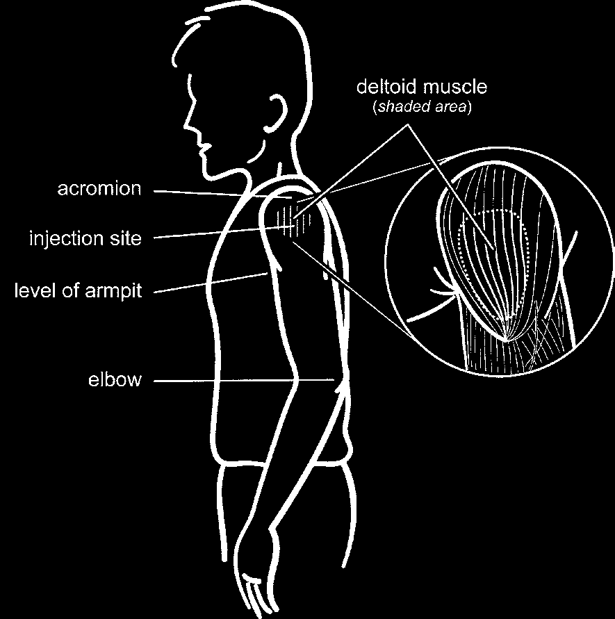
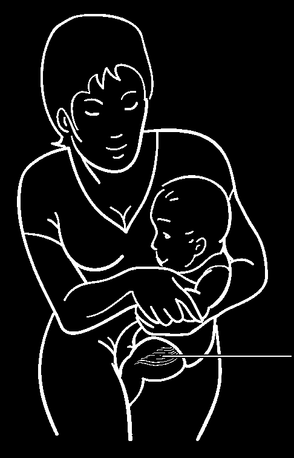
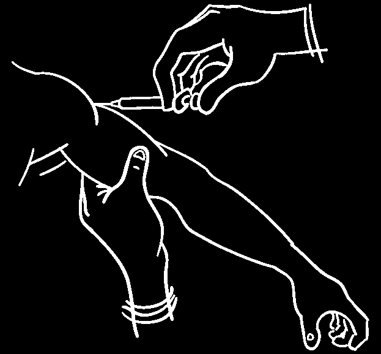
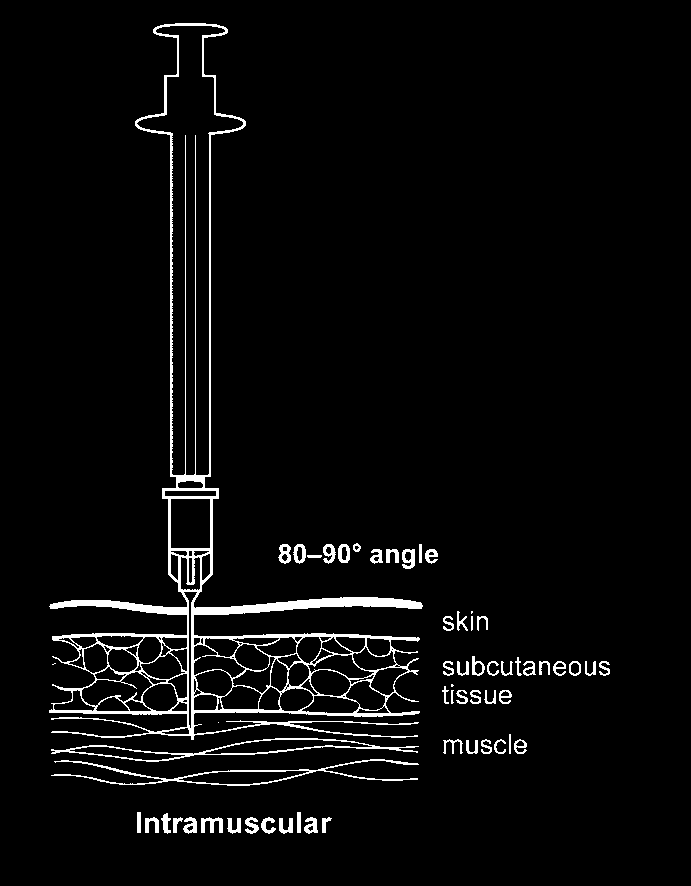
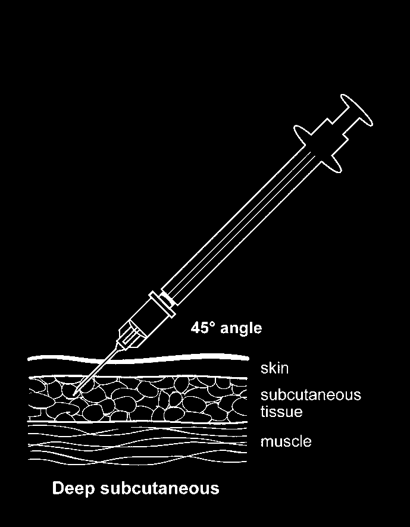
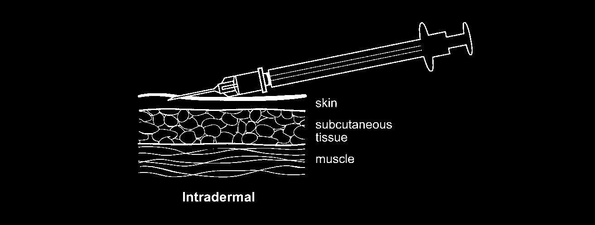

# Immunisation procedures

## Introduction

Recommendations on immunisation procedures are based on currently available evidence and experience of best practice. In some circumstances, this advice may differ from that in vaccine manufacturers' Summaries of Product Characteristics (SPCs). When this occurs, the recommendations in this book (which are based on current expert advice received from the Joint Committee on Vaccination and Immunisation (JCVI)) should be followed. Further guidance can be found at:
https://www.gmc-uk.org/guidance/ethical_guidance/prescriptions_faqs.asp

These Green Book recommendations and/or further advice in the Chief Medical Officer's (CMO's) letters and updates (https://www.dh.gov.uk/AboutUs/MinistersAndDepartmentLeaders/ChiefMedicalOfficer/fs/en) and/or in the NHS Purchasing and Supply Agency's vaccine update (https://www.pasa.nhs.uk/pharma/vaccines.stm) should be reflected in local protocols and Patient Group Directions (PGDs).

Doctors and nurses providing immunisations are professionally accountable for this work, as defined by their professional bodies. Nurses should follow the professional standards and guidelines as set out in *The Nursing and Midwifery Council code of professional conduct: standards for conduct, performance and ethics* and *Medicines management* (Nursing and Midwifery Council).

All healthcare professionals advising on immunisation or administering vaccines must have received specific training in immunisation, including the recognition and treatment of anaphylaxis. They should maintain and update their professional knowledge and skills through appropriate training.

More information is available in the Health Protection Agency's *National minimum standards for immunisation training 2005*.

## Preparation of vaccines

The recommended storage conditions are described in Chapter 3.

Each vaccine should be reconstituted and drawn up when required in order to avoid errors and maintain vaccine efficacy and stability. Vaccines should not be drawn up in advance of an immunisation session.

The vaccine must be checked to ensure that the right product and correct dose is used in the appropriate way for each individual. Vaccines must not be used after their expiry date.

Before use, the colour and composition of the vaccine must be examined to ensure that it conforms to the description as stated in its SPC.

Different vaccines must not be mixed in the same syringe unless specifically licensed and recommended for such use.

Freeze-dried (lyophilised) vaccines must be reconstituted with the correct volume of diluent, and supplied and used within the recommended period after reconstitution, as stated in the product's SPC.

Unless supplied in a pre-filled syringe, the diluent should be drawn up using an appropriately sized syringe and 21G needle (green) and added slowly to the vaccine to avoid frothing.

## Changing needles

Unless the vaccine is supplied in a pre-filled syringe with an integral needle, a new needle of a size appropriate to the individual patient should be used to inject the vaccine (see 'Choice of needle size' on page 29).

## Vaccine administration

Individuals giving vaccinations must have received training in the management of anaphylaxis, and must have immediate access to appropriate equipment. Adrenaline (epinephrine) must always be immediately available. Details on anaphylaxis are available in Chapter 8.

Before any vaccine is given, consent must be obtained (see Chapter 2) and suitability for immunisation must be established with the individual to be vaccinated, or their parent or carer.

### Prior to administration

Vaccinators should ensure that:

- there are no contraindications to the vaccine(s) being given
- the vaccinee or carer is fully informed about the vaccine(s) to be given and understands the vaccination procedure
- the vaccinee or carer is aware of possible adverse reactions (ADRs) and how to treat them.

### Route and site of administration

Injection technique, choice of needle length and gauge (diameter), and injection site are all important considerations, since these factors can affect both the immunogenicity of the vaccine and the risk of local reactions at the injection site, and are discussed in more detail below (pages 27–30).

#### Route of injection

Most vaccines should be given by intramuscular (IM) injection. Injections given intramuscularly, rather than deep subcutaneously, are less likely to cause local reactions (Diggle and Deeks, 2000; Mark _et al._, 1999). Vaccines should not be given intravenously.

Vaccines not given by the IM route include Bacillus Calmette-Guérin (BCG) vaccine, which is given by intradermal injection, Green Cross Japanese encephalitis and varicella vaccines, which are given by deep subcutaneous (SC) injection, and cholera vaccine, which is given by mouth.

For individuals with a bleeding disorder, vaccines normally given by an IM route should be given by deep subcutaneous injection to reduce the risk of bleeding.

#### Suitable sites for vaccination

The site should be chosen so that the injection avoids major nerves and blood vessels. The preferred sites for IM and SC immunisation are the anterolateral aspect of the thigh or the deltoid area of the upper arm (see Figure 4.1). The anterolateral aspect of the thigh is the preferred site for infants under one year old, because it provides a large muscle mass into which vaccines can be safely injected (see Figure 4.2). For BCG, the preferred site of injection is over the insertion of the left deltoid muscle; the tip of the shoulder must be avoided because of the increased risk of keloid formation at this site (see Figure 4.3).

Where two or more injections need to be administered at the same time, they should be given at separate sites, preferably in a different limb. If more than one injection is to be given in the same limb, they should be administered at least 2.5cm apart (American Academy of Pediatrics, 2003). The site at which each injection is given should be noted in the individual's records.

Immunisations should not be given into the buttock, due to the risk of sciatic nerve damage (Villarejo and Pascaul, 1993; Pigot, 1988) and the possibility of injecting the vaccine into fat rather than muscle. Injection into fatty tissue of the buttock has been shown to reduce the immunogenicity of hepatitis B (Shaw _et al._, 1989; Alves _et al._, 2001) and rabies (Fishbein _et al._, 1988) vaccines.

### Suitable sites for immunoglobulin administration

When a large-volume injection is to be given, such as a preparation of immunoglobulin, this should be administered deep into a large muscle mass. If more than 3ml is to be given to young children and infants, or more than 5ml to older children and adults, the immunoglobulin should be divided into smaller amounts and given into different sites (American Academy of Pediatrics, 2003). The upper outer quadrant of the buttock can be used for immunoglobulin injection.

Rabies immunoglobulin should be infiltrated into the site of the wound (see Chapter 27).

### Cleaning the skin

If the skin is clean, no further cleaning is necessary. Only visibly dirty skin needs to be washed with soap and water.

It is not necessary to disinfect the skin. Studies have shown that cleaning the skin with isopropyl alcohol reduces the bacterial count, but there is evidence that disinfecting makes no difference to the incidence of bacterial complications of injections (Del Mar _et al._, 2001; Sutton _et al._, 1999).

### Choice of needle size

For IM and SC injections, the needle needs to be sufficiently long to ensure that the vaccine is injected into the muscle or deep into subcutaneous tissue. Studies have shown that the use of 25mm needles can reduce local vaccine reactogenicity (Diggle _et al._, 2000, Diggle _et al._, 2006). The width of the needle (gauge) may also need to be considered. A 23-gauge or 25-gauge needle is recommended for intramuscular administration of most vaccines (Plotkin and Orenstein, 2008).

For intramuscular injections in infants, children and adults, therefore, a 25mm 23G (blue) or 25mm 25G (orange) needle should be used. Only in pre-term or very small infants is a 16mm needle suitable for IM injection. In larger adults, a longer length (e.g. 38mm) may be required, and an individual assessment should be made (Poland _et al._, 1997, Zuckerman, 2000).

Intradermal injections should only be administered using a 26G, 10mm (brown) needle.

**Standard UK needle gauges and lengths\***

| Colour | Gauge | Length |
|--------|-------|--------|
| Brown | 26G | 10mm (⅜") long |
| Orange | 25G | 16mm (⅝") long |
| | | 25mm (1") long |
| Blue | 23G | 25mm (1") long |
| Green | 21G | 38mm (1½") long |

\* *UK guidance on best practice in vaccine administration (2001)*

### Injection technique

IM injections should be given with the needle at a 90° angle to the skin and the skin should be stretched, not bunched. Deep SC injections should be given with the needle at a 45° angle to the skin and the skin should be bunched, not stretched. It is not necessary to aspirate the syringe after the needle is introduced into the muscle (WHO, 2004; Plotkin and Orenstein, 2004).

The BCG technique is specialised and the person giving the BCG vaccine requires specific training and assessment. The skin should be stretched between the thumb and forefinger of one hand and the needle inserted with the bevel upwards for about 2mm into the superficial layers of the dermis, almost parallel with the surface. The needle should be visible beneath the surface of the skin (see Figure 4.4).

During an intradermal injection, considerable resistance is felt and a raised, blanched bleb showing the tips of the hair follicles is a sign that the injection has been correctly administered. A bleb of 7mm in diameter is approximately equivalent to 0.1ml and is a useful indication of the volume that has been injected. If no resistance is felt, the needle should be removed and reinserted before more vaccine is given.

## Use of multi-dose vials

Some vaccines are specifically provided in multi-dose vials (e.g. BCG vaccine), which allows the vaccine to be administered from the same vial to a number of different individuals. These vaccines are clearly labelled as multi-dose vials and they are designed so that doses from the vials can be given to more than one individual. The length of time that a vial can be used for is specified in the SPC and this should be followed.

In contrast, most other products are licensed for use in one patient only. They are provided in vials intended for use as a single-dose and the contents should not be used to provide vaccination to more than one person. Therefore, the use of the residual product from these vials to administer to other patients is unlicensed and carries the risk of contamination.

Appropriate infection control and aseptic techniques should be used at all times and is particularly important when using multi-dose vials.

The following good practice guidance should be followed. The immuniser should make sure that:

- the expiry date has not passed
- vaccines are stored under appropriate cold chain conditions before and in between use
- the bung (vial septum) is visibly clean\*
- a sterile syringe and needle are used each time vaccine is withdrawn from the vial
- the needle is not left in the vial for multiple redraws
- the vial should be clearly marked with:
  - the date and time of reconstitution or first use
  - the initials of the person who reconstituted or first used the vial
  - the period that the vaccine can be used for (as defined in the SPC).

## Post-vaccination

Recipients of any vaccine should be observed for immediate ADRs. There is no evidence to support the practice of keeping patients under longer observation in the surgery.

Advice on the management of ADRs can be found in Chapter 8.

Suspected ADRs to vaccines should be reported to the Commission on Human Medicines using the Yellow Card scheme (described in detail in Chapter 9). For established vaccines, only serious suspected ADRs should be reported. For newly licensed vaccines labelled with an inverted black triangle (▼), serious and non-serious reactions should be reported. All suspected ADRs occurring in children should be reported.

\*Where there is visible contamination then the bung can be cleaned with an alcohol swab. However, the bung should be left to dry before using as it is the drying process that kills contaminating organisms and residual alcohol could contaminate/inactivate vaccine.

## Disposal of equipment

Equipment used for vaccination, including used vials and ampoules, should be properly disposed of at the end of a session by sealing in a proper, puncture-resistant 'sharps' box (UN-approved, BS 7320).

## Recording

Accurate, accessible records of vaccinations given are important for keeping individual clinical records, monitoring immunisation uptake and facilitating the recall of recipients of vaccines, if required.

The following information should be recorded accurately:

- vaccine name, product name, batch number and expiry date
- dose administered
- site(s) used – including, clear description of which injection was administered in each site, especially where two injections were administered in the same limb
- date immunisation(s) were given
- name and signature of vaccinator.

This information should be recorded in:

- patient-held record or Personal Child Health Record (PCHR, the Red Book) for children
- patient's GP record or other patient record, depending on location
- Child Health Information System
- practice computer system.

## References

- Alves AS, Nascimento CM and Granato CH _et al._ (2001) Hepatitis B vaccine in infants: a randomised controlled trial comprising gluteal versus anterolateral thigh muscle administration. *Rev Inst Med Trop Sao Paolo* **43**(3): 139–43.
- American Academy of Pediatrics (2003) Active immunisation. In: Pickering LK (ed.) *Red Book: 2003 Report of the Committee on Infectious Diseases*, 26th edition. Elk Grove Village, IL: American Academy of Pediatrics, p 33.
- Del Mar CB, Glasziou PP, Spinks AB and Sanders SL (2001) Is isopropyl alcohol swabbing before injection really necessary? *Med J Aust* **74**: 306.
- Diggle L and Deeks J (2000) Effect of needle length on incidence of local reactions to routine immunisation in infants aged four months: randomised controlled trial. *BMJ* **321**: 931–3.
- Diggle L, Deeks, JJ and Pollard AJ (2006) Effect of needle size on immunogenicity and reactogenicity of vaccines in infants: randomised controlled trial. *BMJ* **333**: 571–4.
- Fishbein DB, Sawyer LA, Reid-Sanden FL and Weir EH (1988) Administration of the human diploid-cell rabies vaccine in the gluteal area. *NEJM* **318**(2): 124–5.
- Mark A, Carlsson RM and Granstrom M (1999) Subcutaneous versus intramuscular injection for booster DT vaccination of adolescents. *Vaccine* **17**(15–16): 2067–72.
- Nursing and Midwifery Council *NMC code of professional conduct: standards for conduct, performance and ethics*. https://www.nmc-uk.org
- Nursing and Midwifery Council. *Medicines management*. https://www.nmc-uk.org
- Pigot J (1988) Needling doubts about where to vaccinate. *BMJ* **297**: 1130.
- Plotkin SA and Orenstein WA (eds) (2008) *Vaccines*, 5th edition. Philadelphia: WB Saunders Company.
- Poland GA, Borrud A, Jacobson RM, McDermott K, Wollan PC, Brakke D and Charboneau JW (1997) Determination of deltoid fat pad thickness: implications for needle length in adult immunization. *JAMA* **277**: 1709–11.
- Shaw FE, Guess HA, Roets JM _et al._ (1989) Effect of anatomic injection site, age and smoking on the immune response to hepatitis B vaccination. *Vaccine* **7**: 425–30.
- Sutton CD, White SA, Edwards R and Lewis MH (1999) A prospective controlled trial of the efficacy of isopropyl alcohol wipes before venesection in surgical patients. *Ann R Coll Surg Engl* **81**(3): 183–6.
- The Vaccine Administration Taskforce. *UK guidance on best practice in vaccine administration (2001)* London: Shire Hall Communications.
- Villarejo FJ and Pascaul AM (1993) Injection injury of the sciatic nerve (370 cases). *Child's Nervous System* **9**: 229–32.
- WHO (2000) WHO Policy Statement: The use of opened multi-dose vials of vaccine in subsequent immunization sessions. https://www.who.int/vaccines-documents/DocsPDF99/www9924.pdf. Accessed: Feb. 2011.
- World Health Organization (2004) *Immunization in practice: a guide for health workers*. WHO.
- Zuckerman JN (2000) The importance of injecting vaccine into muscle. *BMJ* **321**: 1237–8.
