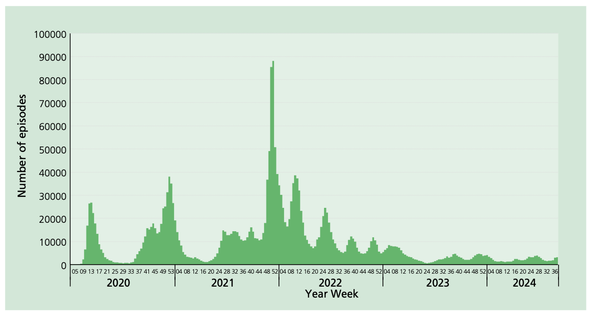
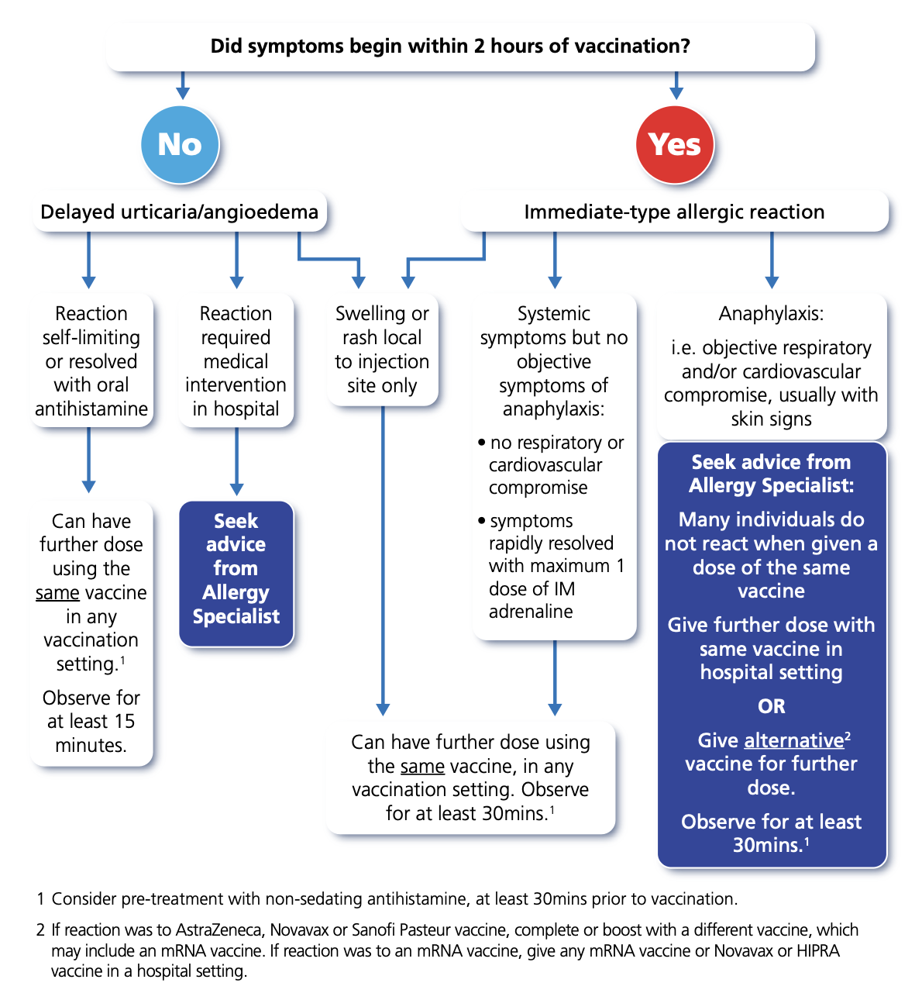

# COVID-19 - SARS-CoV-2

NOTIFIABLE

## The disease

COVID-19 is a disease of the respiratory tract caused by the SARS-CoV-2 virus, an RNA virus of the family of Coronaviridae and genus Betacoronavirus (Zhu _et al_, 2020). As with other coronaviruses, SARS-CoV-2 encodes four major structural proteins, spike (S), membrane (M), envelope (E) and a helical nucleocapsid (N) (Dhama _et al_, 2020) The S glycoprotein is considered the main antigenic target, including the receptor binding domain (RBD) which binds to angiotensin converting enzyme 2 (ACE2) on host cells (Kaur _et al_, 2020, Amanat _et al_, 2020).

SARS-CoV-2 is primarily spread through respiratory droplets and aerosols and from direct person-to-person contact. The role of fomites appears to play a minor role in transmission. (Goldman _et al._ 2020). Viral RNA can persist in respiratory samples for 7-12 days after symptom onset, and viral loads are highest soon after symptom onset.

Secondary attack rates within households are high (Lopez Bernal _et al_, 2020). The estimated reproductive number (R0) for the original wild-type strain was 2.8, with subsequent strains becoming more infectious. The Delta strain had an estimated R0 of 5.1 and the Omicron strain, which emerged in late 2021, had an estimated R0 of 9.5. (Liu _et al._ 2022)

Common symptoms include headache, fatigue, cough, and muscle aches. In severe cases, COVID-19 can lead to pneumonia, acute respiratory distress syndrome, multiple organ failure and death. Compared to previous variants, Omicron is less likely to cause loss of sense of smell (anosmia) and more likely to cause a sore throat. (Menni _et al._ 2022, Pachetti _et al_, 2020).

The long-term sequelae of COVID-19 infection, dubbed Long COVID or Post-Acute Sequelae of SARS-CoV-2 (PASC) infection, are an area of ongoing study. In the UK, 4.5% of cases report long-term symptoms 12-16 weeks after the initial infection. Reported symptoms are varied, involving most organ systems and affecting both physical and mental health. (Crook _et al._ 2022)

Natural immunity due to previous infection lasts up to 1 year before beginning to wane, (Hall _et al_, 2022), although new strains and variants, such as Omicron, appear to exhibit greater immune escape, making reinfection more common.

## History and epidemiology of the disease

Initial reports of severe respiratory infections of an unknown origin first arose in Wuhan, China, in late 2019 (WHO, 2020), with sequenced lower respiratory tract samples subsequently detecting a novel coronavirus (Huang _et al_, 2020). In March 2020, the World Health Organization (WHO) declared a SARS-CoV-2 pandemic (WHO Director- General, 2020). As of October 2022, there have been over twenty million confirmed episodes of COVID-19 in England, and over 600 million worldwide.

The first COVID cases were initially detected in the UK in January 2020, with further cases being detected in February. Cases continued to rise throughout March until a national lockdown was introduced on 23 March 2020.

During the first wave in the UK, infection fatality ratios (IFR) for COVID-19, derived from combining mortality data with infection rates in seroprevalence studies, showed markedly higher in IFR in the oldest age groups (Ward _et al_, 2020). Over the first year of the pandemic, when most people were expected to be susceptible, cumulative death rates after COVID infection were highest in those aged over 75; death rates in males exceeded those in females (table 1).

During autumn 2020, the Alpha variant, noted for its increased transmissibility over the wild type, was first detected in Kent. By December 2020, Alpha had become the dominant strain in the UK. In April 2021, the Delta variant, first observed in India, was detected in the UK, and became dominant by July 2021. On 3 December 2021, the Omicron variant, first observed in South Africa, reached the UK, becoming the dominant variant by the 17th December 2021. Overall, Omicron has been shown to cause less severe disease than the previous strains, albeit on a background of a population with immunity due to vaccination and previous infection. Compared with Delta, Omicron was 40% as likely to cause hospital admission and 30% as likely to cause death. Nyberg _et al._, 2022).

Successive sub-lineages (BA.1, BA.2, BA.4, BA.5) of the Omicron variant circulated during 2022, often associated with an increase in incidence rates (figure 1). Recent strains have been associated with lower rates of serious outcomes (table 1), although clear age differences are apparent.

Between January and December 2023, successive strains of the Omicron sub-lineage denoted XBB have emerged and have not been associated with any major increases in incidence. A novel Omicron strain, denoted BA.2.86 was first detected in August 2023 with a very divergent genome from the predominant XBB strains. By early 2024, no major emergence of BA.2.86 had occurred but a related strain denoted JN.1 had started to predominate and was associated with a modest increase in activity, becoming the dominant variant over December 2023 and January 2024. Subvariants of the JN.1 variants have subsequently increased in prevalence with, KP.1/KP.2 (dubbed "FLiRT" variants) and KP.3 ("FLuQE" variants) being associated with an increase in COVID-19 activity in mid-2024. Throughout the end of 2024 and beginning of 2025, two variants increased in prevalence, KP.3.1.1, a further sublinage of the previously circulating KP.3 variant, and XEC, a recombinant of KP3.3 and KS.1.1, both sublineages of JN.1. During summer of 2025, two further variants in the JN.1 family show increased prevalence, NB.1.8.1 (sometimes referred to as "Nimbus") and XFG ("Stratus"), with the later becoming the most prevalent lineage in July 2025.

Information on new variants under investigation is included in the weekly National flu and COVID-19 surveillance reports. https://www.gov.uk/government/statistics/national-flu-and-covid-19-surveillance-reports-2023-to-2024-season

**Table 1: COVID-19 Outcomes by age group from September 2023 to September 2024**

|                    | A&E attendance |         | Hospital admission |         | Severe hospitalisation |      | Death |       |
| ------------------ | -------------- | ------- | ------------------ | ------- | ---------------------- | ---- | ----- | ----- |
|                    | n              | Rate    | n                  | Rate    | n                      | Rate | n     | Rate  |
| <6 months          | 5,424          | 1,819.1 | 4,753              | 1,594.1 | 80                     | 26.8 | 6     | 2     |
| 6 months - <1 year | 1,241          | 394.4   | 869                | 276.2   | 15                     | 4.8  | 2     | 0.6   |
| 1-4                | 2,099          | 77.4    | 1,497              | 55.2    | 37                     | 1.4  | 4     | 0.1   |
| 5-9                | 862            | 25.7    | 615                | 18.4    | 19                     | 0.6  | 5     | 0.1   |
| 10-19              | 1,634          | 23.6    | 919                | 13.3    | 34                     | 0.5  | 14    | 0.2   |
| 20-29              | 3,331          | 46      | 1,783              | 24.6    | 35                     | 0.5  | 13    | 0.2   |
| 30-39              | 4,079          | 51.2    | 2,399              | 30.1    | 41                     | 0.5  | 29    | 0.4   |
| 40-49              | 3,871          | 53.6    | 2,442              | 33.8    | 83                     | 1.1  | 99    | 1.4   |
| 50-59              | 5,863          | 76.4    | 4,459              | 58.1    | 208                    | 2.7  | 358   | 4.7   |
| 60-69              | 8,325          | 131     | 7,492              | 117.9   | 390                    | 6.1  | 892   | 14    |
| 70-79              | 14,217         | 285.6   | 14,561             | 292.6   | 571                    | 11.5 | 2,610 | 52.4  |
| ≥80                | 21,795         | 745.6   | 25,321             | 866.2   | 423                    | 14.5 | 7,029 | 240.5 |

Figure: Number of confirmed episodes of SARS-CoV-2 infection: by test type and week March 2020 to September 2024. (Source: pillar 1 testing in English NHS laboratories)

### Children

In general, children with SARS-CoV-2 infection remain asymptomatic or develop mild disease, often with upper respiratory symptoms, but symptoms may be non-specific and atypical, affecting other organ systems. Following the emergence and rapid spread of the Omicron variant and subvariants since November 2021, nearly all children in the UK now have antibodies against SARS-CoV-2; mostly due to natural infection in the youngest age groups.

Severe COVID-19 requiring hospitalisation is rare in children and deaths even more so, with an infection fatality ratio of less than 1 in 100,000 infections in 0-19 year-olds (Bertran _et al._, 2022).

Paediatric multisystem inflammatory syndrome temporally associated with SARS-CoV-2 infection (PIMS-TS), known in the USA as multisystem inflammatory syndrome in children, (MIS-C), a presentation similar to Kawasaki disease, was first identified in April 2020 and estimated to affect around 1 in 3,000 children. This syndrome was reported most commonly in male children aged 6 to 12 years, and the appearance of cases of lagged behind cases of COVID-19 by around 4 weeks. (Feldstein _et al._ 2021).

PIMS-TS risk in the UK declined during the Delta wave, falling further after the Omicron wave, likely because of natural and vaccine-induced immunity against the virus in children and key mutations in the more recent SARS-CoV-2 variants (Shingleton _et al._, 2022; Cohen _et al._, 2022).

The majority of children recover completely after acute SARS-CoV-2 infection and any persistent systems will improve with time (Rytter _et al._, 2021). Serious long-term complications after recovering from acute SARS-CoV-2 infection, too, are rare in children and studies are ongoing to assess risks and outcomes in longitudinal follow-up studies.

### Pregnant women and neonates

Pregnant and recently pregnant women with COVID-19 are more likely to be admitted to an intensive care unit, have invasive ventilation or extracorporeal membrane oxygenation in comparison to non-pregnant women of reproductive age (Allotey _et al_, 2021).

Early UK studies have suggested a higher than background rate of stillbirth in infected women (Allotey _et al_, 2020, Gurol-Urganci _et al_, 2021). The risk of preterm birth is also increased in women with symptomatic COVID-19 (Vousden _et al_, 2021), usually as a result of a medical recommendation to deliver early to improve maternal oxygenation.¹

Pregnant women are more likely to have severe COVID-19 infection if they are overweight or obese, are of black and asian minority ethnic background, have co-morbidities such as diabetes, hypertension and asthma, or are 35 years old or older (Vousden _et al_, 2021, Allotey _et al_, 2020).

The risks to pregnant women and neonates following COVID-19 infection in the UK appear to have changed over the course of the pandemic. The proportion of pregnant women admitted to intensive care units, the maternal mortality ratio, the stillbirth rate and the number of neonatal deaths, increased between the wildtype SARS-CoV-2 dominant period to the Delta dominant period. (Vousden _et al_, 2021a, Knight _et al_, 2022).

In contrast, pregnant women infected with SARS-CoV-2 were substantially less likely to have a preterm birth or maternal critical care admission during the Omicron period than during the Delta period; fewer stillbirths and no neonatal deaths were observed in the Omicron period (Stock _et al_, 2022). Despite this, even in the Omicron era, severity of COVID-19 appears higher in unvaccinated than vaccinated women (Engjom _et al_, 2022).

¹ NICE Guideline 25, 2019 https://www.nice.org.uk/guidance/ng25

## COVID-19 vaccines

The recognition of the pandemic accelerated the development and testing of several vaccines using platforms investigated during previous emergencies such as the SARS pandemic (Amanat _et al_, 2020) and Ebola in West Africa. Candidate vaccines included nucleic acid vaccines, inactivated virus vaccines, live attenuated vaccines, protein or peptide subunit vaccines, and viral-vectored vaccines.

Most vaccine candidates focussed on immunisation against the spike (S) protein, which is the main target for neutralising antibodies. Neutralising antibodies that block viral entry into host cells through preventing the interaction between the spike protein Receptor Binding Motif (RBM) and the host cell Angiotensin-converting enzyme 2 (ACE2) were expected to be protective (Addetia _et al_, 2020, Thompson _et al_, 2020).

All vaccines initially authorised for primary vaccination in the UK target the S protein of the original SARS-CoV-2 strain; two use an mRNA platform (Pfizer BioNTech COVID-19 BNT162b2 vaccine (Comirnaty®) and Moderna mRNA-1273 COVID-19 vaccine (Spikevax®)), two use an adenovirus vector (AstraZeneca COVID-19 ChAdOx1-S vaccine/ Vaxzevria® and COVID-19 vaccine Janssen Ad26.COV2-S [recombinant]) and one uses a recombinant S protein (grown in baculovirus infected insect cells) as the antigen with the Matrix-M™ adjuvant (Novavax Nuvaxovid®). The latter adjuvant includes two saponins derived from tree bark. A recently approved booster vaccine (Sanofi Pasteur, VidPrevtyn Beta®) also uses a recombinant S protein but is targeted against the Beta variant and uses a different adjuvant (see the section on variant vaccines).

AstraZeneca COVID-19 ChAdOx1-S vaccine/ Vaxzevria® was used extensively during the primary vaccination campaign but was not routinely used as a booster and is no longer available in the UK. COVID-19 Vaccine Janssen was never supplied for routine use in the UK. A small supply of Nuvaxovid® was used in the NHS programme for those with mRNA intolerance (their variant adapted vaccine, Nuvaxovid® XBB.1.5, is becoming available in the UK private market in 2024).

The Pfizer BioNTech and Moderna COVID-19 vaccines that have been used for the bulk of the UK programme, are nucleoside-modified messenger RNA (mRNA) vaccines. mRNA vaccines use the pathogen's genetic code as the vaccine; this then exploits the host cells to translate the code and then make the target spike protein. The protein then acts as an intracellular antigen to stimulate the immune response (Amanat _et al_, 2020). mRNA is then normally degraded within a few days. Both the Moderna mRNA-1273 and the Pfizer BioNTech COVID-19 BNT162b2 vaccines have been generated entirely in vitro and are formulated in lipid nanoparticles which are taken up by the host cells (Vogel _et al_, 2020, Jackson _et al_, 2020). The Pfizer vaccine was tested in healthy adults between the ages of 18-55 and 65-85 years in phase 1 studies and the BNT162b2 vaccine product at a 30 microgram dose was chosen by Pfizer as the lead candidate in phase 2/3 trials (Walsh _et al_, 2020). The Moderna mRNA-1273 vaccine was tested at three dose levels in those aged 18-55 years and the 100 microgram dose chosen for phase 3 study (Jackson _et al_, 2020).

AstraZeneca COVID-19 vaccine uses a replication deficient chimpanzee adenovirus (ChAd) as a vector to deliver the full-length SARS-CoV-2 spike protein genetic sequence into the host cell (Van Doremalen _et al_, 2020). The adenovirus vector is grown in a human cell-line (HEK293) (see chapter 1). ChAd is a non-enveloped virus; the glycoprotein antigen is not present in the vector, but is only expressed once the genetic code within the vector enters the target cells. The vector genes are also modified to render the virus replication incompetent, and to enhance immunogenicity (Garafalo _et al_, 2020). Once the vector is in the nucleus, mRNA encoding the spike protein is produced that then enters the cytoplasm. This then leads to translation of the target protein which acts as an intracellular antigen.

### Vaccine effectiveness

#### Pfizer BioNTech COVID-19 BNT162b2 vaccine (Comirnaty®)

In phase 1/2 human trials, after prime and boost vaccination, neutralising antibodies were comparable or higher than in convalescent patients. Neutralising antibody responses were generally higher in the 18 to 55 year age group compared to the 65 to 85 year age group, but responses were comparable to levels in convalescent patients in both age groups. (Vogel _et al_, 2020).

A phase 3 study was conducted in around 44,000 individuals aged 12 years and above with a second dose delivered between 19 and 42 days. Initial analysis conducted as part of a phase 3 study demonstrated a two-dose vaccine efficacy of 95% in those aged 16 years and over and against symptomatic disease with the wild-type virus. Efficacy was consistent across age, gender, and ethnicity, and in the presence of co-morbidities (including asthma, obesity, diabetes, hypertension and lung disease). In naïve participants aged between 65 and 75 years, and in those aged 75 years and over, the efficacy was 94.7% (95% CI 66.7-99.9%) and 100% (95% CI -13.1-100%) respectively. Efficacy remained high when the analysis included those with evidence of prior immunity. Published efficacy between dose 1 and 2 of the Pfizer BioNTech vaccine was 52.4% (95% CI 29.5-68.4%). Based on the timing of cases accrued in the phase 3 study, most vaccine failures in the period between doses occurred shortly after vaccination, suggesting that short term protection from dose 1 is very high from day 10 after vaccination (Polack _et al_, 2020). Using data for those cases observed between day 15 and 21, efficacy against symptomatic COVID-19 after the first dose was estimated at 89% (95% CI 52-97%). (https://www.fda.gov/media/144246/download)

The Pfizer BioNTech COVID-19 vaccine BNT162b2 received approval to supply in the UK from the Medicine and Healthcare products Regulatory Agency (MHRA) on 2 December 2020.

Following a study in over 2000 children aged 12-15 years, which generated additional safety and efficacy data, the approval of a 30 microgram dose was extended to those in this age group in June 2021.

In September 2021, the MHRA approved the use of a 30 microgram dose of Pfizer BioNTech vaccine as a third or reinforcing dose, at least eight weeks after completion of a primary course of either an mRNA or adenovirus vectored vaccine.

Trials in children aged 5-11 years, using a 10 microgram dose of the vaccine formulated for children shown equivalent antibody response and slightly lower reactogenicity than the full adult/adolescent dose (30 micrograms) in those aged 16-25 years. In December 2021, MHRA approved the paediatric formulation of the 10 microgram dose for primary vaccination of children aged 5-11 years.

Studies using a 3 microgram dose in those aged 6 months to 4 years have been undertaken and suggested that, in naive participants, three doses are required to provide similar levels of antibody to the original strain to that observed after a two dose course in adults. This was associated with a vaccine efficacy (against mainly mild disease) of over 70% during a predominant Omicron era. In December 2022, MHRA approved the infant formulation of the 3 microgram dose for primary vaccination of children aged 6 months to 4 years.

#### AstraZeneca COVID-19 vaccine (Vaxzevria®)

In phase 1/2 human trials AstraZeneca COVID-19 vaccine was compared with a meningococcal conjugate vaccine (MenACWY) control in healthy adults aged between 18-55 years (Folegatti _et al_, 2020). Preliminary findings showed that neutralising antibodies were induced at day 14 and 28 after the first vaccination and titres increased after a second dose. Specific T cell responses were also induced after a single immunisation and were maintained after the second dose. Final data showed that IgG spike antibody responses and neutralising antibody 28 days after the second dose were similar across the three age cohorts (18–55 years, 56–69 years, and ≥70 years). More than 99% (208/209) of the participants had neutralising antibody responses two weeks after the second dose. Peak T-cell responses were seen 14 days after the first dose and were broadly equivalent in the three age groups (Ramasamy _et al_, 2020). In analysis of over 11,000 patients in the phase 3 study, overall vaccine efficacy against symptomatic disease was 70·4% (95% CI: 54·8–80·6%) (Voysey _et al_, 2020). There were ten cases hospitalised for COVID-19, of which two were severe, all in the control group, suggesting very high protection against severe disease. High protection against hospitalisation was seen from 21 days after dose 1 until two weeks after the second dose, suggesting that a single dose will provide high short term protection against severe disease (Voysey _et al_, 2020). An exploratory analysis of participants who had received one standard dose of the vaccine suggested that efficacy against symptomatic COVID-19 was 73.0% (95% CI: 48.79-85.76%).

The AstraZeneca COVID-19 vaccine received approval to supply in the UK from the MHRA on 30 December 2020.

In September 2021, the MHRA approved the use of AstraZeneca vaccine as a third or reinforcing dose, at least eight weeks after completion of a primary course of AstraZeneca vaccine.

#### Moderna COVID-19 vaccine (Spikevax®)

In phase 1 testing of the Moderna mRNA-1273 vaccine, all patients seroconverted to IgG by Enzyme-Linked Immunosorbent Assay (ELISA) after the first dose of vaccine. Pseudo-neutralisation and wild virus neutralisation responses were detected in all participants after two 100 microgram doses of the Moderna mRNA-1273. Phase 3 placebo controlled testing in over 30,000 volunteers, showed a vaccine efficacy of 94.1% against symptomatic illness due to wild-type virus. Efficacy was similar in those over 65 years. Vaccine efficacy against severe COVID-19 was 100% (95% CI: 87.0-100%) (Baden _et al_, 2020).

The cumulative case numbers in the phase 3 study showed a clear divergence between the vaccine and placebo groups from about 14 days after the first dose. Re-analysis of the phase 3 data from 15 days after the first dose to the time of the second dose, suggested that efficacy of a single dose was 92.1% against symptomatic illness.

The Moderna vaccine (Spikevax®) was approved for use in the UK in January 2021. Following further studies of safety and efficacy in children, approval was extended to those aged 12-17 years August 2021. In 2022, a half dose (50 micrograms) of Moderna COVID-19 vaccine (Spikevax®) was then approved for those aged 6 to 11 years.

#### Novavax COVID-19 vaccine (Nuvaxovid®)

In a phase 2 study, a dose of 5 micrograms of the recombinant S protein combined with 50 micrograms of Matrix-M™ adjuvant were chosen (Mallory _et al_, 2021). Large vaccine efficacy studies in the UK (Heath _et al_, 2021) and the USA (Dunkle _et al_, 2021) showed an efficacy of 90% against symptomatic infection with 100% against severe disease. An efficacy of 49% was also shown in a South African trial, during a time when the Beta variant was circulating (Shinde _et al_, 2021).

Novavax vaccine was approved for primary vaccination in February 2022. The vaccine was approved as a heterologous booster in November 2022 and an updated form, targeting the XBB.1.5 strain was approved in December 2023 (see below).

### Reinforcing immunisation

Studies of boosting in the UK have shown that a third adult dose of AstraZeneca, Novavax, Moderna and Pfizer BioNTech vaccines successfully boosted individuals who had been primed with two doses of Pfizer BioNTech or AstraZeneca vaccine around 3 months earlier (Munro _et al_, 2021). Levels of IgG and neutralising antibody, including against Delta variant, were generally higher where an mRNA vaccine was used as either a heterologous or homologous boost, or where AstraZeneca was used as a heterologous boost after a primary course of Pfizer BioNTech. Although levels of antibody were lowest after an AstraZeneca boost in those primed with the same vaccine, levels were as good or better than those seen after the second dose; these antibody levels correlate with high levels of protection against severe disease and death. This finding was confirmed in a study where a third dose of AstraZeneca was given more than six months after the second dose. (Flaxman _et al_, 2021). A separate study using a half dose of Moderna (50 micrograms) in those who had received a primary course of Moderna (100 micrograms) showed good immunogenicity and a rate of reactions similar to the second dose of Moderna. (Choi _et al_, 2021).

### Variant vaccines

Following the recognition of the Omicron variant becoming the dominant global circulating strain during 2022, many vaccine manufacturers rapidly developed second generation vaccines that have broader coverage against SARS-CoV-2 variants. Those approved or approaching licensure were intially developed as boosters and have either replaced the spike protein from the original vaccine strain with another strain, or developed a formulation targeting spike protein sequences from the newer variant, plus or minus those from the ancestral strain. Those which use a well established format, such as mRNA vaccines, have been licensed on the basis of immunobridging - i.e. by showing non-inferiority of the neutralising antibody response to the ancestral strain, with potentially higher neutralising antibody response to the variant strain. Bivalent original and Omicron BA.1 mRNA vaccines were approved and first became available for booster vaccination in the UK during the autumn of 2022. So far, the emergence of new variants has been too rapid to enable incorporation of a new strain in time to pre-empt an increase in disease. In late 2022, incidence was largely driven by infection with Omicron BA.4 and BA.5. Following the clinical data generated for BA.1 containing vaccines, an mRNA vaccine targeted against the BA.4/5 strains was approved, based on data from animal studies, in the UK in November 2022

Moderna bivalent (Spikevax® bivalent Original/Omicron vaccine) was approved by MHRA for use as a booster in August 2022. This vaccine contains 25 micrograms of mRNA directed against the ancestral strain and 25 micrograms of mRNA against Omicron BA.1. A similar formulation manufactured by Pfizer BioNTech (Original/Omicron BA.1 Comirnaty®) containing 15 micrograms of mRNA directed against the ancestral strain and 15 micrograms of mRNA against Omicron BA.1 was approved by the MHRA in September 2022.

Overall, booster doses of the first bivalent variant mRNA vaccines (targeting BA.1) showed superior immunogenicity against the matched strains and slightly improved immunogenicity against historic strains than the equivalent original vaccines. These bivalent BA.1 vaccines were used in the autumn 2022 programme although they produced lower antibody levels against the next variants (BA.4/5) that had emerged in late 2022. These bivalent vaccines were then updated to target BA.4/5. Adult bivalent mRNA vaccines targeting BA.4/5 were approved in early 2023 and used in the spring 2023 programme.

In the early summer of 2023, based on emerging evidence of superior immunogenicity against matched strains with good evidence of back-boosting against historic strains, regulators expressed a preference for moving from bivalent to monovalent variant vaccines. Monovalent XBB mRNA vaccines produced by Pfizer and Moderna were approved by the MHRA and first used in the Autumn 2023 programme.

Pfizer and Moderna mRNA vaccines targeting the XBB 1.5 variant were approved for use in the Spring 2024 campaign, and for Autumn 2024 and Spring 2025, mRNA vaccines against the JN.1 variant have been approved by the MHRA. These were also approved for use in Europe and the USA, with the USA additionally approving the use of KP.2 variant vaccines.

In recognition of the high level of immunity in the population, from both natural exposure to a number of variants and from vaccination, these newer vaccines are also being recommended for primary vaccination, regardless of prior vaccination status.

#### Sanofi Pasteur COVID-19 vaccine (VidPrevtyn Beta®)

In December 2022, a vaccine based on a recombinant spike protein from the Beta variant was approved in the UK. The vaccine (VidPrevtyn Beta®) is manufactured by Sanofi Pasteur and uses the AS03 adjuvant system. This adjuvant was developed for use during pandemics and was employed as part of an H1N1v influenza vaccine in 2010-2011. It is similar to the MF59 used in adjuvanted influenza vaccine, in that it contains squalene, but it also contains DL-α-tocopherol - a form of vitamin E which helps to modulate the innate immune system and therefore further enhance the immune response. VidPrevtyn Beta® had shown efficacy as a primary vaccine and was then studied as a booster in adults who had received primary vaccination with either mRNA or adenovirus vaccines.

Although targeted against the Beta variant, a booster dose of Sanofi Pasteur COVID-19 vaccine (VidPrevtyn Beta®) achieved similar levels of pseudo neutralising antibody against the original, Beta, Delta, BA.1 and BA.4/5 strains as those seen after the bivalent mRNA vaccines targeting BA.1. The vaccine was therefore used in the spring 2023 programme, in particular in care homes, but after spring 2023, is no longer available in the UK.

#### HIPRA bivalent Beta/Alpha COVID-19 vaccine (BIMERVAX®)

In March 2023, a vaccine containing a dimer of two recombinant RBD proteins from the Beta and Alpha variants was approved as a booster dose in the European Union. The vaccine (BIMERVAX®) is manufactured by HIPRA and uses an SQBA adjuvant. This adjuvant is similar to the MF59 used in adjuvanted influenza vaccine, in that it contains squalene, but it also contains PS80. BIMERVAX® was licensed on the basis of immunobridging, as it had similar or superior immunogenicity to the original Pfizer BioNTech vaccine (Comirnaty®). Although targeted against the Beta and Alpha variants, a booster dose of BIMERVAX® showed non-inferiority or superiority in neutralising antibody against the original, Beta, Delta, and BA.1 strains compared to those seen after Pfizer BioNTech vaccine (Comirnaty®) at 14 days and at some later time points. The vaccine has not been used in the routine UK programme, but is expected to enter the private UK market in 2024.

An updated version of HIPRA vaccine targeting the XBB strain has been approved and further development is underway on the latest variants.

#### Novavax XBB COVID-19 vaccine (Nuvaxovid®XBB.1.5)

This updated version of Novavax's COVID-19 vaccine has been re-formulated to target the Omicron XBB.1.5 subvariant and was approved by the MHRA in December 2023. It is a protein-based vaccine containing updated recombinant protein nanoparticles adjuvanted with Matrix-M™.

This vaccine has not been used in the routine UK programme, but entered the the private UK market in Spring 2024.

### Real world effectiveness

Vaccine effectiveness data from the UK has now been generated with successive SARs-CoV-2 variants. A single adult dose of either the Pfizer BioNTech or the AstraZeneca vaccines were shown to provide modest protection against symptomatic disease due to Alpha variant; with single vaccinated cases around 40% less likely to require hospital admission or to die (Lopez Bernal _et al_, 2021a). This was consistent with protection of around 80% against hospitalisation as seen in local studies (Vasileiou _et al_, 2021, AvonCAP, 2021). Protection against infection was also seen in healthcare workers, where a single dose of Pfizer BioNTech vaccine provided more than 70% protection against both symptomatic and asymptomatic infection (Hall _et al_, 2021a), and in care home residents where a single dose of either Pfizer BioNTech or AstraZeneca vaccines reduced the risk of infection by around 60% (Shroti _et al_, 2021). The observed reduction in both symptomatic and asymptomatic infections suggested that vaccination had potential to reduce transmission; this was supported by a Scottish study during the pre-Delta era that showed a 30% reduction in risk of infection in the household members of vaccinated compared to unvaccinated healthcare workers after a single dose of the Pfizer BioNTech vaccine. (Shah _et al_, 2021).

Higher levels of protection against symptomatic disease due to Alpha variant were observed after the second dose for both Pfizer BioNTech (Lopez Bernal _et al_, 2021b) and AstraZeneca vaccines.

Following the introduction of the Delta variant to the UK in April 2021, further updates to the analysis of real world effectiveness have been undertaken (Lopez Bernal _et al_, 2021b). Protection against symptomatic infection with the Delta variant was slightly lower than against Alpha, particularly after a single dose. Protection against hospitalisation, however, was maintained with two doses of the AstraZeneca and Pfizer BioNTech vaccines providing over 90% short term protection against this outcome. (Stowe _et al_, 2021).

Since the emergence of the Omicron variant, vaccine effectiveness data confirms that protection against symptomatic disease from current vaccines is lower than for Delta. (Andrews _et al_, 2022a). Vaccination does provide higher levels of protection against hospitalisation due to Omicron. A summary of the most recent data on real world effectiveness for each variant is now published and updated regularly. https://www.gov.uk/government/publications/covid-19-vaccine-surveillance-report.

#### Duration of protection

Israel was the first country to demonstrate waning protection from Pfizer BioNTech vaccine showing a decline in protection, even against severe disease, at around 6 months (Goldberg _et al_, 2021). In the USA, protection against hospitalisation for Pfizer BioNTech and Moderna vaccines remained high (around 84%) between 3 and 6 months (Tenforde _et al_, 2021).

Updated UK analysis to late August 2021 suggested that protection against symptomatic infection due to the Delta variant appears to decline after the second dose, although remains above 50% overall after 5 months. (Andrews _et al_, 2022b) Levels of protection from AstraZeneca were lower than that seen after Pfizer BioNTech and remained around 20% lower after 5 months. In contrast, protection against hospitalisation and death from Delta variant appeared to be well sustained, remaining around 85% at six months after primary vaccination with both AstraZeneca and Pfizer BioNTech vaccines. For Omicron, protection from primary vaccination appears to decline to very low levels by six months after all three vaccines used in the UK. Waning of protection after booster doses is discussed in the section on reinforcing immunisation.

#### Reinforcing doses

In Israel, administration of a booster dose of Pfizer BioNTech to adults who had received a primary course of the same vaccine, has been associated with a major reduction in the risk of both confirmed and severe disease due to COVID-19. (Bar-On _et al_, 2021).

In the UK, early data showed a major increase in levels of protection after the first booster dose against both symptomatic disease and hospitalisation due to the Delta variant (Andrews _et al_, 2022c). Vaccine effectiveness data for Omicron confirms that protection against symptomatic disease soon after an mRNA booster dose increased to around 70-75% regardless of the primary vaccine series. Levels of protection after an AstraZeneca booster in those who received the same vaccine as a primary course were only slightly lower than those seen after the mRNA boosters. (Andrews _et al_, 2022b). More recent analysis confirms that protection against symptomatic disease after an mRNA booster declines substantially by three months after the dose was given. For the small number of individuals who received AstraZeneca as a booster, levels of protection against symptomatic Omicron infection appeared to be similar or slightly lower than those after an mRNA booster.

Protection against hospitalisation after an mRNA booster increases in the two weeks after vaccination and then declines by six months. Data on real world effectiveness for more severe outcomes is published and updated regularly. https://www.gov.uk/government/publications/covid-19-vaccine-surveillance-report.

#### Variant vaccines

Although current vaccines offer lower levels of protection against mild disease caused by variants with mutations on the spike protein, protection against more severe COVID-19 appears to be relatively less affected. Higher levels of antibody against the original spike protein do appear to provide higher levels of protection against symptomatic infection due to distant variants.

The mRNA variant vaccines were initially approved on the basis of neutralising antibody compared to the original vaccines. Overall, both bivalent and monovalent variant vaccines appear to boost antibody levels to the original strains, indicating a back boosting effect also seen in with influenza vaccines as well providing higher neutralising antibody levels to the matched variants and to other less well matched but newly emerging variants. The improvements in antibody levels when compared to the original vaccine, however, are modest and likely to translate to small improvements in protection against new variants.

In the Spring 2023 programme, boosters with the Sanofi beta vaccine or with either of the two bivalent vaccine mRNA vaccines (Original/Omicron BA.4-5) gave around 50% incremental protection against hospitalisation in the short term. This was similar to what had been observed after previous booster doses which were targeted at unmatched strains. In the autumn 2023 programme, incremental effectiveness against hospitalisation for both bivalent and monovalent XBB booster vaccines were similar (at between 45 and 55% after two weeks) and had begun to wane by 3 months. There was no significant difference between the XBB and BA.4/BA.5 vaccines. Higher vaccine effectiveness was seen against the XBB sublineages, compared with effectiveness against the other circulating variants (EG5.1 and JN.1). In the Spring 2024 campaign initial analysis showed an incremental vaccine effectiveness of approximately 40% with the XBB monovalent vaccine.

## Safety

### Pfizer BioNTech COVID-19 mRNA vaccines (Comirnaty®)

Local reactions at the injection site are fairly common after Pfizer BioNTech COVID-19 vaccine, primarily pain at the injection site, usually without redness and swelling. Systemic events reported were generally mild and short lived (Walsh _et al_, 2020). In the final safety analysis of over 21,000 participants 16 years and older, the most common events were injection site pain (>80%), fatigue (>60%), and headache (>50%). Myalgia, arthralgia and chills were also common with fever in 10-20%, mainly after the second dose. Most were classified as mild or moderate. Lymphadenopathy in the axillary, supraclavicular or cervical nodes on the same side as the injection was reported in less than 1% (Polack _et al_, 2020). Side effects were less common in those aged over 55 than those aged 16 to 55 years. Severe systemic effects, defined as those that interfere with daily activity, included fatigue in 4% and headache in 2%. There was no signal to suggest that prior vaccination led to enhanced disease with only 1 case of severe COVID-19 in the 8 vaccine failures (Polack _et al_, 2020).

During post marketing surveillance, a number of cases of myocarditis and pericarditis have been reported after Pfizer BioNTech vaccine. The reported rate appears to be highest in those under 25 years of age and in males, and after the second dose. Onset is within a few days of vaccination and most cases are mild and have recovered without any sequalae. The MHRA has advised the benefits of vaccination still outweigh any risk in most individuals.

Since the widespread use of the vaccine, a number of other conditions have been reported after vaccination and have been added to the Summary of Product Characteristics (SmPC). This includes reports of heavy menstrual bleeding (in most cases temporary and non-serious) and extensive swelling of the vaccinated limb. Uncommonly, benign and self-limiting cases of Erythema Multiforme have been reported associated after vaccination. (https://www.gov.uk/government/publications/regulatory-approval-of-covid-19-vaccine-moderna). A very small number of cases of Guillain-Barre Syndrome (GBS) have been reported after Pfizer- BioNTech vaccination but these reports have not reached the number expected to occur by chance in the immunised population.

Safety data reported from other countries after routine use of the paediatric dose of Pfizer BioNTech vaccine confirms the finding of lower rates of all reactions when compared to a full dose in older children and young people.

### Moderna COVID-19 mRNA vaccines (Spikevax®)

A high proportion (more than 75%) of vaccine recipients had localised pain at the injection site after both dose 1 and dose 2 of the Moderna mRNA-1273 vaccine. Redness and swelling were also seen after the second dose and local pain tended to last longer (around 3 days). Mild systemic effects were also common, including headache, fatigue, joint and muscle aches and chills. Systemic events were more severe after dose 2 and fever was only seen after dose two. Both local and systemic reactions were less common in older participants (Baden _et al_, 2020). Adverse events were less common in those with pre-existing SARS-CoV-2 antibody. Axillary lymphadenopathy on the same side as the injection site was detected in more than one in ten recipients.

There were no cases of severe COVID-19 disease in the vaccine group, and thus no signal for enhanced disease (Baden _et al_, 2020).

During post-marketing surveillance, a number of cases of myocarditis and pericarditis have been reported after Moderna vaccine. The reported rate appears to be highest in those under 25 years of age and in males, and after the second dose. Onset is within a few days of vaccination and most cases are mild and have recovered without any sequalae. The MHRA has advised the benefits of vaccination still outweigh any risk in most individuals.

Since the widespread use of the vaccine, a number of other conditions have been reported after vaccination and have been recently added to the Summary of Product Characteristics (SmPC) this includes heavy menstrual bleeding (in most cases temporary and non-serious), capillary leak syndrome, extensive swelling of the vaccinated limb and urticaria. Uncommonly, benign and self-limiting cases of Erythema Multiforme have been reported associated after vaccination.(https://www.gov.uk/government/publications/regulatory-approval-of-covid-19-vaccine-moderna). A very small number of cases of Guillain-Barre Syndrome (GBS) have been reported after Moderna vaccination but these reports have not reached the number expected to occur by chance in the immunised population.

### AstraZeneca COVID-19 vaccine (Vaxzevria®)

From early phase trials, mild pain and tenderness at the injection site was common with AstraZeneca COVID-19 vaccine occurring in 88% of 18-55 year olds, 73% of 56-69 year olds and 61% of people aged 70 years or over; similar levels were reported after each dose. Short lived systemic symptoms including fatigue and headache were also common but decreased with age, being reported in 86%, 77%, and 65% of those aged 18-55, 56-69 and 70 years or over respectively; most of these were classified as mild or moderate. These reactions were unusual after the second dose (Ramasamy _et al_, 2020). Mild fever (>38˚C) was recorded in the first 48 hours for around a quarter of younger participants but was not reported in those over 55 years of age or in any age group after the second dose (Ramasamy _et al_, 2020). Fever is modified by the prophylactic use of paracetamol, which does not affect the immune response to this vaccine (Folegatti _et al_, 2020). In the phase 3 study, injection site reactions, mild fever, headache, myalgia and arthralgia occurred in more than 10% of vaccinees. Less than 1% reported lymphadenopathy or an itchy rash. Only one serious adverse event was reported as possibly linked to the vaccine; this was a case of transverse myelitis which occurred 14 days after dose 2. There was no signal to suggest that prior vaccination led to enhanced disease (Voysey _et al_, 2020).

During post-marketing surveillance, a very rare condition involving serious thromboembolic events accompanied by thrombocytopenia, has been reported after AstraZeneca vaccination. The condition presents with unusual venous thrombosis, including cerebral venous sinus thrombosis, portal vein thrombosis, and sometimes arterial thrombosis, with low platelet count and high D-dimer measurements. The condition has similarities to heparin-induced thrombocytopenia and thrombosis (HITT or HIT type 2) and patients usually have positive antibody to platelet factor 4. The majority of the events occurred between 5 and 16 days following vaccination (Greinacher _et al_, 2021).

The current reported rate of this event in the UK is around 15 cases per million after the first dose, although a higher incidence is seen in younger individuals. After the second dose the reported rate is much lower, particularly in younger individuals. Overall, the Joint Committee on Vaccination and Immunisation (JCVI), MHRA and the WHO concluded that the benefits of vaccination outweighed this small risk for adults aged 40 years and over, and those at higher clinical risk.

GBS has been reported very rarely within six weeks of AstraZeneca vaccination, and rates appear to be higher than the background rates. This risk would equate to about 5.8 extra cases of GBS per million doses in the six weeks following the first dose of AstraZeneca vaccine, based on a UK study (Keh _et al._, 2023) (https://www.ucl.ac.uk/ion/news/2022/may/rise-guillain-barre-syndrome-following-astrazeneca-vaccine). There was no evidence of a higher rate of reporting in individuals who had had a previous episode of GBS.

A small number of cases of capillary leak syndrome have been reported across Europe within 4 days of AstraZeneca vaccination. Around half of those affected had a history of capillary leak syndrome.

Cases of thrombocytopenia (without accompanying thrombosis) have been reported rarely in the first four weeks after receiving AstraZeneca vaccination. Some of these cases have occurred in individuals with a history of immune thrombocytopenia (ITP)

### Novavax COVID-19 vaccine (Nuvaxovid®)

Side effects after the vaccine are similar to other COVID-19 vaccines, with slightly lower rates of local reactions and systemic effects when compared to mRNA vaccines. Around 50% of dose 1 and 70% of dose 2 recipients reporting pain and /or tenderness at the injection site and around 40-50% report systemic symptoms including fatigue, malaise, headache and muscle pain, with rates of fever below 10%. Overall, there was a higher incidence of adverse reactions in younger age group (18-64 years).

Small numbers of cases of myocarditis or pericarditis were reported across the trials and in post-marketing follow up. Myocarditis and pericarditis have now been added to the list of possible side effects in the SmPC.

Rates of myocarditis and pericarditis reported in Australia, where over 250,000 doses of Novavax vaccine have been used, appear similar to those seen after mRNA vaccines. https://www.tga.gov.au/news/covid-19-vaccine-safety-reports/covid-19-vaccine-safety-report-29-06-2023#myocarditis-and-pericarditis-after-covid19-vaccination

### Reinforcing immunisation

In the UK study, all boosters led to short term local and systemic reactions, similar to those seen after the primary course, including local pain, fatigue, headache and muscle pain. Rates of reactions were higher with heterologous than homologous boosters and in those aged under 70 years when compared to older recipients. Rates of local and systemic symptoms were higher where a full dose (100 micrograms) of Moderna was used to boost those who had received either AstraZeneca or Pfizer BioNTech for the primary course and when AstraZeneca was used to boost those who had Pfizer BioNTech as a primary course, when compared to Novavax or Pfizer BioNTech after either primary vaccination. Using a 50 microgram dose of Moderna is expected to have a lower rate of side effects (including myocarditis) than a 100 microgram dose.

Overall reactogenicity appears to be similar after bivalent and monovalent variant mRNA vaccines to those seen with the booster doses of the original vaccine.

Following implementation of booster doses, the nature of adverse events reported has been similar to that reported after the first two doses of the COVID-19 vaccines. Reports of suspected adverse events following COVID-19 boosters given at the same time as seasonal flu vaccines are also similar to that when the vaccines are given individually. There have been a small number of reports of suspected myocarditis and pericarditis following booster doses with Pfizer/BioNTech and Moderna COVID-19 vaccines.

Both HIPRA bivalent Beta/Alpha COVID-19 vaccine (BIMERVAX®) and Sanofi Pasteur COVID-19 vaccine (VidPrevtyn Beta®) were tested as boosters in indidviduals who had been previously vaccinated with mRNA or adenovirus vector vaccines. The most common adverse reactions reported were injection site pain, headache, malaise/fatigue and myalgia. Most local and systemic reactions occurred within a few days, were short lived, and of mild to moderate severity.

## Storage

Pfizer BioNTech variant adult and adolescent booster formulations (Comirnaty®30 KP.2) are supplied frozen in 10-vial packs and should be stored -90°C to -60°C. Packs can be thawed at 2°C to 8°C for 6 hours or individual vials can be thawed at room temperature (up to 30°C) for 30 minutes. Once thawed, the vaccine should not be re-frozen but can be stored and transported at 2°C to 8°C for 10 weeks (within the overall shelf life).

Pfizer BioNTech paediatric formulations (Comirnaty®10 LP.8.1 and Comirnaty®3 LP.8.1) are supplied frozen in 10-vial packs and should be stored at -90°C to -60°C.

Comirnaty®10 LP.8.1 10-vial packs can be thawed at 2°C to 8°C for 2 hours or individual vials can be thawed at room temperature (up to 30°C) for 30 minutes. Thawed, unopened vials can be stored for up to 10 weeks within overall shelf life at 2°C to 8°C. Prior to use, the unopened vial can be stored for up to 12 hours at temperatures between 8°C and 30°C.

Comirnaty®3 LP.8.1 10-vial packs can be thawed at 2°C to 8°C for 2 hours or individual vials can be thawed at room temperature (up to 30°C) for 30 minutes. Thawed, unopened vials can be stored for up to 10 weeks within overall shelf life at 2°C to 8°C. Prior to use, the unopened vial can be stored for up to 12 hours at temperatures between 8°C and 30°C.

## Presentation

The adult and adolescent Pfizer BioNTech monovalent variant vaccine (Comirnaty®30 KP.2) comes in packs of 10 vials with a grey cap. The vaccine does not require dilution and each vial contains 2.25ml which is sufficient for 6 doses of 0.3mL. After the first puncture, the vaccine should be stored at 2°C to 30° and used as soon as practically possible and within 12 hours.

The Pfizer BioNTech paediatric monovalent variant vaccine (Comirnaty®10 LP.8.1) comes in packs of 10 vials with a blue cap. The vaccine does not require dilution, and each vial contains sufficient for one dose of 0.3mL.

Pfizer BioNTech infant and pre-school (6 months to 4 years) monovalent variant vaccine (Comirnaty® 3 LP.8.1) comes in packs of 10 vials with a yellow cap. It is supplied with 0.9% sodium chloride diluent for injection in plastic ampoules. This vaccine requires dilution. Each vial contains sufficient for 3 doses of 0.3mL after dilution. Once diluted, these vaccines should be used as soon as practically possible, and within the maximum time as outlined in the SmPC.

## Dosing and schedule

### All COVID-19 vaccines

By late 2022, it was estimated that most older children and adults in the UK had SARS-CoV-2 antibodies, either from natural infection or vaccination or both (https://www.gov.uk/government/publications/covid-19-vaccine-weekly-surveillance-reports). Those who have naturally acquired immunity are expected to generate as good an immune response to a single dose of vaccine (van Gils _et al_, reference 4) than naive individuals given two doses. Therefore, from autumn 2023, JCVI is advising that all UK approved COVID-19 vaccines may be offered to those aged 5 years and over as a single vaccine dose.

As eligibility for primary and booster vaccination have aligned since Autumn 2023, a single dose may be offered to any eligible individual aged 5 years and above irrespective of prior vaccination status, providing there is at least three months from the previous dose. Eligible individuals who commenced or completed primary vaccination, (including those with severe immunosuppression who received additional doses since the previous seasonal campaign) should ideally observe a three month interval. For both adenovirus vector and mRNA vaccines, there is evidence of better immune response and/or protection where longer intervals are used between doses in the primary schedule. (Amirthalingam _et al_, 2021, Payne _et al_, 2021, Voysey _et al_, 2021). Using a three month interval for all second and subsequent doses, therefore, will help to maximise the duration of protection.

For those eligible for vaccination during seasonal campaigns, a single dose is offered at least three months after any previous dose. This interval applies to any vaccine, regardless of the product given for the previous doses. Timing should follow the JCVI advice for that campaign, which aims to provide protection to the most vulnerable at the optimal time.

Eligible children under five years may have commenced vaccination with the infant formulation during summer 2023. European Regulators have proposed basing advice on number of doses in the primary course in this age group on a history of infection. Recent UKHSA seroprevalence studies suggest that the vast majority of under fives in the UK have had COVID infection. However, as the immunity profile of these children is less certain and may change for future birth cohorts, JCVI considers that children aged six months to four years of age should continue to receive two primary doses of vaccine. Children who remain eligible should also receive doses of vaccine in a seasonal campaign, at a minimum interval of three months from their previous dose. Operationally, using the same minimum interval and timing for all products and age groups will simplify supply and booking, and will help to ensure longer lasting and optimally timed protection.

Individuals aged six months and above with severe immunosuppression may be considered for additional doses ideally at an interval of eight to 12 weeks from the previous dose, as outlined in the section on additional doses for those with severe immunosuppression. Exception to this ideal interval may be advised based on specialist clinical judgement, for example for those about to receive or increase the intensity of an immunosuppressive treatment, where a better response would be made if immunised prior to that treatment commencing. Where the specialist has advised an exception, then the interval may be reduced to a minimum of three weeks for any of the vaccine products.

**Dosing for the vaccines supplied in the national programme is as follows:**

#### Pfizer BioNTech COVID-19 vaccine (Comirnaty®30 KP.2)

For those aged 12 years and above, the dose of the monovalent Pfizer BioNTech variant vaccines is 30 micrograms. The vaccine is supplied in a ready to use multi-dose vial containing 6 doses of 0.3mL.

A single dose of 0.3 mL should be administered, regardless of prior COVID-19 vaccination status, and at least three months from the last dose.

#### Paediatric Pfizer BioNTech COVID-19 vaccine (Comirnaty® 10 LP.8.1)

For children aged 5-11 years, the dose of Pfizer BioNTech COVID-19 vaccine is 10 micrograms. The paediatric monovalent variant vaccine is supplied in a ready to use single dose vial containing 1 dose of 0.3mL.

A single dose of 0.3mL should be administered, regardless of prior COVID-19 vaccination status, and at least three months from the last dose.

#### Infant Pfizer BioNTech COVID-19 vaccine (Comirnaty® 3 LP.8.1JN.1)

For children aged 6 months to 4 years, the dose of Pfizer BioNTech COVID-19 vaccine is 3 micrograms. The infant formulation (Comirnaty® 3 LP.8.1JN.1) is supplied in a multidose vial, with each vial containing 3 doses of 0.3 mL (after dilution)

A single dose of 0.3 mL should be administered, regardless of prior COVID-19 vaccination status, and at least three months from the previous dose.

### Administration

Vaccines are routinely given intramuscularly into the upper arm or anterolateral thigh. This is to reduce the risk of localised reactions, which are more common when vaccines are given subcutaneously (Mark _et al_, 1999; Zuckerman, 2000; Diggle and Deeks, 2000).

Pfizer BioNTech COVID-19 vaccines (Comirnaty®) should be administered as an intramuscular injection into the deltoid muscle or anterolateral aspect of the thigh for those aged one to four years of age. In infants from 6 months to less than 12 months of age, the recommended injection site is the anterolateral aspect of the thigh. For individuals 5 years of age and older, the preferred site is the deltoid muscle of the upper arm.

A 1ml syringe with a 23g or 25g x 25mm needle will be provided for administration. In order to get the specified number of doses from the multi-dose vials a dose sparing syringe and needle combination should be used. A separate needle and syringe should be used for each individual. The vial should be discarded if the solution is discoloured, or visible particles are observed.

Individuals with bleeding disorders may be vaccinated intramuscularly if, in the opinion of a doctor familiar with the individual's bleeding risk, vaccines or similar small volume intramuscular injections can be administered with reasonable safety by this route. If the individual receives medication/treatment to reduce bleeding, for example treatment for haemophilia, intramuscular vaccination can be scheduled shortly after such medication/treatment is administered. Individuals on stable anticoagulation therapy, including individuals on warfarin who are up-to-date with their scheduled INR testing and whose latest INR is below the upper level of the therapeutic range, can receive intramuscular vaccination. A fine needle (23 or 25 gauge) should be used for the vaccination, followed by firm pressure applied to the site without rubbing for at least 2 minutes (Advisory Committee on Immunization Practices 2019). The individual/parent/carer should be informed about the risk of haematoma from the injection.

### Disposal

Equipment used for vaccination, including used vials, ampoules or syringes, should be disposed of by placing them in a proper, puncture-resistant 'sharps box' according to local authority regulations and guidance in Health Technical Memorandum 07-01: Safe management of healthcare waste (Department of Health, 2013).

## The COVID-19 pandemic immunisation programme

The main objective of the COVID-19 pandemic immunisation programme was to protect those who are at highest risk from serious illness or death. The JCVI ranked the eligible groups according to risk. For the first phase this ranking was based on the risk of COVID-19 specific mortality, with the second phase concerned with prevention of hospitalisation.

### Phase 1 recommendations for primary vaccination

Evidence from the UK indicates that the risk of poorer outcomes from COVID-19 infection increases dramatically with age in both healthy adults and in adults with underlying health conditions. Those over the age of 65 years had by far the highest risk, and the risk increased steeply with age. Residents in care homes for older adults have been disproportionately affected by the COVID-19 pandemic. Table 2 sets out the initial JCVI advice on priority groups for primary COVID-19 vaccination.

**Table 2 – Phase 1 priority groups for primary vaccination advised by the Joint Committee on Vaccination and Immunisation**

| Priority group | Risk group                                                                               |
| -------------- | ---------------------------------------------------------------------------------------- |
| 1              | Residents in a care home for older adults / Staff working in care homes for older adults |
| 2              | All those 80 years of age and over / Frontline health and social care workers            |
| 3              | All those 75 years of age and over                                                       |
| 4              | All those 70 years of age and over / Individuals aged 16 to 69 in a high risk group¹     |
| 5              | All those 65 years of age and over                                                       |
| 6              | Adults aged 16 to 65 years in an at-risk group (Table 3)                                 |
| 7              | All those 60 years of age and over                                                       |
| 8              | All those 55 years of age and over                                                       |
| 9              | All those 50 years of age and over                                                       |

¹ Previously known as clinically extremely vulnerable

#### Definitions of individuals aged 16 years and over at clinical high risk (priority groups 4 and 6)

People previously defined as clinically extremely vulnerable (CEV) were considered to be at high risk of severe illness from COVID-19 (https://www.gov.uk/government/publications/guidance-on-shielding-and-protecting-extremely-vulnerable-persons-from-covid-19/guidance-on-shielding-and-protecting-extremely-vulnerable-persons-from-covid-19#cev) and these patients were initially flagged on the GP record and advised to shield themselves from exposure to infection. A hospital clinician or GP was able to add a patient to the list, based on their clinical judgement, because they considered them to be at very high risk of serious illness from COVID-19. All patients who were on the original CEV list also fell into group 6, which included a broader range of disease categories that JCVI advised would constitute a higher clinical risk for COVID-19 vaccination (tables 3 and 4). When the shielding programme ended groups 4 and 6 were formally merged.

The examples in tables 3 and 4 are not exhaustive, and, within these broad groups, the prescriber may need to apply clinical judgment to take into account the risk of COVID-19 exacerbating any underlying disease that a patient may have, as well as the risk of serious illness from COVID-19 itself. A more comprehensive list of potentially eligible diagnoses, and the appropriate clinical codes, can be found in the link at the end of the chapter.

In December 2021, following the recognition of pregnancy as a risk factor for severe COVID-19 infection and poor pregnancy outcomes during the Delta wave, pregnancy was added to the the clinical risk groups (see table 3).

#### Definitions of front line staff aged 16 years and over

Vaccination in phase one was also recommended for certain staff groups (see definitions below). The objective of occupational immunisation of health and social care staff was to protect those workers at high risk of exposure who may also expose vulnerable individuals whilst providing care. There is limited evidence that vaccination leads to a reduction in transmission, although a small effect may have major additional benefit for staff who may expose multiple vulnerable patients and other staff members.

**Staff involved in direct patient care**

This includes staff who have frequent face-to-face clinical contact with patients and who are directly involved in patient care in either secondary or primary care/community settings. This includes doctors, dentists, midwives and nurses, paramedics and ambulance staff, pharmacists, optometrists, occupational therapists, physiotherapists and radiographers. It should also include those working in independent, voluntary and non-standard healthcare settings such as hospices, and community-based mental health or addiction services. Staff working on the COVID-19 vaccination programme, temporary staff, students, trainees and volunteers who are working with patients are also be included.

**Non-clinical staff in secondary or primary care/community healthcare settings**

This includes non-clinical ancillary staff who may have social contact with patients but are not directly involved in patient care. This group includes receptionists, ward clerks, porters and cleaners.

**Laboratory and pathology staff**

Hospital-based laboratory and mortuary staff who frequently handle SARS-CoV-2 or collect or handle potentially infected specimens, including respiratory, gastrointestinal and blood specimens should be eligible as they may also have social contact with patients. This may also include cleaners, porters, secretaries and receptionists in laboratories. Frontline funeral operatives and mortuary technicians/embalmers are both at risk of exposure and likely to spend a considerable amount of time in care homes and hospital settings where they may also expose multiple patients.

Staff working in non-hospital-based laboratories and those academic or commercial research laboratories who handle clinical specimens or potentially infected samples will be able to use effective protective equipment in their work and should be at low risk of exposure, and of exposing vulnerable patients.

**Frontline social care workers (priority groups 1 and 2) aged 16 years and over**

This includes those working in long-stay residential and nursing care homes or other long-stay care facilities where rapid spread is likely to follow introduction of infection and cause high morbidity and mortality.

It also includes other front-line social care workers who regularly provide close personal care to those who are clinically vulnerable.

Those clinically vulnerable to COVID-19 are defined by the JCVI priority groups:

a) children of any age with severe neuro-disability, severe or profound and multiple learning disabilities (including Down's syndrome and those on the learning disability register) or immunosuppression (as defined in table 4),

b) adults who have underlying health conditions leading to greater risk of disease or mortality as defined in table 3,

c) those of advanced age.

#### Definitions of other high-risk groups

**Household contacts**

Individuals who expect to share living accommodation on most days (and therefore continuing close contact is unavoidable) with people who are immunosuppressed (defined as immunosuppressed in tables 3 or 4).

**Carers**

Those who are eligible for a carer's allowance, or those aged 16 years and over who are the sole or primary carer of an elderly or disabled person who is at increased risk of COVID-19 mortality and therefore clinically vulnerable.

Those clinically vulnerable to COVID-19 are defined by the following JCVI priority groups:

a) children of any age with severe neuro-disability, severe or profound and multiple learning disabilities (including Down's syndrome and those on the learning disability register) or immunosuppression (as defined in table 4),

b) adults who have underlying health conditions leading to greater risk of disease or mortality as defined in table 3,

c) those of advanced age.

### Phase 2 recommendations for primary immunisation

**Adults aged 16 to 50 years not in high risk groups**

The objectives of the second phase of the COVID-19 immunisation programme were to protect those who are at risk from serious illness or death, and to protect the NHS by reducing the risks of hospitalisation and critical care admission. Phase 2 of the programme was accompanied by continued efforts to maximise coverage amongst those prioritised in Phase 1 but who remained unvaccinated, and to complete delivery of second doses to all those given first doses in Phase 1.

There is good evidence that the risks of hospitalisation and critical care admission from COVID-19 increases with age. JCVI therefore advised that the offer of vaccination during Phase 2 was offered in the following order:

All those aged 40-49 years
All those aged 30-39 years
All those aged 18-29 years
All those aged 16-17 years

#### Children and young people aged under 16 years at higher risk

In 2021 and 2022, primary vaccination was extended to children and young people aged 5 to 15 years at higher risk from the consequences of COVID-19, including:

- those aged 5 to 15 years in recognised clinical groups at higher risk of severe COVID-19 (see table 4)
- those aged 5 to 15 years (later restricted to those aged 12 to 15 years) who expect to share living accommodation on most days (and therefore those for whom continuing close contact is unavoidable) with individuals of any age who are immunosuppressed (defined as immunosuppressed in tables 3 or 4)

Initial JCVI advice on the paediatric clinical groups at higher risk of severe COVID was based on clinical reviews and analysis of primary care data (Williamson _et al_, 2021). Further analysis under an expert group commissioned by the Deputy Chief Medical Officer then identified a wider number of diagnostic groups with a high absolute risk (greater than 100/million) of paediatric intensive care admission over the 2020-21 period (Harwood _et al_, 2021, Smith _et al_, 2021, Ward _et al_, 2021). In addition to these distinct diagnoses, the analysis suggested that the admission rate was high in a pooled group of children with chronic conditions, based on those codes used for a Royal College of Paediatrics and Child Health review of mortality in 2013.¹ JCVI therefore decided that a set of underlying health conditions - similar to those prioritised for adult vaccination with the exception of obesity and mental illness - could reasonably also apply to children and young people (summarised in Table 4). The rate of admission for children with asthma was only slightly raised above the rate in healthy children, suggesting that, in line with the evidence from adults, only poorly controlled asthma constituted a clinical risk for the complications of COVID-19 infection.

In December 2021, following the recognition of pregnancy as a risk factor for severe COVID-19 infection and poor pregnancy outcomes during the Delta wave, pregnancy was added to the the clinical risk groups for adults and young people aged under 16 years (table 4).

In early 2023, JCVI recommended that primary vaccination could be extended to children aged 6 months to 4 years in recognised clinical risk groups (table 4). The programme was implemented during spring and summer of 2023 in all UK countries.

¹ https://www.rcpch.ac.uk/sites/default/files/CHR-UK_-_Retrospective_Epidemiological_Review_of_All-cause_Mortality_in_CYP.pdf

#### Pregnancy

In December 2021, following the recognition of pregnancy as a risk factor for severe COVID-19 infection and poor pregnancy outcomes during the Delta wave, pregnancy was added to the the clinical risk groups for adults and young people aged under 16 years (table 4).

#### Children and young people aged under 16 years and not in high risk groups

Over 2021 and 2022, the offer of primary vaccination was also extended to all children and young people aged 5 to 17 years. Because of the lower risk of the complications from COVID-19 infection in children and young people, at each stage the JCVI carefully considered the emerging evidence around the risks and benefits of the vaccination to younger people. For those aged 12 to 15 years, the committee took a precautionary approach to mitigate against the rare risk of myocarditis, advising that the second primary dose should be given at an interval of 12 weeks. The longer interval in this age group reflected the evidence of high short term protection against severe disease from the first dose and early evidence from countries with a longer schedule (eight to twelve weeks) suggesting a lower rate of myocarditis after the second dose (Buchan _et al_, 2022). The committee also recommended that parents and young people should be fully informed about the benefits and risks of the vaccination.

Following the emergence of Omicron in late 2021, a one-off programme was also offered to those aged 5 to 11 years. As Omicron infection is particularly mild, vaccine induced protection against mild Omicron infection is short lived, and almost all children in this age group have been infected with COVID-19, JCVI also recommended that delivery of paediatric non-COVID-19 immunisation programmes should be a higher priority. Coverage in these other programmes fell behind during the pandemic, and this may have increased health inequalities.

**Table 3: Clinical risk groups for individuals aged 16 years and over.**

| Clinical risk groups                                              |                                                                                                                                                                                                                                                                                                                                                                                                                                                                                                                                                                                                                                                                                                                                                                                                                                                                                                                                                                                                                                                                                                                                                                                                                                                                                                                                                                      |
| ----------------------------------------------------------------- | -------------------------------------------------------------------------------------------------------------------------------------------------------------------------------------------------------------------------------------------------------------------------------------------------------------------------------------------------------------------------------------------------------------------------------------------------------------------------------------------------------------------------------------------------------------------------------------------------------------------------------------------------------------------------------------------------------------------------------------------------------------------------------------------------------------------------------------------------------------------------------------------------------------------------------------------------------------------------------------------------------------------------------------------------------------------------------------------------------------------------------------------------------------------------------------------------------------------------------------------------------------------------------------------------------------------------------------------------------------------- |
| Chronic respiratory disease                                       | Individuals with a severe lung condition, including those with poorly controlled asthma¹ and chronic obstructive pulmonary disease (COPD) including chronic bronchitis and emphysema; bronchiectasis, cystic fibrosis, interstitial lung fibrosis, pneumoconiosis and bronchopulmonary dysplasia (BPD).                                                                                                                                                                                                                                                                                                                                                                                                                                                                                                                                                                                                                                                                                                                                                                                                                                                                                                                                                                                                                                                              |
| Chronic heart disease and vascular disease                        | Congenital heart disease, hypertension with cardiac complications, chronic heart failure, individuals requiring regular medication and/or follow-up for ischaemic heart disease. This includes individuals with atrial fibrillation, peripheral vascular disease or a history of venous thromboembolism.                                                                                                                                                                                                                                                                                                                                                                                                                                                                                                                                                                                                                                                                                                                                                                                                                                                                                                                                                                                                                                                             |
| Chronic kidney disease                                            | Chronic kidney disease at stage 3, 4 or 5, chronic kidney failure, nephrotic syndrome, kidney transplantation.                                                                                                                                                                                                                                                                                                                                                                                                                                                                                                                                                                                                                                                                                                                                                                                                                                                                                                                                                                                                                                                                                                                                                                                                                                                       |
| Chronic liver disease                                             | Cirrhosis, biliary atresia, chronic hepatitis.                                                                                                                                                                                                                                                                                                                                                                                                                                                                                                                                                                                                                                                                                                                                                                                                                                                                                                                                                                                                                                                                                                                                                                                                                                                                                                                       |
| Chronic neurological disease                                      | Stroke, transient ischaemic attack (TIA). Conditions in which respiratory function may be compromised due to neurological or neuromuscular disease (e.g. polio syndrome sufferers). This group also includes individuals with cerebral palsy, severe or profound and multiple learning disabilities (PMLD) including all those on the learning disability register, Down's syndrome, multiple sclerosis, epilepsy, dementia, Parkinson's disease, motor neurone disease and related or similar conditions; or hereditary and degenerative disease of the nervous system or muscles; or severe neurological disability.                                                                                                                                                                                                                                                                                                                                                                                                                                                                                                                                                                                                                                                                                                                                               |
| Diabetes mellitus and other endocrine disorders                   | Any diabetes, including diet-controlled diabetes, current gestational diabetes, and Addison's disease.                                                                                                                                                                                                                                                                                                                                                                                                                                                                                                                                                                                                                                                                                                                                                                                                                                                                                                                                                                                                                                                                                                                                                                                                                                                               |
| Immunosuppression                                                 | Immunosuppression due to disease or treatment, including patients undergoing chemotherapy leading to immunosuppression, patients undergoing radical radiotherapy, solid organ transplant recipients, bone marrow or stem cell transplant recipients, HIV infection at all stages, multiple myeloma or genetic disorders affecting the immune system (e.g. IRAK-4, NEMO, complement disorder, SCID). Individuals who are receiving immunosuppressive or immunomodulating biological therapy including, but not limited to, anti-TNF, alemtuzumab, ofatumumab, rituximab, patients receiving protein kinase inhibitors or PARP inhibitors, and individuals treated with steroid sparing agents such as cyclophosphamide and mycophenolate mofetil. Individuals treated with or likely to be treated with systemic steroids for more than a month at a dose equivalent to prednisolone at 20mg or more per day for adults. Anyone with a history of haematological malignancy, including leukaemia, lymphoma, and myeloma. Those who require long term immunosuppressive treatment for conditions including, but not limited to, systemic lupus erythematosus, rheumatoid arthritis, inflammatory bowel disease, scleroderma and psoriasis. Some immunosuppressed patients may have a suboptimal immunological response to the vaccine (see Immunosuppression and HIV). |
| Asplenia or dysfunction of the spleen                             | This also includes conditions that may lead to splenic dysfunction, such as homozygous sickle cell disease, thalassemia major and coeliac syndrome.                                                                                                                                                                                                                                                                                                                                                                                                                                                                                                                                                                                                                                                                                                                                                                                                                                                                                                                                                                                                                                                                                                                                                                                                                  |
| Morbid obesity                                                    | Adults with a Body Mass Index (BMI) ≥40 kg/m².                                                                                                                                                                                                                                                                                                                                                                                                                                                                                                                                                                                                                                                                                                                                                                                                                                                                                                                                                                                                                                                                                                                                                                                                                                                                                                                       |
| Severe mental illness                                             | Individuals with schizophrenia or bipolar disorder, or any mental illness that causes severe functional impairment.                                                                                                                                                                                                                                                                                                                                                                                                                                                                                                                                                                                                                                                                                                                                                                                                                                                                                                                                                                                                                                                                                                                                                                                                                                                  |
| Younger adults in long-stay nursing and residential care settings | Many younger adults in residential care settings will be eligible for vaccination because they fall into one of the clinical risk groups above (for example learning disabilities). Given the likely high risk of exposure in these settings, where a high proportion of the population would be considered eligible, vaccination of the whole resident population is recommended. Younger residents in care homes for the elderly will be at high risk of exposure, and although they may be at lower risk of mortality than older residents should not be excluded from vaccination programmes (see priority 1 above).                                                                                                                                                                                                                                                                                                                                                                                                                                                                                                                                                                                                                                                                                                                                             |
| Pregnancy                                                         | All stages (first, second and third trimesters)                                                                                                                                                                                                                                                                                                                                                                                                                                                                                                                                                                                                                                                                                                                                                                                                                                                                                                                                                                                                                                                                                                                                                                                                                                                                                                                      |

¹ Poorly controlled asthma is defined as: ≥2 courses of oral corticosteroids in the preceding 24 months OR on maintenance oral corticosteroids OR ≥1 hospital admission for asthma in the preceding 24 months. https://www.brit-thoracic.org.uk/covid-19/covid-19-information-for-the-respiratory-community/#jcvi-advice-on-covid-19-booster-vaccination-for-adults-in-clinical-at-risk-groups-and-adults-with-asthma

**Table 4: Clinical risk groups for individuals aged under 16 years**

| Clinical risk groups                                          |                                                                                                                                                                                                                                                                                                                                                                                                                                                                                                                                                                                                                                                                                                                                                                                                                                                                                                                                |
| ------------------------------------------------------------- | ------------------------------------------------------------------------------------------------------------------------------------------------------------------------------------------------------------------------------------------------------------------------------------------------------------------------------------------------------------------------------------------------------------------------------------------------------------------------------------------------------------------------------------------------------------------------------------------------------------------------------------------------------------------------------------------------------------------------------------------------------------------------------------------------------------------------------------------------------------------------------------------------------------------------------ |
| Chronic respiratory disease                                   | Including those with poorly controlled asthma1 that requires continuous or repeated use of systemic steroids or with previous exacerbations requiring hospital admission, cystic fibrosis, ciliary dyskinesias and bronchopulmonary dysplasia                                                                                                                                                                                                                                                                                                                                                                                                                                                                                                                                                                                                                                                                                  |
| Chronic heart conditions                                      | Haemodynamically significant congenital and acquired heart disease, or less severe heart disease with other co-morbidity. This includes: single ventricle patients or those palliated with a Fontan (Total Cavopulmonary Connection) circulation; those with chronic cyanosis (oxygen saturations <85% persistently); patients with cardiomyopathy requiring medication; patients with congenital heart disease on medication to improve heart function; patients with pulmonary hypertension (high blood pressure in the lungs) requiring medication                                                                                                                                                                                                                                                                                                                                                                          |
| Chronic conditions of the kidney, liver or digestive system   | Including those associated with congenital malformations of the organs, metabolic disorders and neoplasms, and conditions such as severe gastro-oesophageal reflux that may predispose to respiratory infection                                                                                                                                                                                                                                                                                                                                                                                                                                                                                                                                                                                                                                                                                                                |
| Chronic neurological disease                                  | Conditions in which respiratory function may be compromised; this includes those with: neuro-disability and/or neuromuscular disease that may occur as a result of conditions such as cerebral palsy, autism, epilepsy and muscular dystrophy; hereditary and degenerative disease of the nervous system or muscles, other conditions associated with hypoventilation; severe or profound and multiple learning disabilities (PMLD), Down's syndrome, including all those on the learning disability register; neoplasm of the brain                                                                                                                                                                                                                                                                                                                                                                                           |
| Endocrine disorders                                           | Including diabetes mellitus, Addison's and hypopituitary syndrome                                                                                                                                                                                                                                                                                                                                                                                                                                                                                                                                                                                                                                                                                                                                                                                                                                                              |
| Immunosuppression                                             | Immunosuppression due to disease or treatment, including: those undergoing chemotherapy or radiotherapy, solid organ transplant recipients, bone marrow or stem cell transplant recipients; genetic disorders affecting the immune system (e.g. deficiencies of IRAK-4 or NEMO, complement disorder, SCID); those with haematological malignancy, including leukaemia and lymphoma; those receiving immunosuppressive or immunomodulating biological therapy; those treated with or likely to be treated with high or moderate dose corticosteroids; those receiving any dose of non-biological oral immune modulating drugs e.g. methotrexate, azathioprine, 6-mercaptopurine or mycophenolate; those with auto-immune diseases who may require long term immunosuppressive treatments. Children who are about to receive planned immunosuppressive therapy should be considered for vaccination prior to commencing therapy. |
| Asplenia or dysfunction of the spleen                         | Including hereditary spherocytosis, homozygous sickle cell disease and thalassemia major                                                                                                                                                                                                                                                                                                                                                                                                                                                                                                                                                                                                                                                                                                                                                                                                                                       |
| Serious genetic abnormalities that affect a number of systems | Including mitochondrial disease and chromosomal abnormalities                                                                                                                                                                                                                                                                                                                                                                                                                                                                                                                                                                                                                                                                                                                                                                                                                                                                  |
| Pregnancy                                                     | All stages (first, second and third trimesters)                                                                                                                                                                                                                                                                                                                                                                                                                                                                                                                                                                                                                                                                                                                                                                                                                                                                                |

1 Poorly controlled asthma is defined as: >=2 courses of oral corticosteroids in the preceding 24 months OR on maintenance oral corticosteroids OR >=1 hospital admission for asthma in the preceding 24 months. https://www.brit-thoracic.org.uk/covid-19/covid-19-information-for-the-respiratory-community/#jcvi-advice-on-covid-19-vaccination-for-children-aged-12-15-years-in-clinical-at-risk-groups)

### Reinforcing immunisation advice for 2021 and 2022

#### Initial recommendations for reinforcing immunisation

In September 2021, JCVI advised that the following groups should be offered a COVID-19 booster vaccine.

This included:

- those living in residential care homes for older adults
- all adults aged 50 years or over
- frontline health and social care workers
- all those aged 16 to 49 years with underlying health conditions that put them at higher risk of severe COVID-19 (table 3)
- all carers aged 16 years and above
- all those aged 16 years and above who are household contacts of immunosuppressed individuals (defined as immunosuppressed in tables 3 or 4) of any age

The first groups to receive boosters were those prioritised in phase 1 of the COVID-19 programme (table 2, groups 1-9), with the booster offered six months from the completion of the primary course. JCVI also advised that as part of operational flexibility, the booster offer could be brought forward for all adults regardless of age, in certain closed settings or in populations such as those experiencing homelessness.

#### Additional surge recommendations following the emergence of the Omicron variant

Following the emergence of the Omicron variant in November 2021, JCVI advised accelerating the booster deployment in order of age and risk status. Individuals aged over 50 years and in risk groups were offered booster vaccination first, followed by those aged 18-49 years who were not in high risk groups, in descending age order. Reinforcing doses should not be given within three months of completion of the primary course.

In December 2021, JCVI advised that those aged 16-17 years, children and young people aged 12-15 who are at higher risk from COVID-19 (table 4) or those aged 12-15 years who are household contacts of immunosuppressed individuals of any age (defined as immunosuppressed in tables 3 or 4) should also be offered a booster. These children were also eligible for boosting in the autumn 2022 campaign (see below).

#### Additional considerations around reinforcing doses

In December 2021, following the recognition of pregnancy as a risk factor for severe COVID-19 outcomes and poor pregnancy in the Delta wave, pregnancy was added to the the clinical risk groups.

JCVI advised that those aged 5 years and over with severe immunosuppression (Boxes 1 and 2) who had not yet received their third dose should be given a third dose during the booster campaign to avoid further delay. Subsequent boosters were scheduled for at least three months after that dose, in line with the clinical advice on optimal timing in immunosuppressed individuals. See the later section on additional dose for those with severe immunosuppression.

#### The spring booster campaign 2022

In February 2022, recognising the small decline in observed vaccine effectiveness against hospitalisation for COVID-19 after the booster dose, JCVI recommended a spring booster campaign for individuals at higher risk of severe COVID-19. Many of the oldest adults had received their booster vaccine dose in September or October 2021, and protection against severe disease was expected to continue to wane gradually by autumn 2022. As a precautionary strategy, an extra spring dose was advised, to sustain protection until the booster programme in autumn 2022.

The committee recommended that a booster dose should be given around 6 months after the last vaccine dose to:

- adults aged 75 years and over
- residents in a care home for older adults, and
- individuals aged 12 years and over who are immunosuppressed (defined as immunosuppressed in tables 3 or 4).

The vast majority of people aged over 75 reached an interval of around six months from their previous dose between March and June 2022. Operational flexibility was permitted, however, for individuals in care homes and for housebound patients, providing there was at least three months from the previous dose. Immunosuppressed individuals who had received an additional primary dose more recently, were also offered the booster during the spring campaign providing there was at least three months from the previous dose.

Someone in an eligible group who had received a full course of primary vaccination (two or three doses) but had not received their first booster by March 2022, was eligible for the spring booster in the campaign provided there was at least three months from the previous dose. An additional dose was not then recommended before the autumn.

#### The autumn booster campaign 2022

Following on from the spring campaign, the JCVI recommended a move to regular, planned and targeted boosting as the most important strategy to control COVID-19. For the 2022 autumn booster programme, the primary objective was to augment immunity in those at higher risk from COVID-19 and thereby optimise protection against severe COVID-19, specifically hospitalisation and death, over winter 2022/23.

The following groups were offered a COVID-19 booster vaccine in the autumn of 2022:

- residents in a care home for older adults
- staff working in care homes for older adults
- frontline health and social care workers
- all adults aged 50 years and over
- persons aged 5 to 49 years in a clinical risk group, as set out in Tables 3 and 4
- persons aged 5 to 49 years who are household contacts of people with immunosuppression (as defined in Tables 3 and 4)
- persons aged 16 to 49 years who are carers (as defined in Table 3)

The booster was offered from September, allowing a minimum of three months from the previous dose. The programme prioritised delivery to those aged over 75 years and in care homes for older adults but recognised the need for operational flexibility based on the likely delivery models. The aim was to complete the campaign before December to provide additional protection in time for the expected winter peak of other seasonal viruses, but with mop-up opportunities during January.

Someone in the eligible groups above who had received a full course of primary vaccination (two or three doses) but had not received a booster before September 2022, were eligible for the autumn booster in the campaign provided there was at least three months from the previous dose. Additional doses were not then required. Children in high risk groups who turned five years of age after August 2022 became eligible for primary vaccination and may have been offered a booster during the autumn programme, provided there was at least three months since their second (or third) primary dose.

## Living with COVID-19 vaccination programme

The UK COVID-19 pandemic vaccine programme was initiated in December 2020 with the primary objective to prevent severe disease, hospitalisations, and deaths. Now that the vast majority of the UK adult population have been vaccinated and seroprevalence studies indicate that most of the adult and childhood population have been naturally infected, the UK COVID-19 vaccination programme is transitioning during 2023 towards a longer-term more sustainable programme.

Evidence is becoming clear that all the current vaccines provide only modest and short-term protection against infection and therefore against transmission. Protection against mild symptomatic disease is moderate but also only sustained over the short-term. With the newly emerged variants lower levels of protection against mild disease have been seen, declining to negligible levels within four to six months of primary vaccination and three to four months after booster doses. Protection against more severe forms of disease and death appears to be higher and maintained over the medium term.

### Aim of the longer term COVID-19 vaccination programme

With current vaccines, the programme cannot be effectively used to interrupt transmission or to markedly impact on short term illness. The aim of the of the programme will therefore be to reduce severe disease (hospitalisation and mortality) and thus also to protect NHS capacity.

The risk of hospitalisation for COVID-19 continues to be disproportionately greater in those from older age groups, residents in care homes for older adults, and persons with certain underlying health conditions. Due to the high transmissibility of the Omicron variant, together with infection that can be asymptomatic or only mildly symptomatic, many persons who require hospital care for non-COVID-19 reasons may be coincidentally infected with SARS-CoV-2. Such hospitalisations are not sustainably prevented through COVID-19 vaccination, so future programmes need to be proportionate in focus.

### Limitation of the pandemic COVID-19 vaccination offer

JCVI advises that with the close of the autumn 2022 vaccination campaign, the offer of a pandemic booster dose (in place since 2021) for persons aged 16 to 49 years who are not in a clinical or other high risk group should close. Since the end of the spring 2023 campaign, vaccination has become a targeted offer only to those at higher risk of severe COVID-19. This offer is expected to continue in future seasonal campaigns, aimed at reducing the burden of COVID related admissions on the NHS during periods of pressure due to other viruses and cold weather. Until the seasonality of COVID-19 infection is more predictable, an additional campaign will be offered in the spring.

Older adults and those in clinical risk groups (table 3 and 4) will be the individuals eligible for vaccination and any vaccination will only take place during the planned seasonal booster campaigns.

Vaccination of other risk groups, including staff in care homes, health and social care staff and household contacts of those with severe immunosuppression is under regular review by JCVI and may no longer be eligible for vaccination in future autumn campaigns.

Otherwise healthy persons who develop a new health condition that places them in a clinical risk group would normally become eligible for a single dose of vaccine during a subsequent seasonal campaign or any surge response.

Individuals who develop severe immunosuppression (boxes 1 and 2) may be at high risk of severe COVID-19 and less able to sustain any protection from previous vaccination or exposure. Such individuals should be considered for catch-up vaccination or additional dose(s) of vaccination, before the next seasonal campaign, based on clinical judgement. The advice around such doses is outlined in the next section on severe immunosuppression, including advice about the optimal timing.

### JCVI advice from 2023 onwards

#### Spring 2023

The committee recommended that a booster dose should be given to:

- adults aged 75 years and over
- residents in a care home for older adults, and
- individuals aged 5 years and over who are immunosuppressed (defined as immunosuppressed in tables 3 or 4).

The vast majority of people aged over 75 years reached an interval of around six months from their last dose between late March and June 2023. Operational flexibility was permitted to offer the booster to eligible individuals expected to reach the target age during the spring campaign. Boosters were offered around six months from the previous dose, but could be given a minimum of three months from the previous dose; this was particularly important to facilitate delivery of the programme to residents in care homes and the housebound.

As primary vaccination of children aged 6 months to 4 years at high clinical risk was only advised in early 2023, severely immunosuppressed children under five years of age were not eligible for a booster in spring 2023. These children may be considered for additional doses at a later time point (see section on additional doses for individuals with severe immunosuppression).

#### Autumn 2023

For the 2023 autumn booster programme, the following groups were offered a COVID-19 vaccine:

- residents and staff working in a care home for older adults
- all adults aged 65 years and over
- persons aged 6 months to 64 years in a clinical risk group, as defined in tables 3 and 4
- frontline health and social care workers
- persons aged 12 to 64 years who are household contacts of people with immunosuppression (as defined in table 3 and 4)
- persons aged 16 to 64 years who are carers

To optimise protection over the winter months, JCVI have advised that the autumn programme should aim to complete by early December 2023. As protection from vaccination is highest in the first 3 months following vaccination, the committee proposed that, where operationally feasible, those at highest risk of admission should be offered vaccine closer to the period of maximum winter pressures. This timing was then reviewed when the BA.2.86 variant emerged (https://www.gov.uk/government/news/flu-and-covid-autumn-vaccine-programmes-brought-forward).

#### Spring 2024

The committee recommended that a booster dose should be given to:

- adults aged 75 years and over
- residents in a care home for older adults, and
- individuals aged 6 months and over who are immunosuppressed (defined as immunosuppressed in tables 3 or 4)

The vast majority of people aged over 75 years will reach an interval of around six months from their last dose between mid March and June 2024. Operational flexibility is permitted to offer the booster to eligible individuals expected to reach the target age during the spring campaign. Boosters should be offered around six months from the previous dose, but could be given a minimum of three months from the previous dose; this is particularly important to facilitate delivery of the programme to residents in care homes and the housebound.

#### Autumn 2024

The committee has recommended that a booster dose should be given to:

- adults aged 65 years and over
- residents in a care home for older adults, and
- individuals aged 6 months and over in a clinical risk group (as defined in tables 3 or 4)

Compared to the previous Autumn campaigns, household contacts of the immunosuppressed, and frontline health and social care workers are no longer included in the eligible cohort. This is because the protection against mild and asymptomatic illness appears to be limited and short in duration, particularly with the highly transmissible Omicron variants. Therefore the indirect benefits of vaccinating households are less evident than in previous years. Health and social care providers may offer occupational health vaccination programs for frontline workers if considered appropriate.

#### Spring 2025

The committee has recommended that those eligible for COVID-19 vaccination are:

- adults aged 75 years and over
- residents in a care home for older adults
- individuals aged 6 months and over who are immunosupressed (as defined in the "immunosuppression" row of table 3 and table 4)

Compared with the previous autumn campaigns, in the Spring 2025 campaign, those under the age of 75 with a clinical risk factor will no longer be eligible. Upon review of the data from the previous vaccination campaigns, it was found that a large proportion of those with risk factors were already eligible via the age based criteria, and that both uptake of the vaccine, and rate of severe outcomes from COVID-19 were much lower in younger individuals at risk than in older age groups. Therefore the benefit of continuing to vaccinate younger people with clinical risk factors other than immunosuppression is limited.

As with the Autumn 2024 campaign, household contacts of the immunosuppressed, and frontline health and social care workers are not included in the eligible cohort. This is because the protection against mild and asymptomatic illness appears to be limited and short in duration, particularly with the highly transmissible Omicron variants. Therefore the indirect benefits of vaccinating households are less evident than in previous years.

#### Autumn 2025

The committee has recommended that those eligible for COVID-19 vaccination are:

- adults aged 75 years and over
- residents in a care home for older adults
- individuals aged 6 months and over who are immunosupressed (as defined in the "immunosuppression" row of table 3 and table 4)

Compared to Autumn 2024-25, the increase in the lowest age eligible (from 65 to 75 years) now bring the Autumn and Spring campaigns eligibility into alignment. This is based on the same principles and evidence as outlined previously, with vaccine being targeted at those with the highest risk of severe disease, where the greatest impact will be felt.

#### Surge response

Current Omicron variants have lower disease severity compared to infection due to previous SARS-CoV-2 variants. The emergence of a novel, more virulent, variant of concern, may require an emergency surge vaccine response. As such a variant is only likely to emerge because it escapes existing population immunity, the value of a booster programme with current vaccines may be limited. A targeted vaccine response offering readily available vaccine to those at higher risk, such as those normally targeted in seasonal campaigns, may be required to boost background immunity, whilst waiting for availability of a more closely matched vaccine. As any boost with an unmatched vaccine is likely to provide only short term protection, a later programme in the most vulnerable older population may then be required.

### Additional doses for individuals aged 6 months and above with severe immunosuppression (see also later section on specific population groups)

Some individuals who are immunosuppressed due to underlying health conditions or medical treatment may not mount a full immune response to COVID-19 vaccination. Preliminary overall results from UK studies of real-world vaccine effectiveness (VE) in persons who are immunosuppressed suggested only a modest reduction in VE against symptomatic COVID-19 (Whitaker _et al_, 2022). Immunogenicity studies measuring binding or neutralising antibody and/or cellular responses have suggested that, amongst the immunosuppressed group, some individuals with more severe forms of immunosuppression make low or no detectable responses. Published studies describing the effect of a third dose of mRNA vaccine in persons who are immunosuppressed report increased immune responses in varying proportions of persons. (Hall _et al_, 2021b, Kamar _et al_, 2021, Werbel _et al_, 2021). Therefore, JCVI considers that a small group of more severely immunosuppressed individuals should be offered additional doses of vaccination.

#### Additional doses of vaccination

Individuals aged 6 months and above who have severe immunosuppression, are defined in Boxes 1 and 2. Most individuals who receive brief immunosuppression (>=40mg prednisolone per day or equivalent for children) for an acute episode (for example, asthma / COPD / COVID-19) and individuals on replacement corticosteroids for adrenal insufficiency are not considered severely immunosuppressed sufficient to prevent response to vaccination.

JCVI initially advised that a third dose of vaccine should be offered to individuals who were considered to be severely immunosuppressed at the time of, or within two weeks after their first or second COVID-19 doses in the primary schedule. These individuals then became eligible for catch-up or booster doses (in autumn 2021, spring 2022, autumn 2022, spring 2023 and autumn 2023) and are expected to be eligible for regular vaccination in all subsequent seasonal campaigns.

During 2023, for most individuals aged 5 years and above, the primary course of COVID-19 vaccine becomes a targeted offer of a single dose of vaccine, provided only during seasonal campaigns. From this time, individuals who become or have recently become severely immunosuppressed (i.e. those commencing immunosuppressive therapy or those who have developed an immunosuppressive condition) should be considered for additional doses (as outlined below).

Previously unvaccinated individuals who become or have recently become severely immunosuppressed should be considered for a first dose of vaccination, regardless of the time of year. Further doses should then be offered on the basis of specialist clinical judgement (see below).

Vaccinated individuals who become or have recently become severely immunosuppressed should be considered for an additional dose of COVID-19 vaccine, regardless of their past vaccination history and the time of year. The additional dose of vaccine should be offered at a minimum interval of three months from any previous doses, to extend protection until the next seasonal campaign.

Clinical judgement should be used to decide which individuals should be given an additional dose soon after their diagnosis rather than waiting for the next campaign and thus getting extra protection during the season, particularly over the winter, and at the same time as other high risk groups. The optimal timing should also take account of the degree of immune suppression (see section on timing). Second doses should ideally be given between 8-12 weeks from the previous dose, to extend protection. This interval may be reduced to three weeks on specialist clinical advice to maximise short term protection, bearing in mind that response may be less durable. As above, subsequent doses may be optimally delivered during the next regular campaign.

In contrast to other eligible risk groups, those who are eligible for a vaccination due to severe immunosuppression but miss vaccination during the campaign period, may be considered for a booster at a later date based on individual clinical judgement, balancing their immediate level of risk against the advantages of waiting till the next seasonal campaign.

#### Timing of additional doses

In general, vaccines administered during periods of minimum immunosuppression are more likely to generate better immune responses. Therefore, any planned additional doses should ideally be given with special attention paid to current or planned immunosuppressive therapies.

For example:

- for the small number of patients who are about to receive planned immunosuppressive therapy, vaccination may be brought forward to before commencing that therapy (ideally at least two weeks before), when their immune system is better able to make a response. To maximise the benefit, the vaccine should not be given within three weeks of a previous dose
- where possible, additional booster doses should be delayed until two weeks after the period of immunosuppression, in addition to the time period for clearance of the therapeutic agent
- alternatively, consideration should be given to vaccination during a treatment 'holiday' or when the degree of immunosuppression is at a minimum

Any decision to defer immunosuppressive therapy or to delay possible benefit from vaccination until after immunosuppressive therapy should only be taken after due consideration of the risks of exacerbating their underlying condition, as well as the risks from COVID-19.

Specific advice for patients on chemotherapy is available at https://www.ukchemotherapyboard.org/publications.

**Box 1: Criteria for additional doses of COVID-19 vaccine in those aged 12 years and above**

**Individuals with primary or acquired immunodeficiency states at the time of vaccination due to conditions including:**

- acute and chronic leukaemias, and clinically aggressive lymphomas (including Hodgkin's lymphoma) who were under treatment or within 12 months of achieving cure at the time of vaccination
- individuals under follow up for a chronic lymphoproliferative disorders including haematological malignancies such as indolent lymphoma, chronic lymphoid leukaemia, myeloma, Waldenstrom's macroglobulinemia and other plasma cell dyscrasias (Note: this list is not exhaustive)
- adults and children aged 12 years and over with immunosuppression due to HIV/AIDS with a current CD4 count of <200 cells/μl
- Primary or acquired cellular and combined immune deficiencies - those with lymphopaenia (<1,000 lymphocytes/μl) or with a functional lymphocyte disorder
- those who had received a stem cell transplant or chimaeric antigen receptor (CAR)-T cell therapy in the 24 months before vaccination
- those who had received a stem cell transplant more than 24 months before vaccination but had ongoing immunosuppression or graft versus host disease (GVHD)
- persistent agammaglobulinaemia (IgG < 3g/L) due to primary immunodeficiency (e.g. common variable immunodeficiency) or secondary to disease / therapy

**Individuals on immunosuppressive or immunomodulating therapy at the time of vaccination including:**

- those who were receiving immunosuppressive therapy for a solid organ transplant at the time of vaccination
- those who were receiving or had received in the previous 3 months targeted therapy for autoimmune disease, such as JAK inhibitors or biologic immune modulators including B-cell targeted therapies (including rituximab but in this case the recipient would be considered immunosuppressed for a 6 month period), T-cell co-stimulation modulators, monoclonal tumour necrosis factor inhibitors (TNFi), soluble TNF receptors, interleukin (IL)-6 receptor inhibitors., IL-17 inhibitors, IL 12/23 inhibitors, IL 23 inhibitors. (Note: this list is not exhaustive)
- those who were receiving or had received immunosuppressive chemotherapy or radiotherapy for any indication in the 6 months before vaccination

**Individuals with chronic immune-mediated inflammatory disease who were receiving or had received immunosuppressive therapy prior to vaccination including:**

- high dose corticosteroids (equivalent to >= 20mg prednisolone per day) for more than 10 days in the month before vaccination
- long term moderate dose corticosteroids (equivalent to >=10mg prednisolone per day for more than 4 weeks) in the 3 months before vaccination
- non-biological oral immune modulating drugs, such as methotrexate >20mg per week (oral and subcutaneous), azathioprine >3.0mg/kg/day; 6-mercaptopurine >1.5mg/kg/day, mycophenolate >1g/day) in the 3 months before vaccination
- certain combination therapies at individual doses lower than above, including those on >=7.5mg prednisolone per day in combination with other immunosuppressants (other than hydroxychloroquine or sulfasalazine) and those receiving methotrexate (any dose) with leflunomide in the 3 months before vaccination

**Individuals who had received high dose steroids (equivalent to >40mg prednisolone per day for more than a week) for any reason in the month before vaccination**

**Box 2: Criteria for additional doses of COVID-19 vaccine in children aged 6 months to 11 years**

**Individuals with primary or acquired immunodeficiency states at the time of vaccination due to conditions including:**

- acute and chronic leukaemias, and clinically aggressive lymphomas (including Hodgkin's lymphoma) who were under treatment or within 12 months of achieving cure at the time of vaccination
- individuals under follow up for a chronic lymphoproliferative disorders including haematological malignancies
- children with immunosuppression due to HIV/AIDS (children with a current CD4 count of <500 cells/μl in those aged 5 years and <200 cells/μl in those aged 6-11 years)
- Primary or acquired cellular and combined immune deficiencies - those with lymphopaenia (<1,000 lymphocytes/μl) or with a functional lymphocyte disorder
- those who had received a stem cell transplant or chimaeric antigen receptor (CAR)-T cell therapy in the 24 months before vaccination
- those who had received a stem cell transplant more than 24 months before vaccination but had ongoing immunosuppression or graft versus host disease (GVHD)
- persistent agammaglobulinaemia (IgG < 3g/L) due to primary immunodeficiency (e.g. common variable immunodeficiency) or secondary to disease / therapy

**Individuals on immunosuppressive or immunomodulating therapy at the time of vaccination including:**

- those who were receiving immunosuppressive therapy for a solid organ transplant at the time of vaccination
- those who were receiving or had received in the previous 3 months targeted therapy for autoimmune disease, such as JAK inhibitors or biologic immune modulators including B-cell targeted therapies (including rituximab but in this case the recipient would be considered immunosuppressed for a 6 month period), T-cell co-stimulation modulators, monoclonal tumour necrosis factor inhibitors (TNFi), soluble TNF receptors, interleukin (IL)-6 receptor inhibitors., IL-17 inhibitors, IL 12/23 inhibitors, IL 23 inhibitors. (Note: this list is not exhaustive)
- those who were receiving or had received immunosuppressive chemotherapy or radiotherapy for any indication in the 6 months before vaccination

**Individuals with chronic immune-mediated inflammatory disease who were receiving or had received immunosuppressive therapy prior to vaccination including:**

- high dose corticosteroids (equivalent to >= 1mg prednisolone per kg per day) for more than 10 days in the month before vaccination
- long term moderate dose corticosteroids (equivalent to >= 0.5 mg prednisolone per kg per day for more than 4 weeks) in the 3 months before vaccination
- any dose of non-biological oral immune modulating drugs (with the exception of hydroxchloroquine and sulfasalzine), such as methotrexate, azathioprine, 6-mercaptopurine or mycophenolate in the 3 months before vaccination. (Note: this list is not exhaustive)

**Individuals who had received high dose steroids (equivalent to >2mg prednisolone per kg per day for more than a week) for any reason in the month before vaccination**

## Age specific recommendations on vaccine type

Following the recognition that most of the UK population has immunity from prior vaccination and/or natural exposure, JCVI has advised that eligible individuals aged 5 years and above only require a single dose of vaccine, irrespective of prior vaccination status. The vaccine offer for primary and booster doses is therefore aligned and should be provided during seasonal campaigns to eligible groups, at least three months from the previous dose. The only exception to this will be individuals with severe immunosuppression who may require additional doses (see section on severe immunosuppression). Eligible children under five years should continue to receive two primary doses of vaccine given at an interval of three months.

In the current epidemiology, with all circulating strains being part of the Omicron lineage, and the high level of population immunity from past vaccination and natural exposure, vaccines that target more recent strains will also boost immunity to historic strains, and can therefore be used for both primary and reinforcing vaccination.

For the mRNA vaccines, JCVI has considered evidence around the differences in neutralising antibodies between vaccines that target historic and newer variants. Overall, the committee considered that the improvement in neutralising antibodies were likely to translate to only modest improvements in protection against closely matched strains with smaller advantages against less well-matched variants.

The committee therefore agreed that, where authorised, available and deployable in the correct age group, monovalent products that target the latest variant are preferred, but this preference would not justify any substantial delay in offering vaccines to those at highest risk. In general, optimal timing of vaccination with a less well-matched vaccine ahead of winter or an impending wave of infection, is preferred over a substantial delay to vaccination with a slightly better matched vaccine. Following these principles, monovalent XBB mRNA vaccines were deployed for the Spring 2024 programme and monovalent mRNA vaccines targeting the JN.1 strain are expected to be deployed in the Autumn 2024 programme.

### Spring 2025

For all vaccine doses, including additional doses for those with severe immunosuppression, the age-appropriate advice below should be followed, regardless of the vaccine received as a primary dose or for previous boosters.

Eligible adults aged 18 years or over (including residents aged over 65 years in care homes for the elderly)

- a 0.3ml dose (30mcg) of Pfizer BioNTech COVID-19 vaccine (Comirnaty® JN.1)
- a 0.5ml dose (50mcg) of the Moderna COVID-19 vaccine (Spikevax® JN.1)

Eligible children and young adults aged 12-17 years

- a 0.3ml dose (30mcg) of Pfizer BioNTech COVID-19 vaccine (Comirnaty® JN.1)

Pfizer BioNTech vaccine is the preferred vaccine for children due to a slightly lower reported rate of myocarditis.

Eligible children aged 5-11 years

- a 0.3ml (10mcg) dose of Pfizer BioNTech paediatric COVID-19 vaccine (Comirnaty® 10 JN.1)

Pfizer BioNTech vaccine is the preferred vaccine for children due to a slightly lower reported rate of myocarditis.

Eligible children aged 6 months - 4 years

- 0.3mL (3mcg) dose of Pfizer BioNTech infant COVID-19 vaccine (Comirnaty® 3 JN.1). A second dose may be required for those that had not been previously vaccinated.

Pfizer BioNTech vaccine is the preferred vaccine for children due to a slightly lower reported rate of myocarditis.

Vaccination of those in whom mRNA vaccines are unsuitable requires an individual clinical judgement (see section on immunisation in those with a history of allergy).

### Autumn 2025

Eligible people aged 12 or over:

a 0.3ml dose (30mcg) of Pfizer BioNTech COVID-19 vaccine (Comirnaty® KP.2)

Eligible children aged 5-11 years:

a 0.3ml (10mcg) dose of Pfizer BioNTech paediatric COVID-19 vaccine (Comirnaty® 10 LP.8.1)

Pfizer BioNTech vaccine is the preferred vaccine for children due to a slightly lower reported rate of myocarditis.

Eligible children aged 6 months - 4 years

0.3mL (3mcg) dose of Pfizer BioNTech infant COVID-19 vaccine (Comirnaty® 3 LP.8.1). A second dose may be required for those that had not been previously vaccinated.

Pfizer BioNTech vaccine is the preferred vaccine for children due to a slightly lower reported rate of myocarditis.

Vaccination of those in whom mRNA vaccines are unsuitable requires an individual clinical judgment (see section on immunisation in those with a history of allergy).

## Other considerations

### Previous incomplete vaccination

If the course is interrupted or delayed, it can be resumed during the next seasonal campaign, additional doses are not then required. Evidence suggests that those who receive mixed schedules, including mRNA and adenovirus vectored vaccines, make a good immune response, (Liu _et al_, 2021) although rates of side effects with a heterologous second dose are higher. (Shaw _et al_, 2021). Accumulating evidence now supports the use of heterologous schedules for primary and reinforcing immunisation.

### Individuals vaccinated overseas or as part of clinical trials

Individuals who have been vaccinated abroad or in clinical trials are likely to have received a vaccine based on the spike protein or an inactivated whole viral vaccine. These individuals are expected to be boosted by the vaccines currently used in the UK. Specific advice on vaccination of those who received COVID-19 vaccine overseas is available from UKHSA. https://www.gov.uk/government/publications/covid-19-vaccination-programme-guidance-for-healthcare-practitioners.

### Co-administration with other vaccines

Initially data on co-adminstration of COVID-19 with other vaccines was limited. In the absence of such data first principles would suggest that interference between inactivated vaccines with different antigenic content is likely to be limited (see Chapter 11). Based on experience with other vaccines, any potential interference is most likely to result in a slightly attenuated immune response to one of the vaccines. There is no evidence of any safety concerns, although it may make the attribution of any adverse events more difficult. Similar considerations apply to co-administration of inactivated (or non-replicating) COVID-19 vaccines with live vaccines such as MMR. In particular, live vaccines which replicate in the mucosa, such as live attenuated influenza vaccine (LAIV) are unlikely to be seriously affected by concomitant COVID-19 vaccination.

A UK study of co-administration of AstraZeneca and Pfizer BioNTech COVID-19 vaccines with inactivated influenza vaccines confirmed acceptable immunogenicity and reactogenicity (Lazarus _et al_, 2021). Although a study of co-administration of Novavax COVID-19 vaccine with inactivated influenza did show some attenuation of the antibody response to COVID-19 (Toback _et al_, 2022), co-administration was still associated with high efficacy against COVID-19 in the phase 3 study (Heath _et al_, 2022). A recent study has shown an acceptable safety profile, with no difference in frequency, severity or duration of adverse events, and very similar immunological response when COVID-19 is co-administered with inactivated shingles vaccine, compared to sequential administration (Naficy _et al_, 2023). A study on the co-administration of Pfizer BioNTech mRNA COVID-19 vaccines and the protein based RSV vaccine (ABRYSVO) (Neutal _et al_, 2025), showed there was a non-inferior immunogenicity, with acceptable reactogenicity and no safety concerns, with both vaccines.

Based on the evidence above, and, as COVID-19 vaccines are considered inactivated (including the non-replicating adenovirus vaccine), where individuals in an eligible cohort present having recently received one or more inactivated or another live vaccine, COVID-19 vaccination should still be given. The same applies for other live and inactivated vaccines where COVID-19 vaccination has been received first or where a patient presents requiring two or more vaccines. It is generally better for vaccination to proceed to avoid any further delay in protection and to avoid the risk of the patient not returning for a later appointment. This includes but is not limited to vaccines commonly administered around the same time or in the same settings (including pneumococcal polysaccharide vaccine and shingles vaccine in those aged over 65 years, pertussis-containing vaccines and influenza vaccines in pregnancy, and LAIV, HPV, MenACWY and Td-IPV vaccines in school age children).

Monoclonal antibodies to SARS-CoV-2 have recently been licensed for the treatment and prophylaxis of COVID-19 infection. Primate data suggests that administration of the AstraZeneca combination monoclonal antibody product did not interfere with the subsequent response to active vaccination. Based on this limited evidence, therefore, no specific interval is required between receipt of these products and COVID-19 vaccination, or vice versa. As the use of these products is likely to be prioritised to those who are less able to respond to vaccination, for example immunosuppressed individuals, additional doses of vaccine may be required as outlined above.

## Specific population groups

### Pregnancy

There is no known risk associated with giving inactivated, recombinant viral or bacterial vaccines or toxoids during pregnancy or whilst breastfeeding (Kroger _et al_, 2013). Since inactivated vaccines cannot replicate, they cannot cause infection in either the mother or the fetus. Although AstraZeneca COVID-19 vaccine contains a live adenovirus vector, this virus is not replicating so will not cause infection in the mother or the fetus. As with most pharmaceutical products, large clinical trials of COVID-19 vaccine in pregnancy have not been carried out.

Developmental and reproductivity testing of the Pfizer BioNTech, Moderna and AstraZeneca vaccines in animals have not raised any concerns. Adenovirus vectors, similar to those used in the AstraZeneca COVID-19 vaccine, have been widely used to vaccinate women against Ebola without raising any concern; formal trials of these vaccines in pregnancy are due to proceed.

A large amount of observational data from women vaccinated in pregnancy in the USA have not shown an increase in adverse pregnancy outcomes. https://www.cdc.gov/coronavirus/2019-ncov/vaccines/safety/vsafepregnancyregistry.html

Based on the evidence of COVID-19 infection leading to poor maternal and neonatal outcomes, JCVI has advised that pregnancy is considered a clinical risk group for seasonal campaigns. Analysis of birth outcomes in women who had received at least one dose of the vaccine in England showed a similar or higher rate of good birth outcomes than in unvaccinated women. https://www.gov.uk/government/publications/covid-19-vaccine-weekly-surveillance-reports.

Routine questioning about last menstrual period and/or pregnancy testing is not required before offering the vaccine. Women who are planning pregnancy or in the immediate postpartum should be vaccinated with a suitable product for their age and risk status.

Termination of pregnancy following inadvertent immunisation should not be recommended. Surveillance of the inadvertent administration of COVID-19 vaccines in early pregnancy is no longer being conducted for the UK by the UK Health Security Agency.1 This surveillance was being undertaken to document safety in women who unknowingly receive a vaccine in early pregnancy to inform women and health professionals.

1 https://www.gov.uk/guidance/vaccination-in-pregnancy-vip

### Breastfeeding

There is no known risk associated with being given a non-live vaccine whilst breastfeeding. JCVI advises that breastfeeding women should be offered any suitable COVID-19 vaccine. Emerging safety data is reassuring: mRNA was not detected in the breast milk of recently vaccinated women (Golan _et al_, 2021) and protective antibodies have been detected in breast milk (Gray _et al_, 2021).

The developmental and health benefits of breastfeeding are clear and should be discussed with the woman, along with her clinical need for immunisation against COVID-19.

### Children

Children and young people have a very low risk of COVID-19, severe disease or death due to SARS-CoV-2 compared to adults. Vaccination of school children may offer short term protection against school absences.2

Children under 16 years of age are at low risk of COVID-19 mortality, and risk of hospital admission is largely confined to those in clinical risk groups. Some children, such as those with profound and multiple LD (PMLD) and severe LD, and including children with Down's syndrome and cerebral palsy are at higher risk of hospitalisation for COVID-19 (Williamson _et al_, 2021). Analysis undertaken by an expert group recently concluded that rates of intensive care admission exceeded 100 per million over the first year of the pandemic in children with a broad range of underlying conditions. Eligible children aged 6 months and above with these conditions are therefore recommended to receive Pfizer BioNTech COVID-19 vaccine (see section on children and tables 3 and 4).

2 https://www.gov.uk/government/publications/universal-vaccination-of-children-and-young-people-aged-12-to-15-years-against-covid-19

### Immunosuppression and HIV (see also earlier section on additional doses for individuals with severe immunosuppression)

Individuals who have immunosuppression and HIV infection (regardless of CD4 count) should be given COVID-19 vaccine in accordance with the recommendations and contraindications above.

Individuals with immunosuppression may not make a full immune response to vaccination. As there is limited evidence on the response for each specific immunosuppressing therapy or condition then general principles are needed to inform the optimal timing of delivery. It is expected that vaccines administered during periods of minimum immunosuppression are more likely to generate better immune responses. Therefore, vaccination should be given ideally, with special attention paid to current or planned immunosuppressive therapies. Studies have suggested immune responses were better in patients with cancer who received their chemotherapy at least two weeks before vaccination (Monin-Aldama _et al_, 2021), or people on methotrexate when their therapy was temporarily stopped for two weeks after vaccination (Abhishek _et al_, 2022). Specialists may advise their patients based on their knowledge and understanding of their immune status and likely immune response to vaccination, but should also consider the risk from COVID-19 and the patient's likelihood of exposure. **Any decision to defer immunosuppressive therapy or to delay possible benefit from vaccination until after therapy should only be taken with due consideration of the risks of exacerbating their underlying condition, as well as the risks from COVID-19.**

Emerging evidence suggests that many patients with immunosuppression do derive protection after vaccination. (Whitaker _et al_, 2022). As for immunocompetent individuals, however, protection from vaccination does decline over time. As those with immunosuppression remain at higher risk of serious complications from COVID-19 infection, this group of individuals have been eligible for a vaccine in the seasonal campaigns and are expected to be eligible for future seasonal campaigns. To reduce the risk of exposure, adolescent and adult household contacts of individuals with immunosuppression are eligible for boosting in seasonal campaigns.

Some individuals with more severe immunosuppression do not make a good immune response to a complete primary course of vaccine. This includes, but is not limited to, individuals on immunosuppression for solid organ transplants (Prendecki _et al_, 2021), those with haematological cancers who are within six months of completing curative therapy (Lim _et al_, 2021), and those on certain monoclonal antibody therapies (Mahil _et al_, 2021). JCVI has therefore recommended that some individuals require additional doses (see Boxes 1 and 2), and individuals becoming severely immunosuppressed may be considered for an additional dose between campaigns (see section on additional doses).

Post-vaccination testing for spike antibody may be considered by specialists managing individuals with severe immunosuppression. Low levels of detectable antibody may indicate poor protection against mild infection, although protection against severe disease may still be present due to T and B cell immunological memory. Taking into account their underlying immune defect, specialists may use this information to advise individuals to take additional precautions to avoid exposure or to receive information about access to early antiviral therapy.

Individuals who receive bone marrow transplants, and many individuals who receive CAR-T therapy for certain conditions, may lose immunological memory from vaccination received prior to the treatment and the development of the underlying condition. After treatment and recovery, these individuals should be considered for a full course of revaccination for **all** vaccines used in the routine programme (see chapter 7). Specialist advice should be followed on which vaccines can be safely given and on the optimal timing for commencing revaccination. Individuals who have recovered from a bone marrow transplant should be considered for a first dose of COVID-19 vaccine, regardless of the time of year. A subsequent dose should then be offered ideally at an interval of 8 to 12 weeks, to extend the duration of protection. This interval may be reduced to a minimum of three weeks on specialist clinical advice. Those who remain immunosuppressed will then continue to be eligible for seasonal campaigns.

## Contraindications

There are very few individuals who cannot receive the COVID-19 vaccines approved in the UK. Where there is doubt, rather than withholding vaccination, appropriate advice should be sought from the relevant specialist, or from the local immunisation or health protection team.

The following are relative contra-indications to receiving a COVID-19 vaccine:

- individuals who have had a previous anaphylaxis reaction to a COVID-19 vaccine
  - individuals who received Astra-Zeneca, Sanofi Pasteur or Novavax vaccines may be given a different product to the one implicated in any setting, with observation for 30 minutes
  - some individuals with initial apparent allergic reaction to an mRNA vaccine can tolerate a second dose of the same vaccine. Where there were no objective signs of anaphylaxis and symptoms rapidly resolved (with no more than 1 dose of IM adrenaline), a further dose of the same vaccine can be given in any vaccination setting. If the reaction might have been anaphylaxis, obtain expert advice; if a decision is made to administer the same vaccine, then this should be done under medical supervision in the hospital setting. See flowchart for further information.
- individuals with a prior allergic reaction to any component (excipient) of the COVID-19 vaccine e.g. polyethylene glycol
  - published data now show that some individuals with prior allergic reaction to PEG-containing medicines (eg. PEG-asparaginase) can tolerate the Pfizer BioNTech vaccine (although the historical reaction may have been due to a non-PEG component) (Mark _et al_, 2021). Expert advice should be obtained and if a decision is made to administer an mRNA vaccine, then this should only be done in hospital under medical supervision

## Precautions

Minor illnesses without fever or systemic upset are not valid reasons to postpone immunisation. If an individual is acutely unwell, immunisation may be postponed until they have fully recovered. This is to avoid confusing the differential diagnosis of any acute illness (including COVID-19) by wrongly attributing any signs or symptoms to the adverse effects of the vaccine.

### Individuals with a history of COVID-19 infection

There are no safety concerns from vaccinating individuals with a past history of COVID-19 infection, or with detectable COVID-19 antibody.

Vaccination of individuals who may be infected or asymptomatic or incubating COVID-19 infection is unlikely to have a detrimental effect on the illness, although individuals with suspected COVID-19 infection should not attend vaccination sessions to avoid infecting others. There is no need to defer immunisation in individuals after recovery from a recent episode of compatible symptoms, whether or not they are tested for COVID-19. During care home outbreaks, vaccination of residents with confirmed COVID-19 may go ahead, provided the residents are clinically stable and infection control procedures can be maintained. These populations are likely to be highly vulnerable and this policy should help to maximise vaccination coverage without the need for multiple visits.

Having prolonged COVID-19 symptoms is not a contraindication to receiving COVID-19 vaccine but if the patient is seriously debilitated, still under active investigation, or has evidence of recent deterioration, deferral of vaccination may be considered to avoid incorrect attribution of any change in the person's underlying condition to the vaccine.

### Individuals with a history of allergy

A very small number of individuals have experienced anaphylaxis when receiving a COVID-19 vaccine. Anyone with a history of allergic reaction to an excipient in the COVID-19 vaccine should not receive that vaccine (except with expert advice), but those with any other allergies (such as a food allergy) - including those with prior anaphylaxis - can have the vaccine.

The Pfizer BioNTech and Moderna mRNA vaccines contain polyethylene glycol (PEG). PEGs (also known as macrogols) are a group of known allergens commonly found in medicines, many household products and cosmetics. Medicines containing PEG include some tablets, laxatives, depot steroid injections, and some bowel preparations used for colonoscopy. Known allergy to PEG is rare. Evidence now shows that PEG allergy is implicated in only a minority of allergic reactions reported after COVID-19 vaccines.

The rate of anaphylaxis reported to date after the AstraZeneca vaccine is in line with the expected rate of anaphylaxis to non-COVID vaccines. The AstraZeneca, Novavax, HIPRA and Sanofi Pasteur vaccines do not contain PEG but do contain a related compound called polysorbate 80. Rarely, people with PEG allergy may also be allergic to polysorbate 80. However, polysorbate 80 is widely used in medicines and foods, and is present in many medicines including monoclonal antibody preparations. Some injected influenza vaccines (including the main vaccine used in over 65 year olds) contain polysorbate 80. Individuals who have tolerated injections that contain polysorbate 80 (including the adjuvanted influenza vaccine, Fluad® and the GlaxoSmithKline vaccine Fluarix®) are likely to tolerate the AstraZeneca, HIPRA and Novavax vaccines.

The Sanofi Pasteur vaccine also contains PS80 at a higher level than these influenza vaccines, as well as small amounts of polysorbate 20 (a similar compound). Despite very limited experience with this vaccine, it is unlikely that individuals with an allergy to PEG would react to the Sanofi Pasteur vaccine, particularly if they have tolerated a previous influenza vaccine and/or an AstraZeneca or Novavax vaccine. Advice on the management of patients with allergy is summarised in table 5.

Following COVID-19 vaccine administration, individuals should be observed for any immediate reactions whilst they are receiving any verbal post vaccination information and exiting the centre. Facilities for management of anaphylaxis should be available at all vaccination sites (see chapter 8). Advice has also been issued by the Resuscitation Council.1

According to the Summaries of Product Characteristics, it is recommended that all recipients of the Pfizer BioNTech, Moderna, Novavax and HIPRA vaccines are kept for observation and monitored for a minimum of 15 minutes. In recognition of the need to accelerate delivery of the programme in response to the emergence of the Omicron variant, the UK Chief Medical Officers recommended suspension of this requirement, in the NHS programme for the two mRNA vaccines (Pfizer BioNTech and Moderna) in both children and adults. The suspension of the observation period in individuals without a history of allergy has since been agreed by the Commission on Human Medicines.2 The advice to suspend the routine 15 minute observation period has since been extended to all currently available COVID-19 vaccines when used in the NHS programme.

The MHRA will continue to closely monitor anaphylaxis post-COVID-19 vaccination; reporting of adverse events via the Yellow Card Scheme is strongly encouraged (https://www.mhra.gov.uk/yellowcard).

Vaccinated individuals should be informed about how to access immediate healthcare advice in the event of displaying any symptoms. In some settings, for example domiciliary vaccination, this may require a responsible adult to be present for at least 15 minutes after vaccination. Patients with a personal history of allergy should be managed as in table 5. No specific management is required for patients with a family history of allergies.

As fainting can occur following vaccination, all those vaccinated with any of the COVID-19 vaccines should not drive for 15 minutes after vaccination.

1 https://www.resus.org.uk/about-us/news-and-events/rcuk-publishes-anaphylaxis-guidance-vaccination-settings
2 https://www.gov.uk/government/publications/coronavirus-covid-19-vaccine-adverse-reactions/coronavirus-vaccine-summary-of-yellow-card-reporting

**Table 5: Management of patients with a history of allergy**

| Proceed with vaccination (no special precautions)                                                                                 | Special precautions                                                                                                                                                   | Vaccination contra-indicated                                                                                                                                                       |
| --------------------------------------------------------------------------------------------------------------------------------- | --------------------------------------------------------------------------------------------------------------------------------------------------------------------- | ---------------------------------------------------------------------------------------------------------------------------------------------------------------------------------- |
| **PATIENT CHARACTERISTICS**                                                                                                       |                                                                                                                                                                       |                                                                                                                                                                                    |
| previous allergic reaction (including anaphylaxis) to a food, insect sting and most medicines (where trigger has been identified) | prior non-anaphylaxis allergic reaction to COVID-19 vaccine                                                                                                           | prior anaphylaxis reaction to COVID-19 vaccine                                                                                                                                     |
| previous non-systemic reaction to a vaccine                                                                                       | history of immediate anaphylaxis to multiple, different drug classes, with the trigger unidentified (this may indicate PEG allergy)                                   | prior systemic allergic reaction to a component of the vaccine                                                                                                                     |
| hypersensitivity to non-steroidal anti-inflammatory drugs e.g. aspirin, ibuprofen                                                 | history of anaphylaxis to a vaccine, injected antibody preparation or a medicine likely to contain PEG (e.g. depot steroid injection, laxative)                       | (for known PEG allergy see text above)                                                                                                                                             |
| mastocytosis                                                                                                                      | history of idiopathic anaphylaxis                                                                                                                                     |                                                                                                                                                                                    |
| **ACTIONS**                                                                                                                       |                                                                                                                                                                       |                                                                                                                                                                                    |
| proceed with vaccination in any setting                                                                                           | consider possibility of PEG allergy and seek allergy advice if needed                                                                                                 | refer to allergist or other appropriate specialist                                                                                                                                 |
| some individuals may be reassured by being observed for 15 minutes (may not be required if previously tolerated the same vaccine) | a person has previously tolerated a dose of the same vaccine, it is safe to administer in any setting. Otherwise - consider giving vaccine and observe for 30 minutes | consider administration of the implicated mRNA vaccine under medical supervision in hospital, or, where reaction was to a non-mRNA vaccine give alternative vaccine in any setting |
| some patients (e.g. those with mastocytosis) may benefit from pretreatment with anti-histamine to reduce allergic symptoms        |                                                                                                                                                                       | consider observation for 30 minutes                                                                                                                                                |

Patients with undiagnosed PEG allergy often have a history of immediate onset-unexplained anaphylaxis or anaphylaxis to multiple classes of drugs. Such individuals usually tolerate the Pfizer BioNTech or Moderna vaccines but it is advisable to seek expert advice from an allergy specialist (unless at least one dose of the same vaccine has been previously tolerated. A non-mRNA vaccine (such as Novavax or HIPRA) can be used as an alternative (unless otherwise contraindicated), particularly if they previously tolerated the adjuvanted influenza vaccine. The vaccine should be administered in a setting with full resuscitation facilities (e.g. a hospital), and a 30 minute observation period is recommended. Advice for children with cancer who may be receiving PEG containing drugs is available at https://www.cclg.org.uk/Coronavirus-advice.

The British Society for Allergy and Clinical Immunology (BSACI) has advised that individuals who have a reaction to the first dose of a COVID-19 vaccine may be able to receive a second dose of vaccine, as in the flowchart below. Many individuals have tolerated subsequent doses of the same vaccine, and this is preferred as it avoids an individual being wrongly labelled as allergic for life.

Individuals with non-allergic reactions (vasovagal episodes, non-urticarial skin reaction or non-specific symptoms) to the first dose of a COVID-19 vaccine can receive the second dose of vaccine in any vaccination setting. Observation for 15 minutes is recommended.

Flowchart for managing patients who have allergic reactions to a previous dose of COVID-19 vaccine

1 Consider pre-treatment with non-sedating antihistamine, at least 30mins prior to vaccination.
2 If reaction was to AstraZeneca, Novavax or Sanofi Pasteur vaccine, complete or boost with a different vaccine, which may include an mRNA vaccine. If reaction was to an mRNA vaccine, give any mRNA vaccine or Novavax or HIPRA vaccine in a hospital setting.

### Thrombosis and thrombocytopenia syndrome (TTS) occurring after COVID-19 vaccination

A condition involving serious thromboembolic events accompanied by thrombocytopenia, has been reported after AstraZeneca vaccination.

There is no evidence of any underlying risk factors in the individuals affected by this condition who have mainly been previously healthy. The condition is rare, tends to present with unusual forms of clotting and the mechanism is believed to be an idiosyncratic reaction related to an immune response to the AstraZeneca vaccine. Because of this likely immune mechanism, there is no reason to believe that individuals with a past history of clots or of certain thrombophilic conditions would be at increased risk of this very rare condition. Similarly, although pregnancy increases the risk of clotting conditions, there is no evidence that pregnant women, those in the post-partum or women on the contraceptive pill are at higher risk of the specific condition of thrombosis in combination with thrombocytopenia after the AstraZeneca vaccine. There have been no confirmed cases reported in pregnant women to date. Caution should be used, however, when vaccinating individuals who have a history of a previous episode of heparin induced thrombocytopenia and thrombosis (HITT or HIT type 2).

Individuals who experience a clotting episode with concomitant thrombocytopenia following the first dose of AstraZeneca vaccine should be properly assessed. If they are considered to have the reported condition, further vaccination should be deferred until their clotting has completely stabilised. A number of patients with confirmed TTS (n=23) in the UK have now tolerated a second dose of Pfizer BioNTech, with a smaller number having tolerated Moderna (n=2) or AstraZeneca (n=1) vaccines (Lacy J _et al_, 2021). A recent study documented decline in anti-PF4 antibody by 12 weeks following the first dose of vaccine; follow up of 5 patients with confirmed TTS who received Pfizer BioNTech for the second dose at an minimum interval of 10 weeks had no further episodes (Schonborn _et al_, 2021). Current evidence would therefore support a decision to complete the primary course or boost patients with a history of TTS with an mRNA vaccine, provided at least 12 weeks has elapsed from the implicated dose.

Individuals who have received the first dose of AstraZeneca vaccine without developing this rare condition are advised to receive the second dose of the same vaccine at the currently recommended interval. To date, there is no signal of an increased risk of this condition after the second dose and the rate of other reactions is lower at the second dose than after the first dose of this vaccine.

Based on current evidence JCVI advised a preference for an alternative vaccine for healthy people under 40 years of age, including health and social care workers, unpaid carers and household contacts of immunosuppressed individuals.

Individuals with past clotting episodes and those diagnosed with thrombophilia, whether or not they are on long term anti-coagulation, remain at risk of COVID-19 disease. There is no evidence that those with a prior history of thrombosis or known risk factors for thrombosis are more at risk of developing this immune-mediated condition of thrombosis in combination with thrombocytopenia after the AstraZeneca vaccine. For most of these individuals, the risk of recurrent thrombosis due to COVID-19 infection, remains far greater than the risk of this syndrome. Therefore individuals aged 40 years and over with such a history should be vaccinated with any of the available vaccines (provided they are not otherwise contra-indicated).The same consideration applies to those who experience common clotting episodes after the first dose of AstraZeneca vaccine but without concomitant thrombocytopenia.

### Other rare conditions

#### Myocarditis and pericarditis

Cases of myocarditis and pericarditis have been reported rarely after COVID-19 vaccination. If an individual develops myocarditis or pericarditis following the first COVID-19 vaccination they should be assessed by an appropriate clinician to determine whether it is likely to be vaccine related https://www.gov.uk/government/publications/myocarditis-and-pericarditis-after-covid-19-vaccination/myocarditis-and-pericarditis-after-covid-19-vaccination-guidance-for-healthcare-professionals. As the mechanism of action and risk of recurrence of myocarditis and pericarditis are being investigated, the current advice is that an individual's second or subsequent doses should be deferred pending further investigation and careful consideration of the risks and benefits. For those that experience myocarditis or pericarditis within two weeks of the first dose of an mRNA vaccine, testing for N antibody may indicate prior exposure to COVID-19. These individuals are likely to be well protected and therefore the benefit from a second or subsequent dose is likely to be more limited. Where N antibody is negative or in other circumstances where a further dose is considered necessary, for example in those higher risk of the complications of COVID-19 infection, a second or booster dose of Pfizer BioNTech vaccine should be considered once the patient has fully recovered. Emerging evidence suggests that an interval of at least 12 weeks should be observed from the previous dose. Pfizer BioNTech is preferred over Moderna due to a slightly higher rate of myocarditis reported after the latter vaccine.

Although not an mRNA vaccine, myocarditis and pericarditis have also been reported after Novavax COVID-19 vaccine. https://www.tga.gov.au/news/covid-19-vaccine-safety-reports/covid-19-vaccine-safety-report-29-06-2023#myocarditis-and-pericarditis-after-covid19-vaccination

#### Guillain-Barre syndrome

Very rare reports have been received of GBS following COVID-19 vaccination, so healthcare professionals should be alert to the signs and symptoms of GBS to ensure correct diagnosis and to rule out other causes, in order to initiate adequate supportive care and treatment.

Individuals who have a history of GBS should be vaccinated as recommended for their age and underlying risk status. Cases of GBS reported following vaccination may occur by chance (the background rate of GBS is 2 per 100,000 per year in the population) and no causal mechanism with COVID-19 vaccination has been proven. There is evidence to suggest that having had a prior diagnosis of GBS does not predispose an individual to further episodes of GBS when immunised with other vaccines (Baxter _et al_, 2012) and for the Pfizer BioNTech COVID-19 vaccine (Shapiro Ben David _et al_, 2021). In those who are diagnosed with GBS after the first dose of vaccine, the balance of risk benefit is in favour of completing a full COVID-19 vaccination schedule. On a precautionary basis, however, where GBS occurs within six weeks of an Astra Zeneca vaccine, for any future doses Pfizer or Moderna COVID-19 vaccines are preferred. Where GBS occurs following either of the mRNA vaccines, further vaccination can proceed as normal, once recovered.

#### Thrombocyopenia

Cases of thrombocytopenia (without accompanying thrombosis) have been reported rarely in the first four weeks after receiving AstraZeneca vaccination. Some of these cases have occurred in individuals with a history of immune thrombocytopenia (ITP). Previous ITP is not a contra-indication for vaccination but platelet monitoring is advised for patients with a history of ITP who receive AstraZeneca vaccine. Although evidence suggests a raised risk ITP after the AstraZeneca vaccine (Simpson _et al_, 2021), ITP has also been reported with other COVID-19 vaccines (Lee _et al_, 2021). Given these reports, monitoring of platelets 2-5 days post COVID-19 vaccination in patients with a history of ITP should be considered. Individuals who experience ITP in the four weeks after the first dose of AstraZeneca vaccine should be assessed by a haematologist and the risk benefit of further vaccination and with which product should be considered on an individual basis. If receiving further vaccination, the platelet count should be monitored.

#### Capillary leak syndrome

Extremely rare reports of capillary leak syndrome have been reported after AstraZeneca and Moderna vaccines in individuals with a prior history of this condition. Individuals with a history of capillary leak syndrome, should be carefully counselled about the risks and benefits of vaccination and advice from a specialist should be sought.

#### Erythema multiforme

A number of cases of erythema multiforme (EM) have been reported after the Moderna and Pfizer mRNA vaccinations. (https://www.gov.uk/government/publications/regulatory-approval-of-pfizer-biontech-vaccine-for-covid-19) These reports appear to be consistent with EM minor with no fatalities. Recurrence has been reported after rechallenge with the Pfizer vaccine. MHRA have consulted dermatology experts who consider EM an uncommon, benign and self-limiting condition which could plausibly be triggered by COVID-19 vaccination; although over reporting due to misdiagnosed was possible. A past history of erythema multiforme is not a contraindication in either vaccine's product information.

### Reporting anaphylaxis and other allergic reactions

Anaphylaxis is a very rare, recognised side effect of most vaccines and suspected cases should be reported via the Yellow Card Scheme (https://www.mhra.gov.uk/yellowcard). Chapter 8 of the Green Book gives detailed guidance on distinguishing between faints, panic attacks and the signs and symptoms of anaphylaxis. If a case of suspected anaphylaxis meets the clinical features described in Chapter 8, this should be reported via the Yellow Card Scheme as a case of 'anaphylaxis'. Cases of less severe allergic reactions (i.e. not including the clinical features of anaphylaxis) should not be reported as anaphylaxis but as 'allergic reaction'.

As these vaccines are labelled with a black triangle, all adverse reactions occurring in individuals of any age after vaccination should be reported to the MHRA using the Yellow Card Scheme. Anyone can report a suspected adverse reaction to the Medical and Healthcare products Regulatory Agency (MHRA) using the Yellow Card reporting scheme (https://www.mhra.gov.uk/yellowcard). Any adverse reaction should also be documented in accordance with local procedures.

## Management of suspected cases and contacts

There is currently limited evidence to support the use of COVID-19 vaccines as post-exposure prophylaxis or to interrupt transmission during outbreaks. The use of vaccine to provide direct protection to vulnerable individuals in prolonged community outbreaks should be discussed with the local health protection teams.

Current guidance and advice for management of those with symptoms of COVID-19 and other respiratory infections be found in the following links:

https://www.gov.uk/guidance/people-with-symptoms-of-a-respiratory-infection-including-covid-19

https://www.gov.scot/collections/coronavirus-covid-19-guidance/

https://www.gov.wales/guidance-people-symptoms-respiratory-infection-including-covid-19

https://www.publichealth.hscni.net/covid-19-coronavirus/guidance-hsc-staff-healthcare-workers-and-care-providers

## Additional resources

### Supplies

Supplies of COVID-19 vaccines for those authorised by the NHS to deliver the programme will be made available through the Federated Data Platform - https://england.federateddataplatform.nhs.uk.

Arrangements in Scotland, Wales and Northern Ireland may be different, please contact Public Health Agencies in each respective administration for local details.

### Supplies for use outside of the NHS programmes

**Pfizer**

For general enquiries, contact Pfizer on 01304 616161.
Private COVID-19 vaccine enquiries can be sent to vaccinesUK@pfizer.com
Pfizer Comirnaty LP.8.1 30mcg - pre-filled syringe - fridge stable

**Moderna**

Presentation: Pre-filled syringe
Dose: 50mcg
Strain: JN.1
For general enquiries, contact ukmarketing@modernatx.com or to order, please contact orders.UK@movianto.com

### Key links

The full specification for those diagnoses, and associated clinical codes, eligible for COVID-19 vaccination has been developed and is available on the PRIMIS website https://www.nottingham.ac.uk/primis/projects/covid-19/covid-19.aspx. Access to the link is available to NHS professionals and requires online registration.

## References

- Abhishek A, Boyton R, McKnight Á, _et al_. Effect of a 2-week interruption in methotrexate treatment versus continued treatment on COVID-19 booster vaccine immunity in adults with inflammatory conditions (VROOM study): a randomised, open label, superiority trial. Lancet Respir Med 2022;10: 840–50. https://doi.org/10.1016/S2213-2600(22)00186-2
- Addetia A, Crawford KHD, Dingens A, _et al_ (2020) Neutralizing antibodies correlate with protection from SARS-CoV-2 in humans during a 1 fishery vessel outbreak with high attack rate. J Clin Microbiol 58(11): e2107-20
- Advisory Committee on Immunization Practices (2019). General Best Practice Guidelines for Immunization: Best Practices Guidance of the Advisory Committee on Immunization Practices (ACIP). Special Situations https://www.cdc.gov/vaccines/hcp/acip-recs/general-recs/special-situations.html
- Allotey J,Bonet M, Kew T,. _et al._ (2020) Clinical manifestations, risk factors, and maternal and perinatal outcomes of coronavirus disease 2019 in pregnancy: Living systematic review and meta-analysis. Br Med J 370:m3320.
- Amirthalingam G, Lopez Bernal J, Andrews NJ _et al_. Higher serological responses and increased vaccine effectiveness demonstrate the value of extended vaccine schedules in combatting COVID-19 in England. https://medrxiv.org/cgi/content/short/2021.07.26.21261140v1
- Amanat F, Krammer F. SARS-CoV-2 Vaccines: Status Report. Immunity. 2020 Apr 14; 52(4):583-589. doi: 10.10.16/j.immuni.2020.03.007.Epub 2020 Apr 6.
- Andrews N, Stowe J, Kirsebom F, _et al_. Covid-19 Vaccine Effectiveness against the Omicron (B.1.1.529) Variant. N Engl J Med. 2022 Apr 21;386(16):1532-1546. doi: 10.1056/NEJMoa2119451.
- Andrews N, Tessier E, Stowe J, _et al_. Duration of Protection against Mild and Severe Disease by Covid-19 Vaccines. N Engl J Med. 2022 Jan 27;386(4):340-350. doi: 10.1056/NEJMoa2115481.
- Andrews N, Stowe J, Kirsebom F _et al_. Effectiveness of COVID-19 booster vaccines against COVID-19-related symptoms, hospitalization and death in England. Nat Med. 2022 Apr;28(4):831-837. doi: 10.1038/s41591-022-01699-1. Epub 2022 Jan 14.
- Baden LR, El Sahly HM, Essink B _et al_. Efficacy and safety of the mRNA-1273 SARS-CoV-2 vaccine. NEJM 2020. doi: 10.1056/NEJMoa2035389.
- Bar-On YM, Goldberg Y, Mandel M _et al_. Protection of BNT162b2 Vaccine Booster against Covid-19 in Israel. N Engl J Med 2021; 385:1393-1400. DOI: 10.1056/NEJMoa2114255
- Baxter R, Lewis N, Bakshi N, Vellozzi C, Klein NP; CISA Network. Recurrent Guillain-Barre syndrome following vaccination. Clin Infect Dis. 2012 Mar;54(6):800-4. doi: 10.1093/cid/cir960.
- Bertran M, Amin-Chowdhury Z, Davies HG _et al_. COVID-19 deaths in children and young people in England, March 2020 to December 2021: An active prospective national surveillance study. PLoS Med 2022 Nov 8;19(11):e1004118. doi: 10.1371/journal.pmed.1004118. eCollection 2022 Nov.
- Bielicki JA, Duval X, Gobat N, _et al_. Monitoring approaches for health-care workers during the COVID-19 pandemic. Lancet Infect Dis. 2020 Oct;20(10):e261-e267. doi: 10.1016/S1473-3099(20)30458-8.
- Buchan SA, Seo CY, Johnson C, _et al_. Epidemiology of Myocarditis and Pericarditis Following mRNA Vaccination by Vaccine Product, Schedule, and Interdose Interval Among Adolescents and Adults in Ontario, Canada. JAMA Netw Open. 2022 Jun 1;5(6):e2218505. doi: 10.1001/jamanetworkopen.2022.18505. PMID: 35749115; PMCID: PMC9233237.
- Chalkias S, Whatley J, Eder F _et al_, Safety and Immunogenicity of Omicron BA.4/BA.5 Bivalent Vaccine Against Covid-19. https://doi.org/10.1101/2022.12.11.22283166
- Choi, A., Koch, M., Wu, K. _et al_. Safety and immunogenicity of SARS-CoV-2 variant mRNA vaccine boosters in healthy adults: an interim analysis. Nat Med (2021). https://doi.org/10.1038/s41591-021-01527-y
- Cohen JM, Carter MJ, Ronny Cheung C, _et al_. Lower Risk of Multisystem Inflammatory Syndrome in Children (MIS-C) with the Delta and Omicron variants of SARS-CoV-2. Clin Infect Dis. 2022 Jul 5:ciac553. doi: 10.1093/cid/ciac553.
- Crook H, Raza S, Nowell J, Young M, Edison P. Long covid—mechanisms, risk factors, and management BMJ 2021; 374 :n1648 doi:10.1136/bmj.n1648
- Department of Health, 2013. Health Technical Memorandum 07-01 – Safe management of healthcare waste. https://www.gov.uk/government/publications/guidance-on-the-safe-management-of-healthcare-waste
- Dhama, K, Sharun K, Tiwari R, _et al_. Coronavirus Disease 2019 - COVID-19. Clinical Microbiology Reviews 2020, 33(4): DOI: 10.1128/CMR.00028-20
- Diggle L and Deeks J (2000). Effect of needle length on incidence of local reactions to routine immunisation in infants aged 4 months: randomised controlled trial. BMJ 321(7266): 931-3.
- Docherty A B, Harrison EM, Green CA, Hardwick HE, Pius R, Norman L _et al_. Features of 20133 UK patients in hospital with covid-19 using the ISARIC WHO Clinical Characterisation Protocol: prospective observational cohort study BMJ 2020; 369 :m1985
- Dunkle LM, Kotloff KL, Gay CL _et al_. Efficacy and Safety of NVX-CoV2373 in Adults in the United States and Mexico. N Engl J Med. 2022 Feb 10;386(6):531-543. doi: 10.1056/NEJMoa2116185. Epub 2021 Dec 15. PMID: 34910859; PMCID: PMC8693692.
- ECDC. Surveillance of COVID-19 at long term care facilities in the EU/EEA. https://www.ecdc.europa.eu/en/publications-data/surveillance-COVID-19-long-term-care-facilities-EU-EEA
- Engjom HM, Ramakrishnan R, Vousden N, _et al_, Severity of maternal SARS-CoV-2 infection and perinatal outcomes of women admitted to hospital during the omicron variant dominant period using UK Obstetric Surveillance System data: prospective, national cohort study BMJ Medicine 2022;1:e000190. https://bmjmedicine.bmj.com/content/bmjmed/1/1/e000190.full.pdf
- Feldstein LR, Tenforde MW, Friedman KG, _et al_. Characteristics and Outcomes of US Children and Adolescents With Multisystem Inflammatory Syndrome in Children (MIS-C) Compared With Severe Acute COVID-19. JAMA. 2021; 325: 1074-1087. doi: 10.1001/jama.2021.2091. PMID: 33625505; PMCID: PMC7905703.
- Flaxman A, Marchevsky NG, Jenkin D _et al_. Reactogenicity and immunogenicity after a late second dose or a third dose of ChAdOx1 nCoV-19 in the UK: a substudy of two randomised controlled trials (COV001 and COV002). Lancet 2021;398 :981-990. doi: 10.1016/S0140-6736(21)01699-8.
- Folegatti, P. M. _et al_. Safety and immunogenicity of the ChAdOx1 nCoV-19 vaccine against SARS-CoV-2: a preliminary report of a phase 1/2 single-blind, randomised controlled trial. (2020) Lancet 396:467-8
- Garafalo M, Staniszewska M, Salmaso S, _et al_. Prospects of Replication-Deficient Adenovirus Based Vaccine Development against SARS- CoV-2. Vaccines (Basel). 2020 Jun 10;8(2):293. doi: 10.3390/vaccines8020293.
- Golan Y, Prahl M, Cassidy AG, _et al_. COVID-19 mRNA Vaccination in Lactation: Assessment of Adverse Events and Vaccine Related Antibodies in Mother-Infant Dyads. Front Immunol. 2021 Nov 3;12:777103. doi: 10.3389/fimmu.2021.777103.
- Goldberg Y, Mandel M, Bar-On YM _et al_. Waning immunity of the BNT162b2 vaccine: A nationwide study from Israel. https://doi.org/10.1101/2021.08.24.21262423
- Goldman E. Exaggerated risk of transmission of COVID-19 by fomites. Lancet Infect Dis. 2020; 20 :892-893. doi: 10.1016/S1473-3099(20)30561-2.
- Graham NSN, Junghans C, Downes R, _et al_. SARS-CoV-2 infection, clinical features and outcome of COVID-19 in United Kingdom nursing homes. J Infect. 2020 Sep;81(3):411-419. doi: 10.1016/j.jinf.2020.05.073.
- Grant MC, Geoghegan L, Arbyn M, _et al_. The prevalence of symptoms in 24,410 adults infected by the novel coronavirus (SARS- CoV-2; COVID-19): A systematic review and meta-analysis of 148 studies from 9 countries. PLos One 2020 Jun 23;15(6): e0234765. doi: 10.1371/journal.pone.0234765.
- Gray KJ, Bordt EA, Atyeo C _et al_. Coronavirus disease 2019 vaccine response in pregnant and lactating women: a cohort study. American Journal of Obstetrics and Gynecology Volume 225, 303.e1-303.e17. https://doi.org/10.1016/j.ajog.2021.03.023
- Greinacher A, Thiele T, Warkentin TE _et al_. Thrombotic Thrombocytopenia after ChAdOx1 nCov-19 Vaccination. NEJM, 2021. DOI: 10.1056/NEJMoa2104840
- Gurol-Urganci I, Jardine Je, Carroll F, Draycott T, Dunn G, Fremeaux A, _et al_. Maternal and perinatal outcomes of pregnant women with SARS-CoV-2 infection at the time of birth in England: national cohort study. Am J Obstet Gynecol 2021;S0002-9378(21)00565)
- Hall V, Foulkes S, Insalata F _et al_. The SIREN Study Group. Protection against SARS-CoV-2 after Covid-19 vaccination and previous infection. New England Journal of Medicine 2022; 386:1207-1220. DOI: 10.1056/NEJMoa2118691.
- Hall VJ, Foulkes S, Saei A, Andrews N, Oguti B _et al_. COVID-19 vaccine coverage in health-care workers in England and effectiveness of BNT162b2 mRNA vaccine against infection (SIREN): a prospective, multicentre, cohort study. Lancet 2021; 397, 1725-1735. https://doi.org/10.1016/S0140-6736(21)00790-X
- Hall VG, Ferreira VH, Ku T _et al_. Randomized Trial of a Third Dose of mRNA-1273 Vaccine in Transplant Recipients. N Engl J Med. 2021 Aug 11. doi: 10.1056/NEJMc2111462. https://www.nejm.org/doi/full/10.1056/NEJMc2111462
- Harwood R, Yan H, Talawila Da Camara N. Which children and young people are at higher risk of severe disease and death after SARS-CoV-2 infection: a systematic review and individual patient meta-analysis. https://doi.org/10.1101/2021.06.30.21259763
- Heath PT, Galiza EP, Baxter DN _et al_. Safety and Efficacy of NVX-CoV2373 Covid-19 Vaccine. New England journal of medicine 2021; 385: 1172-1183. doi:10.1056/NEJMoa2107659.
- Heath PT, Galiza EP, Baxter DN, _et al_. Safety and Efficacy of the NVX-CoV2373 COVID-19 Vaccine at Completion of the Placebo-Controlled Phase of a Randomized Controlled Trial. Clin Infect Dis. 2022 Oct 10:ciac803. doi: 10.1093/cid/ciac803.
- Huang C, Wang Y, Li X, Ren L, Zhao _et al_. Clinical features of patients infected with 2019 novel coronavirus in Wuhan, China. Lancet. 2020 Feb 15;395 (10223):497-506. doi: 10.10.16/S0140-6736(20) 30183-5.
- Hyams C, Marlow R, Maseko Z, King J and Ward, L. Assessing the Effectiveness of BNT162b2 and ChAdOx1nCoV-19 COVID-19 Vaccination in Prevention of Hospitalisations in Elderly and Frail Adults: A Single Centre Test Negative Case-Control Study. Available at SSRN: https://ssrn.com/abstract=3796835 or http://dx.doi.org/10.2139/ssrn.3796835
- Jackson LA, Anderson EJ, Rouphael NG _et al_. An mRNA vaccine against SARS-CoV-2 - preliminary report. NEJM 2020; 383: 1920-31.
- Kamar, N _et al_. Three Doses of an mRNA Covid-19 Vaccine in Solid-Organ Transplant Recipients. N Engl J Med 2021 Aug 12;385(7):661-662. doi: 10.1056/NEJMc2108861.
- Karimi-Zarchi M, Neamatzadeh H, Dastgheib SA, _et al_. Vertical Transmission of Coronavirus Disease 19 (COVID-19) from Infected Pregnant Mothers to Neonates: A review. Fetal Pediatr Pathol. 2020 Jun;39(3): 246-250. doi: 10.1080/15513815.2020.
- Kaur SP, Gupta V. COVID-19 Vaccine: A comprehensive status report. Virus Res. 2020 Oct 15; 288:198114. Doi: 10.1016/j.viruses.2020.198114.
- Keh, Ryan YS, _et al_. "COVID-19 vaccination and Guillain-Barré syndrome: analyses using the National Immunoglobulin Database." Brain 146.2 (2023): 739-748.
- Kennedy s, Bolay F, Keih M, _et al_ (2017) Phase 2 Placebo-Controlled Trial of Two Vaccines to Prevent Ebola in Liberia. N Eng J Med 377: 1438-1447.
- Kroger AT, Atkinson WL, Pickering LA. General immunization Practices. in Plotkin SA, Orenstein WA, Offit PA. Vaccines (6th Edition). Elsevier Saunders 2013.
- Lacy J, Pavord S, Brown K. VITT and second doses of COVID-19 vaccine. NEJM 2021 in press.
- Lazarus R, Baos S, Cappel-Porter H _et al_. The safety and immunogenicity of concomitant administration of COVID-19 vaccines (ChAdOx1 or BNT161b2) with seasonal influenza vaccines in adults: a phase IV, multicentre randomised controlled trial with blinding (ComFluCOV). https://papers.ssrn.com/sol3/papers.cfm?abstract_id=3931758
- Lee E-J, Cines DB, Gernsheimer T _et al_. Thrombocytopenia following Pfizer and Moderna SARS-CoV-2 vaccination. Am J Hematol. 2021 Mar 9 : https://doi.org/10.1002/ajh.26132.
- Lim SH, Campbell N, Johnson M, _et al_. Antibody responses after SARS-CoV-2 vaccination in patients with lymphoma. Lancet Haematol. 2021 Aug;8(8):e542-e544. doi: 10.1016/S2352-3026(21)00199-X. Epub 2021 Jul 2.
- Liu Y, Rocklöv J. The effective reproductive number of the Omicron variant of SARS-CoV-2 is several times relative to Delta. J Travel Med 2022; 29 :taac037. doi: 10.1093/jtm/taac037.
- Lopez Bernal J, Panagiotopoulos N, Byers C _et al_. Transmission dynamics of COVID-19 in household and community settings in the United Kingdom. (2020) https://doi.org/10.1101/2020.08.19.20177188.
- Lopez Bernal J, Andrews N, Gower C _et al_. Effectiveness of the Pfizer-BioNTech and Oxford-AstraZeneca vaccines on covid-19 related symptoms, hospital admissions, and mortality in older adults in England: test negative case-control study BMJ 2021; 373 :n1088 doi:10.1136/bmj.n1088
- Lopez Bernal J, Andrews N, Gower C _et al_. Effectiveness of Covid-19 Vaccines against the B.1.617.2 (Delta) Variant. N Engl J Med. 2021 Aug 12;385(7):585-594. doi: 10.1056/NEJMoa2108891. Epub 2021 Jul 21. PMID: 34289274; PMCID: PMC8314739.
- Lui X, Shaw RS, Stuart ASV _et al_. Safety and immunogenicity report from the Com-COV study – A single-blind randomised non-inferiority trial comparing heterologous and homologous prime-boost schedules with an adenoviral vectored and mRNA COVID-19 vaccine. https://papers.ssrn.com/sol3/papers.cfm?abstract_id=3874014
- Mahil SK, Bechman K, Raharja A _et al_. The effect of methotrexate and targeted immunosuppression on humoral and cellular immune response to the COVID-19 vaccine BNT1462b: a cohort study. Lancet Rheumatol 2021. https://doi.org.10.1016/S2665-9913(21)00212-5
- Mallory R, Formica N, Pfeiffer S _et al_. Immunogenicity and Safety Following a Homologous Booster Dose of a SARS-CoV-2 recombinant spike protein vaccine (NVX-CoV2373): A Phase 2 Randomized Placebo-Controlled Trial doi: https://doi.org/10.1101/2021.12.23.21267374.
- Mark A, Carlsson RM and Granstrom M (1999) Subcutaneous versus intramuscular injection for booster DT vaccination of adolescents. Vaccine 17(15-16): 2067-72.
- Mark C, Gupta S, Punnett A, _et al_. Safety of administration of BNT162b2 mRNA (Pfizer-BioNTech) COVID-19 vaccine in youths and young adults with a history of acute lymphoblastic leukemia and allergy to PEG-asparaginase. Pediatric Blood and Cancer, 2021. https://doi.org/10.1002/pbc.29295
- Menni C, Valdes AM, Polidori L _et al_. Symptom prevalence, duration, and risk of hospital admission in individuals infected with SARS-CoV-2 during periods of omicron and delta variant dominance: a prospective observational study from the ZOE COVID Study. Lancet 399 (2022): 1618-1624. https://doi.org/10.1016/S0140-6736(22)00327-0
- Munro APS, Jalani L, Cornelius V _et al_. Safety and immunogenicity of seven COVID-19 vaccines as a third dose (booster) following two doses of ChAdOx1-nCov19 (AZD1222) or BNT162b2: A blinded, randomised controlled trial (COV-BOOST). Lancet 2021 (in press).
- Monin-Aldama L, Laing AG, Muñoz-Ruiz M. Interim results of the safety and immune-efficacy of 1 versus 2 doses of COVID-19 vaccine BNT162b2 for cancer patients in the context of the UK vaccine priority guidelines. https://doi.org/10.1101/2021.03.17.21253131
- Naficy, Abdi, _et al_. "No Immunological Interference or Safety Concerns When Adjuvanted Recombinant Zoster Vaccine Is Coadministered With a Coronavirus Disease 2019 mRNA-1273 Booster Vaccine in Adults Aged 50 Years and Older: A Randomized Trial." Clinical Infectious Diseases 77.9 (2023): 1238-1246. https://doi.org/10.1093/cid/ciad361
- Neutel, Joel M., _et al_. "Safety and Immunogenicity of Concomitant Administration and Combined Administration of Bivalent BNT162b2 COVID-19 Vaccine and Bivalent RSVpreF Respiratory Syncytial Virus Vaccine with or Without Quadrivalent Influenza Vaccine in Adults≥ 65 Years of Age." Vaccines 13.2 (2025): 158. https://doi.org/10.3390/vaccines13020158
- Nguyen LH, Drew DA, Graham MS _et al_. Risk of COVID-19 among front-line health-care workers and the general community: a prospective cohort study. Lancet Public Health. 2020 Sep:5(9): e475-e483. doi: 10.1016/S2468-2667(20) 30164-X. Epub 2020 Jul 31.
- Nyberg T, Ferguson NM, Nash SG, _et al_. Comparative analysis of the risks of hospitalisation and death associated with SARS-CoV-2 omicron (B.1.1.529) and delta (B.1.617.2) variants in England: a cohort study. Lancet 2022; 399: 1303-1312. doi: 10.1016/S0140-6736(22)00462-7. Epub 2022 Mar 16. PMID: 35305296; PMCID: PMC8926413.
- Pachetti M, Marini B, Giudici F, _et al_. Impact of lockdown on COVID-19 case fatality rate and viral mutations spread in 7 countries in Europe and North America. J Transl Med. 2020 Sep 2;18(1):338. doi: 10.1186/s12967-020-02501-x.
- Payne RP, Longet S, Austin JA _et al_. Sustained T cell immunity, protection and boosting using extended dosing intervals of BNT162b2 mRNA vaccine. https://www.pitch-study.org/PITCH_Dosing_Interval_23072021.pdf
- Polack, FP, Thomas SJ, Kitchin N _et al_. Safety and Efficacy of the BNT162b2 mRNA Covid-19 Vaccine. NEJM 2020. DOI: 10.1056/NEJMoa2034577
- Powell AA, Power L, Westrop S _et al_. Real world data demonstrating increased reactogenicity in adults receiving heterologous compared to homologous prime-boost COVID-19 vaccination: March-May 2021, England. https://papers.ssrn.com/sol3/papers.cfm?abstract_id=3880967
- Prendecki M, Thomson T, Clarke CL, _et al_. Comparison of humoral and cellular responses in kidney transplant recipients receiving BNT162b2 and ChAdOx1 SARS-CoV-2 vaccines medRxiv 2021.07.09.21260192; doi: https://doi.org/10.1101/2021.07.09.21260192
- Rytter MJH. Difficult questions about long COVID in children. Lancet Child Adolesc Health. 2022 Sep;6(9):595-597. doi: 10.1016/S2352-4642(22)00167-5. Epub 2022 Jun 23.PMID: 35752193
- Ramasamy MN, Minassian AM, Ewer KJ, _et al_. Safety and immunogenicity of ChAdOx1 nCoV-19 vaccine administered in a prime-boost regimen in young and old adults (COV002): a single-blind, randomised, controlled, phase 2/3 trial. Lancet 2020 Nov 18: S0140-6736(20)32466-1. doi: 10.1016/S0140-6736(20)32466-1.
- Schönborn L, Thiele T, Kaderali L, Greinacher A. Decline in Pathogenic Antibodies over Time in VITT. https://www.nejm.org/doi/pdf/10.1056/NEJMc2112760?articleTools=true
- Shah A, Gribben C, Bishop J _et al_. Effect of vaccination on transmission of COVID-19: an observational study in healthcare workers and their households View ORCID Profile doi: https://doi.org/10.1101/2021.03.11.21253275
- Shapiro Ben David S, Potasman I, Rahamim-Cohen D. Rate of Recurrent Guillain-Barré Syndrome After mRNA COVID-19 Vaccine BNT162b2. JAMA Neurol. 2021;78(11):1409–1411. doi:10.1001/jamaneurol.2021.3287
- Shaw RH, Stuart A, Greenland M, _et al_. Heterologous prime-boost COVID-19 vaccination: initial reactogenicity data. Lancet 2021; published online May 12. http://dx.doi.org/10.1016/S0140-6736(21)01115-6.
- Shinde V, Bhikha S, Hoosain Z _et al_. Efficacy of NVX-CoV2373 Covid-19 Vaccine against the B.1.351 Variant. N Engl J Med 2021; 384:1899-1909. DOI: 10.1056/NEJMoa2103055
- Shingleton J, Williams H, Oligbu G, _et al_. The changing epidemiology of PIMS-TS across COVID-19 waves: prospective national surveillance, January 2021 to July 2022, England. J Infect. 2022 Oct 20:S0163-4453(22)00617-X. doi: 10.1016/j.jinf.2022.10.017.
- Shrotri M, Krutikov M, Palmer T _et al_. Vaccine effectiveness of the first dose of ChAdOx1 nCoV-19 and BNT162b2 against SARS-CoV-2 infection in residents of Long-Term Care Facilities (VIVALDI study). medRxiv [preprint], doi: 10.1101/2021.03.26.21254391
- Simpson CR, Shi T, Vasileiou E _et al_. First-dose ChAdOx1 and BNT162b2 COVID-19 vaccines and thrombocytopenic, thromboembolic and hemorrhagic events in Scotland. Nature Medicine 2021: 27; 1290–1297. https://www.nature.com/articles/s41591-021-01408-4.
- Smith C, Odd D, Harwood R _et al_. Deaths in Children and Young People in England following SARS-CoV-2 infection during the first pandemic year: a national study using linked mandatory child death reporting data. 10.21203/rs.3.rs-689684/v1
- Stock SJ, Moore E, Calvert C _et al_. Pregnancy outcomes following Delta and Omicron SARS-CoV-2 infection in Scotland: a population-based cohort study. https://papers.ssrn.com/sol3/papers.cfm?abstract_id=4144534
- Stowe J, Andrews N, Gower C _et al_. Effectiveness of COVID-19 vaccines against hospital admission with the Delta (B.1.617.2) variant https://khub.net/web/phe-national/public-library/-/document_library/v2WsRK3ZlEig/view/479607266
- Tenforde MW Self WH, Naioti EA, _et al_. Sustained Effectiveness of Pfizer-BioNTech and Moderna Vaccines Against COVID-19 Associated Hospitalizations Among Adults — United States, March–July 2021. MMWR 70(34);1156-1162. https://www.cdc.gov/mmwr/volumes/70/wr/mm7034e2.htm?s_cid=mm7034e2_w
- Thompson CP, Grayson NE, Paton RS, _et al_. Detection of neutralising antibodies to SARS-CoV-2 to determine population exposure in Scottish blood donors between March and May 2020. Euro Surveill. 2020 Oct;25(42):2000685. doi: 10.2807/1560-7917.ES.2020.25.42.2000685
- Toback S, Galiza E, Cosgrove C. Safety, immunogenicity, and efficacy of a COVID-19 vaccine (NVX-CoV2373) co-administered with seasonal influenza vaccines: an exploratory substudy of a randomised, observer-blinded, placebo-controlled, phase 3 trial. Lancet 2022; 10: P167-179. DOI: https://doi.org/10.1016/S2213-2600(21)00409-4
- van Doremalen N, Lambe T, Spencer A, _et al_. ChAdOx1 nCoV-19 vaccination prevents SARS-CoV-2 pneumonia in rhesus macaques. 2020 Oct;586 (7830):578. doi: 10.1038/s41586-020-2608-y.
- van Gils MJ, van Willigen HDG, Wynberg E, _et al_; RECoVERED Study Group. A single mRNA vaccine dose in COVID-19 patients boosts neutralizing antibodies against SARS-CoV-2 and variants of concern. Cell Rep Med. 2021 Dec 14;3(1):100486. doi: 10.1016/j.xcrm.2021.100486. PMID: 35103254; PMCID: PMC8668345.
- Vasileiou E, Simpson CR, Robertson C, _et al_. Effectiveness of First Dose of COVID-19 Vaccines against hospital admissions in Scotland: National prospective cohort study of 5.4 million people. Available at: https://papers.ssrn.com/sol3/papers.cfm?abstract_id=3789264 (pre-print)
- Vogel, A. _et al_. A prefusion SARS-CoV-2 spike RNA vaccine is highly immunogenic and prevents lung infection in non-human primates. (2020) https://www.biorxiv.org/content/10.1101/2020.09.08.280818v1
- Vousden N, Bunch K, Morris E, _et al_. The incidence, characteristics and outcomes of pregnant women hospitalized with symptomatic and asymptomatic SARS-CoV-2 infection in the UK from March to September 2020: A national cohort study using the UK Obstetric Surveillance System (UKOSS). PLoS One. 2021 May 5;16(5):e0251123. doi: 10.1371/journal.pone.0251123.
- Vousden N, Ramakrishnan R, Bunch K, _et al_. Severity of maternal infection and perinatal outcomes during periods of SARS-CoV-2 wildtype, alpha, and delta variant dominance in the UK: prospective cohort studyBMJ Medicine 2022;1:e000053. doi: 10.1136/bmjmed-2021-000053.
- Voysey M, Clemens S, Shabir AM _et al_. Safety and efficacy of the ChAdOx1 nCoV-19 vaccine (AZD1222) against SARS-CoV-2: an interim analysis of four randomised controlled trials in Brazil, South Africa, and the UK. Lancet 2020. https://doi.org/10.1016/S0140-6736(20)32661-1
- Voysey M, Costa Clemens SA, Madhi SA, _et al_. Single-dose administration and the influence of the timing of the booster dose on immunogenicity and efficacy of ChAdOx1 nCoV-19 (AZD1222) vaccine: a pooled analysis of four randomised trials. Lancet. 2021 Mar 6;397(10277):881-891. doi: 10.1016/S0140-6736(21)00432-3. Epub 2021 Feb 19.
- Walsh EE, Frenck RW Jr, Falsey AR, _et al_. Safety and Immunogenicity of Two RNA-Based COVID-19 Vaccine Candidates. N Engl J Med 2020 Oct 14:NEJMoa2027906. doi: 10.1056/NEJMoa2027906
- Ward H, Atchison C, Whitaker M, _et al_. SARS-CoV-2 antibody prevalence in England following the first peak of the pandemic. Nat Commun. 2021 Feb 10;12(1):905. doi: 10.1038/s41467-021-21237-w.
- Ward JL, Harwood R, Smith C _et al_. Risk factors for intensive care admission and death amongst children and young people admitted to hospital with COVID-19 and PIMS-TS in England during the first pandemic year. https://doi.org/10.1101/2021.07.01.2125978
- Werbel, WA _et al_. Safety and Immunogenicity of a Third Dose of SARS-CoV-2 Vaccine in Solid Organ Transplant Recipients: A Case Series. Ann Intern Med 2021 Jun 15;L21-0282. doi: 10.7326/L21-0282.
- Whitaker HJ, Tsang RSM, Byford R, _et al_. Pfizer-BioNTech and Oxford AstraZeneca COVID-19 vaccine effectiveness and immune response amongst individuals in clinical risk groups. J Infect. 2022 May;84(5):675-683. doi: 10.1016/j.jinf.2021.12.044. Epub 2022 Jan 3.
- WHO Director-General's opening remarks at the media briefing on COVID-19-11 March 2020. Available at: https://www.who.int/director-general/speeches/detail/who-director-general-s-opening-remarks-at-the-media-briefing-on-covid-19---11-march-2020. (Accessed: 1st October 2020)
- WHO I Novel Coronavirus – China. Available at: https://www.who.int/csr/don/12-january-2020-novel-coronavirus-china/en/. (Accessed 1 October 2020)
- Williamson EJ, Walker AJ, Bhaskaran K, _et al_. Factors associated with COVID-19-related death using OpenSAFELY. Nature. 2020 Aug;584(7821):430-436. doi: 10.1038/s41586-020-2521-4.
- Williamson EJ, McDonald H I, Bhaskaran K, Walker A J, Bacon S, Davy S _et al_. Risks of covid-19 hospital admission and death for people with learning disability: population based cohort study using the OpenSAFELY platform BMJ 2021; 374 :n1592 doi:10.1136/bmj.n1592
- Zhu N, Zhang D, Wang W, _et al_. A Novel Coronavirus from Patients with Pneumonia in China, 2019. N Engl J Med. 2020 Feb 20;382(8):727-733. doi: 10.1056/NEJMoa2001017.
- Zou J, Kurhade C, Patel S _et al_. Improved Neutralization of Omicron BA.4/5, BA.4.6, BA.2.75.2, BQ.1.1, and XBB.1 with Bivalent BA.4/5 Vaccine doi: https://doi.org/10.1101/2022.11.17.516898
- Zuckerman JN (2000) The importance of injecting vaccines into muscle. Different patients need different needle sizes. BMJ 321(7271): 1237-8.
