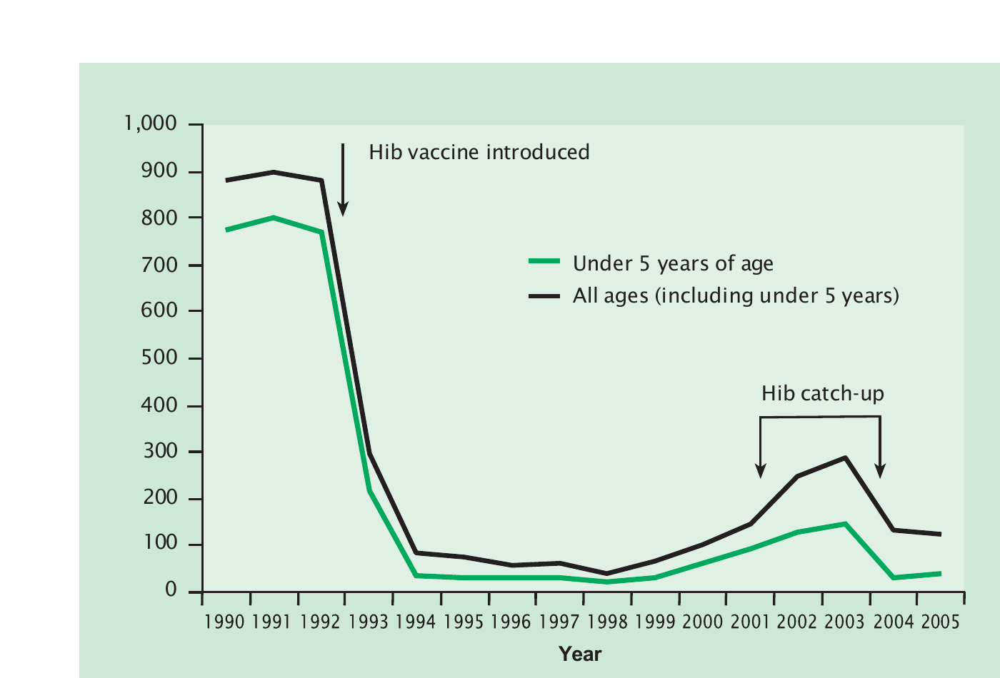

# Haemophilus influenzae type b (Hib)

H. INFLUENZAE MENINGITIS NOTIFIABLE (EXCEPT IN SCOTLAND)

## The disease

_Haemophilus influenzae_ can cause serious invasive disease, especially in young children. Invasive disease is usually caused by encapsulated strains of the organism, of which there are six serotypes (a-f) based on their unique polysaccharide capsule. Non-encapsulated (also known as nontypeable) strains are mainly associated with respiratory infections but can occasionally cause invasive disease. Serotype b (Hib) is the most virulent strain and, before the introduction of routine vaccination, was a major cause of infectious morbidity and mortality, especially in children under five years of age, who typically presented with meningitis. Older children with Hib disease developed epiglottitis, a potentially dangerous condition that presents with airway obstruction. Hib can also cause septic arthritis, osteomyelitis, cellulitis, pneumonia and pericarditis The case fatality rate from Hib meningitis is around 5% and around 10% of survivors may develop severe long-term complications, including deafness, seizures, and intellectual impairment.

Individuals, typically toddlers, can carry Hib bacteria in their nose and throat without showing signs of the disease. Hib is spread through coughing, sneezing or close contact with a carrier or an infected person. Before Hib vaccine was introduced, around 4% of pre-school children were Hib carriers; after vaccine introduction, Hib carriage has become rare in all age groups (McVernon _et al._, 2004), although there was some suggestion of a reservoir in older children (Oh _et al._, 2008).

## Epidemiology of the disease

The introduction of the Hib conjugate vaccine into the UK childhood national immunisation programme in 1992 was associated in large reductions in invasive Hib disease in children. In addition, by preventing carriage in young children and thus interrupting onward transmission to older unvaccinated children and adults, rates across the whole population fell because of the indirect (herd) protection offered by the programme (Collins _et al_, 2017; Hani _et al._, 2024).

When the vaccine was introduced in 1992, single Hib vaccine (conjugated to tetanus protein) was used for routine vaccination at 2, 3 and 4 months of age. A different Hib vaccine (conjugated to CRM197 - a non-toxic mutant of diphtheria toxin) was used for catch-up vaccination for all children aged up to four years (three doses for those aged under 13 months and a single dose for those aged 13 months and older).

From 1996, combined vaccines containing Hib conjugate and a DTwP vaccine (diphtheria, tetanus and whole cell pertussis vaccine) were used in the routine programme. In 1999 and 2000, because of a shortage of DTwP-Hib combinations, vaccines including acellular pertussis (DTaP-Hib) were used to sustain the programme.

Following the cessation of production of the Hib/MenC conjugate vaccine (Menitorix®) by the manufacturer, as of 1 July 2025 the Hib/MenC vaccine dose at the age of 12 months was removed from the childhood immunisation schedule, and replaced with a booster dose of a hexavalent Hib-containing vaccine (DTaP/IPV/Hib/HepB) at 18 months of age.

From 1999, there was a small but gradual increase in the number of cases of Hib disease reported, mostly in children less than four years of age. However, this increase was most notable among children born in 2000 and 2001 (McVernon _et al._, 2003). Reasons for this increase in vaccine failures are thought to include an effect of the DTaP/Hib combination vaccine which was in use at that time and a waning of the impact of the catch-up programme when the vaccine was introduced. In the catch-up group, who were immunised at an older age, vaccine effectiveness was higher than in children vaccinated routinely as infants.

In 2003, a booster campaign was implemented with call-back for a single dose of Hib vaccine for all children aged six months to four years (Chief Medical Officer _et al._, 2004). Following the campaign, cases returned to the low levels achieved previously (see Figure 16.1).

From 2004, infant vaccination against Hib was routinely undertaken using a vaccine combined with DTaP and IPV (DTaP/IPV/Hib). In 2006, following studies that showed that protection against Hib waned during the second year of life (Trotter _et al._, 2003), a booster dose (combined with MenC as Hib/MenC) was introduced. In 2007, a booster campaign targeting children born between 13 March 2003 and 3 September 2005 was undertaken to catch-up children who had missed out on both booster opportunities.

In 2017, the infant vaccination schedule at 8, 12 and 16 weeks of age was changed to use a hexavalent vaccine with Hib combined with DTaP, IPV and HepB (DTaP/IPV/Hib/HepB).

Currently, invasive Hib disease is rare because of the excellent direct and indirect (herd) protection offered by the childhood Hib vaccination programme, with 5 to 20 cases diagnosed in England annually, and mainly in adults (Hani _et al._, 2024).

## The Hib vaccination

Hib-containing vaccines are made from capsular polysaccharide that has been extracted from cultures of Hib bacteria. The polysaccharide is linked (conjugated) to a protein, according to the manufacturer's methodology. In the currently available combination vaccines, the Hib polysaccharide is conjugated to either tetanus toxoid (Hib-TT, such as in Infanrix hexa®) or the meningococcal outer-membrane--protein-complex (Hib-OMP, such as in Vaxelis®). The conjugation increases the immunogenicity of the vaccine, especially in infants and young children who respond poorly to plain polysaccharide vaccines.

The Hib vaccine is given as part of a combined product:

- diphtheria/tetanus/acellular pertussis/inactivated polio vaccine/Hib/hepatitis B (DTaP/IPV/Hib/HepB)
- Hib and meningococcal group C (Hib/MenC) (until April 2026 or supplies exhausted)

The Hib/MenC conjugate vaccine is made from capsular polysaccharides of _H. influenzae_ type b and group C _Neisseria meningitidis_, which are conjugated to tetanus toxoid. The last available stock of this vaccine will expire in April 2026, after which time this vaccine will no longer be manufactured.

The above vaccines are thiomersal-free. They are inactivated, do not contain live organisms and cannot cause the diseases against which they protect.

### Storage

Chapter 3 contains information on vaccine storage, distribution and disposal.

The summary of product characteristics (SPC) may give further detail on vaccine storage.

### Presentation

Hib vaccines are available as part of combined products.

Vaxelis® is supplied as cloudy white or off-white suspensions in pre-filled syringes. The suspensions may sediment during storage and should be shaken to distribute the suspensions uniformly before administration.

Infanrix hexa® is supplied as a powder in a vial and a suspension in a pre-filled syringe. The vaccine must be reconstituted by adding the entire contents of the pre-filled syringe (Infanrix hexa® suspension containing DTaP-HBV-IPV) to the vial containing the powder (Hib). The full reconstitution instructions are given in the Summary of Product Characteristics. After reconstitution, the vaccine should be injected immediately.

Menitorix® was supplied as a vial of white powder and 0.5ml of solvent in a pre-filled syringe. The vaccine must be reconstituted by adding the entire contents of the pre-filled syringe to the vial containing the powder. After addition of the solvent, the mixture should be shaken well until the powder is completely dissolved. After reconstitution, the vaccine should be administered promptly.

### Dosage and schedule

All Hib-containing vaccines are supplied as single doses of 0.5 ml.

The routine childhood immunisation schedule contains four doses of Hib-containing vaccine. The priming schedule is three doses, given at four-week intervals. An additional dose is given as part of the hexavalent booster at 18 months of age:

- First dose of 0.5ml of a Hib-containing vaccine.
- Second dose of 0.5ml, four weeks after the first dose.
- Third dose of 0.5ml, four weeks after the second dose.
- A fourth booster dose of 0.5ml of a Hib-containing vaccine should be given at the recommended interval (see below).

### Administration

Chapter 4 covers guidance on administering vaccines.

Most injectable vaccines are routinely given intramuscularly into the deltoid muscle of the upper arm or, for infants 1 year and under, into the anterolateral aspect of the thigh.

Hib-containing vaccines can be given at the same time as any other vaccines required. The vaccines should be given at a separate site, preferably into a different limb. If given into the same limb, they should be given at least 2.5cm apart (American Academy of Pediatrics, 2021). The site at which each vaccine was given should be noted in the individual's records.

### Disposal

Chapter 3 outlines storage, distribution and disposal requirements for vaccines.

Equipment used for immunisation, including used vials, ampoules, or discharged vaccines in a syringe, should be disposed of safely in a UN-approved puncture-resistant 'sharps' box, according to local waste disposal arrangements and guidance in the [Health Technical Memorandum 07-01: Safe and sustainable management of healthcare waste](https://www.england.nhs.uk/publication/management-and-disposal-of-healthcare-waste-htm-07-01/).

## Recommendations for the use of the vaccine

The objective of the immunisation programme is to vaccinate children up to ten years of age against Hib.

To fulfil this objective, the appropriate vaccine for each age group is determined also by the need to protect individuals against diphtheria, tetanus, pertussis, Hib, polio and HepB.

### Primary immunisation

**Infants and children under ten years of age**

The primary course of Hib vaccination in infants consists of three doses of a Hib-containing vaccine with an interval of four weeks between each dose, normally scheduled at 8, 12 and 16 weeks of age. DTaP/IPV/Hib/HepB is recommended for all children from 8 weeks up to ten years of age. Although one dose of Hib vaccine is effective from one year of age, three doses of DTaP/IPV/Hib/HepB should be given to children who have not completed a primary course, in order to be fully protected against diphtheria, tetanus, pertussis, hepatitis B and polio. If the primary course is interrupted it should be resumed but not repeated, allowing an interval of four weeks between the remaining doses.

Children aged one year up to their tenth birthday who have been appropriately vaccinated against diphtheria, tetanus, pertussis, polio and hepatitis B but have not received any Hib-containing vaccine, should receive a single dose of DTaP/IPV/Hib/HepB.

The risk of invasive Hib disease is very low in children aged ten years and over, and in adults. They do not require any additional Hib vaccination irrespective of their previous Hib vaccination history unless they are identified as close contacts of a confirmed case or part of an outbreak where Hib vaccination is recommended.

### Reinforcing immunisation

A reinforcing (booster) dose of a Hib-containing vaccine is recommended for children over 1 year of age to extend protection and to reduce carriage acquisition and, therefore, interrupt transmission in the community, thus maintaining population (herd) immunity.

With the change to the routine childhood immunisation schedule introduced in July 2025, children turning 1 year of age on or after 1 July 2025 will no longer receive the Hib/MenC vaccine on their first birthday and instead will receive an additional dose of the hexavalent Hib-containing vaccine (DTaP/IPV/Hib/HepB) at 18 months of age.

Children under 10 years who were born on or before 30 June 2024 who did not receive a Hib-containing vaccine as scheduled at 1 year of age (irrespective of their primary Hib immunisation status) should be offered a Hib/MenC vaccine until stocks of this vaccine are exhausted, after which time they should be offered a dose of hexavalent DTaP/IPV/Hib/HepB vaccine.

The booster dose of a Hib-containing vaccine is not required if the child has received one of their primary doses of DTaP/IPV/Hib/HepB over 1 year of age.

### Vaccination of individuals with unknown or incomplete immunisation status

Where a child born in the UK presents with an inadequate immunisation history, every effort should be made to clarify what immunisations they have had (see Chapter 11 on vaccination schedules).

Children entering the UK who have a history of completing immunisation in their country of origin may not have been offered protection against all the antigens currently used in the UK. They may not have received Hib-containing vaccines in their country of origin. Country-specific immunisation schedules can be found on the WHO website. (https://immunizationdata.who.int/global?topic=&location=).

Individuals coming from areas of conflict or from population groups who may have been marginalised in their country of origin (e.g. refugees, gypsy or other nomadic travellers) may not have had good access to immunisation services. Where there is no reliable history of previous immunisation, it should be assumed that any undocumented doses are missing and the UK catch-up recommendations for that age should be followed (see Chapter 11).

Further advice on vaccination of children with unknown or incomplete immunisation status is published by the UK Health Security Agency. (https://www.gov.uk/government/publications/vaccination-of-individuals-with-uncertain-or-incomplete-immunisation-status).

## Contraindications

There are very few individuals who cannot receive Hib-containing vaccines. Where there is doubt, appropriate advice should be sought from a consultant paediatrician, local screening and immunisation team or local Health Protection Team rather than withhold vaccine. The risk to the individual of not being immunised must be taken into account.

The vaccines should not be given to those who have had:

- a confirmed anaphylactic reaction to a previous dose of a Hib-containing vaccine, or
- a confirmed anaphylactic reaction to any component or residue from the manufacturing process

Specific advice on management of individuals who have had an allergic reaction can be found in Chapter 8 of the Green Book.

## Precautions

Chapter 6 contains information on contraindications and special considerations for vaccination.

Minor illnesses without fever or systemic upset are not valid reasons to postpone immunisation.

If an individual is acutely unwell, immunisation should be postponed until they have fully recovered. This is to avoid confusing the differential diagnosis of any acute illness by wrongly attributing any signs or symptoms to the adverse effects of the vaccine.

### Systemic and local reactions following a previous immunisation

Individuals who have had a systemic or local reaction following a previous immunisation with DTaP/IPV/Hib/HepB or DTaP/IPV/Hib can continue to receive subsequent doses of Hib-containing vaccine. This includes the following rare reactions:

- fever, irrespective of its severity
- hypotonic-hyporesponsive episodes (HHE)
- persistent crying or screaming for more than three hours, or
- severe local reaction, irrespective of extent
- convulsions, with or without fever, within 3 days of vaccination

Chapter 8 covers vaccine safety and the management of adverse events following immunisation.

### Pregnancy and breast-feeding

Hib-containing vaccines may be given to pregnant women when protection is required without delay. There is no evidence of risk from vaccinating pregnant women or those who are breast-feeding with inactivated viral or bacterial vaccines or toxoids (Plotkin and Orenstein, 2004).

### Premature infants

It is important that premature infants have their immunisations at the appropriate chronological age, according to the schedule. The occurrence of apnoea following vaccination is especially increased in infants who were born very prematurely.

Very premature infants (born ≤ 28 weeks of gestation) who are in hospital should have respiratory monitoring for 48-72 hours when given their first immunisation, particularly those with a previous history of respiratory immaturity. If the infant has apnoea, bradycardia or desaturations after the first immunisation, the second immunisation should also be given in hospital, with respiratory monitoring for 48-72 hours (Pfister _et al._, 2004; Ohlsson _et al._, 2004; Schulzke _et al._, 2005; Pourcyrous _et al._, 2007; Klein _et al._, 2008).

Infants stable at discharge without a history of apnoea and/or respiratory compromise may be vaccinated in the community setting.

As the benefit of vaccination is high in this group of infants, vaccination should not be withheld or delayed.

### Immunosuppression and HIV infection

Additional doses of a Hib containing vaccine are not recommended for individuals with immunosuppression or HIV infection (regardless of CD4 count) but re-immunisation in immunocompromised individuals should be considered after treatment is finished and recovery has occurred. Specialist advice may be required (Miller _et al._, 2023).

Further guidance is provided in Chapter 7 and by the British HIV Association (BHIVA) vaccination guidelines for HIV-positive adults (BHIVA, 2015; https://www.bhiva.org/vaccination-guidelines) and the Children's HIV Association (CHIVA) immunisation guidelines (https://www.chiva.org.uk/infoprofessionals/guidelines/immunisation/).

### Individuals with asplenia, splenic dysfunction or early complement deficiency

This section relates to individuals with asplenia, splenic dysfunction and early complement (e.g. C1, 2, 3 or 4) deficiency and risk factors for invasive Hib disease.

Given the very low incidence of invasive Hib disease in the UK and other countries with established Hib immunisation programmes, additional doses of a Hib-containing vaccine are not required. It is, however, important that such individuals are up to date with all their routine immunisations according to their age.

### Neurological conditions

Chapter 6 covers vaccination contraindications and special considerations.

The presence of a neurological condition is not a contraindication to immunisation but if there is evidence of current neurological deterioration, deferral of the hexavalent DTaP/IPV/Hib/HepB combination vaccine may be considered, to avoid incorrect attribution of any change in the underlying condition to the vaccine. The risk of such deferral should be balanced against the risk of the preventable infection, and vaccination should be promptly given once the diagnosis and/or the expected course of the condition becomes clear.

### Deferral of immunisation

There will be very few occasions when deferral of immunisation is required (see above). Deferral leaves the child unprotected; the period of deferral should be minimised so that immunisation can commence as soon as possible. If a specialist recommends deferral, this should be clearly communicated to the general practitioner and he or she must be informed as soon as the child is fit for immunisation.

## Adverse reactions

Chapter 8 covers vaccine safety and the management of adverse events following immunisation.

Pain, swelling or redness at the injection site are common and may occur more frequently following subsequent doses. A small, painless nodule may form at the injection site; this usually disappears and is of no consequence.

The most common adverse reactions reported with Hib-containing vaccines include drowsiness, fever, loss of appetite and irritability.

Fever, convulsions, high-pitched screaming and episodes of pallor, cyanosis and limpness (hypertonic-hyporesponsive episodes' or HHE) can occur following vaccination with Hib-containing vaccines. Though not a contraindication to vaccination, individuals with a history of febrile convulsions should be closely monitored for 2 to 3 days post vaccination if they develop fever.

Confirmed anaphylaxis occurs extremely rarely, occurring at less than 1 per million doses for vaccines in the UK.

Other systemic adverse events such as anorexia, diarrhoea, fatigue, headache, nausea and rash may occur more commonly and are not contraindications to further immunisation. Co-administration of the infant hexavalent vaccine with pneumococcal conjugate vaccine or MMR(V) increases the risk of febrile reactions/convulsions.

Anyone can report a suspected adverse reaction to the Medical and Healthcare products Regulatory Agency (MHRA) using the Yellow Card reporting scheme (https://yellowcard.mhra.gov.uk/). All suspected adverse reactions to vaccines occurring in children should be reported to the MHRA using the Yellow Card scheme. Serious suspected adverse reactions to vaccines in adults should be reported through the Yellow Card scheme.

## Management of cases and contacts

It is important to ensure that children with invasive Hib disease have been appropriately vaccinated for their age. Partially immunized or unimmunised cases up to the age of ten years should be immunised according to their age-appropriate schedule after recovery from infection. Additional doses of Hib vaccine for confirmed cases who are appropriately vaccinated for their age is not required because of their very low risk of a second Hib episode.

Household contacts of a case of invasive Hib disease have an increased risk of contracting the disease. As such, chemoprophylaxis should be offered to the index case and all eligible contacts up to 4 weeks after onset of illness in the index case as soon as Hib is confirmed in the index case. Hib vaccination of close contacts of a confirmed Hib case is no longer recommended.

UKHSA guidance for the prevention of secondary cases of Hib disease is available at: https://www.gov.uk/government/publications/haemophilus-influenzae-type-b-hib-revised-recommendations-for-the-prevention-of-secondary-cases/revised-recommendations-for-the-prevention-of-secondary-haemophilus-influenzae-type-b-hib-disease.

When a case occurs in a playgroup, nursery, crèche or school, the opportunity should be taken to identify and vaccinate any unimmunised children under ten years of age. When two or more cases of Hib disease have occurred in a playgroup, nursery, crèche or school within 120 days, chemoprophylaxis should be offered to all room contacts -- teachers and children. This is a precautionary measure as there is little evidence that children in such settings are at significantly higher risk of Hib disease than the general population of the same age.

## Vaccines

Some or all of the following vaccines containing Hib antigens will be available at any one time:

- Infanrix hexa®, diphtheria/tetanus/3-component acellular pertussis/inactivated polio vaccine/Haemophilus influenzae type b, hepatitis B (DTaP/IPV/Hib/HepB) -- manufactured by GSK
- Vaxelis® diphtheria/tetanus/5-component acellular pertussis/inactivated polio vaccine/Haemophilus influenzae type b, hepatitis B (DTaP/IPV/Hib/HepB) -- manufactured by Sanofi
- Menitorix® (Hib/MenC) -- manufactured by GSK (in limited supply and last batch will expire April 2026).

Hib containing vaccines are available in England, Wales and Scotland from ImmForm. Tel: 0207 183 8580.

Website: https://portal.immform.ukhsa.gov.uk

If not already registered on ImmForm you will need register in good time before placing an order.

In Northern Ireland, supplies should be obtained under the normal childhood vaccines distribution arrangements, details of which are available by contacting the Regional Pharmaceutical Procurement Service on 028 9442 4089.

## References

American Academy of Pediatrics (2021) Active immunization. In: Kimberlin DW, Barnett ED, Lynfield R, Sawyer MH, eds. Red Book: 2021 Report of the Committee on Infectious Diseases. 32nd edition. Itasca, IL: American Academy of Pediatrics: 2021, p28.

Anderson EC, Begg NT, Crawshaw SC _et al._ (1995) Epidemiology of invasive _Haemophilus influenzae_ infections in England and Wales in the pre-vaccination era (1990--2). _Epidemiol Infect_ **115**: 89--100.

BHIVA (2015) British HIV Association guidelines on the use of vaccines in HIV-positive adults 2015. https://www.bhiva.org/vaccination-guidelines Accessed August 2024.

Black SB, Shinefield HR, Fireman B _et al._ (1991a) Efficacy in infancy of oligosaccharide conjugate _Haemophilus influenzae_ type b (HbOC) vaccine in a United States population of 61,080 children. _Pediatr Infect Dis J_ **10**: 97--104.

Black SB, Shinefield H, Lampert D _et al._ (1991b) Safety and immunogenicity of oligosaccharide conjugate _Haemophilus influenzae_ type b (HbOC) vaccine in infancy. _Pediatr Infect Dis J_ **10**: 2.

Bohlke K, Davis RL, Marcy SH _et al._ (2003) Risk of anaphylaxis after vaccination of children and adolescents. _Pediatrics_ **112**: 815--20.

Booy R, Hodgson S, Carpenter L _et al._ (1994) Efficacy of _Haemophilus influenzae_ type b conjugate vaccine PRP-T. _Lancet_ **344** (8919): 362--6.

Canadian Medical Association (1998) Pertussis vaccine. In: _Canadian Immunization Guide_. 5th edition. Canadian Medical Association, p 133.

Canadian Medical Association (2002) General considerations. In: _Canadian Immunization Guide_, 6th edition. Canadian Medical Association, p 14.

Chief Medical Officer, Chief Nursing Officer and Chief Pharmaceutical Officer (2004) Planned Hib vaccination catch-up campaign -- further information https://www.dh.gov.uk/cmo/letters/cmo0302.html

Children's HIV Association (2022) Guidelines on Vaccination of Children Living with HIV https://www.chiva.org.uk/infoprofessionals/guidelines/immunisation/ Accessed August 2024

Collins S, Litt D, Almond R, Findlow J, Linley E, Ramsay M, Borrow R, Ladhani S. Haemophilus influenzae type b (Hib) seroprevalence and current epidemiology in England and Wales. Journal of Infection. 2018 Apr 1;76(4):335-41.

Department of Health (2001) _Health information for overseas travel_, 2nd edition. London: The Stationery Office.

Diggle L and Deeks J (2000) Effect of needle length on incidence of local reactions to routine immunisation in infants aged 4 months: randomised controlled trial. _BMJ_ **321**: 931--3.

Eskola J, Kayhty H, Takala AK _et al._ (1990) A randomised, prospective field trial of a conjugate vaccine in the protection of infants and young children against invasive _Haemophilus influenzae_ type b disease. _NEJM_ **323** (20): 1381--7.

Hani E, Abdullahi F, Bertran M, Eletu S, D'Aeth J, Litt DJ, Fry NK, Ladhani SN. Trends in invasive Haemophilus influenzae serotype b (Hib) disease in England: 2012/13 to 2022/23. Journal of Infection. 2024 Oct 1;89(4):106247.

Heath PT and McVernon J (2002) The UK Hib vaccine experience. _Arch Dis Child_ **86**:396--9.

Howard AJ, Dunkin KT, Musser JM and Palmer SR (1991) Epidemiology of _Haemophilus influenzae_ type b invasive disease in Wales. _BMJ_ **303**: 441--5.

Klein NP, Massolo ML, Greene J _et al._ (2008) Risk factors for developing apnea after immunization in the neonatal intensive care unit. _Pediatrics_ **121**(3): 463-9.

Kroger AT, Sumaya CV, Pickering LK, Atkinson WL. General recommendations on immunization. MMWR Recomm Rep. 2011;60(2):1-64.

McVernon J, Andrews N, Slack MPE and Ramsay ME (2003) Risk of vaccine failure after _Haemophilus influenzae_ type b (Hib) combination vaccines with acellular pertussis. Lancet 361: 1521--3.

McVernon J, Howard AJ, Slack MP and Ramsay ME (2004) Long-term impact of vaccination on Haemophilus influenzae type b (Hib) carriage in the United Kingdom. Epidemiol Infect 132 (4): 765--7.

Mark A, Carlsson RM and Granstrom M (1999) Subcutaneous versus intramuscular injection for booster DT vaccination in adolescents. Vaccine 17: 2067--72

Miller E (1999) Overview of recent clinical trials of acellular pertussis vaccines. Biologicals 27: 79--86.

Miller E, Southern J, Kitchin N _et al_. (2003) Interaction between different meningococcal C conjugate vaccines and the Hib component of concomitantly administered diphtheria/ tetanus/pertussis/Hib vaccines with either whole-cell or acellular pertussis antigens. 21st Annual Meeting of the European Society for Paediatric Infectious Diseases, Sicily.

Miller PD, Patel SR, Skinner R, Dignan F, Richter A, Jeffery K, Khan A, Heath PT, Clark A, Orchard K, Snowden JA. Joint consensus statement on the vaccination of adult and paediatric haematopoietic stem cell transplant recipients: Prepared on behalf of the British society of blood and marrow transplantation and cellular therapy (BSBMTCT), the Children's cancer and Leukaemia Group (CCLG), and British Infection Association (BIA). Journal of Infection. 2023 Jan 1;86(1):1-8.

Oh SY, Griffiths D, John T, Lee YC, Yu LM, McCarthy N, Heath PT, Crook D, Ramsay M, Moxon ER, Pollard AJ. School-aged children: a reservoir for continued circulation of Haemophilus influenzae type b in the United Kingdom. J Infect Dis. 2008 May 1;197(9):1275-81. doi: 10.1086/586716.

Ohlsson A and Lacy JB (2004) Intravenous immunoglobulin for preventing infection in preterm and/or low-birth-weight infants. _Cochrane Database Syst Rev_(1): CD000361.

Pfister RE, Aeschbach V, Niksic-Stuber V _et al._ (2004) Safety of DTaP-based combined immunization in very-low-birth-weight premature infants: frequent but mostly benign cardiorespiratory events. _J Pediatr_ **145**(1): 58-66.

Plotkin SA and Orenstein WA (eds) (2004) _Vaccines_, 4th edition. Philadelphia: WB Saunders Company, Chapter 8.

Pourcyrous M, Korones SB, Arheart KL _et al._ (2007) Primary immunization of premature infants with gestational age <35 weeks: cardiorespiratory complications and C-reactive protein responses associated with administration of single and multiple separate vaccines simultaneously. _J Pediatr_ **151**(2): 167-72.

Ramsay M, Begg N, Holland B and Dalphinis J (1994) Pertussis immunisation in children with a family or personal history of convulsions: a review of children referred for specialist advice. _Health Trends_ **26**: 23--4.

Le Saux N, Barrowman NJ, Moore D _et al._ (2003) Canadian Paediatric Society/Health Canada Immunization Monitoring Program -- Active (IMPACT). Decrease in hospital admissions for febrile seizures and reports of hypotonic-hyporesponsive episodes presenting to hospital emergency departments since switching to acellular pertussis vaccine in Canada: a report from IMPACT. _Pediatrics_ **112** (5): e348.

Schulzke S, Heininger U, Lucking-Famira M _et al._ (2005) Apnoea and bradycardia in preterm infants following immunisation with pentavalent or hexavalent vaccines. _Eur J Pediatr_ **164**(7): 432-5.

Tozzi AE and Olin P (1997) Common side effects in the Italian and Stockholm 1 Trials. _Dev Biol Stand_ **89**: 105--8.

Trotter CL, Ramsay ME and Slack MPE (2003) Rising incidence of _Haemophilus influenzae_ type b disease in England and Wales indicates a need for a second catch-up vaccination campaign. _Commun Dis Public Health_ **6**: 55--8.

Tudor-Williams G, Frankland J, Isaacs D _et al._ (1989) _Haemophilus influenzae_ type b disease in the Oxford region. _Arch Dis Child_ **64**: 517--19.

Zuckerman JN (2000) The importance of injecting vaccines into muscle. _BMJ_ **321**: 1237--8.
