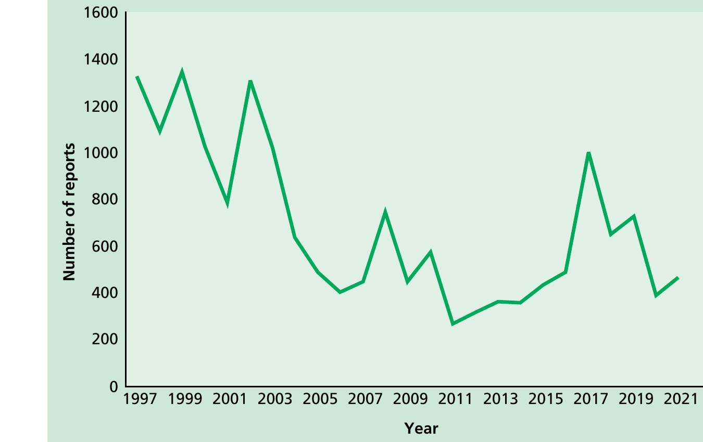

# Hepatitis A

NOTIFIABLE

## The disease

Hepatitis A is an infection of the liver caused by hepatitis A virus. The disease is generally mild, but severity increases with age. Asymptomatic disease is common in children. Jaundice may occur in 70--80% of those infected as adults. Fulminant hepatitis can occur but is rare. The overall case--fatality ratio is low but is greater in older patients and those with pre-existing liver disease. There is no chronic persistent state and chronic liver damage does not occur.

The virus is usually transmitted by the faecal--oral route through person-to- person spread or contaminated food or drink. Foodborne outbreaks have been reported following ingestion of certain shellfish (bivalve molluscs such as mussels, oysters and clams that feed by filtering large volumes of sewage-polluted waters), contaminated fruit (including frozen berries and dates) and salad vegetables. Transmission of hepatitis A has been associated with the use of factor VIII and factor IX concentrates where viral inactivation procedures did not destroy hepatitis A virus. The incubation period is usually around 28--30 days but may occasionally be as short as 15 or as long as 50 days.

## History and epidemiology of the disease

Improved standards of living and hygiene have led to a marked fall in the incidence of hepatitis A infection. In the UK, this has resulted in high susceptibility levels in adults, with the typical age of infection shifting from children to older age groups. In 2001/2, the overall seroprevalence of hepatitis A in England and Wales was estimated to be 18.9%, and 14.1% among those aged 5--19 years, with a further increase to 26.2% in persons aged 25-44 years (Morris _et al._, 2004). Therefore, the majority of adolescents and adults remain susceptible to hepatitis A infection and will remain so throughout life, with the potential for outbreaks to occur.

Hepatitis A infection acquired in the UK may either present as sporadic cases, as community-wide outbreaks resulting from person-to-person transmission or, uncommonly, as point of source outbreaks related to contaminated food. Previously, the incidence of hepatitis A showed a cyclical pattern in the UK. However, there has been a downward trend over the last 25 years; the number of laboratory reports of hepatitis A in England and Wales has fallen from 1,318 in 1997 to 274 in 2021. The increased number of reports during 2010 was due to unrelated outbreaks of hepatitis A in the London and the South West regions. There was a slight increase in laboratory reports of hepatitis A between 2014 and 2016 (PHE, 2017), contributed to by a number of clusters identified in that time period.

In recent decades in the UK, there have been a number of outbreaks of hepatitis A among gay, bisexual and other men who have sex with men (GBMSM), with the most recent outbreaks in England in 2016- 2017 which contributed to a doubling of case numbers that year (Beebeejuan _et al._, 2017; Plunkett _et al_, 2018). Similarly, outbreaks have also been documented in a number of other European countries. Transmission appears to be by the faecal--oral route (Reintjes _et al._, 1999; Bell _et al._, 2001; Blystad _et al._, 2004; Sfetcu _et al._, 2011; ECDC, 2016;).

Outbreaks associated with food, particularly frozen berries, both within the UK and across Europe have increased in the last decade (Scavia _et al.,_ 2017; Boxman _et al._, 2016; Tavoschi _et al._, 2015; Swinkels _et al._, 2014; Nordic Outbreak Investigation Team, 2013).

Outbreaks of hepatitis A have also been documented among people who inject drugs in several countries. An outbreak among people who inject drugs in Aberdeen (Roy _et al._, 2004) contributed to a major increase in the number of cases in Scotland in 2001 (148 cases). Outbreaks of hepatitis A in other parts of the UK involved a high proportion of individuals with a history of injecting and homeless people living together in hostels and shelters (O'Donovan _et al._, 2001; Syed _et al._, 2003; Perrett _et al._, 2003). In 2017, several US states also reported outbreaks mostly among persons reporting drug use or homelessness (Foster M _et al_ MMWR 2018). Close contact and poor standards of personal hygiene among these groups, with possible faecal contamination of shared injecting equipment or drugs, appears to be the most likely mode of transmission (Hutin _et al._, 2000; Roy _et al._, 2004;).

Hepatitis A is more common in countries outside Northern and Western Europe, North America, Australia and New Zealand. Travel abroad is a common risk factor for sporadic cases in the UK. The highest risk areas for UK travelers are the Indian subcontinent, Middle East, Africa and South East Asia, but the risk now extends to Eastern Europe.

## The hepatitis A vaccination

There are two types of immunisation against hepatitis A. Immunoglobulin provides rapid but temporary passive immunity. The vaccine confers active immunity but response is not immediate. Vaccines are available as either monovalent, or combined with either typhoid or hepatitis B.

Hepatitis A monovalent vaccines and those combined with either typhoid or hepatitis B do not contain thiomersal. The vaccines are inactivated, do not contain live organisms and cannot cause the diseases against which they protect.

### Monovalent vaccines

Three monovalent vaccines are currently available, prepared from different strains of the hepatitis A virus; all are grown in human diploid cells (MRC5). Havrix® and Avaxim® are adsorbed onto an aluminium hydroxide adjuvant; Vaqta® is adsorbed on amorphous aluminium hydroxyphosphate sulfate. These vaccines can be used interchangeably (Bryan _et al._, 2000; Clarke _et al._, 2001; Beck _et al._, 2004).

### Combined hepatitis A and hepatitis B vaccine

Combined vaccines, Twinrix® and Ambirix®, contain purified inactivated hepatitis A virus (adsorbed on aluminium hydroxide adjuvant) and purified recombinant hepatitis B surface antigen (adsorbed on aluminium phosphate adjuvant). These combined vaccines may be used when protection against both hepatitis A and hepatitis B infections is required. If rapid protection against hepatitis A is required for adults, for example following exposure or during outbreaks, then a single dose of monovalent vaccine is recommended. In children under 16 years, a single dose of Ambirix® may also be used for rapid protection against hepatitis A. Both Ambirix® and Havrix® Junior Monodose® vaccines contain the higher amount of hepatitis A antigen and will therefore provide hepatitis A protection more quickly than Twinrix Paediatric® or Avaxim® Junior®.

### Combined hepatitis A and typhoid vaccine

Combined vaccines containing purified inactivated hepatitis A virus adsorbed onto aluminium hydroxide and purified Vi capsular polysaccharide typhoid vaccine (ViATIM®) may be used where protection against hepatitis A and typhoid fever is required (see also Chapter 34 on typhoid).

### Human normal immunoglobulin

Human normal immunoglobulin (HNIG) is prepared from pooled plasma derived from blood donations. Use of HNIG should be limited to situations such as post-exposure prophylaxis in non-immune people with increased risk of severe disease where it may have an additional benefit to vaccine. HNIG can provide immediate protection, although antibody levels are lower than those eventually produced by hepatitis A vaccine. Protection lasts for 4 to 6 months. UKHSA provides guidance on use of HNIG in the [hepatitis A immunoglobulin guidance](https://www.gov.uk/government/publications/immunoglobulin-when-to-use) and in the [hepatitis A: public health management guidance](https://www.gov.uk/government/publications/hepatitis-a-infection-prevention-and-control-guidance).

Because of a theoretical risk of transmission of vCJD from plasma products, HNIG used in the UK is now prepared from plasma sourced from outside the UK, and supplies are scarce. All donors are screened for HIV, hepatitis B and C, and all plasma pools are tested for the presence of RNA from these viruses. A solvent detergent inactivation step for enveloped viruses is included in the production process.

### Storage

Vaccines should be stored in the original packaging at +2°C to +8°C and protected from light. All vaccines are sensitive to some extent to heat and cold. Heat speeds up the decline in potency of most vaccines, thus reducing their shelf life. Effectiveness cannot be guaranteed for vaccines unless they have been stored at the correct temperature. Freezing may cause increased reactogenicity and loss of potency for some vaccines. It can also cause hairline cracks in the container, leading to contamination of the contents.

HNIG should be stored in the original packaging in a refrigerator at +2°C to +8°C. These products are tolerant to higher ambient temperatures for up to one week. They can be distributed in sturdy packaging outside the cold chain, if needed.

### Presentation

| Vaccine                                      | Product                                                                                          | Pharmaceutical presentation                                                                   | Instructions on handling before use                                                                                    |
| -------------------------------------------- | ------------------------------------------------------------------------------------------------ | --------------------------------------------------------------------------------------------- | ---------------------------------------------------------------------------------------------------------------------- |
| **Monovalent hepatitis A vaccines**          | Havrix® Monodose® Havrix® Junior Monodose® Avaxim® Avaxim Junior® Vaqta® Adult Vaqta® Paediatric | Suspension for injection in a pre-filled syringe or vial                                      | Shake well to produce a slightly opaque, white suspension                                                              |
| **Combined hepatitis A and B vaccine**       | Twinrix® Adult Twinrix® Paediatric                                                               | Suspension for injection in a pre-filled syringe                                              | Shake the vaccine well to obtain a slightly opaque suspension                                                          |
|                                              | Ambirix®                                                                                         | Suspension for injection in a pre-filled syringe                                              | Shake the vaccine well to obtain a slightly opaque suspension                                                          |
| **Combined hepatitis A and typhoid vaccine** | ViATIM®                                                                                          | A dual-chamber syringe containing a cloudy, white suspension and a clear, colourless solution | Shake to ensure suspension is fully mixed. The contents of the two compartments are mixed as the vaccines are injected |

### Dosage and schedule

In order to provide long-term protection, the immunisation regimes for hepatitis A vaccine and for combined hepatitis A and typhoid vaccine consist of two doses, with the second dose 6 to 12 months after the first. The standard schedule for the combined hepatitis A and hepatitis B vaccine depends on the product. For Twinrix® the schedule consists of 3 doses, the first on the elected date, the second one month later and the third 6 months after the first dose. For Ambirix® the schedule consists of 2 doses, the first administered on the elected date and the second between 6 and 12 months after the first dose.

An accelerated schedule of Twinrix® Adult at 0, 7 and 21 days may be used when early protection against hepatitis B is required (e.g. for travellers departing within one month). When this schedule is applied, a fourth dose is recommended 12 months after the first dose.

**Dosage for monovalent hepatitis A immunisation**

| Vaccine product          | Ages             | Dose              | Volume |
| ------------------------ | ---------------- | ----------------- | ------ |
| Havrix® Monodose®        | 16 years or over | 1440 ELISA units  | 1.0ml  |
| Havrix® Junior Monodose® | One to 15 years  | 720 ELISA units   | 0.5ml  |
| Avaxim®                  | 16 years or over | 160 antigen units | 0.5ml  |
| Vaqta® Adult             | 18 years or over | 50 units          | 1.0ml  |
| Avaxim Junior®           | One to 15 years  | 80 ELISA units    | 0.5ml  |
| Vaqta® Paediatric        | One to 17 years  | 25 units          | 0.5ml  |

**Dosage of combined hepatitis A and hepatitis B vaccines**

| Vaccine product     | Ages             | Dose HAV        | Dose HBV      | Volume |
| ------------------- | ---------------- | --------------- | ------------- | ------ |
| Twinrix® Adult      | 16 years or over | 720 ELISA units | 20 micrograms | 1.0ml  |
| Twinrix® Paediatric | 1 to 15 years    | 360 ELISA units | 10 micrograms | 0.5ml  |
| Ambirix®            | 1 to 15 years    | 720 ELISA units | 20 micrograms | 1.0ml  |

**Dosage of combined hepatitis A and typhoid vaccine**

| Vaccine product | Ages             | Dose HAV          | Dose Vi P Ty  | Volume |
| --------------- | ---------------- | ----------------- | ------------- | ------ |
| ViATIM®         | 16 years or over | 160 antigen units | 25 micrograms | 1.0ml  |

**Dosage of HNIG**

Please see guidance on use of HNIG for post-exposure prophylaxis against hepatitis A in the [hepatitis A: public health management guidance](https://www.gov.uk/government/publications/hepatitis-a-infection-prevention-and-control-guidance) and in the [hepatitis A immunoglobulin guidance](https://www.gov.uk/government/publications/immunoglobulin-when-to-use).

### Administration

Vaccines are routinely given intramuscularly into the upper arm or anterolateral thigh.

Individuals with bleeding disorders may be vaccinated intramuscularly if, in the opinion of a doctor familiar with the individual's bleeding risk, vaccines or similar small volume intramuscular injections can be administered with reasonable safety by this route. If the individual receives medication/treatment to reduce bleeding, for example treatment for haemophilia, intramuscular vaccination can be scheduled shortly after such medication/treatment is administered. Individuals on stable anticoagulation therapy, including individuals on warfarin who are up to date with their scheduled INR testing and whose latest INR was below the upper threshold of their therapeutic range, can receive intramuscular vaccination. A fine needle (equal to 23 gauge or finer calibre such as 25 gauge) should be used for the vaccination, followed by firm pressure applied to the site (without rubbing) for at least 2 minutes. If in any doubt, consult with the clinician responsible for prescribing or monitoring the individual's anticoagulant therapy.

Hepatitis A-containing vaccines can be given at the same time as other vaccines such as hepatitis B, MMR, MenACWY, Td/IPV and other travel vaccines. The vaccines should be given at a separate site, preferably in a different limb. If given in the same limb, they should be given at least 2.5cm apart (American Academy of Pediatrics, 2003). The site at which each vaccine was given should be noted in the individual's records.

For patients managed in the community, intramuscular (IM) HNIG is recommended. Subgam® can be issued from UKHSA stockholders on request. The current Summary of Product Characteristics (SPC) covering these products do not mention IM administration. Given the clinical imperative to treat these contacts urgently, it is reasonable to use available HNIG products IM so long as use via this route is acknowledged to be off-label. There are no specific contraindications to IM use listed. The functional biological activity of these produces is expected to be equivalent. In the absence of data from the manufacturers, users are asked to report back to UKHSA any concerns over tolerability with IM use.

HNIG can be administered in the upper outer quadrant of the buttock or anterolateral thigh (see Chapter 4). If more than 3ml is to be given to young children and infants, or more than 5ml to older children and adults, the immunoglobulin should be divided into smaller amounts and administered at different sites. HNIG may be administered, at a different site, at the same time as hepatitis A vaccine.

### Disposal

For disposal of equipment used for vaccination, including used vials, ampoules, syringes or partially discharged vaccines please see **Chapter 3**.

## Recommendations for the use of the vaccine

### Pre-exposure immunisation

The objective of the immunisation programme is to provide 2 doses of a hepatitis A-containing vaccine (3 doses for Twinrix®) at appropriate intervals for all individuals at high risk of exposure to the virus or of complications from the disease.

**Groups recommended to receive pre-exposure immunisation People travelling or going to reside abroad**

All travellers should undergo a careful risk assessment that takes into consideration their itinerary, duration of stay and planned activities. Immunisation with hepatitis A vaccine is recommended for those aged one year and over travelling to areas of high, medium hepatitis A endemicity, or occasionally during hepatitis A outbreaks. Country-specific recommendations are available on [NaTHNaC](https://nathnac.net/) and [Travax](https://www.travax.nhs.uk/) websites. Although hepatitis A is usually sub-clinical in children, it can be severe and require hospitalisation. Even children who acquire mild or sub-clinical hepatitis A may be a source of infection to others. The risks of disease for children under one year old are low, and vaccines are not licensed for their use at this age. Care should be taken to prevent exposure to hepatitis A infection through food and water.

For travellers, vaccine should preferably be given at least 2 weeks before departure, but can be given up to the day of departure. Although antibodies may not be detectable for 12--15 days following administration of monovalent hepatitis A vaccine, the vaccine may provide some protection before antibodies can be detected using current assays.

Immunisation is not generally considered necessary for individuals travelling to or going to reside in Northern or Western Europe (including Spain, Portugal and Italy), or North America, Australia or New Zealand. HNIG is no longer recommended for travel prophylaxis.

**People with chronic liver disease**

Although people with chronic liver disease may be at no greater risk of acquiring hepatitis A, the infection can produce a more serious illness in these patients (Akriviadis and Redeker, 1989; Keefe, 1995). Immunisation against hepatitis A is therefore recommended for people with severe liver disease of whatever cause. Vaccine should also be considered for individuals with chronic hepatitis B or C infection and for those with milder forms of liver disease.

**People with haemophilia**

As standard viral inactivation processes may not be effective against hepatitis A, patients with haemophilia who are receiving plasma-derived clotting factors should be immunised against hepatitis A. People with haemophilia should be immunised subcutaneously.

**Gay, bisexual and other men who have sex with men (GBMSM)**

Immunisation is recommended for GBMSM and they should also be informed about the risks of hepatitis A, and about the need to maintain high standards of personal hygiene during sex.

**People who inject drugs**

Hepatitis A immunisation is recommended for people who inject drugs and can be given at the same time as hepatitis B vaccine, as separate or combined preparations. Consideration should be given to maximising opportunities for vaccination in drug services, prisons and via outreach services in homeless shelters, hostels and encampments.

**Individuals at occupational risk**

Hepatitis A immunisation is recommended for the following groups:

- **laboratory workers:** individuals who may be exposed to hepatitis A in the course of their work, in microbiology laboratories and clinical infectious disease units, are at risk and must be protected
- **staff and residents of some large residential institutions:** outbreaks of hepatitis A have been associated with large residential institutions for those with learning difficulties. Transmission can occur more readily in such institutions and immunisation of staff and residents is appropriate. Similar considerations apply in other institutions where standards of personal hygiene among clients or patients may be poor
- **sewage workers:** raw, untreated sewage is frequently contaminated with hepatitis A. A UK study to evaluate this risk showed that frequent occupational exposure to raw sewage was an independent risk factor for hepatitis A infection (Brugha _et al._, 1998). Immunisation is, therefore, recommended for workers at risk of repeated exposure to raw sewage, including first line responders in the event of flooding, who should be identified following a local risk assessment
- **people who work with primates:** immunisation is recommended for those who work with primates that are susceptible to hepatitis A infection

Hepatitis A vaccination may be considered under certain circumstances for:

- **food packagers and handlers:** food packagers or food handlers in the UK have not been associated with transmission of hepatitis A sufficiently often to justify their immunisation as a routine measure. Where a case or outbreak occurs, advice should be sought from the local Health Protection Team
- **staff in day-care facilities:** infection in young children is likely to be sub-clinical, and those working in day-care centres and other settings with children who are not yet toilet trained may be at increased risk (Severo _et al._, 1997). Under normal circumstances, the risk of transmission to staff and children can be minimised by careful attention to personal hygiene. However, in the case of a well-defined community outbreak, such as in a pre-school nursery, the need for immunisation of staff and children should be discussed with the local Health Protection Team
- **healthcare workers:** most healthcare workers are not at increased risk of hepatitis A and routine immunisation is not indicated

### Post-exposure immunisation

Active (with or without passive) immunisation is used for the management of close contacts of cases and for outbreak control. HNIG has a proven record in providing prophylaxis for close contacts of cases of acute hepatitis. HNIG will protect against hepatitis A infection if administered within 14 days of exposure, and may reduce clinical manifestation of disease if given after that time (Winokur and Stapleton, 1992). While placebo controlled trials have shown efficacy of hepatitis A vaccine as post-exposure prophylaxis (Sagliocca _et al._, 1999, Werzeberger _et al._, 1992), data from a randomised, double-blind non-inferiority clinical trial comparing post- exposure efficacy of hepatitis A vaccine and HNIG demonstrated that the performance of vaccine, when administered within 14 days of exposure, approaches that of HNIG (Victor _et al._, 2007).

For guidance on the use of hepatitis A vaccine with or without HNIG for post exposure immunisation, see also the [hepatitis A: public health management guidance](https://www.gov.uk/government/publications/hepatitis-a-infection-prevention-and-control-guidance) and the [hepatitis A immunoglobulin guidance](https://www.gov.uk/government/publications/immunoglobulin-when-to-use).

Vaccine and HNIG may be given at the same time, but in different sites, when both rapid and prolonged protection is required. A single dose of monovalent hepatitis A vaccine will provide more rapid protection than the combined preparations where more than one dose is required.

**Contacts of cases of hepatitis A infection**

Previously unvaccinated contacts of cases of hepatitis A should receive hepatitis A vaccine, with or without HNIG depending on time since exposure, age, and co-morbidities (e.g. chronic liver disease). Further guidance can be found in the [hepatitis A: public health management guidance](https://www.gov.uk/government/publications/hepatitis-a-infection-prevention-and-control-guidance).

Prophylaxis restricted to household close contacts may be relatively ineffective in controlling further spread through tertiary transmission. If given to a wider social group of recent close contacts (e.g. kissing contacts and those who have eaten food prepared by an index case), wider spread may be prevented more effectively.

Rapid laboratory confirmation and prompt notification of hepatitis A infection to the local Health Protection Team will allow quick identification of close contacts and offer of vaccine prophylaxis.

**Outbreaks**

Active immunisation with monovalent hepatitis A vaccine provides a long duration of protection, and may be effective in prolonged outbreaks, such as those that may occur with foodborne, school and community outbreaks (including among Irish Traveller and other nomadic populations, as well as homeless persons where opportunities exist to intervene, e.g. outreach at shelters, hostels, encampments and Irish Traveller sites), to interrupt onward transmission.

The appropriate approach to the management of outbreaks of hepatitis A infection with HNIG and/or hepatitis A vaccine should be discussed with the local Health Protection Team. Further guidance can be found in the [hepatitis A: public health management guidance](https://www.gov.uk/government/publications/hepatitis-a-infection-prevention-and-control-guidance).

### Primary immunisation

The primary immunisation course for hepatitis A vaccine and for combined Hepatitis A and typhoid vaccine consists of a single dose. For adult combined hepatitis A and B vaccines (Twinrix®), a primary course consists of 3 doses. There are 2 combined hepatitis A and B vaccines suitable for use in children. A primary course of Twinrix® Paediatric consists of 3 doses, whereas Ambirix® consists of 2 doses at a longer interval. The first dose of Ambirix®, however, provides equivalent protection to a primary course of single hepatitis A vaccine, although protection against hepatitis B is not complete until after the second dose. Protection from a primary course of single or combined vaccines lasts for at least one year.

### Reinforcing immunisation

A single dose of monovalent hepatitis A vaccine provides protection for up to 12 months. However, for long term protection a second dose of hepatitis A vaccine should be given at 6 to 12 months after the initial dose. This second dose results in a substantial increase in the antibody titre and will give immunity for at least 25 years.

A number of studies have been carried out to examine the persistence of antibodies to hepatitis A after immunisation (Hammitt, 2008; Ott, 2012; Raczniak, 2013). Two studies aimed to assess the immunogenicity against hepatitis A in adults with a 2-dose primary vaccination (0, 6 months or 0, 12 months schedule) using a monovalent, inactivated hepatitis A vaccine, and indicated that both immunisation regimens resulted in persistence of vaccine-induced antibodies against HAV for at least 17 years after primary immunisation (Van Herck, 2012). Model-based estimates are consistent with estimates of seropositivity rates of up to 95% for at least 25 years (Hens, 2014). Until further evidence is available, reinforcing immunisation with a booster 25 years after a completed hepatitis A vaccine course with standard dose is therefore generally not needed except for those at ongoing risk or post-exposure to a person with hepatitis A. Further guidance can be found in the [hepatitis A: public health management guidance](https://www.gov.uk/government/publications/hepatitis-a-infection-prevention-and-control-guidance).

Where a combined hepatitis A and typhoid vaccine has been used to initiate immunisation, a dose of single antigen hepatitis A vaccine will be required 6 to 12 months later in order to provide prolonged protection against hepatitis A infection. Booster doses of the typhoid component will be required at 3 years.

For individuals who have received combined hepatitis A and B vaccine in an accelerated schedule (0, 7 and 21 days), a further dose is required at one year to provide prolonged protection.

**Delayed administration of the second dose**

Ideally, the manufacturer's recommended timing for the administration of the second dose of hepatitis A vaccine should be followed. In practice, and particularly in infrequent travellers, there may be a delay in accessing this injection. Studies have shown that successful boosting can occur even when the second dose is delayed for several years (Landry _et al._, 2001; Beck _et al._, 2003), so a course does not need to be restarted.

## Contraindications

There are very few individuals who cannot receive hepatitis A-containing vaccines. When there is doubt, appropriate advice should be sought from a consultant paediatrician, immunisation coordinator or local Health Protection Team rather than withholding vaccine.

The vaccine should not be given to those who have had:

- a confirmed anaphylactic reaction to a previous dose of a hepatitis A-containing vaccine, or
- a confirmed anaphylactic reaction to any component of the vaccine. For a detailed list of excipients contained in each vaccine, check the vaccine's [data sheet](https://www.medicines.org.uk/).

## Precautions

Minor illnesses without fever or systemic upset are not valid reasons to postpone immunisation.

If an individual is acutely unwell, immunisation may be postponed until they have fully recovered. This is to avoid confusing the differential diagnosis of any acute illness by wrongly attributing any signs or symptoms to the adverse effects of the vaccine.

**HNIG**

When HNIG is being used for prevention of hepatitis A infection, it should be noted that it may interfere with the subsequent development of active immunity from live virus vaccines. If immunoglobulin has been administered first, then an interval of 3 months should be observed before administering a live virus vaccine. If immunoglobulin has been given within 3 weeks of administering a live vaccine, then the vaccine should be repeated 3 months later. This does not apply to yellow fever vaccine since HNIG does not contain significant amounts of antibodies to this virus.

### Pregnancy and breast-feeding

Hepatitis A-containing vaccines may be given to pregnant women when clinically indicated. There is no evidence of risk from vaccinating pregnant women or those who are breast-feeding with inactivated viral or bacterial vaccines or toxoids (Plotkin _et al_, Chapter 9, 2018).

**Phenylketonylurea (PKU) and Hepatitis A vaccination**

Some Hepatitis A monovalent and combined vaccines contain phenylalanine in varying amounts: Avaxim® (adult and Junior), Havrix® (Monodose® and Junior Monodose®) and ViATIM®. As phenylalanine builds up in people with PKU, the individual (or their parent or carer) should be advised to take account of this amount when meal planning on the day of vaccination. The specific amount contained in each formulation may be found in the respective vaccine's [data sheet](https://www.medicines.org.uk/).

### Immunosuppression and HIV infection

Individuals with immunosuppression and HIV infection can be given hepatitis A-containing vaccines (Bodsworth _et al._, 1997; Kemper _et al._, 2003) although seroconversion rates and antibody titre may be lower and appear to be related to the individual's CD4 count at the time of immunisation (Kourkounti _et al._, 2012; Kourkounti _et al., 2013;_ Mena _et al._, 2015). Re-immunisation should be considered and specialist advice may be required.

Further guidance is provided by the [Royal College of Paediatrics and Child Health](https://www.rcpch.ac.uk/), the [British HIV Association (BHIVA) Immunisation guidelines for HIV-infected adults](https://www.bhiva.org/vaccination-guidelines) and the [Children's HIV Association of UK and Ireland (CHIVA) immunisation guidelines](https://www.chiva.org.uk/infoprofessionals/guidelines/immunisation/).

## Adverse reactions

Adverse reactions to hepatitis A vaccines are usually mild and confined to the first few days after immunisation. The most common reactions are mild, transient soreness, erythema and induration at the injection site. A small, painless nodule may form at the injection site; this usually disappears and is of no consequence.

General symptoms such as fever, malaise, fatigue, headache, nausea and loss of appetite are also reported less frequently.

HNIG is well tolerated. Very rarely, anaphylactoid reactions occur in individuals with hypogammaglobulinaemia who have IgA antibodies, or those who have had an atypical reaction to blood transfusion.

Serious, suspected adverse reactions to vaccines should be reported through the MHRA Yellow Card scheme. For vaccines designated as black triangle ▼, as there is less experience of using these in practice, all adverse reactions should be reported to the [Yellow Card scheme](https://yellowcard.mhra.gov.uk/) to support ongoing pharmacovigilance. No cases of blood-borne infection acquired through immunoglobulin preparations designed for intramuscular use have been documented in any country.

## Supplies

### Hepatitis A vaccine

- Avaxim® (adolescents and adults aged 16 years or over)
- Avaxim Junior® (children and adults from one up to 15 years)

This vaccine is available from Sanofi Pasteur (Customer service: 0800 854430, general enquiries: 01183 543000).

- Vaqta® Paediatric (children and adolescents from one up to 17 years)
- Vaqta® Adult (adolescents and adults aged 18 years or over)

These vaccines are available from Merck Sharpe & Dohme Ltd (Tel: 01992 467272).

- Havrix® Monodose® (adults aged 16 years or over)
- Havrix® Junior Monodose® (children and adolescents from one up to 15 years)

These vaccines are available from GlaxoSmithKline UK (Tel: 020 8990 9000).

### Combined vaccines

- ViATIM® (adults and adolescents aged 16 years or over) (with typhoid) This vaccine is available from Sanofi Pasteur.
- Ambirix® (children/adolescents aged one to 15 years) (with hepatitis B)
- Twinrix® Adult (aged 16 years or over) (with hepatitis B)
- Twinrix® Paediatric (children/adolescents aged one to 15 years) (with hepatitis B) These vaccines are available from GlaxoSmithKline UK.

### Immunoglobulin

HNIG is available **for eligible close contacts of cases only** from:

England:
UKHSA Rabies and Immunoglobulin Service (RIgS)
Colindale (Tel:0330 128 1020 ).

Wales:
Public Health Wales-Microbiology Carmarthenshire West Wales General Hospital
(Tel: 01267 235 151)

Scotland:
Health Protection Scotland Glasgow
(Tel: 0141 300 1100).

Northern Ireland:
Belfast Health and Social Care Trust
Royal Victoria Hospital Pharmacy Department
Tel: (028)9032 9241 (via switchboard and ask for Royal Pharmacy). HNIG is produced by the Scottish National Blood Transfusion Service (Tel: 0131 314 5510).

## References

Akriviadis EA and Redeker AG (1989) Fulminant hepatitis A in intravenous drug users with chronic liver disease. _Ann Intern Med_ **110**: 838--9.

American Academy of Pediatrics (2003) Active immunization. In: Pickering LK (ed.) _Red Book: 2003 Report of the Committee on Infectious Diseases_, 26th edition. Elk Grove Village, IL: American Academy of Pediatrics, p. 33.

Beck BR, Hatz C, Bronnimann R _et al._ (2003) Successful booster antibody response up to 54 months after single primary vaccination with virosome-formulated, aluminium-free hepatitis A vaccine. _Clin Infect Dis_ **37**: 126--8.

Beck BR, Hatz CFR, Loutan L _et al_. (2004) Immunogenicity of booster vaccination with a virosomal hepatitis A vaccine after primary immunisation with an aluminium-adsorbed hepatitis A vaccine. _J Travel Med_ **11**: 201-- 207.

Beebeejuan K, Degala S, Balogun K _et al._ (2017) Outbreak of hepatitis A associated with men who have sex with men (MSM), England, July 2016 to January 2017. _Eurosurveillance_ **22**(5): 7-13

Bell A, Ncube F, Hansell A _et al._ (2001) An outbreak of hepatitis A among young men associated with having sex in public places. _Commun Dis Public Health_ **4**(3): 163--70.

Blystad H, Kløvstad H, Stene-Johansen K & Steen T. (2004) Hepatitis A outbreak in men who have sex with men, Oslo and Bergen in Norway. _Eurosurveillance_ **8**(43): Article 1

Bodsworth NJ, Neilson GA and Donovan B (1997) The effect of immunisation with inactivated hepatitis A vaccine on the clinical course of HIV-1 infection: one-year follow- up. _AIDS_ **11**: 747--9.

Boxman IL, Verhoef L, Vennema H _et al._ (2016) International linkage of two food-borne hepatitis A clusters through traceback of mussels, Netherlands, 2012. _Eurosurveillance_ **21**(3): 2-11

British HIV Association (2006) Immunisation guidelines for HIV-infected adults. https://www.bhiva.org/pdf/2006/Immunisation506.pdf

Brugha R, Heptonstall J, Farrington P _et al._ (1998) Risk of hepatitis A infection in sewage workers. _Occup Environ Med_ **55**: 567--9.

Bryan JP, Henry CH, Hoffman AG _et al._ (2000) Randomized, cross-over, controlled comparison of two inactivated hepatitis A vaccines. _Vaccine_ **19**: 743--50.

Clarke P, Kitchin N and Souverbie F (2001) A randomised comparison of two inactivated hepatitis A vaccines, Avaxim and Vaqta, given as a booster to subjects primed with Avaxim. _Vaccine_ **19**: 4429--33.

Department of Health (2001) _Health information for overseas travel_, 2nd edition. London: TSO.

Department of Health (2006) Health technical memorandum 07-01: Safe management of healthcare waste. https://www.dh.gov.uk/en/Publicationsandstatistics/Publications/PublicationsPolicyAndGuidance/DH_063274. Accessed: Nov. 2008.

European Centre for Disease Prevention and Control (ECDC) (2016) Rapid Risk Assessment -Hepatitis A outbreaks in the EU/EEA mostly affecting men who have sex with men. 19 December, 2016. Available at: http://ecdc.europa.eu/en/publications/Publications/13-12-2016-RRA-Hepatitis%20A-United%20Kingdom.pdf

Foster M _et al_ 2018, Hepatitis A outbreaks associated with drug use and homelessness -- California, Kentucky, Michigan and Utah, 2017. MMWR Morb Mortal Wkly Rep 2018;67:1208-1210

Hammitt LL, Bulkow L, Hennessy TW _et al._, (2008). Persistence of antibody to hepatitis A virus 10 years after vaccination among children and adults. _J.Infect Dis._ **198**(12):1776-1782

Henning KJ, Bell E, Braun J and Barkers ND (1995) A community-wide outbreak of hepatitis A: risk factors for infection among homosexual and bisexual men. _Am J Med_ **99**: 132--6.

Hutin YJ, Sabin KM, Hutwager LC _et al._ (2000) Multiple modes of hepatitis A virus transmission among methamphetamine users. _Am J Epidemiol_ **152**: 186--92.

Keefe EB (1995) Is hepatitis A more severe in patients with chronic hepatitis B and other chronic liver diseases? _Am J Gastroenterol_ **90**: 201--5

Kourkounti S, Mavrianou N, Papaizos VA _et al._ (2012) Immune response to hepatitis A vaccination in HIV-infected men in Greece. _Int J. STD & AIDS_ **23**(7): 464-467

Kourkounti S, Papaizos V, Leuow K _et al._, (2013) Hepatitis A vaccination and immunological parameters in HIV-infected patients. _Viral Immunol._ **26**(5): 357-363

Landry P, Tremblay S, Darioli R _et al._ (2001) Inactivated hepatitis A vaccine booster given at or after 24 months after the primary dose. _Vaccine_ **19**: 399--402.

Mele A, Sagliocca L, Palumbo F _et al._ (1991) Travel-associated hepatitis A: effect of place of residence and country visited. _J Public Health Med_ **13**: 256--9.

Mena G, Garcia-Bastteiro AL and Bayas JM (2015). Hepatitis B and A vaccination in HIV-infected adults: A review. _Hum.Vaccin. Immunother._ **11**(11) 2582-2598

M. C. Morris-Cunnington, W. J. Edmunds, E. Miller, D. W. G. Brown; A Population-based Seroprevalence Study of Hepatitis A Virus Using Oral Fluid in England and Wales . Am J Epidemiol 2004; 159 (8): 786-794. doi: 10.1093/aje/kwh107.

Nordic Outbreak Investigation Team (2013). Joint analysis by the Nordic countries of a hepatitis A outbreak, October 2012 to June 2013: frozen strawberries suspected. _Eurosurveillance_ **18**(27): 8-15

O'Donovan D, Cooke RPD, Joce R _et al._ (2001) An outbreak of hepatitis A among injecting drug users. _Epidemiol Infect_ **127**: 469--73.

Ott JJ, Irving G, Wiersma ST (2012). Long-term protective effects of hepatitis A vaccines. A systematic review. _Vaccine_, **31**(1): 3-11

Perrett K, Granerod J, Crowcroft N _et al._ (2003) Changing epidemiology of hepatitis A: should we be doing more to vaccinate injecting drug users? _Commun Dis Public Health_ **6**: 97--100.

Plotkin SA, Orenstein WA, Offit PA and Edwards KM (eds) (2018) _Vaccines_, 7th edition. Philadelphia: Elsevier Inc Plunkett J, Mandal S, Balogun K, _et al_, (2018) Hepatitis A outbreak among men who have sex with men (MSM) in England, 2016-2018: the contribution of past and current vaccination policy and practice. _Vaccine X_ 2019 Feb 28;1:100014. doi: 10.1016/j.jvacx.2019.100014. eCollection 2019 Apr 11.

Public Health England. 2017. Laboratory reports of hepatitis A and C: 2016. _Health Protection Report, vol 10 -11, 2016_
[ONLINE] Available from: https://www.gov.uk/government/publications/laboratory-reports-of-hepatitis-a-and-c-2016.

Public Health England (2019). Hepatitis A immunoglobulin: available from: https://www.gov.uk/government/publications/immunoglobulin-when-to-use

Public Health England (2017). Public Health Control and Management of Hepatitis A, Guidelines, available at: https://www.gov.uk/government/publications/hepatitis-a-infection-prevention-and-control-guidance

Raczniak GA, Thomas TK, Bulkow LR, _et al._,(2013). Duration of protection against hepatitis A for the current two-dose vaccine compared to a three-dose vaccine schedule in children. (Havrix). Duration of protection against hepatitis A for the current two-dose vaccine compared to a three-dose vaccine schedule in children. (Havrix) _Vaccine_ 31(17):2152-2155

Reid TM and Robinson HG (1987) Frozen raspberries and hepatitis A. _Epidemiol Infect_ **98**: 109--12.

Reintjes R, Bosman A, de Zwart O _et al._ (1999) Outbreak of hepatitis A in Rotterdam associated with visits to 'darkrooms' in gay bars. _Commun Dis Public Health_ **2**(1): 43--6.

Roy K, Howie H, Sweeney C _et al._ (2004) Hepatitis A virus and injecting drug misuse in Aberdeen, Scotland: a case-control study. _J Viral Hepat_ **11**: 277--82.

Scavia G, Alfonsi V, Taffon S _et al._ (2017) A large prolonged outbreak of hepatitis A associated with consumption of frozen berries, Italy 2013-14. _J. Med. Micro_. First Published Online:13 January 2017, Journal of Medical Microbiology doi: 10.1099/jmm.0.000433.

Sagliocca L, Amoroso P, Stroffolini T, _et al_. Efficacy of hepatitis A vaccine in prevention of secondary hepatitis A infection: a randomised trial. Lancet 1999;353:1136--9

Severo CA, Abensur P, Buisson Y _et al._ (1997) An outbreak of hepatitis A in a French day-care center and efforts to combat it. _Eur J Epidemiol_ **13**: 139--44.

Sfetcu O, Irvine N, Ngui SL _et al ._(2011) Hepatitis A outbreak predominantly affecting men who have sex with men in Northern Ireland, October 2008 to July 2009. _Eurosurveillance_ **16**(9): 11-17

Swinkels HM, Kuo M, Embee G _et al._ (2014). Hepatitis A outbreak in British Columbia, Canada: the roles of established surveillance, consumer loyalty cards and collaboration, February to May 2012. _Eurosurveillance_ **19**(18): 36-43

Syed NA, Hearing SD, Shaw IS et al. (2003) Outbreak of hepatitis A in the injecting drug user and homeless populations in Bristol: control by a targeted vaccination programme and possible parenteral transmission. _Eur J Gastroenterol Hepatol_ **15**: 901--6.

Tavoschi L, Severi E, Niskanen T et al. (2015) Food-borne diseases associated with frozen berries consumption: a historical perspective, European Union, 1983 to 2013. _Eurosurveillance_ 20(29): 11-20

Van Herck K, Crasta PD, Messier M, _et al._(2012). Seventeen-year antibody persistence in adults primed with two doses of an inactivated hepatitis A vaccine. _Human Vacc and Immunother._ **8** (3): 323-327

Winokur PL and Stapleton JT (1992) Immunoglobulin prophylaxis for hepatitis A. _Clin Infect Dis_ **14**: 580--6.

Victor JC, Monto AS, Surdina TY, _et al_. Hepatitis A vaccine versus immune globulin for postexposure prophylaxis. N Engl J Med 2007;357.

Werzberger A, Mensch B, Kuter B, Brown L, Lewis J, Sitrin R, _et al_. A controlled trial of a formalin-inactivated hepatitis A vaccine in healthy children. The New England Journal of Medicine, 1992; 327:453-457
