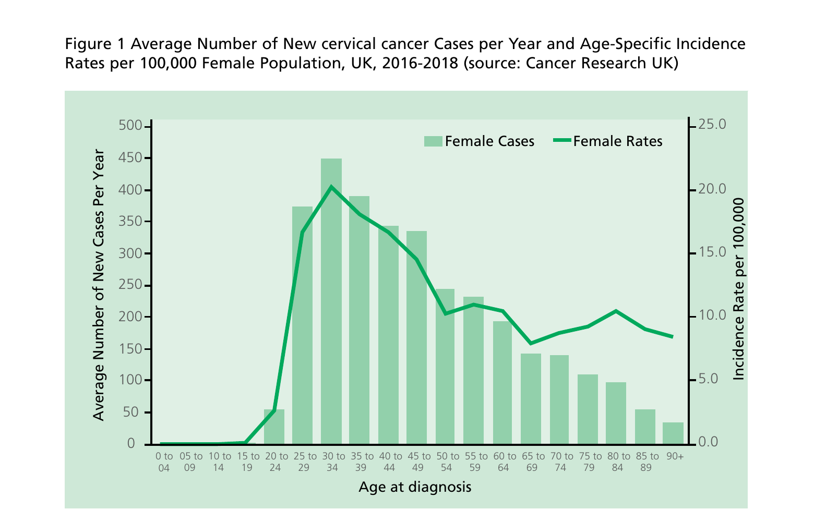

# Human papillomavirus (HPV)

## The disease

Human papillomavirus (HPV) is a double stranded DNA virus that infects squamous epithelia including the skin and mucosae of the upper respiratory and anogenital tracts. There are approximately 100 types of HPV, of which about 40 infect the genital tract (McCance, 2004). Although most infections are asymptomatic and self-limiting, genital infection by HPV is associated with genital warts and anogenital cancers in both men and women. HPV viruses are classified as either 'high-risk' or 'low-risk' types depending on their association with the development of cancer.

Genital HPVs are transmitted by sexual contact with an individual with infection, primarily through sexual intercourse. The risk of exposure, therefore, is related to the number of sexual partners, the introduction of a new sexual partner, and the sexual history of any partner. Studies of incident HPV infection, based on HPV DNA detection, demonstrate that acquisition of at least one type of HPV infection often occurs soon after sexual debut with almost 40% of women being infected within two years (Winer _et al._, 2003; Winer _et al._, 2008). Infection by multiple types is common (Cuschieri _et al._, 2004).

The use of condoms reduces but does not eliminate the risk of sexual transmission. Non-sexual routes of HPV transmission include vertical transmission from mother to newborn baby.

HPV is recognised as a necessary cause of cervical cancer and persistent infection by high-risk HPV types is detectable in more than 99% of cervical cancers (Walboomers _et al._, 1999; Bouvard _et al._, 2009; WHO IARC, 2007)^1^. Of these high-risk types, HPV16 is responsible for almost 60% and HPV18 for more than 15%, of all cervical cancers in Europe (Smith _et al._, 2007). A further 11 high-risk types have been described (WHO IARC, 2007)^1^. In addition to cervical cancer, HPV is causally associated with less common cancers at other sites, including cancer of the vulva, vagina, penis and anus, and some cancers of the head and neck (Parkin., 2011; Stanley., 2007; Psyrri _et al._, 2008; WHO IARC, 2012; Giuliano _et al._, 2015) .

1 Including types 31, 33, 35, 39, 45, 51, 52, 56, 58, 59 and 68

### Human papillomavirus (HPV)

The majority of HPV infections are transient and cause no clinical problems. Around 70% of new infections will clear within one year and approximately 90% will clear within two years (Ho _et al._, 1998; Franco _et al._, 1999; Winer _et al._, 2011). Persistent infection by a high-risk HPV type is the most important causal factor for the development of cervical pre-cancerous and cancerous lesions. Persistence and disease is more common for infections by HPV types 16 and 18 than for other high-risk types. The time span between infection by HPV and the development of pre-cancerous lesions varies from one to ten years, and can be longer for the development of invasive cancer (Moscicki _et al._, 2006).

The natural history of HPV-related cancers at other sites is less well understood. Although high-risk HPV infection is a risk factor for the development of vaginal or vulval lesions, unlike cervical cancer, only approximately 40% are associated with HPV infection (Munoz _et al._, 2006). HPV infection is associated with 80-90% of all anal squamous cell cancers and HPV types 16 and 18 are found in the majority of HPV-related anal cancers (Munoz _et al._, 2006). Around 50% of cases of penile cancer are attributable to HPV infection (de Martel, 2017). HPV is also known to be a cause of oropharyngeal cancers though estimates of the attributable fraction vary widely and range from 6% to 71% (Stein _et al._, 2015).

The wide range is likely to be explained by 1) the accuracy in the distinction of cancer of the oropharynx and tonsil from other subsites; 2) the competing effect of smoking or chewing tobacco; and 3) the quality of tissue biopsies and HPV-testing protocols used (WHO IARC, 2012; Plumber _et al._, 2016). The prevalence of HPV type 16/18 associated oropharyngeal cancer is lower in women than in men. A systematic review of HPV prevalence studies estimated that overall 47% of oropharyngeal cancer cases were HPV related (men and women all ages combined) (Kreimer _et al._, 2005) but the prevalence of HPV types16/18 has been reported as 66% and 53% in North America in men and women respectively (Steinau _et al._, 2014). A UK study estimated the attributable fraction for oropharyngeal carcinoma to be 52% (Schache _et al._, 2016). For all sites, the evidence for a causal association is greatest for HPV type 16 than for other HPV types, and the majority of HPV related cancers are associated with type 16.

Low-risk HPV types are responsible for genital warts, which is the most commonly diagnosed viral sexually transmitted infection in the UK (UK Health Security Agency (UKHSA),2022). HPV types 6 and 11 cause approximately 90% of all genital warts (Lacey _et al._, 2006; Garland _et al._, 2007; Hawkins _et al._, 2013). Genital warts appear from three weeks to eight months after primary infection (most commonly two to three months) (Oriel, 1971). In the absence of treatment, up to 30% of individuals clear the infection in the short term (Tyring _et al._, 1998; Edwards _et al._, 1998). The rate of spontaneous regression in the long term is not known. Treatments focus on removal of the warts, but do not necessarily eliminate infection, which may persist sub-clinically, and be a source of recurrence and continuing viral transmission. Genital warts are not life threatening, but they can cause significant morbidity. HPV type 6 and 11 infection also cause laryngeal papillomas, (Stamataki _et al._, 2007) an infection of the upper respiratory tract. The disease occurs in two forms, juvenile and adult papillomatosis, based on whether it develops before or after 20 years of age. The juvenile form is generally transmitted through contact with a mother's infected vaginal canal during childbirth.

## History and epidemiology of the disease

### Epidemiology of HPV infection

Surveillance of HPV is complex due to the high proportion of asymptomatic infections, the variable presentation of the different viral types, and the long period between infection and disease. Information on the prevalence of high-risk HPV infection, prior to the introduction of the HPV vaccination programme in 2008, is available from large cross-sectional studies. A UK seroprevalence study (of sera collected in 2002-2004, prior to the introduction of HPV vaccination) in an unselected population showed that HPV infections were extremely infrequent in girls aged under 14 years but rose sharply from the mid-teens. Among 10 to 29-year-old women, 11%, 3%, 12% and 5% had serological evidence of having been infected by HPV types 6, 11, 16 or 18 respectively (Jit _et al._, 2007).

A study of women having routine cervical screening in 2007-9 found evidence of current high-risk HPV infection (indicated by the presence of HPV DNA) in 29% of women aged 25 to 29 years undergoing cervical screening, with prevalence declining with increasing age after 30 years. Prevalence of any HPV type, and particularly of HPV 16 or 18, was higher in women who had abnormal cytology (Howell-Jones _et al._, 2010).

A cross-sectional study of gay, bisexual and other men who have sex with men (GBMSM) aged 18--40 years attending a London sexual health clinic indicated a quarter (25.1%) had evidence of infection with one HPV type in the quadrivalent vaccine (HPV16,18, 6 & 11), 7.4% had two or three types and none had all four types. The prevalence of the high-risk HPV vaccines types 16 and 18 (used in the bivalent vaccine) was 17% (King _et al._, 2015).

### Epidemiology of HPV-related cancer

Cervical cancer is still one of the commonest cancers amongst women worldwide, with 570,000 new cases and 311,000 deaths estimated in 2018 (Arbyn _et al._, 2020). While HPV vaccination prevents infection and subsequent disease, the secondary prevention of cervical cancer can be achieved through the early detection of HPV infection and cervical abnormalities by cervical screening. The introduction of a national cervical screening programme in the UK with coordinated call and recall was responsible for a major fall in the incidence and death rate from cervical cancer. It has been estimated that mortality rates fell approximately 60% between 1974 and 2004 in the UK due to cervical screening (Peto _et al._, 2004).

An average of 3,917 new cases of invasive cervical cancer were diagnosed per year in the UK, 2016-18 (Cancer Research UK). The peak incidence of cervical cancer occurs in women aged 30-34, a second smaller peak occurs in women in their 80s (i.e. women less likely to have benefited from cervical screening during their lifetimes; Figure 1). Older women remain at risk with more than 50% of new cases diagnosed in women over the age of 40 and more than 15% in women over 65 years of age. In the UK, the lifetime risk of developing cervical cancer was estimated as 1 in 142 in unvaccinated cohorts (Lifetime risk estimates calculated by the Statistical Information Team at Cancer Research UK based on Office for National Statistics, 2016) (Smittenaar _et al._, 2016). In the UK, approximately one third of women die within five years of the diagnosis of invasive cervical cancer (National Statistics, 2011).

In 2020 the WHO launched a _Global strategy to accelerate the elimination of cervical cancer as a public health problem_ setting out targets for HPV vaccine uptake in adolescent girls, cervical screening uptake and early access to high quality cancer treatment.

HPV-associated cancers at anogenital and head and neck sites are less common. In England, there are around 1,550 cases of vulval and vaginal cancers and 710 penile cancers per year. Anal cancer was diagnosed in 980 women and 510 men in 2017 (National Statistics, 2019). Although anal cancer is more common in women than in men, in the absence of vaccination, the risk of anal cancer among GBMSM is higher than among women (Frisch _et al._, 2003; Wilkinson _et al_, 2014) and especially amongst those who are HIV positive (Machalek _et al._, 2012). GBMSM are more likely to be infected with HPV and bear a significantly increased burden of HPV related disease and adverse outcomes compared with heterosexual men (Nyitray _et al_, 2011; Anic _et al._, 2012).

The number of oropharyngeal cancers diagnosed in men and women in England in 2017 were 5,038 and 2,549 respectively (ONS cancer registration statistics). Rates of HPV associated oropharyngeal cancer have risen significantly in the last twenty years in both genders but more so in men. The rate of HPV negative oropharyngeal cancer has also increased significantly.

### Epidemiology of genital warts

Information on diagnoses of genital warts comes primarily from people attending sexual health services in England. Prior to the introduction of the national HPV immunisation programme, rates of genital warts diagnosed in sexual health services in England had been increasing since the early 1970s, with the rate of increase slowing between 1987-1995 likely due to HIV/AIDS public health awareness campaigns. Approximately 50,000 new cases of genital warts were diagnosed in sexual health service throughout England in 2019 (Ratna _et al._, 2021, PHE, 2021). Rates of diagnoses were highest in young men and women under 24 years.

### The cervical cancer screening programme

The national policy for cervical screening is that women and people with a cervix are offered screening every three or five years depending on their age. Those aged 24.5-49 are invited every 3 years, whereas those aged 50-64 are invited every 5 years. In 2019 the primary screening test was changed from cytology to high-risk HPV testing, due to its increased sensitivity for cervical cell changes and high negative predictive value. Screening intervals are expected to be lengthened in due course for younger participants, to reflect this improved testing policy. The National Screening Committee is also reviewing evidence to inform the optimal number of cervical screening invitations required for vaccinated individuals. There are certain groups of women reported to have low cervical screening rates, e.g. some ethnic minority groups and women born in foreign countries (Webb _et al._, 2004; Thomas _et al._, 2005; Marlow _et al._, 2015). In addition, women in the most deprived groups are less likely to attend for screening but, when compared to the least deprived, are more likely to have high-risk HPV and an increased risk of being diagnosed or dying from cervical cancer. There was a downward trend in the number of young women taking up invitations for cervical screening until April 2018, which was followed by a small rise in cervical screening coverage in both the year 2018/19 and 2019/20 (NHS Cervical standards data Report 2021).

### The HPV vaccination programme

In 2008, following a detailed review of the impact and cost-effectiveness of a routine HPV vaccination programme in adolescents aimed at reducing the burden of HPV-associated cervical cancer, the Joint Committee on Vaccination and Immunisation (JCVI) recommended a universal programme of HPV vaccination in girls aged 12-13 years in schools, along with a catch-up programme for girls aged from 13 to under 18 years (JCVI, 2008). The national HPV immunisation programme was introduced in September 2008 with all girls in school year 8 in England (aged 12 to 13 years) offered vaccine against HPV infection, with a 'catch-up' campaign for girls aged up to 18 years.

The bivalent vaccine Cervarix® was the HPV vaccine offered from September 2008 to August 2012 with the quadrivalent vaccine Gardasil® being offered from September 2012 (Department of Health, 2011), both given as three-dose courses. In February 2014, JCVI concluded that a two-dose schedule in adolescents could be recommended up to (and including) 14 years of age for both Cervarix and Gardasil. A two-dose schedule of Gardasil® was implemented in the national programme for the routine vaccination cohort of females aged 11 to 13 years (academic year 8 in England and Wales) from September 2014. Gardasil®9 was introduced into the HPV immunisation programme in July 2019 and is now the only HPV vaccine supplied for the national programme.

A cross-sectional study of GBMSM aged 18--40 years attending a London sexual health clinic indicated that most GBMSM, were not currently infected with HPV, even amongst this higher risk population. The data suggested that a targeted vaccination strategy for GBMSM could have substantial benefits (King _et al._, 2015), as this group were unlikely to benefit from the herd immunity generated by the existing girls programme. These findings were used to inform an impact and cost effectiveness assessment for the JCVI (Lin _et al._, 2016). In November 2015, the JCVI advised that a targeted HPV immunisation programme should be introduced for GBMSM up to and including the age of 45 years who attend specialist sexual health services (SSHS) and HIV clinics (JCVI, 2015). Following a positive pilot evaluation (Edelstein _et al_, 2018), the programme was rolled out across England from April 2018. The aim of the programme was to extend protection against HPV infection, HPV associated cancers and genital warts to the GBMSM population attending SSHS and HIV clinics.

In July 2018, the JCVI advised that the existing HPV vaccination programme for girls could be extended to adolescent boys as well (JCVI. 2018). As a result of JCVI's advice, the Government announced that the national HPV immunisation programme would be extended to include adolescent boys from September 2019. As well as providing individual protection to males from anogenital warts and non-cervical HPV associated cancers it is expected that this will improve the resilience of the UK programme, accelerate the control of cervical cancer in women and has the potential to eliminate HPV vaccine types in the UK. Furthermore, this programme will also offer early direct protection to the GBMSM population.

### Impact of the vaccination programme

More than a decade after introduction of the national HPV immunisation programme, evidence of the impact of vaccination has shown reductions in HPV type 16/18 infection, genital warts, pre-cancerous lesions and cervical cancer among vaccinated cohorts (see below). Evidence of herd protection among unvaccinated groups is now emerging both in the UK and globally (Drolet _et al._, 2015; Drolet _et al._, 2019).

An ongoing cross-sectional study of young 16-24 year old women attending for chlamydia screening across England has shown reductions in the prevalence of HPV vaccine types since the introduction of the national programme. Among 16-18 year old females where vaccine coverage was highest, HPV 16/18 prevalence decreased from 15% in 2008, to 8.2% in 2010/11 and subsequently to 1.6% in 2016. Reductions were also seen in 19--21 year old females with lower estimated vaccination coverage (from 14.0% HPV type 16/18 prevalence in 2010/11, to 0.7% in 2018 (Mesher _et al._, 2018) (HPR 2020). In the most recent years, 2018-2020, HPV16/18 prevalence has been <1% in young females aged 16-24 years (Anderson _et al._, 2023). These results indicate the programme has succeeded in delivering both direct and indirect protection. In Scotland, a 7 year cross- sectional study showed reductions in HPV type 16/18 prevalence from 28.9% in 2009 to 4.8% in 2015 (Kavanagh K _et al._, 2017). Reductions in HPV31/33/45 prevalence (6.5% to 1.9% for 16-18 year olds and 8.6% to 2.8% for 19-21 year olds within the post- vaccination period) have also been observed, providing evidence of cross-protection from vaccination. There has been no evidence thus far of type replacement i.e. that reduction in HPV vaccine-types has led to other HPV types becoming more common.

In 2021, the rate of first episode genital warts diagnoses among young women aged 15-to-17 years attending sexual health clinics, most of whom would have been offered the quadrivalent HPV vaccine (protecting against HPV types 16,18, 6 & 11) when aged 12-13 years old, was 84.9% lower compared to 2017 (7.4 vs 49.1 per 100,000 population). A decline of 80.0% (4.1 vs 20.3 per 100,000 population) was seen in heterosexual males of the same age over this time period, suggesting substantial herd protection (UKHSA, 2022).

In Scotland, the age at which cervical screening commences was changed in 2016 (from 20 years to 25 years) meaning that women from the catch-up cohorts have been screened since 2010 and women from the routinely immunised cohorts have been screened since 2015. A recent study in Scotland has shown 89% reduction (95% CI 81% to 94%) in prevalent cervical intraepithelial neoplasia (CIN) grade 3 or worse in the first cohort of women (born in 1995/6) vaccinated at age 12-13 years with the bivalent vaccine through the national immunisation programme, compared with unvaccinated women born in 1988 (Palmer _et al._, 2019). Population studies in other settings have also shown a major impact of the quadrivalent vaccine on precancerous lesions (McClung _et al._, 2019; Herweijer _et al._, 2016; Gertig _et al._, 2013)

Early evidence of the impact of the national HPV immunisation programme on cervical cancer in England has shown dramatic reductions in cervical cancer and CIN3 in young women who were offered the bivalent Cervarix® vaccine at the age of 12-13 years since the introduction of the vaccine' to 'when compared to an unvaccinated population (Falcaro _et al._, 2021). These findings suggest that the HPV vaccine will save hundreds and eventually thousands of lives in the UK.

## The HPV vaccination

HPV vaccines have been available since 2006. Currently available vaccines are sub-unit vaccines made from the major protein of the viral-coat or capsid of HPV. Virus-like particles (VLPs) are prepared from recombinant proteins grown in either yeast or baculovirus infected insect cells (the latter derive from a type of moth). VLPs mimic the structure of the native virus but do not contain any viral DNA. They do not contain live organisms and cannot cause the diseases against which they protect.

There are currently three different HPV vaccine products available globally, however since July 2022 only Gardasil®9 is available for use in the UK Immunisation programme. Cervarix® contains VLPs for two HPV types (16 and 18 -- bivalent vaccine), Gardasil® contains VLPs for four HPV types (6, 11, 16 and 18 -- quadrivalent vaccine) and Gardasil®9 contains VLPs for nine HPV types (6, 11, 16, 18, 31, 33, 45, 52 and 58 -- nine valent vaccine). The VLPs used in Cervarix® are adjuvanted by AS04 containing 3-O-desacyl-4'-monophosphoryl lipid A (MPL) adsorbed on aluminium hydroxide. The VLPs used in Gardasil® and Gardasil®9 are adsorbed on amorphous aluminium hydroxyphosphate sulphate adjuvant. The vaccines do not contain thiomersal.

HPV vaccines are highly effective at preventing the infection of susceptible women with the HPV types covered by the vaccine. In clinical trials in young women with no evidence of previous infection, vaccines were over 99% effective at preventing pre-cancerous lesions associated with HPV types 16 or 18 (Harper _et al._, 2006; Ault _et al._, 2007; Lu _et al._, 2011). Current studies suggest that protection is maintained for at least ten years (Kjaer _et al._, 2018); Porras _et al._, 2020). Based on the immune responses, it is expected that protection will be extended further and may be lifelong; long-term follow-up studies are in place. Direct evidence on the efficacy/effectiveness of HPV vaccination in males is limited but the available evidence indicates that the vaccine is safe and efficacious against genital HPV infection and high-grade anal intraepithelial lesions especially in HPV naive individuals (Harder _et al._, 2018; Giuliano _et al._, 2011). Gardasil® is also 99% effective at preventing genital warts associated with vaccine types in young women (Barr _et al._, 2007).

As high efficacy had been demonstrated in young women through clinical trials, immunological studies which show equivalent response in terms of immunogenicity have become an acceptable "bridge" to infer efficacy and duration of protection. The licensing indication for Gardasil was based on the demonstration of efficacy of Gardasil in females 16 to 45 years of age and in males 16 to 26 years of age and on the demonstration of immunogenicity of Gardasil in 9 to 15 year old children and adolescents. For Cervarix®, immunogenicity in males has been demonstrated to be non-inferior compared with young girls and women to infer efficacy.

Adolescents vaccinated using a two-dose schedule administered as a prime and boost (separated by a minimum of 6 months) have equivalent responses to the three-dose schedule in older women (including Dobson _et al._, 2013; Safaeian _et al._, 2013). In 2013/14, both Gardasil and Cervarix® received licensing approval from the European Medicines Agency (EMA) for a two-dose schedule in adolescent girls (SPC Gardasil, Cervarix®).

Some other high-risk HPV types are closely related to those contained in the HPV16/18 vaccines, and vaccination has been shown to provide some cross-protection against infection by these types (Brown _et al._, 2009; Lehtinen _et al._, 2012; Brotherton., 2017). A systematic review and meta-analysis including data from seven studies demonstrating reductions in the vaccine-type high- risk HPV types (HPV16 and 18) among 13 to 19 year old females in countries with female vaccination coverage of at least 50% also showed evidence of a reduction in HPV types 31, 33 and 45, confirming some cross-protection (Drolet _et al._, 2015).

For the nine valent vaccine the indication is based on non-inferiority with the 4 vaccine types in the quadrivalent vaccine for girls, women and men; demonstration of efficacy against HPV Types 31, 33, 45, 52 and 58 in girls and women and; demonstration of non-inferior immunogenicity against the Gardasil®9 HPV types in boys and girls aged 9 to 15 years and men aged 16 to 26 years, compared to girls and women aged 16 to 26 years. Gardasil®9 received licensing approval from the European Medicines Agency (EMA) for a two-dose schedule in adolescent girls in April 2016 and is licensed for individuals aged 9 up to and including 14 years of age (SPC, Gardasil®9).

In May 2020 the JCVI HPV Subcommittee reviewed the latest evidence, which included immunogenicity and effectiveness data around alternative schedules (JCVI HPV Subcommittee., 2020). JCVI concluded that the programme should move to a two-dose schedule for all children and adults, including GBMSM (JCVI.,2020), with the exception of those eligible individuals living with HIV or immunosuppression at the time of the vaccine offer (JCVI., 2021). The move to a two-dose schedule for all children and adults, including GBMSM came into effect on the 1 April 2022 in England.

JCVI reviewed cumulative evidence to support a move to a single-dose HPV schedule throughout 2021/2022, including data from trials designed to look at a single-dose of Gardasil®9 (Barnabas _et al._,2022; Watson-Jones _et al._,2022). JCVI issued interim advice to move to a one-dose HPV schedule in February 2021 (JCVI., 2021) including a stakeholder consultation. In June 2022 confirmed its advice and a statement confirming this advice was published in July 2022 advising the following schedules:

i. a one-dose schedule for the routine adolescent programme;

ii. a one-dose schedule for those eligible for the GBMSM programme who come forward before their 25th birthday;

iii. a two-dose schedule from the age of 25 in the GBMSM programme before their 45th birthday;

iv. a three-dose schedule for individuals who are immunosuppressed and those known to be HIV-positive at the time of vaccination before their 25th birthday or 45th birthday (if GBMSM).

In April 2022 WHO SAGE also issued advice recommending a one or two-dose schedule for the primary target population of girls aged 9-14; one or two-dose schedule for young women aged 15-20 and, two doses with a 6-month interval for women older than 21. A position statement was subsequently published in December 2022.

The bi-partite letter published on 20/06/2023 here: https://www.gov.uk/government/publications/hpv-vaccination-programme-changes-from-september-2023-letter includes operational detail on the move to a 1-dose schedule from 1 September 2023.

### Storage

Vaccines should be stored in the original packaging at +2°C to +8°C (ideally aim for 5°C) and protected from light. All vaccines are sensitive to some extent to heat or cold. Heat speeds up the decline in potency of most vaccines, thus reducing their shelf life.

Effectiveness cannot be guaranteed for vaccines unless they have been stored at the correct temperature. Freezing may cause increased reactogenicity and loss of potency for some vaccines. It can also cause hairline cracks in the container, leading to contamination of the contents.

### Presentation

HPV vaccines are all supplied as suspensions of VLPs in pre-filled syringes. During storage, a white precipitate may develop and the vaccines should be shaken before use to form a white cloudy liquid.

## HPV immunisation programme

### Dosage and schedule for HPV vaccines licensed in the UK^1^

**One-dose schedule (for children, adolescents and adults less than 25 years old)**

Gardasil®, Gardasil®9 and Cervarix®

One dose of 0.5ml of HPV vaccine.

For children, adolescents and adults less than 25 years old, JCVI recommends a single-dose schedule for all HPV vaccines.

**Two-dose schedule (adults aged 25 years and above)**

Gardasil®, Gardasil®9 and Cervarix®

- first dose of 0.5ml of HPV vaccine
- second dose of 0.5ml six to 24 months after the first dose

For those aged 25 years and above, JCVI recommends a two-dose schedule of 0, 6-24 months for all HPV vaccines. Any gap between doses of between 6 and 24 months is clinically acceptable. If the course is interrupted, it should be resumed but not repeated, even if more than 24 months have elapsed since the first dose.

Whenever possible, immunisations for all individuals should follow the recommended 0, 6-24 months schedule, but there is some clinical data that suggests the interval between the two doses can be reduced to 5 months for Cervarix®. For Gardasil®9 the minimum interval between the two doses should be 6 months. For Gardasil® the minimum interval between the two doses can be 5 months.

1 Gardasil®9 is the only HPV vaccine supplied for the national HPV programme (for both adolescents and GBMSM). (see below for further details).

**Three-dose schedule (for HIV-positive or immunocompromised populations)**

Gardasil® and Gardasil®9

- first dose of 0.5ml of HPV vaccine
- second dose of 0.5ml at least one month after the first dose
- third dose of 0.5ml at least three months after the second dose

Cervarix®

- first dose of 0.5ml of HPV vaccine
- second dose of 0.5ml, one to two and a half months after the first dose
- third dose of 0.5ml at least five months after the first dose

A vaccination schedule of 0, 1, 4-6 months is appropriate for the HPV vaccine for individuals who are HIV-positive or immunocompromised populations (see section below). All three doses should ideally be given within a 12-month period. If the course is interrupted, it should be resumed but not repeated, ideally allowing the appropriate interval between the remaining doses.

There is no clinical data on whether the interval between doses two and three can be reduced below three months. Where the second dose is given late and there is a high likelihood that the individual will not return for a third dose after three months or if, for practical reasons, it is not possible to schedule a third dose within this time-frame, then a third dose can be given at least one month after the second dose. This applies to all the currently licensed HPV vaccines.

Where GBMSM are eligible for two or three doses, varied spacing is possible. Owing to the opportunistic nature of delivery, a 24-month period for completion of the course is clinically acceptable, providing the minimum interval between doses is respected where possible. This should enable the administration of subsequent doses to be aligned with recommended SSHS re-attendance in order to avoid the need for additional visits for vaccination only.

Where vaccines have inadvertently been given at less than the recommended interval, the dose given early should be discounted and should be repeated once the recommended time period has elapsed and at least 4 weeks from the dose given early in error.

### Previous incomplete HPV vaccination

Since July 2022, Gardasil®9 is the only HPV vaccine supplied for the national HPV programme (for both adolescents and GBMSM). Evidence is available that supports the interchangeability of all HPV vaccines (JCVI, 2018). Individuals who started their schedule with a product not available in the UK, and require additional doses to complete their course, (see dosage and schedule section) will follow a mixed schedule.

### Administration

Vaccines are routinely given intramuscularly into the upper arm or anterolateral thigh. This is to reduce the risk of localised reactions, which are more common when vaccines are given subcutaneously (Mark _et al._, 1999; Zuckerman, 2000; Diggle _et al._, 2000).

Individuals with bleeding disorders may be vaccinated intramuscularly if, in the opinion of a doctor familiar with the individual's bleeding risk, vaccines or similar small volume intramuscular injections can be administered with reasonable safety by this route. If the individual receives medication/treatment to reduce bleeding, for example treatment for haemophilia, intramuscular vaccination can be scheduled shortly after such medication/treatment is administered. Individuals on stable anticoagulation therapy, including individuals on warfarin who are up to date with their scheduled INR testing and whose latest INR was below the upper threshold of their therapeutic range, can receive intramuscular vaccination. A fine needle (equal to 23 gauge or finer calibre such as 25 gauge) should be used for the vaccination, followed by firm pressure applied to the site (without rubbing) for at least 2 minutes. If in any doubt, consult with the clinician responsible for prescribing or monitoring the individual's anticoagulant therapy.

HPV vaccines can be given at the same time as other vaccines including Td/ IPV, MMR, Influenza, MenACWY and hepatitis B. A trend of lower anti-HPV titres has been observed when Gardasil® is administered concomitantly with dTaP, dT/IPV and dTaP/IPV vaccines, though the clinical significance of this observation is unclear. Concomitant administration of 9vHPV vaccine with MenACWY dTaP does not interfere with the antibody response to any of these vaccines (Schilling _et al._, 2015). The vaccines should be given at a separate site, preferably in a different limb. If given in the same limb, they should be given at least 2.5cm apart (American Academy of Pediatrics, 2006). The site at which each vaccine was given should be noted in the individual's records.

### Disposal

Equipment used for vaccination, including used vials, ampoules or syringes, should be disposed of by placing them in a proper, puncture-resistant 'sharps' box according to local authority regulations and guidance in Health Technical Memorandum 07-01: Safe management of healthcare waste (Department of Health, 2013).

## Recommendations for the use of the vaccine

### National adolescent HPV vaccination programme

The objective of the HPV immunisation programme for adolescents is to vaccinate boys and girls before they reach an age when the risk of HPV infection increases and puts them at subsequent risk of cervical or other HPV-related cancers.

Prevention of HPV infection in those eligible for vaccination (and in others outside of the routine programme) should include advice on safer sex. All women, whether vaccinated or not, should be strongly encouraged to attend routine cervical screening at the scheduled age.

### Children aged 9 to 11 years

Cervarix® Gardasil® and Gardasil®9 are licensed for individuals from nine years old. Vaccination of girls and boys aged 9 to 11 years is not covered by the national HPV vaccination programme.

### Adolescents aged from 11 years and adults aged less than 25 years

HPV vaccination is routinely recommended for all girls and boys from 11 years of age with vaccination offered in school year 8 in England and Wales, S1 in Scotland, and school year 9 in Northern Ireland. The course of HPV vaccination should be administered according to the guidance given in the dosage and schedule section.

Males and females in cohorts eligible for vaccination in the national programme remain so until their 25th birthday. Females and males in those cohorts who were eligible for the routine programme (i.e. for England, females born after 01/09/1991 and males born after 01/09/2006) coming to the UK from overseas and registered with a GP practice may not have been offered protection against HPV in their country of origin and should be offered vaccination if they are aged under 25 years. For Scotland, Wales and Northern Ireland dates of birth for eligible cohorts may vary due to the different ages at which the HPV vaccine is first offered. Contractual arrangements for these programmes should be checked with relevant commissioners and Devolved Administrations.

Where an older male or female in the target cohorts presents with an inadequate vaccination history, every effort should be made to clarify what doses they have had and when they received them. A male or female who received one HPV vaccine dose before reaching the age of 25 years does not require any further doses.

### HPV vaccination programme for gay, bisexual, and other men who have sex with men (GBMSM)

The objective of the national programme for GBMSM is to extend protection to those in the GBMSM population who are considered at highest risk of HPV infection and subsequent disease by offering opportunistic vaccination at SSHS and HIV clinics. This programme is expected to continue for some time after boys become eligible through the universal schools programme in order to offer direct protection to older GBMSM.

For more information relating to the HPV programme for GBMSM, including detailed guidance, please see: https://www.gov.uk/government/collections/hpv-vaccination-for-men-who-have-sex-with-men-msm-programme#programme-documents

### GBMSM aged up to and including 45 years

All GBMSM aged up to and including 45 years old who attend SSHS or HIV services are eligible for vaccination, if they have not already previously been vaccinated. The course of HPV vaccination should be administered according to the guidance given in the dosage and schedule section.

### GBMSM aged 46 years and over

Anyone eligible for the GBMSM HPV vaccination programme who started, but did not complete the required schedule before reaching the age of 46 years, should complete the vaccination course, providing the first dose was given as part of the pilot or national programme.

### Transgender and other individuals

There may be considerable benefit in offering the HPV vaccine to individuals attending SSHS or HIV clinics who were not eligible for the routine HPV programme and are deemed to have a similar risk profile to that seen in the GBMSM population. This includes some transgender individuals, sex workers, and men and women living with HIV infection. Those whose risk of acquiring HPV is considered equivalent to the risk of GBMSM eligible for the HPV vaccine, should be offered vaccination.

## Contraindications

There are very few individuals who cannot receive HPV vaccine. Where there is doubt, rather than withholding vaccination, appropriate advice should be sought from the relevant specialist, or from the local immunisation or health protection team.

The vaccine should not be given to those who have had:

- a confirmed anaphylactic reaction to a previous dose of HPV vaccine, or
- a confirmed anaphylactic reaction to any components of the vaccine

Yeast allergy is not a contraindication to the HPV vaccine. Even though Gardasil® and Gardasil®9 are grown in yeast cells, the final vaccine product does not contain yeast as an excipient/ingredient, and at most would only contain very small trace amounts of yeast protein (<0.007 micrograms).

Minor illnesses without fever or systemic upset are not valid reasons to postpone immunisation. If an individual is acutely unwell, immunisation may be postponed until they have fully recovered. This is to avoid confusing the differential diagnosis of any acute illness by wrongly attributing any signs or symptoms to any possible adverse effects of the vaccine.

### Pregnancy and breast-feeding

There is no known risk associated with giving inactivated, recombinant viral or bacterial vaccines or toxoids during pregnancy or whilst breast-feeding (Atkinson _et al._, 2008). Since inactivated vaccines cannot replicate they cannot cause infection in either the mother or the fetus.

As with most pharmaceutical products, specific clinical trials of HPV vaccine in pregnant women were not undertaken prior to licensure. During the clinical development programme, almost 4,000 women (Gardasil® = 1,894 vs. comparator = 1,925) reported at least one pregnancy during follow-up. There were no significant differences in types of anomalies or proportion of pregnancies with an adverse outcome in each arm. Many pregnant women have also been exposed to HPV vaccine during the post-marketing period. A nationwide register-based cohort study involving all pregnant women in Denmark found no significant risk associated with the quadrivalent vaccine, compared with no vaccination, of spontaneous abortion, major birth defect, stillbirth, preterm birth, small size for gestational age, and low birth weight (Scheller _et al._, 2017). The available data are very reassuring and do not indicate any safety concern or harm to pregnancy.

Routine questioning about last menstrual period and/or pregnancy testing is not required before offering HPV vaccine. Schoolgirls who are known to be sexually active, including those who are or who have been pregnant, may still be susceptible to high-risk HPV infection and could therefore benefit from vaccination according to the UK schedule. If a woman finds out she is pregnant after she has started a course of HPV vaccine, termination of pregnancy following inadvertent immunisation should not be recommended.

### Immunosuppression and HIV infection

There is limited data on fewer than 3 doses among populations who are HIV-positive or immunosuppressed. Therefore a 3-dose schedule should be offered to individuals who are immunosuppressed at the time of immunisation and those known to be HIV-positive, including those on antiretroviral therapy. This recommendation is endorsed by JCVI and WHO SAGE.

Eligible GBMSM who are known to be HIV positive should be offered the HPV vaccine regardless of CD4 count, antiretroviral therapy use or viral load. The quadrivalent and nine valent HPV vaccines are safe and highly immunogenic in adults who are HIV-positive (Wilkin _et al._, 2010; Kojic _et al_ 2014 Boey _et al_ 2021). Lower geometric mean titre antibody levels have been observed in individuals who are HIV positive compared to individuals who were HIV negative (Toft _et al._, 2014). Despite this, HPV vaccines appear to show good efficacy in this population (McClymont., 2018).

Suboptimal immunogenicity of HPV vaccine in transplant patients has been observed (Kumar _et al._, 2013). Additional doses of vaccine should be considered after treatment is finished and/or recovery has occurred. Specialist advice may be required.

Further guidance is provided by the Royal College of Paediatrics and Child Health (https://www.rcpch.ac.uk/), the British HIV Association (BHIVA) immunisation guidelines for HIV-infected adults (BHIVA, 2015; and the Children's HIV Association (CHIVA) immunisation guidelines (https://www.chiva.org.uk/guidelines/immunisation/).

## Adverse reactions

As with all vaccines and medicines, healthcare professionals and parents/ carers should report suspected adverse reactions to the Medicines and Healthcare products Regulatory Agency (MHRA) using the Yellow Card reporting scheme (http://yellowcard.mhra.gov.uk/).

The most common adverse reaction observed after HPV vaccine administration is mild to moderate short-lasting pain at the injection site. An immediate localised stinging sensation has also been reported. Redness has also been reported at the injection site. Other reactions commonly reported are headache, myalgia, fatigue, and low-grade fever.

A detailed list of adverse reactions associated with Cervarix®, Gardasil® and Gardasil®9 is available in the HPV vaccination guidance for healthcare practitioners at: https://www.gov.uk/government/publications/hpv-universal-vaccination-guidance-for-health-professionals/hpv-universal-vaccination-guidance-for-healthcare-practitioners-version-3

Syncope (vasovagal reaction), or fainting, can occur during any vaccination, most commonly amongst adolescents and adults. Some individuals may also experience panic attacks before vaccination. The clinical features of fainting and panic attacks are described in detail in Chapter 8 of the Green Book. Fainting and panic attacks occurring before or very shortly after vaccination are not usually direct side effects (adverse reactions) of the vaccine but events associated with the injection process itself.

### Reporting anaphylaxis and other allergic reactions

Anaphylaxis is a very rare, recognised side effect of most vaccines and suspected cases should be reported via the Yellow Card Scheme (www.mhra. gov.uk/yellowcard). Chapter 8 of the Green Book gives detailed guidance on distinguishing between faints, panic attacks and the signs and symptoms of anaphylaxis. If a case of suspected anaphylaxis meets the clinical features described in Chapter 8, this should be reported via the Yellow Card Scheme as a case of 'anaphylaxis' (or if appropriate 'anaphylactoid reaction'). Cases of less severe allergic reactions (i.e. not including the aforementioned clinical features for anaphylaxis) should not be reported as anaphylaxis but as 'allergic reaction'.

Since 2008, a range of suspected serious adverse reactions have been reported in temporal association with HPV vaccines at global level. These relate to a wide range of illnesses, mostly chronic syndromes. Four population-based studies, from the UK, Norway, Finland and The Netherlands, have found no evidence that HPV vaccines may be a cause of chronic fatigue syndrome (Donegan _et al._, 2013; Feiring _et al._, 2017; Schurink-van't Klooster _et al._, 2018). Numerous published epidemiological studies from independent academics have found no evidence of serious harm based a wide range of safety endpoints, including autoimmune disorders [Macartney., 2013 _et al_]. Reviews by national and international safety committees have concluded that these concerns are unfounded and have strongly supported the safety and use of the vaccine (WHO GACVS, 2015).

## Supplies

- Cervarix® -- manufactured by GlaxoSmithKline -
- Gardasil® -- manufactured by MSD
- Gardasil®9 -- manufactured by MSD

HPV vaccines used in the National programme are distributed in the UK by Movianto UK Ltd (Tel: 01234 248631) as part of the national childhood immunisation programme.

Vaccines for the national programme are supplied centrally via ImmForm. There are separate order lines for the GBMSM and adolescent HPV programmes on Immform. The correct one must be used to order vaccine volumes for each programme, even where an ImmForm account holder is ordering for both.

Vaccines for use outside of the national programme recommendations should be ordered from the manufacturers or pharmaceutical wholesaler.

In Scotland, supplies should be obtained from local childhood vaccine holding centres. Details of these are available from Procurement, Commissioning & Facilities of NHS National Services Scotland (Tel: 0131 275 6725).

In Northern Ireland, supplies should be obtained from local childhood vaccine holding centres. Details of these are available from the Regional Pharmaceutical Procurement Service (Tel: 028 9442 4346).

## References

- American Academy of Pediatrics (2006) Vaccine Administration. In: Pickering LK (ed.) _Red Book: 2006. Report of the Committee on Infectious Diseases_. 26th edition. Elk Grove Village, IL: American Academy of Pediatrics, pp. 18-22.
- Anderson A, Checchi M, Panwar K, Beddows S and Soldan K (2023). Surveillance of HPV 16/18 infection in a population with high vaccination coverage (England): findings, issues and future priorities [conference abstract]. EUROGIN 2023, Bilbao, Spain.
- Atkinson WL, Kroger AL and Pickering LK (2008) Section 1: General aspects of vaccination, Part 7: General immunization practices. In: Plotkin S, Orenstein W and Offit P (eds) _Vaccines_. 5th edition. Philadelphia: WB Saunders Company, pp 83-109.
- Anic GM, Lee J-H, Villa LL, Lazcano-Ponce E, Gage C, Jose' C, Silva R, Baggio ML, Quiterio M, Salmero'n J, Papenfuss MR, Abrahamsen M, Stockwell H, Rollison DE, Wu Y, Giuliano AR (2012) Risk factors for incident condyloma in a multinational cohort of men: the HIM study. _J Infect Dis_ 205: 789--793.
- Ault KA and FUTURE II Study Group (2007) Effect of prophylactic human papillomavirus L1 virus-like-particle vaccine on risk of cervical intraepithelial neoplasia grade 2, grade 3, and adenocarcinoma _in situ_: a combined analysis of four randomised clinical trials. _Lancet_ **369**(9576): 1861-8.
- Barnabas RV, Brown ER, Onono MA _et al._ Efficacy of single-dose HPV vaccination among young African women. NEJM Evid. 2022 Jun;1(5): EVIDoa2100056. doi: 10.1056/EVIDoa2100056. Epub 2022 Apr 11. PMID: 35693874; PMCID: PMC9172784.
- Barr E and Tamms G (2007) Quadrivalent human papillomavirus vaccine. _Clin Infect Dis_ **45**(5): 609-17.
- Bouvard V, Baan R, Straif K, _et al_. A review of human carcinogens---Part B: biological agents. Lancet Oncol 2009;10: 321--22.
- British HIV Association (2008) British HIV Association guidelines for immunization of HIV-infected adults 2008. _HIV Med_ **9(10)**: 795-848. http://www.bhiva.org/documents/Guidelines/Immunisation/Immunization2008.pdf. Accessed December 2013.
- Brotherton JML.Comment: Confirming cross-protection of bivalent HPV vaccine.Lancet Infect Dis 2017;17(12):1227-1228
- Boey L, Curinckx A, Roelants M _et al_ Immunogenicity and Safety of the 9-Valent Human Papillomavirus Vaccine in Solid Organ Transplant Recipients and Adults Infected With Human Immunodeficiency Virus (HIV). Clin Infect Dis. 2021 Aug 2;73(3):e661-e671. doi: 10.1093/cid/ciaa1897. PMID: 33373429.
- Brown D, Kjaer S, Sigurdsson K _et al._ (2009) The impact of quadrivalent human papillomavirus (HPV; types 6, 11, 16, and 18) L1 virus-like particle vaccine on infection and disease due to oncogenic nonvaccine HPV types in generally HPV-naive women aged 16-26 years. _J Infect Dis_ **199**: 926-35. Cervarix SPC available at https://www.ema.europa.eu/en/documents/product-information/cervarix-epar-product-information_en.pdf.
- Chin-Hong PV, Vittinghoff E _et al._ Age-Specific prevalence of anal human papillomavirus infection in HIV-negative sexually active men who have sex with men: the EXPLORE study. _J Infect Dis_ 2004; 190:2070-6.
- Cuschieri KS, Cubie HA, Whitley MW _et al._ (2004) Multiple high risk HPV infections are common in cervical neoplasia and young women in a cervical screening population. _J Clin Pathol_ **57**: 68--72.
- Department of Health (2013) _Health Technical Memorandum 07-01: Safe management of healthcare waste_. https://www.gov.uk/government/uploads/system/uploads/attachment_data/file/167976/HTM_07-01_Final.pdf. Accessed December 2013.
- Department of Health (2011) HPV vaccination programme switching to Gardasil® from September 2012 https://webarchive.nationalarchives.gov.uk/ukgwa/20130402232333/http://immunisation.dh.gov.uk/hpv-vacc-prog-switch-to-gardasil-sept-2012/ Accessed: Feb. 2012.
- Daling JR, Weiss NS _et al._ Sexual practices, sexually transmitted diseases, and the incidence of anal cancer. _N Engl J Med_ 1987; 317:973-7
- Diggle L and Deeks J (2000) Effect of needle length on incidence of local reactions to routine immunisation in infants aged 4 months: randomised controlled trial. _BMJ_ **321**(7266): 931-3.
- DiMiceli L, Pool V, Kelso JM _et al._ (2006) Vaccination of yeast sensitive individuals: review of safety data in the US vaccine adverse event reporting system (VAERS). _Vaccine_ **24**(6): 703-7.
- Donegan K , Beau-Lejdstrom R, King B _et al._ Bivalent human papillomavirus vaccine and the risk of fatigue syndromes in girls in the UK. _Vaccine_ 2013; 31: 4961-4967
- Dobson SR, McNeil S, Dionne _et al._ (2013) Immunogenicity of 2 doses of HPV vaccine in younger adolescents vs 3 doses in young women: a randomized clinical trial. _JAMA_; 309 (17):1793-802.
- Drolet M, Benard E, Boily MC, _et al._ Population-level impact and herd effects following human papillomavirus vaccination programmes: a systematic review and meta-analysis. _Lancet ID_, 2015. https://www.sciencedirect.com/science/article/pii/S1473309914710734?via%3Dihub
- Drolet M, Benard E, Perez N, _et al._ Population-level impact and herd effects following human papillomavirus vaccination programmes: a systematic review and meta-analysis. Lancet , 2019. Epub ahead of print: https://doi.org/10.1016/S0140-6736(19)30298-3
- Edelstein M, Iyanger N, Hennessy N _et al._ Implementation and evaluation of the human papillomavirus (HPV) vaccination pilot for men who have sex with men (MSM), England, April 2016 to March 2017. Euro Surveill. 2019;24(8):pii=1800055. https://doi.org/10.2807/1560-7917.ES.2019.24.8.1800055
- Edwards L, Ferenczy A, Eron L _et al._ (1998) Self-administered topical 5% imiquimod cream for external anogenital warts. HPV Study Group. Human PapillomaVirus. _Arch Dermatol_ **134**(1): 25-30.
- Falcaro M, Castanon A, Ndlela B, _et al._ The effects of the national HPV vaccination programme in England, UK, on cervical cancer and grade 3 cervical intraepithelial neoplasia incidence: a register-based observational study. _Lancet_ 2021;(Nov). doi:10.1016/S0140-6736(21)02178-4.
- Feiring B, Laake I, Bakken I.J _et al._ HPV vaccination and risk of chronic fatigue syndrome/myalgic encephalomyelitis: A nationwide register-based study from Norway. _Vaccine_ 2017;35 (33): 4203-4212.
- Ferlay J, Soerjomataram I, Dikshit R _et al._ Cancer incidence and mortality worldwide: sources, methods and major patterns in GLOBOCAN 2012. _Int J Cancer_. 2015;136(5):E359-86.
- Franco EL, Villa LL, Sobrinho JP _et al._ (1999) Epidemiology of acquisition and clearance of cervical human papillomavirus infection in women from a high-risk area for cervical cancer. _J Infect Dis_ **180**(5): 1415-23.
- Frisch M, Smith E, Grulich A, Johansen C (2003) Cancer in a population based cohort of men and women in registered homosexual partnerships. _Am J Epidemiol_ 157: 966--972.
- Gardasil Summary of Product Characteristics. Available at the electronic Medicines Compendium (eMC) : https://www.medicines.org.uk/emc/product/261/smpc
- Gardasil9 Summary of Product Characteristics. Available at the electronic Medicines Compendiu (eMC))m : https://www.medicines.org.uk/emc/product/7330/smpc
- Garland SM, Hernandez-Avila M, Wheeler CM _et al._ (2007) Quadrivalent vaccine to prevent anogenital diseases. _N Engl J Med_ **356**(19): 1928-43.
- Gertig DM, Brotherton JM, Budd AC _et al._ Impact of a population-based HPV vaccination program on cervical abnormalities: a data linkage study. BMC Med 2013;11:227.doi:10.1186/1741-7015-11-227
- Gillison ML Koch WM Capone RB _et al._ Evidence for a causal association between human papillomavirus and a subset of head and neck cancers. _J Natl Cancer Inst_ . 2000;92 (9):709--720
- Giuliano AR, Nyitray AG, Kreimer AR, _et al._ EUROGIN 2014 Roadmap: Differences in HPV infection natural history, transmission, and HPV-related cancer incidence by gender and anatomic site of infection. _Int J Cancer_. 2015;136(12):2752-2760. doi:10.1002/ijc.29082.
- Giuliano AR, Palefsky JM, Goldstone S, _et al._ Efficacy of quadrivalent HPV vaccine against HPV Infection and disease in males. _New England Journal of Medicine_ 2011; 364(5):401-411
- Harder T, Wichmann O, Klug SJ _et al._ Efficacy, effectiveness and safety of vaccination against human papillomavirus in males: a systematic review BMC Medicine (2018) 16:110
- Harper DM, Franco EL, Wheeler CM _et al._ (2006) Sustained efficacy up to 4.5 years of a bivalent L1 virus-like particle vaccine against human papillomavirus types 16 and 18: follow-up from a randomised control trial. _Lancet_ **367**(9518): 1247-55.
- Hawkins MG, Winder DM, Ball SL, Vaughan K, Sonnex C, Stanley MA, _et al._ Detection of specific HPV subtypes responsible for the pathogenesis of condylomata acuminata. _Virology journal_. 2013;10:137
- Herweijer E, Sundstrom K, Ploner A _et al._ Quadrivalent HPV vaccine effectiveness against high-grade cervical lesions by age at vaccination: A population-based study. Int J Cancer 2016;138:2867-74. doi:10.1002/ijc.30035
- Ho GY, Bierman R, Beardsley L _et al._ (1998) Natural history of cervicovaginal papillomavirus infection in young women. _N Engl Med_ **338**(7): 423-8.
- Howell-Jones R, Bailey A, Beddows S _et al._ (2010) Multi-site study of HPV type-specific prevalence in women with cervical cancer, intraepithelial neoplasia and normal cytology, in England. _Br J Cancer_, **103**(2): 209-16. Erratum in: _Br J Cancer_ (2010), **103**(6): 928.
- HPA (2007) _Testing times -- HIV and other sexually transmitted Infections in the United Kingdom: 2007_. Accessed: Feb. 2012. HPA (2012) STI annual data tables. Accessed: Feb. 2012.
- Jit M, Vyse A, Borrow R _et al._ (2007) Prevalence of human papillomavirus antibodies in young female subjects in England. _Br J Cancer_ **97**(7): 989-91.
- Joint Committee on Vaccination and Immunisation. Statement on Human papillomavirus vaccines to protect against cervical cancer. July 2008. Available at: https://webarchive.nationalarchives.gov.uk/ukgwa/20120907095410/http://www.dh.gov.uk/ab/JCVI/DH_094744
- Joint Committee on Vaccination and Immunisation. (2014) Minute of the meeting on Tuesday February 11 and Wednesday 12 February 2014 available at : https://www.gov.uk/government/groups/joint-committee-on-vaccination-and-immunisation#publications-and-statements.
- Joint Committee on Vaccination and Immunisation statement on HPV vaccination of men who have sex with men. November 2015. Available at: https://www.gov.uk/government/publications/jcvi-statement-on-hpv-vaccination-of-men-who-have-sex-with-men.
- Joint Committee on Vaccination and Immunisation HPV Subcommittee (2018). Minute of the meeting on May 18 2018 available at: https://www.gov.uk/government/groups/joint-committee-on-vaccination-and-immunisation.
- Joint Committee on Vaccination and Immunisation statement: extending the HPV vaccination programme -- conclusions. 18 July 2018. available at: https://www.gov.uk/government/groups/joint-committee-on-vaccination-and-immunisation.
- Joint Committee on Vaccination and Immunisation HPV Subcommittee (2020). Minute of the meeting on May 21 2020 available at: https://www.gov.uk/government/groups/joint-committee-on-vaccination-and-immunisation.
- Joint Committee on Vaccination and Immunisation (2020). Minute of the meeting on June 03 2020 available at: https://www.gov.uk/government/groups/joint-committee-on-vaccination-and-immunisation.
- Joint Committee on Vaccination and Immunisation (2021). Minute of the meeting on June 22 2021 available at: https://www.gov.uk/government/groups/joint-committee-on-vaccination-and-immunisation.
- Joint Committee on Vaccination and Immunisation interim advice on a one-dose schedule for the routine HPV immunisation programme. 10 February 2021 available at: https://www.gov.uk/government/publications/single-dose-of-hpv-vaccine-jcvi-interim-advice/jcvi-interim-advice-on-a-one-dose-schedule-for-the-routine-hpv-immunisation-programme.
- Joint Committee on Vaccination and Immunisation statement on a one-dose schedule for the routine HPV immunisation programme 5 August 2022. Available at: https://www.gov.uk/government/publications/single-dose-of-hpv-vaccine-jcvi-concluding-advice/jcvi-statement-on-a-one-dose-schedule-for-the-routine-hpv-immunisation-programme.
- Kavanagh K, Pollock KG, Cuschieri K, Palmer T, Cameron RL, Watt C, _et al._ Changes in the prevalence of human papillomavirus following a national bivalent human papillomavirus vaccination programme _lancet infectious diseases_ 2017 17(12) 1293-302
- Kjaer SK, Nygard M, Dillner J, J et . A 12-Year Follow-up on the Long-Term Effectiveness of the Quadrivalent Human Papillomavirus Vaccine in 4 Nordic Countries. Clin Infect Dis. 2018: 18;66(3):339-345.
- King _et al_ (2015) Human papillomavirus DNA in men who have sex with men: type-specific prevalence, risk factors and implications for vaccination strategies. _British Journal of Cancer_ (2015), 1--9
- Kojic EM, Kang M, Cespedes MS, _et al._ Immunogenicity and safety of the quadrivalent human papillomavirus vaccine in HIV-1-infected women. Clin Infect Dis 2014; 59:127--35.
- Kumar D, Unger ER, Panicker G _et al._ (2013), Immunogenicity of Quadrivalent Human Papillomavirus Vaccine in Organ Transplant Recipients. American Journal of Transplantation, 13: 2411--2417.
- Kitchener HC, Almonte M, Wheeler P _et al._ (2006) HPV testing in routine cervical screening: cross sectional data from the ARTISTIC trial. _Br J Cancer_ **95**(1): 56-61.
- Kreimer AR, Clifford GM, Boyle P, Franceschi S. Human papillomavirus types in head and neck squamous cell carcinomas worldwide: a systematic review. Cancer Epidemiol Biomarkers Prev 2005; 14:467-75
- Lacey CJ, Lowndes CM and Shah KV (2006) Chapter 4: Burden and management of non-cancerous HPV-related conditions: HPV-6/11 disease. _Vaccine_ **24** Suppl 3 S35-41.
- Lehtinen M, Paavonen J, Wheeler CM _et al._ (2012) Overall eff icacy of HPV-16/18 AS04-adjuvanted vaccine against grade 3 or greater cervical intraepithelial neoplasia: 4-year end-of-study analysis of the randomised, double-blind PATRICIA trial. _Lancet Oncol_, **13**(1): 89-99. Erratum in: _Lancet Oncol_ (2012) Jan;**13**(1)e1.
- Lifetime risk estimates calculated by the Statistical Information Team at Cancer Research UK. Based on Office for National Statistics (ONS) 2016-based Life expectancies and population projections. Accessed December 2017 available at: https://www.cancerresearchuk.org/health-professional/cancer-statistics/risk/lifetime-risk#heading-Zero
- Lin A, Ong KJ, Hobbelen P, _et al._ Impact and Cost-effectiveness of Selective Human Papillomavirus Vaccination of Men Who Have Sex With Men. _Clin Infect Dis_. 2016;64(5):580-588.
- Lu B _et al._ (2011) Efficacy and safety of prophylactic vaccines against cervical HPV infection and diseases among women: a systematic review and meta-analysis. _BMC Infectious Diseases_ **11**: 13.
- Macartney KK, Chiu C, Georgousakis M _et al._ Safety of human papillomavirus vaccines: a review. Drug Saf. 2013 Jun;36(6):393-412. doi: 10.1007/s40264-013-0039-5.
- de Martel C, Maucort-Boulch D, Plummer M, Franceschi S. Worldwide relative contribution of hepatitis B and C viruses in hepatocellular carcinoma. Hepatology 2015; 62: 1190--200.
- Machalek DA, Poynten M, Jin F _et al._ Anal human papillomavirus infection and associated neoplastic lesions in men who have sex with men: a systematic review and meta-analysis. Lancet Oncol. 2012May;13(5):487- 500.
- Mark A, Carlsson RM and Granstrom M (1999) Subcutaneous versus intramuscular injection for booster DT vaccination of adolescents. _Vaccine_ **17**(15-16): 2067-72.
- Marlow LAV, Waller J, Wardle _et al._ Barriers to cervical cancer screening among ethnic minority women: a qualitative study. J Fam Plann Reprod Health Care 2015;0:1--7. doi:10.1136/jfprhc-2014-101082.
- McCance DJ (2004) Papillomaviruses. In: Zuckerman AJ, Banatvala JE, Pattison JR, Griffiths P and Schoub B (eds) _Principles and practice of clinical virology_. 5th edition. Wiley & Sons Ltd.
- McClung NM, Gargano JW, Park IU _et al._ Estimated Number of Cases of High-Grade Cervical Lesions Diagnosed Among Women --- United States, 2008 and 2016. MMWR 2019;68:337--343. DOI: http://dx.doi.org/10.15585/mmwr.mm6815a1
- McClymont E, Lee M, Raboud J _et al_, The Efficacy of the Quadrivalent Human Papillomavirus Vaccine in Girls and Women Living With Human Immunodeficiency Virus, Clinical Infectious Diseases. 2018 Jul 7. doi:10.1093/cid/ciy575. [Epub ahead of print]
- Mesher D, Panwar K, Thomas SL, _et al_ The Impact of the National HPV Vaccination Programme in England Using the Bivalent HPV Vaccine: Surveillance of Type-Specific HPV in Young Females, 2010-2016. _J Infect Dis_ (2018); **218**(6):911-921
- Moscicki AB, Schiffman M, Kjaer S _et al._ (2006) Chapter 5: Updating the natural history of HPV and anogenital cancer. _Vaccine_ **24** Suppl 3 S42-51.
- Munoz N, Castellsague X, de Gonzalez AB _et al._ (2006) Chapter 1: HPV in the etiology of human cancer. _Vaccine_ **24** Suppl 3 S1-S10.
- National Statistics (2011) _Geographic patterns of cancer survival in England: Patients diagnosed 2002--2004, followed up to 2009_ Accessed: Feb. 2012. _NHS Cervical Screening Review 2011_ Accessed: Feb. 2012.
- Cervical Screening Programme, England -- 2017-18: Report. NHS Digital accessed May 2019: https://digital.nhs.uk/data-and-information/publications/statistical/cervical-screening-annual/england---2017-18
- National Statistics Cervical Screening Programme, England - 2019-20 available at: https://digital.nhs.uk/data-and-information/publications/statistical/cervical-screening-annual/england 2019-20/author-copyright-and-licensing
- NHS Cervical standards data report: 1April 2019 to 31 March 2020 Published 9 April 2021 available at: https://www.gov.uk/government/publications/cervical-screening-standards-data-report/cervical-standards-data-report-1-april-2019-to-31-march-2020
- Nyitray AG, Carvalho da Silva RJ, Baggio ML, Lu B, Smith D, Abrahamsen M, Papenfuss M, Villa LL, Lazcano-Ponce E, Giuliano AR (2011) Age-specific prevalence of and risk factors for anal human papillomavirus (HPV) among men who have sex with women and men who have sex with men: the HPV in men (HIM) study. _J Infect Dis_ 203: 49--57.
- Office for National Statistics cancer registration statistics England available at: https://www.ons.gov.uk/peoplepopulationandcommunity/healthandsocialcare/conditionsanddiseases/datasets/
- Oriel JD (1971) Natural history of genital warts. _Br J Vener Dis_ **47**(1): 1-13.
- Parkin DM (2011). _British Journal of Cancer_; 105, S49 -- S56; Cancers attributable to infection in the UK in 2010 Suppl 3 S11-25.
- Palmer _et al._, 2019
- Peto J, Gilham C, Fletcher O _et al._ (2004) The cervical cancer epidemic that screening has prevented in the UK. _Lancet_ **364**(9430): 249-56.
- Plummer M, de Martel C, Vignat J _et al._ Global burden of cancers attributable to infections in 2012: a synthetic analysis. _Lancet Glob Health_ 2016; 4(9): e609--e616
- Psyrri A and DiMaio D (2008) Human papillomavirus in cervical and head-and-neck cancer. _Nat Clin Pract Oncol_ **5**(1): 24-31.
- Ratna N, Sonubi T, Glancy M _et al._ Sexually transmitted infections and screening for chlamydia in England, 2020. September 2021, Public Health England, London
- Safaeian M, Porras C, Pan Y _et al._ (2013). Durable antibody responses following one dose of the bivalent human papillomavirus L1 virus like particle vaccine in the Costa Rica Vaccine Trial. _Cancer Prev Res;_ 6(11):1242-50.
- Schache A, Powell NG, Cuschieri KS _et al._ HPV-Related Oropharynx Cancer in the United Kingdom: An Evolution in the Understanding of Disease Etiology. Cancer Research 2016;76(22):6598-6606
- Scheller NM, Pasternak B, Molgaard-Nielsen D _et al._ Quadrivalent HPV Vaccination and the Risk of Adverse Pregnancy Outcomes. N Engl J Med 2017; 376:1223-1233
- Schilling A, Parra MM, Gutierrez M _et al._ Coadministration of a 9-Valent Human Papillomavirus Vaccine with Meningococcal and Tdap Vaccines. _Pediatrics_. 2015 Sep;136(3):e563-72. doi: 10.1542/peds.2014-4199.
- Schurink-van't Klooster, T M, Kemmeren, J M, van der Maas N A T _et al._ No evidence found for an increased risk of long-term fatigue following human papillomavirus vaccination of adolescent girls. _Vaccine_ 2018; 36 (45): 6796-6802.
- Smith JS, Lindsay L, Hoots B _et al._ (2007 ) Human papillomavirus type distribution in invasive cervical cancer and high-grade cervical lesions: a meta-analysis update. _Int J Cancer_ **121**(3): 621-32.
- Smittenaar CR, Petersen KA, Stewart K,_et al._ Cancer Incidence and Mortality Projections in the UK Until 2035(link is external). _Brit J Cancer_ 2016. 115(9):1147-1155. doi: 10.1038/bjc.2016.304
- Stamataki S, Nikolopoulos TP, Korres S _et al._ (2007) Juvenile recurrent respiratory papillomatosis: still a mystery disease with difficult management. _Head Neck_ **29**(2):155-62.
- Stanley M (2007) Prophylactic HPV vaccines: prospects for eliminating ano-genital cancer. _Br J Cancer_ **96**(9): 1320-3.
- Stein AP, Saha S, Kraninger JL, _et al._ Prevalence of Human Papillomavirus in Oropharyngeal Cancer: A Systematic Review. _Cancer J_. 2015; 21(3):138-46.
- Steinau M, Saraiya M, Goodman MT, _et al._ Human Papillomavirus Prevalence in Oropharyngeal Cancer before Vaccine Introduction, United States. Emerging Infectious Diseases. 2014;20(5):822-828.
- Surveillance of type-specific HPV in sexually active young females in England, to end 2018 Health Protection Report Volume 14 Number 2
- Thomas VN, Saleem T and Abraham R (2005) Barriers to effective uptake of cancer screening among Black and minority ethnic groups. _Int J Palliat Nurs_ **11**(11): 562, 564-71.
- Toft L, Storgaard M, Muller M _et al._ Comparison of the immunogenicity and reactogenicity of Cervarix and Gardasil human papillomavirus vaccines in HIV-infected adults: a randomized, double-blind clinical trial. J Infect Dis. 2014 Apr 15;209(8):1165-73.
- Tyring S, Edwards L, Cherry LK _et al._ (1998) Safety and efficacy of 0.5% podofilox gel in the treatment of anogenital warts. _Arch Dermatol_ **134**(1): 33-8.
- UK Health Security Agency (UKHSA) (2022). Sexually transmitted infections and screening for chlamydia in England: 2021 report. Available from: https://www.gov.uk/government/statistics/sexually-transmitted-infections-stis-annual-data-tables/sexually-transmitted-infections-and-screening-for-chlamydia-in-england-2021-report
- Walboomers JM, Jacobs MV, Manos MM _et al._ (1999) Human papillomavirus is a necessary cause of invasive cervical cancer worldwide. _J Pathol_, **189**: 12--19.
- Watson-Jones D, Changalucha J, Whitworth H _et al._ Immunogenicity and safety of one-dose human papillomavirus vaccine compared with two or three doses in Tanzanian girls (DoRIS): an open-label, randomised, non-inferiority trial. Lancet Glob Health. 2022 Oct;10(10):e1473-e1484. doi: 10.1016/S2214-109X(22)00309-6. PMID: 36113531; PMCID: PMC9638030.
- Webb R, Richardson J, Esmail A _et al._ (2004) Uptake for cervical screening by ethnicity and place-of-birth: a population-based cross-sectional study. _J Public Health (Oxf)_ **26**(3): 293-6.
- WHO Global Advisory Committee on Vaccine Safety (GACVS) December 2015. Wkly Epidemiol Rec, 91 (2016), pp. 21-31
- WHO position paper: Human papillomavirus vaccines, December 2022. https://www.who.int/publications/i/item/who-wer9750-645-672
- WHO Global strategy to accelerate the elimination of cervical cancer as a public health problem. Geneva: World Health Organization; 2020. https://www.who.int/publications/i/item/9789240014107
- WHO _International Agency for Research on Cancer_ (IARC) (2007) Human papillomaviruses. _IARC Monographs on the evaluation of carcinogenic risks to humans_.
- WHO IARC. _A Review of Human Carcinogens: Biological Agents. 11-Human Papillomaviruses. 2012_
- WHO (2014) Summary of the SAGE April 2014 meeting. http://www.who.int/immunization/sage/meetings/2014/april/report_summary_april_2014/en/ (accessed May 2014)
- Wilkin T, Lee JY, Lensing SY, _et al._ Safety and immunogenicity of the quadrivalent human papillomavirus vaccine in HIV-1-infected men. J Infect Dis 2010; 202:1246--53.
- Wilkinson JR, Morris EJA, Downing A, Finan PJ, Aravani A, Thomas JD, Sebag-Montefiore D (2014) The rising incidence of anal cancer in England 1990--2010: a population-based study. _Colorectal Dis_ 16: O234--O239
- Winer RL, Feng Q, Hughes JP _et al._ (2008) Risk of female human papillomavirus acquisition associated with first male sex partner. _J Infect Dis_ **197**(2): 279-82.
- Winer RL, Lee SK, Hughes JP _et al._ (2003) Genital human papillomavirus infection: incidence and risk factors in a cohort of female university students. _Am J Epidemiol_ **157**(3): 218-26.
- Winer RL, Hughes JP, Feng Q, _et al._ Early natural history of incident, type specific human papillomavirus infections in newly sexually active young women. _Cancer Epidemiol Biomarkers Prev_ 2011; 20:699-707
- Zuckerman JN (2000) The importance of injecting vaccines into muscle. Different patients need different needle sizes. _BMJ_ **321**(7271): 1237-8.
