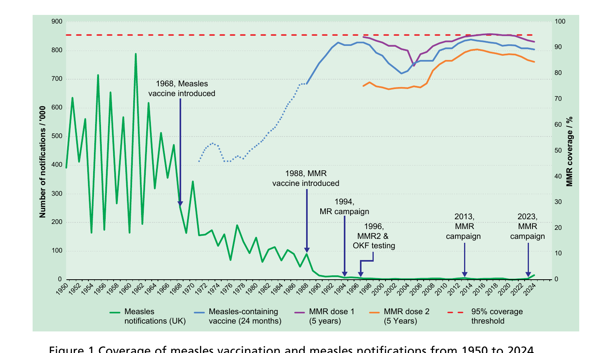
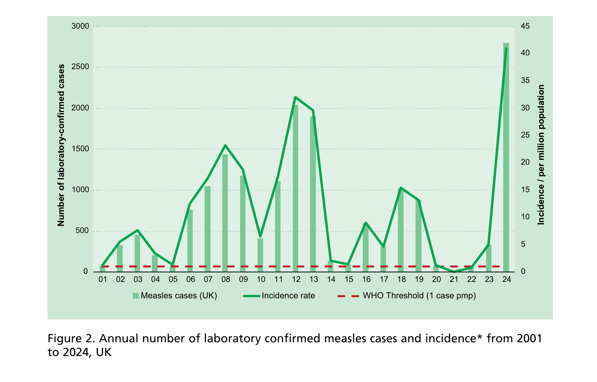

# Measles

NOTIFIABLE

## The disease

Measles is an acute viral illness caused by a morbillivirus of the paramyxovirus family. The prodromal stage is characterised by the onset of fever, malaise, coryza, conjunctivitis and cough. The rash is erythematous and maculopapular, starting at the head and spreading to the trunk and limbs over three to four days. Koplik spots (small red spots with blueish-white centres) may appear on the mucous membranes of the mouth one to two days before the rash appears and may be seen for a further one to two days afterwards.

Measles is spread by airborne or droplet transmission. Individuals are infectious in the prodromal period from four days before to four days after the appearance of the rash. It is one of the most highly communicable infectious diseases. The incubation period is about ten days (ranging between seven and 18 days) with a further two to four days before the rash appears (Chin, 2000).

The following features are consistent with measles:

- rash for at least three days
- fever for at least one day, and
- at least one of the following -- cough, coryza or conjunctivitis

As other causes of rash-fever are now far more common than genuine measles, laboratory testing of all suspected cases of measles is required to confirm or discard the diagnosis (see the later section on management of cases).

The most common complications of measles infection are otitis media (7 to 9% of cases), pneumonia (1 to 6%), diarrhoea (8%) and convulsions (0.5%). Other, rarer complications include encephalitis (overall rate of one to four per 1000-2000 cases of measles) and sub-acute sclerosing pan-encephalitis (SSPE) (see below) (Plotkin _et al_, 2018 Chapter 37; Norrby and Oxman, 1990; Perry and Halsey, 2004; McLean and Carter, 1990; Miller, 1978).

Historically death occurred in one in 5000 cases in the UK (Miller, 1985). The case--fatality ratio for measles is age- related and is high in children under one year of age, lower in children aged one to nine years and rises again in teenagers and adults (Plotkin _et al_, 2018 Chapter 37). Measles can be severe, particularly in immunosuppressed individuals and young infants. It is also more severe in pregnancy, and increases the risk of miscarriage, stillbirth, or preterm delivery. Complications are also more common and more severe in poorly nourished and/or chronically ill children.

### Measles encephalitis

There are different forms of measles encephalitis which occur at different times in relation to the onset of rash:

- post-infectious encephalomyelitis occurs at around one week after onset of the rash. Infectious virus is rarely found in the brain. The condition is associated with demyelination and is thought to have an auto-immune basis (Perry and Halsey, 2004)
- measles inclusion body encephalitis (also known as acute encephalitis of the delayed type) (Barthez Carpentier _et al._, 1992) occurs in immunocompromised patients. It may occur without a preceding measles-like illness (Kidd _et al._, 2003) although there may be a history of exposure to measles several weeks or months previously (Alcardi _et al._, 1997). It is characterised by acute neurological compromise and deterioration of consciousness, seizures and progressive neurological damage. Measles RNA can normally be detected from clinical specimens for several days or weeks
- SSPE is a rare, fatal, late complication of measles infection. One case of SSPE occurs in every 25,000 measles infections (Miller _et al._, 2004). In children infected under the age of two, the rate is one in 8000 infections (Miller _et al._, 2004; Miller _et al._, 1992). Developing measles under one year of age carries a risk of SSPE 16 times greater than in those infected over five years of age (Miller _et al._, 1992). The median interval from measles infection to onset of symptoms is around seven years but may be as long as two to three decades. SSPE may follow an unrecognised measles infection. Wild measles virus has been found in the brain of people with SSPE including those with no history of measles disease (Miller _et al._, 2004)

## History and epidemiology of the disease

Notification of measles began in England and Wales in 1940. Before the introduction of measles vaccine in 1968, annual notifications varied between 160,000 and 800,000, with peaks every two years (see Figure 1), and around 100 deaths from acute measles occurred each year.

From the introduction of measles vaccination in 1968 until the late 1980s coverage was low (Figure 1) and was insufficient to interrupt measles transmission. Therefore, annual notifications only fell to between 50,000 and 100,000 and measles remained a major cause of morbidity and mortality. Between 1970 and 1988, there continued to be an average of 13 acute measles deaths each year. Measles remained a major cause of mortality in children who could not be immunised because they were receiving immunosuppressive treatment. Between 1974 and 1984, of 51 children who died when in first remission from acute lymphatic leukaemia, 15 of the deaths were due to measles or its complications (Gray _et al._, 1987). Between 1970 and 1983, however, more than half the acute measles deaths that occurred were in previously healthy children who had not been immunised (Miller, 1985).

**Figure 1** Coverage of measles vaccination and measles notifications from 1950 to 2024 \* Scottish notification data available only from 1968
\*\* Vaccine coverage - MMR Dose 1 measured at 5 years of age

Following the introduction of measles, mumps and rubella (MMR) vaccine in October 1988 and the achievement of coverage levels in excess of 90%, measles transmission was substantially reduced and notifications of measles fell progressively to very low levels.

Because of the substantial reduction in measles transmission in the UK, children were no longer exposed to measles infection and, if they had not been immunised, they remained susceptible to an older age. Seroprevalence studies confirmed that a higher proportion of school-age children were susceptible to measles in 1991 than in 1986/7 (Gay _et al._, 1995). A major resurgence of measles was predicted, mainly affecting the school-age population (Gay _et al._, 1995; Babad _et al._, 1995). Small outbreaks of measles occurred in England and Wales in 1993, predominantly affecting secondary school children (Ramsay _et al._, 1994). In 1993--94, a measles epidemic, affecting the west of Scotland, led to 138 teenagers being admitted to one hospital.

In order to prevent the predicted epidemic, a UK vaccination campaign was implemented in November 1994. Over 8 million children aged between 5 and 16 years were immunised with measles-rubella (MR) vaccine. At that time, insufficient stocks of MMR were available to vaccinate all of these children against mumps. Susceptibility to measles fell seven-fold in the target population and endemic transmission of measles was interrupted (Vyse _et al._, 2002; Ramsay _et al._, 2003).

To maintain the control of measles established after the MR campaign, a two-dose MMR schedule was introduced in October 1996. A second dose of MMR helps to prevent an accumulation of susceptible individuals that could otherwise be sufficient to re-establish measles transmission. A single dose of measles-containing vaccine is at least 95% effective in preventing clinical measles (Demicheli V _et al._, 2012). A second dose of measles-containing vaccine protects those who do not respond to the first dose (Wichmann _et al_., 2007). A single dose of a rubella-containing vaccine confers around 95 to 100% protection against disease (Orenstein _et al._, 2023, Chapter 54). Following vaccination or natural infection, asymptomatic reinfection has been reported rarely; clinical disease has very rarely been reported (Davis _et al._, 1971, Fogel _et al._, 1978). The absence of rubella outbreaks in well-vaccinated countries indicates long-term persistence of immunity against rubella disease in vaccinated populations (Orenstein _et al._, 2023 Chapter 54, Latner _et al._, 2011). The effectiveness of a single dose of mumps Jeryl Lynn strain-containing vaccine as used in the UK, determined by field studies is approximately 72% and that of two doses is approximately 86% (Di Pietrantonj _et al._, 2021). Two doses are needed for both individual and population protection. Whilst mumps protection declines with age (Harling _et al._, 2005, Cohen _et al._, 2007), fully vaccinated cases have a much lower likelihood of suffering complications of disease (Yung _et al._, 2011).

In order to eliminate measles, the World Health Organization (WHO) recommends two doses of a measles-containing vaccine (see: http://www.who.int/immunization/diseases/measles/en/).

In the late 1990s and early 2000s national vaccine coverage at two years of age dropped to below 80% for one dose of MMR due to widespread concern around the discredited link between the vaccine and autism. During this period, endemic transmission of measles remained interrupted, although the fall in coverage led to an increase in the number of susceptible children, with the potential for a large outbreak particularly in cities. A catch-up campaign targeting primary school-age children in London was launched in 2004/05. Measles cases continued to rise and in 2006 endemic transmission was re-established. In 2008, a nationwide catch-up programme for MMR vaccination for children of all ages from 13 months to 18 years (and those aged over 18 going on to further education) was implemented in England which led to a decrease in incidence, although there remained a significant proportion of susceptible children in teenage cohorts.

**Figure 2.** Annual number of laboratory confirmed measles cases and incidence\* from 2001 to 2024, UK

\* Incidence rate = confirmed measles cases / mid-year UK population. This excludes imported cases. Pmp = per million population.

In 2012 and early 2013, there was again an increasing number of reported cases, despite the highest ever national MMR vaccination level being achieved in 2-year-olds in England. This was thought to be mostly attributable to the proportion of unprotected 10--16-year-olds who missed out on vaccination in the late 1990s and early 2000s. In May 2013 a further national catch-up programme to increase MMR uptake in teenagers was commenced in England. Following on from the catch-up campaign in 2013 low case numbers were reported in 2014 and 2015.

By 2014, the UK had again interrupted endemic transmission of measles and in 2016 the WHO Regional Verification Committee (RVC) declared the UK had eliminated endemic measles. In England, vaccine coverage of the first MMR dose evaluated in 5-year-olds reached the WHO 95% target for the first time in 2016/17.

Annual MMR vaccine coverage estimates for children under the age of 5 years have been decreasing steadily since 2013/14 and with outbreaks linked to a resurgence of measles in Europe in 2017 and 2018, the WHO noted that measles transmission had been re-established in the UK. Measles transmission was interrupted temporarily due to the public health measures put in place during the COVID-19 pandemic, such as restrictions to travel. The pandemic however also led to a more steep decline in coverage of the routine childhood immunisations including MMR in the UK and globally. In 2023, the UK saw a resurgence of measles driven mainly by transmission in unvaccinated children under the age of 10 years, with just under 3000 laboratory confirmed cases reported in England in 2024. A national MMR catch-up campaign was launched targeting children under the age of 10 years with the offer extended to everyone under the age of 25 years in outbreak hotspots (UKHSA, 2024). Infections have come down after a peak in July 2024, but are not back to baseline with small outbreaks continuing since then. UKHSA modelling suggests that London and most inner-city areas remain at risk of measles surges unless MMR coverage reaches the optimal 95% in all communities (UKHSA, 2023). The UK measles and rubella elimination strategy outlines the key recommendations for action for the UK to achieve and maintain measles elimination (see: https://www.gov.uk/government/publications/measles-and-rubella-elimination-uk-strategy).

Measles deaths in individuals whose infection could have been prevented by the UK immunisation programme are now rare but do occur, particularly in immunosuppressed individuals. The published data is available on the UKHSA webpage at: https://www.gov.uk/government/publications/measles-historic-confirmed-cases-notifications-and-deaths/measles-historic-confirmed-cases-notifications-and-deaths#measles-notifications-and-deaths-in-england-and-wales-1940-to-2025

The reduced incidence of measles, brought about by immunisation, has also resulted in a major reduction in SSPE in England and Wales. In the early 1970s, when an SSPE Register was set up, around 20 cases were reported each year. By the early 1990s, the annual total had fallen to around six cases and this has fallen further to between one and two in the late 1990s and early 2000s (Campbell _et al._, 2007). There have been fewer than five cases of SSPE in individuals with presumed UK measles acquisition diagnosed in the last 10 years. In a UK study of 11 cases of SSPE, sequencing of the measles virus strains identified wild- type (and not vaccine-type) virus in all individuals, including five with a history of measles-containing vaccine (Jin _et al._, 2002). The presence of wild and not vaccine strains of measles virus has been confirmed by studies of SSPE cases in other countries (Miki _et al._, 2002).

On 1 January 2026, following the recommendation of the Joint Committee on Vaccination and Immunisation (JCVI), the MMR two dose schedule was changed to 12 and 18 months of age with the aim of improving uptake. Studies in London (Lacy _et al_, 2022) where the second dose of MMR has been brought forward from 3 years 4 months to 18 months in response to measles outbreaks have shown that an earlier vaccination with the second dose of MMR is associated with significantly higher coverage at 5 years for this vaccine. In addition, due to the introduction of a varicella programme, the product offered at these ages was changed to the combined MMRV vaccine providing protection from measles, mumps, rubella and varicella.

## The MMR and MMRV vaccines

Measles vaccination is available as part of two combined vaccines: measles, mumps, rubella and varicella (MMRV) and measles, mumps and rubella (MMR) vaccines. MMR or MMRV is suitable for individuals requiring protection against measles, mumps, rubella and/or varicella. MMRV is the preferred vaccine for younger children but MMR or varicella should be offered to older individuals, as appropriate, to preserve MMRV supply for those more likely to be susceptible to all four viruses.

MMR and MMRV vaccines are freeze-dried (lyophilised) preparations containing live, attenuated (weakened) strains of measles, mumps, rubella and varicella viruses. The four attenuated virus strains are cultured separately in appropriate media and mixed before being lyophilised. Two MMRV and two MMR vaccines are available in the UK, as below:

MMRV:

- Priorix-Tetra®
- ProQuad®

MMR:

- MMRVAXPRO®
- Priorix®

MMR and MMRV vaccines do not contain thiomersal or any other preservatives. Aluminum is not used in MMR and MMRV vaccines. MMR and MMRV vaccines may contain trace amounts of neomycin.

MMRVAXPRO® and ProQuad® contain gelatine of porcine origin as a stabiliser. Priorix or Priorix Tetra® can be offered to individuals who do not accept gelatine-containing medicines or vaccines. Further information is available in the UKHSA publication 'Vaccines and porcine gelatine': https://www.gov.uk/government/publications/vaccines-and-porcine-gelatine.

All MMR and MMRV vaccines (Priorix®, Priorix-Tetra®, MMRVAXPRO® and ProQuad®) contain a source of phenylalanine. The National Society for Phenylketonuria (NSPKU) advise the amount of phenylalanine contained in vaccines is negligible and therefore strongly advise individuals with PKU to take up the offer of immunisation.

### Human normal immunoglobulin

Human normal immunoglobulin is prepared from pooled plasma derived from blood donations and contains antibody to measles and other viruses and bacteria prevalent in the population. Products are formulated for either intravenous (IVIG) or subcutaneous/intramuscular (HNIG) use. Immunoglobulin is indicated as post exposure prophylaxis for vulnerable individuals exposed to measles. There is currently no accepted minimum level of measles antibody required in normal immunoglobulin and levels of measles neutralising antibodies have declined in recent years. IVIG is recommended as post exposure prophylaxis for immunosuppressed individuals exposed to measles and neonates born to mothers with acute measles around the time of delivery. HNIG preparations are considered suitable for the post exposure prophylaxis of immunocompetent pregnant women and infants, with the understanding the doses tolerated by intramuscular or subcutaneous routes will mitigate but not prevent infection. Full details on the use of IVIG and HNIG as measles post-exposure prophylaxis and recommended products can be found in the UKHSA National Measles Guidelines.

## Storage

Chapter 3 contains information on vaccine storage, distribution and disposal.

The summary of product characteristics (SPC) may give further details on vaccine storage.

HNIG should be stored in line with the requirements indicated on the outer packaging and the package insert out of direct sunlight and in the original box until ready for use. Contact the manufacturer when HNIG has been stored outside these conditions.

## Presentation

Measles vaccine is only available as part of a combined product as MMR or MMRV.

**Priorix-Tetra®** is supplied as a whiteish to slightly pink coloured cake and the solvent is a clear colourless liquid. The vaccine should be well shaken until the powder has completely dissolved in the solvent. Upon reconstitution, the vaccine appearance may vary from a clear peach to a fuchsia pink colour, due to minor pH variations. It may contain translucent product-related particulates, which do not impair the vaccine efficacy.

**ProQuad®** is supplied as a white to pale yellow compact crystalline cake and the solvent is a clear colourless liquid. The solvent and powder should be gently agitated to dissolve completely to form a clear pale yellow to light pink liquid.

**MMRVAXPRO®** is supplied as a light yellow compact crystalline cake for reconstitution and the solvent is a clear colourless liquid. The reconstituted vaccine must be shaken gently to ensure thorough mixing. When completely reconstituted, the vaccine is a clear yellow liquid.

**Priorix®** is supplied as a whitish to slightly pink coloured cake, a portion of which may be yellowish to slightly orange and the solvent is a clear colourless liquid. The reconstituted vaccine must be shaken well until the powder is completely dissolved in the diluent. The reconstituted vaccine may vary in colour from clear peach to fuchsia pink.

Once reconstituted, the vaccine should only be used if it matches the relevant description above. The relevant SPC may give further details on vaccine presentation.

## Dosage and schedule

Two doses of 0.5ml of an MMR-containing vaccine at the recommended interval (see below).

## Administration

### Administration site

Chapter 4 covers guidance on administering vaccines.

Most injectable vaccines are routinely given intramuscularly into the deltoid muscle of the upper arm or, for infants 1 year and under, into the anterolateral aspect of the thigh.

### Administration with other vaccines

MMR and MMRV vaccines can be given at the same time as, or at any interval before or after, any other vaccines recommended in the same appointment. Vaccines administered at the same time should preferably be given in a separate limb, but if this is not possible, they should be given at least 2.5cm apart (American Academy of Pediatrics, 2021). The site at which each vaccine is given should be noted in the individual's record.

Advice on intervals between live vaccines is based upon specific evidence of interference between vaccines. Chapter 11 provides information on the recommended time intervals between MMR/MMRV and other live vaccines, as well as further information on tuberculin skin testing and MMR/MMRV vaccination.

### Administration with blood products

When MMR and MMRV vaccines are given within three months of receiving blood products, such as immunoglobulin, the response may be reduced. This is because such blood products may contain significant levels of measles, mumps, rubella and/or varicella-specific antibody, which could then prevent vaccine virus replication. It is unlikely, however, that response to all four viruses will be completely absent after receipt of any blood product - for example rubella vaccine response has been shown to be adequate after anti-D administration (Edgar and Hambling, 1977; Black _et al._, 1983). Therefore, to reduce the risk that a deferred vaccination would be missed, and particularly where immediate measles protection is required, MMR/MMRV should still be given regardless of recent blood product receipt. To confer longer term protection, however, another dose of MMR/MMRV should be considered after three months.

### Disposal

Chapter 3 outlines storage, distribution and disposal requirements for vaccines.

Equipment used for immunisation, including used vials, ampoules, or discharged vaccines in a syringe, should be disposed of safely in a UN-approved puncture-resistant 'sharps' box, according to local waste disposal arrangements and guidance in the technical memorandum 07-01: Safe and sustainable management of healthcare waste (NHS England).

## Recommendations for the use of the vaccine

The objective of the routine immunisation programme is to provide two doses of MMR-containing vaccines at appropriate intervals for all eligible individuals. MMR vaccines should not be given to children under 6 months and varicella-containing vaccines (MMRV) should not be given to infants under 9 months of age.

### Young children

From 1 January 2026, the national immunisation schedule changed to recommend that children receive two doses of MMRV vaccine at 12 and 18 months of age.

The first dose of MMRV should be given between 12 and 13 months of age (i.e. within a month of the first birthday). Immunisation before one year of age may provide earlier protection and may be beneficial when measles is circulating and there is a higher risk of infection in the first year of life, however residual maternal antibodies may interfere with the response to the vaccine. The optimal age chosen for scheduling children is therefore a compromise between risk of infection and optimal response to vaccine.

If a dose of MMR/MMRV is given before the first birthday, either because of travel to an endemic country, or because of a local outbreak, then this dose should not be counted, and two further doses should be given at the recommended times between 12 and 13 months of age (i.e. within a month of the first birthday) and at 18 months of age (see Chapter 11).

The second dose of MMRV vaccine is given at 18 months of age, but if needed can be given at any time from three months after the first dose. Allowing three months between doses is likely to maximise the response rate, particularly in young children under the age of 18 months where maternal antibodies may still be present and interfere with the response to vaccination (Orenstein _et al._, 1986; Redd _et al._, 2004; De Serres _et al._, 1995). Where protection against measles is urgently required, the second dose can be given one month after the first (ACIP, 1998). If the child is given the second dose less than three months after the first dose and at less than 18 months of age, then the routine 18-month dose (which would constitute a third dose in this case) should be given in order to ensure full protection.

It is vital that, by the age of 3 years 4 months, every child has received two doses of an MMR-containing vaccine (either MMR or MMRV). Children born on or before the 31 December 2019 will have followed the previous two dose MMR vaccination schedule at 12 months and 3 years 4 months of age and will not be eligible to receive MMRV vaccination through the national vaccination programme or catch-up campaign. MMRV vaccination eligibility by date of birth are set out in the relevant advice from the NHS in each country.

### Older children and adults

All children should have received two doses of MMR-containing vaccine (either MMR or MMRV) by the age of 3 years and 4 months. MMR vaccines should be used for catching up children and older adults who have not received two-doses of MMR and who are not eligible for varicella vaccination (see above and varicella chapter for details about varicella eligibility and catch-up campaigns). However, if MMRV, rather than MMR is the only vaccine available at the clinic at the time of the offer of opportunistic catch-up then that vaccine can be used.

The teenage booster appointment around 14 years of age is an opportunity to ensure that unimmunised or partially immunised children are given MMR. If two doses of MMR are required, then the second dose should be given one month after the first.

MMR vaccine can be given to individuals of any age and should be offered opportunistically and promoted to unvaccinated or partially vaccinated younger adults. New GP registration, and entry into college, university or other higher education institutions, prison or military service also provides an opportunity to check an individual's immunisation history. Those who have not received MMR should be offered appropriate MMR immunisation.

Since the cessation of antibody screening for rubella in pregnancy, it remains important to encourage MMR vaccination for women of child-bearing age -- for example at opportunities such as family planning consultations. In addition, MMR vaccination status should be checked at ante-natal clinic appointments and unvaccinated or partially vaccinated pregnant women should be offered missing doses post-partum, for example at the post-natal check or if they accompany their infant to their routine immunisations. If two doses of MMR are required, then the second dose should be given one month after the first.

The decision on when to vaccinate older adults needs to take into consideration past vaccination history, the likelihood of an individual remaining susceptible and the future risk of exposure and disease:

- individuals who were born in the UK between 1980 and 1990 may not be protected against mumps but are likely to be vaccinated against measles and rubella. They may never have received a mumps-containing vaccine or had only one dose of MMR and had limited opportunity for exposure to natural mumps. They should be caught up opportunistically with one or two doses of the MMR vaccine given at least one month apart.
- individuals born between 1970 and 1979 may have been vaccinated against measles and many will have been exposed to mumps and rubella during childhood. However, this age group should be offered MMR wherever feasible, particularly if they are considered to be at high risk of exposure. Where such adults are being vaccinated because they have been demonstrated to be susceptible to at least one of the vaccine components, then either two doses should be given, or there should be evidence of seroconversion to the relevant antigen.
- individuals born before 1970 are likely to have had all three natural infections and are less likely to be susceptible. MMR vaccine should be offered to such individuals on request or if they are considered to be at high risk of exposure. Where such adults are being vaccinated because they have been demonstrated to be susceptible to measles or rubella, then either two doses should be given or there should be evidence of seroconversion to the relevant antigen.

### Healthcare workers

Protection of healthcare workers is especially important in the context of their ability to transmit measles infection to vulnerable groups. While they may need MMR vaccination for their own benefit, they should also be immune to measles for the protection of their patients.

Satisfactory evidence of protection from measles would include documentation of:

- having received two doses of an MMR- containing vaccine, or
- positive antibody test for measles.

### Individuals who are travelling or going to reside abroad

All travellers to epidemic or endemic areas should ensure that they are fully immunised according to the UK schedule (see above). Infants from six months of age travelling to measles endemic areas with a high incidence of measles or to an area where there is a current outbreak, who are likely to be mixing with the local population, should receive MMR vaccine. MMRV vaccine may be given from 9 months of age for this purpose if that is the only vaccine product available at the time of the appointment. Not all children will respond to MMR/MMRV given in the first year of life due to the presence of maternal antibody. When the vaccine has been given before one year of age this dose should be discounted and two further doses of MMR/MMRV should be given at the recommended ages. Children who are travelling who have received one dose of MMR/MMRV at the routine age should have the second dose brought forward to at least one month after the first. If the child is given the second dose less than three months after the first dose and at less than 18 months of age, then the routine 18-month dose (which would constitute a third dose in this case) should be given in order to ensure full protection.

### Individuals with unknown or incomplete vaccination histories

Where a child born in the UK presents with an uncertain immunisation history, every effort should be made to clarify what immunisation they may have had (see Chapter 11).

Children coming to the UK who have a history of completing immunisations in their country of origin may not have been offered protection against all the antigens in the MMR or MMRV vaccine. Immunisation schedules for specific countries can be found on the World Health Organization (WHO) website.

Individuals coming from areas of conflict or from population groups who may have been marginalised in their country of origin (e.g. refugees, Gypsy or other nomadic travellers) may not have had good access to immunisation services. In particular, older children and adults may also have been raised during periods before immunisation services were well developed or when vaccine quality was sub-optimal. Where there is no reliable history of previous immunisation, it should be assumed that any undocumented doses are missing and the UK catch-up recommendations for that age should be followed (see Chapter 11). The routine boosters should be given according to the UK schedule.

Further guidance on vaccination of individuals with uncertain or incomplete immunisation is published by UKHSA in Chapter 11 of the Green book and at the following link: https://www.gov.uk/government/publications/vaccination-of-individuals-with-uncertain-or-incomplete-immunisation-status

### Antibody testing

There is no requirement for antibody testing following 2 doses of MMR vaccination or prior to pregnancy.

A negative measles IgG result on one of the routine assays available in local NHS laboratories does not necessarily mean that the individual won't be protected in the event of an exposure.

If an individual has inadvertently been tested, despite having two documented doses of MMR vaccine, and the lab result indicates an IgG negative response for rubella or measles, a single further dose of MMR vaccine may be administered. Although this dose may be unnecessary, it should provide reassurance for the individual. If they are protected from their previous documented doses of MMR vaccine, this additional dose will be neutralised by their immune system.

The third dose should be administered with a minimum interval of four weeks from the previous dose and at least one month before pregnancy. Further testing after this third dose is not recommended.

No further action is needed for individuals with an equivocal IgG test and two documented MMR doses.

For interpretation of antibody testing in relation to measles contacts and implications for post-exposure prophylaxis, please go to the UKHSA National Measles Guidance or Public Health Scotland.

UKHSA National Measles Guidance https://www.gov.uk/government/publications/national-measles-guidelines

Public Health Scotland https://publichealthscotland.scot/population-health/health-protection/infectious-diseases/measles/guidance-for-professionals/health-protection-guidance/

## Contraindications

Chapter 6 contains information on contraindications and special considerations for vaccination.

There are very few individuals who cannot receive MMR or MMRV vaccines. When there is doubt, appropriate advice should be sought from a relevant specialist consultant, immunisation co-ordinator or consultant in communicable disease control rather than withholding the vaccine. The vaccine should not be given to:

- those who are immunosuppressed (see Chapter 6 for more detail)
- those who have had a confirmed anaphylactic reaction to a previous dose of a measles-, mumps-, rubella- or varicella-containing vaccine
- those who have had a confirmed anaphylactic reaction to any component of the vaccine including neomycin or gelatine
- pregnant women

Specific advice on management of individuals who have had an allergic reaction can be found in Chapter 8.

Anaphylaxis after MMR/MMRV is extremely rare (5.14 to 19.84 per million doses) (McNeil _et al._, 2016). Minor allergic conditions may occur and are not contraindications to further immunisation with MMR, MMRV or other vaccines. A careful history of that event will often distinguish between anaphylaxis and other events that are either not due to the vaccine or are not life-threatening. In the latter circumstances, it may be possible to continue the immunisation course. Specialist advice must be sought on the vaccines and circumstances in which they could be given. The lifelong risk to the individual of not being immunised must be taken into account.

## Precautions

Chapter 6 contains information on contraindications and special considerations for vaccination.

Minor illnesses without fever or systemic upset are not valid reasons to postpone immunisation. If an individual is acutely unwell, immunisation may be postponed until they have fully recovered. This is to avoid confusing the differential diagnosis of any acute illness by wrongly attributing any signs or symptoms to the adverse effects of the vaccine.

Individuals who have had a systemic or local reaction following a previous immunisation with MMR/MMRV can continue to receive subsequent doses of MMR/MMRV vaccine.

Chapter 8 covers vaccine safety and the management of adverse events following immunisation.

Children with chronic conditions such as cystic fibrosis, congenital heart or kidney disease, failure to thrive or Down's syndrome are at particular risk from measles infection. It is particularly important that children in these groups are vaccinated if they have no other contraindications for vaccination.

### Idiopathic thrombocytopaenic purpura

Idiopathic thrombocytopaenic purpura (ITP) occurs rarely following MMR/MMRV vaccination, usually within six weeks of the first dose. The risk of developing ITP after MMR/MMRV vaccine is much less than the risk of developing it after infection with wild measles or rubella virus.

If ITP has occurred within six weeks of the first dose of MMR/MMRV, then blood should be taken and tested for measles antibodies before a second dose is given. Serum should be sent to the UK Health Security Agency (UKHSA) Virus Reference Laboratory (Colindale), which offers free, specialised serological testing for such children. If the results suggest incomplete immunity against measles, then a second dose of MMR/MMRV is recommended.

### Allergy to egg

All children with egg allergy should receive the MMR/MMRV vaccination as a routine procedure in primary care (Clark _et al._, 2010). Data suggest that anaphylactic reactions to MMR vaccine are not associated with hypersensitivity to egg antigens but to other components of the vaccine (such as gelatine) (Fox and Lack, 2003). In three large studies with a combined total of over 1000 patients with egg allergy, no severe cardiorespiratory reactions were reported after MMR vaccination (Fasano _et al._, 1992; Freigang _et al._, 1994; Aickin _et al._, 1994; Khakoo and Lack, 2000). Children who have had documented anaphylaxis to the vaccine itself should be assessed by an allergist (Clark _et al._, 2010).

### Pregnancy and breast-feeding

There is no evidence that MMR-containing vaccines are teratogenic.

However, as a precaution, MMR/MMRV vaccine should not be given in pregnancy. Pregnancy should be avoided for one month following the last dose.

There are no safety concerns, either for the mother or the baby, when MMR-containing vaccine is given in pregnancy or shortly prior to pregnancy. Those who have been immunised with MMR or MMRV in pregnancy can be reassured (see "MMR vaccine: advice for pregnant women"). Such an incident would not be a reason to recommend termination of pregnancy (Tookey _et al._, 1991).

If a pregnant individual develops a generalised vesicular (varicella-like) rash following MMRV vaccination, they should be clinically reviewed for consideration of antivirals. Local injection site reactions are common and do not require any specific follow up.

UKHSA monitors women who have inadvertently received varicella-containing vaccine such as MMRV up to 3 months before pregnancy or at any time during pregnancy, as well as women who have inadvertently received MMR vaccine up to 30 days before pregnancy or at any time during pregnancy. Women who have been immunised with MMR or MMRV in pregnancy should be reported to the UKHSA Vaccine in Pregnancy Surveillance: https://www.gov.uk/guidance/vaccination-in-pregnancy-vip#notify-ukhsa.

Breast-feeding is not a contraindication to MMR/MMRV immunisation, and MMR/MMRV vaccine can be given to breast-feeding mothers without any risk to their baby. Very occasionally, rubella vaccine virus has been found in breast milk, but this has not caused any symptoms in the baby (Buimovici-Klein _et al._, 1997; Landes _et al._, 1980; Losonsky _et al._, 1982). The vaccine does not work when taken orally. There is no evidence of mumps, measles or varicella vaccine viruses being found in breast milk in mothers vaccinated postpartum.

For advice regarding suitability of MMR/MMRV for a breastfed child whose mother is taking biological treatment, please see Chapter 6.

### Premature infants

It is important that premature infants have their immunisations at the appropriate chronological age, according to the schedule (see Chapter 11).

### Immunosuppression and HIV

MMR/MMRV vaccines are not recommended for patients with severe immunosuppression (see Chapter 6) (Angel _et al._, 1996). MMR/MMRV vaccines can be given to individuals living with HIV without or with moderate immunosuppression (as defined in Table 1).

Wherever possible, immunisation of individuals living with HIV should be either carried out before immunosuppression occurs or deferred until an improvement in immunity has been seen. Chapter 7 contains more information on immunisation of individuals with underlying medical conditions, including immunosuppression.

Further guidance is provided by the British HIV Association (BHIVA) immunisation guidelines for individuals living with HIV (https://www.bhiva.org/vaccination-guidelines) and the Children's HIV Association (CHIVA) immunisation guidelines (http://www.chiva.org.uk/guidelines/immunisation/). For guidance on MMRV vaccination, please follow guidance for MMR and varicella vaccination outlined in these documents.

**Table 1** CD4 count/μl (% of total lymphocytes)

| Age                  | <12 months | 1--5 years | 6--12 years | >12 years |
| -------------------- | ---------- | ---------- | ----------- | --------- |
| No suppression       | ≥1500      | ≥1000      | ≥500        | ≥500      |
|                      | (≥25%)     | (≥25%)     | (≥25%)      | (≥25%)    |
| Moderate suppression | 750--1499  | 500--999   | 200--499    | 200--499  |
|                      | (15--24%)  | (15--24%)  | (15--24%)   | (15--24%) |
| Severe suppression   | <750       | <500       | <200        | <200      |
|                      | (<15%)     | (<15%)     | (<15%)      | (<15%)    |

### Neurological conditions

The presence, or history of a neurological condition is not a contraindication to immunisation, but in a child with evidence of current neurological deterioration, deferral of vaccination may be considered, to avoid incorrect attribution of any change in the underlying condition. The risk of such deferral should be balanced against the risk of the preventable infection, and vaccination should be promptly given once the diagnosis and/or the expected course of the condition becomes clear.

There will be very few occasions when deferral of immunisation is required. Deferral leaves the child unprotected and so the period of deferral should be minimised, with immunisation commencing as soon as possible. If a specialist recommends deferral, this should be clearly communicated to the individual's primary care provider and he or she must be informed as soon as the child is fit for immunisation.

Children with a personal or close family history of seizures should be given MMR/MMRV vaccine. Further information about likely timing of any fever and management of a fever should be given. Vaccinators should seek specialist paediatric advice rather than unnecessarily withhold immunisation.

## Adverse reactions

Many studies conducted worldwide have found MMR and MMRV vaccines to be well tolerated and rarely associated with serious adverse events.

Adverse reactions following the MMR/MMRV vaccines (except allergic reactions) are due to effective replication of the vaccine viruses with subsequent mild illness. Such events are to be expected in some individuals. Events due to the measles component occur six to 11 days after vaccination. Events due to the mumps and rubella components usually occur two to three weeks after vaccination but may occur up to six weeks after vaccination. Events due to the varicella component usually occur within a month of vaccination with MMRV. These events only occur in individuals who are susceptible to that component and are therefore less common after second and subsequent doses.

Following MMR/MMRV, individuals may develop a measles-like rash. They can be reassured that they are not infectious for measles. However, they should be reviewed by a clinician and recent exposure should be considered. Some individuals may develop a varicella-like rash around the site of the injection. This should not prevent them from attending childcare or educational settings, but it should be kept covered as a precaution. Transmission of varicella vaccine virus from immunocompetent vaccines to susceptible close contacts has occasionally been documented but the risk is very low. For more details on varicella vaccine associated rash, please see the varicella chapter.

### Common events

Common reactions following MMR and MMRV vaccination include fever, rash and injection site reactions including pain, swelling and erythema. These reactions appear most commonly about a week after immunisation, and last about two to three days.

Vomiting and diarrhoea can also be seen following MMRV vaccination. Upper respiratory tract infection can be seen following MMR vaccination.

Adverse reactions are considerably less common after a second dose of MMR vaccine than after the first dose. Overall rates of adverse reactions after a second MMRV dose are similar to or lower than seen after a first dose and are comparable to those who received separate varicella (Oka/Merck) and MMR vaccine.

### Rare and more serious events

Febrile seizures are the most commonly reported neurological event following MMR/MMRV vaccination, with febrile seizures occurring more commonly following the first dose of vaccine than the second. Simple febrile seizures are generalised, short-lived and generally considered benign with excellent neurological prognosis.

The rate of febrile seizures following MMR vaccination is lower than that following infection with measles disease. It is estimated that following MMRV vaccination, 96 cases of febrile convulsions occur in every 100,000 children. This is in contrast to 2,300 cases in every 100,000 children following measles infection, and 4,000 cases in 100,000 children in the overall paediatric population (Casabona _et al._, 2023). There is good evidence that febrile seizures following MMR vaccination do not increase the risk of subsequent epilepsy compared with febrile seizures due to other causes (Vestergaard _et al._, 2004).

Febrile seizures are reported more commonly following administration of the first dose of MMRV vaccine than MMR, or co-administered MMR and varicella, vaccine (Orenstein _et al_, 2023 Chapter 38). Several studies have reported an approximately two-fold increased relative risk of febrile seizures within 5 to 12 or 7 to 10 days after the administration of the first MMRV dose of the two-dose vaccination schedule in infants compared with the separate administration of MMR and varicella vaccine during the same medical visit. However, the absolute risk of febrile seizures remains very low. The elevated risk following the first dose of MMRV has not be observed when using the combination vaccine as a second dose. Having taken into account the above information, the JCVI advised the use of the combination MMRV vaccine in the national programme rather than separate MMR and varicella vaccination. A study of parental acceptance of varicella vaccination in the UK (Sherman _et al_, 2023) showed that a combined vaccination was preferred over an additional injection at the same immunisation visit, reflecting previous experience that parents prefer fewer injections for their children.

Because MMR and MMRV vaccines contain live, attenuated viruses, it is biologically plausible that they may cause encephalitis, and isolated cases have been reported in children with underlying immunosuppressive disorders. A large record-linkage study in Finland, looking at over half a million children aged between one and seven years, did not identify any association between MMR and encephalitis. (Makela _et al._, 2002). There have not been recent studies, but isolated cases of encephalitis associated with measles immunisation have been observed in children who were found to have underlying primary immunodeficiency, but none in otherwise healthy children vaccinated with MMR.

Idiopathic thrombocytopaenic purpura (ITP) may occur following MMR/MMRV vaccination and is most likely due to the rubella component. This usually occurs within six weeks and resolves spontaneously. ITP occurs in about one in 22,300 children who are given a first dose of MMR in the second year of life (Miller _et al._, 2001). The risk of developing ITP after MMR/MMRV vaccination is much less than the risk of developing it after infection with wild measles or rubella virus. Please see above, under 'Contraindications' for guidance on further vaccination following ITP.

Arthropathy (arthralgia or arthritis) has also been reported to occur rarely after MMR immunisation, probably due to the rubella component. If it is caused by the vaccine, it occurs between 14 and 21 days after immunisation. Where it occurs at other times, it is highly unlikely to have been caused by vaccination. Several controlled epidemiological studies have shown no excess risk of chronic arthritis in women (Slater, 1997).

Anyone can report a suspected adverse reaction to the Medical and Healthcare products Regulatory Agency (MHRA) using the Yellow Card reporting scheme (https://yellowcard.mhra.gov.uk/). All suspected adverse reactions to vaccines occurring in children, or in individuals of any age after vaccination with vaccines labelled with a black triangle (▼), should be reported to the MHRA using the Yellow Card scheme. Serious suspected adverse reactions to vaccines in adults should be reported through the Yellow Card scheme.

### Other conditions not causally linked to measles-containing vaccines

There is no causal link between MMR or MMRV vaccination and Guillain-Barré syndrome (GBS). In a population that received 900,000 doses of MMR, there was no increased risk of GBS at any time after the vaccinations were administered (Patja _et al._, 2001). Other robust epidemiological studies have also not demonstrated a link between MMR vaccination and GBS (Haber _et al._, 2009).

In the past, a link between measles vaccine and bowel disease has been postulated and dismissed by the evidence. There was no increase in the incidence of inflammatory bowel disorders in those vaccinated with measles-containing vaccines when compared with controls (Gilat _et al._, 1987; Feeney _et al._, 1997). No increase in the incidence of inflammatory bowel disease was observed after the introduction of MMR vaccination in Finland (Pebody _et al._, 1998) or in the UK (Seagroatt, 2005).

There is overwhelming evidence that MMR does not cause autism (http://www.ncbi.nlm.nih.gov/books/NBK25344/). A large number of studies have been published looking at this issue. Such studies have shown:

- no increased risk of autism in children vaccinated with MMR compared with unvaccinated children (Farrington _et al._, 2001; Madsen and Vestergaard, 2004)
- no clustering of the onset of symptoms of autism in the period following MMR vaccination (Taylor _et al._, 1999; De Wilde _et al._, 2001; Makela _et al._, 2002)
- that the increase in the reported incidence of autism preceded the use of MMR in the UK (Taylor _et al._, 1999)
- that the incidence of autism continued to rise after 1993 in Japan despite withdrawal of MMR (Honda _et al._, 2005)
- that there is no correlation between the rate of autism and MMR vaccine coverage in either the UK or the USA (Kaye _et al._, 2001; Dales _et al._, 2001)
- no difference between the proportion of children developing autism after MMR who have a regressive form compared with those who develop autism without vaccination (Fombonne, 2001; Taylor _et al._, 2002; Gillberg and Heijbel, 1998)
- no difference between the proportion of children developing autism after MMR who have associated bowel symptoms compared with those who develop autism without vaccination (Fombonne, 1998; Fombonne, 2001; Taylor _et al._, 2002)
- that no vaccine virus can be detected in children with autism using the most sensitive methods available (Afzal _et al._, 2006; D'Souza _et al._, 2006)
- that no evidence of a link between vaccines and autism was detected in a meta- analysis of case-control and cohort studies (Taylor _et al._, 2014)

It was previously suggested that combined MMR vaccine could potentially overload the immune system. From the moment of birth, humans are exposed to countless numbers of foreign antigens and infectious agents in their everyday environment. Responding to the three or four viruses in MMR or MMRV respectively would use only a tiny proportion of the total capacity of an infant's immune system. The viruses in MMR/MMRV replicate at different rates from each other and would be expected to reach peak levels at different times.

A study examining the issue of immunological overload found a lower rate of admission for serious bacterial infection in the period shortly after MMR vaccination compared with other time periods. This suggests that MMR does not cause any general suppression of the immune system (Andrews _et al._, 2019).

## Management of measles cases, contacts and outbreaks

### Diagnosis

Suspected measles cases should be reported to the local UKHSA health protection team (HPT) promptly. Notification should be based on clinical suspicion and should not await laboratory confirmation. Since 1994, the minority of clinically diagnosed cases are subsequently confirmed to be true measles. Confirmation rates do increase, however, during outbreaks and epidemics.

The diagnosis of measles can be confirmed through non-invasive means. Detection of specific IgM or viral RNA in oral fluid samples, ideally taken as soon as possible after the onset of parotid swelling, has been shown to be highly sensitive and specific for confirmation of infection (Brown _et al._, 1994; Ramsay _et al._, 1991; Ramsay _et al._, 1998). Oral fluid samples should be obtained from all notified cases. All suspected rubella cases will be sent an Oral Fluid Kit by the HPT.

Details on the risk assessment and public health management of suspected and laboratory confirmed measles cases can be found in the UKHSA National Measles Guidelines or in advice from Public Health Scotland.

### Protection of measles contacts with MMR/MMRV vaccination

As vaccine-induced measles antibody develops more rapidly than that following natural infection, MMR or MMRV should be offered to any exposed healthy individual who is unvaccinated or incompletely vaccinated, and has not had measles in the past. To be effective against the exposure, vaccine must be administered very promptly, ideally within three days. Even where it is too late to provide effective post-exposure prophylaxis with MMR, the vaccine can provide protection against future exposure to measles, mumps and rubella infections. Therefore, contact with suspected measles, mumps or rubella provides a good opportunity to offer MMR or MMRV vaccine to previously unvaccinated individuals. If the individual is already incubating measles, mumps or rubella or varicella, MMR or MMRV vaccination will not exacerbate the symptoms. In these circumstances, individuals should be advised that a measles-like illness occurring shortly after vaccination is most likely to be due to natural infection. If there is doubt about an individual's vaccination status, MMR or MMRV vaccine should still be given as there are no ill effects from vaccinating those who are already immune.

Where immediate protection against measles is required, for example following exposure, MMR may be given from six months of age and MMRV (if that is the only product available) may be given from 9 months of age (https://www.gov.uk/government/publications/national-measles-guidelines). As not all children will respond to MMR/MMRV doses given before their first birthday, this dose should be discounted and two further doses of MMR/MMRV should be given at the normal ages. Where children who have received the first dose of MMR/MMRV require immediate protection against measles, the interval between the first and second doses may be reduced to one month. If the child is under 15 months of age when the second dose is given, then the routine 18-month dose (a third dose) should be given in order to ensure full protection.

### Protection of measles contacts with immunoglobulin

Children and adults with compromised immune systems who come into contact with measles should be considered for normal immunoglobulin as soon as possible after exposure. A local risk assessment of the index case (based on knowledge of the current epidemiology) and the exposure should be undertaken. If the index case is confirmed, epidemiologically linked or considered likely to be measles by the local health protection team, then the need for post exposure prophylaxis should be urgently addressed. Details of the use of immunoglobulin for post-exposure prophylaxis are found in the UKHSA National Measles Guidelines.

Many adults and older children with immunosuppression will have immunity due to past infection or vaccination. Normal immunoglobulin is therefore unlikely to confer additional benefit in individuals with detectable measles antibody as their antibody levels are likely to be higher than that achieved with a prophylactic dose. Most immunosuppressed individuals should be able to develop and maintain adequate antibody levels from previous infection or vaccination. The use of immunoglobulin is therefore limited to those known or likely to be antibody negative to measles at the time of exposure. Urgent assessment is required, and admission to hospital for administration of intravenous immunoglobulin may follow.

Measles infection in infants is associated with high rates of complications (Manikkavasagan _et al._, 2009a). Most UK born mothers were born after routine measles vaccination was introduced and are unlikely to have had exposure to natural measles. Among vaccinated mothers, the levels of trans-placentally acquired antibodies tend to be low and to wane rapidly, generally in a few weeks after birth (Leuridan _et al._, 2010; Waaijenborg _et al._, 2013). If mothers have had a history of measles, maternal antibodies may protect for longer, but recent evidence shows that passive maternal immunity is unlikely to confer effective protection later than a few months after birth (Leuridan _et al._, 2010; Waaijenborg _et al._, 2013). All infants under 6 months old who have a significant exposure to measles should get HNIG due to the high likelihood of maternal antibodies interfering with the response to MMR vaccine. Infants aged 6 to 8 months who are household contacts of a case and therefore have a higher intensity exposure should be given HNIG due to the increased risk of more severe disease. Infants aged 6 to 8 months who have exposures in non-household settings are less likely to have the intensity of exposure to develop severe disease and so should receive MMR vaccine. Infants aged 9 months or older should receive MMR vaccine as response to MMR is improved at this age. Vaccine is also preferred in non-household settings as it may protect against a tertiary wave of cases in that setting. Where post-exposure vaccination is indicated MMR should ideally be given within 3 days of exposure. Offering HNIG between 3 and 6 days after exposure is unlikely to offer substantial additional benefit in immunocompetent infants. Where exposure is likely to be ongoing (for example following a single case in a nursery or during a community outbreak), MMR offered beyond 3 days may provide protection from subsequent exposures.

Details on the risk assessment of infants exposed to measles and the offer of HNIG are included in the UKHSA National Measles Guidelines.

Measles infection in pregnancy can lead to intra-uterine death and pre-term delivery, but is not associated with congenital infection or damage (Manikkavasagan _et al._, 2009b).

Pregnant women who are exposed to measles may also be considered for intramuscular normal immunoglobulin. A very high proportion of pregnant women will be immune and therefore normal immunoglobulin is only offered to women who are likely to be susceptible based upon a combination of age, history and/or measles IgG antibody screening (see UKHSA National Measles Guidelines). Where the diagnosis in the index case is uncertain, this assessment should be done as part of the investigation of exposure to rash in pregnancy (https://www.gov.uk/government/publications/viral-rash-in-pregnancy).

### Dosage of normal immunoglobulin

Details are to be found in the UKHSA Guidelines on Administration of HNIG for Measles Post-Exposure Prophylaxis (https://www.gov.uk/government/publications/immunoglobulin-when-to-use/administration-of-hnig-for-measles-post-exposure-prophylaxis).

## Supplies

Some or all of the following measles containing vaccines will be available at any one time:

- Priorix-Tetra®, measles, mumps, rubella and varicella - manufactured by GSK.
- ProQuad ®, measles, mumps, rubella and varicella - manufactured by MSD UK.
- MMRVAXPRO®, measles, mumps and rubella -- manufactured by MSD UK.
- Priorix®, measles, mumps and rubella -- manufactured by GSK.

In England and Wales, centrally purchased vaccines for the NHS as part of the national immunisation programme can only be ordered via ImmForm (https://portal.immform.ukhsa.gov.uk, Tel: 020 7183 8580). Vaccines for use as part of the national immunisation programme are provided free of charge.

Vaccines for private prescriptions, occupational health use or travel are NOT provided free of charge and should be ordered from the manufacturers.

In Scotland, supplies should be obtained from local vaccine holding centres. Details of these are available from Public Health Scotland by emailing phs.immunisation@phs.scot.

In Northern Ireland, supplies should be obtained from local childhood vaccine holding centres. Details of these are available from the Regional Pharmaceutical Procurement Service (Tel: 028 9442 4089).

### Human normal immunoglobulin

**Subcutaneous human normal immunoglobulin (HNIG)**

England and Wales
Subgam HNIG can be issued by the Rabies and Immunoglobulin Service (RIgS) at UKHSA Colindale and other UKHSA stockholders, Tel: 0330 128 1020 (https://www.gov.uk/government/publications/immunoglobulin-when-to-use/rabies-and-immunoglobulin-rigs-changes-to-the-current-service). Other HNIG products are available from local hospital pharmacies.

Scotland
Applications for supply should go through the local hospital pharmacy team.

Northern Ireland
Belfast Health and Social Care Trust, Royal Victoria Hospital Pharmacy Department Tel. (028) 9024 0503 (via switchboard and ask for Royal Pharmacy)

**Intravenous normal immunoglobulin**

England and Northern Ireland
Applications for supply will need to go through the hospital pharmacist.

Scotland
Applications for supply should go through the local hospital pharmacy team.

Wales
Available following consultation with local consultant microbiologist.

## References

- ACIP (1998) Measles, mumps, and rubella -- vaccine use and strategies for elimination of measles, rubella, and congenital rubella syndrome and control of mumps: recommendations of the Advisory Committee on Immunization Practices (ACIP) _MMWR_ **47**(RR-8): 1--57. www.cdc.gov/mmwr/preview/mmwrhtml/00053391. htm.
- Afzal MA, Ozoemena LC, O'Hare A _et al_. (2006) Absence of detectable measles virus genome sequence in blood of autistic children who have had their MMR vaccination during the routine childhood immunisation schedule of the UK. _J Med Virol_ **78**: 623--30.
- Aickin R, Hill D and Kemp A. (1994) Measles immunisation in children with allergy to egg. _BMJ_ **308**: 223--5.
- Alcardi J, Goutieres F, Arsenio-Nunes ML and Lebon P. (1997) Acute measles encephalitis in children with immunosuppression. _Pediatrics_ **59**(2): 232--9.
- American Academy of Pediatrics. (2021) Active immunization. In: Kimberlin DW, Barnett ED, Lynfield R, Sawyer MH, eds. Red Book: 2021 Report of the Committee on Infectious Diseases. 32nd edition. Itasca, IL.
- Andrews N, Stowe J, Thomas SL, Walker JL, Miller E. (2019) The risk of non-specific hospitalised infections following MMR vaccination given with and without inactivated vaccines in the second year of life. Comparative self-controlled case-series study in England. _Vaccine_ **37**(36):5211-5217.
- Angel JB, Udem SA, Snydman DR _et al_. (1996) Measles pneumonitis following measles- mumps-rubella vaccination of patients with HIV infection, 1993. _MMWR_ **45**: 603--6.
- Babad HR, Nokes DJ, Gay N _et al_. (1995) Predicting the impact of measles vaccination in England and Wales: model validation and analysis of policy options. _Epidemiol Infect_ **114**: 319--44.
- Barthez Carpentier MA, Billard C, Maheut J _et al_. (1992) Acute measles encephalitis of the delayed type: neuroradiological and immunological findings. _Eur Neurol_ **32**(4): 235--7.
- Black NA, Parsons A, Kurtz JB et al. (1983) Post-partum rubella immunisation: a controlled trial of two vaccines. _Lancet_ **2**(8357): 990--2.
- British HIV Association (BHIVA). (2015) Immunisation guidelines for individuals living with HIV. https://www.bhiva.org/vaccination-guidelines.
- Brown DW, Ramsay ME, Richards AF and Miller E. (1994) Salivary diagnosis of measles: a study of notified cases in the United Kingdom, 1991--3. _BMJ_ **308**(6935): 1015--17.
- Buimovici-Klein E, Hite RL, Byrne T and Cooper LR. (1997) Isolation of rubella virus in milk after postpartum immunization. _J Pediatr_ **91**: 939--43.
- Campbell H, Andrews N, Brown KE, Miller E. (2007) Review of the effect of measles vaccination on the epidemiology of SSPE. _Int J Epidemiol_ **36**(6):1334-48.
- Casabona G, Berton O, Singh T, Knuf M, Bonanni P. (2023) Combined measles-mumps-rubella-varicella vaccine and febrile convulsions: the risk considered in the broad context. _Expert Rev Vaccines_ **22**(1):764-776.
- Cenoz MG, Martínez-Artola V, Guevara M, Ezpeleta C, Barricarte A, Castilla J. (2013) Effectiveness of one and two doses of varicella vaccine in preventing laboratory-confirmed cases in children in Navarre, Spain. _Hum Vaccin Immunother_ **9**(5):1172-6.
- Children's HIV Association (CHIVA). (2022) Immunisation guidelines. https://www.chiva.org.uk/infoprofessionals/guidelines/immunisation/
- Chin J (ed.) (2000) _Control of Communicable Diseases Manual_, 17th edition. Washington, DC: American Public Health Association.
- Clark AT, Skypala I, Leech SC, _et al_. (2010). British Society for Allergy and Clinical Immunology guidelines for the management of egg allergy. _Clin Exp Allergy_ **40**(8):1116-29.
- Cohen C, White JM, Savage EJ, Glynn JR, Choi Y, Andrews N, Brown D, Ramsay ME. (2007) Vaccine effectiveness estimates, 2004-2005 mumps outbreak, England. _Emerg Infect Dis_ **13**(1):12-7.
- Dales L, Hammer SJ and Smith NJ. (2001) Time trends in autism and in MMR immunization coverage in California. _JAMA_ **285**(22): 2852--3.
- Davis WJ, Larson HE, Simsarian JP, Parkman PD, Meyer HM Jr. (1971) A study of rubella immunity and resistance to infection. _JAMA_ **215**(4):600-8.
- Demicheli V, _et al_. (2012) Vaccines for measles, mumps and rubella in children. _Cochrane Database of Syst Rev_ **2012**(2), Art. No.:CD004407.
- De Serres G, Boulianne N, Meyer F and Ward BJ. (1995) Measles vaccine efficacy during an outbreak in a highly vaccinated population: incremental increase in protection with age at vaccination up to 18 months. _Epidemiol Infect_ **115**: 315--23.
- De Wilde S, Carey IM, Richards N _et al._ (2001) Do children who become autistic consult more often after MMR vaccination? _Br J General Practice_ **51**: 226--7.
- Di Pietrantonj C, Rivetti A, Marchione P, Debalini MG, Demicheli V. (2021) Vaccines for measles, mumps, rubella, and varicella in children. _Cochrane Database Syst Rev_ **11**(11):CD004407.
- D'Souza Y, Fombonne E and Ward BJ. (2006) No evidence of persisting measles virus in peripheral blood mononuclear cells from children with autism spectrum disorder. _Pediatrics_ **118**: 1664--75.
- Edgar WM and Hambling MH. (1977) Rubella vaccination and anti-D immunoglobulin administration in the puerperium. _Br J Obstet Gynaecol_ **84**(10): 754--7.
- Farrington CP, Miller E and Taylor B. (2001) MMR and autism: further evidence against a causal association. _Vaccine_ **19**: 3632--5.
- Fasano MB, Wood RA, Cooke SK and Sampson HA. (1992) Egg hypersensitivity and adverse reactions to measles, mumps and rubella vaccine. _J Pediatr_ **120**: 878--81.
- Feeney M, Gregg A, Winwood P and Snook J. (1997) A case-control study of measles vaccination and inflammatory bowel disease. The East Dorset Gastroenterology Group. _Lancet_ **350**: 764--6.
- Fogel A, Gerichter CB, Barnea B, Handsher R, Heeger E. (1978) Response to experimental challenge in persons immunized with different rubella vaccines. _J Pediatr_ **92**(1):26-9.
- Fombonne E. (1998) Inflammatory bowel disease and autism. _Lancet_ **351**: 955.
- Fombonne E. (2001) Is there an epidemic of autism? _Pediatrics_ **107**: 411--12.
- Fox A and Lack G. (2003) Egg allergy and MMR vaccination. _Br J Gen Pract_ **53**: 801--2.
- Freigang B, Jadavji TP and Freigang DW. (1994) Lack of adverse reactions to measles, mumps and rubella vaccine in egg-allergic children. _Ann Allergy_ **73**: 486--8.
- Gay NJ, Hesketh LM, Morgan-Capner P and Miller E. (1995) Interpretation of serological surveillance data for measles using mathematical models: implications for vaccine strategy. _Epidemiol Infect_ **115**: 139--56.
- Gilat T, Hacohen D, Lilos P and Langman MJ. (1987) Childhood factors in ulcerative colitis and Crohn's disease. An international co-operative study. _Scand J Gastroenterol_ **22**: 1009--24.
- Gillberg C and Heijbel H (1998) MMR and autism. _Autism_ **2**: 423--4.
- Gray HM, Hann IM, Glass S _et al_. (1987) Mortality and morbidity caused by measles in children with malignant disease attending four major treatment centres: a retrospective view. _BMJ_ **295**: 19--22.
- Haber P, Sejvar J, Mikaeloff Y, DeStefano F. (2009) Vaccines and Guillain-Barré syndrome. _Drug Saf_ **32**(4):309-23.
- Harling R, White JM, Ramsay ME _et al_. (2005) The effectiveness of the mumps component of the MMR vaccine: a case control study. _Vaccine_ **23**(31): 4070--4.
- Honda H, Shimizu Y and Rutter M. (2005) No effect of MMR withdrawal on the incidence of autism: a total population study. _J Child Psychol Psychiatry_ **46**(6): 572--9.
- Jin L, Beard S, Hunjan R _et al_. (2002) Characterization of measles virus strains causing SSPE: a study of 11 cases. _J Neurovirol_ **8**(4): 335--44.
- Kaye JA, del Mar Melero-Montes M and Jick H (2001) Mumps, measles and rubella vaccine and the incidence of autism recorded by general practitioners: a time trend analysis. _BMJ_ **322**(7284): 460--3.
- Khakoo GA and Lack G (2000) Recommendations for using MMR vaccine in children allergic to eggs. _BMJ_ **320**: 929--32.
- Kidd IM, Booth CJ, Rigden SP _et al_. (2003) Measles-associated encephalitis in children with renal transplants: a predictable effect of waning herd immunity? _Lancet_ **362**: 832.
- Lacy J, Tessier E, Andrews N, White J, Ramsay M, Edelstein M. (2022) Impact of an accelerated measles-mumps-rubella (MMR) vaccine schedule on vaccine coverage: An ecological study among London children, 2012-2018. _Vaccine_ **40**(3):444-449.
- Lalwani S, Chatterjee S, Balasubramanian S, Bavdekar A, Mehta S, Datta S, Povey M, Henry O. (2015) Immunogenicity and safety of early vaccination with two doses of a combined measles-mumps-rubella-varicella vaccine in healthy Indian children from 9 months of age: a phase III, randomised, non-inferiority trial. _BMJ Open_ **5**(9): e007202.
- Landes RD, Bass JW, Millunchick EW and Oetgen WJ (1980) Neonatal rubella following postpartum maternal immunisation. _J Pediatr_ **97**: 465--7.
- Latner DR, McGrew M, Williams N, Lowe L, Werman R, Warnock E, Gallagher K, Doyle P, Smole S, Lett S, Cocoros N, DeMaria A, Konomi R, Brown CJ, Rota PA, Bellini WJ, Hickman CJ. (2011) Enzyme-linked immunospot assay detection of mumps-specific antibody-secreting B cells as an alternative method of laboratory diagnosis. _Clin Vaccine Immunol_ **18**(1):35-42.
- Leuridan E, Hens N, Hutse V, leven M, Aerts M, Van Damme P. (2010) Early waning of maternal measles antibodies in era of measles elimination: longitudinal study. _BMJ_ **340**:c1626.
- Losonsky GA, Fishaut JM, Strussenberg J and Ogra PL. (1982) Effect of immunization against rubella on lactation products. I. Development and characterization of specific immunologic reactivity in breast milk. _J Infect Dis_ **145**: 654--60.
- Madsen KM and Vestergaard M (2004) MMR vaccination and autism: what is the evidence for a causal association? _Drug Saf_ **27**: 831--40.
- Makela A, Nuorti JP and Peltola H. (2002) Neurologic disorders after measles-mumps- rubella vaccination. _Pediatrics_ **110**: 957--63.
- Manikkavasagan G and Ramsay M. (2009a) Protecting infants against measles in England and Wales: a review. _Arch Dis Child_ **94**(9): 681-5.
- Manikkavasagan G and Ramsay M. (2009b) The rationale for the use of measles post- exposure prophylaxis in pregnant women: a review. _J Obstet Gynaecol_ **29**(7): 572-5.
- McLean ME and Carter AO. (1990) Measles in Canada -- 1989. _Canada Diseases Weekly Report_ **16**(42): 213--8.
- McNeil MM, Weintraub ES, Duffy J _et al_. (2016) Risk of anaphylaxis after vaccination in children and adults. _J Allergy Clin Immunol_ 137(3):868-78.
- Miki K, Komase K, Mgone CS _et al_. (2002) Molecular analysis of measles virus genome derived from SSPE and acute measles patients in Papua, New Guinea. _J Med Virol_ **68**(1): 105--12.
- Miller CL. (1978) Severity of notified measles. _BMJ_ **1**(6122): 1253.
- Miller CL. (1985) Deaths from measles in England and Wales, 1970--83. _BMJ_ (Clin Res Ed) **290**(6466): 443--4.
- Miller CL, Farrington CP and Harbert K. (1992) The epidemiology of subacute sclerosing panencephalitis in England and Wales 1970--1989. _Int J Epidemiol_ **21**(5): 998--1006.
- Miller CL, Andrews N, Rush M _et al_. (2004) The epidemiology of subacute sclerosing panencephalitis in England and Wales 1990--2002. _Arch Dis Child_ **89**(12): 1145--8.
- Miller E, Waight P, Farrington P _et al_. (2001) Idiopathic thrombocytopenic purpura and MMR vaccine. _Arch Dis Child_ **84**: 227--9.
- Norrby E and Oxman MN. (1990) Measles virus. In: Fields BN and Knipe DM (eds) _Virology_, 2nd edition. New York: Raven Press Ltd, pp 1013--44.
- Orenstein WA, Markowitz L, Preblud SR _et al_. (1986) Appropriate age for measles vaccination in the United States. _Dev Biol Stand_ **65**: 13--21.
- Orenstein W, Offit P, Edwards KM and Plotkin S. (2023) Plotkin's Vaccines, 8th edition. Elsevier.
- Patja A, Paunio M, Kinnunen E _et al_. (2001) Risk of Guillain-Barré syndrome after measles-mumps-rubella vaccination. _J Pediatr_ **138**: 250--4.
- Pebody RG, Paunio M and Ruutu P. (1998) Measles, measles vaccination, and Crohn's disease has not increased in Finland. _BMJ_ **316**(7146): 1745--6.
- Perry RT and Halsey NA. (2004) The clinical significance of measles: a review. _J Infect Dis_ **189**: S4--16.
- Plotkin SA, Orenstein WA, Offit PA and Edwards KM. (2018) Plotkin's Vaccines, 7th edition. Elsevier.
- Ramsay ME, Brown DW, Eastcott HR and Begg NT. (1991) Saliva antibody testing and vaccination in a mumps outbreak. _CDR (Lond Engl Rev)_ **1**(9): R96--8.
- Ramsay M, Gay N, Miller E _et al_. (1994) The epidemiology of measles in England and Wales; rationale for the 1994 national vaccination campaign. _CDR Review_ **4**(12): R141--6.
- Ramsay ME, Brugha R, Brown DW _et al_. (1998) Salivary diagnosis of rubella: a study of notified cases in the United Kingdom, 1991--4. _Epidemiol Infect_ **120**(3): 315--19.
- Ramsay ME, Jin Li, White J _et al_. (2003) The elimination of indigenous measles transmission in England and Wales. _J Infect Dis_ **187**(suppl. 1): S198--207.
- Redd SC, King GE, Heath JL _et al_. (2004) Comparison of vaccination with measles- mumps-rubella at 9, 12 and 15 months of age. _J Infect Dis_ **189**: S116--22.
- Seagroatt V. (2005) MMR vaccine and Crohn's disease: ecological study of hospital admissions in England, 1991 to 2002. _BMJ_ **330**(7500):1120--1.
- Sherman SM, Lingley-Heath N, Lai J, Sim J, Bedford H. (2023) Parental acceptance of and preferences for administration of routine varicella vaccination in the UK: A study to inform policy. _Vaccine_ **41**(8):1438-1446.
- Slater PE. (1997) Chronic arthropathy after rubella vaccination in women. False alarm? _JAMA_ **278**: 594--5.
- Taylor B, Miller E, Farrington CP _et al_. (1999) Autism and measles, mumps and rubella: no epidemiological evidence for a causal association. _Lancet_ **53**(9169): 2026--9.
- Taylor B, Miller E, Langman R _et al_. (2002) Measles, mumps and rubella vaccination and bowel problems or developmental regression in children in autism population study. _BMJ_ **324**(7334): 393--6.
- Taylor LE, Swerdfeger AL, Eslick GD. (2014) Vaccines are not associated with autism: an evidence-based meta-analysis of case-control and cohort studies. _Vaccine_ **32**(29):3623-9.
- Tookey PA, Jones G, Miller BH and Peckham CS. (1991) Rubella vaccination in pregnancy. _CDR (London Engl Rev)_ **1**(8): R86--8.
- UK Health Security Agency (UKHSA). (2010) National measles guidelines (updated: 25th July 2024). https://www.gov.uk/government/publications/national-measles-guidelines
- UK Health Security Agency (UKHSA). (2014) Measles: guidance, data and analysis (updated: 4th September 2025). https://www.gov.uk/government/collections/measles-guidance-data-and-analysis
- UK Health Security Agency (UKHSA). (2023) Measles: risk assessment for resurgence in the UK. https://www.gov.uk/government/publications/measles-risk-assessment-for-resurgence-in-the-uk
- UK Health Security Agency (UKHSA). (2024) Evaluation of vaccine uptake during the 2023 to 2024 MMR catch-up campaigns in England (updated: 29th August 2024). https://www.gov.uk/government/publications/evaluation-of-vaccine-uptake-during-the-2023-to-2024-mmr-catch-up-campaigns-in-england
- Vestergaard M, Hviid A, Madsen KM _et al_. (2004) MMR vaccination and febrile seizures. Evaluation of susceptible subgroups and long-term prognosis. _JAMA_ **292**(3): 351--7.
- Vyse AJ, Gay NJ, White JM _et al_. (2002) Evolution of surveillance of measles, mumps, and rubella in England and Wales: providing the platform for evidence based vaccination policy. _Epidemiol Rev_ **24**(2): 125--36.
- Waaijenborg S, Hahné SJ, Mollema L, Smits GP, Berbers GA, van der Klis FR, de Melker HE, Wallinga J. (2013) Waning of maternal antibodies against measles, mumps, rubella, and varicella in communities with contrasting vaccination coverage. _J Infect Dis_ **208**(1):10-6.
- Wichmann O, Hellenbrand W, Sagebiel D, Santibanez S, Ahlemeyer G, Vogt G, Siedler A, van Treeck U. (2007) Large measles outbreak at a German public school, 2006. _Pediatr Infect Dis J_ 26(9):782-6.
- Yung CF, Andrews N, Bukasa A, Brown KE, Ramsay M. (2011) Mumps complications and effects of mumps vaccination, England and Wales, 2002-2006. Emerg Infect Dis 17(4):661-7.
