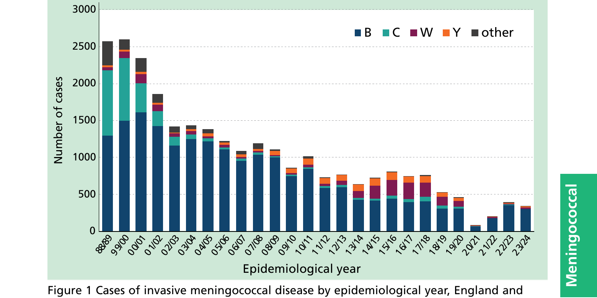
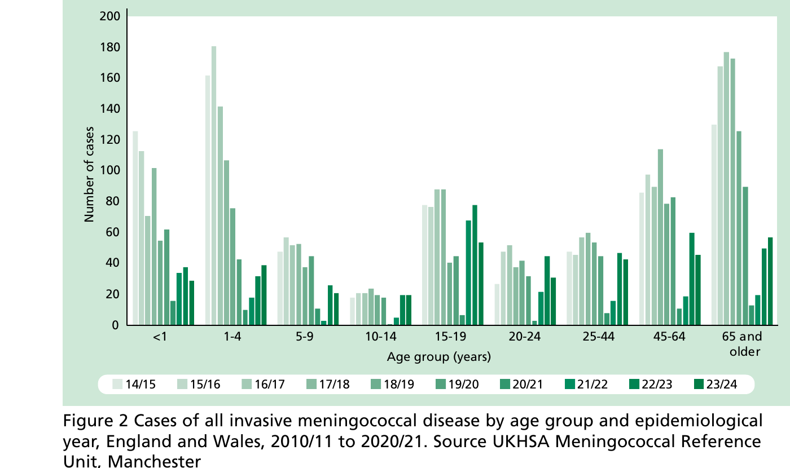

# Meningococcal

**MENINGOCOCCAL MENINGITIS AND SEPTICAEMIA** **NOTIFIABLE**

## The disease

Meningococcal disease occurs because of a systemic bacterial infection caused by _Neisseria meningitidis_.

Meningococci are Gram-negative diplococci, divided into antigenically distinct capsular groups according to their polysaccharide capsule. There are currently 12 identified capsular groups, A, B, C, E, H, I, K, L, W, X, Y, and Z, of which groups B, C, W and Y are the most common causes of invasive disease in the UK. Meningococcal vaccines have significantly reduced the incidence of meningococcal disease in the past two decades.

Meningococci colonise the nasopharynx of humans, especially adolescents and young adults, and are frequently harmless commensals. In infants and young children, the carriage rate is low (Christensen _et al._, 2010). It is not fully understood why disease develops in some individuals but not in others. Age, season, smoking, preceding viral infection and living in 'closed' or 'semi-closed' communities, such as university halls of residence or military barracks, have been identified as risk factors for disease (Cartwright, 1995; Mandal _et al._, 2017).

Transmission is by aerosol, droplets, or direct contact with respiratory secretions of someone carrying the organism. Transmission usually requires either frequent or prolonged close contact. There is a marked seasonal variation in meningococcal disease, with peak levels in the winter months declining to low levels by late summer.

Invasive meningococcal disease most commonly presents as meningitis and/or septicaemia. Less commonly, individuals may present with pneumonia, myocarditis, endocarditis, pericarditis, arthritis, conjunctivitis, urethritis, pharyngitis, and cervicitis (Rosenstein _et al._, 2001). The incubation period is from two to seven days and the onset of disease varies from mild prodromal symptoms to fulminant illness with death occurring within 24 hours of the first symptoms.

The incidence of meningococcal disease is highest in infants under one year of age and declines in subsequent years. There is a smaller secondary peak in incidence in 15 to 19 year-olds. The infection is fatal in 5% to 10% of cases, and survivors may develop severe long-term complications including hearing loss, severe visual impairment, communication problems, limb amputation(s), seizures, and brain damage.

The implementation of meningococcal vaccines into the UK national immunisation schedule since 1999, alongside secular changes, has resulted overall in large declines in invasive meningococcal disease across all age groups. A large decline during the 2020/21 epidemiological year (running from July one year to June to the following year) was due to national lockdowns, restrictions and physical distancing measures associated with the COVID-19 pandemic (Figures 1 and 2) (Subbarao 2021).

Invasive meningococcal disease due to serogroup B has become re-established in all age groups since 2021/2022 whilst disease due to other serogroups remains very rare (Figure 1).

## The meningococcal vaccines

Currently available vaccines are summarised in Table 1. All licensed meningococcal vaccines do not contain live organisms and, therefore, cannot cause the diseases against which they protect.

**Table 1 The meningococcal vaccines**

| Vaccine type                           | Protects against                                                  | Licensed vaccines                                   |
| -------------------------------------- | ----------------------------------------------------------------- | --------------------------------------------------- |
| Hib/MenC conjugate vaccine             | _Haemophilus influenzae_ type b/ meningococcal group C            | Menitorix® (until April 2026 or supplies exhausted) |
| MenACWY quadrivalent conjugate vaccine | Meningococcal groups A, C, W and Y                                | Menveo®, Nimenrix® and MenQuadfi®                   |
| Multicomponent protein vaccine (MenB)  | Meningococcal group B (may protect against other capsular groups) | Bexsero® and Trumenba®                              |

### Meningococcal conjugate vaccines

Meningococcal vaccines based solely on the capsular polysaccharide (often called 'plain' polysaccharide vaccines) provide only short-term protection to older children and adults and do not protect infants. Polysaccharide-conjugate meningococcal vaccines, however, are immunogenic across all ages and also prevent acquisition of carriage, thereby interrupting transmission of meningococci to others and inducing population (herd or indirect) protection. In infants and young children, the conjugation increases the immunogenicity of the vaccines compared to polysaccharide only vaccines and results in boosting of antibody and cellular responses with subsequent vaccine doses. Meningococcal polysaccharide-conjugate vaccines are serogroup specific and do not provide any cross-protection against other meningococcal serogroups.

#### Hib/MenC conjugate vaccine

The Hib/MenC conjugate vaccine Menitorix® was made from capsular polysaccharides of _Haemophilus influenzae_ type b and group C _Neisseria meningitidis_, which are both conjugated to tetanus toxoid. Following the cessation of production of Menitorix® by the manufacturer, the Hib/MenC vaccine dose was removed from the childhood immunisation schedule for children turning 12 months from the 1st July 2025. Based on the demonstrated decline of invasive meningococcal A, C, W and Y disease in the UK (primarily due to the success of the teenage MenACWY vaccination programme) and subsequent low number of MenC cases across all age groups, JCVI agreed that a dose of a MenC containing vaccine was no longer required in the second year of life.

#### Quadrivalent (ACWY) conjugate vaccines

The MenACWY conjugate vaccines are made from capsular polysaccharides of groups A, C, W and Y _Neisseria meningitidis_. In the UK, MenACWY vaccines are conjugated with either CRM~197~ or tetanus toxoid. From 2009, an increase in MenW disease was noted in England. This subsequently led the JCVI to advise MenACWY vaccination for 14 to 18 year-olds and young adults under 25 years of age attending university for the first time (Campbell _et al._, 2021).

MenACWY vaccination is now routinely offered to adolescents. If individuals do not initially take up the offer of vaccination, they remain eligible for vaccination until their 25th birthday.

Nimenrix® is licensed from 6 weeks of age, MenQuadfi® from 12 months of age and Menveo® from 2 years of age.

### 4CMenB protein vaccine (Bexsero®, GSK)

In 2013, a four-component protein-based meningococcal B (4CMenB) vaccine (Bexsero®) was licensed for children and adults in Europe. The vaccine is estimated to protect against 66-88% of MenB strains in England and Wales (Parikh _et al._, 2017). The vaccine is made from three main _N. meningitidis_ proteins produced by recombinant DNA technology (Neisseria heparin binding antigen (NHBA), Neisserial adhesion A (NadA), factor H binding protein (fHbp)) and a preparation of _N. meningitidis_ group B outer membrane vesicles (OMV). 4CMenB is immunogenic in young infants (Findlow _et al._, 2010) and adolescents (Santolaya _et al._, 2012) and is licensed for use from two months of age. 4CMenB was initially implemented into the UK infant immunisation programme in September 2015 as a 2+1 schedule (8 weeks, 16 weeks and 1 year of age) and has been very effective in preventing MenB disease in infants and toddlers (Ladhani _et al_, 2020). 4CMenB can also protect against infection by serogroups other than MenB (Ladhani _et al_, 2021) and also appears to have some protection against gonorrhoea (see the gonorrhoea chapter).

From 1st July 2025, the second 4CMenB dose will be given at 12 weeks instead of 16 weeks of age. This schedule change has the potential for preventing some of the remaining cases of invasive meningococcal disease in infants who have not yet received their full primary course by providing infants with earlier protection against meningococcal disease.

### MenB-fHbp protein vaccine (Trumenba®, Pfizer)

In 2017, MenB-fHbp was authorised for individuals aged 10 years and over as a 2- or 3-dose schedule for the prevention of MenB disease (European Medicines Agency, 2018). MenB- fHbp protein vaccine (Trumenba®) is composed of two types of recombinant meningococcal lipidated fHbp, belonging to one each of sub-families A and B, which provide broad coverage from circulating meningococcal strains (Findlow _et al_, 2019). Laboratory studies have shown that MenB-fHbp may protect against serogroups other than MenB (Harris _et al_, 2018).

## Storage and presentation

[Chapter 3](https://www.gov.uk/government/publications/storage-distribution-and-disposal-of-vaccines-the-green-book-chapter-3) contains information on vaccine storage, distribution and disposal.

The summary of product characteristics (SPC) for each vaccine may give further detail on vaccine storage.

#### Hib/MenC conjugate vaccine

Hib/MenC was supplied as a vial of white powder and 0.5mL of solvent in a pre-filled syringe. The vaccine must be reconstituted by adding the entire contents of the pre-filled syringe to the vial containing the powder. After addition of the solvent, the mixture should be shaken well until the powder is completely dissolved. After reconstitution, the vaccine should be administered promptly or allowed to stand in the refrigerator at temperatures between +2°C and +8° and be used within 24 hours.

#### Quadrivalent (ACWY) conjugate vaccine

Menveo® is supplied as a powder in a vial and 0.5mL solution in a pre-filled syringe. The vaccine must be reconstituted by adding the entire contents of the pre-filled syringe (containing MenCWY solution) to the vial containing the powder (MenA). Nimenrix® is supplied as a powder in a vial (MenACWY) and 0.5mL solvent in a pre-filled syringe. The vaccine must be reconstituted by adding the entire contents of the pre-filled syringe to the vial containing the powder. After reconstitution of either vaccine, the entire 0.5mL should be drawn up into the syringe and used immediately. Menveo® is stable at or below a temperature of +25°C for up to eight hours, and chemical and physical in-use stability has been demonstrated for eight hours at a temperature of +30°C for Nimenrix®, although such a delay in administration following reconstitution is not recommended. MenQuadfi® is supplied as a solution for injection. Stability data indicate that MenQuadfi® is stable at temperatures up to +25°C for 72 hours, although temperature excursions such as these are not recommended.

#### 4CMenB protein vaccine

4CMenB vaccine is supplied as a white opalescent liquid suspension (0.5mL) in a pre-filled syringe (single pack size) for injection. One dose (0.5mL) contains 50 micrograms each of NHBA, NadA and fHbp and 25 micrograms of OMV.

#### MenB-FHbp, (bivalent rLP2086) MenB protein vaccine

Trumenba® suspension for injection comes in pre-filled syringe. One dose (0.5mL) contains recombinant fHbp subfamily A (60 micrograms) and fHbp subfamily B (60 micrograms), adsorbed on aluminium phosphate (0.25 milligram aluminium per dose)

## Administration

Most injectable vaccines are routinely given intramuscularly into the deltoid muscle of the upper arm or, for infants aged 1 year and under, into the anterolateral aspect of the thigh. Further information about immunisation procedures, including injection technique can be found in [Chapter 4](https://www.gov.uk/government/publications/immunisation-procedures-the-green-book-chapter-4). When administering 4CMenB, it is important to note the information on fever and the administration of paracetamol (see 'Adverse reactions' section below).

In line with general advice about co-administration of inactivated or non-live vaccines, meningococcal vaccines can be given at the same time as any other vaccines required. The vaccines should be given at a separate site, preferably into a different limb. If given in the same limb, they should be given at least 2.5cm apart (American Academy of Pediatrics, 2021). The site at which each vaccine is given should be noted in the individual's records.

## Disposal

[Chapter 3](https://www.gov.uk/government/publications/storage-distribution-and-disposal-of-vaccines-the-green-book-chapter-3) outlines storage, distribution and disposal requirements for vaccines.

Equipment used for immunisation, including used vials, ampoules, or discharged vaccines in a syringe, should be disposed of safely in a UN-approved puncture-resistant 'sharps' box, according to local authority waste disposal arrangements and guidance in the [technical memorandum 07-01: Safe and sustainable management of healthcare waste (NHS England)](https://www.england.nhs.uk/publication/management-and-disposal-of-healthcare-wastehtm-07-01/).

## Recommendations for the use of the vaccine

The objective of the routine immunisation programme is to protect, directly or indirectly, those at greatest risk of meningococcal disease.

Following the cessation of production of Menitorix® by the manufacturer, the Hib/MenC vaccine dose was removed from the childhood immunisation schedule for children turning 12 months from the 1st July 2025. Based on the demonstrated decline of invasive meningococcal A, C, W and Y disease in the UK (primarily due to the success of the teenage MenACWY vaccination programme) and subsequent low number of MenC cases across all age groups, JCVI agreed that a dose of a MenC containing vaccine was no longer required in the second year of life.

### Immunisation schedule

The routine immunisation schedule, from 1st July 2025, is set out in Table 2.

**Table 2 Meningococcal routine vaccination schedule**

| Age             | Primary/Booster   | Dose                                 |
| --------------- | ----------------- | ------------------------------------ |
| 8 weeks         | Primary           | One dose -- 4CMenB vaccine†          |
| 12 weeks\*      | Primary           | One dose -- 4CMenB vaccine†          |
| One year        | Booster           | One dose -- 4CMenB vaccine           |
| Around 14 years | Primary (MenACWY) | One dose - MenACWY conjugate vaccine |

\* From the 1st July 2025, the second dose of 4CMenB vaccine is given at 12 weeks instead of 16 weeks of age to provide infants with earlier protection against meningococcal disease.

† Prophylactic paracetamol is advised where 4CMenB is administered to infants concomitantly with other routine vaccinations at 8 and 12 weeks -- see 'Adverse Reactions' section below

### Vaccination of individuals with unknown or incomplete vaccination status

When a child born in the UK presents with an inadequate immunisation history, every effort should be made to clarify what immunisations they may have had (see [Chapter 11](https://www.gov.uk/government/publications/immunisation-schedule-the-green-book-chapter-11)).

Children coming to the UK who have a history of completing immunisation in their country of origin may not have been offered protection with all the antigens currently used in the UK, and they may not have received any meningococcal vaccines. Country immunisation schedules can be found on [the WHO website.](https://www.who.int/teams/immunization-vaccines-and-biologicals/policies/who-policy-recommendations-for-routine-immunization-in-table-format)

Individuals coming from areas of conflict or from population groups who may have been marginalised in their country of origin (e.g. refugees, gypsy or other nomadic travellers) may not have had good access to immunisation services. In particular, older children and adults may also have been raised during periods before immunisation services were well developed or when vaccine quality was sub-optimal. Where there is no reliable history of previous immunisation, it should be assumed that they are unimmunised and the UK catch-up recommendations for that age should be followed (see [Chapter 11](https://www.gov.uk/government/publications/immunisation-schedule-the-green-book-chapter-11)).

Infants younger than 12 months should receive two doses of 4CMenB at least four weeks apart followed by a 4CMenB booster at 12 months, ensuring a minimum of four weeks between the 4CMenB doses.

Children aged one year to less than two years who received less than two 4CMenB doses in the first year of life should receive two additional doses of 4CMenB at least four weeks apart.

Individuals (including those who are new to the UK) who have missed the opportunity to receive their adolescent dose of MenACWY (usually offered around the age of 14 years) should be offered a dose up to their 25th birthday.

Further guidance on vaccination of individuals with unknown or incomplete immunisation status is published by the UK Health Security Agency: https://www.gov.uk/government/publications/vaccination-of-individuals-with-uncertain-or-incomplete-immunisation-status

### Children and adults with asplenia, splenic dysfunction or complement disorders (including those on complement inhibitor treatment)

Children and adults with asplenia or splenic dysfunction may be at increased risk of invasive meningococcal infection. Such individuals, irrespective of age or interval from splenectomy, may have a sub-optimal response to the vaccine (Balmer _et al._, 2004).

Children and adults with complement disorders (Figueroa _et al._, 1991), or on complement inhibitor therapy (e.g. Eculizumab, a humanised monoclonal antibody that inhibits the terminal complement pathway), are at increased risk of invasive meningococcal infection (Ladhani _et al._, 2019).

Given the increased risk, additional vaccinations against meningococcal disease are advised for individuals with asplenia or splenic dysfunction or when a complement disorder is diagnosed depending on age and vaccination history (see [Chapter 7](https://www.gov.uk/government/publications/immunisation-of-individuals-with-underlying-medical-conditions-the-green-book-chapter-7)). Individuals who are to receive complement-inhibitor therapy should be vaccinated at least two weeks prior to commencement of therapy unless the risk of delaying treatment outweighs the risk of developing a meningococcal infection. Individuals commencing treatment less than two weeks after a meningococcal vaccine require prophylactic antibiotics until two weeks following vaccination. This advice applies to all newly diagnosed patients.

Where an opportunity arises, and depending on the individual patient's circumstances, eligible at-risk children and adults who have never received 4CMenB or MenACWY conjugate vaccine should be offered these vaccines.

### Reinforcing immunisation for at risk individuals

**Meningococcal ACWY conjugate vaccine.**

Booster doses of MenACWY conjugate vaccine in at-risk individuals are currently not recommended because the need for, and the timing of, boosters has not yet been determined. There are currently very few infections due to these 4 serogroups because of the population protection provided by the teenage MenACWY immunisation programme.

**Meningococcal B vaccine.**

The need for, and the timing of, a booster dose of 4CMenB vaccine in at-risk individuals has not yet been determined.

### Individuals who are travelling or going to reside abroad

All travellers should undergo a careful risk assessment that considers their itinerary, duration of stay and planned activities. In some areas of the world, the risk of acquiring meningococcal infection, particularly of developing capsular group A disease, is much higher than in the UK. Individuals who are particularly at risk are visitors who live or travel 'rough', such as backpackers, and those living or working closely with local people. Large epidemics of both capsular group A and W meningococcal infection have occurred in association with Hajj pilgrimages, and proof of vaccination against A, C, W and Y capsular groups is now a visa entry requirement for pilgrims and seasonal workers travelling to the Kingdom of Saudi Arabia. Following some recent imported MenW cases in returning travellers, vaccination is also recommended for those undertaking Umrah at any time of year. (https://travelhealthpro.org.uk/news/835/invasive-meningococcal-disease-reported-in-umrah-pilgrims-in-2025)

Epidemics of meningococcal disease occur unpredictably throughout tropical Africa but particularly in the savannah during the dry season (December to June). MenACWY vaccination is recommended for long-stay or high-risk visitors to sub-Saharan Africa, for example, those who will be living or working closely with local people, or those who are backpacking.

From time to time, outbreaks of meningococcal infection may be reported from other parts of the world and, where such outbreaks are shown to be due to vaccine-preventable capsular groups, vaccination may be recommended for certain travellers to the affected areas.

Country-specific recommendations and information on the global epidemiology of meningococcal disease can be found on the following website: https://travelhealthpro.org.uk/

Note: MenC conjugate vaccine protects against capsular group C disease only. Individuals travelling abroad (see above) should be immunised with an appropriate quadrivalent (ACWY) vaccine, even if they have previously received the MenC conjugate vaccine. There are currently no recommendations for 4CMenB vaccination for individuals who are travelling or going to reside abroad.

**Table 3 Recommendations for the use of quadrivalent meningococcal ACWY vaccines for travel**

| Age                                     | ACWY schedule                                                             |
| --------------------------------------- | ------------------------------------------------------------------------- |
| Birth to less than one year             | First dose of 0.5ml Second dose of 0.5ml four weeks after the first dose. |
| From one year of age (including adults) | Single dose of 0.5ml                                                      |

### Individuals at occupational risk

Any laboratory staff who handle strains of, or clinical samples containing, _Neisseria meningitidis_ must receive a primary course of meningococcal ACWY conjugate vaccine (one dose) and 4CMenB vaccine (two doses), with booster doses of both vaccines every five years.

## Contraindications

There are very few individuals who cannot receive meningococcal vaccines. When there is doubt, appropriate advice should be sought from a the relevant specialist consultant the local screening and immunisation team or local Health Protection Team, rather than withholding the vaccine. The risk to the individual of not being immunised must be taken into account. The vaccines should not be given to those who have had:

- a confirmed anaphylactic reaction to a previous dose of the vaccine, or
- a confirmed anaphylactic reaction to any component or residue from the manufacturing process

Specific advice on management of individuals who have had an allergic reaction can be found in [Chapter 8](https://www.gov.uk/government/publications/vaccine-safety-and-the-management-of-adverse-events-following-immunisation-the-green-book-chapter-8) of the Green Book.

## Precautions

[Chapter 6](https://www.gov.uk/government/publications/contraindications-and-special-considerations-the-green-book-chapter-6) contains information on contraindications and special considerations for vaccination.

Minor illnesses without fever or systemic upset are not valid reasons to postpone immunisation. If an individual is acutely unwell, immunisation may be postponed until they have fully recovered. This is to avoid confusing the differential diagnosis of any acute illness by wrongly attributing any signs or symptoms to the adverse effects of the vaccine.

Individuals who have had a systemic or local reaction following a previous immunisation with meningococcal vaccine can continue to receive subsequent doses of meningococcal vaccine. This includes the following rare reactions:

- fever, irrespective of its severity
- hypotonic-hyporesponsive episodes (HHE)
- persistent crying or screaming for more than 3 hours, or
- severe local reaction, irrespective of extent
- convulsions, with or without fever, within 3 days of vaccination

### Use of paracetamol after 4CMenB

JCVI recommends that paracetamol should be given prophylactically when 4CMenB is given with the routine vaccines to infants under one year of age. A 2.5mL dose of liquid paracetamol (infant paracetamol 120mg/5ml) should be given orally as soon as possible after vaccination, followed by a second 2.5 mL dose after 4-6 hours and a third 2.5 mL dose 4-6 hours after the second dose. Should fever persist following the third dose and provided that the child appears otherwise well, additional doses of paracetamol may be administered at intervals of four to six hours for up to 48 hours.

[Chapter 8](https://www.gov.uk/government/publications/vaccine-safety-and-the-management-of-adverse-events-following-immunisation-the-green-book-chapter-8) covers vaccine safety and the management of adverse events following immunisation.

### Pregnancy and breast-feeding

Meningococcal vaccines may be given to pregnant women when clinically indicated. There is no evidence of risk from vaccinating pregnant women or those who are breastfeeding with inactivated virus or bacterial vaccines or toxoids (Granoff _et al._, 2008). In cases where meningococcal immunisation has been inadvertently given in pregnancy, there has been no evidence of harm to the foetus.

### Premature infants

It is important that premature infants have their immunisations at the appropriate chronological age, according to the schedule. The occurrence of apnoea following vaccination is especially increased in infants who were born very prematurely.

Very premature infants (born ≤ 28 weeks of gestation) who are in hospital should have respiratory monitoring for 48-72 hours when given their first immunisation, particularly those with a previous history of respiratory immaturity. If the child has apnoea, bradycardia or desaturations after the first immunisation, the second immunisation should also be given in hospital, with respiratory monitoring for 48-72 hours (Ohlsson _et al._, 2004; Pfister _et al._, 2004; Schulzke _et al._, 2005; Pourcyrous _et al._, 2007; Klein _et al._, 2008).

Infants stable at discharge without a history of apnoea and/or respiratory compromise may be vaccinated in the community setting.

As the benefit of immunisation is high in this group of infants, immunisation should not be withheld or delayed.

### Immunosuppression and HIV infection

Individuals with immunosuppression and human immunodeficiency virus (HIV) infection (regardless of CD4 count) should be given meningococcal vaccines in accordance with the routine schedule. These individuals may not make a full antibody response.

Re-immunisation should be considered after treatment is finished and recovery has occurred. Specialist advice may be required.

Further guidance for the immunisation of HIV-infected individuals is provided by the British HIV Association (BHIVA) [Guidelines on the use of vaccines in HIV-positive adults](https://www.bhiva.org/vaccination-guidelines), and the Children's HIV Association (CHIVA) [Guidelines on Vaccination of Children Living with HIV](https://www.chiva.org.uk/infoprofessionals/guidelines/immunisation/) (CHIVA, 2022).

## Adverse reactions

[Chapter 8](https://www.gov.uk/government/publications/vaccine-safety-and-the-management-of-adverse-events-following-immunisation-the-green-book-chapter-8) covers vaccine safety and the management of adverse events following immunisation.

### Hib/MenC conjugate

Mild side effects such as irritability, loss of appetite, pain, swelling or redness at the site of the injection and slightly raised temperature commonly occur. Less commonly crying, diarrhoea, vomiting, atopic dermatitis, malaise, and fever over 39.5°C have been reported.

### Quadrivalent (ACWY) conjugate vaccine

For Menveo®, very common or common reported reactions included injection site reactions including pain, erythema, induration, and pruritus. Other very common or common reactions include headache, nausea, rash, and malaise. Reports of all adverse reactions can be found in the Summary of Product Characteristics for Menveo® (GSK, accessed 21/03/2025: https://www.medicines.org.uk/emc/product/2939/smpc#gref).

For Nimenrix®, very common or common reported reactions include injection site reactions including pain, erythema, and swelling. Other very common or common reactions include irritability, drowsiness, headache, nausea, and loss of appetite. Reports of all adverse reactions can be found in the Summary of Product Characteristics for Nimenrix® (Pfizer, accessed 21/03/2025: https://www.medicines.org.uk/emc/medicine/26514#gref)

For MenQuadfi®, reports of all adverse reactions can be found in the Summary of Product Characteristics for MenQuadfi® (Sanofi, accessed 21/03/2025: https://www.medicines.org.uk/emc/product/12818/smpc#gref).

### 4CMenB vaccine

For 4CMenB (Bexsero®), the most common local and systemic adverse reactions observed in adolescents and adults were pain at the injection site, malaise, and headache. In infants and children up to ten years of age, injection site reactions, fever (≥38oC) and irritability were very commonly seen. Diarrhoea and vomiting, eating disorders, sleepiness, unusual crying and the development of a rash were commonly or very commonly seen in this age group. Reports of all adverse reactions can be found in the Summary of Product Characteristics for Bexsero® (GSK, accessed 21/03/2025: https://www.medicines.org.uk/emc/product/5168/smpc#gref).

In infants and children under two years of age, fever ≥38°C (occasionally ≥39°C) was more common when 4CMenB was administered at the same time as routine vaccines (see [Chapter 11](https://www.gov.uk/government/publications/immunisation-schedule-the-green-book-chapter-11)) than when 4CMenB was given alone. The fever peaks at around 6 hours and has usually gone by 48 hours after vaccination. Prior to the introduction of 4CMenB, prophylactic paracetamol around the time of vaccination was not routinely recommended for preventing post-vaccination fever (see [Chapter 8](https://www.gov.uk/government/publications/vaccine-safety-and-the-management-of-adverse-events-following-immunisation-the-green-book-chapter-8)) because of concerns that it may lower antibody responses to some vaccines (Prymula _et al._, 2009); although this reduction is unlikely to be clinically significant (Das _et al._, 2014). The immunogenicity of both Bexsero® and the other routine vaccines administered to infants is not affected by giving paracetamol when such vaccines are co- administered with 4CMenB. (Prymula _et al._, 2011), and paracetamol has been shown to reduce fever and other symptoms associated with vaccination (Prymula _et al._, 2011, Das _et al._, 2014).

Parents should be advised to seek medical advice if their child is noticeably unwell with a fever present, or if the fever occurs at other times. Ibuprofen appears to be less effective than paracetamol at controlling fever following vaccination and is not therefore recommended (Das _et al._, 2014).

### MenB-fHbp vaccine

For MenB-fHbp (Trumenba®), the most common adverse reactions in those over 10 years of age were headache, diarrhoea, nausea, muscle pain, joint pain, fatigue, chills, and injection site pain, swelling and redness. (Pfizer, accessed 21/03/2025: https://www.medicines.org.uk/emc/product/2670/smpc#gref).

### Reporting adverse events

Anyone can report a suspected reaction to the Medicines and Healthcare products Regulatory Agency (MHRA) using the Yellow Card scheme (https://yellowcard.mhra.gov.uk/). All suspected adverse reactions to vaccines occurring in children, or in individuals of any age after vaccination should be reported to the MHRA using the Yellow Card scheme. Serious suspected adverse reactions to vaccines in adults should also be reported through the Yellow Card scheme.

## Management of suspected cases and contacts

For public health management of suspected meningococcal cases, and contacts of cases and outbreaks, please refer to the following guidance: https://www.nice.org.uk/guidance/ng240

https://www.gov.uk/government/publications/meningococcal-disease-guidance-on-public-health-management

### Management of meningococcal clusters and outbreaks

In addition to sporadic cases, outbreaks of meningococcal infections can occur particularly in closed or semi-closed communities such as schools, military establishments and universities. Advice on the management of such outbreaks should be obtained from the local Health Protection Team (HPT). For further information refer to the UKHSA guidance: https://www.gov.uk/government/publications/meningococcal-disease-guidance-on-public-health-management

Advice on the use of meningococcal vaccines in outbreaks is available from: UKHSA, Colindale (Tel: 020 8200 6868), Public Health Scotland, Vaccination and Immunisation Division (email: phs.immunisation@phs.scot) and the Bacterial Respiratory Infection Service (BRiS), Glasgow (tel: 0141 242 9632).

Please contact the Immunisation Division at UKHSA, Colindale if you experience any delay in obtaining meningococcal vaccines for household contacts or in case of an outbreak.

## Supplies

4CMenB and at least one MenACWY vaccine from the list below will be available at any one time:

- Bexsero® -- (4CMenB) manufactured by GSK
- MenQuadfi® -- (MenACWY) manufactured by Sanofi
- Menveo® -- (MenACWY) manufactured by GSK
- Nimenrix® -- (MenACWY) manufactured by Pfizer

Centrally purchased vaccines for the NHS as part of the national immunisation programme and for contacts of confirmed cases and in outbreaks of MenACWY infection can only be ordered via ImmForm in England, Wales and Scotland (tel: 0207 183 8580; https://portal.immform.ukhsa.gov.uk). Vaccines for use as part of the national immunisation programme are provided free of charge. For further information about vaccines available via ImmForm, please see the helpsheet "Vaccines Available on ImmForm".

In Northern Ireland, supplies should be obtained under the normal childhood vaccines distribution arrangements, details of which are available by contacting the Regional Pharmaceutical Procurement Service on 028 9442 4089.

**Vaccines for private prescriptions, occupational health use or travel are NOT provided free of charge and should be ordered from the manufacturers**.

Vaccines for use outside of national programmes should be ordered directly from manufacturers:

- Bexsero® (4CMenB)) -- manufactured by GSK (Tel: 0808 100 9997)
- Menveo® (Quadrivalent conjugate ACWY vaccine) -- manufactured by GSK (Tel: 0808 100 9997)
- Nimenrix® (Quadrivalent conjugate ACWY vaccine) -- manufactured by Pfizer (0800 0327907)
- MenQuadfi® - (Quadrivalent conjugate ACWY vaccine) manufactured by Sanofi 0800 854 430 (option 1)
- Trumenba® - (MenB-fHbp) manufactured by Pfizer. Visit smarthub.pfizerpro.co.uk for stock information, call Alliance healthcare to order 0344 8547749, free phone 0800 0327907

## References

American Academy of Pediatrics (2021) Active immunization. In: Kimberlin DW, Barnett ED, Lynfield R, Sawyer MH, eds. Red Book: 2021 Report of the Committee on Infectious Diseases. 32nd edition. Itasca, IL: American Academy of Pediatrics: 2021, p28. Balmer P, Falconer M, McDonald P _et al_. (2004) Immune response to meningococcal serogroup C conjugate vaccine in asplenic individuals. _Infect Immun_ **72**(1): 332-7.

British HIV Association (2015) BHIVA guidelines on the use of vaccines in HIV-positive adults https://www.bhiva.org/vaccination-guidelines Accessed June 2024

Campbell H, Andrews N, Parikh SR, White J, Edelstein M, Bai X, Lucidarme J, Borrow R, Ramsay ME, Ladhani SN. Impact of an adolescent meningococcal ACWY immunisation programme to control a national outbreak of group W meningococcal disease in England: a national surveillance and modelling study. Lancet Child Adolesc Health. 2021 Dec 6:S2352-4642(21)00335-7. doi: 10.1016/S2352-4642(21)00335-7 https://www.thelancet.com/pdfs/journals/lanchi/PIIS2352-4642(21)00335-7.pdf

Cartwright K (1995) The Clinical Spectrum of Meningococcal Disease. In: Cartwright K (ed.) _Meningococcal disease_. Chichester, UK: John Wiley & Sons, pp 115-46.

Children's HIV Association (2022) Guidelines on Vaccination of Children Living with HIV https://www.chiva.org.uk/infoprofessionals/guidelines/immunisation/ Accessed June 2024

Christensen H, May M, Bowen L _et al_. (2010) Meningococcal carriage by age: a systematic review and meta-analysis. _Lancet Infect Dis_ **10**(12): 853-61.

Das RR, Panigrahi I, Naik SS (2014) The effect of prophylactic antipyretic administration on post-vaccination adverse reactions and antibody response in children: a systematic review. _PLoS One_ **9**(9):e106629

Diggle L and Deeks J (2000) Effect of needle length on incidence of local reactions to routine immunisation in infants aged 4 months: randomised controlled trial. _BMJ_ **321**(7266): 931-3.

European Medicines Agency. Annex I: Summary of product characteristics (Trumenba), https://www.ema.europa.eu/documents/product-information/trumenba-epar-product-information_en.pdf; [accessed November 7, 2018].

Figueroa JE and Densen P (1991) Infectious diseases associated with complement deficiencies. _Clin Microbiol Rev_ **4**(3): 359-95.

Findlow J, Borrow R, Snape MD _et al_. (2010) Multicenter, open-label, randomized phase II controlled trial of an investigational recombinant Meningococcal serogroup B vaccine with and without outer membrane vesicles, administered in infancy. _Clin Infect Dis_ **51**(10): 1127-37.

Findlow J, Nuttens C, Kriz P.Introduction of a second MenB vaccine into Europe - needs and opportunities for public health. Expert Rev Vaccines 2019;18(3):225-39.

Granoff DM, Harrison LH and Borrow R (2008) Section 2: Licensed Vaccines Meningococcal Vaccines. In: Plotkin S, Orenstein W and Offit P (ed.) _Vaccines_. 5th edition. Elsevier Inc., p 399-434.

GSK Summary of Product Characteristics for Menveo® https://www.medicines.org.uk/emc/medicine/27347#gref

GSK Summary of Product Characteristics for Bexsero® https://www.medicines.org.uk/emc/medicine/28407/SPC/Bexsero+Meningococcal+Group+B+vaccine+for+injection+in+pre-filled+syringe/#gref

Harris SL, Tan C, Andrew L, Hao L, Liberator PA, Absalon J, _et al_. The bivalent factor H binding protein meningococcal serogroup B vaccine elicits bactericidal antibodies against representative non-serogroup B meningococci. Vaccine 2018;36:6867--74.

Klein NP, Massolo ML, Greene J _et al_. (2008) Risk factors for developing apnea after immunization in the neonatal intensive care unit. _Pediatrics_ **121**(3): 463-9.

Ladhani SN, Campbell H, Lucidarme J, Gray S, Parikh S, Willerton L, Clark SA, Lekshmi A, Walker A, Patel S, Bai X, Ramsay M, Borrow R. Invasive meningococcal disease in patients with complement deficiencies: a case series (2008-2017).BMC Infect Dis. 2019 Jun 14;19(1):522. doi: 10.1186/s12879-019-4146-5. https://www.ncbi.nlm.nih.gov/pmc/articles/PMC6567562/pdf/12879_2019_Article_4146.pdf

Ladhani SN, Andrews N, Parikh SR, Campbell H, White J, Edelstein M, Bai X, Lucidarme J, Borrow R, Ramsay ME. Vaccination of Infants with Meningococcal Group B Vaccine (4CMenB) in England. N Engl J Med 2020;382:309-17.

Ladhani SN, Campbell H, Andrews N, Parikh SR, White J, Edelstein M, Clark SA, Lucidarme J, Borrow R, Ramsay ME. First Real-world Evidence of Meningococcal Group B Vaccine, 4CMenB, Protection Against Meningococcal Group W Disease: Prospective Enhanced National Surveillance, England. Clin Infect Dis. 2021 Oct 5;73(7):e1661-e1668.

Maiden MC, Stuart JM and UK Meningococcal Carriage Group (2002) Carriage of serogroup C meningococci 1 year after meningococcal C conjugate polysaccharide vaccination. _Lancet_ **359**(9320): 1829-31.

Maiden MC, Ibarz-Pavon AB, Urwin R _et al_. (2008) Impact of meningococcal serogroup C conjugate vaccines on carriage and herd immunity. _J Infect Dis_ **197**(5): 737-43.

Mandal S, Campbell H, Ribeiro S, Gray S, Carr T, White J, Ladhani SN, Ramsay ME. Risk of invasive meningococcal disease in university students in England and optimal strategies for protection using MenACWY vaccine. Vaccine. 2017 Oct 13;35(43):5814-5818. doi: 10.1016/j.vaccine.2017.09.024. Epub 2017 Sep 18. PubMed PMID: 28928076.

Mark A, Carlsson RM and Granstrom M (1999) Subcutaneous versus intramuscular injection for booster DT vaccination of adolescents. _Vaccine_ **17**(15-16): 2067-72.

National Institute for Health and Care Excellence (NICE) (2024) Meningitis (bacterial) and meningococcal disease: recognition, diagnosis and management, NICE guideline [NG240]. Accessed December 2024

NHS England (first published 2013) Health Technical Memorandum (HTM 07-01) Management and disposal of healthcare waste. https://www.england.nhs.uk/publication/management-and-disposal-of-healthcare-wastehtm-07-01/ Accessed June 2024

Ohlsson A and Lacy JB (2004) Intravenous immunoglobulin for preventing infection in preterm and/or low-birth-weight infants. _Cochrane Database Syst Rev_ (1): CD000361.

Parikh SR, Newbold L, Slater S, Stella M, Moschioni M, Lucidarme J, De Paola R, Giuliani M, Serino L, Gray SJ, Clark SA, Findlow J, Pizza M, Ramsay ME, Ladhani SN, Borrow R. Meningococcal serogroup B strain coverage of the multicomponent 4CMenB vaccine with corresponding regional distribution and clinical characteristics in England, Wales, and Northern Ireland, 2007-08 and 2014-15: a qualitative and quantitative assessment. Lancet Infect Dis. 2017 Jul;17(7):754-762. doi: 10.1016/S1473-3099(17)30170-6. Epub 2017 Mar 30. PMID: 28366725. https://www.sciencedirect.com/science/article/pii/S1473309917301706?via%3Dihub

Pfister RE, Aeschbach V, Niksic-Stuber V _et al_. (2004) Safety of DTaP-based combined immunization in very-low-birth-weight premature infants: frequent but mostly benign cardiorespiratory events. _J Pediatr_ **145**(1): 58-66.

Pfizer Summary of Product Characteristics for Nimenrix® https://www.medicines.org.uk/emc/medicine/26514#gref

Pfizer Summary of Product Characteristics for Trumenba® https://www.medicines.org.uk/emc/product/2670/smpc#gref

Pourcyrous M, Korones SB, Arheart KL _et al_. (2007) Primary immunization of premature infants with gestational age <35 weeks: cardiorespiratory complications and C-reactive protein responses associated with administration of single and multiple separate vaccines simultaneously. _J Pediatr_ **151**(2): 167-72.

Prymula R, Siegrist CA, Chlibek R _et al_. (2009) Effect of prophylactic paracetamol administration at time of vaccination on febrile reactions and antibody responses in children: two open-label, randomised controlled trials. _Lancet_ **374**(9698): 1339-50.

Prymula R, Esposito S, Kittel C _et al_. (2011) Prophylactic paracetamol in infants decreases fever following concomitant administration of an investigational meningococcal serogroup B vaccine with routine immunizations. Poster presented at: 29th Annual Meeting of the European Society for Paediatric Infectious Diseases (ESPID); June 7-11, 2011; The Hague, The Netherlands. Poster 631.

Rosenstein NE, Perkins BA, Stephens DS _et al_. (2001) Meningococcal disease. _N Engl J Med_ **344**(18): 1378-88.

Sanofi Pasteur Summary of Product Characteristics for MenQuadfi® https://www.medicines.org.uk/emc/product/12818/smpc#gref

Santolaya ME, O'Ryan ML, Valenzuela MT _et al_. (2012) Immunogenicity and tolerability of a multicomponent meningococcal serogroup B (4CMenB) vaccine in healthy adolescents in Chile: a phase 2b/3 randomised, observer-blind, placebo-controlled study. _Lancet_ **379**(9816): 617-24.

Schulzke S, Heininger U, Lucking-Famira M _et al_. (2005) Apnoea and bradycardia in preterm infants following immunisation with pentavalent or hexavalent vaccines. _Eur J Pediatr_ **164**(7): 432-5.

Subbarao S, Campbell H, Ribeiro S, Clark SA, Lucidarme J, Ramsay M, Borrow R, Ladhani S. Invasive Meningococcal Disease, 2011-2020, and Impact of the COVID-19 Pandemic, England. Emerg Infect Dis. 2021 Sep;27(9):2495-2497. doi: 10.3201/eid2709.204866. Epub 2021 Jun 30. PMID: 34193335.

Trotter CL and Gay NJ (2003) Analysis of longitudinal bacterial carriage studies accounting for sensitivity of swabbing: an application to _Neisseria meningitidis_. _Epidemiol Infect_ **130**(2): 201-5.

UK Health Security Agency (2024) Meningococcal disease: guidance on public health management, https://www.gov.uk/government/publications/meningococcal-disease-guidance-on-public-health-management. Accessed December 2024.

Zuckerman JN (2000) The importance of injecting vaccines into muscle. Different patients need different needle sizes. _BMJ_ **321**(7271): 1237-8.
