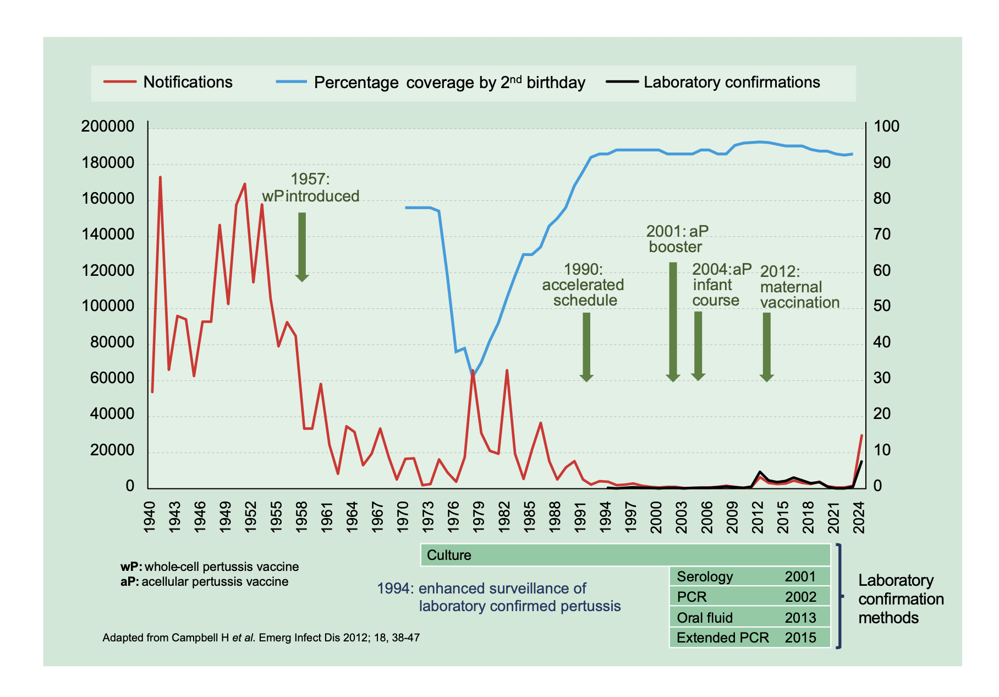
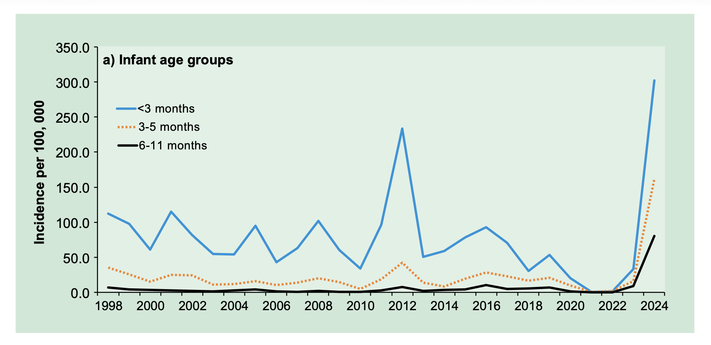
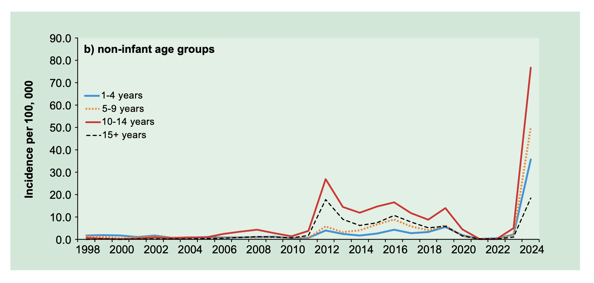
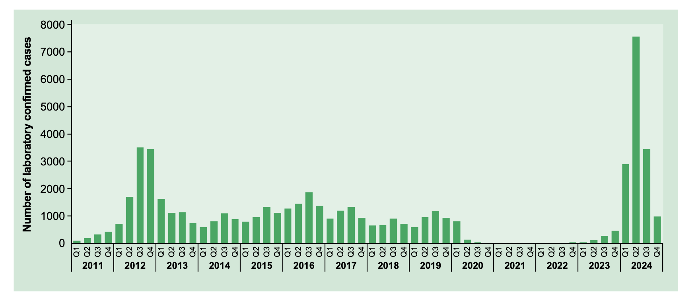

# Pertussis

NOTIFIABLE

## The disease

Whooping cough (pertussis) is a highly infectious disease that is usually caused by _Bordetella pertussis_. A similar illness is caused by _B. parapertussis_, but this is not preventable with currently available vaccines.

The disease starts with an initial catarrhal stage, followed by an irritating cough that gradually becomes paroxysmal, usually within one to two weeks. The paroxysms are often followed by a characteristic 'whoop' or by vomiting. In young infants, the typical 'whoop' may never develop and coughing spasms may be followed by periods of apnoea. The illness often lasts for two to three months. In older children and adults, the disease may present as a persistent cough without these classic symptoms and therefore not be recognised as whooping cough.

Pertussis may be complicated by bronchopneumonia, repeated vomiting leading to weight loss, and cerebral hypoxia with a resulting risk of brain damage. Severe complications and deaths occur most commonly in unvaccinated infants under six months of age. Minor complications include subconjunctival haemorrhages, epistaxis (nosebleeds), facial oedema, ulceration of the tongue or surrounding area, and suppurative otitis media.

Transmission of the infection is by respiratory droplet, and cases are most infectious during the early catarrhal phase. The incubation period is between six and 20 days and cases are infectious from six days after exposure to three weeks after the onset of typical paroxysms.

## History and epidemiology of the disease

Pertussis is a cyclical disease that peaks every 3 to 5 years alongside a seasonal pattern with highest levels of activity usually in the Autumn. Before the introduction of pertussis immunisation in the 1950s, the average annual number of notifications exceeded 120,000 in England and Wales (Figure 24.1).

By 1972, when vaccine coverage was around 80%, there were only 2,069 notifications of pertussis. Because of professional and public anxiety about the safety and efficacy of the whole-cell vaccine, coverage fell to a low of around 30% by 1978. Major epidemics occurred in 1977--79 and 1981--83. In 1978 there were over 65,000 notifications and 12 deaths (Amirthalingam _et al._, 2013). These two major epidemics illustrate the impact of a fall in coverage of an effective vaccine. The actual number of deaths due to these pertussis outbreaks was higher, since not all cases in infants are recognised (Miller and Fletcher, 1976; Crowcroft _et al._, 2002) but with current surveillance systems, under ascertainment of deaths from diagnosed pertussis cases is now considered to be small (van Hoek _et al._, 2013b).

**Figure 24.1:** Historical pertussis notifications in England and Wales with laboratory confirmed cases from England only, 2008 to 2024 (after confirmed exceeded notified cases) and vaccine coverage in England

The return of professional and public confidence increased vaccine uptake. Since 1992, coverage has been consistently 92% or higher by the second birthday and pertussis notifications fell to fewer than 5,000 per year. During the period 2000-2011 there were 1,500 cases or less notified annually. From the early 2000s, the introduction of new diagnostic methods, and widespread use of serology testing in particular, has improved the ascertainment of laboratory confirmed pertussis in older children and adults. Ascertainment of cases in children and young people was further enhanced when non-invasive oral fluid testing was made available from 2013 and is now offered to those aged 2 to16 years.

Despite sustained levels of primary vaccine coverage above 95% from 2010, an increase in pertussis activity with a rise in infant cases and deaths was observed in England and Wales from October 2011 and continued into 2012 (figures 24.2 and 24.3). As a result, a national outbreak was declared in April 2012. Several other countries with longstanding vaccination programmes, including Australia, Canada and the United States, also experienced increased pertussis activity at a similar time.

After a prolonged period of historically low levels of pertussis activity during the COVID pandemic period, cases began to increase from Summer 2023 and more substantially from December 2023 to reach levels in the first quarter of 2024 that exceeded those in the same period in 2012 (figure 24.4). This included cases, hospitalisations and eleven deaths attributable to pertussis in very young infants over the course of 2024. A national outbreak was declared in May 2024, and the increase in cases reported in England was mirrored by similar increases in the other devolved nations, and by outbreaks in a range of countries worldwide.

Factors contributing to outbreaks in 2012 and 2024 are varied. Population measures to control the COVID-19 pandemic contributed to reduced immunity and increased the risk of a substantial outbreak in 2024. More broadly, acellular pertussis vaccines have been shown to protect well against serious disease but may not prevent infection which, combined with more rapid waning of protection, is likely to have contributed to modern disease increases in older age groups (World Health Organization, 2016).

Pertussis in young infants is associated with a high risk of severe disease and, rarely, death. Most hospitalisations occur in unimmunized or incompletely immunized infants under six months of age, some of whom require admission to paediatric intensive care units (Crowcroft _et al._, 2003). During the period 2001-2011, there were 48 deaths due to pertussis in infants of less than one year of age in England. Of these deaths, 41 occurred in infants who were too young to be protected by vaccination (van Hoek _et al._, 2013b).

Adults and older children can be an important source of infection for young infants who are too young to be immunised (Crowcroft _et al._, 2003; van Hoek _et al._, 2013a) and contribute to sustained transmission (Campbell _et al._, 2014).

In response to the 2011-12 outbreak an emergency maternal pertussis vaccination programme was introduced for women in the third trimester to passively protects infants, through intrauterine transfer of maternal antibodies, from birth until they can be actively protected by the routine infant vaccination programme (Amirthalingam _et al._, 2014). Since 2016 the timing of maternal pertussis immunisation was extended to offer vaccination 20-32 weeks pregnancy, ideally at around 20 weeks after the congenital anomaly scan (Eberhardt _et al._, 2016; JCVI February 2016 minute). In 2019, following JCVI recommendation, the prenatal pertussis vaccine became a routine programme. (JCVI June 2019 minute).

**Figure 24.2:** Incidence of laboratory confirmed infant pertussis cases, England: 1998 to 2024\*,\*\*

\* 2024 is provisional data.
\*\* More diagnostic methods have become available over the time period presented with increasing use of serology and oral fluid testing.

**Figure 24.3:** Incidence of laboratory confirmed pertussis cases aged at least 1 year, England: 1998 to 2024\*,\*\*

\* 2024 is provisional data.
\*\* More diagnostic methods have become available over the time period presented with increasing use of serology and oral fluid testing.

**Figure 24.4:** Laboratory-confirmed pertussis cases in England by quarter. Laboratory-confirmed pertussis cases in England by quarter. Data for 2024 are provisional.

Maternal pertussis immunisation has been shown to be safe (Donegan _et al._, 2014, Campbell _et al._, 2018) and around 90% effective in protecting infants against disease and hospitalization until they can have their first vaccinations at 8 weeks of age (Amirthalingam _et al._, 2014, Dabrera _et al._, 2014, Amirthalingam _et al._, 2023).

In the 12 years prior to the introduction of maternal pertussis vaccination in October 2012, 63 deaths occurred in infants with confirmed pertussis. Since the introduction of pertussis vaccination in pregnancy, from 2013 to the end of December 2024, there have been 31 deaths in babies with confirmed pertussis who were all too young to be fully protected by infant vaccination. Maternal vaccine effectiveness against infant death over this period is estimated to be 91% (95% CI 73-98%) (UKHSA, 2024)

Information on the pertussis maternal vaccination programme can be accessed here: https://www.gov.uk/government/collections/immunisation#pertussis-(whooping-cough)

Healthcare workers (HCWs) are an important, potential source of infection for vulnerable infants, and there have been a number of reported pertussis cases and incidents in healthcare settings in England in recent years. Vaccination for HCWs can make an important contribution to preventing nosocomial transmission to infants. In light of this -- and following JCVI advice that HCWs in direct contact with pregnant women or infants should be offered pertussis vaccination -- the vaccine was made available through NHS Occupational Health Departments for specific occupational groups in healthcare settings from 2019.

Information on the prospective vaccination offer for HCWs can be accessed here: https://www.gov.uk/government/publications/pertussis-occupational-vaccination-of-healthcare-workers/pertussis-occupational-vaccination-of-healthcare-workers

## The pertussis vaccination

The acellular pertussis vaccines are made from highly purified selected components of the _Bordetella pertussis_ organism. These components are treated with formaldehyde or glutaraldehyde and then adsorbed onto adjuvants, either aluminium phosphate or aluminium hydroxide, to improve immunogenicity.

Acellular vaccines differ in source, number of components, amount of each component, and method of manufacture (Table 24.1), resulting in differences in efficacy and in the frequency of adverse effects (Edwards and Decker, 2013). The incidence of local and systemic reactions is lower with acellular pertussis vaccines than with whole-cell pertussis vaccines (Miller, 1999; Andrews _et al._, 2010).

### Pertussis

**Table 24.1** Composition of pertussis antigen-containing vaccines and therapeutic indications. Data extracted from Summary of Product Characteristics documents (August 2014). Vaccine composition based on a 0.5ml dose.

| Vaccine                                                                                                                                                                                    | Diphtheria toxoid | Tetanus toxoid | Pertussis antigens                                                                                               | Inactivated poliovirus (produced/propagated in VERO cells)                   | _Haemophilus influenzae_ type b polysaccharide                                  | Hepatitis B antigen                |
| ------------------------------------------------------------------------------------------------------------------------------------------------------------------------------------------ | ----------------- | -------------- | ---------------------------------------------------------------------------------------------------------------- | ---------------------------------------------------------------------------- | ------------------------------------------------------------------------------- | ---------------------------------- |
| **REPEVAX®** Licensed as a booster from 3 years of age following primary immunisation. Licensed for maternal immunisation and recommended when Tdap is contraindicated or unavailable      | ≥ 2 IU\*          | ≥ 20 IU\*      | Pertussis toxoid 2.5μg\* Filamentous haemagglutinin 5μg\* Pertactin 3μg\* Fimbrial agglutinogens types 2&3 5μg\* | Type 1 29 D antigen units Type 2 7 D antigen units Type 3 26 D antigen units |                                                                                 |                                    |
| **Boostrix®-IPV** Licensed as a booster from 3 years of age following primary immunisation. Licensed for maternal immunisation and recommended when Tdap is contraindicated or unavailable | ≥ 2 IU\*          | ≥ 20 IU\*      | Pertussis toxoid 8μg\* Filamentous haemagglutinin 8μg\* Pertactin 2.5μg\*                                        | Type 1 40 D antigen units Type 2 8 D antigen units Type 3 32 D antigen units |                                                                                 |                                    |
| **ADACEL®** Licensed as a booster from 4 years of age, following primary immunisation. Supplied for pregnancy programme from 01/07/24                                                      | ≥ 2 IU\*          | ≥ 20 IU\*      | Pertussis toxoid 2.5μg\* Filamentous haemagglutinin 5μg\* Pertactin 3μg\* Fimbriae Types 2 and 3, 5μg            |                                                                              |                                                                                 |                                    |
| **Infanrix Hexa®** Licensed from 2 months of age. Supplied for primary immunisation from 01/08/2017                                                                                        | ≥ 30 IU\*         | ≥ 40 IU\*      | Pertussis toxoid 25μg\* Filamentous haemagglutinin 25μg\* Pertactin 8μg\*                                        | Type 1 40 D antigen units Type 2 8 D antigen units Type 3 32 D antigen units | Polyribosylribitol phosphate (10 μg) conjugated to tetanus toxoid (25 μg)       | Hepatitis B surface antigen 10μg\* |
| **Vaxelis®** Licensed for use from 2 months of age. Supplied for primary immunisation from 01/02/2022                                                                                      | ≥ 20 IU\*         | ≥ 40 IU\*      | Pertussis toxoid 20μg\* Filamentous haemagglutinin 20μg\* Pertactin 3μg\* Fimbriae Types 2 and 3, 5μg            | Type 1 40 D antigen units Type 2 8 D antigen units Type 3 32 D antigen units | Polyribosylribitol phosphate (3 μg) Conjugated to meningococcal protein (50 μg) | Hepatitis B surface antigen 10μg\* |

\*Adsorbed on aluminium phosphate (REPEVAX, ADACEL), aluminium hydroxide & aluminium phosphate (Boostrix-IPV, Infanrix Hexa), or aluminum phosphate & aluminum hydroxyphosphate sulfate (Vaxelis).

\*\* These antigen quantities are strictly the same as those previously expressed as 40-8-32 D-antigen units, for virus type 1, 2 and 3 respectively, when measured by another suitable immunochemical method

Excipients and trace amounts vary by product -- see individual SPCs.

In 2010, the World Health Organisation reviewed all the global data on pertussis control in countries using acellular vaccines. They concluded that acellular pertussis vaccines with three or more components have higher protective efficacy than vaccines with fewer components, but did not find consistent evidence of a difference between three and five components (World Health Organisation, 2010). On the basis of this evidence, both three- and five-component pertussis-containing vaccines are considered suitable and have been or are being used for primary immunisation, for pre-school boosting and for the maternal programme in the UK.

The pertussis vaccines are only given as part of combined products:

- diphtheria/tetanus/acellular pertussis/inactivated polio vaccine/ _Haemophilus influenzae_ type b/hepatitis B (DTaP/IPV/Hib/HepB) -- for primary immunisation
- diphtheria/tetanus/acellular pertussis/inactivated polio vaccine/ (TdaP/IPV) - for booster at 3 years and 4 months of age, and for pregnant women when Tdap is contraindicated (e.g. severe latex allergy) or unavailable
- diphtheria/tetanus/acellular pertussis (Tdap) - for pregnant women

The products used for boosting in older individuals have lower antigen content for diphtheria, tetanus and pertussis antigens than the vaccines given for primary vaccination. It is important that primary vaccination in children is undertaken using a product with higher doses of pertussis, diphtheria and tetanus antigens (Infanrix®Hexa or Vaxelis®) to ensure that adequate priming occurs. For adults, including pregnant women, a vaccine containing low dose diphtheria and tetanus (ADACEL®, REPEVAX® or Boostrix®-IPV) should be used to avoid the higher rate of side effects observed with full dose preparations. For boosting primed children at the pre-school age, products with lower doses of diphtheria, tetanus and pertussis antigens are used (REPEVAX® or Boostrix-IPV®).

The above vaccines are thiomersal-free. They are inactivated, do not contain live organisms and cannot cause the diseases against which they protect.

## Storage

Chapter 3 contains information on vaccine storage, distribution and disposal.

Vaccines should be stored in the original packaging at +2° C to +8° C and protected from light. The summary of product characteristics (SPC) may give further detail regarding vaccine stability when stored outside of refrigerated conditions.

## Presentation

All vaccines containing pertussis antigens are available only as part of combined products (Table 24.1). Monovalent pertussis vaccines are not available in the UK.

REPEVAX®, Boostrix®-IPV, Vaxelis® and ADACEL® are supplied as cloudy white or off-white suspensions in pre-filled syringes. The suspensions may sediment during storage and should be shaken to distribute the suspensions uniformly before administration.

Infanrix-Hexa® is supplied as a powder in a vial and a suspension in a pre-filled syringe. The vaccine must be reconstituted by adding the entire contents of the pre-filled syringe (containing DTPa-HBV-IPV suspension) to the vial containing the powder (Hib). The full reconstitution instructions are given in the Summary of Product Characteristics. After reconstitution, the vaccine should be injected immediately.

## Dosage and schedule

All pertussis-containing vaccines are supplied as single doses of 0.5 ml.

### Routine childhood immunisations

The routine childhood immunisation schedule contains five doses of pertussis-containing vaccine. The priming schedule is three doses, given at four-week intervals. An additional dose as part of the hexavalent booster at 18 months, which is given to ensure protection against Hib but also provides an opportunity for boosting other antigens including pertussis. A pertussis booster is required at the age of 3 years 4 months.

For the routine childhood immunisation schedule:

- First dose of 0.5ml of a pertussis-containing vaccine at eight weeks of age
- Second dose of 0.5ml at 12 weeks of age (four weeks after the first dose)
- Third dose of 0.5ml at 16 weeks of age (four weeks after the second dose)
- A fourth dose of 0.5ml (Hib-containing hexavalent booster) at 18 months of age
- A fifth dose (the pre-school booster) of 0.5ml should be given at age three years four months old or soon after

Vaxelis® and Infanrix® Hexa vaccines are considered interchangeable, but where possible and if local stock allows, it is preferable that the same DTaP/IPV/Hib/HepB vaccine should be used for all three doses of the primary course, and the 18 month dose. If this is not possible, whichever primary vaccine is available should be used. Vaccination should never be delayed because the vaccine used for previous doses is not known or unavailable.

Boostrix®-IPV and REPEVAX® (dTaP/IPV) are suitable for the pre-school booster vaccination, regardless of the vaccine used for primary vaccination.

### Prenatal vaccination

Pregnant women should be offered a single 0.5 ml dose of pertussis containing vaccine in every pregnancy. Women should normally receive pertussis vaccine around the time of the mid-pregnancy scan (usually 20 weeks) but can receive it from 16 weeks gestation. To maximise the likelihood that the baby will be protected from birth, the vaccine should be given before 32 weeks. Whilst women may still be immunised after week 32 of pregnancy, this may not offer as high a level of passive protection to the baby. Vaccination late in pregnancy (and up to 8 weeks after birth) may, however, directly protect the mother against disease and thereby reduce the risk of exposure to her infant.

Due to a blunting effect on type 2 polio antibody observed in fully vaccinated infants whose mothers were vaccinated with an IPV-containing pertussis vaccine during pregnancy, in October 2022 the JCVI advised a preference for a non-IPV containing pertussis vaccine to be used in the prenatal vaccination programme (JCVI minute October 2022).

To address this potential immunity gap caused by the blunting of the infant's polio response to primary vaccines, the preferred vaccine for use in the prenatal programme is Tdap (ADACEL®). However, if ADACEL® is not available, both Boostrix®-IPV and REPEVAX® (dTaP/IPV) are suitable, safe and effective for use in the prenatal programme and preferable to not vaccinating at all. Boostrix®-IPV and REPEVAX® (dTaP/IPV) may also be used as the pre-school booster. Providers should order and use the vaccine being supplied for the prenatal programme; this should be documented on Immform or communicated in professional letters.

https://www.gov.uk/government/publications/vaccination-against-pertussis-whooping-cough-for-pregnant-women

### Prospective vaccination for healthcare workers

HCWs who have not received a pertussis-containing vaccine in the last 5 years and have regular contact with pregnant women or young infants (defined here as those under 3 months of age) are prioritized for occupational vaccination.

Boostrix®-IPV (dTaP/IPV), ADACEL® (Tdap) and REPEVAX® (dTaP/IPV) are the recommended vaccines for prospective vaccination of HCWs. NHS Occupational Health Departments should order vaccines from the relevant manufacturers using the following details:

0800 854 430 (option 1) or register for VAXISHOP (https://www.vaxishop.co.uk/vaxishop/en/GBP/login?site=vaxishop) to order online, for ADACEL® and REPEVAX®.

AAH Pharmaceuticals on 0344 561 8899 (option 1) for Boostrix®-IPV.

Further information on the current eligibility for Occupational vaccination of healthcare workers can be found at https://www.gov.uk/government/publications/pertussis-occupational-vaccination-of-health-care-workers/occupational-pertussis-vaccination-of-healthcare-workers

## Administration

Vaccines are routinely given intramuscularly into the deltoid muscle of the upper arm or antero- lateral thigh for infants 1 year and under. This is to reduce the risk of localised reactions, which are more common when vaccines are given subcutaneously (Mark _et al._, 1999; Diggle and Deeks, 2000; Zuckerman, 2000).

However, for individuals with an unstable bleeding disorder, vaccines should be given in accordance with the recommendations in chapter 4.

Pertussis-containing vaccines can be given at the same time as any other vaccines required. The vaccines should be given at a separate site, preferably into a different limb. If given into the same limb, they should be given at least 2.5cm apart (American Academy of Pediatrics, 2021). The site at which each vaccine was given should be noted in the patient's records.

Pertussis vaccine can be given to pregnant women at the same time as influenza and COVID-19 vaccines but pertussis vaccination should not be given earlier than 16 weeks as this may compromise the passive protection of the infant against pertussis. It should also not be delayed in order to give it at the same time as either the flu or COVID-19 vaccine. Ideally pertussis vaccination should be offered from around 20 weeks, at the same time as, or after the foetal anomaly scan.

There is some data suggesting that coadministration pertussis-containing vaccines with the RSV vaccine may reduce the response made to the pertussis components (Peterson _et al._, 2022). The clinical significance of this is unclear and any impact on protection is likely to be small; the key pertussis toxoid component is least affected. Giving the vaccines separately at the typical scheduled times (around 20 weeks for pertussis and from 28 weeks for RSV) will avoid any potential attenuation of antibody response to the pertussis containing vaccine. If a woman has not received a pertussis-containing vaccine by the time she presents for the RSV vaccine, both vaccines can and should be given at the same appointment to provide timely protection against both infections to the infant.

Reactogenicity for co-administered vaccines is expected to be consistent with the profiles of the individual products.

## Disposal

Chapter 3 outlines storage, distribution and disposal requirements for vaccines.

Equipment used for immunisation, including used vials, ampoules, or discharged vaccines in a syringe, should be disposed of safely in a UN-approved puncture-resistant 'sharps' box, according to local waste disposal arrangements and guidance in the technical memorandum 07-01: Safe and sustainable management of healthcare waste (NHS England).

## Recommendations for the use of the vaccine

From July 2025, the routine childhood immunisation programme provides five doses of a pertussis-containing vaccine.

The objective of the maternal vaccination programme is to provide a single dose of pertussis-containing vaccine for pregnant women in every pregnancy. Women should normally receive pertussis vaccine around the time of the mid-pregnancy scan (usually 20 weeks) but can receive it from 16 weeks gestation. To maximise the likelihood that the baby will be protected from birth, the vaccine should be given before 32 weeks.

### Primary immunisation

**Infants and children under ten years of age**

The primary course of pertussis vaccination consists of three doses of a pertussis-containing product with an interval of one month between each dose. DTaP/IPV/Hib/HepB is recommended for all infants from eight weeks up to ten years of age. If the primary course is interrupted it should be resumed but not repeated, allowing an interval of four weeks between the remaining doses. DTaP/IPV/Hib/HepB should be used to complete a primary course that has been started with a whole-cell or another acellular pertussis preparation.

**Children aged ten years or over, and adults**

Currently routine immunisation against pertussis is not recommended for those aged ten years and over, except for pregnant women (see below) or as part of outbreak control (see below).

### Reinforcing immunisation

With the change to the routine childhood immunisation schedule introduced in 2025, children under ten years will receive an additional dose of a pertussis containing vaccine at 18 months of age. This DTaP/IPV/Hib/HepB hexavalent booster will replace the dose of Hib/MenC previously given at 12 months of age, in order to provide a dose of Hib-containing vaccine in the second year of life and maintain Hib control.

This 18-month hexavalent DTaP/IPV/Hib/HepB booster should not be considered sufficient to support long-term protection against pertussis when given routinely under the age of three years and 4 months. A further dose of pertussis-containing vaccine is still required before the tenth birthday, routinely given pre-school (from three years and 4 months of age). This is termed the pertussis booster.

Children under ten years of age should receive the first pertussis booster combined with diphtheria, tetanus and polio vaccines. Any of the recommended pre-school vaccines should be used to boost a primary course of whole-cell or acellular pertussis preparations. The first booster of pertussis- containing vaccine should ideally be given three years after completion of the primary course, normally at around three years and four months of age.

When primary vaccination has been delayed, this first pertussis-containing booster dose may be given at the scheduled three years four months visit provided it is at least one year since the third primary dose. This will re-establish the child on the routine schedule. dTaP/IPV should be used in this age group (provided at least one dose of hexavalent vaccine was given over one year of age, otherwise hexavalent vaccine should be used). Td/IPV should not be used routinely for this purpose in this age group because it does not provide protection against pertussis.

If a child attends for a booster dose and has a history of receiving a vaccine following a tetanus-prone wound, attempts should be made to identify which vaccine was given. If the vaccine given was the same as that due at the current visit and at an appropriate interval, then the booster dose is not required. Otherwise, the dose given at the time of injury should be discounted as it may not provide satisfactory protection against all antigens, and the scheduled immunisation should be given. Such additional doses are unlikely to produce an unacceptable rate of reactions (Ramsay _et al._, 1997).

Individuals aged ten years or over who have only had three doses of pertussis vaccine do not need further doses of pertussis-containing vaccine, except in pregnancy, for occupational vaccination of specific healthcare workers or as part of outbreak control (see below).

### Pregnant women

Pregnant women should be offered a single dose of Tdap vaccine, ideally around the time of the mid-pregnancy (fetal anomaly) scan (usually 20 weeks) and up 32 weeks, although vaccination may be offered from as early as week 16. This vaccine should be offered in every pregnancy, regardless of prior vaccination status (including previous pertussis vaccination in pregnancy).

Pertussis vaccine can be offered to pregnant women up until they go into labour and up to 8 weeks after they have given birth, when their baby can receive their own first dose of pertussis-containing vaccine. The rationale for this is to protect the mother from disease and thereby reduce the risk exposure to the newborn infant. This is not the optimal time for immunisation however, since antibody levels in adults peak about two weeks after a pertussis booster. Vaccine administered between 20 to 32 weeks of pregnancy is likely to maximise the levels of pertussis antibodies transferred across the placenta, thereby providing direct passive immunity from birth until they can receive their infant vaccines.

This timing is also more likely to provide protection against severe pertussis in babies born prematurely (Tessier _et al_ 2021).

### Healthcare workers

The JCVI has advised that health professionals who have not received a pertussis-containing vaccine in the last 5 years and have regular contact with pregnant women and/or young infants (young infants are those under 3 months of age) are prioritised for occupational vaccination. Current recommendations focus on two priority groups: Priority group 1

HCWs with regular and close clinical contact with severely ill young infants (under 3 months of age) and women in the last month of pregnancy, including:

- Clinical staff working with women in the last month of pregnancy (e.g. in midwifery, obstetric and maternity settings)
- Neonatal and paediatric intensive care staff who are likely to have close and/or prolonged clinical contact with severely ill young infants (under 3 months of age)

**Priority group 2**

HCWs with regular clinical contact with young, unimmunised infants in hospital or community settings, including clinical staff in general paediatric settings (for example, general paediatric wards), some specialised settings (e.g. paediatric cardiology, paediatric emergency medicine, paediatric infectious diseases, paediatric respiratory or paediatric surgery settings), and health visitor staff.

Please note that the examples listed in the priority groups above are not exhaustive and are illustrative of the types of roles that would be considered under each of the groups.

All HCWs in priority group 1 have been eligible for vaccination since July 2019. In the context of widespread pertussis transmission across all age groups and regions, from July 2024 eligibility for vaccination has been extended so that the offer of occupational vaccination is now to the following groups in the order indicated below:

- all HCWs in priority group 1 to receive a first occupational dose if they have not received a pertussis-containing vaccination in the last 5 years
- all HCWs in priority group 2 to receive a single occupational dose, provided they have not received a pertussis-containing vaccination in the preceding 5 years
- HCWs in priority group 1 to be offered a further booster if more than 5 years since their first occupational dose

The approach outlined above reflects the importance of maximising uptake of the first occupational dose amongst HCWs in priority group 1, given the nature of contact with vulnerable infants and women in the last month of pregnancy for HCWs in this group, before progressing to those in priority group 2, and before offering a booster to those group 1 HCWs who have previously received a dose under the occupational offer.

Eligible HCWs in priority group 2 should be given a single dose. There are currently no recommendations for additional booster doses for this priority group.

HCWs in any of the priority groups who are pregnant should be vaccinated as recommended under the maternal pertussis programme set out above.

For further information please see published guidance: occupational pertussis vaccination of healthcare workers.

### Vaccination of children with unknown or incomplete immunisation status

Where a child born in the UK presents with an inadequate immunisation history, every effort should be made to clarify what immunisations they may have had (see Chapter 11). A child who has not completed the primary course should have the outstanding doses at monthly intervals. Children may receive the first booster dose as early as one year after the third primary dose to re- establish them on the routine schedule.

Children coming to the UK who have a history of completing immunisation in their country of origin may not have been offered protection against all the antigens currently used in the UK. As DTP-containing vaccines are used across the world, it is likely that they will have received pertussis- containing vaccines in their country of origin: Country immunisation schedules can be found on the WHO website.

Individuals coming from areas of conflict or from population groups who may have been marginalised in their country of origin (e.g. refugees, gypsy or other nomadic travellers) may not have had good access to immunisation services. In particular, older children and adults may also have been raised during periods before immunisation services were well developed or when vaccine quality was sub-optimal. Where there is no reliable history of previous immunisation, it should be assumed that any undocumented doses are missing and the UK catch-up recommendations for that age should be followed (see Chapter 11). The routine pre-school and subsequent boosters should be given according to the UK schedule.

Further advice on vaccination of children with unknown or incomplete immunisation status is published by UKHSA.

## Contraindications

There are very few individuals who cannot receive pertussis-containing vaccines. When there is doubt, appropriate advice should be sought from the relevant specialist consultant, the local screening and immunisation team or local Health Protection Team rather than withholding vaccine. The risk to the individual of not being immunised must be taken into account.

The vaccines should not be given to those who have had:

- a confirmed anaphylactic reaction to a previous dose of a pertussis- containing vaccine, or
- a confirmed anaphylactic reaction to any component or residue from the manufacturing process

Specific advice on management of individuals who have had an allergic reaction can be found in Chapter 8 of the Green Book.

## Precautions

Chapter 6 contains information on contraindications and special considerations for vaccination.

Minor illnesses without fever or systemic upset are not valid reasons to postpone immunisation. If an individual is acutely unwell, immunisation should be postponed until they have fully recovered. This is to avoid confusing the differential diagnosis of any acute illness by wrongly attributing any signs or symptoms to the adverse effects of the vaccine.

### Systemic and local reactions following a previous immunisation

This section gives advice on the immunisation of children with a history of a severe or mild systemic or local reaction within 72 hours of a preceding vaccine. Immunisation with pertussis-containing vaccine **should** continue following a history of:

- fever, irrespective of its severity
- hypotonic-hyporesponsive episodes (HHE)
- persistent crying or screaming for more than three hours
- severe local reaction, irrespective of extent

Previous experience suggested that the above events occurred more often after whole-cell DTP vaccine than after DT alone or after DTaP. Following the replacement of whole-cell pertussis vaccine with an acellular pertussis vaccine (DTaP/IPV/Hib) in Canada, there was a significant reduction in the number of reports of febrile seizures collected through the Immunization Monitoring Program -- ACTive (IMPACT) (Le Saux _et al._, 2003). When DTaP vaccines were compared with DT alone, severe general and local reactions occurred at the same rate (Tozzi and Olin, 1997). Therefore, these reactions were not attributable to the acellular pertussis components.

Children who have had severe reactions, as above, have continued and completed immunisation with pertussis-containing vaccines without recurrence of these reactions (Vermeer-de Bondt _et al._, 1998; Gold _et al._, 2000).

In Canada, a severe general or local reaction to DTaP/IPV/Hib is not a contraindication to further doses of the vaccine (Canadian Medical Association, 1998). Adverse events after childhood immunisation are carefully monitored in Canada (Le Saux _et al._, 2003), and experience there suggests that further doses are not associated with recurrence or worsening of the preceding events (S Halperin and R Pless, pers. comm., 2003).

Since local or general reactions are less frequent after acellular than whole- cell pertussis vaccines, the number of children with such events will be small. There is no benefit in withholding acellular pertussis-containing vaccines in order to reduce the risks of adverse events, and there is additional protection from completing pertussis immunisation; this should be carried out in accordance with the routine immunisation schedule. Children who have had a local or general reaction after whole-cell pertussis vaccine should complete their immunisation with acellular pertussis preparations.

Chapter 8 covers vaccine safety and the management of adverse events following immunisation.

### Latex allergy

The tip caps of the pre-filled syringes of Tdap (ADACEL®) vaccine contain a natural rubber latex derivative which may cause allergic reactions in latex sensitive individuals.

See Green Book Chapter 6 for more information about individuals with a severe latex allergy.

Pregnant women with a known severe latex allergy should be offered one of the dTaP/IPV vaccines (Boostrix®-IPV or REPEVAX®) as these have a tip cap which does not contain any latex. If the dTaP/IPV vaccine is not available in the maternity services setting, a referral to primary care to receive this vaccine will be necessary.

### Pregnancy and breast-feeding

Pertussis-containing vaccines should be given to pregnant women to protect their infants from birth. There is no evidence of risk from vaccinating pregnant women or those who are breast-feeding with inactivated viral or bacterial vaccines or toxoids (Kroger _et al._, 2013).

Since the introduction of the maternal pertussis programme in October 2012, the Medicines and Healthcare products Regulatory Agency (MHRA) has used the Yellow Card Scheme and the Clinical Practice Research Datalink to follow pregnancy outcomes following vaccination. The study, based on a cohort of 18,000 vaccinated women showed that they had similar rates of normal, healthy births as unvaccinated women. The study also found no evidence of an increased risk of stillbirth and no evidence of an increased risk of any of an extensive list of adverse events related to pregnancy in vaccinated mothers (Donegan _et al_., 2014). Safety studies from other countries (mostly in Europe and North America), together including more than 150,000 vaccinated pregnancies, found similar risks of safety outcomes (maternal, fetal and infant) in vaccinated and unvaccinated pregnancies (Campbell _et al_. 2018).

### Premature infants

It is important that premature infants have their immunisations at the appropriate chronological age, according to the schedule. The occurrence of apnoea following vaccination is especially increased in infants who were born very prematurely.

Very premature infants (born ≤ 28 weeks of gestation) who are in hospital should have respiratory monitoring for 48-72 hrs when given their first immunisation, particularly those with a previous history of respiratory immaturity. If the premature infant has apnoea, bradycardia or desaturations after the first immunisation, the second immunisation should also be given in hospital, with respiratory monitoring for 48-72 hrs (Pfister _et al._, 2004; Ohlsson _et al._, 2004; Schulzke _et al._, 2005; Pourcyrous _et al._, 2007; Klein _et al._, 2008).

As the benefit of vaccination is high in this group of infants, vaccination should not be withheld or delayed.

### Immunosuppression and HIV infection

Individuals with immunosuppression and HIV infection (regardless of CD4 count) should be given pertussis-containing vaccines in accordance with the routine recommended schedule. These individuals may not make a full antibody response. Re-immunisation should be considered after treatment is finished and recovery has occurred. Specialist advice may be required.

Further guidance is provided by the Royal College of Paediatrics and Child Health (http://www.rcpch.ac.uk/), the British HIV Association (BHIVA) vaccination guidelines for HIV-infected adults (BHIVA, 2015; https://www.bhiva.org/vaccination-guidelines) and the Children's HIV Association (CHIVA) immunisation guidelines (https://www.chiva.org.uk/infoprofessionals/guidelines/immunisation/).

### Neurological conditions

Chapter 6 covers vaccination contraindications and special considerations.

The presence, or history of, a neurological condition is not a contraindication to immunisation but in a child with evidence of current neurological deterioration, deferral of vaccination may be considered, to avoid incorrect attribution of any change in the underlying condition. The risk of such deferral should be balanced against the risk of the preventable infection, and vaccination should be promptly given once the diagnosis and/or the expected course of the condition becomes clear.

When there is a personal or family history of febrile seizures, there is an increased risk of these occurring after any fever, including that caused by immunisation. Seizures associated with fever are rare in the first 6 months of life and most common in the second year of life. After this age the frequency falls and they are rare after 5 years of age (see the Green Book Chapter 26).

### Deferral of immunisation

There will be very few occasions when deferral of immunisation is required (see above). Deferral leaves the child unprotected; the period of deferral should be minimised so that immunisation can commence as soon as possible. If a specialist recommends deferral, this should be clearly communicated to the individual's primary care provider, who must be informed as soon as the child is fit for immunisation.

## Adverse reactions

Chapter 8 covers vaccine safety and the management of adverse events following immunisation.

Pain, swelling or redness at the injection site is common and may occur more frequently following subsequent doses. A small painless nodule may form at the injection site; this usually disappears and is of no consequence.

Fever, convulsions, high-pitched screaming and episodes of pallor, cyanosis and limpness (HHE) can occur following vaccination with pertussis-containing vaccines. Though not a contraindication to vaccination, individuals with a history of febrile convulsions should be closely monitored if they develop fever.

Confirmed anaphylaxis occurs extremely rarely, occurring at less than 1 per million doses for vaccines in the UK.

Other systemic adverse events such as anorexia, diarrhoea, fatigue, headache, nausea and rash may occur more commonly and are not contraindications to further immunisation.

Co-administration of the infant hexavalent vaccine with pneumococcal conjugate vaccine or MMR(V) increases febrile reactions/ convulsions.

Anyone can report a suspected adverse reaction to the Medical and Healthcare products Regulatory Agency (MHRA) using the Yellow Card reporting scheme (https://yellowcard.mhra.gov.uk/). All suspected adverse reactions to vaccines occurring in children, or in individuals of any age after vaccination with vaccines labelled with a black triangle (▼), should be reported to the MHRA using the Yellow Card scheme. Serious suspected adverse reactions to vaccines in adults should be reported through the Yellow Card scheme.

## Management of outbreaks and contacts of cases

Antibiotic prophylaxis and vaccination may be offered as post exposure prophylaxis. Guidance on the public health management of pertussis can be found at:

https://www.gov.uk/government/publications/pertussis-guidelines-for-public-health-management

## Supplies

Some or all of the following vaccines containing pertussis antigens will be available at any one time:

- REPEVAX®, diphtheria/tetanus/5-component acellular pertussis/ inactivated polio vaccine (dTaP/IPV) -- manufactured by Sanofi Pasteur.
- Boostrix®-IPV,diphtheria/tetanus/3-componentacellularpertussis/inactivated polio vaccine (dTaP/IPV) -- manufactured by GSK.
- Infanrix®-IPV+Hib, diphtheria/tetanus/3-component acellular pertussis/ inactivated polio vaccine/_Haemophilus influenzae_ type b (DTaP/IPV/Hib) -- manufactured by GSK.
- Infanrix®-Hexa, diphtheria/tetanus/3-component acellular pertussis/inactivated polio vaccine/_Haemophilus influenzae_ type b, hepatitis B (DTaP/IPV/Hib/HepB) -- manufactured by GSK
- Vaxelis® diphtheria/tetanus/5-component acellular pertussis/inactivated polio vaccine/ _Haemophilus influenzae_ type b, hepatitis B (DTaP/IPV/Hib/HepB) -- manufactured by Sanofi Pasteur
- ADACEL®, diphtheria/tetanus/5-component acellular pertussis (TdaP) -- manufactured by Sanofi Pasteur.

Pertussis containing vaccines are available in England, Wales and Scotland from ImmForm. Tel: 0207 183 8580. Website: https://portal.immform.ukhsa.gov.uk
In Northern Ireland, supplies should be obtained from local childhood vaccine holding centres. Details of these are available from the Regional Pharmaceutical Procurement Service (Tel: 028 9442 4089).

## References

- American Academy of Pediatrics (2021) Active immunization. In: Kimberlin DW, Barnett ED, Lynfield R, Sawyer MH, eds. Red Book: 2021 Report of the Committee on Infectious Diseases. 32nd edition. Itasca, IL: American Academy of Pediatrics: 2021, p28.
- Amirthalingam G, Andrews N, Campbell H _et al_. (2014) Effectiveness of maternal pertussis vaccination in England: an observational study. _Lancet_ **384**(9953): 1521-28.
- Amirthalingam G, Campbell H, Ribeiro S _et al_. (2023) Optimization of timing of maternal pertussis immunization from 6 years of postimplementation surveillance data in England. _Clinical Infectious Diseases_, 76 (3) e1129 -- e1139.
- Andrews N, Stowe J, Wise L _et al_. (2010) Post-licensure comparison of the safety profile of diphtheria/tetanus/whole cell pertussis/haemophilus influenza type b vaccine and a 5-in-1 diphtheria/tetanus/acellular pertussis/haemophilus influenza type b/polio vaccine in the United Kingdom. _Vaccine_ **28**(44): 7215-20.
- BHIVA (2015) British HIV Association guidelines on the use of vaccines in HIV-positive adults 2015. https://www.bhiva.org/vaccination-guidelines Accessed December 2023.
- Campbell H, Amirthalingam G, Andrews N _et al_. (2012) Accelerating control of pertussis in England and Wales. _Emerg Infect Dis_ **18**(1): 38-47.
- Campbell H, Amirthalingam G, Fry NK _et al_. (2014) Oral fluid testing for pertussis, England and Wales, June 2007-August 2009. _Emerg Infect Dis_ **20**(6): 968-75.
- Campbell H, Gupta S, Dolan GP, _et al_. (2018) Review of vaccination in pregnancy to prevent pertussis in early infancy. _J Med Microbiol_. 2018 Oct;67(10):1426-1456.
- Canadian Medical Association (1998) Pertussis vaccine. In: _Canadian Immunization Guide_, 5th edition. Canadian Medical Association, p 133.
- Crowcroft NS, Andrews N, Rooney C _et al_. (2002) Deaths from pertussis are underestimated in England. _Arch Dis Child_ **86**(5): 336--8.
- Crowcroft NS, Booy R, Harrison T _et al_. (2003) Severe and unrecognised: pertussis in UK infants. _Arch Dis Child_ **88**(9): 802--6.
- Dabrera G, Amirthalingam G, Andrews N _et al_. (2014) Case-Control Study to Estimate the Effectiveness of Maternal Pertussis Vaccination in Protecting Newborn Infants in England and Wales, 2012-2013. _Clin Infect Dis_ doi:10.1093/cid/ciu821. Available at: http://cid.oxfordjournals.org/content/early/2014/11/17/cid.ciu821.long. Accessed March 2015.
- Diggle L and Deeks J (2000) Effect of needle length on incidence of local reactions to routine immunisation in infants aged 4 months: randomised controlled trial. _BMJ_ **321**(7266): 931--3.
- Donegan K, King B and Bryan P (2014) Safety of pertussis vaccination in pregnant women in UK: observational study. _BMJ_ 349:g4219. Available at http://www.bmj.com/content/ bmj/349/bmj.g4219.full.pdf. Accessed March 2015.
- Eberhardt C, Blanchard-Rohner G, Lemaitre B _et al._ (2016) Maternal Immunization earlier in pregnancy maximises maternal antibody transfer and expected infant seropositivity against pertussis. _Clin Infect Dis_ **62**(7): 829-836.
- Edwards KM and Decker MD (2013) Pertussis vaccines. In: Plotkin SA, Orenstein WA and Offit PA (eds). _Vaccines_, 6th edition. Philadelphia: Saunders, Elsevier, p 447.
- Gold M, Goodwin H, Botham S _et al_. (2000) Re-vaccination of 421 children with a past history of an adverse vaccine reaction in a special immunisation service. _Arch Dis Child_ **83**: 128--31.
- Joint Committee on Vaccination and Immunisation (JCVI): Minute of the meeting held on 3 February 2016. https://www.gov.uk/government/groups/joint-committee-on- vaccination-and-immunisation
- Joint Committee on Vaccination and Immunisation (JCVI): Minute of the meeting held on 5th June 2019 https://www.gov.uk/government/groups/joint-committee-on-vaccination-and-immunisation#meetings-agenda-and-minutes
- Joint Committee on Vaccination and Immunisation (JCVI): Minute of the meeting held on 19th October 2022 https://www.gov.uk/government/groups/joint-committee-on-vaccination-and-immunisation#meetings-agenda-and-minutes
- Klein NP, Massolo ML, Greene J _et al_. (2008) Risk factors for developing apnea after immunization in the neonatal intensive care unit. _Pediatrics_ **121**(3): 463-9.
- Kroger AT, Atkinson WL and Pickering LK (2013) General immunization practices. In: Plotkin SA, Orenstein WA and Offit PA (eds). _Vaccines_, 6th edition. Philadelphia: Saunders Elsevier, p 88.
- Le Saux N, Barrowman NJ, Moore DL _et al_. for members of the Canadian Paediatric Society/Health Canada Immunization Monitoring Program--Active (IMPACT) (2003) Decrease in hospital admissions for febrile seizures and reports of hypotonic- hyporesponsive episodes presenting to hospital emergency departments since switching to acellular pertussis vaccine in Canada: a report from IMPACT. _Pediatrics_ **112**(5): e348.
- Mark A, Carlsson RM and Granstrom M (1999) Subcutaneous versus intramuscular injection for booster DT vaccination of adolescents. _Vaccine_ **17**(15-16): 2067--72.
- Miller E (1999) Overview of recent clinical trials of acellular pertussis vaccines. _Biologicals_ **27**(2): 79--86.
- Miller CL and Fletcher WB (1976) Severity of notified whooping cough. _BMJ_ **1**(6002): 117--19.
- NHS England (first published 2013) Health Technical Memorandum (HTM 07-01) Management and disposal of healthcare waste. https://www.england.nhs.uk/publication/management-and-disposal-of-healthcare-waste-htm-07-01/ Accessed December 2023
- Ohlsson A and Lacy JB (2004) Intravenous immunoglobulin for preventing infection in preterm and/or low-birth-weight infants. _Cochrane Database Syst Rev_ (1): CD000361.
- Peterson JT, Zareba AM, Fitz-Patrick D _et al._, (2022). Safety and Immunogenicity of a Respiratory Syncytial Virus Prefusion F Vaccine When Coadministered With a Tetanus, Diphtheria, and Acellular Pertussis Vaccine. J Infect Dis. 225(12):2077-2086.
- Pfister RE, Aeschbach V, Niksic-Stuber V _et al._ (2004) Safety of DTaP-based combined immunization in very-low-birth-weight premature infants: frequent but mostly benign cardiorespiratory events. _J Pediatr_ **145**(1): 58-66.
- Pourcyrous M, Korones SB, Arheart KL _et al._ (2007) Primary immunization of premature infants with gestational age <35 weeks: cardiorespiratory complications and C-reactive protein responses associated with administration of single and multiple separate vaccines simultaneously. _J Pediatr_ **151**(2): 167-72.
- Ramsay M, Joce R and Whalley J (1997) Adverse events after school leavers received combined tetanus and low-dose diphtheria vaccine. _Commun Dis Rep CDR Rev_ **7**(5): R65--7.
- Schulzke S, Heininger U, Lucking-Famira M _et al._ (2005) Apnoea and bradycardia in preterm infants following immunisation with pentavalent or hexavalent vaccines. _Eur J Pediatr_ **164**(7): 432-5.
- Summary of Product Characteristics, Infanrix®-IPV+Hib. https://www.medicines.org.uk/emc/medicine/28678. Accessed March 2015.
- Tessier E, Campbell H, Ribeiro S _et al_. (2021) Impact of Extending the Timing of Maternal Pertussis Vaccination on Hospitalized Infant Pertussis in England, 2014-2018. _Clin Infect Dis_. 73 (9) :e2502-e2508.
- Tozzi AE and Olin P (1997) Common side effects in the Italian and Stockholm I trials. _Dev Biol Stand_ **89**: 105--8.
- UKHSA (2024) Pertussis: guidelines for public health management, available at: https://www.gov.uk/government/publications/pertussis-guidelines-for-public-health-management accessed May 2024.
- van Hoek AJ, Andrews N, Campbell H _et al_. (2013a) The social life of infants in the context of infectious disease transmission; social contacts and mixing patterns of the very young. _PLoS One_ **8**(10): e76180.
- van Hoek AJ, Campbell H, Amirthalingam G _et al_. (2013b) The number of deaths among infants under one year of age in England with pertussis: results of a capture/recapture analysis for the period 2001 to 2011. _Euro Surveill_ **18**(9): pii: 20414.
- Vermeer-de Bondt PE, Labadie J and Rümke HC (1998) Rate of recurrent collapse after vaccination with whole cell pertussis vaccine: follow up study. _BMJ_ **316**(7135): 902-3.
- World Health Organization (2010) Pertussis vaccines: WHO position paper. _Wkly Epidemiol Rec_ **85**(40): 385-400.
- World Health Organization (2016). Pertussis vaccines: WHO position paper, August 2015--Recommendations. Vaccine. **34**(12): 1423-5.
- Zuckerman JN (2000) The importance of injecting vaccines into muscle. Different patients need different needle sizes. _BMJ_ **321**(7271): 1237--8.
