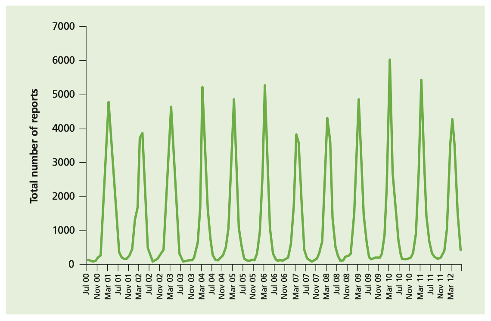
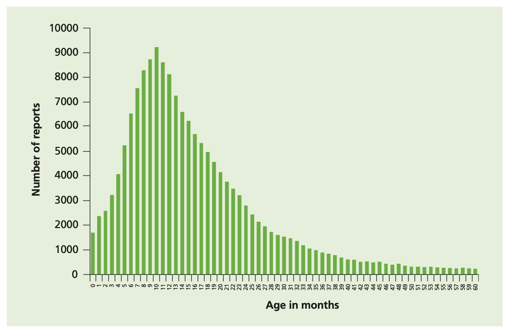
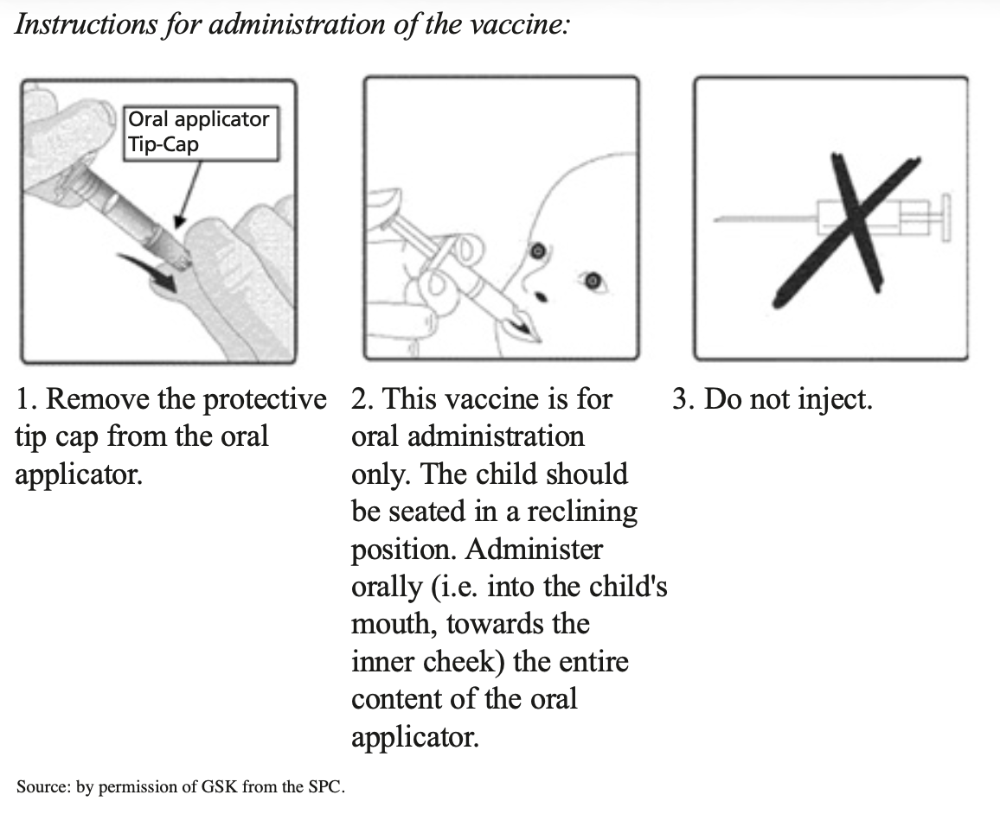

# Rotavirus

## The disease

Rotaviruses are ribonucleic acid (RNA) viruses that are contained within a protein capsule. Rotavirus strains are classified based on the outer layer proteins VP7 (G type) and VP4 (P type). Although there are at least 15 G types and 28 P types, only 10 G and 11 P types have been identified in humans (Desselberger _et al._, 2001).

Rotavirus is highly contagious. Transmission by the faecal-oral route is most frequent, although respiratory transmission may also occur (Glass _et al._, 2006). Although good hygiene measures can help prevent spread of the disease, the robustness of rotavirus and the low infectious dose (10-100 virus particles), makes standard sanitary measures to halt transmission of the virus relatively ineffective (Gray, 2011).

Rotavirus infections in humans cause gastroenteritis that usually lasts from three to eight days (Glass _et al._, 2006). Rotavirus gastroenteritis is characterised by mild fever with severe diarrhoea, vomiting, stomach cramps, and can lead to dehydration. Nearly all children will have at least one episode of rotavirus gastroenteritis before reaching five years of age. An estimated 130,000 children will visit their GP and approximately 12,700 children with rotavirus gastroenteritis will be hospitalised in England and Wales every year (Djuretic _et al._, 1999; Jit & Edmunds, 2007). Although deaths from rotavirus in the UK are rare, the numbers are difficult to quantify accurately: it has been estimated that there may be up to three to four rotavirus associated deaths a year in England and Wales (Jit _et al.,_ 2007). In developing countries, deaths from rotavirus infection are far more common with the severe diarrhoea and dehydration that results from gastroenteritis -- the main cause of rotavirus-associated deaths.

## History and epidemiology of the disease

Rotavirus infection in the UK is seasonal (see figure 1), occurring mostly in winter and early spring (January to March). People of any age can be infected by rotavirus but most infections occur in children between one month and four years of age (see figure 2). Infection in newborns is common but tends to be either mild or asymptomatic, probably because of protection by circulating maternal antibodies (Grillner _et al._, 1985; Bishop, 1994). Infections are often recurrent, and, by three years of age, many children will have experienced infection on more than one occasion (Brussow _et al._, 1988). Once someone has had a rotavirus infection they usually develop immunity, although it may be short lived (Bishop, 1994). Second and subsequent infections with a strain previously encountered are often asymptomatic; symptomatic second infections are usually associated with a different genotype.

Figure 1 Seasonal distribution of rotavirus infections - laboratory reports of all identifications by month, England and Wales, 2000-2012.

Figure 2 Confirmed rotavirus infections in children under 5 years of age, 2000-2011 England and Wales, July 2000 to June 2012 (n = 178,880) Source: Rotavirus LabBase, Health Protection Agency.

Infections in adults are rarely reported, although they are not uncommon in individuals caring for, or in contact with, children who have rotavirus gastroenteritis. Older children and adults can also develop asymptomatic infection, which may be important in maintaining rotavirus infection in the community (Hardy, 1987). Rotavirus serotypes G1P[8], G2P[4], G3P[8], G4P[8], and G9P[8] account for around 82% of all the rotavirus serotypes that are in circulation in the UK (Iturriza-Gomara _et al._, 2008a) with G1P[8] the most common circulating strain between 2010 and 2012.

The main obstacle to calculating the burden of rotavirus disease is that the symptoms of the infection are similar to those of a number of other viruses and bacteria. In addition, most cases of gastroenteritis presenting to the health service do not include laboratory confirmation of the causal organism.

Using various surveillance and diagnostic methods and techniques, it is estimated that rotavirus infections cause around half of all gastroenteritis in children aged under five years. In addition, although there has been a downward trend in the number of cases of gastroenteritis caused by bacteria and parasites in young children over the last ten years, the proportion of gastroenteritis cases due to viruses, and to rotavirus in particular, has remained stable (Iturriza-Gomara _et al._, 2008a).

Rotavirus infection may also be acquired in hospital. A third of rotavirus infections among hospitalised patients in the USA were found to have been acquired in hospital (Fischer _et al._, 2004). Several other papers have also documented the importance of rotavirus infection in hospital-acquired gastroenteritis (Chandran _et al._, 2006; Gleizes _et al._, 2006).

## The rotavirus vaccination

There are two rotavirus vaccines authorised for use by the European Medicines Agency, Rotarix (manufactured by GSK) and RotaTeq (manufactured by Sanofi Pasteur MSD). Both are highly effective at preventing rotavirus infection in infants. However, the vaccines are not known to be interchangeable and a course of vaccine started with one product should be completed with the same vaccine to achieve full protection. Neither vaccine contains thiomersal nor any adjuvant.

Rotarix is the vaccine offered as part of the UK national childhood immunisation programme. It is a live attenuated vaccine derived from a virus initially isolated from a 15-month-old child and then attenuated by serial cell culture passage (De Vos _et al._, 2004).

In clinical trials Rotarix has been shown to protect against gastroenteritis due to rotavirus serotypes G1P[8], G2P[4], G3P[8], G4P[8], and G9P[8]; some efficacy against uncommon rotavirus genotypes G8P[4] and G12P[6] has also been demonstrated. The vaccine is over 85% effective at protecting against severe rotavirus gastroenteritis in the first two years of life (Salinas _et al._, 2005; Ruiz-Palacios _et al._, 2006; Vesikari _et al._, 2006; Vesikari _et al._, 2007; Soares-Weiser K _et al_., 2012). The effectiveness of the vaccine in protecting against any rotavirus infection varies between the serotypes listed.

### Storage (see Chapter 3)

Vaccines should be stored in the original packaging at +2°C to +8°C and protected from light. All vaccines are sensitive to some extent to heat or cold. Heat speeds up the decline in potency of most vaccines, thus reducing their shelf life. Effectiveness will be reduced for vaccines unless they have been stored at the correct temperature.

Freezing may cause increased reactogenicity and loss of potency for Rotarix.

### Presentation

Rotarix vaccine is supplied as an oral suspension of clear colourless liquid in an oral applicator containing the suspension solution (1.5 ml) with a plunger, stopper and a protective tip cap.

## Dosage and schedule

### Schedule for Rotarix

- First dose of 1.5 ml of Rotarix vaccine at two months (approximately eight weeks) of age.
- Second dose of 1.5 ml at least four weeks after the first dose.

It is preferable that the full course of two doses of Rotarix be completed before 16 weeks of age, allowing at least four weeks between first and second dose. This is to provide early protection and avoid temporal association between vaccination and intussusception.

In line with recommendations from WHO, infants should only receive the first dose of Rotarix if they are younger than 15 weeks of age. Infants who receive the first dose before week 15 should receive the second dose of vaccine by 24 weeks of age. If the course is interrupted, it should be resumed but not repeated, provided that the second dose can be given before the 24 week cut-off.

Children who inadvertently receive the first dose of rotavirus vaccine at age 15 weeks or older should still receive their second dose at least four weeks later - providing that they will still be under 24 weeks of age at the time. The reason for the 15 week age limit is to minimise a potential risk of intussusception (see **Adverse reactions** below)

No specific clinical action needs to be taken if the first dose of vaccine is inadvertently given after 15 weeks and zero days of age or if the second dose is given after 24 weeks of age. For both situations, immunisers should be reminded of the age restrictions for Rotarix, even if infants are unable to start or complete the two dose schedule as a consequence of these restrictions.

### Administration

Rotarix vaccine is given orally.

**Rotavirus vaccines must not be injected.**

To administer the vaccine, carefully remove the protective tip-cap from the oral applicator. Seat the child in a reclining position and administer the entire content of the oral applicator orally (i.e. into the child's mouth, towards the inner cheek).

The Summary of Product Characteristics for Rotarix provides further guidance on administration. (http://www.medicines.org.uk/emc/medicine/17840/SPC/rotarix/)

Rotavirus vaccine can be given at the same time as the other vaccines administered as part of the routine childhood immunisation programme, including BCG, and so should ideally be given at the scheduled two month and three month vaccination visits (see above). However, rotavirus vaccine can be given at any time before or after the routine infant immunisations and at any time before or after BCG vaccine. The recommendation for administering live vaccines either at the same time or after an interval of four weeks only applies to injectable live viral vaccines and, therefore, not to BCG or to the oral rotavirus vaccines.

If the infant spits out or regurgitates most of the vaccine, a single replacement dose may be given at the same vaccination visit. There are no restrictions on an infant's consumption of food or drink before or after vaccination.

### Disposal (see Chapter 3)

Equipment used for vaccination, including used vials, ampoules, or partially discharged vaccines (oral applicator) should be disposed of at the end of a session by sealing in a proper, puncture-resistant 'sharps' box according to local authority regulations and guidance in the technical memorandum 07-01 (Department of Health, 2006).

## Recommendations for use of the vaccine

The objective of the rotavirus immunisation programme is to provide two doses of Rotarix vaccine to infants from six weeks of age and before 24 weeks of age in order to prevent severe gastroenteritis due to rotavirus.

### Infants aged under six weeks

Rotarix should not be given to infants under 6 weeks of age.

### Infants aged 6 weeks to under 15 weeks

The minimum age for the first dose of Rotarix is 6 weeks 0 days, the maximum age for the first dose is 14 weeks and 6 days.

### Infants aged 15 weeks to under 24 weeks

Vaccination with Rotarix should not be started for infants aged 15 weeks and 0 days or older. Infants who have received their first dose of vaccine under 15 weeks and 0 days of age should receive their second dose of Rotarix after a minimum interval of 4 weeks and by 23 weeks and 6 days of age.

### Infants aged 24 weeks or older

Rotarix vaccine should not be given to an infant who is 24 weeks and 0 days of age or older.

## Contraindications

Rotarix should not be given to:

- infants with a confirmed anaphylactic reaction to a previous dose of rotavirus vaccine,
- infants with a confirmed anaphylactic reaction to any components of the vaccine,
- infants with a previous history of intussusception,
- infants aged 24 weeks and zero days of age or older,
- infants with severe combined immunodeficiency (SCID) disorder,
- infants who have a malformation of the gastrointestinal tract that could predispose them to intussusception
- infants with rare hereditary problems of fructose intolerance, glucose-galactose malabsorption or sucrase-isomaltase insufficiency.

Although the vaccine is a live attenuated virus, with the exception of severe combined immune-deficiency (SCID), the benefit from vaccination may exceed any risk in other forms of immunosuppression. Therefore, there are very few infants who cannot receive rotavirus vaccine. Breast feeding and medications for gastro-oesophageal reflux are not contraindications for rotavirus vaccination. The rotavirus vaccine can also be administered before, at the same time as, or after administration of any blood product, including those containing antibody/immunoglobulin. Where there is doubt, appropriate advice should be sought from an immunisation coordinator or consultant in health protection rather than withholding vaccination.

## Precautions

Rotarix should not be given to infants under 6 weeks of age. Vaccination with Rotarix should not be started for infants aged 15 weeks and 0 days or older. Infants who have received their first dose of vaccine under 15 weeks and 0 days of age should receive their second dose of Rotarix after a minimum interval of 4 weeks and by 23 weeks and 6 days of age. Rotarix vaccine should not be given to an infant who is 24 weeks and 0 days of age or older.

Administration of rotavirus vaccine should be postponed in infants suffering from:

- acute severe febrile illness,
- acute diarrhoea or vomiting. This is to make sure that the vaccine is not regurgitated or passed through the intestines too quickly, which could reduce the effectiveness of the vaccine.

Other minor illnesses without fever or systemic upset are not valid reasons to postpone immunisation. If an individual is acutely unwell, immunisation may be postponed until they have fully recovered. This is to avoid confusing the differential diagnosis of any acute illness by wrongly attributing any signs or symptoms to the adverse effects of the vaccine.

The vaccine contains a live attenuated virus, and there is limited evidence of safety and efficacy data in infants with immunosuppression; other than severe combined immune deficiency (where the vaccine should not be offered) the vaccine may be considered.

### Premature infants

It is important that premature infants have their immunisations at the appropriate chronological age, according to the schedule. Vaccination of preterm infants using Rotarix is indicated at a chronologic age (without correction for prematurity) of at least six weeks, if the infant is clinically stable. As the benefit of vaccination is high in premature and very premature infants, vaccination should not be withheld or delayed.

### Hospitalised infants

Administration of rotavirus vaccine to hospitalised infants, including preterm infants in neonatal units, is likely to carry a low risk for transmission of the vaccine virus if standard infection control precautions are maintained. Furthermore, the rotavirus vaccine is highly attenuated and does not revert to a high virulence strain. Therefore, provided that the infant is clinically stable, vaccination should not be delayed, particularly if the delay risks being too late to give the vaccine or giving the first dose of vaccine closer to the upper age limit of 15 weeks. Similarly, if a recently vaccinated child is hospitalised for any reason, no precautions other than routine standard infection control precautions need to be taken to prevent the spread of vaccine virus in the hospital setting.

### Immunosuppression and HIV infection

Rotavirus vaccine should not be administered to infants known to have severe combined immunodeficency (SCID). There is a lack of safety and efficacy data on the administration of rotavirus vaccine to infants with other immunosuppressive disorders. Given the high risk of exposure to natural rotavirus, however, the benefits of administration is likely to outweigh any theoretical risks and therefore should be actively considered, if necessary in collaboration with the clinician dealing with child's underlying condition.

However, in a clinical study, 100 infants with HIV infection were administered Rotarix lyophilised formulation or placebo. The safety profile was similar between Rotarix and placebo recipients (Steele _et al._, 2011). Therefore, vaccination is advised in HIV infected infants. Additionally, infants with unknown HIV status but born to HIV positive mothers should be offered vaccination.

There is a potential for transmission of live attenuated vaccine in Rotarix from the infant to severely immunocompromised contacts through faecal material for at least 14 days (Anderson, 2008). However, vaccination of the infant will offer protection to household contacts from wild-type rotavirus disease and outweigh any risk from transmission of vaccine virus to any immunocompromised close contacts. Those in close contact with recently vaccinated infants should observe good personal hygiene.

## Adverse reactions

Anyone can report a suspected adverse reaction to the Commission on Human Medicines (CHM) using the Yellow Card reporting scheme (https://www.mhra.gov.uk/yellowcard).

The most common adverse reactions observed after administration of Rotarix vaccine administration are diarrhoea and irritability. Other reactions commonly reported are vomiting, abdominal pain, flatulence, skin inflammation, regurgitation of food, fever and loss of appetite. A detailed list of adverse reactions associated with Rotarix is available in the Summary of Product Characteristics for this vaccine, which is available from the European Medicines Agency website.

Intussusception is a naturally-occurring condition where the part of the intestine prolapses, or telescopes, into another part causing an obstruction. Intussusception has a background annual incidence of around 120 cases per 100,000 children aged under one year (WHO, 2002). The background risk of intussusception in the UK increases to peak at around 5 months of age (Gay N, Lancet 1999). Research from some countries suggests that Rotarix may be associated with a very small increased risk of intussusception within seven days of vaccination, possibly two cases per 100,000 first doses given, and the Rotarix prescribing information includes this as a possible side effect. The benefits of vaccination in preventing the consequences of rotavirus infection outweigh this small potential risk in young children. Because of the potential risk, and to reduce the likelihood of a temporal association with rotavirus vaccine, the first dose of vaccine should not be given after 15 weeks of age.

There is no evidence that Rotarix has a causal association with the development of Kawasaki disease (Soares-Weiser K _et al._, 2012).

## Reporting anaphylaxis and other allergic reactions

Anaphylaxis is a very rare, recognised side effect of most vaccines and suspected cases should be reported via the Yellow Card Scheme (https://www.mhra.gov.uk/yellowcard). Chapter 8 gives detailed guidance on the signs and symptoms of anaphylaxis. If a case of suspected anaphylaxis meets the clinical features described in Chapter 8, this should be reported via the Yellow Card Scheme as a case of 'anaphylaxis' (or if appropriate 'anaphylactoid reaction'). Cases of less severe allergic reactions (i.e. not including the aforementioned clinical features for anaphylaxis) should not be reported as anaphylaxis but as 'allergic reaction'.

## Supplies (see chapter 3)

- Rotarix -- manufactured by GlaxoSmithKline (Tel. 08081 009997).

In England, Rotarix should be ordered online only via the ImmForm website (https://www.gov.uk/government/collections/immform) and it is distributed by Movianto UK (Tel: 01234 248631) as part of the national childhood immunisation programme.

Centrally purchased vaccines for the national immunisation programme for the NHS can only be ordered via ImmForm. Vaccines for use for the national childhood immunisation programme are provided free of charge. Vaccines for private prescriptions, outbreaks, occupational health use or travel, are NOT provided free of charge and should be ordered from the manufacturers. Further information about ImmForm is available at http://immunisation.dh.gov.uk/immform-helpsheets/ or from the ImmForm helpdesk at helpdesk@immform.org.uk or tel: 0844 376 0040.

In Wales, supplies should be ordered through ImmForm as above. There are different storage arrangements in North and South Wales. In South Wales, vaccines are stored and distributed by health board pharmacies; in North Wales vaccines are distributed directly to GP practices.

In Scotland, supplies should be obtained from local childhood vaccine holding centres. Details of these are available from Scottish Healthcare Supplies (tel: 0131 275 6154).

In Northern Ireland, supplies of Rotarix for the national immunisation programme, are supplied via designated trust pharmacy departments. Details of these trust pharmacy departments are available from the Regional Pharmaceutical Procurement Service (tel 028 94 424346; e-mail rphps.admin@northerntrust.hscni.net)

## References

Amar CF, East CL, Gray J _et al._ (2007) Detection by PCR of eight groups of enteric pathogens in 4,627 faecal samples: re-examination of the English case-control Infectious Intestinal Disease Study (1993-1996). _Eur J Clin Microbiol Infect Dis_ **26**(5): 311-23.

Anderson EJ. Rotavirus vaccines: viral shedding and risk of transmission. _Lancet Infect Dis_. 2008 Oct; **8**(10):642-9.

Bishop RF (1994) Natural history of human rotavirus infections. In: Kapikian AZ (ed.) _Viral infections of the gastrointestinal tract_. New York: Marcel Dekker, pp. 131-67.

Brussow H, Werchau H, Liedtke W _et al._ (1988) Prevalence of antibodies to rotavirus in different age-groups of infants in Bochum, West Germany. _J Infect Dis_ **157**(5): 1014-22.

Buttery JP, Danchin MH, Lee KJ _et al.,_ Intussusception following rotavirus vaccine administration: post-marketing surveillance in the National Immunization Program in Australia. _Vaccine_. 2011 Apr 5; **29**(16):3061-6.

Chandran A, Heinzen RR, Santosham M _et al._ (2006) Nosocomial rotavirus infections: a systematic review. _J Pediatr_ **149**(4): 441-7.

De Vos B, Vesikari T, Linhares AC _et al._ (2004) A rotavirus vaccine for prophylaxis of infants against rotavirus gastroenteritis. _Pediatr Infect Dis J_ **23**(10 Suppl): S179-82.

Department of Health (2006) _Health technical memorandum 07-01: Safe management of healthcare waste_. http://www.dh.gov.uk/en/Publicationsandstatistics/Publications/PublicationsPolicyAndGuidance/DH_063274 . Accessed: July 2008.

Desselberger U, Iturriza-Gomara M and Gray JJ (2001) Rotavirus epidemiology and surveillance. _Novartis Found Symp_ **238** 125-47; discussion 147-52.

Djuretic T, Ramsay M, Gay N _et al._ (1999) An estimate of the proportion of diarrhoeal disease episodes seen by general practitioners attributable to rotavirus in children under 5 y of age in England and Wales. _Acta Paediatr Suppl_ **88**(426): 38-41.

Fischer TK, Bresee JS and Glass RI (2004) Rotavirus vaccines and the prevention of hospital-acquired diarrhea in children. _Vaccine_ **22 Suppl 1** S49-54.

Gay N, Ramsay M and Waight P (1999) Rotavirus vaccination and intussusception. The Lancet, 354, [9182]:956.Glass RI, Parashar UD, Bresee JS _et al._ (2006) Rotavirus vaccines: current prospects and future challenges. _Lancet_ **368**(9532): 323-32.

Gleizes O, Desselberger U, Tatochenko V _et al._ (2006) Nosocomial rotavirus infection in European countries: a review of the epidemiology, severity and economic burden of hospital-acquired rotavirus disease. _Pediatr Infect Dis J_ **25**(1 Suppl): S12-21.

Gray, J. Rotavirus vaccines: safety, efficacy and public health impact. _J Intern Med_ 2011;**270**: 206-214 (2011).

Grillner L, Broberger U, Chrystie I _et al._ (1985) Rotavirus infections in newborns: an epidemiological and clinical study. _Scand J Infect Dis_ **17**(4): 349-55.

Hardy DB (1987) Epidemiology of rotaviral infection in adults. _Rev Infect Dis_ **9**(3): 461-9.

Heaton PM, Goveia MG, Miller JM _et al._ (2005) Development of a pentavalent rotavirus vaccine against prevalent serotypes of rotavirus gastroenteritis. _J Infect Dis_ **192 Suppl 1** S17-21.

Iturriza-Gomara M, Elliot AJ, Dockery C _et al._ (2008a) Structured surveillance of infectious intestinal disease in pre-school children in the community: 'The Nappy Study'. _Epidemiol Infect_ 1-10.

Iturriza Gomara M, Simpson R, Perault AM _et al._ (2008b ) Structured surveillance of infantile gastroenteritis in East Anglia, UK: incidence of infection with common viral gastroenteric pathogens. _Epidemiol Infect_ **136**(1): 23-33.

Iturriza-Gómara M, Dallman T, Bányai K, Böttiger B, _et al._ (2011) Rotavirus genotypes co-circulating in Europe between 2006 and 2009 as determined by EuroRotaNet, a pan-European collaborative strain surveillance network. _J.Epidemiol Infect_. Jun; **139**(6):895-909.

Jit, M; Edmunds, WJ; (2007) Evaluating rotavirus vaccination in England and Wales. Part II. The potential cost-effectiveness of vaccination. _Vaccine_, 25 (20). pp. 3971-9.

Jit M, Pebody R, Chen M _et al._ (2007) Estimating the number of deaths with rotavirus as a cause in England and wales. _Hum Vaccin_ **3**(1): 23-6.

Omenaca F, Sarlangue J, Szenborn L _et al.,_(2012) Safety, reactogenicity and immunogenicity of the human rotavirus vaccine in preterm European Infants: a randomized phase IIIb study. _Pediatr Infect Dis J_. May;31(5):487-93.

Patel MM, López-Collada VR, Bulhões MM _et al._ Intussusception risk and health benefits of rotavirus vaccination in Mexico and Brazil. _N Engl J Med_. 2011 Jun 16; **364**(24):2283-92.

Ruiz-Palacios GM, Perez-Schael I, Velazquez FR _et al._ (2006) Safety and efficacy of an attenuated vaccine against severe rotavirus gastroenteritis. _N Engl Med_ **354**(1): 11-22.

Salinas B, Perez Schael I, Linhares AC _et al._ (2005) Evaluation of safety, immunogenicity and efficacy of an attenuated rotavirus vaccine, RIX4414: a randomized, placebo-controlled trial in Latin American infants. _Pediatr Infect Dis J_ **24**(9): 807-16.

Sanofi Pasteur MSD Limited (2008) RotaTeq: Summary of Product Characteristics. http://www.medicines.org.uk/emc/medicine/17840/SPC/rotarix/ Accessed: Jan2013.

Shui IM, Baggs J, Patel M _et al._ Risk of intussusception following administration of a pentavalent rotavirus vaccine in US infants. _JAMA_. 2012 Feb 8; **307**(6):598-604.

Soares-Weiser K, Maclehose H, Bergman H _et al._ Vaccines for preventing rotavirus diarrhoea: vaccines in use. _Cochrane Database Syst Rev_. 2012 Nov 14; **11**:CD008521

Steele AD, Madhi SA, Louw CE _et al._ Safety, Reactogenicity, and immunogenicity of human rotavirus vaccine RIX4414 in human immunodeficiency virus-positive infants in South Africa. _Pediatr Infect Dis J_. 2011 Feb; **30**(2):125-30.

Tompkins DS, Hudson MJ, Smith HR _et al._ (1999) A study of infectious intestinal disease in England: microbiological findings in cases and controls. _Commun Dis Public Health_ **2**(2): 108-13.

Velazquez, FR _et al_. Postmarketing surveillance of intussusception following mass introduction of the attenuated human rotavirus vaccine in Mexico. _Pediatr Infect Dis J_ 2012; **31**: 736-744

Vesikari T, Karvonen A, Prymula R _et al._ (2007) Efficacy of human rotavirus vaccine against rotavirus gastroenteritis during the first two years of life in European infants: randomised, double-blind controlled study. _Lancet_ **370**(9601): 1757-63.

Vesikari T, Matson DO, Dennehy P _et al._ (2006) Safety and efficacy of a pentavalent human-bovine (WC3) reassortant rotavirus vaccine. _N Engl Med_ **354**(1): 23-33.

WHO (2002) Acute intussusception in infants and children. Incidence, clinical presentation and management: a global perspective. _Vaccines and Biologicals WHO/V&B/02.19_. http://whqlibdoc.who.int/hq/2002/WHO_V&B_02.19.pdf [accessed April 2013].
