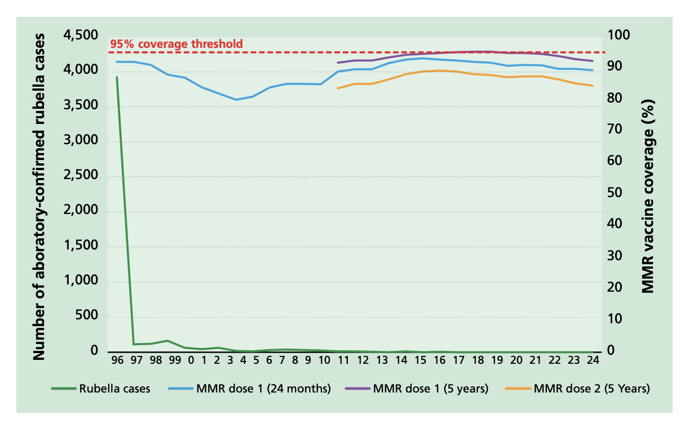

# Rubella

NOTIFIABLE

## The disease

Rubella is a mild disease caused by a togavirus. There may be a mild prodromal illness involving a low-grade fever, malaise, coryza and mild conjunctivitis. Lymphadenopathy involving post-auricular and sub-occipital glands may precede the rash. The rash is usually transitory, erythematous and mostly seen behind the ears and on the face and neck. Clinical diagnosis is unreliable as the rash may be fleeting and is not specific to rubella.

Rubella is spread by droplet transmission. The incubation period is 14 to 21 days, with the majority of individuals developing a rash 14 to 17 days after exposure. Individuals with rubella are infectious from one week before symptoms appear to four days after the onset of the rash.

In adults, arthritis and arthralgia is commonly seen after rubella infection; chronic arthritis has rarely been reported (Orenstein _et al_, 2023, Chapter 54). Other, rarer complications include thrombocytopaenia and post-infectious encephalitis (one in 6000 cases) (Orenstein _et al_, 2023, Chapter 54).

Rubella infection in pregnancy (RIP) may result in fetal loss, congenital rubella infection (CRI) or congenital rubella syndrome (CRS). Neonates born to women with confirmed rubella infection in pregnancy or where rubella infection could not be ruled out during pregnancy, should be investigated at birth for congenital infection and for features of CRS. CRS presents with one or more of the following:

- cataracts and other eye defects
- deafness
- cardiac abnormalities
- microcephaly
- retardation of intra-uterine growth
- inflammatory lesions of brain, liver, lungs and bone marrow.

Infection in the first eight to ten weeks of pregnancy results in damage in up to 90% of surviving infants; multiple defects are common. The risk of damage declines to about 10 to 20% with infection occurring between 11 and 16 weeks gestation (Miller _et al_., 1982). Fetal damage is rare with infection after 16 weeks of pregnancy, with deafness alone being reported following infections up to 20 weeks of pregnancy. Some infected infants may appear unaffected by CRS at birth, but conditions such as perceptive deafness and glaucoma may be detected later (Orenstein _et al_, 2023, Chapter 54).

## History and epidemiology of the disease

Before the introduction of rubella immunisation, rubella occurred commonly in children, and more than 80% of adults had evidence of previous rubella infection (Morgan Capner _et al._, 1988).

Rubella immunisation was introduced in the UK in 1970 for pre-pubertal girls and non-immune women of childbearing age to prevent rubella infection in pregnancy. Rather than interrupting the circulation of rubella, the aim of this strategy was to directly protect women of childbearing age by increasing the proportion with antibody to rubella; this increased from 85 to 90% before 1970 to 97 to 98% by 1987 (Vyse _et al._, 2002). Surveillance for CRS was established in 1971 to monitor the impact of the vaccination programme.

This selective rubella immunisation programme was effective in reducing the number of cases of CRS and terminations of pregnancy. In England, Scotland and Wales, reported cases of CRS declined from about 50 a year (1971 -- 1975) to just over 20 a year (1986 -- 1990). Rubella-associated terminations declined from an average of 750 a year to 50 a year in the same time periods (Tookey P, 2004). However, some cases of rubella in pregnancy continued to occur. This was mainly because the few women who remained susceptible to rubella could still acquire rubella infection from their own and/or their friends' children.

Universal immunisation against rubella, using the measles, mumps and rubella (MMR) vaccine, was introduced in October 1988. The aim of this programme was to interrupt circulation of rubella among young children, thereby protecting susceptible adult women from exposure. At the same time, rubella was made a notifiable disease. A considerable decline in rubella in young children followed the introduction of MMR, with a concomitant fall in rubella infections in pregnant women. Between 1991 and 2002, 40 CRS cases and about 60 rubella-associated terminations were reported in England and Wales. Between 2003 and 2016, these figures fell to 5 reported cases of CRS and 3 rubella-associated terminations (Bukasa _et al_ 2018).

A seroprevalence study in 1989 showed a high rate of rubella susceptibility in school-age children, particularly in males (Miller _et al._, 1991). In 1993, there was a large increase in both notifications and laboratory-confirmed cases of rubella. Many of the individuals affected would not have been eligible for MMR or for the rubella vaccine. For this reason, the combined measles-rubella (MR) vaccine was used for the schools campaign in November 1994 (see the measles chapter).

At that time, insufficient stocks of MMR were available to vaccinate all of these children against mumps. Over 8 million children aged between 5 and 16 years were immunised with the MR vaccine.

Figure 1 Number of UK laboratory-confirmed rubella cases, 1996 -- 2024; MMR dose 1 coverage at 24 months, 1996 -- 2024; and MMR dose 1 coverage at 5 years, 2009 -- 2024; and MMR dose 2 coverage at 5 years, 2009 -- 2024.

A further resurgence of rubella was observed in the UK in 1996. Many of these cases occurred in colleges and universities in men who had left school before the 1994 MR campaign (Vyse _et al_., 2002). In October 1996, a two-dose MMR schedule was introduced in the national childhood immunisation schedule and the selective vaccination programme for teenage girls ceased.

Apart from the temporary fall in MMR uptake (down to 80% nationally) in the late nineties and early 2000s, very high vaccination coverage in the routine childhood programme has achieved excellent control of rubella transmission. The World Health Organization (WHO) confirmed that the UK achieved rubella elimination in 2016 and this has been maintained. Rubella infection in pregnancy, congenital rubella infection and congenital rubella syndrome are now rare. Cases reported in the last decade have been in women not born in the UK with infections acquired abroad or due to contact with individuals visiting the UK from countries where rubella infection is not as well controlled.

As of January 2024, 175 out of 194 countries had introduced rubella vaccines and global coverage was estimated at 69%, although coverage varies greatly depending on region (WHO, 2024).

On the 1st January 2026, following the recommendation of the Joint Committee on Vaccination and Immunisation, the MMR two dose schedule was changed to 12 and 18 months of age with the aim of improving uptake. Studies in London where the second dose of MMR has been brought forward from 3 years 4 months to 18 months in response to measles outbreaks have shown that an earlier vaccination with the second dose of MMR is associated with significantly higher coverage at 5 years for this vaccine (Lacy _et al_, 2022).

In addition, due to the introduction of a varicella programme, the product offered at these ages was changed to the combined MMRV vaccine, providing protection against measles, mumps, rubella and varicella.

## The MMR and MMRV vaccines

Rubella vaccine is available as part of two combined products: measles, mumps, rubella and varicella (MMRV) and measles, mumps and rubella (MMR) vaccines. MMR or MMRV is suitable for individuals requiring protection against measles, mumps, rubella and/or varicella. MMRV is the preferred vaccine for younger children but MMR or varicella should be offered to older individuals, as appropriate, to preserve MMRV supply for those more likely to be susceptible to all four viruses.

MMR and MMRV vaccines are freeze-dried (lyophilised) preparations containing live, attenuated (weakened) strains of measles, mumps, rubella, and varicella viruses. The four attenuated virus strains are cultured separately in appropriate media and mixed before being lyophilised. Two MMRV and two MMR vaccines are available in the UK, as below.

MMRV:

- Priorix-Tetra®
- ProQuad®

MMR:

- Priorix®
- MMRVAXPRO®

MMR and MMRV vaccines do not contain thiomersal or any other preservatives. MMR and MMRV vaccines may contain trace amounts of neomycin.

MMRVAXPRO and ProQuad contain gelatine of porcine origin as a stabiliser. Priorix or Priorix-Tetra can be offered to individuals who do not accept gelatine-containing medicines or vaccines. Further information is available in the UKHSA publication 'Vaccines and porcine gelatine': https://www.gov.uk/government/publications/vaccines-and-porcine-gelatine.

All MMR and MMRV vaccines (Priorix, Priorix-Tetra, MMRVAXPRO and ProQuad) contain a source of phenylalanine. The National Society for Phenylketonuria (NSPKU) advise the amount of phenylalanine contained in vaccines is negligible and therefore strongly advise individuals with PKU to take up the offer of immunisation.

### Presentation

Rubella vaccine is only available as part of a combined product as MMR or MMRV.

**Priorix-Tetra** is supplied as a whitish to slightly pink coloured cake and the solvent is a clear colourless liquid. The vaccine should be well shaken until the powder has completely dissolved in the solvent. Upon reconstitution, the vaccine appearance may vary from a clear peach to a fuchsia pink colour, due to minor pH variations. It may contain translucent product-related particulates, which do not impair the vaccine efficacy.

**ProQuad** is supplied as a white to pale yellow compact crystalline cake and the solvent is a clear colourless liquid. The solvent and powder should be gently agitated to dissolve completely to form a clear pale yellow to light pink liquid.

**MMRVAXPRO** is supplied as a light yellow compact crystalline cake for reconstitution and the solvent is a clear colourless liquid. The reconstituted vaccine must be shaken gently to ensure thorough mixing. When completely reconstituted, the vaccine is a clear yellow liquid.

**Priorix** is supplied as a whitish to slightly pink coloured cake, a portion of which may be yellowish to slightly orange, and the solvent is a clear colourless liquid. The reconstituted vaccine must be shaken well until the powder is completely dissolved in the diluent. The reconstituted vaccine may vary in colour from clear peach to fuchsia pink.

Once reconstituted, the vaccine should only be used if it matches the relevant description above. The relevant SPC may give further details on vaccine presentation.

### Storage

Chapter 3 contains information on vaccine storage, distribution and disposal.

The summary of product characteristics (SPC) may give further detail on vaccine storage.

### Dosage and schedule

Two doses of 0.5ml of an MMR-containing vaccine at the recommended interval (see below).

### Administration

Chapter 4 covers guidance on administering vaccines.

Most injectable vaccines are routinely given intramuscularly into the deltoid muscle of the upper arm or, for infants 1 year and under, into the anterolateral aspect of the thigh.

Rubella-containing vaccines can be given at the same time as other vaccines recommended at the same visit such as DTaP/ IPV/HepB, PCV, and Men B. If MMR/MMRV cannot be given at the same time as an inactivated vaccine, it can be given at any interval before or after. The vaccines should be given at a separate site, preferably into a different limb. If given into the same limb, they should be given at least 2.5cm apart (American Academy of Pediatrics, 2021). The site at which each vaccine was given should be noted in the individual's records.

**Administration with other vaccines**

Advice on intervals between live vaccines is based upon specific evidence of interference between vaccines. Chapter 11 provides information on the recommended time intervals between MMR/MMRV and other live vaccines, as well as further information on tuberculin skin testing and MMR/MMRV vaccination.

**Administration with blood products**

When MMR and MMRV vaccines are given within three months of receiving blood products, such as immunoglobulin, the response may be reduced. This is because such blood products may contain significant levels of measles, mumps, rubella and/or varicella-specific antibody, which could then prevent vaccine virus replication. It is unlikely, however, that response to all four viruses will be completely absent after receipt of any blood product -- for example rubella vaccine response has been shown to be adequate after anti-D administration (Edgar and Hambling 1977; Black _et al_, 1983). Therefore, to reduce the risk that a deferred vaccination would be missed, and particularly where immediate measles protection is required, MMR/MMRV should still be given regardless of recent blood product receipt. To confer longer term protection, however, another dose of MMR/MMRV should be considered after three months.

### Disposal

Chapter 3 outlines storage, distribution and disposal requirements for vaccines.

Equipment used for immunisation, including used vials, ampoules, or discharged vaccines in a syringe, should be disposed of safely in a UN-approved puncture-resistant 'sharps' box, according to local waste disposal arrangements and guidance in the technical memorandum 07-01: Safe and sustainable management of healthcare waste (NHS England).

## Recommendations for the use of the vaccine

The objective of the immunisation programme is to provide two doses of MMR-containing vaccine at appropriate intervals for all eligible individuals.

A single dose of measles-containing vaccine is at least 95% effective in preventing clinical measles (Demicheli V, _et al_, 2012). After a second dose of measles-containing vaccine protection increases to well above 95% (Wichmann _et al_, 2007). A single dose of a rubella-containing vaccine confers around 95 to 100% protection against disease (Orenstein _et al_, 2023, Chapter 54). Following vaccination or natural infection, asymptomatic reinfection has been reported rarely; clinical disease has very rarely been reported (Davis _et al_, 1971; Fogel _et al._, 1978). The absence of rubella outbreaks in well-vaccinated countries indicates long-term persistence of immunity against rubella disease in vaccinated populations (Orenstein _et al_, 2023, Chapter 54; Latner _et al_., 2011). The effectiveness of a single dose of mumps Jeryl Lynn strain-containing vaccine as used in the UK, determined by field studies is approximately 72% and that of two doses is approximately 86% (Di Pietrantonj _et al._, 2021). Two doses are needed for both individual and population protection. Whilst mumps protection declines with age (Harling _et al_., 2005, Cohen _et al_ 2007), fully vaccinated cases have a much lower likelihood of suffering complications of disease (Yung _et al_, 2011).

The immune response to the MMRV vaccine after one dose demonstrates high seroconversion rates, with approximately 87.5% to 100% of children developing antibodies against measles, mumps, rubella and varicella. Following the second dose, seroconversion improves further, reaching almost 100% for measles, mumps and rubella and at least 95.8% for varicella (Cenoz _et al_, 2013). Effectiveness studies align with these findings, showing that one dose provides good protection, but two doses offer superior and durable immunity. Measles vaccine effectiveness reaches up to 95% after one dose and exceeds 96% after two doses, while varicella effectiveness improves from about 75--87% after one dose to 94--98% after two doses. These results are supported by clinical trials and immunogenicity studies worldwide (Lalwani _et al_, 2015, Di Pietrantonj _et al._ 2021).

MMR or MMRV is suitable for individuals requiring protection against measles, mumps, rubella and/or varicella. MMRV is the preferred vaccine for younger children but MMR or varicella should be offered to older individuals, as appropriate, to preserve MMRV supply for those more likely to be susceptible to all four viruses. MMRV and MMR vaccines can be given irrespective of a history of measles, mumps, rubella or varicella infection. There are no ill effects from immunising such individuals because they have pre-existing immunity that inhibits replication of the vaccine viruses.

### Young children

From the 1 January 2026, the national immunisation schedule changed to recommending that children receive two doses of MMRV vaccine at 12 and 18 months of age.

The first dose of MMRV vaccine should be given at 12 months of age (i.e. within a month of the first birthday). Immunisation before one year of age may provide earlier protection and may be beneficial when measles is circulating and there is a higher risk of infection in the first year of life, however residual maternal antibodies may interfere with the response to the vaccine. The optimal age chosen for scheduling children is therefore a compromise between risk of infection and optimal response to vaccine.

If a dose of MMR or MMRV is given before the first birthday, either because of travel to an endemic country, or because of a local outbreak, then this dose should be ignored, and two further doses given at the recommended times at 12 months of age (i.e. within a month of the first birthday) and at 18 months of age (see Chapter 11).

The second dose of MMRV vaccine is given at 18 months of age, but if needed can be given at any time from three months after the first dose. Allowing three months between doses is likely to maximise the response rate, particularly in young children under the age of 18 months where maternal antibodies may still be present and interfere with the response to vaccination (Orenstein _et al._, 1986; Redd _et al_., 2004; de Serres _et al._, 1995). Where protection against rubella is urgently required, the second dose can be given one month after the first (ACIP, 1998). If the child is given the second dose less than three months after the first dose and at less than 18 months of age, then the routine 18-month dose (which would constitute a third dose in this case) should be given in order to ensure full protection.

It is vital that, by the age of 3 years 4 months, every child has received two doses of an MMR-containing vaccine (either MMR or MMRV). Children born on or before the 31 December 2019 will have followed the previous two dose MMR vaccination schedule at 12 months and 3 years 4 months of age and will not be eligible to receive MMRV vaccination through the national vaccination programme or catch-up campaign. More details on MMRV vaccination eligibility by date of birth are set out in the relevant advice from the NHS in each country.

### Older children and adults

All children should have received two doses of MMR-containing vaccine (either MMR or MMRV) by the age of 3 years and 4 months. MMR vaccine should be used for catching up children or adults who have not received two-doses of MMR and are not eligible for varicella vaccination (see above for details about MMRV eligibility). However if MMRV, rather than MMR, is the only vaccine available at the clinic at the time of the offer of opportunistic catch-up then that vaccine can be used.

The teenage booster session or appointment around 14 years of age is an opportunity to ensure that unimmunised or partially immunised children are given MMR. If two doses of MMR are required, then the second dose should be given one month after the first.

MMR vaccine can be given to individuals of any age and should be offered opportunistically and promoted to unvaccinated or partially vaccinated younger adults -- particularly those born before 1990. New GP registration, entry into college, university or other higher education institutions, prison or military service provides an opportunity to check an individual's immunisation history. Those who have not received MMR should be offered appropriate MMR immunisation.

Since the cessation of antibody screening for rubella in pregnancy, it remains important to encourage MMR vaccination for women of child-bearing age -- for example at opportunities such as family planning consultations. In addition, MMR vaccination status should be checked at ante-natal clinic appointments and unvaccinated or partially vaccinated pregnant women should be offered missing doses post-partum, for example at the post-natal check or if they accompany their infant to their routine immunisations. If two doses of MMR are required, then the second dose should be given one month after the first.

The decision on when to vaccinate other adults needs to take into consideration the past vaccination history, the likelihood of an individual remaining susceptible and the future risk of exposure and disease:

- individuals who were born between 1980 and 1990 may not be protected against mumps but are likely to be vaccinated against measles and rubella. They may never have received a mumps-containing vaccine or had only one dose of MMR, and had limited opportunity for exposure to natural mumps. They should be caught up opportunistically with one or two doses of the MMR vaccine, given at least one month apart
- individuals born between 1970 and 1979 may have been vaccinated against measles and many will have been exposed to mumps and rubella during childhood. However, this age group should be offered MMR wherever feasible, particularly if they are considered to be at high risk of exposure. Where such adults are being vaccinated because they have been demonstrated to be susceptible to at least one of the vaccine components, then either two doses should be given, or there should be evidence of seroconversion to the relevant antigen
- individuals born before 1970 are likely to have had all three natural infections and are less likely to be susceptible. MMR vaccine should be offered to such individuals on request or if they are considered to be at high risk of exposure. Where such adults are being vaccinated because they have been demonstrated to be susceptible to at least one of the vaccine components, then either two doses should be given or there should be evidence of seroconversion to the relevant antigen

### Individuals with unknown or incomplete vaccination histories

Where a child born in the UK presents with an uncertain immunisation history, every effort should be made to clarify what immunisations they may have had (see Chapter 11).

Children coming to the UK who have a history of completing immunisation in their country of origin may not have been offered protection against all the antigens currently used in the UK. Immunisation schedules for specific countries can be found on the World Health Organization website.

Individuals coming from areas of conflict or from population groups who may have been marginalised in their country of origin (e.g. refugees, Gypsy or other nomadic travellers) may not have had good access to immunisation services. In particular, older children and adults may also have been raised during periods before immunisation services were well developed or when vaccine quality was sub-optimal. Where there is no reliable history of previous immunisation, it should be assumed that any undocumented doses are missing and the UK catch-up recommendations for that age should be followed (see Chapter 11). The routine boosters should be given according to the UK schedule.

Further guidance on vaccination of individuals with uncertain or incomplete immunisation is published by UKHSA in Chapter 11 of the Green Book and at the following link: https://www.gov.uk/government/publications/vaccination-of-individuals-with-uncertain-or-incomplete-immunisation-status/

### Healthcare workers

Protection of healthcare workers is especially important in the context of their ability to transmit rubella to vulnerable groups. While they may need MMR vaccination for their own benefit, on the grounds outlined above, they also should be immune to measles and rubella for the protection of their patients.

Satisfactory evidence of protection from rubella would include documentation of:

- having received two doses of an MMR-containing vaccine, or
- positive antibody tests for rubella.

### Individuals who are travelling or going to reside abroad

All travellers to epidemic or endemic areas should ensure that they are fully immunised according to the UK schedule (see above).

### Antibody testing

Women planning pregnancy or undergoing fertility treatment should be up to date with their routine vaccinations, including MMR. Women should have received 2 documented doses of rubella-containing vaccine. All those without such evidence should be offered MMR vaccination before pregnancy. There is no requirement for rubella antibody levels to be tested or to be over 10IU/ml.

Universal antenatal rubella antibody screening of all pregnant women is no longer recommended and was stopped in April 2016. Instead, rubella immunity should be established at booking by checking for documented evidence of 2 doses of a rubella-containing vaccine. All those without such evidence should be offered MMR vaccination post-partum.

Routine screening was stopped because most assays used are not sensitive enough to pick up antibodies in women who acquired rubella immunity through vaccination. However, seronegative women (this is defined as women with no rubella antibody detected) with a history of vaccination will still have sufficient antibodies present to be protective in the event of an exposure.

If an individual has inadvertently been tested, despite having two documented doses of MMR vaccine, and the lab result indicates an IgG negative response for rubella or measles, a single further dose of MMR vaccine may be administered. Although this dose may be unnecessary, it should provide reassurance for the individual. If they are protected from their previous documented doses of MMR vaccine, this additional dose will be neutralised by their immune system.

The third dose should be administered with a minimum interval of four weeks from the previous dose and at least one month before pregnancy. Further testing after this third dose is not recommended.

## Contraindications

Chapter 6 contains information on contraindications and special considerations for vaccination.

There are very few individuals who cannot receive MMRV or MMR vaccines. When there is doubt, appropriate advice should be sought from the relevant specialist consultant, the local screening and immunisation team or local Health Protection Team rather than withholding vaccine. The risk to the individual of not being immunised must be taken into account. The vaccines should not be given to:

- those who are immunosuppressed (see Chapter 6 for more detail)
- those who have had a confirmed anaphylactic reaction to a previous dose of a measles-, mumps-, rubella- or varicella-containing vaccine
- those who have had a confirmed anaphylactic reaction to any component or residue from the manufacturing process (including neomycin or gelatin)
- pregnant women.

Specific advice on management of individuals who have had an allergic reaction can be found in Chapter 8.

Anaphylaxis after MMR/MMRV is extremely rare (5.14 to 19.84 per million doses) (McNeil _et al_, 2016). Minor allergic conditions may occur and are not contraindications to further immunisation with MMRV, MMR or other vaccines. A careful history of that event will often distinguish between anaphylaxis and other events that are either not due to the vaccine or are not life-threatening. In the latter circumstances, it may be possible to continue the immunisation course. Specialist advice must be sought on the vaccines and circumstances in which they could be given. The lifelong risk to the individual of not being immunised must be taken into account.

## Precautions

Chapter 6 contains information on contraindications and special considerations for vaccination.

Minor illnesses without fever or systemic upset are not valid reasons to postpone immunisation. If an individual is acutely unwell, immunisation should be postponed until they have fully recovered. This is to avoid confusing the differential diagnosis of any acute illness by wrongly attributing any sign or symptoms to the adverse effects of the vaccine.

Individuals who have had a systemic or local reaction following a previous immunisation with MMR/MMRV can continue to receive subsequent doses of MMR/MMRV vaccine.

Chapter 8 covers vaccine safety and the management of adverse events following immunisation.

Children with chronic conditions such as cystic fibrosis, congenital heart or kidney disease, failure to thrive or Down's syndrome are at particular risk from measles infection. It is particularly important that children in these groups are vaccinated if they have no other contraindications for vaccination.

### Idiopathic thrombocytopaenic purpura

Idiopathic thrombocytopaenic purpura (ITP) has occurred rarely following MMR/MMRV vaccination, usually within six weeks of the first dose. The risk of developing ITP after MMR/MMRV vaccine is much less than the risk of developing it after infection with wild measles or rubella virus.

If ITP has occurred within six weeks of the first dose of MMR/MMRV, then blood should be taken and tested for measles antibodies before a second dose is given. Serum should be sent to the UKHSA Virus Reference Laboratory, which offers free, specialised serological testing for such children. If the results suggest a lack of protection against measles, then a second dose of MMRV is recommended. Serological testing for the mumps, rubella, and varicella components is not recommended.

### Allergy to egg

All children with egg allergy should receive the MMRV vaccination as a routine procedure in primary care (Clark _et al.,_ 2010). Data suggest that anaphylactic reactions to MMR vaccine are not associated with hypersensitivity to egg antigens but to other components of the vaccine (such as gelatin) (Fox and Lack, 2003). In three large studies with a combined total of over 1000 patients with egg allergy, no severe cardiorespiratory reactions were reported after MMR vaccination (Fasano _et al.,_ 1992; Freigang _et al.,_ 1994; Aickin _et al.,_ 1994; Khakoo and Lack, 2000). Children who have had documented anaphylaxis to the vaccine itself should be assessed by an allergist (Clark _et al.,_ 2010).

### Pregnancy and breast-feeding

There is no evidence that rubella-containing vaccines are teratogenic.

In the USA, UK and Germany, 661 women were followed through active surveillance, including 293 who were vaccinated (mainly with single rubella vaccine) in the high-risk period (i.e. the six weeks after the last menstrual period). Only 16 infants had evidence of infection and none had permanent abnormalities compatible with CRS (Best _et al._, 2004).

However, as a precaution, MMR/ MMRV vaccine should not be given in pregnancy. Pregnancy should be avoided for one month following the last dose.

There are no safety concerns, either for the mother or the baby, when MMR-containing vaccine is given in pregnancy or shortly prior to pregnancy. Those who have been immunised with MMR or MMRV in pregnancy can be reassured (see "MMR vaccine: advice for pregnant women"). Such an incident would not be a reason to recommend termination of pregnancy (Tookey _et al_., 1991).

If a pregnant individual develops a generalised vesicular (varicella-like) rash following MMRV vaccination, they should be clinically reviewed for consideration of antivirals. Local injection site reactions are common and do not require any specific follow up.

UKHSA monitors women who have inadvertently received varicella-containing vaccine such as MMRV up to 3 months before pregnancy or at any time during pregnancy, as well as women who have inadvertently received MMR vaccine up to 30 days before pregnancy or at any time during pregnancy. Women who have been immunised with MMR or MMRV in pregnancy should be reported to the UKHSA Vaccine in Pregnancy Surveillance: https://www.gov.uk/guidance/vaccination-in-pregnancy-vip#notify-ukhsa.

Pregnant women who are found to be susceptible to rubella should be immunised with MMR after delivery.

Breast-feeding is not a contraindication to MMR/MMRV immunisation, and MMR/MMRV vaccine can be given to breast-feeding mothers without any risk to their baby. Very occasionally, rubella vaccine virus has been found in breast milk, but this has not caused any symptoms in the baby (Buimovici-Klein _et al.,_ 1997; Landes _et al_., 1980; Losonsky _et al_., 1982). The vaccine does not work when taken orally. There is no evidence of mumps, measles or varicella vaccine viruses being found in breast milk in mothers vaccinated postpartum.

For advice regarding suitability of MMR/MMRV for a breastfed child whose mother is taking biological treatments, please see Chapter 6.

### Premature infants

It is important that premature infants have their immunisations at the appropriate chronological age, according to the schedule (see Chapter 11).

### Immunosuppression and HIV

MMR vaccine is not recommended for patients with severe immunosuppression (see Chapter 6) (Angel _et al._, 1996). MMR/MMRV vaccine can be given to individuals living with HIV without or with moderate immunosuppression (as defined in Table 1).

Table 1 CD4 count/ul (% of total lymphocytes)

| Age            | <12 months   | 1--5 years      | 6--12 years | >12 years   |
| -------------- | ------------ | --------------- | ----------- | ----------- |
| No suppression | >1500 (>25%) | >1000 (15--24%) | >500 (>25%) | >500 (>25%) |
| Moderate       | 750--1499    | 500--999        | 200--499    | 200--499    |
| suppression    | (15--24%)    | (15--24%)       | (15--24%)   | (15--24%)   |
| Severe         | <750         | <500            | <200        | <200        |
| suppression    | (<15%)       | (<15%)          | (<15%)      | (<15%)      |

Wherever possible, immunisation of immunosuppressed or HIV-positive individuals should be either carried out before immunosuppression occurs or deferred until an improvement in immunity has been seen. Chapter 7 contains more information on immunisation of individuals with underlying medical conditions, including immunosuppression.

Further guidance is provided by the British HIV Association (BHIVA) _BHIVA guidelines on the use of vaccines in HIV-positive adults (2015)_: https://www.bhiva.org/vaccination-guidelines and the Children's HIV Association of UK and Ireland CHIVA Guidelines on Vaccination of Children Living with HIV (2022): https://www.chiva.org.uk/infoprofessionals/guidelines/immunisation/.

For guidance on MMRV vaccination, please follow guidance for MMR and varicella vaccination outlined in these documents.

### Neurological conditions

The presence, or a history of a neurological condition is not a contraindication to immunisation but if there is evidence of current neurological deterioration, deferral of vaccination may be considered, to avoid incorrect attribution of any change in the underlying condition. The risk of such deferral should be balanced against the risk of the preventable infection, and vaccination should be promptly given once the diagnosis and/or the expected course of the condition becomes clear.

There will be very few occasions when deferral of immunisation is required. Deferral leaves the child unprotected and so the period of deferral should be minimised, with immunisation commencing as soon as possible. If a specialist recommends deferral, this should be clearly communicated to the individual's primary care provider and he or she must be informed as soon as the child is fit for immunisation.

Children with a personal or close family history of seizures should be given MMR/MMRV vaccine. Further information about likely timing of any fever and management of a fever should be given. Vaccinators should seek specialist paediatric advice rather than unnecessarily withhold immunisation.

## Adverse reactions

Many studies conducted worldwide have found MMR and MMRV vaccines to be well tolerated and rarely associated with serious adverse events.

Adverse reactions following the MMR/MMRV vaccines (except allergic reactions) are due to effective replication of the vaccine viruses with subsequent mild illness. Such events are to be expected in some individuals. Events due to the measles component occur six to 11 days after vaccination. Events due to the mumps and rubella components usually occur two to three weeks after vaccination but may occur up to six weeks after vaccination. Events due to the varicella component usually occur within a month of vaccination with MMRV. These events only occur in individuals who are susceptible to that component, and are therefore less common after second and subsequent doses.

Following MMR/MMRV, individuals may develop a measles-like rash. They can be reassured that they are not infectious for measles. However, they should be reviewed by a clinician and recent exposure should be considered. Some individuals may develop a varicella-like rash around the site of the injection. This should not prevent them from attending childcare or educational settings, but it should be kept covered as a precaution. Transmission of varicella vaccine virus from immunocompetent vaccinees to susceptible close contacts has occasionally been documented but the risk is very low. For more details on varicella vaccine associated rash, please see the varicella chapter.

### Common events

Common reactions following MMR and MMRV vaccination include fever, rash and injection site reactions including pain, swelling and erythema. These reactions appear most commonly about a week after immunisation, and last about two to three days.

Vomiting and diarrhoea can also be seen following MMRV vaccination. Upper respiratory tract infection can be seen following MMR vaccination.

Adverse reactions are considerably less common after a second dose of MMR vaccine than after the first dose. Overall rates of adverse reactions after a second MMRV dose are similar to or lower than seen after a first dose and are comparable to those who received separate varicella (Oka/Merck) and MMR vaccine.

### Rare and more serious events

Febrile seizures are the most commonly reported neurological event following MMR/MMRV vaccination, with febrile seizures occurring more commonly following the first dose of vaccine than the second. Simple febrile seizures are generalised, short-lived and generally considered benign with excellent neurological prognosis.

The rate of febrile seizures following MMR vaccination is lower than that following infection with measles disease. It is estimated that following MMRV vaccination, 96 cases of febrile convulsions occur in every 100,000 children. This is in contrast to 2,300 cases in every 100,000 children following measles infection, and 4,000 cases in 100,000 children in the overall paediatric population (Casabona _et al_., 2023). There is good evidence that febrile seizures following MMR immunisation do not increase the risk of subsequent epilepsy compared with febrile seizures due to other causes (Vestergaard _et al_., 2004).

Febrile seizures are reported more commonly following administration of the first dose of MMRV vaccine than MMR, or co-administered MMR and varicella, vaccine (Orenstein _et al_, 2023, Chapter 38). Several studies have reported an approximately two-fold increased relative risk of febrile seizures within 5 to 12 or 7 to 10 days after the administration of the first MMRV dose of the two-dose vaccination schedule in infants compared with the separate administration of MMR and varicella vaccine during the same medical visit. However, the absolute risk of febrile seizures remains very low. The elevated risk following the first dose of MMRV has not be observed when using the combination vaccine as a second dose. Having taken into account the above information, the JCVI advised the use of the combination MMRV vaccine in the national programme rather than separate MMR and varicella vaccination. A study of parental acceptance of varicella vaccination in the UK (Sherman _et al_, 2023) showed that a combined vaccination was preferred over an additional injection at the same immunisation visit, reflecting previous experience that parents prefer fewer injections for their children.

Because MMR vaccine contains live, attenuated viruses, it is biologically plausible that it may cause encephalitis. A large record-linkage study in Finland looking at over half a million children aged between one and seven years did not identify any association between MMR and encephalitis (Makela _et al._, 2002).

Idiopathic thrombocytopaenic purpura (ITP) may occur following MMR/MMRV vaccination and is most likely due to the rubella component. This usually occurs within six weeks and resolves spontaneously. ITP occurs in about one in 22,300 children who are given a first dose of MMR in the second year of life (Miller _et al_., 2001). The risk of developing ITP after MMR/MMRV vaccination is much less than the risk of developing it after infection with wild measles or rubella virus. Please see above, under 'Contraindications', for guidance on further vaccination following ITP.

Arthropathy (arthralgia or arthritis) has also been reported to occur rarely after MMR immunisation, probably due to the rubella component. If it is caused by the vaccine, it should occur between 14 and 21 days after immunisation. Where it occurs at other times, it is highly unlikely to have been caused by vaccination. Several controlled epidemiological studies have shown no excess risk of chronic arthritis in women (Slater, 1997).

Anyone can report a suspected adverse reaction to the Medical and Healthcare products Regulatory Agency (MHRA) using the Yellow Card reporting scheme (https://yellowcard.mhra.gov.uk/). All suspected adverse reactions to vaccines occurring in children, or in individuals of any age after vaccination with vaccines labelled with a black triangle (▼), should be reported to the MHRA using the Yellow Card scheme. Serious suspected adverse reactions to vaccines in adults should be reported through the Yellow Card scheme.

### Other conditions not causally linked to rubella-containing vaccines

There is no causal link between MMR or MMRV vaccination and Guillain-Barré syndrome (GBS). In a population that received 900,000 doses of MMR, there was no increased risk of GBS at any time after the vaccinations were administered (Patja _et al_., 2001). Other robust epidemiological studies have also not demonstrated a link between MMR vaccination and GBS (Haber _et al_., 2009).

In the past, a link between measles vaccine and bowel disease has been postulated and dismissed by evidence. There was no increase in the incidence of inflammatory bowel disorders in those vaccinated with measles-containing vaccines compared with controls (Gilat _et al_., 1987; Feeney _et al_., 1997). No increase in the incidence of inflammatory bowel disease has been observed since the introduction of MMR vaccination in Finland (Pebody _et al_., 1998) or in the UK (Seagroatt, 2005).

There is overwhelming evidence that MMR does not cause autism (http://www.ncbi.nlm.nih.gov/books/NBK25344/). A large number of studies have been published looking at this issue. Such studies have shown:

- no increased risk of autism in children vaccinated with MMR compared with unvaccinated children (Farrington _et al_., 2001; Madsen and Vestergaard, 2004)
- no clustering of the onset of symptoms of autism in the period following MMR vaccination (Taylor _et al_., 1999; De Wilde _et al_., 2001; Makela _et al_., 2002)
- that the increase in the reported incidence of autism preceded the use of MMR in the UK (Taylor _et al_., 1999)
- that the incidence of autism continued to rise after 1993, despite the withdrawal of MMR in Japan (Honda _et al_., 2005)
- that there is no correlation between the rate of autism and MMR vaccine coverage in either the UK or the USA (Kaye _et al_., 2001; Dales _et al_., 2001)
- no difference between the proportion of children developing autism after MMR who have a regressive form compared with those who develop autism without vaccination (Fombonne, 2001; Taylor _et al_., 2002; Gillberg and Heijbel, 1998)
- no difference between the proportion of children developing autism after MMR who have associated bowel symptoms compared with those who develop autism without vaccination (Fombonne, 2001; Fombonne, 1998; Taylor _et al_., 2002)
- that no vaccine virus can be detected in children with autism using the most sensitive methods available (Afzal _et al_., 2006; D'Souza _et al_., 2006).
- that no evidence of a link between vaccines and autism was detected in a recent meta-analysis of case-control and cohort studies (Taylor _et al_., 2014)

It was previously suggested that combined MMR vaccine could potentially overload the immune system. From the moment of birth, humans are exposed to countless numbers of foreign antigens and infectious agents in their everyday environment. Responding to the three or four viruses in MMR or MMRV respectively would use only a tiny proportion of the total capacity of an infant's immune. The viruses in MMR/MMRV replicate at different rates from each other and would be expected to reach peak levels at different times.

A study examining the issue of immunological overload found a lower rate of admission for serious bacterial infection in the period shortly after MMR vaccination compared with other time periods. This suggests that MMR does not cause any general suppression of the immune system (Andrews _et al_, 2019).

## Management of rubella cases and contacts

### Diagnosis

The UKHSA 'Guidance on the investigation, diagnosis and management of viral illness (plus syphilis), or exposure to viral rash illness, in pregnancy.' outlines how every suspected case of RIP, CRI and CRS should be investigated and followed up.

Suspected rubella cases including RIP, CRI and CRS should be reported to the local UKHSA health protection team (HPT) promptly so that they can support clinicians with a risk assessment and provide advice on the investigations and public health actions as appropriate. Notification should be based on clinical suspicion and should not await laboratory confirmation.

The UK eliminated rubella in 2016 so confirmed cases are now rare. Testing of rash illness where rubella is part of a differential diagnosis is essential to ensure cases are not missed. Post-elimination, excluding rubella infection, using an appropriate test, is just as important as confirming it. Suspected rubella cases will be sent an Oral Fluid Kit by the HPT.

Local rubella IgM positive results should be discussed with the HPT and interpreted in the context of the vaccination, clinical and travel history. The HPT should contact UKHSA Colindale for advice on confirmatory testing.

### Protection of rubella contacts with MMR/MMRV vaccination

There is no role for MMR/MMRV vaccine as post-exposure prophylaxis for rubella, as antibody response to the rubella component of MMR/MMRV vaccine does not develop soon enough to provide effective prophylaxis after exposure. However, the vaccine can provide protection against future exposure. Therefore, contact with suspected measles, mumps or rubella provides a good opportunity to offer MMR or MMRV vaccine to previously unvaccinated individuals. If the individual is already incubating measles, mumps, rubella or varicella, MMR or MMRV vaccination will not exacerbate the symptoms. In these circumstances, individuals should be advised that a rubella-like illness occurring shortly after vaccination is likely to be due to natural infection. Oral fluid testing and detection of viral nucleic acid can distinguish between vaccine or natural infection. If there is doubt about an individual's vaccination status, MMR/MMRV vaccine should still be given as there are no ill effects from vaccinating those who are already immune.

### Protection of rubella contacts with immunoglobulin

Human normal immunoglobulin is not routinely used for post-exposure protection from rubella since there is no evidence that it is effective. It is **not** recommended for the protection of pregnant women exposed to rubella, IVIG may be considered on a case by case basis. For further advice on the management of pregnant women who have had contact with rubella please go to 'Guidance on the investigation, diagnosis and management of viral illness (plus syphilis), or exposure to viral rash illness, in pregnancy'

## Supplies

Some or all of the following vaccines containing inactivated mumps virus will be available at any one time:

- Priorix-Tetra, measles, mumps, rubella and varicella -- manufactured by GSK.
- ProQuad, measles, mumps, rubella and varicella -- manufactured by MSD UK.
- MMRVAXPRO, measles, mumps, and rubella -- manufactured by MSD UK.
- Priorix, measles, mumps, and rubella -- manufactured by GSK.

In England and Wales, centrally purchased vaccines for the NHS as part of the national immunisation programme can only be ordered via ImmForm (https://portal.immform.ukhsa.gov.uk, telephone number: 0207 183 8580). Vaccines for use as part of the national immunisation programme are provided free of charge.

In Scotland, supplies should be obtained from local vaccine holding centres. Details of these are available from Public Health Scotland by emailing phs.immunisation@phs.scot.

In Northern Ireland, supplies should be obtained from local childhood vaccine holding centres. Details of these are available from the regional pharmaceutical procurement service (Tel: 028 9442 4089).

### Human normal and intravenous immunoglobulin

**England and Wales:**
UK Health Security Agency, Rabies and Immunoglobulin Service (0330 128 1020), after an appropriate risk assessment.

**Scotland:**
In Scotland, applications for supply should go through local hospital pharmacy teams.

**Northern Ireland:**
Northern Ireland: Public Health Laboratory, Belfast City Hospital (Tel: 028 9032 9241)

## References

ACIP (1998) Measles, mumps, and rubella -- vaccine use and strategies for elimination of measles, rubella, and congenital rubella syndrome and control of mumps: recommendations of the Advisory Committee on Immunization Practices (ACIP). _MMWR_ **47**(RR-8): 1-57. https://www.cdc.gov/mmwr/preview/mmwrhtml/00053391.htm.

Afzal MA, Ozoemena LC, O'Hare A _et al_. (2006) Absence of detectable measles virus genome sequence in blood of autistic children who have had their MMR vaccination during the routine childhood immunisation schedule of the UK. _J Med Virol_ **78**: 623-30.

Aickin R, Hill D and Kemp A (1994) Measles immunisation in children with allergy to egg. _BMJ_ **308**: 223-5.

American Academy of Pediatrics (2021) Active immunization. In: Kimberlin DW, Barnett ED, Lynfield R, Sawyer MH, eds. Red Book: 2021 Report of the Committee on Infectious Diseases. 32nd edition. Itasca, IL.

Andrews N, Stowe J, Thomas SL, Walker JL, Miller E. The risk of non-specific hospitalised infections following MMR vaccination given with and without inactivated vaccines in the second year of life. Comparative self-controlled case-series study in England. Vaccine. 2019 Aug 23;37(36):5211-7.

Angel JB, Udem SA, Snydman DR _et al._ (1996) Measles pneumonitis following measles- mumps-rubella vaccination of patients with HIV infection, 1993. _MMWR_ **45**: 603-6.

Best JM, Cooray S and Banatvala JE (2004) Rubella. In: Mahy BMJ and ter Meulen V (eds) _Topley and Wilson's Virology_, 10th edition. London: Hodder Arnold.

Black NA, Parsons A, Kurtz JB _et al_. (1983) Post-partum rubella immunisation: a controlled trial of two vaccines. _Lancet_ **2**(8357): 990-2.

British HIV Association (2015) Immunisation guidelines for HIV-infected adults. Available from: https://www.bhiva.org/vaccination-guidelines.

Brown DW, Ramsay ME, Richards AF and Miller E (1994) Salivary diagnosis of measles: a study of notified cases in the United Kingdom, 1991-3. _BMJ_ **308**(6935): 1015-17.

Buimovici-Klein E, Hite RL, Byrne T and Cooper LR (1997) Isolation of rubella virus in milk after postpartum immunization. _J Pediatr_ **91**: 939-43.

Bukasa A, Campbell H, Brown K, Bedford H, Ramsay M, Amirthalingam G, Tookey P. Rubella infection in pregnancy and congenital rubella in United Kingdom, 2003 to 2016. Eurosurveillance. 2018 May 10;23(19):17-00381.

Casabona G, Berton O, Singh T, Knuf M, Bonanni P. Combined measles-mumps-rubella-varicella vaccine and febrile convulsions: the risk considered in the broad context. Expert Review of Vaccines. 2023 Dec 31;22(1):764-76.

Cenoz MG, Martínez-Artola V, Guevara M, Ezpeleta C, Barricarte A, Castilla J. Effectiveness of one and two doses of varicella vaccine in preventing laboratory-confirmed cases in children in Navarre, Spain. Human vaccines & immunotherapeutics. 2013 May 14;9(5):1172-6.

Children's HIV Association (CHIVA) Immunisation guidelines (2022). Available from: https://www.chiva.org.uk/infoprofessionals/guidelines/immunisation/

Clark AT, Skypala I, Leech SC, _et al._ (2010). British Society for Allergy and Clinical Immunology guidelines for the management of egg allergy. _Clin Exp Allergy_ **40**(8):1116- 29.

Cohen C, White JM, Savage EJ, Glynn JR, Choi Y, Andrews N, Brown D, Ramsay ME. Vaccine effectiveness estimates, 2004-2005 mumps outbreak, England. Emerging infectious diseases. 2007 Jan;13(1):12.

Dales L, Hammer SJ and Smith NJ (2001) Time trends in autism and in MMR immunization coverage in California. _JAMA_ **285**(22): 2852-3.

Davis WJ, Larson HE, Simsarian JP, _et al_. A study of rubella immunity and resistance to infection. JAMA. 1971;**215**:600-608.

Demicheli, V _et al._ (2012), 'Vaccines for measles, mumps and rubella in children', Cochrane Database of Systematic Reviews, 2012(2), Art. No.: CD004407.

de Serres G, Boulianne N, Meyer F and Ward BJ (1995) Measles vaccine efficacy during an outbreak in a highly vaccinated population: incremental increase in protection with age at vaccination up to 18 months. _Epidemiol Infect_ **115**: 315-23.

De Wilde S, Carey IM, Richards N _et al._ (2001) Do children who become autistic consult more often after MMR vaccination? _Br J General Practice_ **51**: 226-7.

Di Pietrantonj C, Rivetti A, Marchione P, Debalini MG, Demicheli V. Vaccines for measles, mumps, rubella, and varicella in children. Cochrane Database of Systematic Reviews 2021, Issue 11. Art. No.: CD004407. DOI: 10.1002/14651858.CD004407.pub5.

D'Souza RM, Campbell-Lloyd S, Isaacs D _et al_. (2000) Adverse events following immunisation associated with the 1998 Australian Measles Control Campaign. _Commun Dis Intell_ **24**: 27-33.

Edgar WM and Hambling MH (1977) Rubella vaccination and anti-D immunoglobulin administration in the puerperium. _Br J Obstet Gynaecol_ **84**(10): 754-7.

Farrington CP, Miller E and Taylor B (2001) MMR and autism: further evidence against a causal association. _Vaccine_ **19**: 3632-5.

Fasano MB, Wood RA, Cooke SK and Sampson HA (1992) Egg hypersensitivity and adverse reactions to measles, mumps and rubella vaccine. _J Pediatr_ **120**: 878-81.

Feeney M, Gregg A, Winwood P and Snook J (1997) A case-control study of measles vaccination and inflammatory bowel disease. The East Dorset Gastroenterology Group. _Lancet_ **350**: 764-6.

Fogel A, Gerichter CB, Barena B, _et al_. Response to experimental challenges in persons immunized with different rubella vaccines. J Pediatr. 1978; **92**:26-29.

Fombonne E (1998) Inflammatory bowel disease and autism. _Lancet_ **351**: 955. Fombonne E (2001) Is there an epidemic of autism? _Pediatrics_ **107**: 411-12.

Fox A and Lack G (2003) Egg allergy and MMR vaccination. _Br J Gen Pract_ **53**(495): 801-2.

Freigang B, Jadavji TP and Freigang DW (1994) Lack of adverse reactions to measles, mumps and rubella vaccine in egg-allergic children. _Ann Allergy_ **73**: 486-8.

Gilat T, Hacohen D, Lilos P and Langman MJ (1987) Childhood factors in ulcerative colitis and Crohn's disease. An international co-opreative study. _Scan J Gastroenterology_ **22**: 1009-24.

Gillberg C and Heijbel H (1998) MMR and autism. _Autism_ **2**: 423-4.

Haber P, Sejvar J, Mikaeloff Y, DeStefano F. Vaccines and guillain-barre syndrome. Drug safety. 2009 Apr;32(4):309-23.

Harling R, White JM, Ramsay ME _et al._ (2005) The effectiveness of the mumps component of the MMR vaccine: a case control study. _Vaccine_ **23**(31): 4070-4.

Honda H, Shimizu J and Rutter M (2005) No effect of MMR withdrawal on the incidence of autism: a total population study. _J Child Psychol Psychiatry_ **46**(6): 572-9.

Kaye JA, del Mar Melero-Montes M and Jick H (2001) Mumps, measles and rubella vaccine and the incidence of autism recorded by general practitioners: a time trend analysis. _BMJ_ **322**(7284): 460-3.

Khakoo GA and Lack G (2000) Recommendations for using MMR vaccine in children allergic to eggs. _BMJ_ **320**: 929-32.

Lalwani S, Chatterjee S, Balasubramanian S, _et al_. Immunogenicity and safety of early vaccination with two doses of a combined measles-mumps-rubella-varicella vaccine in healthy Indian children from 9 months of age: a phase III, randomised, non-inferiority trial BMJ Open 2015;5:e007202. doi: 10.1136/bmjopen-2014-007202

Landes RD, Bass JW, Millunchick EW and Oetgen WJ (1980) Neonatal rubella following postpartum maternal immunisation. _J Pediatr_ **97**: 465-7.

Latner DR, McGrew M, Williams N, _et al_. Enzyme-linked immunospot assay detection of mumps-specific antibody-screening B cells as an alternative method of laboratory diagnosis. Clin Vaccine Immunol. 2011;**18**:35-42.

Losonsky GA, Fishaut JM, Strussenberg J and Ogra PL (1982) Effect of immunization against rubella on lactation products. Development and characterization of specific immu- nologic reactivity in breast milk. _J Infect Dis_ **145**: 654-60.

Madsen KM and Vestergaard M (2004) MMR vaccination and autism: what is the evidence for a causal association? _Drug Saf_ **27**: 831-40.

Makela A, Nuorti JP and Peltola H (2002) Neurologic disorders after measles-mumps- rubella vaccination. _Pediatrics_ **110**: 957-63.

McNeil MM, Weintraub ES, Duffy J, Sukumaran L, Jacobsen SJ, Klein NP, Hambidge SJ, Lee GM, Jackson LA, Irving SA, King JP. Risk of anaphylaxis after vaccination in children and adults. Journal of Allergy and Clinical Immunology. 2016 Mar 1;137(3):868-78.

Miller E, Cradock-Watson JE and Pollock TM (1982) Consequences of confirmed maternal rubella at successive stages of pregnancy. _Lancet_ **2**: 781-4.

Miller EM, Waight P, Vurdein JE _et al._ (1991) Rubella surveillance to December 1990: a joint report from the PHLS and National Congenital Rubella Surveillance Programme. _CDR Review_ **1**(4): R33-37.

Miller E, Waight P, Farrington P _et al._ (2001) Idiopathic thrombocytopaenic purpura and MMR vaccine. _Arch Dis Child_ **84**: 227-9.

Morgan Capner P, Wright J, Miller CL and Miller E (1988) Surveillance of antibody to measles, mumps and rubella by age. _BMJ_ **297**: 770-2.

Orenstein WA, Markowitz L, Preblud SR _et al._ (1986) Appropriate age for measles vaccination in the United States _Dev Biol Stand_ **65**: 13-21.

Orenstein W, Offit P, Edwards KM and Plotkin S (2023) _Plotkin's Vaccines_, 8th edition. Elsevier, Chapter 54.

Patja A, Paunio M, Kinnunen E _et al_. (2001) Risk of Guillain-Barré syndrome after mea- sles-mumps-rubella vaccination. _J Pediatr_ **138**: 250-4.

Pebody RG, Paunio M and Ruutu P (1998) Measles, measles vaccination, and Crohn's disease has not increased in Finland. _BMJ_ **316**(7146): 1745-6.

Ramsay ME, Brown DW, Eastcott HR and Begg NT (1991) Saliva antibody testing and vaccination in a mumps outbreak. _CDR (Lond Engl Rev)_ **1**(9): R96-8.

Ramsay ME, Brugha R, Brown DW _et al._ (1998) Salivary diagnosis of rubella: a study of notified cases in the United Kingdom, 1991-4. _Epidemiol Infect_ **120**(3): 315-19.

Redd SC, King GE, Heath JL _et al._ (2004) Comparison of vaccination with measles- mumps-rubella at 9, 12 and 15 months of age. _J Infect Dis_ **189**: S116-22.

Seagroatt V (2005) MMR vaccine and Crohn's disease: ecological study of hospital admissions in England, 1991 to 2002. _BMJ_ **330**: 1120-1.

Sherman SM, Lingley-Heath N, Lai J, Sim J, Bedford H. Parental acceptance of and preferences for administration of routine varicella vaccination in the UK: A study to inform policy. Vaccine. 2023 Feb 17;41(8):1438-46.

Slater PE (1997) Chronic arthropathy after rubella vaccination in women. False alarm? _JAMA_ **278**: 594-5.

Taylor B, Miller E, Farrington CP _et al._ (1999) Autism and measles, mumps and rubella: no epidemiological evidence for a causal association. _Lancet_ **353**(9169): 2026-9.

Taylor B, Miller E, Langman R _et al._ (2002) Measles, mumps and rubella vaccination and bowel problems or developmental regression in children with autism; population study. _BMJ_ **324**(7334): 393-6.

Taylor LE, Swerdfeger AL, Eslick GD. Vaccines are not associated with autism: an evidence-based meta-analysis of case-control and cohort studies. Vaccine. 2014 Jun 17;32(29):3623-9.

Tookey PA, Jones G, Miller BH and Peckham CS (1991) Rubella vaccination in pregnancy. _CDR London Engl Rev_ **1**(8): R86-8.

Tookey PA (2004) Rubella in England, Scotland and Wales. _Euro Surveill_ **9**: 21-2.

Vestergaard M, Hviid A, Madsen KH _et al._ (2004) MMR vaccination and febrile seizures. Evaluation of susceptible subgroups and long-term prognosis. _JAMA_ **292**: 351-7.

Vyse AJ, Gay NJ, White JM _et al._ (2002) Evolution of surveillance of measles, mumps, and rubella in England and Wales: Providing the platform for evidence based vaccination policy. _Epidemiologic Reviews_ **24**(2): 125-36.

WHO (2024) Rubella Fact Sheet. https://www.who.int/news-room/fact-sheets/detail/rubella. Accessed 29 July 2025.

Wichmann O, Hellenbrand W, Sagebiel D, Santibanez S, Ahlemeyer G, Vogt G, Siedler A, van Treeck U. Large measles outbreak at a German public school, 2006. The Pediatric infectious disease journal. 2007 Sep 1;26(9):782-6.

Yung CF, Andrews N, Bukasa A, Brown KE, Ramsay M. Mumps complications and effects of mumps vaccination, England and Wales, 2002-2006. Emerging infectious diseases. 2011 Apr;17(4):661.
