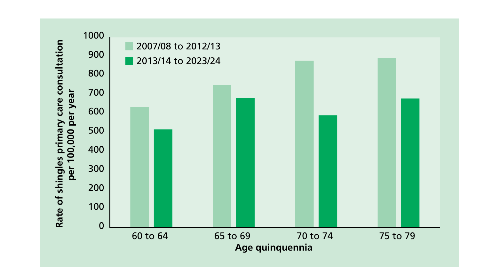

# Shingles (herpes zoster)

## The disease

Shingles (herpes zoster) is caused by the reactivation of a latent varicella zoster virus (VZV) infection, generally decades after the primary infection.

Primary VZV infection typically occurs during childhood and causes chickenpox (varicella); further information on this can be found in The varicella chapter. Following primary VZV infection, the virus enters the sensory nerves and travels along the nerve to the sensory dorsal root ganglia and establishes a permanent latency. Reactivation of the latent virus leads to the clinical manifestations of shingles and is associated with immune senescence or suppression of the immune system e.g. immunosuppressive therapy, HIV infection, malignancy. The risk and severity of shingles increases with age. Prior to the introduction of a shingles vaccination programme, the annual incidence of shingles for those aged 70 to 79 years was estimated to be around 790 to 880 cases per 100,000 people in England and Wales (van Hoek _et al_ 2009).

The first signs of shingles begin most commonly with abnormal skin sensations and pain in the affected area of skin (dermatome). Headache, photophobia, malaise and, less commonly, fever may occur as part of the prodromal phase. Within days or weeks, a unilateral vesicular (fluid-filled blisters) rash typically appears in a dermatomal distribution. In immunosuppressed individuals, a rash involving multiple dermatomes may occur. The affected area may be intensely painful with associated paraesthesia (tingling, pricking, or numbness of the skin), and intense itching is common (Gilden _et al._, 1991). The rash typically lasts between two and four weeks.

Following the rash, persistent pain at the site, known as post-herpetic neuralgia (PHN), can develop and is seen more frequently in older people. Pain that persists for, or appears more than, 90 days after the onset of rash (Oxman _et al._, 2005) is a commonly accepted definition for PHN. On average, PHN lasts from three to six months but can persist for longer. The severity of pain can vary and may be constant, intermittent or triggered by stimulation of the affected area, such as by wind on the face. (Katz _et al._, 2004)

Other complications of shingles depend on the nerves affected and include paresis (motor weakness), facial palsy and 'herpes zoster ophthalmicus', with involvement of the eye and associated dermatome, which may result in keratitis, corneal ulceration, conjunctivitis, retinitis, optic neuritis and/or glaucoma. (Shaikh S _et al._, 2002; Pavan LD, 1995)

The reactivated virus can, in some cases, disseminate into the lungs, liver, gut, and brain, leading to pneumonia, hepatitis, encephalitis, and disseminated intravascular coagulopathy. Disseminated disease is more likely to occur in those who are severely immunosuppressed, with a case fatality rate reported to be between 5 and 15%, and most deaths being attributable to pneumonia (Rogers _et al._, 1995; Gnann _et al._, 1991).

Individuals with active lesions, particularly if they are immunosuppressed, can transmit VZV to susceptible individuals to cause chickenpox and therefore at-risk individuals who have had a significant exposure to shingles require post-exposure management (see The varicella chapter and [Guidelines on post-exposure prophylaxis for varicella or shingles](https://www.gov.uk/government/publications/post-exposure-prophylaxis-for-chickenpox-and-shingles) (UKHSA, 2025)). There is no evidence that shingles can be acquired from another individual who has chickenpox.

## History and epidemiology of the disease

Varicella infection is a prerequisite for the development of shingles. In temperate climates, in the absence of a varicella vaccination programme, the lifetime risk for varicella infection is over 95% (Banz _et al._, 2003).

Although shingles can occur at any age, incidence increases with age before vaccine introduction (van Hoek _et al._, 2009) (see Figure 1) with an estimated lifetime risk of one in four (Miller _et al._, 1993). Shingles can lead to PHN that can require hospitalisation (Table 1). The increasing incidence with age is thought to be associated with age-related immune senescence. Studies have estimated ophthalmic zoster to occur in 10-20% of shingles cases (Opstelten _et al._, 2002) with around 4% of the cases resulting in long-term sequelae, including pain (Bowsher, 1999).

Age-specific incidence rates of shingles have been estimated using a number of different primary care derived data sources (van Hoek _et al._, 2009).

Data from GP-based studies in England and Wales suggest that over 50,000 cases of shingles occur in older people aged 70 years and over annually. After vaccine introduction, older people aged between 70 and 79 years (who will have had an opportunity to receive the vaccination) had lower GP consultation rates compared to those aged 65 to 69 years (Figure 1). It is estimated that, in people aged 70 years and over, around one in 1000 cases of shingles results in death before vaccine introduction (van Hoek _et al._, 2009), although due to the nature of the population and risk of co-morbidities some deaths recorded as being shingles related may not be directly attributable to the disease. The number of deaths due to herpes zoster per 100,000 per year was estimated to be 1.4 before vaccine introduction (Hobbelen _et al._, 2016).

Table 1: Estimated percentage developing PHN by age group in the immunocompetent population in England and Wales in pre-vaccine era (population 2007). Data taken from van Hoek _et al._, 2009.

|                                         | 60-64 years | 65-69 years | 70-74 years | 75-79 years | 80-84 years | 85 years |
| --------------------------------------- | ----------- | ----------- | ----------- | ----------- | ----------- | -------- |
| Proportion developing PHN after 90 days | 9%          | 11%         | 15%         | 20%         | 27%         | 52%      |

Figure 1 Average annual age-specific rates of shingles primary care consultation per 100,000 in England, 2007/08 to 2023/24 (epidemiological year between October and September). Zostavax vaccination programme started in September 2013. Data from Andrews et al., 2020 and Royal College of General Practitioners (RCGP) Research and Surveillance Centre (RSC).

The risk of shingles is also increased in individuals with certain conditions, including systemic lupus erythematosus (Nagasawa _et al._,1990), rheumatoid arthritis (Smitten _et al._, 2007), diabetes (Heymann _et al_ 2008) and Wegener's granulomatosis (Wung _et al._, 2005).

A national shingles immunisation programme was introduced into the routine schedule for adults aged 70 years with a phased catch up programme for 71-79 years commencing in September 2013. At the time, the programme vaccinated eligible individuals using a single dose of Zostavax®, a vaccine containing live attenuated virus derived from the Oka/Merck strain of varicella zoster virus, but at a significantly higher dose than the Varivax® varicella vaccine.

The choice of age group was based on evidence of cost effectiveness of Zostavax®. This age group were considered likely to have the greatest ability to benefit from vaccination (van Hoek _et al._, 2009) due to:

- the burden of shingles disease within this age group (which increases with age)
- the estimated effectiveness of Zostavax® within this age group (which decreases with age) and
- the duration of protection of Zostavax®

In the first five years of the routine and catch-up programmes in England, an estimated 40,500 GP consultations and 1840 hospitalisations among those aged 70 to 79 years were averted through vaccination with Zostavax® (Andrews _et al_, 2020). The vaccine effectiveness against GP consultations for the two programmes were estimated to be 50 to 60% for herpes zoster and 66 to 75% for PHN. The vaccine effectiveness against hospitalisations was estimated to be 37 to 50% for herpes zoster and 49 to 50% for PHN.

In the first real world assessment of vaccine effectiveness of the UK vaccination programme, effectiveness against shingles GP consultations waned from 69% (95% CI 65-74%) in the first year after vaccination to 45% (95% CI 29-57%) by the third year. (Walker _et al_ 2018)

During the ten years of the Zostavax® programme, coverage of the routine cohort (adults aged 70) declined from 61.8% at the start of the programme in 2013/14 to 36.8% at the end of the programme in 2022/23. Despite this, there is evidence of subsequent catch-up as individuals remained eligible until their 80th birthday, with coverage reaching 83.0% for 79 year-olds in 2022/23.

In 2019 JCVI recommended a two dose Shingrix® programme should replace single dose Zostavax® in the routine programme and that it should be offered routinely to adults aged 60 years (JCVI, 2019) based on cost-effectiveness modelling. The risk of shingles and its complications increases with age and is high in individuals who are immunosuppressed. It is therefore important to ensure individuals are optimally protected at the time of greatest risk.

To transition from a Zostavax® programme routinely offered at 70 years, to a Shingrix® programme routinely offered at 60 years, it was decided that a phased approach was needed. It was agreed that this should start by routinely offering vaccination to cohorts turning 65 and 70 years of age, then moving the programme down to offer vaccination to those turning 60 and 65 years. The programme eventually will offer vaccination routinely at 60 years of age. Individuals remain eligible for vaccination until their 80th birthday.

In the first year of the Shingrix® programme, uptake of dose 1 was 23.4% for those turning 65 and 32.5% for those turning 70. Coverage is expected to increase over time as individuals have more time to be vaccinated.

## The shingles vaccination

From September 2023, Shingrix® replaced Zostavax® in the routine immunisation programme.

Shingrix® is a recombinant vaccine and contains varicella zoster virus glycoprotein E antigen produced by recombinant DNA technology, adjuvanted with AS01B.

In the phase 3 randomised placebo-controlled clinical trials of 15,411 participants, vaccine efficacy in the 7,695 immunocompetent adults ≥ 50 years and 6,950 ≥70 years, vaccinated with two doses of Shingrix® 2 months apart was estimated at 97.2% and 91.2% respectively (Lal _et al_ 2015). A long-term follow-up of the initial clinical trials showed the vaccine efficacy against zoster were 71.7% to 83.9% 6 to 11 years after vaccination (Strezova _et al_ 2025).

In a phase 3 clinical trial in autologous haemopoietic stem cell transplant recipients aged 18 years and above who received two doses of Shingrix® 1-2 months apart, robust humoral and cellular responses persisted at 1 year after vaccination (Dagnew _et al_, 2019). Post hoc efficacy analysis revealed a vaccine efficacy of 87.2% against herpes zoster in immunosuppressed patients which included non-Hodgkin B-cell lymphoma and chronic lymphocytic leukaemia.

There are several post-licensure vaccine effectiveness studies on Shingrix. Two observational studies in US in immunocompetent adults aged 50 years or above showed that 2-dose vaccine effectiveness of Shingrix against zoster primary care consultations ranged from 83.5% to 85.5% (Sun _et al_ 2021 and Sun _et al_ 2021). VE estimates did not differ significantly by age for those aged 50 to 79 years in these two studies.

One- and two-dose real-world vaccine effectiveness of Shingrix® was estimated at 56.9% and 70.1% respectively in another US study of both immunocompetent and immunosuppressed adults aged over 65 years (Izurieta _et al_, 2021). Sub-group analyses showed that VE for immunosuppressed individuals was lower (37.0% for 1 dose and 64.1% for 2 dose) than those who were not immunosuppressed (58.4% for 1 dose and 70.5% for 2 dose). One- and two- dose vaccine effectiveness against post-herpetic neuralgia was 51.4% and 76.0%. The two-dose vaccine effectiveness was not significantly lower for adults aged 80 years and over, for second doses received at ≥180 days, or for individuals with autoimmune conditions.

### Storage

Chapter 3 contains information on vaccine storage, distribution and disposal. The summary of product characteristics (SPC) may give further detail on vaccine storage.

### Presentation

Shingrix® is available as a white powder for reconstitution with diluent and is injected as a suspension. After reconstitution, the suspension is an opalescent colourless to pale brownish liquid.

Shingrix® is available in a pack size of 1 vial of powder plus 1 vial of suspension or in a pack size of 10 vials of powder plus 10 vials of suspension. The reconstituted vaccine should be inspected visually for any foreign particulate matter and/or variation of appearance. If either is observed, the vaccine should not be administered.

After reconstitution, the vaccine should be used promptly; if this is not possible, the vaccine should be stored in a refrigerator (2°C – 8°C). If not used within 6 hours, it should be discarded.

### Dosage and schedule

Adults should receive two doses of **0.5ml** of Shingrix® a minimum of 8 weeks apart. However, a longer dose interval of between 6-12 months in England, Wales and Northern Ireland and 2-6 months in Scotland is being used.

### Administration

Chapter 4 covers guidance on administering vaccines.

Shingrix® should be given by intramuscular injection, preferably in the deltoid muscle of the upper arm. Subcutaneous administration is not recommended. The vaccines must not be given intravascularly. Further information on injection technique can be found in Chapter 4.

When Shingrix® vaccine is given at the same time as another vaccine, the vaccines should be given at separate sites, preferably in different limbs. If given in the same limb, they should be given at least 2.5cm apart (American Academy of Pediatrics, 2021).

The site at which each vaccine was given should be noted in the individual's records. See separate section on co-administration of Shingrix® with other vaccines.

### Disposal (also refer to Chapter 3)

Chapter 3 outlines storage, distribution and disposal requirements for vaccines.

Equipment used for vaccination, including used vials, ampoules, or partially discharged vaccines should be disposed of at the end of a session by sealing in a proper, puncture-resistant 'sharps' box according to local waste disposal arrangements and guidance in the [Health Technical Memorandum 07-01: Safe and sustainable management of healthcare waste](https://www.england.nhs.uk/publication/management-and-disposal-of-healthcare-waste-htm-07-01/) (NHS, 2022).

## Recommendations for the use of the vaccine

The aim of the national shingles immunisation programme is to lower the incidence and severity of shingles in older people and those at increased risk.

From September 2023, Shingrix® (a recombinant sub-unit vaccine) which is given as a two-dose schedule, is the recommended vaccine for use in the routine programme.

### National programme for adults aged 60-79 years

The JCVI recommended that Shingrix should replace Zostavax® in the routine programme and that the programme should be offered at 60 years of age. The choice of age group was based on evidence that the greatest number of cases would be prevented by administering the vaccine at this age. This is being rolled out over a period of years starting with those aged 65 and 70.

Those who have been previously eligible will remain eligible until their 80th birthday. Where an individual has turned 80 years of age following their first dose of Shingrix, a second dose should be provided before the individual's 81st birthday to complete the course.

The course consists of two doses of Shingrix®. For immunocompetent individuals the second dose may be offered eight weeks after the first dose. For operational reasons, a longer dose interval is being used (between 6-12 months in England, Wales and Northern Ireland and 2-6 months in Scotland). For severely immunosuppressed adults, these individuals need to be protected more quickly and therefore the second dose should ideally be given 8 weeks to 6 months after the first dose.

Adults aged 70 to 79 years prior to 1st September 2023 will be eligible for vaccination until their 80th birthday.

Shingrix® is not indicated for prevention of primary VZV infection (chickenpox) and should not be used in children and adolescents.

### Severely immunosuppressed individuals aged 18 years and over

From September 2025, Shingrix® should be offered to all severely immunosuppressed individuals aged 18 years and over (with no upper age limit). Previously this was offered to immunosuppressed individuals aged 70 to 79 years and then those aged 50 years and over. Eligible individuals should be offered two doses of Shingrix®. For this cohort the second dose should be given 8 weeks to 6 months after the first dose.

Severely immunosuppressed individuals represent the highest priority for vaccination given their risk of severe disease. Individuals who should be offered Shingrix® are summarised below (Box 1). If there is any doubt, individual patients should be discussed with their specialist.

Severely immunosuppressed individuals who have already received 2 doses of Shingrix® do not need re-vaccination.

Primary humoral immunodeficiencies such as X-linked agammaglobulinemia, are not of themselves an indication for earlier vaccination with Shingrix® unless associated with T cell defects. If there is any doubt, specialist advice from an immunologist should be sought.

Individuals who receive high dose short term immunosuppression at doses equivalent to ≤40mg prednisolone per day for acute episodes of illness such as asthma, chronic obstructive pulmonary disease (COPD) or COVID-19 are not considered to be severely immunosuppressed.

Shingrix® should not be offered earlier to those receiving replacement corticosteroids for adrenal insufficiency, or to those taking topical or inhaled corticosteroids or corticosteroid replacement therapy.

### Box 1: Definition of severe immunosuppression for the Shingrix vaccine programme

**Individuals with primary or acquired immunodeficiency states due to conditions including:**

- acute and chronic leukaemias, and clinically aggressive lymphomas (including Hodgkin's lymphoma) who are less than 12 months since achieving cure
- individuals under follow up for chronic lymphoproliferative disorders including haematological malignancies such as indolent lymphoma, chronic lymphoid leukaemia, myeloma, Waldenstrom's macroglobulinemia and other plasma cell dyscrasias (N.B: this list not exhaustive)
- immunosuppression due to HIV/AIDS with a current CD4 count of below 200 cells/μl.
- primary or acquired cellular and combined immune deficiencies – those with lymphopaenia (<1,000 lymphocytes/μl) or with a functional lymphocyte disorder
- those who have received an allogeneic (cells from a donor) or an autologous (using their own cells) stem cell transplant in the previous 24 months
- those who have received a stem cell transplant more than 24 months ago but have ongoing immunosuppression or graft versus host disease (GVHD)

**Individuals on immunosuppressive or immunomodulating therapy including:**

- those who are receiving or have received in the past 6 months immunosuppressive chemotherapy or radiotherapy for any indication
- those who are receiving or have received in the previous 6 months immunosuppressive therapy for a solid organ transplant
- those who are receiving or have received in the previous 3 months targeted therapy for autoimmune disease, such as JAK inhibitors or biologic immune modulators including B-cell targeted therapies (including rituximab but for which a 6 month period should be considered immunosuppressive), monoclonal tumor necrosis factor inhibitors (TNFi), T-cell co-stimulation modulators, soluble TNF receptors, interleukin (IL)-6 receptor inhibitors.,
- IL-17 inhibitors, IL 12/23 inhibitors, IL 23 inhibitors (N.B: this list is not exhaustive)

**Individuals with chronic immune mediated inflammatory disease who are receiving or have received immunosuppressive therapy**

- moderate to high dose corticosteroids (equivalent ≥20mg prednisolone per day) for more than 10 days in the previous month
- long term moderate dose corticosteroids (equivalent to ≥10mg prednisolone per day for more than 4 weeks) in the previous 3 months
- any non-biological oral immune modulating drugs e.g. methotrexate >20mg per week (oral and subcutaneous), azathioprine >3.0mg/kg/day; 6-mercaptopurine >1.5mg/kg/day, mycophenolate >1g/day) in the previous 3 months
- certain combination therapies at individual doses lower than stated above, including those on ≥7.5mg prednisolone per day in combination with other immunosuppressants (other than hydroxychloroquine or sulfasalazine) and those receiving methotrexate (any dose) with leflunomide in the previous 3 months

**Individuals who have received a short course of high dose steroids (equivalent >40mg prednisolone per day for more than a week) for any reason in the previous month.**

### Severe Immunosuppression

1. Individuals aged 18 years and above with severe immunosuppression (see Box 1) should be offered Shingrix® vaccination. Individuals with lower levels of immunosuppression should be offered Shingrix® vaccination if they are within an eligible age cohort for the routine programme.

**Individuals aged 18 years and older anticipating immunosuppressive therapy**

The risk and severity of shingles is considerably higher amongst severely immunosuppressed individuals and therefore eligible individuals anticipating immunosuppressive therapy should ideally be assessed for vaccine eligibility before starting treatment. Eligible individuals who have not previously been vaccinated should commence a course of Shingrix® at the earliest opportunity preferably one month before starting immunosuppressive therapy (but at least 14 days if one month is not possible) with a dose interval of 8 weeks. If immunosuppressive treatment is subsequently commenced after the first dose of Shingrix® is given, the second dose may be given 8 weeks to 6 months later.

### Reinforcing immunisation

If an individual has had Zostavax® vaccination and then becomes severely immunosuppressed, they should be offered 2 doses of Shingrix®.

If an individual has had 2 doses of Shingrix® and then becomes severely immunosuppressed there is no need to repeat the course.

The need for routine booster doses following either 2 doses of Shingrix® or a single dose of Zostavax® has not yet been determined.

### Co-administration with other vaccines

Shingrix® can be given concomitantly with, or at any interval before or after any other vaccines for which the individual is eligible (and not contraindicated). This includes but is not limited to vaccines commonly administered around the same time or in the same settings. In such circumstances, patients should be informed about the likely timing of potential adverse events relating to each vaccine.

Initially, a seven-day interval was recommended between Shingrix® and adjuvanted influenza vaccine because of a concern that the potential reactogenicity from two adjuvanted vaccines might reduce tolerability in those being vaccinated. Interim data from a US study on co-administration of Shingrix® with adjuvanted seasonal influenza vaccine is reassuring. Therefore, an appointment for administration of the seasonal influenza vaccine can be an opportunity to also provide shingles vaccine, although the latter should be offered all year round, rather than purely as a seasonal programme.

Shingrix® can also be given concomitantly with the 23-valent pneumococcal polysaccharide vaccine (PPV23) and pneumococcal conjugate vaccines (PCV). In phase III controlled open label clinical studies of Shingrix® in adults aged 50 years and older, individuals received PPV23 in one study, and PCV13 in another study (Min _et al_ 2022) with their first dose of Shingrix®. The immune responses of both the co-administered vaccines were unaffected, although fever and shivering were more commonly reported when PPV23 was given with Shingrix®.

### Previous incomplete vaccination

If the course of Shingrix® is interrupted or delayed, it should be resumed as soon as possible but the first dose should not be repeated.

### Pregnancy

There is no known risk associated with giving inactivated, recombinant viral or bacterial vaccines or toxoids during pregnancy or whilst breastfeeding (Kroger _et al._, 2013). If indicated, Shingrix® can be considered in pregnancy after full discussion of the risks and benefits of vaccination with the recipient.

### Contraindications

**Shingrix®**

Shingrix® should not be administered to an individual with a history of a confirmed anaphylactic reaction to any component of the vaccine.

### Management of at risk individuals following significant exposure to herpes zoster

Transmission of VZV can occur following direct contact with herpes zoster lesions, resulting in chickenpox in contacts who are susceptible to VZV. Therefore, individuals at high risk of severe complications from varicella infection should be assessed for the need for post-exposure prophylaxis (see The varicella chapter or [Guidelines on post-exposure prophylaxis for chickenpox and shingles](https://www.gov.uk/government/publications/post-exposure-prophylaxis-for-chickenpox-and-shingles) (UKHSA, 2025) for further details).

Shingrix® is not recommended for use as post-exposure prophylaxis or as a treatment for chickenpox or shingles.

### Precautions

Chapter 6 contains information on contraindications and special considerations for vaccination.

Immunisation of individuals who are acutely unwell should be postponed until they have recovered fully. This is to avoid confusing the diagnosis of any acute illness by wrongly attributing any sign or symptoms to the adverse effects of the vaccine.

Shingrix® vaccination is not recommended for the treatment of shingles or post herpetic neuralgia (PHN). Individuals who have shingles should wait until symptoms have ceased before being considered for shingles vaccination. The natural boosting that occurs following an episode of shingles, however, makes the benefit of offering zoster vaccine immediately following recovery unclear. Patients who have two or more episodes of shingles in one year should have immunological investigation prior to vaccination. Clinicians may wish to discuss such cases with local specialist teams.

Concurrent administration of Shingrix® and anti-viral medications known to be effective against VZV has not been evaluated, but drugs such as aciclovir are unlikely to reduce vaccine response as the vaccine is a recombinant vaccine.

### Transmission after vaccination

As Shingrix® is a recombinant protein vaccine it should not cause development of a varicella-like rash following administration of Shingrix®.

### Testing of post vaccination rashes

Although Zostavax® is no longer in routine use, in the event of a person developing a varicella (widespread) or shingles-like (dermatomal) rash at any time post-Zostavax® a vesicle fluid sample should also be sent for analysis to confirm the diagnosis and determine whether the rash is vaccine-associated or wild-type. This service is available at the Virus Reference Department (VRD) at the UK Health Security Agency (UKHSA), Colindale (T: 0208 327 6017). Please note, sampling kits are not supplied by the Virus Reference Department at UKHSA. Health professionals are requested to obtain vesicle swabs from their local hospital laboratories. Forms and instructions on how to take a vesicle fluid sample can be found at: https://www.gov.uk/government/publications/varicella-zoster-virus-referral-form

### Administration of Shingrix® during pregnancy

There is no known risk associated with giving inactivated, recombinant viral or bacterial vaccines or toxoids during pregnancy or whilst breastfeeding (Kroger _et al._, 2013). If indicated, Shingrix® can be considered in pregnancy after full discussion of the risks and benefits of vaccination with the recipient.

All incidents of inadvertent administration of Shingrix® during pregnancy should also be reported to UK Health Security Agency (UKHSA) using the vaccine administered in pregnancy reporting form (ViP). https://www.gov.uk/vaccination-in-pregnancy-vip

## Adverse reactions

The safety of Shingrix® has been evaluated in clinical trials; in those aged 50 years and above the most frequently reported side effects were pain at the injection site (68%), myalgia (33%), and fatigue (32%). Most of these reactions were not long-lasting (median duration 2-3 days). The safety profile for adults aged 18 years and above with immunosuppression is consistent with that observed for adults aged 50 years and above although pain at the injection site, fatigue, myalgia headache, shivering and fever were more frequently reported. A full list of side effects can be found in the Shingrix® summary of product characteristics (https://www.medicines.org.uk/emc/product/12054/smpc).

Serious suspected adverse reactions to Shingrix® should be reported to the Medical and Healthcare products Regulatory Agency (MHRA) using the Yellow Card reporting scheme (https://www.mhra.gov.uk/yellowcard).

## Supplies

Shingrix® is manufactured by GSK; the marketing authorisation holder is GSK UK Limited (Tel: 0800 221 441).

In England, these vaccines should be ordered online via the ImmForm website (immform.ukhsa.org.uk) and they are distributed by Movianto UK (Tel: 01234 248631) as part of the national immunisation programme. Further information about ImmForm is available at https://portal.immform.ukhsa.gov.uk/ or from the ImmForm helpdesk at helpdesk@immform.org.uk or Tel: 0844 376 0040.

Centrally-purchased vaccines for the national immunisation programme for the NHS can only be ordered via ImmForm and are provided free of charge to NHS organisations.

In Scotland, supplies should be obtained from local vaccine-holding centres. Details of these are available from Public Health Scotland (phs.vaccination@phs.scot).

In Northern Ireland, supplies can be ordered from a specialist Distribution Company. Details can be provided by Regional Pharmaceutical Procurement Services (RPhPS; tel: 028 9442 4089).

Vaccines for private prescriptions, outbreaks, occupational health use or travel are NOT provided free of charge and should be ordered directly from the manufacturer.

To obtain supplies of Shingrix® for use outside of the national immunisation programme contact GSK UK, direct on Tel: 0800 221 441.

## References

American Academy of Pediatrics (2021) Active immunization. In: Kimberlin DW, Barnett ED, Lynfield R, Sawyer MH, eds. _Red Book: 2021 Report of the Committee on Infectious Diseases_. 32nd edition. Itasca, IL: American Academy of Pediatrics: 2021, p28.

Andrews N, Stowe J, Kuyumdzhieva, _et al_ (2020) Impact of the herpes zoster vaccination programme on hospitalized and general practice consulted herpes zoster in the 5 years after its introduction in England: a population-based study. _BMJ Open_ 2020;10:e037458. doi: 10.1136/bmjopen-2020-037458

Banz K, Wagenpfeil S, Neiss A _et al._ (2003) The cost-effectiveness of routine childhood varicella vaccination in Germany. _Vaccine_ **7**;21(11-12):1256-67. doi: 10.1016/s0264-410x(02)00431-0

Bowsher D (1999) The lifetime occurrence of Herpes zoster and prevalence of post- herpetic neuralgia: a retrospective survey in an elderly population. _Eur J Pain_ **3**(4): 335-42. doi: 10.1053/eujp.1999.0139

Dagnew AF, Ilhan O, Lee W-S, _et al._ (2019) Immunogenicity and safety of the adjuvanted recombinant zoster vaccine in adults with haematological malignancies: a phase 3, randomized, clinical trial and post-hoc efficacy analysis. _The Lancet Infectious Diseases_, vol 19, issue 9, P 988-1000. doi: 10.1016/S1473-3099(19)30163-X

Gilden DH, Dueland AN, Cohrs R _et al._ (1991) Preherpetic neuralgia. _Neurology_. **41**(8):1215-8. doi: 10.1212/wnl.41.8.1215

Gnann JW and Whitley RJ (1991) Natural history and treatment of varicella-zoster virus in high-risk populations. _J Hosp Infect_ **18**:317–29. doi: 10.1016/0195-6701(91)90038-a

Heymann AD, Chodick G, Karpati T, _et al_ (2008). Diabetes as a risk factor for herpes zoster infection: results of a population-based study in Israel. _Infection_;**36**:226–230. doi: 10.1007/s15010-007-6347-x

Hobbelen PHF, Stowe J, Amirthalingam G _et al_. (2016). The burden of hospitalisation for varicella and herpes zoster in England from 2004 to 2013. Journal of Infection 73 (3): 241 – 253. doi: 10.1016/j.jinf.2016.05.008

Izurieta HS, Wu X, Forshee R, _et al_. (2021) Recombinant zoster vaccine (Shingrix) real-world effectiveness in the first two years post-licensure. _Clin Infect Dis_ :2021 Feb 13;ciab125. doi: 10.1093/cid/ciab125. Online ahead of print.

Joint Committee of Vaccination and Immunisation (JCVI). Minute of the meeting held on 6th February 2019. https://www.gov.uk/government/groups/joint-committee-on-vaccination-and-immunisation. Accessed May 2023.

Katz J, Cooper EM, Walther RR _et al._ (2004) Acute pain in herpes zoster and its impact on health-related quality of life. _Clin Infect Dis_ **39**:342-8. doi: 10.1086/421942

Kroger AT, Atkinson WL and Pickering LK (2013) General immunization practices. In: Plotkin SA, Orenstein WA and Offit PA (eds). Vaccines, 6th edition. Philadelphia: Saunders Elsevier, p 88.

Lal H, Cunningham AL, Godeaux O, _et al_ (2015) Efficacy of an adjuvanted herpes zoster subunit vaccine in older adults. _NEJM_. 372:2087-2096 doi: 10.1056/NEJMoa1501184

McKay SL, Guo A, Pergam SA, Dooling K. (2020) Herpes zoster risk in immunocompromised adults in the United States: a systematic review. _Clin Infect Dis_ **71** (7): e125-e134. doi: 10.1093/cid/ciz1090

Miller E, Marshall R and Vurdien J (1993) Epidemiology, outcome and control of varicella- zoster infection. _Rev Med Microbiol_ **4**(4): 222-30.

Min JY, Mwakingwe-Omari A, Riley M _et al._ (2022) The adjuvanted recombinant zoster vaccine co-administered with the 13-valent pneumococcal conjugate vaccine in adults aged ≥50 years : a randomized trial. _Journal of Infection_ 84 (4) : 490 – 498.

Nagasawa K, Yamauchi Y, Tada Y _et al._ (1990) High incidence of herpes zoster in patients with systemic lupus erythematosus: an immunological analysis. _Ann Rheumatic Dis_ **49**:630–3. doi: 10.1136/ard.49.8.630

NHS England, 2023. Health Technical Memorandum 07-01: safe management of healthcare waste. https://www.england.nhs.uk/publication/management-and-disposal-of-healthcare-waste-htm-07-01/

Opstelten W, Mauritz JW, de Wit NJ _et al._ (2002) Herpes zoster and postherpetic neuralgia: incidence and risk indicators using a general practice research database. _Fam Pract_ **19**(5): 471-5. doi: 10.1093/fampra/19.5.471

Oxman MN, Levin MJ, Johnson GR _et al_. (2005) A vaccine to prevent herpes zoster and postherpetic neuralgia in older adults. _N Engl J Med_ **352**(22 ): 2271-84. doi: 10.1056/NEJMoa051016

Pavan Langston D (1995) Herpes zoster ophthalmicus. _Neurology_ **45**:50–1. doi: 10.1212/wnl.45.12_suppl_8.s50

Rogers SY, Irving W, Harris A _et al_. (1995). Visceral varicella zoster infection after bone marrow transplantation without skin involvement and the use of PCR for diagnosis. _Bone Marrow Transplant_ **15**:805–7.

Shaikh S, Ta CN (2002) Evaluation and management of herpes zoster ophthalmicus. _Am Fam Physician_ **66**:1723–30.

Smitten AL, Choi HK, Hochberg MC _et al._ (2007) The risk of herpes zoster in patients with rheumatoid arthritis in the United States and the United Kingdom. _Arthritis Rheum_ **57**:1431–8. doi: 10.1002/art.23112

Strezova A, Diez Domingo J, Cunningham AL _et al_. (2025), Final analysis of the ZOE-LTFU trial to 11 years post-vaccination: efficacy of the adjuvanted recombinant zoster vaccine against herpes zoster and related complications. eClinicalMedicine 2025 May 9;83:103241.

Sun Y, Kim E, Kong CL _et al._ (2021), Effectiveness of the recombinant zoster vaccine in adults aged 50 and older in the United States: a claims-based cohort study. Clinical Infectious Diseases 73 (6) 949-956.

Sun Y, Jackson K, Dalmon CA _et al._ (2021), Effectiveness of the recombinant zoster vaccine among Kaiser Permanente Hawaii enrollees aged 50 and older: a retrospective cohort study. Vaccine 39 (29) 3974-3982.

UKHSA (2022) Shingles vaccine coverage (England): annual report of the financial year 2021 to 2022. https://www.gov.uk/government/publications/herpes-zoster-shingles-immunisation-programme-2021-to-2022-evaluation-reports/shingles-vaccine-coverage-england-annual-report-of-the-financial-year-2021-to-2022 Accessed May 2023

UKHSA (2025) Guidelines on post exposure prophylaxis (PEP) for varicella and shingles, https://www.gov.uk/government/publications/post-exposure-prophylaxis-for-chickenpox-and-shingles Accessed February 2025

van Hoek AJ, Gay N, Melegaro A _et al._ (2009) Estimating the cost-effectiveness of vaccination against herpes zoster in England and Wales. _Vaccine_ **27**(9): 1454-67. doi: 10.1016/j.vaccine.2008.12.024

Walker JL, Andrews NJ, Amirthalingam G, Forbes H, Langan SM, Thomas SL. (2018) Effectiveness of herpes zoster vaccination in an older United Kingdom population. _Vaccine_ **36** (17): 2371-2377 doi: 10.1016/j.vaccine.2018.02.021

Wung PK, Holbrook JT, Hoffman GS _et al._ (2005) Herpes zoster in immunocompromised patients: incidence, timing, and risk factors. _Am J Med_ **118**:1416.e9–e18. doi: 10.1016/j.amjmed.2005.06.012
