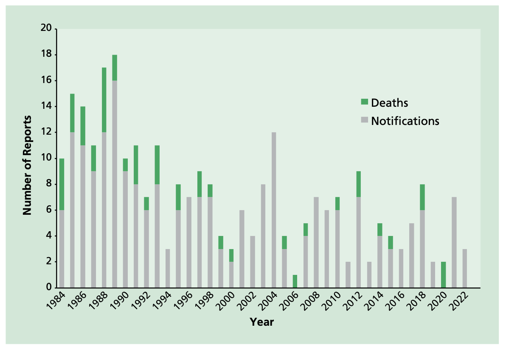
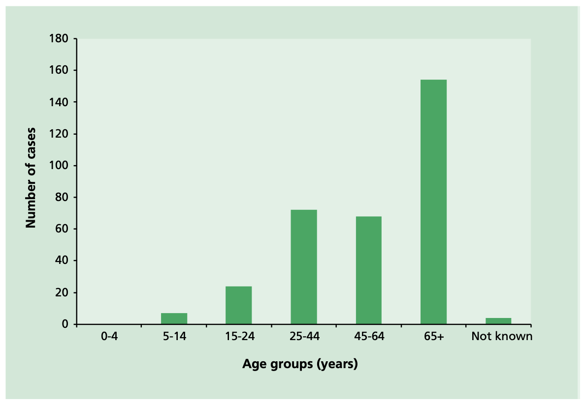

# Tetanus

NOTIFIABLE

## The disease

Tetanus is an acute disease caused by the action of tetanus toxin, released following infection by the bacterium _Clostridium tetani_. Tetanus spores are present in soil or manure and may be introduced into the body through a puncture wound, burn or scratch – which may go unnoticed. The bacteria grow anaerobically at the site of the injury and have an incubation period of between four and 21 days (most commonly about ten days).

The disease is characterised by generalised rigidity and spasms of skeletal muscles. The muscle stiffness usually involves the jaw (lockjaw) and neck and then becomes generalised. The case–fatality ratio ranges from 10 to 90%; it is highest in infants and the elderly. It varies inversely with the length of the incubation period and the availability of intensive care.

Tetanus can never be eradicated because the spores are commonly present in the environment, including soil. Tetanus is not spread from person to person.

Neonatal tetanus is an important cause of death in some countries in Africa due to infection of the baby's umbilical stump. Worldwide elimination of neonatal tetanus by 1995 was one of the targets of the [World Health Organization (WHO)](https://www.who.int), and the number of countries in which neonatal tetanus occurs is progressively decreasing.

## History and epidemiology of the disease

Tetanus immunisation was first provided in the UK to the Armed Forces in 1938. From the mid-1950s it was introduced in some localities as part of the primary immunisation of infants, then nationally in 1961. The disease had almost disappeared in children under 15 years of age by the 1970s (Galbraith _et al._, 1981). In 1970, it was recommended that people with tetanus-prone wounds should routinely be offered passive immunisation and complete a primary immunisation course.

Between 1984 and 2022, there were 327 cases of tetanus (combined data from notifications, deaths and laboratory reports) in England and Wales (30.1 and 30.2). Of the cases, 68.3% occurred in individuals aged 45 years or over, and 22.2% were in individuals aged from 25 to 44 years. The highest incidence of tetanus was in adults over 65 years of age, with no cases of tetanus reported in infants or children under five years of age.

Twenty five cases of tetanus were reported in people who inject drugs (PWID) between July 2003 and February 2004 (Health Protection Agency (HPA), 2004). Seven were closely clustered in time and possibly caused by a contaminated batch of illicit drugs (HPA, 2003). Tetanus in PWID had previously been reported rarely in the UK, in contrast to the US, where PWID accounted for 15 to 18% of cases reported between 1995 and 2000 (Centers for Disease Control and Prevention (CDC), 2003). Since the 2003/2004 cluster, only twelve sporadic cases of tetanus were reported in PWID to the end of 2022.

Figure 30.1 Tetanus Notifications and Deaths by year, England and Wales 1984 - 2022.

Figure 30.2 Tetanus Cases by age, England and Wales 1984 - 2022.

## The tetanus vaccination

The vaccine is made from a cell-free purified toxin extracted from a strain of _C. tetani_. This is treated with formaldehyde that converts it into tetanus toxoid. This is adsorbed onto an adjuvant, either aluminium phosphate or aluminium hydroxide, to improve its immunogenicity.

Tetanus vaccines used for primary immunisation of children under 10 years of age contain not less than 40IU of tetanus toxoid; vaccines used for individuals over the age of 10 years and for boosters\* contain not less than 20IU. The tetanus vaccine is only given as part of combined products for the UK national vaccination programme:

- diphtheria/tetanus/acellular pertussis/inactivated polio vaccine/_Haemophilus influenzae_ type b/Hepatitis B (DTaP/IPV/Hib/HepB)
- diphtheria/tetanus/acellular pertussis/inactivated polio vaccine (DTaP/IPV or dTaP/IPV)
- tetanus/diphtheria/inactivated polio vaccine (Td/IPV)
- diphtheria/tetanus/acellular pertussis (Tdap)

The above vaccines are thiomersal-free. They are inactivated, do not contain live organisms and cannot cause the diseases against which they protect.

The combined vaccines above should be used where protection is required against tetanus, diphtheria, pertussis or polio in order to provide comprehensive, long-term protection against all relevant diseases.

\*this excludes the dose of hexavalent booster given at 18 months of age which contains 40IU of tetanus toxoid and is given to boost protection against Hib (see below)

### Storage

Chapter 3 contains information on vaccine storage, distribution and disposal. The summary of product characteristics (SPC) may give further detail on storage of this vaccine.

### Presentation

Tetanus vaccine should only be used as part of combined products. REPEVAX®, Boostrix®-IPV, Vaxelis®, REVAXIS® and ADACEL® are supplied as cloudy white or off-white suspensions in pre-filled syringes. The suspensions may sediment during storage and should be shaken to distribute the suspensions uniformly before administration.

Infanrix hexa® is supplied as a powder in a vial and a suspension in a pre-filled syringe. The vaccine must be reconstituted by adding the entire contents of the pre-filled syringe (Infanrix hexa® suspension containing DTaP-HBV-IPV) to the vial containing the powder (Hib). The full reconstitution instructions are given in the Summary of Product Characteristics. After reconstitution, the vaccine should be injected immediately.

### Administration

Chapter 4 covers guidance on administering vaccines. Most injectable vaccines are routinely given intramuscularly into the deltoid muscle of the upper arm or, for infants 1 year and under, into the anterolateral aspect of the thigh.

Tetanus-containing vaccines can be given at the same time as any other vaccines required. The vaccines should be given at a separate site, preferably into a different limb. If given into the same limb, they should be given at least 2.5cm apart (American Academy of Paediatrics, 2021). The site at which each vaccine was given should be noted in the individual's records.

### Dosage and schedule

All tetanus-containing vaccines are supplied as single doses of 0.5 ml.

### Routine childhood immunisations

The routine childhood immunisation schedule contains six doses of tetanus-containing vaccine. The priming schedule is three doses, given at four-week intervals. An additional dose is given as part of the hexavalent booster at 18 months of age, which is given to ensure protection against Hib. Two tetanus booster doses are required from the age of 3 years 4 months at appropriate intervals.

- first dose of 0.5ml of a tetanus-containing vaccine
- second dose of 0.5ml, one month after the first dose
- third dose of 0.5ml, one month after the second dose
- fourth dose of 0.5ml (Hib-containing hexavalent booster) given at the recommended interval (see below)
- fifth and sixth doses of 0.5ml should be given at the recommended intervals (see below)

### Disposal

Chapter 3 outlines storage, distribution and disposal requirements for vaccines. Equipment used for vaccination, including used vials, ampoules, or discharged vaccines in a syringe, should be disposed of safely in a UN-approved puncture-resistant 'sharps' box, according to local waste disposal arrangements and guidance in the [technical memorandum 07-01: Safe and sustainable management of healthcare waste](https://www.england.nhs.uk/publication/management-and-disposal-of-healthcare-waste-htm-07-01/) (NHS England).

## Recommendations for the use of the vaccine

The objective of the immunisation programme is to provide a minimum of five doses of tetanus-containing vaccine at appropriate intervals for all individuals.

To fulfil this objective, the appropriate vaccine for each age group is determined also by the need to protect individuals against diphtheria, pertussis, Hib, hepatitis B and polio.

### Primary immunisation

**Infants and children under ten years of age**

The primary course of tetanus vaccination consists of three doses of a suitable tetanus-containing vaccine (containing 40IU of tetanus toxoid) with an interval of four weeks between each dose. DTaP/IPV/Hib/HepB is recommended to be given at eight, twelve and sixteen weeks of age but can be given at any stage from eight weeks up to ten years of age if not completed in the first year of life. If the primary course is interrupted it should be resumed but not repeated, allowing an interval of four weeks between the remaining doses.

**Children aged ten years or over, and adults**

The primary course of tetanus vaccination consists of three doses of a suitable tetanus-containing vaccine (containing a minimum of 20 IU tetanus toxoid) with an interval of four weeks between each dose. Td/IPV is recommended for all individuals aged ten years or over. If the primary course is interrupted it should be resumed but not repeated, allowing an interval of four weeks between the remaining doses.

### Reinforcing immunisation

**Routine childhood immunisation schedule**

With the change to the routine childhood immunisation schedule introduced on 1 July 2025, children will receive an additional dose of the hexavalent Hib-containing vaccine at 18 months of age. This DTaP/IPV/Hib/HepB hexavalent booster will be given to replace the dose of Hib/MenC vaccine previously given at 12 months of age, in order to provide a dose of Hib-containing vaccine in the second year of life and maintain Hib control.

This hexavalent DTaP/IPV/Hib/HepB booster should not be considered sufficient to support long-term protection against tetanus when given routinely under the age of three years four months. Two further doses of tetanus-containing vaccine are still required before adulthood; and these are routinely given pre-school (from three years four months of age) and before leaving school (usually around age 13 – 14 years of age). These are termed the first and second tetanus boosters.

Children should receive their first tetanus booster (containing a minimum of 20 IU tetanus toxoid) combined with diphtheria, pertussis and polio vaccines (dTaP/IPV) at three years four months of age or soon after.

The second tetanus booster (dose of Td/IPV) should be given to all individuals ideally ten years after the first tetanus booster.

**Delayed or missed immunisations**

If a child who completed their primary immunisations before the age of 1 year presents for their pre-school booster (at three years four months of age or soon thereafter) but missed their hexavalent booster at 18 months of age, the hexavalent, Hib-containing vaccine (DTaP/IPV/Hib/HepB) should be offered as their first tetanus booster. This is to ensure they receive a Hib booster over 1 year of age. The second tetanus booster should then be given ideally ten years after the first tetanus booster.

When primary vaccination has been delayed, this first tetanus booster dose may be given at the scheduled three years four months visit provided it is one year since the third primary (hexavalent) dose. This will re-establish the child on the routine schedule. dTaP/IPV should be used in this age group (provided at least one dose of hexavalent vaccine was given over one year of age, otherwise hexavalent vaccine should be used). Td/IPV should not be used routinely for this purpose in this age group because it does not provide protection against pertussis.

Individuals aged ten years or over who have only had three doses of a tetanus-containing vaccine should receive the first tetanus booster combined with diphtheria and polio vaccines (Td/IPV) ideally five years after their last primary dose.

If a person attends for a routine booster dose and has a history of receiving a vaccine following a tetanus-prone wound, attempts should be made to identify which vaccine was given. If the vaccine given at the time of the injury was the same as that due at the current visit and was given after an appropriate interval, then the routine booster dose is not required. Otherwise, the dose given at the time of injury should be discounted as it may not provide long-term protection against all antigens, and the scheduled immunisation should be given. Such additional doses are unlikely to produce an unacceptable rate of reactions (Ramsay et al., 1997).

PWID are at greater risk of tetanus. This may result from tetanus-contaminated illicit drugs, especially when they have sites of focal infection such as skin abscesses that may promote growth of anaerobic organisms (UKHSA, 2021). As PWID may be reluctant to present to health services, every opportunity should be taken to ensure that they are fully protected against tetanus. Booster doses should be given if there is any doubt about their immunisation status. Awareness of the risk and value of vaccination in this group, and awareness among those working with them, is extremely important.

### Vaccination of individuals with unknown or incomplete immunisation status

Where a child born in the UK presents with an inadequate immunisation history, every effort should be made to clarify what immunisations they may have had (see Chapter 11 on vaccination schedules). A child who has not completed the primary course should have the outstanding doses at four week intervals. Children may receive the first tetanus booster dose as early as one year after the third primary dose to re-establish them on the routine schedule. Which vaccine is offered for this booster will depend on age and previous vaccine history (see 'delayed or missed immunisations' section above). The second booster should ideally be offered a minimum of five years later to ensure long-term protection.

Children coming to the UK who have a history of completing immunisation in their country of origin may not have been offered protection against all the antigens currently used in the UK, but are likely to have received tetanus-containing vaccines. Country immunisation schedules can be found on the [WHO website](https://www.who.int).

Individuals coming from areas of conflict or from population groups who may have been marginalised in their country of origin (e.g. refugees, gypsy or other nomadic travellers) may not have had good access to immunisation services. In particular, older children and adults may also have been raised during periods before immunisation services were well developed or when vaccine quality was sub-optimal. Where there is no reliable history of previous immunisation, it should be assumed that any undocumented doses are missing and the UK catch-up recommendations for that age should be followed (see Chapter 11).

Children coming to the UK may have had a fourth dose of a tetanus-containing vaccine that is given at around 18 months in some countries. This dose should be discounted as it may not provide satisfactory protection until the time of the teenage booster. The routine pre-school and subsequent boosters should be given according to the UK schedule.

Further advice on [vaccination of children with unknown or incomplete immunisation status](https://www.gov.uk/government/publications/vaccination-of-individuals-with-uncertain-or-incomplete-immunisation-status) is published by the UK Health Security Agency.

### Travellers and those going to reside abroad

All travellers should ensure that they are fully immunised according to the UK schedule (see above). Additional doses of vaccines may be required according to the destination and the nature of travel intended (see [NaTHNaC](https://travelhealthpro.org.uk)).

For travellers to areas where medical attention may not be accessible and whose last dose of a tetanus-containing vaccine was more than ten years previously, a booster dose should be given prior to travelling, even if the individual has received five doses of vaccine previously. This is a precautionary measure in case immunoglobulin is not available to the individual in the event of a tetanus-prone injury.

Where tetanus, diphtheria or polio protection is required and the final dose of the relevant antigen was received more than ten years ago, Td/IPV should be given.

### Tetanus vaccination in laboratory workers

Individuals who may be exposed to tetanus in the course of their work in microbiology laboratories, are at risk and must be up to date for tetanus vaccination (see Chapter 12). A booster may be required in the event of a recognised exposure.

## Contraindications

There are very few individuals who cannot receive tetanus-containing vaccines. When there is doubt, appropriate advice should be sought from the relevant specialist consultant, the local screening and immunisation team or local Health Protection Team rather than withholding vaccine. The risk to the individual of not being immunised must be taken into account.

The vaccines should not be given to those who have had:

- a confirmed anaphylactic reaction to a previous dose of a tetanus-containing vaccine, or
- a confirmed anaphylactic reaction to any component or residue from the manufacturing process

Specific advice on management of individuals who have had an allergic reaction can be found in Chapter 8 of the Green Book.

## Precautions

Chapter 6 contains information on contraindications and special considerations for vaccination.

Minor illnesses without fever or systemic upset are not valid reasons to postpone immunisation.

If an individual is acutely unwell, immunisation should be postponed until they have fully recovered. This is to avoid confusing the differential diagnosis of any acute illness by wrongly attributing any signs or symptoms to the adverse effects of the vaccine.

### Systemic and local reactions following a previous immunisation

Individuals who have had a systemic or local reaction following a previous immunisation with a tetanus-containing vaccine can continue to receive subsequent doses of tetanus-containing vaccine. This includes the following rare reactions:

- fever, irrespective of its severity
- hypotonic-hyporesponsive episodes (HHE)
- persistent crying or screaming for more than three hours
- severe local reaction, irrespective of extent
- convulsions, with or without fever, within 3 days of vaccination

Chapter 8 covers vaccine safety and the management of adverse events following immunisation.

### Pregnancy and breast-feeding

Tetanus-containing vaccines may be given to pregnant women without delay when protection is required. There is no evidence of risk from vaccinating pregnant women or those who are breast-feeding with inactivated virus, bacterial vaccines or toxoids (Plotkin _et al_, 2018).

Since October 2012, tetanus containing vaccines have been given as part of the maternal pertussis programme. The Medicines and Healthcare products Regulatory Agency (MHRA) has used the Yellow Card Scheme and the Clinical Practice Research Datalink to follow pregnancy outcomes following vaccination. The study based on a cohort of 18,000 vaccinated pregnant women found no evidence of an increased risk of stillbirth and no evidence of an increased risk of any of an extensive list of maternal, fetal and neonatal adverse outcomes in vaccinated mothers (Donegan _et al._, 2014). Safety studies from other countries (mostly in Europe and North America), together including more than 150,000 vaccinated pregnancies, found similar risks of safety outcomes (maternal, fetal and infant) in vaccinated and unvaccinated pregnancies (Campbell _et al_. 2018).

### Premature infants

It is important that premature infants have their immunisations at the appropriate chronological age, according to the schedule. The occurrence of apnoea following vaccination is especially increased in infants who were born very prematurely.

Very premature infants (born ≤28 weeks of gestation) who are in hospital should have respiratory monitoring for 48-72 hrs when given their first immunisation, particularly those with a previous history of respiratory immaturity. If the child has apnoea, bradycardia or desaturations after the first immunisation, the second immunisation should also be given in hospital, with respiratory monitoring for 48-72 hrs (Pfister _et al._, 2004; Ohlsson _et al._, 2004; Schulzke _et al._, 2005; Pourcyrous _et al._, 2007; Klein _et al._, 2008).

Infants stable at discharge without a history of apnoea and/or respiratory compromise may be vaccinated in the community setting.

As the benefit of vaccination is high in this group of infants, vaccination should not be withheld or delayed.

### Immunosuppression and HIV infection

Individuals with immunosuppression or HIV infection (regardless of CD4 count) should be given tetanus-containing vaccines in accordance with the recommendations above. These individuals may not make a full antibody response. Re-immunisation should be considered after treatment is finished and recovery has occurred. Specialist advice may be required.

Further guidance is provided in Chapter 7 of the Green Book and by the British HIV Association (BHIVA) [Guidelines on the use of vaccines in HIV-positive adults](https://www.bhiva.org/vaccination-guidelines) (BHIVA, 2015) and the Children's HIV Association of UK and Ireland (CHIVA) [Guidelines on Vaccination of Children Living with HIV](https://www.chiva.org.uk/infoprofessionals/guidelines/immunisation/) (CHIVA, 2022).

### Neurological conditions

Chapter 6 covers vaccination contraindications and special considerations.

The presence of a neurological condition is not a contraindication to immunisation but if there is evidence of current neurological deterioration, deferral of vaccination may be considered, to avoid incorrect attribution of any change in the underlying condition. The risk of such deferral should be balanced against the risk of the preventable infection, and vaccination should be promptly given once the diagnosis and/or the expected course of the condition becomes clear.

### Deferral of immunisation

There will be very few occasions when deferral of immunisation is required (see above). Deferral leaves the child unprotected; the period of deferral should be minimised so that immunisation can commence as soon as possible. If a specialist recommends deferral, this should be clearly communicated to the individual's primary care provider, who must be informed as soon as the child is fit for immunisation.

## Adverse reactions

Chapter 8 covers vaccine safety and the management of adverse events following immunisation.

Pain, swelling or redness at the injection site are common and may occur more frequently following subsequent doses. A small painless nodule may form at the injection site; this usually disappears and is of no consequence.

Fever, convulsions, high-pitched screaming and episodes of pallor, cyanosis and limpness (hypertonic-hyporesponsive episodes or HHE) can occur following vaccination with tetanus-containing vaccines. Though not a contraindication to vaccination, individuals with a history of febrile convulsions should be closely monitored as further adverse events may occur within 2 to 3 days post vaccination.

Confirmed anaphylaxis occurs extremely rarely, occurring at less than 1 per million doses for vaccines in the UK.

Other systemic adverse events such as anorexia, diarrhoea, fatigue, headache, nausea and rash may occur more commonly and are not contraindications to further immunisation. Co-administration of the infant hexavalent vaccine with pneumococcal conjugate vaccine or MMR increases febrile reactions/ convulsions.

Anyone can report a suspected reaction to the Medicines and Healthcare products Regulatory Agency (MHRA) using the Yellow Card scheme (https://yellowcard.mhra.gov.uk/). All suspected adverse reactions to vaccines occurring in children, or in individuals of any age after vaccination with vaccines labelled with a black triangle (▼) should be reported to the MHRA using the Yellow Card scheme. Serious suspected adverse reactions to vaccines in adults should be reported through the Yellow Card scheme.

## Management of patients with tetanus-prone wounds

Although any wound can give rise to tetanus, clean wounds are considered to have a low likelihood of harbouring tetanus spores and of developing the anaerobic and acidic conditions that promote spore germination (Roper _et al._, 2018). Therefore, in the case of wounds such as clean cuts, immediate post exposure treatment is not indicated. However, for those who are incompletely immunised, further doses should be offered to complete the recommended schedule to protect against future exposures.

Tetanus-prone wounds include:

- puncture-type injuries acquired in a contaminated environment and likely therefore to contain tetanus spores e.g. gardening injuries
- wounds containing foreign bodies
- compound fractures
- wounds or burns with systemic sepsis
- certain animal bites and scratches - although smaller bites from domestic pets are generally puncture injuries animal saliva should not contain tetanus spores unless the animal has been rooting in soil or lives in an agricultural setting

Note: individual risk assessment is required and this list is not exhaustive e.g. a wound from discarded needle found in a park may be a tetanus-prone injury but a needle stick injury in a medical environment is not

High-risk tetanus-prone wounds include: any of the above with either:

- heavy contamination with material likely to contain tetanus spores e.g. soil, manure
- wounds or burns that show extensive devitalised tissue
- wounds or burns that require surgical intervention that is delayed for more than six hours are high risk even if the contamination was not initially heavy

Thorough cleaning of wounds is essential.

The rationale for using intramuscular tetanus immunoglobulin (IM-TIG) is to sufficiently and rapidly raise antibody levels in exposed individuals with antibody levels below the protective threshold, and who are not expected to make a sufficiently rapid memory response to vaccination. The median incubation period for tetanus is reported as 7 days but can range from 4-21 days and therefore it is important that either IM-TIG administration or active boosting occurs promptly following an exposure. Peak levels are achieved 4 days after an IM-TIG dose. In individuals who receive a vaccine booster after having completed a full primary course, a measurable increase in antibody titres has been observed as early as 4 days, and levels increase substantially from day 7. The antibody levels achieved 5-7 days after a reinforcing dose of vaccine likely exceeds the estimated antibody boost from a prophylactic dose of IM-TIG in an adult.

Guidance on the use of tetanus containing vaccine and/or immunoglobulin for management of individuals following injury are summarised in table 30.1. These recommendations are based on what would be considered an adequate priming course (defined as receiving at least 3 doses of tetanus vaccine). These individuals would be expected to retain antibody levels above the protective threshold for between 5 to 10 years (depending on the age at which they received their last dose). Such individuals would be expected to have adequate protection following a tetanus prone injury and therefore not require any immediate treatment, but may need further doses of vaccine as required to complete the recommended schedule.

Individuals who have received an adequate priming course but are more than 5-10 years since the last dose (depending on the age of the final dose) would be expected to make a rapid response to a booster dose of vaccine and so all individuals in this group are recommended a booster dose of vaccine for immediate protection. This is likely to be sufficient except in situations of heavy contamination and therefore, only individuals who have sustained a high risk injury require IM-TIG in addition to a reinforcing dose of vaccine. Further doses of vaccine may be required to complete the recommended schedule for future immunity

For individuals who have not received an adequate priming course, any tetanus prone injury should receive both IM-TIG and a reinforcing dose of vaccine. This should include individuals with an uncertain immunisation status and /or those born before routine immunisation in 1961. Further doses of vaccine will be required to complete the recommended schedule.

Table 30.1 Immunisation recommendations for clean and tetanus-prone wounds

| Immunisation Status                                                                                                                                                                                                                                                                    | Immediate treatment                   |                                                                                                     |                                                                                                     | Later treatment                                                                            |
| -------------------------------------------------------------------------------------------------------------------------------------------------------------------------------------------------------------------------------------------------------------------------------------- | ------------------------------------- | --------------------------------------------------------------------------------------------------- | --------------------------------------------------------------------------------------------------- | ------------------------------------------------------------------------------------------ |
|                                                                                                                                                                                                                                                                                        | Clean wound1                          | Tetanus Prone                                                                                       | High risk tetanus prone                                                                             |                                                                                            |
| Those aged 11 years and over, who have received an adequate priming course of tetanus vaccine2 with the last dose within 10 years Children aged 5-10 years who have received priming course and pre-school booster Children under 5 years who have received an adequate priming course | None required                         | None required                                                                                       | None required                                                                                       | Further doses as required to complete the recommended schedule (to ensure future immunity) |
| Received adequate priming course of tetanus vaccine2 but last dose more than 10 years ago Children aged 5-10 years who have received an adequate priming course but no preschool booster _Includes UK born after 1961 with history of accepting vaccinations_                          | None required                         | Immediate reinforcing dose of vaccine                                                               | Immediate reinforcing dose of vaccine One dose of human tetanus immunoglobulin3 in a different site | Further doses as required to complete the recommended schedule (to ensure future immunity) |
| Not received adequate priming course of tetanus vaccine2 _Includes uncertain immunisation status and/ or born before 1961_                                                                                                                                                             | Immediate reinforcing dose of vaccine | Immediate reinforcing dose of vaccine One dose of human tetanus immunoglobulin3 in a different site | Immediate reinforcing dose of vaccine One dose of human tetanus immunoglobulin3 in a different site | Further doses as required to complete the recommended schedule                             |

1 Clean wound is defined as wounds less than 6 hours old, non-penetrating with negligible tissue damage

2 At least 3 doses of tetanus vaccine. This definition of "adequate course" is for the risk assessment of tetanus-prone wounds only. The full UK schedule is five doses of tetanus containing vaccine at appropriate intervals

3 If TIG is not available, Human Normal Immunoglobulin (HNIG) may be used as an alternative.

Given a lack of evidence on use in the clinical pathway, point of care antibody testing is not currently recommended for use in assessment of tetanus prone wounds or diagnosis of suspected tetanus by the WHO. Determination of vaccination status using vaccination records remains the preferred method.

Patients who are severely immunosuppressed may not be adequately protected against tetanus, despite having been fully immunised. In the event of an exposure they may require additional boosting and/or immunoglobulin.

For those whose immunisation status is uncertain, and individuals born before 1961 who may not have been immunised in infancy, a full course of immunisation is likely to be required.

[UKHSA guidance](https://www.gov.uk/government/publications/tetanus-advice-for-health-professionals) on the management of tetanus prone wounds and clinical management of tetanus cases is available.

### Dosage of human tetanus immunoglobulin and human normal immunoglobulin

**For prevention:**

Tetanus immunoglobulin (TIG) - 250IU by intramuscular (IM) injection, or 500IU if more than 24 hours have elapsed since injury, there is a risk of heavy contamination or following burns. This preparation is available in 1ml ampoules containing 250IU.

Human normal immunoglobulin (HNIG) can be used as an alternative in the absence of IM-TIG. More detailed information on the products available, dosage (based on potency testing) and administration of these products is available in the [UKHSA guidance](https://www.gov.uk/government/publications/tetanus-advice-for-health-professionals).

## Management of cases

Early recognition and treatment may be life-saving but few clinicians in the UK now have experience of managing tetanus. Awareness of the potential diagnosis in those with a history of a tetanus-prone wound, and in those at higher risk, including PWID, is essential.

**For treatment:**

An intravenous (IV) tetanus immunoglobulin (TIG) product is no longer available in the UK, and the volume of IM-TIG required to reach a therapeutic dose would be too large in most individuals. Therefore, in the absence of IV-TIG, human intravenous immunoglobulin (IVIG) is the recommended treatment for clinically suspected tetanus. The recommendation is based on previous testing of the IVIG product Vigam 5% for anti-tetanus antibodies, which was carried out by the National Institute for Biological Standards and Control (NIBSC) and showed that the IVIG product Vigam contained reasonable levels of tetanus antibody when measured by ELISA and these results correlated well with the in-vivo Toxin Neutralising Test (TNT). More recently, ten further IVIG products: Gammaplex 5%, Privigen 10%, Octagam (5% & 10%, Intratect (5% & 10%), Flebogama (5% & 10%), Panzyga 10%, Gammunex 10%) have been tested for the presence of anti-tetanus antibodies by NIBSC and have been shown to be comparable to Vigam in terms of their anti-tetanus potency, please see the latest [UKHSA guidance](https://www.gov.uk/government/publications/tetanus-advice-for-health-professionals) for advice. If none of these products are available there may be alternatives, please see the latest [UKHSA guidance](https://www.gov.uk/government/publications/tetanus-advice-for-health-professionals).

The recommended dose by infusion is 5,000IU for individuals less than 50kg and 10,000IU for individuals over 50kg. This equates to a dose of 400ml IVIG for individuals less than 50kg with 5% IVIG products and 200ml for 10% products, and doses of 800ml and 400ml for individuals over 50kg with 5% and 10% IVIG respectively.

## Supplies

**Vaccines**

- Infanrix hexa® (diphtheria/tetanus/3-component acellular pertussis/inactivated polio vaccine/Haemophilus influenzae type b/Hepatitis B (DTaP/IPV/Hib/HepB)) – manufactured by GSK
- REPEVAX® (diphtheria/tetanus/5-component acellular pertussis/inactivated polio vaccine (dTaP/IPV)) – manufactured by Sanofi
- Infanrix® IPV+Hib (diphtheria/tetanus/3-component acellular pertussis/inactivated polio/Haemophilus influenzae type b vaccine (DTaP/IPV/Hib)) – manufactured by GSK
- REVAXIS® (diphtheria/tetanus/inactivated polio vaccine (Td/IPV)) – manufactured by Sanofi
- Vaxelis® diphtheria/tetanus/5-component acellular pertussis/inactivated polio vaccine/Haemophilus influenzae type b, hepatitis B (DTaP/IPV/Hib/HepB) – manufactured by Sanofi
- Boostrix-IPV® (diphtheria/tetanus/5-component acellular pertussis/inactivated polio vaccine (dTaP/IPV)) – manufactured by GSK
- ADACEL®, diphtheria/tetanus/5-component acellular pertussis (TdaP) – manufactured by Sanofi

Tetanus containing vaccines are available in England, Wales and Scotland from ImmForm Tel: 0207 183 8580.

Website: https://portal.immform.ukhsa.gov.uk

If not already registered on ImmForm you will need to register in good time before placing an order.

In Northern Ireland, supplies should be obtained under the normal childhood vaccines distribution arrangements, details of which are available by contacting the Regional Pharmaceutical Procurement Service on 028 9442 4089.

### Immunoglobulin

**Intravenous products**

In England, Wales, Scotland and Northern Ireland, IV TIG is no longer available.

In England and Wales IVIG should be sourced from hospital pharmacies or directly from the suppliers.

In Northern Ireland, IVIG should be sourced from hospital pharmacies or directly from the suppliers. In Scotland, IVIG should be obtained from local hospital pharmacy departments.

**Intramuscular products**

IM-TIG and IM-HNIG (Subgam) are available in England from Bio Products Laboratory (Tel: Main switchboard: 0208 957 2200; or Direct line: 0208 957 2251; or OOH 0208 957 2200). Other HNIG products are available from hospital pharmacies or suppliers.

In Scotland, IM-TIG and IM-HNIG should be obtained from local hospital pharmacy departments. Details of these are available from Procurement, Commissioning & Facilities of NHS National Services Scotland 0131 275 6725.

In Wales IM-TIG/IMHNIG are available from the Welsh Blood Transfusion Service (Tel: 01443 622034/035/037) and are issued by hospital pharmacies.

In Northern Ireland, the source of IM-TIG is the Northern Ireland Blood Transfusion Services (Tel: 028 9032 1414) (issued via hospital pharmacies). IM-HNIG should be sourced from hospital pharmacies or directly from the suppliers.

## References

American Academy of Pediatrics (2021) Active immunization. In: Kimberlin DW, Barnett ED, Lynfield R, Sawyer MH, eds. Red Book: 2021 Report of the Committee of Infectious Diseases. 32nd edition. Itasca, IL: American Academy of Pediatrics: 2021, p28.

Bohlke K, Davis RL, Marcy SH _et al._ (2003) Risk of anaphylaxis after vaccination of children and adolescents. _Pediatrics_ **112**: 815–20.

British HIV Association (2015) BHIVA guidelines on the use of vaccines in HIV-positive adults : https://www.bhiva.org/vaccination-guidelines Accessed June 2024

Campbell H, _et al_. (2018) Safety of pertussis vaccination in pregnant women in UK: observational study. _BMJ_ 349:g4219. Available at http://www.bmj.com/content/bmj/349/bmj.g4219.full.pdf. Accessed March 2015.

Canadian Medical Association (2002) _Canadian Immunisation Guide_, 6th edition. Canadian Medical Association.

Centers for Disease Control and Prevention (2003) Tetanus surveillance – United States, 1998–2000. _Morbid Mortal Wkly Rep Surveill Summ_ **52** (SS03): 1–12.

Children's HIV Association (2022) Guidelines on Vaccination of Children Living with HIV https://www.chiva.org.uk/infoprofessionals/guidelines/immunisation/ Accessed June 2024

Collins S, Amirthalingam G, Beeching NJ, Chand MA, Godbole G, Ramsay ME, Fry NK, White JM. Current epidemiology of tetanus in England, 2001-2014. Epidemiol Infect. 2016 Aug **18**:1-11.

Department of Health (2001) _Health information for overseas travel_ 2nd edition. London: TSO.

Diggle L and Deeks J (2000) Effect of needle length on incidence of local reactions to routine immunisation in infants aged 4 months: randomised controlled trial. _BMJ_ **321**: 931–3.

Donegan K, King B and Bryan P (2014) Safety of pertussis vaccination in pregnant women in UK: observational study. BMJ 349:g4219. Available at http://www.bmj.com/content/bmj/349/bmj.g4219.full.pdf. Accessed March 2015.

Galbraith NS, Forbes P and Tillett H (1981) National surveillance of tetanus in England and Wales 1930–79. _J Infect_ **3**: 181–91.

Gold M, Goodwin H, Botham S _et al._ (2000) Re-vaccination of 421 children with a past history of an adverse reaction in a specialised service. _Arch Dis Child_ **83**: 128–31.

Health Protection Agency (2003) Cluster of cases of tetanus in injecting drug users in England. _CDR Wkly_ **13**: 47.

Health Protection Agency (2004) Ongoing outbreak of tetanus in injecting drug users. _CDR Wkly_ 14: 2–4.

Klein NP, Massolo ML, Greene J _et al._ (2008) Risk factors for developing apnea after immunization in the neonatal intensive care unit. _Pediatrics_ **121**(3): 463-9.

Mark A, Carlsson RM and Granstrom M (1999) Subcutaneous versus intramuscular injection for booster DT vaccination in adolescents. _Vaccine_ **17**: 2067–72.

Miller E (1999) Overview of recent clinical trials of acellular pertussis vaccines. _Biologicals_ **27**: 79–86.

Ohlsson A and Lacy JB (2004) Intravenous immunoglobulin for preventing infection in preterm and/or low-birth-weight infants. _Cochrane Database Syst Rev_ (1): CD000361.

NHS England (first published 2013) Health Technical Memorandum (HTM 07-01) Management and disposal of healthcare waste. https://www.england.nhs.uk/publication/management-and-disposal-of-healthcare-wastehtm-07-01/ Accessed June 2024

Pfister RE, Aeschbach V, Niksic-Stuber V _et al._ (2004) Safety of DTaP-based combined immunization in very-low-birth-weight premature infants: frequent but mostly benign cardiorespiratory events. _J Pediatr_ **145**(1): 58-66.

Public Health England (2015) _Health Protection Report Vol. 9 No. 18_

Public Health England (2016) _Health Protection Report Vol 10 No. 13_

Public Health England (2017) _Health Protection Report Vol. 11 No. 13_

Public Health England (2018) _Health Protection Report Vol. 12 No. 18_

Plotkin SA, Orenstein WA, Offit PA and Edwards KM, (eds) (2018) Vaccines, 7th edition. Philadelphia, PA : Elsevier, [2018], Chapter 9.

Porter JDH, Perkin MA, Corbel MJ _et al._ (1992) Lack of early antitoxin response to tetanus booster. _Vaccine_ **10**: 334–6.

Pourcyrous M, Korones SB, Arheart KL _et al._ (2007) Primary immunization of premature infants with gestational age <35 weeks: cardiorespiratory complications and C-reactive protein responses associated with administration of single and multiple separate vaccines simultaneously. _J Pediatr_ **151**(2): 167-72.

Ramsay M, Begg N, Holland B and Dalphinis J (1994) Pertussis immunisation in children with a family or personal history of convulsions: a review of children referred for specialist advice. _Health Trends_ **26**: 23–4.

Ramsay M, Joce R and Whalley J (1997) Adverse events after school leavers received combined tetanus and low dose diphtheria vaccine. _CDR Review_ **5**: R65–7.

Rushdy AA, White JM, Ramsay ME and Crowcroft NS (2003) Tetanus in England and Wales 1984–2000. _Epidemiol Infect_ **130**: 71–7.

Le Saux N, Barrowman NJ, Moore D _et al._ (2003) Canadian Paediatric Society/Health Canada Immunization Monitoring Program–Active (IMPACT). Decrease in hospital admissions for febrile seizures and reports of hypotonic-hyporesponsive episodes presenting to hospital emergency departments since switching to acellular pertussis vaccine in Canada: a report from IMPACT. _Pediatrics_ **112**(5): e348.

UK Health Security Agency (2021) Shooting Up: infections and other injecting-related harms among people who inject drugs in the UK, data to end of 2021. https://www.gov.uk/government/publications/shooting-up-infections-among-people-who-inject-drugs-in-the-uk/shooting-up-infections-and-other-injecting-related-harms-among-people-who-inject-drugs-in-the-uk-data-to-end-of-2021#chapter4 Accessed November 2024

Schulzke S, Heininger U, Lucking-Famira M _et al._ (2005) Apnoea and bradycardia in pre- term infants following immunisation with pentavalent or hexavalent vaccines. _Eur J Pediatr_ **164**(7): 432-5.

Tozzi AE and Olin P (1997) Common side effects in the Italian and Stockholm 1 Trials. _Dev Biol Stand_ **89**: 105–8.

Vermeer-de Bondt PE, Labadie J and Rümke HC (1998) Rate of recurrent collapse after vaccination with whole cell pertussis vaccine: follow up study. _BMJ_ **316**: 902.

Roper MH, Wassilak SG, Scobie HM, Ridpath AD and Orenstein WA (2018) Tetanus Toxoid. In: Plotkin SA, Orenstein WA, Offit PA and Edwards KM, (eds) (2018) Vaccines, 7th edition. Philadelphia, PA : Elsevier, [2018], Chapter 58.

Zuckerman JN (2000) The importance of injecting vaccines into muscle. _BMJ_ **321**: 1237–8.
