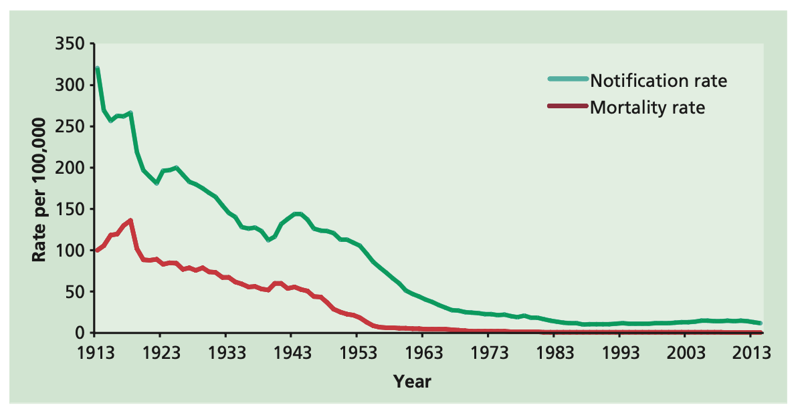

# Tuberculosis

**NOTIFIABLE**

## The disease

Human tuberculosis (TB) is caused by infection with bacteria of the _Mycobacterium tuberculosis_ complex (_M. tuberculosis_, _M. bovis_, _M. africanum_ or _M.microti_) and may affect almost any part of the body. The most common form is pulmonary TB, which accounts for almost 55% of all cases in the UK (Table 32.1).

The symptoms of TB are varied and depend on the site of infection. General symptoms may include fever, loss of appetite, weight loss, night sweats and lassitude. Pulmonary TB typically causes a persistent productive cough, which may be accompanied by blood-streaked sputum or, more rarely, frank haemoptysis. Untreated, TB in most otherwise healthy adults is a slowly progressive disease that may eventually be fatal.

Almost all cases of TB in the UK are acquired through the respiratory route, by breathing in infected respiratory droplets from a person with infectious respiratory TB. Transmission is most likely when the index case has sputum that is smear positive for the bacillus on microscopy, and often after prolonged close contact such as living in the same household.

The initial infection may:

- be eliminated
- remain latent -- where the individual has no symptoms but the TB bacteria remain in the body, or
- progress to active TB over the following weeks or months

Latent TB infection may reactivate in later life; particularly if an individual's immune system has become weakened, for example by disease (e.g. HIV), certain medical treatments (e.g. cancer chemotherapy, corticosteroids, anti-TNF) or in old age.

**Table 32.1 Site of disease in cases of TB occurring in the UK in order of frequency (Public Health England, Enhanced Tuberculosis Surveillance (ETS), (England Wales and Northern Ireland) and Enhanced Surveillance of Mycobacterial Infections (ESMI) (Scotland), data for 2015)**

| Site of disease\*          | Number of cases | % of cases \*\* |
| -------------------------- | --------------- | --------------- |
| Pulmonary                  | 3,330           | 53.5            |
| Miliary                    | 192             | 3.1             |
| Laryngeal                  | 19              | 0.3             |
| Extra-pulmonary            | 2,894           | 46.5            |
| Extra-thoracic lymph nodes | 1,420           | 22.8            |
| Intra-thoracic lymph nodes | 810             | 13.0            |
| Unknown extra-pulmonary    | 592             | 9.5             |
| Pleural                    | 507             | 8.2             |
| Other extra-pulmonary      | 422             | 6.7             |
| Gastrointestinal           | 361             | 5.8             |
| Bone-spine                 | 278             | 4.5             |
| Bone- not spine            | 144             | 2.3             |
| CNS- meningitis            | 160             | 2.6             |
| Genitourinary              | 131             | 2.1             |
| CNS- other                 | 122             | 2.0             |
| Cryptic disseminated       | 57              | 0.9             |

\* With or without disease at another site

\*\*Proportion of cases with known sites of disease (6,224), total exceeds 100% due to disease at more than one site

CNS- Central Nervous system

## History and epidemiology of the disease

Over most of the last century notifications of TB declined in the UK (Figure 32.1). In 1913, the first year of statutory notification, 117,139 new TB cases were recorded in England and Wales and this gradually declined to a low of 5,086 cases in 1987. In the late 1980s this trend reversed with TB activity rising by 65% with a peak of 8,411 newly reported TB cases in 2011. Since then activity has declined again, with 5,874 new cases reported in 2015 in England and Wales. In the UK, there has been a year-on-year decline in the number and incidence of TB cases between 2011 and 2015, down to an incidence of 9.6 per 100,000 (6,240 cases).

The resurgence of TB in the late 1980s in some parts of the UK was associated with a change in the epidemiology. Over the last 50 years, the burden of TB has shifted from the whole population to specific high risk groups. Rates of TB are higher in some non-UK born communities, mainly by virtue of their connection to parts of the world where TB is highly prevalent. In 2015, almost three-quarters of UK patients diagnosed with TB were born abroad and cases are largely concentrated in urban areas. Social factors such as homelessness, alcohol misuse, drug misuse and a history of incarceration also significantly increase the risk of acquiring TB. The epidemiological changes in the UK in the last 25 years have occurred against a background of deteriorating TB control in many parts of the world that led the World Health Organization (WHO) to declare TB a global public health emergency in 1993. Since then, several global TB strategies have been launched and in recent years some global progress in TB control has been made.

In the UK, TB mortality decreased rapidly after effective chemotherapy became available in the 1940s and the introduction of a routine adolescent Bacillus Calmette-Guérin (BCG) vaccination programme in 1953. However, between 2001 and 2014 there were still between 387 and 518 TB deaths each year in the UK (data from Public Health England). Although levels of drug-resistant and multidrug-resistant (MDR) TB remain low in the UK, the proportion of MDR/rifampicin resistant (RR)-TB increased slightly between 2000 (1.3%) and 2011 (1.8%), but has since decreased to 1.5% in 2015 (Public Health England 2016).

Figure 32.1: TB notification and mortality rates per 100,000 population per year in England and Wales

## The BCG immunisation programme

The BCG immunisation programme was introduced in the UK in 1953 and has undergone several changes in response to changing trends in TB epidemiology. The programme was initially targeted at children of school-leaving age (then 14 years), as the peak incidence of TB was in young, working-age adults.

By the 1960s, TB rates in the UK born population had declined significantly, with the burden of TB shifting to new migrants from high-prevalence countries, and their families. Recommendations were made, therefore, to protect the children of new entrants, wherever they were born, at the earliest opportunity. As part of this, a selective neonatal BCG immunisation programme was introduced to protect infants born in the UK to parents from high-prevalence countries by vaccinating them shortly after birth.

By the 1990s, uptake of BCG in schoolchildren aged 10--14 years was around 70%; a further 8% were exempt from immunisation as they were already tuberculin-positive (Department of Health). In 2005, following a continued decline in TB incidence in the UK born population, the adolescent programme was stopped. The BCG immunisation programme is now a risk-based programme, the key part being a neonatal programme targeted at those children most at risk of exposure to TB, aiming to protect them in particular from the more serious childhood forms of the disease.

## The Bacillus Calmette-Guerin (BCG) vaccine

BCG vaccine contains a live attenuated strain derived from _M. bovis_. BCG Vaccine AJV (AJ Vaccines) is the only licensed vaccine in the UK. It contains the Danish strain 1331. BCG vaccine does not contain thiomersal or any other preservatives.

International studies of the effectiveness of BCG vaccine have given widely varying results, ranging from no protection to between 70 to 80% protection as evaluated in UK school children (Sutherland and Springett, 1987, Rodrigues _et al_., 1991). However, meta-analyses have shown the vaccine to be 70 to 80% effective against the most severe forms of the disease, such as TB meningitis in children (Rodrigues _et al_., 1993). It is less effective in preventing respiratory disease, which is the more common form in adults. Protection has been shown to last for at least 15 years (WHO, 1999), with more recent studies showing protection may last up to 60 years (Aronson _et al_., 2004, Nguipdop-Djomo _et al_., 2016). Data on duration of protection after this time are limited, but protection may wane with time.

There are few data on the protection afforded by BCG vaccine when it is given to adults (aged 16 years or over), and virtually no data for persons aged 35 years or over.

BCG is not usually recommended for people aged over 16 years, unless the risk of exposure is great (e.g. healthcare or laboratory workers at occupational risk through direct clinical contact with patient diagnosed with TB or contact with infectious TB materials)

### Storage of BCG Vaccine AJV

The unreconstituted vaccine and its diluent should be stored in the original packaging at +2°C to +8°C and protected from light. If the vaccine and/or diluent has been frozen, it must not be used.

The vaccine should be reconstituted with the diluent supplied by the manufacturer and used immediately. Unused reconstituted vaccine should be discarded after four hours. The vaccine is usable for up to four hours at room temperature after reconstitution.

### Presentation of BCG Vaccine AJV

The vaccine is a freeze-dried powder for suspension for injection. BCG Vaccine AJV is supplied in a glass vial containing the equivalent of 10 adult or 20 infant doses, fitted with a bromobutyl rubber stopper which does not contain latex. The powder must be reconstituted with 1ml of the diluted Sauton AJV diluent which is supplied separately.

### Administration of BCG vaccination

In all cases, BCG vaccine must be administered strictly intradermally, normally into the lateral aspect of the left upper arm at the level of the insertion of the deltoid muscle (just above the middle of the left upper arm -- as recommended by WHO). Sites higher on the arm, and particularly the tip of the shoulder, are more likely to lead to keloid formation and should be avoided. Jet injectors and multiple puncture devices should not be used.

To ensure correct intradermal administration, the needle size is important. The intradermal technique is the most accurate method of administration because the dose can be measured precisely and the administration can be controlled. Correct administration ensures that adverse reactions are minimised

The upper arm should be positioned approximately 45° to the body. This can be achieved in older children and adults if the hand is placed on the hip with the arm abducted from the body, but in infants and younger children this will not be possible. For this age group, the arm must be held firmly in an extended position (see Chapter 4).

If the skin is visibly dirty it should be washed with soap and water. The vaccine is administered through either a specific tuberculin syringe or, alternatively, a 1ml graduated syringe fitted with a 26G 10mm (0.45mm x 10mm) needle for each individual. The correct dose (see below) of BCG vaccine should be drawn into the tuberculin syringe and the 26G short bevelled needle attached to give the injection. The needle must be attached firmly and the intradermal injection administered with the bevel facing up.

The immuniser should stretch the skin between the thumb and forefinger of one hand and with the other slowly insert the needle, with the bevel upwards, about 3mm into the superficial layers of the dermis almost parallel with the surface. The needle can usually be seen through the epidermis. A correctly given intradermal injection results in a tense, blanched, raised bleb, and considerable resistance is felt when the fluid is being injected. A bleb is typically of 7mm diameter following a 0.1ml intradermal injection, and 3mm following a 0.05ml intradermal injection. If little resistance is felt when injecting and a diffuse swelling occurs as opposed to a tense blanched bleb, the needle is too deep. The needle should be withdrawn and reinserted intradermally before more vaccine is given

**No further immunisation should be given in the arm used for BCG immunisation for at least three months because of the risk of regional lymphadenitis. The individual/parent/carer must always be advised of the normal reaction to the injection and about caring for the vaccination site (see below).**

Live vaccines, such as rotavirus, live attenuated influenza vaccine (LAIV), oral typhoid vaccine, yellow fever, varicella, zoster and MMR can be administered at any time before or after BCG vaccination (Public Health England 2015). (See Chapter 6)

### Dosage and schedule of BCG Vaccine AJV

A single dose of:

0.05ml for infants under 12 months

0.1ml for children aged 12 months or older and adults

The content of a vial of reconstituted BCG Vaccine AJV, is sufficient for either 10 or 20 declared doses, although the actual number of doses that can be extracted in practice may be lower. The extractable number of doses that can be removed from the vial of reconstituted BCG Vaccine AJV depends on the specific type of syringe and needle used as well as on the surplus of vaccine, removed by the individual vaccine administrator during vaccination.

### Disposal

BCG vaccine waste should be disposed of in accordance with the recommendations for waste classified as potentially cytotoxic / cytostatic (in a purple-lidded container).

Equipment used for immunisation, including used vials, ampoules, or discharged vaccines in a syringe, should be disposed of safely in a UN-approved puncture-resistant 'sharps' box, according to local authority regulations and guidance in the [technical memorandum 07-01](https://www.gov.uk/government/publications/environment-and-sustainability-health-technical-memorandum-07-01-safe-management-of-healthcare-waste): Safe management of healthcare waste (Department of Health, 2013).

## Recommendations for the use of the vaccine

The aim of the UK BCG immunisation programme is to immunise those at increased risk of developing severe disease and/or of exposure to TB infection.

**BCG immunisation should be offered to:**

- all infants (aged 0 to 12 months) with a parent or grandparent who was born in a country where the annual incidence of TB is 40/100,000 or greater†
- all infants (aged 0 to 12 months) living in areas of the UK where the annual incidence of TB is 40/100,000 or greater\*
- previously unvaccinated children aged one to five years with a parent or grandparent who was born in a country where the annual incidence of TB is 40/100,000 or greater.† These children should be identified at suitable opportunities, and can normally be vaccinated without tuberculin testing
- previously unvaccinated, tuberculin-negative children aged from six to under 16 years of age with a parent or grandparent who was born in a country where the annual incidence of TB is 40/100,000 or greater.† These children should be identified at suitable opportunities, tuberculin tested and vaccinated if negative (see section on tuberculin testing prior to BCG vaccination)
- previously unvaccinated tuberculin-negative individuals under 16 years of age household or equivalent close contacts of cases of sputum smear-positive pulmonary or laryngeal TB (following recommended contact management advice -- see National Institute for Health and Clinical Excellence ([NICE](https://www.nice.org.uk/guidance/ng33/resources/tuberculosis-1837390683589)), 2016)
- previously unvaccinated, tuberculin-negative individuals under 16 years of age who were born in or who have lived for a prolonged period (at least three months) in a country with an annual TB incidence of 40/100,000 or greater.

\* Universal vaccination operates in areas of the country where the TB incidence is 40/100,000 or greater. This is applied for operational reasons since these geographical areas generally have a high concentration of families who come from regions of the world where the TB incidence is 40/100,000 or greater and therefore a higher potential for transmission events. The decision to introduce universal vaccination in an area is based on geography in order to target vaccination to children who may be at increased risk of TB in an effective way. It does not imply that living in areas that have an incidence of TB 40/100,000 or greater puts children at increased risk of TB infection. This is because most infections of children are likely to occur in household settings. In addition, there has been little evidence of TB transmission in schools in the UK.

† For country information on prevalence see: https://www.gov.uk/government/publications/tuberculosis-tb-by-country-rates-per-100000-people

### Individuals at occupational risk

People in the following occupational groups, with direct TB patient contact or contact with infectious materials, should be vaccinated with BCG.

1. Healthcare worker (HCW) or laboratory worker, who has either direct contact with TB patients or with potentially infectious clinical materials or derived isolates.
2. Veterinary and staff such as abattoir workers who handle animals or animal materials, which could be infected with TB.

BCG is recommended for unvaccinated, tuberculin-negative individuals in these occupations. BCG efficacy data in adults over the age of 35 years is scarce. Nevertheless, because these groups have a high exposure risk, and given the absence of safety concerns, it is likely that benefits outweigh risks for vaccinating individuals over the age of 35 years with BCG. In addition, there are a number of occupational groups who are working with persons at higher risk of acquiring TB. These include staff working with prisoners, homeless persons, persons with drug and alcohol misuse and those who work with refugees and asylum seekers. BCG vaccination may also be considered for these groups.

It should be noted that the risk of exposure of HCWs other than those listed in the category above is unlikely to exceed the background risk of TB the general population and therefore vaccination is not routinely required.

### Travellers and those going to reside abroad

BCG may be required for previously unvaccinated, tuberculin-negative individuals according to the destination and the nature of travel (Cobelens _et al_., 2000) (Abubakar _et al._, 2011).

The risk of a traveller acquiring TB infection depends on several factors including the incidence of TB in that country, the duration of travel, the degree of contact with the local population, the work setting of the traveller (if any), the reason for travel and the susceptibility and age of the traveller. The risk of tourists acquiring TB infection is low and BCG is not required if no other factors are present.

The vaccine is recommended for the following groups of people travelling for more than three months to a country where the annual incidence of TB is 40/100,000 or greater and/or where the risk of Multi Drug Resistant -TB (MDR-TB) is high†:

- those under 16 years who are travelling to stay with friends / family or local people
- HCWs in settings that are of high risk of exposure to patients diagnosed with TB, particularly MDR-TB

† For country information with high rates of MDR-TB see: http://www.who.int/tb/publications/global_report/en/

### Individual requests for BCG vaccination

People seeking vaccination for themselves or their children should be assessed for specific risk factors for TB. Those without risk factors should not be offered BCG vaccination but should be advised of the current policy and given written information. Further information is available at https://www.gov.uk/government/collections/immunisation#tuberculosis. People with risk factors should be tuberculin tested and offered BCG vaccination according to local service arrangements.

### Repeat BCG vaccination

Although the protection afforded by BCG vaccine may wane with time, there is no evidence that repeat vaccination offers significant additional protection and therefore repeat BCG vaccination is not recommended.

## Contraindications

The vaccine should not be given to:

- those who have already had a BCG vaccination
- those with a past history of TB
- those with an induration of 5mm or more following Mantoux (AJV) tuberculin skin testing
- those who have had a confirmed anaphylactic reaction to a component of the vaccine
- children less than two years of age in a household where an active TB case is suspected or confirmed
- infants born to a mother who received immunosuppressive biological therapy during pregnancy (see below)
- Those who are receiving, or have received in the past 6 months,
  - immunosuppressive chemotherapy or radiotherapy for malignant disease or non-malignant disorders
  - immunosuppressive therapy for a solid organ transplant (with exceptions, depending upon the type of transplant and the immune status of the patient)
- Those who are receiving or have received in the past 12 months
  - immunosuppressive biological therapy (e.g. anti-TNF therapy such as alemtuzumab, ofatumumab and rituximab) unless otherwise directed by a specialist.
- Those who are receiving or have received in the past 3 months immunosuppressive therapy including:
  - Adults and children on high-dose corticosteroids (>40mg prednisolone per day or >2mg/kg/day in children under 20kg) for more than 1 week
  - Adults and children on lower dose corticosteroids (>20mg prednisolone per day or >1mg/kg/day in children under 20kg) for more than 14 days
  - non-biological oral immune modulating drugs e.g. methotrexate >25mg per week, azathioprine >3.0mg/kg/day or 6-mercaptopurine >1.5mg/kg/day
  - for children on non-biological oral immune modulating drugs (except those on low doses, refer to chapter 6), specialist advice should be sought prior to vaccination

For further information see Chapter 6 -- Contraindications and special considerations

BCG vaccine is absolutely contraindicated in all HIV-positive persons regardless of CD4 cell count, ART use, viral load, and clinical status (BHIVA 2015). Infants born to HIV positive mothers should only be given BCG vaccination when the exclusively formula-fed infant is confirmed HIV uninfected at 12--14 weeks. However, infants considered at low risk of HIV transmission (maternal VL <50 HIV RNA copies/mL at or after 36 weeks' gestation) but with a high risk of tuberculosis exposure may be given BCG at birth (British HIV Association 2014).

Some cases of fatal BCG infection in infants after in utero exposure to TNF α antagonist have been reported through the [Yellow Card scheme](https://yellowcard.mhra.gov.uk/). Immunisation with live vaccines, including BCG, should be delayed for 6 months in children born of mothers who were on immunosuppressive biological therapy during pregnancy. If there is any doubt as to whether an infant due to receive a live attenuated vaccine may be immunosuppressed due to the mother's therapy, including exposure through breast-feeding, specialist advice should be sought.

For further information see Chapter 6 -- Contraindications and special considerations

## Precautions

Minor illnesses without fever or systemic upset are not valid reasons to postpone immunisation.

If an individual is acutely unwell, immunisation should be postponed until they have fully recovered. This is to avoid confusing the differential diagnosis of any acute illness by wrongly attributing any sign or symptoms to the adverse effects of the vaccine.

Individuals with generalised septic skin conditions should not be vaccinated. If eczema exists, an immunisation site should be chosen that is free from skin lesions.

### Pregnancy and breast-feeding

BCG vaccination should not be given during pregnancy. Even though no harmful effects of BCG vaccination on the foetus have been observed, further studies are needed to prove its safety (WHO 2004).

Breast-feeding is not a contraindication to BCG, however if there is any doubt as to whether an infant due to receive BCG vaccine may be immunosuppressed due to the mother's therapy, including exposure through breastfeeding, specialist advice should be sought.

### Premature infants

It is important that premature infants have their immunisations at the appropriate chronological age, according to the schedule. The potential risk of apnoea and the need for respiratory monitoring for 48-72h should be considered when administering to very premature infants (born ≤ 28 weeks of gestation) and particularly for those with a previous history of respiratory immaturity. As the benefit of vaccination is high in this group of infants, vaccination should not be withheld or delayed.

### Previous BCG vaccination

BCG should not be administered to previously vaccinated individuals as there is an increased risk of adverse reactions and no evidence of additional protection. Evidence of a previous BCG vaccination includes: documentary evidence; a clear, reliable history of vaccination; or evidence of a characteristic scar.

**Determining a reliable history of BCG vaccination may be complicated by:**

- absent or limited documentary evidence
- unreliable recall of vaccination
- absence of a characteristic scar in some individuals vaccinated intradermally
- absence of a scar in a high proportion of individuals vaccinated percutaneously
- use of non-standard vaccination sites

Individuals with an uncertain history of prior BCG vaccination should be tuberculin tested before being given BCG. The final decision whether to offer BCG, where there is a possible history of previous vaccination but no proof, must balance the risk of possible revaccination against the potential benefit of vaccination and the individual's risk of exposure to TB, particularly in an occupational setting.

### Immunisation reaction and care of the immunisation site

The expected reaction to successful BCG vaccination, seen in 90 to 95% of recipients, is induration at the injection site followed by a local lesion which starts as a papule two or more weeks after vaccination. It may ulcerate and then slowly subside over several weeks or months to heal, leaving a small, flat scar. It may also include enlargement of a regional lymph node to less than 1cm.

It is not necessary to protect the site from becoming wet during washing and bathing. The injection site is best left uncovered to facilitate healing. The ulcer should be encouraged to dry, and abrasion (by tight clothes, for example) should be avoided. Should any oozing occur, a temporary dry dressing may be used until a scab forms. It is essential that air is not excluded. If absolutely essential (e.g. to permit swimming), an impervious dressing may be used but it should be applied only for a short period as it may delay healing and cause a larger scar. The possibility of bacterial superinfection in a discharging lesion should be considered.

Further observation after routine vaccination with BCG is not necessary, other than as part of monitoring of the quality of the programme, nor is further tuberculin testing recommended.

## Adverse reactions

Severe injection site reactions, large, local discharging ulcers, abscesses and keloid scarring are most commonly caused by faulty injection technique, excessive dosage or vaccinating individuals who are tuberculin positive. It is essential that all health professionals are properly trained in all aspects of the process involved in tuberculin skin tests and BCG vaccination.

### Other adverse reactions

Adverse reactions to the vaccine include headache, fever and enlargement of a regional lymph node to greater than 1cm, which may ulcerate.

Allergic reactions (including anaphylactic reactions), more severe local reactions such as abscess formation, and disseminated BCG complications (such as osteitis or osteomyelitis) are rare and should be managed by a specialist.

All serious or unusual adverse reactions possibly associated with BCG vaccination (including abscess and keloid scarring) should be recorded and reported to the Commission on Human Medicines through the [Yellow Card scheme](https://yellowcard.mhra.gov.uk/), and vaccination protocols and techniques should be reviewed. Every effort should be made to recover and identify the causative organism from any lesion constituting a serious complication.

### Management of adverse reactions

Individuals with severe local reactions (ulceration greater than 1cm, caseous lesions, abscesses or drainage at the injection site) or with regional suppurative lymphadenitis with draining sinuses following BCG vaccination should be referred to a TB physician or paediatrician for investigation and management.

An adherent, suppurating or fistulated lymph node may be aspirated, and left to heal (Cuello-Garcia _et al_., 2013) (Hart _et al_., 2013). There is little evidence to support the use of either locally instilled anti-mycobacterial agents or systemic treatment of patients with severe persistent lesions.

Disseminated BCG infection should be referred to a TB physician or paediatrician for specialist advice and will normally require systemic anti-TB treatment following current guidance for managing _M. bovis_ infection (Joint Tuberculosis Committee of the British Thoracic Society, 2000, and NICE, 2016).

BCG, like all strains of M. _bovis,_ is intrinsically resistant to pyrazinamide. In vitro testing has shown that BCG is susceptible to Rifampicin and although some strains of BCG demonstrate low-level resistance to isoniazid, this may not be clinically significant. Clinicians treating cases of infection with BCG strains are advised to seek specialist advice.

### Overdose

Overdose increases the risk of a severe local reaction and suppurative lymphadenitis, and may lead to excessive scar formation. The extent of the reaction is likely to depend on whether any -- and how much -- of the vaccine was injected subcutaneously or intramuscularly instead of intradermally.

Any incident resulting in administration of an overdose of BCG vaccine should be documented according to local policy. The vaccine recipient or their carer and the local TB physician/paediatrician should be informed. The clinician should decide whether preventive chemotherapy is indicated and ensure arrangements are made for appropriate monitoring for early signs of an adverse reaction.

## Tuberculin skin testing prior to BCG immunisation -- the Mantoux test

**BCG should not be administered to an individual with a positive tuberculin test -- it is unnecessary and may cause a more severe local reaction. Those with a Mantoux (AJV) tuberculin skin test induration of 5mm and greater should be referred to a TB clinic for assessment of the need for further investigation and treatment**

A tuberculin skin test is necessary prior to BCG vaccination for:

- all individuals aged six years or over
- infants and children under six years of age with a history of residence or prolonged stay (more than three months) in a country with an annual TB incidence of 40/100,000 or greater
- those who have had close contact with a person with known TB
- those who have a family history of TB within the last five years

BCG can be given up to three months following a negative tuberculin test.

The Mantoux test is used as a screening test for tuberculosis infection or disease and as an aid to diagnosis. The local skin reaction to tuberculin purified protein derivative (PPD) injected into the skin is used to assess an individual's sensitivity to tuberculin protein. The greater the reaction, the more likely it is that an individual is infected or has active TB disease.

**The standard test for use in the UK is the Mantoux test using 2TU/0.1ml tuberculin PPD.**

### Purified protein derivative

**Storage**

Tuberculin PPD AJV should be stored in the original packaging at +2°C to+8°C and protected from light. Freezing may cause loss of activity.

**Presentation**

Tuberculin PPD used in the UK is supplied by AJ Vaccines is a sterile preparation made from a culture of seven selected strains of _M. tuberculosis_. It is available as a clear colourless to light yellow solution for injection. It is supplied in a glass vial with a chlorobutyl rubber stopper that does not contain latex

**Dosage**

0.1ml of the appropriate tuberculin PPD preparation.

In the UK, the standard concentration of Purified Protein Derivative (PPD) 2TU/0.1ml is used for routine Mantoux testing to identify latent TB infection among contacts of active TB cases, migrants and in individuals prior to immunosuppressive therapy.

Where the first Mantoux test (PPD 2TU) is negative (less than 5 mm in diameter) and a retest is considered appropriate for clinical purposes (e.g. in immunocompromised patients/contacts where the Mantoux test response is considered less than reliable), PHE recommends using Interferon Gamma Release Assay (IGRA) testing together with a Mantoux test using PPD 2TU.

Additional information on IGRA testing is available at: https://www.gov.uk/government/publications/tuberculosis-tb-interferon-gamma-release-assay-tests

### Administration of the Mantoux test

In all cases, the Mantoux test should be administered intradermally (sometimes referred to as intracutaneous administration) normally on the flexor surface of the left forearm at the junction of the upper third with the lower two-thirds.

If the skin is visibly dirty it should be washed with soap and water. The Mantoux test is performed using the 0.1ml tuberculin syringe or, alternatively, a 1ml graduated syringe fitted with a short bevel 26G (0.45mm 10mm) needle. A separate syringe and needle must be used for each subject to prevent cross-infection. 0.1ml of PPD should be drawn into the tuberculin syringe and the 25G or 26G short bevelled needle attached to give the injection. The needle must be attached firmly and the intradermal injection administered with the bevel uppermost.

The operator stretches the skin between the thumb and forefinger of one hand and with the other slowly inserts the needle, with the bevel upwards, about 3mm into the superficial layers of the dermis almost parallel with the surface. The needle can usually be seen through the epidermis. A correctly given intradermal injection results in a tense, blanched, raised bleb, and considerable resistance is felt when the fluid is being injected. A bleb is typically of 7mm diameter following 0.1ml intradermal injection. If little resistance is felt when injecting and a diffuse swelling occurs as opposed to a tense, blanched bleb, the needle is too deep. The needle should be withdrawn and reinserted intradermally.

Mantoux tests can be undertaken at the same time as inactivated vaccines are administered. Live viral vaccines can suppress the tuberculin response, and therefore testing should not be carried out within four weeks of having received an injectable live viral vaccine such as MMR. Where MMR is not required urgently it should be delayed until the Mantoux has been read (see below).

### Disposal

Equipment used for Mantoux testing, including used vials or ampoules, should be disposed of at the end of a session by sealing in a proper, puncture-resistant 'sharps' box (UN-approved, BS 7320).

### Reading the Mantoux test

The results should be read 48 to 72 hours after the test is taken, but a valid reading can usually be obtained up to 96 hours later. The transverse diameter of the area of induration at the injection site is measured with a ruler and the result recorded in millimetres. As several factors affect interpretation of the test, the size of the induration should be recorded and NOT just as a negative or positive result. The area of erythema is irrelevant.

There is some variability in the time at which the test develops its maximum response. The majority of tuberculin-sensitive subjects will be positive at the recommended time of reading. A few, however, may have their maximum response just before or after the standard time.

### Interpretation of the Mantoux test

For convenience, responses to the Mantoux test are divided as follows:

| Diameter of induration | Interpretation                                                    | Action                                                                                                                                                                                                    |
| ---------------------- | ----------------------------------------------------------------- | --------------------------------------------------------------------------------------------------------------------------------------------------------------------------------------------------------- |
| Less than 5mm          | Negative -- no significant hypersensitivity to tuberculin protein | Previously unvaccinated individuals may be given BCG provided there are no contraindications                                                                                                              |
| 5mm or greater \*      | Positive -- hypersensitive to tuberculin protein                  | BCG vaccination should not be given. The individual should be referred for further investigation in line with [NICE](https://www.nice.org.uk/guidance/ng33/resources/tuberculosis-1837390683589) guidance |

\*Prior BCG may lead to a weakly positive tuberculin skin test results. However, economic modelling by NICE suggests that the treatment for latent TB of all Mantoux tests positive individuals irrespective of prior BCG is cost effective. For the purpose of assessing whether an individual might benefit from BCG vaccination, a positive Mantoux test or interferon gamma release assay (IGRA) indicating prior sensitization is an indication not to administer BCG. A Mantoux with an induration of less than 5 mm would indicate that a person would benefit from BCG, while a negative interferon gamma release assay should not be used as the sole basis for a decision to give BCG. In the absence of a Mantoux test, persons with negative IGRA results should only be given BCG in the absence of a documented record of prior BCG, a BCG scar or reliable history of BCG vaccination.

### Factors affecting the result of the tuberculin test

The reaction to tuberculin protein may be suppressed by the following:

- glandular fever
- viral infections such as measles and varicella zoster (chickenpox) but NOT upper respiratory tract infections or gastroenteritis (Starr _et al_.,1964) (Mitchell _et al_.,1935)
- live viral vaccines (tuberculin testing should not be carried out within four weeks of having received an injectable live viral vaccine)
- sarcoidosis
- corticosteroid therapy
- immunosuppression due to disease or treatment, including HIV infection

Subjects who have a negative test but who may have had a significant infection (such as measles, varicella zoster (chickenpox), scarlet fever, glandular fever) at the time of testing or at the time of reading should be re-tested two to three weeks after clinical recovery before being given BCG. If a second tuberculin test is necessary it should be carried out on the other arm: repeat testing at one site may alter the reactivity either by hypo- or more often hyper-sensitising the skin, and a changed response may reflect local changes in skin sensitivity only.

## Management of contacts of Pulmonary/laryngeal TB

Household contact or contacts with exposure equivalent to that of household contacts or equivalent contacts of cases of sputum smear-positive pulmonary or laryngeal TB should be managed in line with [NICE](https://www.nice.org.uk/guidance/ng33/resources/tuberculosis-1837390683589) guidance.

Children less than two years of age who have contact with a smear-positive case of pulmonary or laryngeal TB should be given chemoprophylaxis immediately, even if their initial tuberculin skin test is negative and then tuberculin tested after six weeks. If the skin test is negative, BCG vaccine is given

New born babies who are contacts of a TB case that is not smear positive should be immunised with BCG immediately.

## Supplies

BCG vaccine is available in England, Wales and Scotland from:

ImmForm Tel: 0844 376 0040.

Website: https://www.immform.dh.gov.uk

If not already registered on ImmForm you will need register in good time before placing an order.

In Northern Ireland, supplies should be obtained under the normal childhood vaccines distribution arrangements, details of which are available by contacting the Regional Pharmaceutical Procurement Service on 028 9442 4089.

## References

Abubakar I, Matthews T, Harmer D, Okereke E, Crawford K, Hall T, Collyns T, Smith G, Barrett A, Baugh S. Assessing the effect of foreign travel and protection by BCG vaccination on the spread of tuberculosis in a low incidence country, United Kingdom, October 2008 to December 2009. Euro Surveill. 2011;16(12):pii=19826. Available online: http://www.eurosurveillance.org/ViewArticle.aspx?ArticleId=19826

Aronson NE, Santosham M, Comstock GW, Howard RS, Moulton LH, Rhoades ER, et al. Long-term efficacy of BCG vaccine in American Indians and Alaska Natives: a 60-year follow-up study. _Jama_ 2004; 291(May 5 (17)):2086--91

British HIV Association Guidelines for the Management of HIV Infection in Pregnant Women (2014). Available online from: http://www.bhiva.org/documents/Guidelines/Pregnancy/2012/BHIVA-Pregnancy-guidelines-update-2014.pdf

BHIVA guidelines on the use of vaccines in HIV-positive adults (2015). Available online from: http://www.bhiva.org/vaccination-guidelines.aspx

Cobelens FG, van Deutekom H, Draayer-Jansen IW _et al._ (2000) Risk of infection with _Mycobacterium tuberculosis_ in travellers to areas of high tuberculosis endemicity. _Lancet_ 356: 461--5.

Cuello-García CA1, Pérez-Gaxiola G, Jiménez Gutiérrez C (2013) Treating BCG-induced disease in children. _Cochrane Database Syst Rev._ 2013 Jan 31;(1):CD008300

Global TB report 2016 Available online http://www.who.int/tb/publications/global_report/en/

Hart N, Broomfield C (2013) Management of BCG Related Lymphadenitis. http://bestbets.org/bets/bet.php?id=2449

Joint Tuberculosis Committee of the British Thoracic Society (2000) Control and prevention of tuberculosis in the United Kingdom: Code of Practice 2000. _Thorax_ 55: 887--901.

Klein NP, Massolo ML, Greene J _et al._ (2008) Risk factors for developing apnea after immunization in the neonatal intensive care unit. _Pediatrics_ 121(3): 463-9.

Medicines and Healthcare products Regulatory Agency. (2016) Drug Safety Update. Available online from: https://www.gov.uk/drug-safety-update/live-attenuated-vaccines-avoid-use-in-those-who-are-clinically-immunosuppressed

Mitchell AG, Nelson WE, LeBlanc TJ (1935) Studies in immunity. V. Effect of acute diseases on the reaction of the skin to tuberculin. _Am J Dis Child_ 49:695-702,

National Institute for Health and Clinical Excellence (2006) _Tuberculosis: Clinical diagnosis and management of tuberculosis, and measures for its prevention and control_ (CG33). https://www.nice.org.uk/page.aspx?o=CG033.

National Institute for Health and Clinical Excellence (2016) _Tuberculosis: Clinical diagnosis and management of tuberculosis, and measures for its prevention and control_ (NG33). Available online from: https://www.nice.org.uk/guidance/ng33/resources/tuberculosis-1837390683589

Nguipdop-Djomo P, Einar H, Rodrigues LC et al. (2016) Duration of BCG protection against tuberculosis and change in effectiveness with time since vaccination in Norway: a retrospective population-based cohort study. _The Lancet Infectious Diseases_, 16 (2): 219 - 226

Ohlsson A and Lacy JB (2004) Intravenous immunoglobulin for preventing infection in preterm and/or low-birth-weight infants. _Cochrane Database Syst Rev_(1): CD000361.

Pfister RE, Aeschbach V, Niksic-Stuber V _et al._ (2004) Safety of DTaP-based combined immunization in very-low-birth-weight premature infants: frequent but mostly benign cardiorespiratory events. _J Pediatr_ 145(1): 58-66.

Pourcyrous M, Korones SB, Arheart KL _et al._ (2007) Primary immunization of premature infants with gestational age <35 weeks: cardiorespiratory complications and C-reactive protein responses associated with administration of single and multiple separate vaccines simultaneously. _J Pediatr_ 151(2): 167-72.Public Health England (2016)

Reports of cases of tuberculosis to enhanced tuberculosis surveillance systems: UK, 2000 to 2015.Available online:https://www.gov.uk/government/uploads/system/uploads/attachment_data/file/555298/TB_Official_Statistics_2016_GTW2309.pdf

Public Health England (2015) Revised recommendations for the administration of more than one live vaccine. Available online: https://www.gov.uk/government/uploads/system/uploads/attachment_data/file/422798/PHE_recommendations_for_administering_more_than_one_live_vaccine_April_2015FINAL_.pdf

Rodrigues LC, Gill ON and Smith PG (1991) BCG vaccination in the first year of life protects children of Indian subcontinent ethnic origin against tuberculosis in England. _Epidemiol Community Health_ 45: 78--80.

Rodrigues LC, Diwan VK and Wheeler JG (1993) Protective effect of BCG against tuberculous meningitis and military tuberculosis: a meta-analysis. _Int J Epidemiol_ 22: 1154--8.

Schulzke S, Heininger U, Lucking-Famira M _et al._ (2005) Apnoea and bradycardia in preterm infants following immunisation with pentavalent or hexavalent vaccines. _Eur J Pediatr_ 164(7): 432-5.

Starr S, Berkovich S (1964) The depression of tuberculin reactivity during chickenpox. _Pediatrics_ 33:769-72.

Sutherland I and Springett VH (1987) Effectiveness of BCG vaccination in England and Wales in 1983. _Tubercle_ 68: 81--92.

World Health Organization (1999) Issues relating to the use of BCG in immunization programmes. A discussion document by Paul WM Fine, Ilona AM Carneiro, Julie B Milstien and C John Clements. https://www.who.int/entity/vaccine_research/documents/en/bcg_vaccines.pdf

World Health Organization (2004) Weekly epidemiological record. Available online: http://www.who.int/wer/2004/en/wer7904.pdf?ua=1
