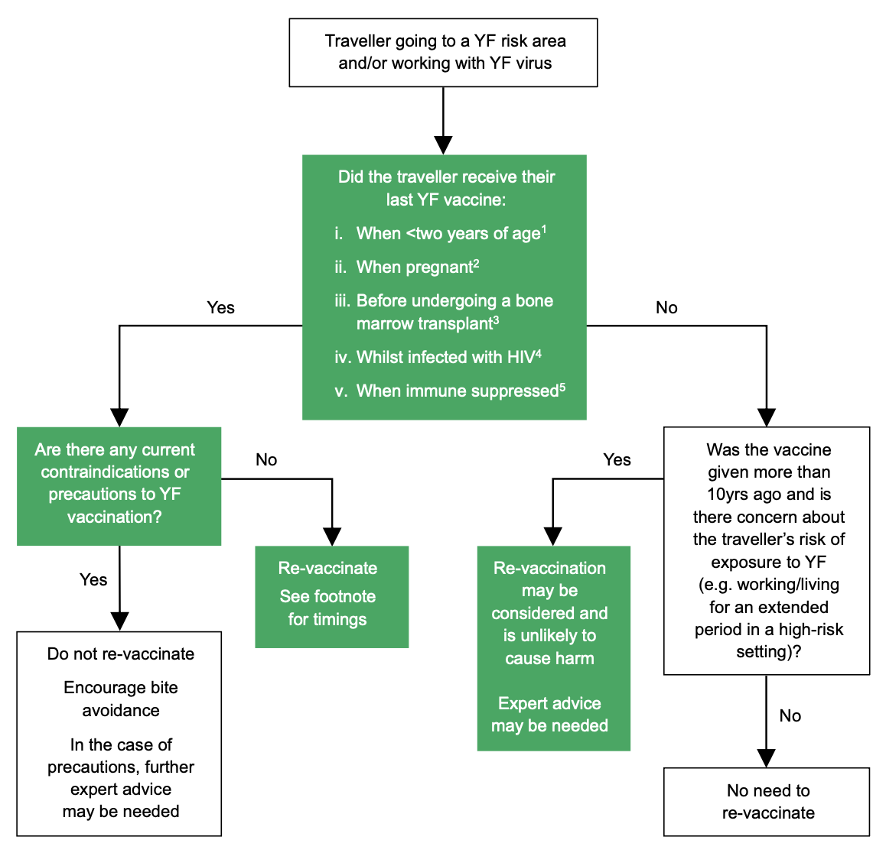

# Yellow fever

**NOTIFIABLE**

## The disease

Yellow fever is an acute flavivirus infection spread by the bite of an infected mosquito. The disease occurs in parts of the tropical and sub-tropical regions of Africa and South and Central America (including Trinidad) (see maps on the Yellow Fever Zone website of the National Travel Health Network and Centre (NaTHNaC), https://nathnacyfzone.org.uk/factsheet/60/yellow-fever-vaccine-recommendation-maps). Locally acquired cases have never been reported in Asia despite the presence of the vector.

Three epidemiological patterns of yellow fever are recognised -- urban, savannah and jungle -- although the disease is clinically and aetiologically identical. In urban yellow fever, the viral reservoir is man and the disease is spread between humans primarily by the _Aedes aegypti_ mosquitoes that live and breed in close association with humans. In Africa, an intermediate (savannah) cycle exists that involves transmission of virus from mosquitoes to humans living or working in jungle border areas. In this cycle, the virus can be transmitted from monkey to human or from human to human via mosquitoes.

Jungle yellow fever is transmitted among non-human hosts (mainly monkeys) by forest mosquitoes. Humans may become infected when they enter into the forest habitat and can become the source of urban outbreaks.

Yellow fever can reappear with outbreaks after long intervals of apparent quiescence. Rural populations are at greatest risk of yellow fever but urban outbreaks do occur in Africa. Urban populations in South and Central America are also at risk due to city centres being re-infested with _A.aegypti_ and increased population movement in to and out of endemic areas.

Yellow fever ranges in severity from sub-clinical, to non-specific, self-limited symptoms of fever, malaise, photophobia and headache to an illness of sudden onset with fever, vomiting and prostration which may progress to jaundice and haemorrhage. Approximately 15% of persons infected with yellow fever virus develop moderate to severe illness. Case fatality rates vary widely, in part due to missed mild cases and possibly reflecting the differences in virulence of viral strains. Some studies have estimated a case fatality rate of 20% in West African patients with jaundice (Monath _et al_., 2013). In non-immune travellers and migrants, and during epidemics in areas that have low levels of yellow fever activity, the case fatality rate can exceed 50% (Monath, 2004). The incubation period is generally three to six days but may be longer. Death usually occurs seven to ten days after the onset of illness. Infection results in lifelong immunity in those who recover.

There is no specific treatment for yellow fever. Preventive measures such as the eradication of _Aedes_ mosquitoes, protection from mosquito bites, and immunisation reduce the risk. Jungle yellow fever can only be prevented by yellow fever immunisation and personal protection against mosquito bites because of the wide range and distribution of mosquito vectors and mammalian hosts.

There is no risk of transmission in the UK from imported cases since the mosquito vector does not occur in the UK.

## History and epidemiology of the disease

Sequence analysis of the viral genome suggests that yellow fever virus originated in Africa about 3000 years ago (Zanotto _et al_., 1996). However, the earliest record of an epidemic was in the Yucatan in Mexico in 1648. The term 'yellow fever' was first used in an outbreak that occurred in Barbados in 1750. The disease became a major problem in the colonial settlements of the Americas and West Africa in the 1700s and was repeatedly introduced into seaports of the United States and Europe during this time (Monath _et al_., 2013).

Transmission of yellow fever by mosquitoes was first postulated by Josiah Clark Nott in 1848 and confirmed by Walter Reed and colleagues in Cuba in 1900. The live, attenuated vaccine that remains in use today was developed in the 1930s. In the early 1990s, World Health Organization estimated that 200,000 cases and 30,000 deaths occur annually (World Health Organization, 2013). A more recent modelling study of disease burden in Africa estimated there to be 130,000 (95% CI 51,000-380,000) cases of severe YF in 2013, resulting in 78,000 (95% CI 19,000-180,000) deaths (Garske _et al._, 2014).

## The yellow fever vaccination

Yellow fever vaccine is a live, attenuated preparation of the 17D strain of yellow fever virus grown in specific pathogen-free embryonated chick eggs. Each 0.5ml dose contains not less than 1000 IU.

### Storage

Vaccines should be stored in the original packaging at +2°C to +8°C and protected from light. All vaccines are sensitive to some extent to heat and cold. Heat speeds up the decline in potency of most vaccines, thus reducing their shelf life. Effectiveness cannot be guaranteed for vaccines unless they have been stored at the correct temperature. Freezing may cause increased reactogenicity and loss of potency for some vaccines. It can also cause hairline cracks in the container, leading to contamination of the contents.

### Presentation

The yellow fever vaccine is available as a lyophilised powder for reconstitution with a diluent.

Yellow fever vaccines are thiomersal-free. They contain live organisms which have been attenuated (modified).

### Dosage and schedule

First dose is 0.5ml of reconstituted vaccine. Further doses should be given at the recommended intervals if required.

### Administration

The vaccines should be reconstituted with the diluent supplied by the manufacturer and either used within an hour or discarded.

Doses of 0.5ml of yellow fever vaccine should be given by deep subcutaneous or intramuscular injection irrespective of age.

Yellow fever vaccine can be given at any time in relationship to other inactivated and most live vaccines (UK Health Security Agency, 2022), with the exception of MMR where these two vaccines should be given 28 days apart. This is because there are some data to suggest sub-optimal antibody responses to yellow fever, mumps and rubella antigens when yellow fever vaccine is co-administered with MMR vaccine (Nascimento _et al_., 2011). Where protection is required rapidly then the two vaccines should be given at any interval. An additional dose of MMR should be considered and re-vaccination with the yellow fever vaccine can also be considered on a case-by-case basis for those at on-going risk. There are no additional risks associated with re-vaccination for those without contraindications. The vaccines should be given at separate sites, preferably in a different limb. If given in the same limb, they should be given at least 2.5cm apart (American Academy of Pediatrics, 2003). The site at which each vaccine was given should be noted in the patient's records.

### Disposal

Equipment used for vaccination, including used vials, ampoules, or partially discharged vaccines should be disposed of at the end of a session by sealing in a proper, puncture- resistant 'sharps' box according to local authority regulations and guidance in _Health Technical Memorandum 07-01: Safe management of healthcare waste_ (NHS England, 2013).

## Recommendations for the use of the vaccine (including re-immunisation)

The objectives of the immunisation programme are to provide a minimum of one dose of yellow fever vaccine for individuals at risk of yellow fever and to prevent the international spread of yellow fever. The latter aims to prevent infected individuals introducing the virus into areas where the presence of mosquito vectors and an appropriate host could support the establishment of yellow fever.

A single dose correctly administered confers immunity in 95 to 100% of recipients. Data suggests that with some exceptions, most vaccine recipients will maintain protective antibody titers for potentially several decades, or possibly life-long, following vaccination (WHO Strategic Advisory Group of Experts (SAGE), 2013).

The following groups should be immunised:

- laboratory workers handling infected material.
- persons aged nine months or older who are travelling to or living in areas or countries with a risk of yellow fever transmission (see YF vaccination maps on https://travelhealthpro.org.uk), even if these countries do not require evidence of immunisation on entry.
- persons aged nine months or older who are travelling to or living in countries that require an International Certificate of Vaccination or Prophylaxis (ICVP) for entry.

Careful risk assessment should be made before administration of the vaccine - see contraindications and precautions below.

Immunisation should be performed at least ten days prior to travel to an endemic area to allow protective immunity to develop and for the ICVP (if required) to become valid. However, vaccine should still be considered for last minute travellers who should also be counselled about the importance of insect bite precautions and possible implications of an invalid ICVP.

### Reinforcing immunisation

The WHO Strategic Advisory Group of Experts (SAGE) on Immunization state that (based on currently available data, a single dose of yellow fever vaccine appears to confer life-long protective immunity against yellow fever disease. Therefore, with some exceptions, a booster dose of yellow fever vaccine is not needed to maintain immunity (WHO Strategic Advisory Group of Experts (SAGE), 2013).

Reinforcing immunisation should be offered to a small subset of individuals at continued risk who may not have developed long term protection from their initial yellow fever vaccination (see Figure 35.1). This includes those who received their initial yellow fever vaccination:

- when aged less than two years old
- during pregnancy
- whilst infected with HIV
- when immune suppressed
- before undergoing a bone marrow transplant

Figure 35.1 Reinforcing immunisation

1. Reinforcing immunisation recommended once the child is 2 years or older depending on next planned travel to risk area. Seroprotection rates wane 3 months to 5 years following primary vaccination in some children who are vaccinated under 2 years of age (Kling _et al_., 2022)
2. Data on efficacy during pregnancy are variable. One study of pregnant women vaccinated during a mass campaign in Nigeria in the 1990s found that only 39% of pregnant women seroconverted after receiving the vaccine during the third trimester (Nasidi _et al_., 1993). Until further information is available, pregnant women should be offered a reinforcing immunisation after their pregnancy if they are at continued risk. The timing of this vaccination also needs to consider the breastfeeding precaution.
3. Antibody titres to vaccine-preventable diseases decline during the 1--10 years after allogeneic or autologous bone marrow/stem cell transplant (Ljungman _et al_., 2009, Miller _et al_., 2023, UK Health Security Agency, 2020). Revaccination may be considered from 24 months following transplant if recipient demonstrated not to have immune suppression or graft versus host disease, or is in remission following autologous transplant (UK Health Security Agency, 2017)
4. BHIVA guidelines for adults recommend reinforcing immunisation at 10 years for those at continued risk if under 60yrs of age and well enough to receive live vaccine -- see guidance below (BHIVA, 2015)
5. Travellers who were vaccinated in error while immune suppressed may not have long term protection following a single dose of yellow fever vaccine (Kling _et al_., 2022). Depending on the immune status at the time, revaccination should be considered for those at continued risk when there are no contraindications.

In certain situations where there is concern about a traveller's risk of exposure to yellow fever (e.g. working/living for an extended period in a high risk setting) a booster dose of YF vaccine can be considered -- expert advice can be sought from NaTHNaC (https://travelhealthpro.org.uk) or Public Health Scotland (https://www.travax.nhs.uk).

From 11 July 2016 (for all countries), the yellow fever vaccine certificate (ICVP) will be valid for the duration of the life of the person vaccinated. WHO state that a valid certificate, presented by arriving travellers, cannot be rejected on the grounds that more than ten years have passed since the date vaccination became effective as stated on the certificate; and that boosters or revaccination cannot be required (WHO, 2016).

### Risk assessment for travel

Yellow fever is a life-threatening viral infection and protective measures against the disease are essential for anyone travelling to an area where there is a risk of infection. Yellow fever vaccine is highly effective and is the best way to protect those at risk of disease during travel. As the risk of serious adverse events from vaccination is small, for most people, the balance between the benefits and possible side effects of the vaccine remains overwhelmingly favourable (CHM, 2019). However, because the vaccine contains a live, attenuated strain of the yellow fever virus, strict adherence to contraindications and precautions is essential to reduce the risk of serious side effects in those who may have a higher risk because of age, a weakened immune system or an underlying medical condition (see precautions and contraindications below).

With the recognition of rare severe adverse events related to yellow fever vaccine (Centers for Disease Control and Prevention (CDC), 2002; Kitchener, 2004; CHM, 2019), it is critical to make a careful risk assessment prior to administering vaccine weighing the risk of acquiring infection against the risk of a serious adverse event from the vaccine. Itineraries should be scrutinised to ensure that the vaccine is given only to those considered at risk of infection and to those who require an ICVP (see below). In general, the risk of yellow fever from travel to endemic regions of Africa is thought to be ten times higher than the risk from travel to South America (WHO, 2013), however, the risk of infection to the traveller depends on their itinerary, season of travel and planned activities and will be higher during outbreaks, as demonstrated during recent outbreaks in Angola (2016) and Brazil (2017/18) (see WHO Yellow Fever web page: https://www.who.int/health-topics/yellow-fever).

Further details about the recommendations for travellers may be found on the NaTHNaC website, https://travelhealthpro.org.uk or from Public Health Scotland (https://www.travax.nhs.uk).

## International Certificate of Vaccination or Prophylaxis

Under the International Health Regulations 2005, member states may require immunisation against yellow fever as a condition of entry. A valid ICVP is required as evidence.

Country requirements are published annually by WHO in _International travel and health_ (available at https://www.who.int/health-topics/travel-and-health), and on the NaTHNaC country information pages https://travelhealthpro.org.uk/countries.

As of 11 July 2016, the ICVP is valid for the lifetime of the person vaccinated beginning from the tenth day after primary immunisation.

## Contraindications

There are very few individuals who cannot receive yellow fever vaccine when it is recommended. Standardised checklists are available from NaTHNaC (https://travelhealthpro.org.uk) or Public Health Scotland (https://www.travax.nhs.uk) and should be used before administering yellow fever vaccine. When there is doubt, appropriate advice should be sought from a travel health specialist.

The vaccine should not be given to:

- those aged under six months
- those who have had a confirmed anaphylaxis reaction to a previous dose of yellow fever vaccine
- those who have a confirmed anaphylaxis reaction to any of the components of the vaccine (see below for egg allergy)
- those with documented immediate-type food allergy to egg or chicken proteins (see egg allergy below)
- those who have a history of thymus disorder or thymectomy for any reason including incidental thymectomy (e.g. during cardiac surgery) - see guidance below\*
- those with primary or acquired immunodeficiency due to a congenital condition or disease process including symptomatic HIV infection, and asymptomatic HIV infection when accompanied by evidence of impaired immune function
- those who are immunosuppressed as a result of treatment, including high dose systemic steroids, immunosuppressive biological therapy, radiotherapy or cytotoxic drugs (see [Chapter 6](https://www.gov.uk/government/publications/contraindications-and-special-considerations-the-green-book-chapter-6) and see precautions below)
- those aged 60 years or older who are travelling to areas where yellow fever vaccine is generally not recommended by the WHO
- those who have a first-degree family history of YEL-AVD or YEL-AND following vaccination that was not related to a known medical risk factor

Patients with any of the conditions described above who must travel should be informed of the risk of yellow fever and instructed in mosquito avoidance measures. For those who intend to visit countries where an ICVP against yellow fever is required for entry, a letter of exemption should be issued by the Yellow Fever Vaccination Centre or by the practitioner treating the patient. This should be taken into consideration by the port health authorities at the destination.

### Egg allergy

In all settings providing vaccination, facilities should be available and staff trained to recognise and treat anaphylaxis (see [Chapter 8](https://www.gov.uk/government/publications/vaccine-safety-and-the-management-of-adverse-events-following-immunisation-the-green-book-chapter-8)).

Yellow fever vaccines are produced by the inoculation of embryonated chicken eggs which are then harvested. Studies have shown detectable egg protein in YF vaccines available in the USA and UK, and there is evidence that this can cause hypersensitivity reactions in some individuals with egg allergy. An egg-free vaccine is not currently available.

Egg allergy is therefore a relative contraindication to yellow fever vaccination. However, while egg allergy is very common in younger children, the majority outgrow their allergy by school age.

Therefore:

- In any individual with a history of immediate-type allergy to egg, the first step should be to determine whether that individual has outgrown their egg allergy. This may be clear from a dietary history or may require assessment by a suitably trained professional (e.g. allergy specialist).
- Adults and children of school age and above who have persistent egg allergy can safely receive yellow fever vaccine according to published desensitisation protocols (Rutkowski _et al_., 2013, Cancado B _et al_., 2019). Desensitisation may not be required in individuals with a negative intradermal test to the vaccine. Guidance should be sought from an allergy specialist in individuals with a history of confirmed ongoing allergy to eggs.
- Preschool-aged children with egg allergy may be less likely to react to yellow fever vaccine and could be vaccinated using a standard administration protocol (Lopes _et al_., 2023). This should only be done in appropriate healthcare settings (e.g. hospital-based clinic) where management of anaphylaxis would not be difficult.

### Thymectomy and Cardiac Surgery

\*For those with a history of cardiothoracic surgery (where the procedure involved opening the chest) it is not always clear if the thymus gland was removed.

The following guidance has been provided by Society for Cardiothoracic Surgery in Great Britain and Ireland (SCTS) in 2022 to aid health professionals:

**Cardiac surgery**

**For children who have had cardiac surgery:**

If an individual is known to have had cardiac surgery in childhood but there is no formal documentation about the presence of residual thymic tissue, it should be assumed that the thymus was removed, and YF vaccination is **contraindicated**.

If there is a formal documentation that residual thymic tissue has been left, then YF vaccination could be offered in circumstances where the travel risk assessment indicates that there is a significant and unavoidable risk of acquiring yellow fever infection.

**For adults who have had cardiac surgery:**

In those who had cardiac surgery prior to the year 2000, yellow fever vaccine is **contraindicated** as thymic fat used to be routinely removed. It would be very unusual for the thymus gland to have been removed during cardiac surgery in adults post 2000, and in this group YF vaccination could be offered in circumstances where the travel risk assessment indicates that there is a significant and unavoidable risk of acquiring yellow fever infection.

**Thoracic surgery**

Those who have had thoracic surgery for any reason other than for a diseased thymus will not routinely have had a thymectomy. YF vaccination is **contraindicated** if the patient has had a thymectomy.

## Precautions

### People aged 60 years or older

Due to a greater risk of life threatening neurologic and viscerotropic adverse events (see below) in persons aged 60 years or older the vaccine should be given to those individuals only when there is a significant and unavoidable risk of acquiring yellow fever infection, such as travel to an area where there is a current or periodic risk of yellow fever transmission.

Countries and areas designated by WHO as having a low potential for exposure to yellow fever where vaccination is 'generally not' recommended, or not recommended, should be considered as not representing a 'significant and unavoidable risk ([UK Commission on Human Medicines, 2019](https://www.gov.uk/government/publications/report-of-the-commission-on-human-medicines-expert-working-group-on-benefit-risk-and-risk-minimisation-measures-of-the-yellow-fever-vaccine)). See vaccine recommendation maps on https://travelhealthpro.org.uk.

### Pregnancy

Yellow fever vaccine should not generally be given to pregnant women because of the theoretical risk of foetal infection from the live virus vaccine. Pregnant women should be advised not to travel to a high-risk area. When travel is unavoidable, the risk from the disease and the theoretical risk from the vaccine have to be assessed on an individual basis. Two studies in which pregnant women have been vaccinated demonstrated no adverse foetal outcomes (Nasidi _et al_., 1993; Tsai _et al_., 1993), but transplacental transmission has occurred in early pregnancy (Tsai _et al_., 1993). WHO state that in areas where yellow fever is endemic, or during outbreaks, the benefits of vaccination are likely to far outweigh the risk of vaccine. Pregnant women should be counselled on the potential benefits and risks of vaccination so that they may make an informed decision (WHO, 2013). Women who continue to be at risk once the pregnancy is completed should be revaccinated.

### Breast-feeding

There is some evidence of transmission of live vaccine virus to infants under two months of age from breast milk. For women who are breast-feeding children under the age of nine months expert advice should be sought from NaTHNaC (https://travelhealthpro.org.uk) or Public Health Scotland (https://www.travax.nhs.uk) before administering yellow fever vaccine.

### Infants

Although the risk is small, infants under nine months are at higher risk of vaccine associated encephalitis, with the risk being inversely proportional to age. Infants aged less than six months should never be immunised (Monath _et al_., 2013). Advice on the avoidance of mosquito bites should be given (see contraindications above). Infants aged six to nine months should only be immunised following a detailed risk assessment. For this age group, vaccination is generally only recommended when the risk of yellow fever infection is considered to be high such as during epidemics/outbreaks. If travel, and the risk of yellow fever infection during travel, is unavoidable; expert opinion should be sought on whether to vaccinate. Those vaccinated below two years of age should be offered reinforcing immunisation -- see flowchart above.

### Immunosuppression and HIV infection

Yellow fever vaccination is contraindicated in patients with primary or acquired immunodeficiency and on immunosuppressive therapy, including biologicals (see [Chapter 6](https://www.gov.uk/government/publications/contraindications-and-special-considerations-the-green-book-chapter-6) of the Green Book, contraindications and special considerations, for more detail and examples of immunosuppression). If healthcare practitioners have concerns about the nature of therapies (including biologicals that are immunosuppressive or immunomodulating) or the degree of immunosuppression they should seek specialist advice.

Unless the risk of acquiring yellow fever infection is unavoidable, asymptomatic HIV-infected persons should not be immunised. There are insufficient data at present to determine the immunological parameters that might differentiate persons who could be safely vaccinated and who might mount a protective immune response from those in whom vaccination could be both hazardous and ineffective. There is limited evidence from data, however, that yellow fever vaccine may be given safely to HIV-infected persons with a CD4 count that is greater than 200 and a viral load that is suppressed (Receveur _et al_., 2000; Tattevin _et al_., 2004).

Specialist advice should be sought in these cases. The antibody response in HIV positive persons may be diminished, (Sibailly _et al_., 1997) (See reinforcing immunisation Figure 35.1 and [Chapter 6](https://www.gov.uk/government/publications/contraindications-and-special-considerations-the-green-book-chapter-6)).

Further guidance is provided by the Royal College of Paediatrics and Child Health (https://www.rcpch.ac.uk), the British HIV Association guidelines on the use of vaccines in HIV-positive adults 2015 (BHIVA, 2015: https://www.bhiva.org/vaccination-guidelines) and the BHIVA guidance on vaccination of HIV-infected children in Europe, 2012 https://onlinelibrary.wiley.com/doi/epdf/10.1111/j.1468-1293.2011.00982.x

Many adults with chronic inflammatory diseases (e.g. rheumatoid arthritis, inflammatory bowel disease, psoriasis, glomerulonephritis) will be on stable long term low dose corticosteroid therapy (defined as up to 20mg prednisolone per day for more than 14 days in an adult or 1mg/kg/day in children under 20kg) either alone or in combination with other immunosuppressive drugs. Long term stable low dose corticosteroid therapy, either alone or in combination with low dose non-biological oral immune modulating drugs (e.g. methotrexate 25mg per week in adults or up to 15mg/m2 in children, azathioprine 3.0mg/ kg/day or 6-mercaptopurine 1.5mg/kg/day), are not considered sufficiently immunosuppressive and these patients can generally receive live vaccines. In the case of yellow fever vaccine, however, data are limited, and a cautious approach is recommended. Specialist advice may be sought in these circumstances.

Minor illnesses without fever or systemic upset are not valid reasons to postpone immunisation.

If an individual is acutely unwell, immunisation should be postponed until they have fully recovered. This is to avoid confusing the differential diagnosis of any acute illness by wrongly attributing any sign or symptoms to the adverse effects of the vaccine.

## Adverse reactions

Adverse reactions following yellow fever vaccine are typically mild and consist of headache, myalgia, low grade fever and/or soreness at the injection site and will occur in 10 to 30% of recipients (Freestone _et al_., 1977; Lang _et al_., 1999; Monath _et al_., 2002). Injection site reactions tend to occur from days one to five after immunisation. Systemic side effects also occur early but may last up to two weeks (Monath _et al_., 2002). Up to 1% of individuals may need to alter daily activities. Reactions are more likely to occur in persons who have no prior immunity to yellow fever virus (Monath _et al_., 2002; Moss-Blundell _et al_., 1981).

Rash, urticaria, bronchospasm and anaphylaxis occur rarely. In a passive surveillance system in the US, the reporting rate of anaphylaxis following yellow fever vaccine was estimated to be 1.3 per 100,000 doses distributed (Lindsey _et al_., 2016). Reactions are most likely related to egg protein in the vaccine. It is possible that some persons are sensitive to and react to the gelatin that is used as a stabiliser in some yellow fever vaccines as well as in other vaccines.

Post-vaccine encephalitis has been recognised as a rare event since the early use of the vaccine. It was particularly seen in infants (see above), and early reports indicated an incidence of 0.5 to 4 cases per 1000 infants under six months of age (Monath, _et al_., 2013). Since 2001, a new pattern of neurological adverse events was recognised that occurred in older individuals (CDC, 2002; Kitchener, 2004). When this was recognised, a retrospective review revealed other cases that occurred in the 1990s. These events have now been termed yellow fever vaccine- associated neurological disease (YEL-AND). The clinical presentation of this new pattern of neurological events begins two to 56 days following receipt of vaccine with the onset of fever and headache that may progress to include one or more of confusion, focal neurological deficits, coma and Guillain-Barré syndrome. CSF in these cases demonstrates a pleocytosis with increased protein and when, tested, yellow fever virus- specific IgM antibody. The clinical course is usually for complete recovery. Almost all cases have occurred in primary vaccinees who have no underlying yellow fever immunity.

Yellow fever vaccine-associated viscerotropic disease (YEL-AVD) is a syndrome of fever and multi-organ failure that resembles severe yellow fever, first described in 2001 (CDC, 2001; Chan _et al_., 2001; Martin _et al_., 2001a; Vasconcelos _et al_., 2001). One to 18 days following vaccination, patients develop fever, malaise, headache and myalgias that progress to hepatitis, hypotension and multi-organ failure; death has occurred in more than 60% of reported cases. Vaccine-derived virus has been isolated from several of the cases and yellow fever viral antigen has been detected in post-mortem samples (Martin _et al_., 2001a). As with YEL-AND all cases have occurred in primary vaccinees without underlying yellow fever immunity. In the reports of viscerotropic disease, four out of 23 cases (17%) had had a history of thymus disease with subsequent thymectomy (Barwick Eidex, 2004). Thus, all patients with thymus disorders or those who have had a thymectomy should not receive vaccine (see contraindications above).

Based on reported cases and the number of doses of yellow fever vaccine distributed, the reporting rate in the US is 0.8 and 0.3 per 100,000 doses for neurological disease and viscerotropic disease respectively (Lindsey _et al_., 2016). These estimates are similar to those made based on cases reported in Europe (Kitchener, 2004). Based on the current evidence, for individuals who are aged 60 years or older, the risk of neurological and viscerotropic adverse events increases several-fold and are reported at a rate of about 2.2 and 1.2 per 100,000 doses respectively (Lindsey _et al_., 2016).

Following two fatal adverse reactions to yellow fever vaccine in the UK in 2018 and 2019, the UK Commission on Human Medicines (CHM) established an Expert Working Group to advise on measures that should be taken to optimise the balance of benefits and risks of the vaccine. The EWG advised that the balance of benefits and risks of yellow fever vaccine remains favourable for most travellers when used in accordance with the current authorised indications in the summary of product characteristics (SmPC). The CHM recommended strengthened measures to minimise the potential risk of rare but serious and fatal adverse events associated with yellow fever vaccination in those with weakened immune systems, and in particular those aged 60 years or older and anyone who has had their thymus removed (see contraindications above). For more details, please see the report (Commission on Human Medicines, 2019).

Suspected adverse reactions should be reported to the Medicines and Healthcare products Regulatory Agency (MHRA) through the Yellow Card scheme (https://yellowcard.mhra.gov.uk).

## Yellow fever vaccination centres

Yellow fever vaccine can only be administered at 'designated' yellow fever vaccination centres (YFCVs) as established by the International Health Regulations of WHO.

In England, Wales, and Northern Ireland (EWNI), the Department of Health, the Welsh Assembly Government, and Department of Health, Social Services and Public Safety, Northern Ireland have devolved responsibility for administering YFCVs to National Travel Health Network and Centre (NaTHNaC) an organisation established in 2003 that is dedicated to providing information to health professionals and setting standards in travel medicine.

A listing of approved YFCVs in EWNI can be found at: https://nathnacyfzone.org.uk/search-centres.

Information on becoming a YFVC in EWNI, including mandatory yellow fever vaccine training and clinical information about travel medicine, can be obtained on the NaTHNaC website, at https://nathnacyfzone.org.uk/become-a-yfvc.

For queries on any aspect of the designation process or administration of yellow fever vaccine in Scotland, contact Public Health Scotland:
Email: phs.yellowfever@phs.scot
Telephone: 0141 300 1137

https://publichealthscotland.scot/our-areas-of-work/immunisation-vaccine-and-preventable-disease/yellow-fever-vaccination-centres/overview

A listing of approved YFVCs in Scotland can be found at: https://www.nhsinform.scot/scotlands-service-directory/health-and-wellbeing-services?sortdir=Asc&svctype=51

## Supplies

All vaccines used to protect against yellow fever must be approved by WHO. One WHO- approved licensed vaccine is currently available in the UK -- Stamaril (Sanofi Pasteur, Tel 0118 3543000, https://www.sanofi.co.uk).

The vaccine is supplied to designated centres only for injection as freeze-dried powder and solvent.

## References

American Academy of Pediatrics (2003) Active immunization. In: Pickering LK (ed.) _Red Book: 2003 Report of the Committee on Infectious Diseases_, 26th edition. Elk Grove Village, IL: American Academy of Pediatrics, p33.

Barwick Eidex R (2004) History of thymoma and yellow fever vaccination (letter) for the Yellow Fever Vaccine Safety Working Group. _Lancet_ **364**: 931.

British HIV Association (BHIVA) (2025) BHIVA guidelines on the use of vaccines in HIV-positive adults. https://www.bhiva.org/vaccination-guidelines

Cancado B, Aranda C, Mallozi M, Weckx L, Sole D (2019). Yellow fever vaccine and egg allergy. Lancet, Vol 19: 8, 812. https://www.thelancet.com/journals/laninf/article/PIIS1473-3099(19)30355-X/fulltext

CDC (2001) Fever, jaundice, and multiple organ system failure associated with 17D-derived yellow fever vaccination, 1996--2001. _MMWR_ **50**: 643--5. https://www.cdc.gov/mmwr/preview/mmwrhtml/mm5030a3.htm

CDC (2002) Adverse events associated with 17D-derived yellow fever vaccination -- United States, 2001--2002. _MMWR_ **51**: 989--93. https://www.cdc.gov/mmwr/preview/mmwrhtml/mm5144a1.htm#:~:text=In%20June%202001%2C%20seven%20cases,)%20(1%2D%2D3

Cetron MS, Marfin AA, Julian KG _et al_., (2002) Yellow fever vaccine. Recommendations of the Advisory Committee on Immunization Practices (ACIP). _MMWR_ **51** (No. RR-17): 1--10.

Chan RC, Penney DJ, Little D _et al_., (2001) Hepatitis and death following vaccination with 17D-204 yellow fever vaccine. _Lancet_ **358**: 121--2.

Commission on Human Medicines (2019). Report of the Commission on Human Medicine's Expert Working Group on benefit-risk and risk minimisation measures. Published 21 November 2019. Available at: https://www.gov.uk/government/publications/report-of-the-commission-on-human-medicines-expert-working-group-on-benefit-risk-and-risk-minimisation-measures-of-the-yellow-fever-vaccine

Freestone DS, Ferris RD, Weinberg AL and Kelly A (1977) Stabilized 17D strain yellow fever vaccine: dose response studies, clinical reactions and effects on hepatic function. _J Biol Stand_ **5**: 181--6.

Garske T, Van Kerkhove MD, Yactayo S, Ronveaux O, Lewis RF, _et al_., (2014) Yellow Fever in Africa: Estimating the Burden of Disease and Impact of Mass Vaccination from Outbreak and Serological Data. _PLoS Med_ 11(5): e1001638. doi:10.1371/journal. pmed.1001638. https://www.ncbi.nlm.nih.gov/pmc/articles/PMC4011853/

Kengsakul K, Sathirapongsasuti K and Punyagupta S (2002) Fatal myeloencephalitis following yellow fever vaccination in a case with HIV infection. _J Med Assoc Thai_ **85**: 131--4.

Kitchener S (2004) Viscerotropic and neurotropic disease following vaccination with the 17D yellow fever vaccine, ARILVAX((R)). _Vaccine_ **22**: 2103--5.

Kling K, Domingo C, Bogdan C _et al_., (2022) Duration of Protection After Vaccination Against Yellow Fever - Systematic Review and Meta-analysis. _Clinical Infectious Diseases_, Dec 19; 75 (12):2266-2274. doi: 10.1093/cid/ciac580.

Lang J, Zuckerman J, Clarke P _et al_., (1999) Comparison of the immunogenicity and safety of two 17D yellow fever vaccines. _Am J Trop Med Hyg_ **60**: 1045--50.

Lindsey NP, Rabe IB, Miller IR, Fischer M, and Staples JE (2016) Adverse event reports following yellow fever vaccination, 2007--13. _J. of Trav. Med._ Vol. 23, No. 5.

Ljungman P, Cordonnier C, Einsele H _et al_., (2009) Vaccination of hematopoietic cell transplant recipients. Bone Marrow Transplantation **44**, 521-526.

Lopes F, Romanelli R, de Oliveira I, Abrantes M, Rocha W., (2023), Safe administration of yellow fever vaccine in patients with suspected egg allergy. J Allergy Clin Immunol Global 2:100089. https://doi.org/10.1016/j.jacig.2023.100089

Martin M, Tsai TF, Cropp B _et al_., (2001a) Fever and multisystem organ failure associated with 17D-204 yellow fever vaccination: a report of four cases. _Lancet_ **358**: 98--104. https://www.thelancet.com/journals/lancet/article/PIIS0140-6736(01)05327-2/fulltext

Miller PDE, Patel SR, Skinner R _et al_., (2023) Joint consensus statement on the vaccination of adult and paediatric haematopoietic stem cell transplant recipients: Prepared on behalf of the British society of blood and marrow transplantation and cellular therapy (BSBMTCT), the Children's cancer and Leukaemia Group (CCLG), and British Infection Association (BIA). _J. of Infection_. **86**, Issue 1, 1-8.

Monath TP (2004) Yellow fever vaccine. In: Plotkin SA and Orenstein WA (eds) _Vaccines_, 4th edition Philadelphia: Elsevier WA, pp 1095--176.

Monath TP, Nichols R, Archambault WT _et al_., (2002) Comparative safety and immunogenicity of two yellow fever 17D vaccines (ARILVAX and YF-VAX) in a phase III multicenter, double-blind clinical trial. _Am J Trop Med Hyg_ **66**: 533--41.

Moss-Blundell AJ, Bernstein S, Shepherd WM _et al_., (1981) A clinical study of stabilized 17D strain live attenuated yellow fever vaccine. _J Biol Stand_ **9**: 445--52.

Nascimento Silva JR Camacho LA, Siqueira MM, _et al_., (2011) Mutual interference on the immune response to yellow fever vaccine and a combined vaccine against measles, mumps and rubella. Vaccine. **29**:6327-34 https://www.sciencedirect.com/science/article/pii/S0264410X11007298?via%3Dihub

Nasidi A, Monath TP, Vandenberg J _et al_., (1993) Yellow fever vaccination and pregnancy: a four-year prospective study. _Trans R Soc Trop Med Hyg_ **87**: 337--9.

UK Health Security Agency (2017) Contraindications and special considerations. Immunisation against infectious disease, chapter 6, Updated 26 October 2017. https://www.gov.uk/government/publications/contraindications-and-special-considerations-the-green-book-chapter-6

UK Health Security Agency (2020) Immunisation of individuals with underlying medical conditions: Immunisation against infectious disease, chapter 7, Updated 10 January 2020. https://www.gov.uk/government/publications/immunisation-of-individuals-with-underlying-medical-conditions-the-green-book-chapter-7

UK Health Security Agency (2022), The UK immunisation schedule, chapter 11, Immunisation against infectious disease, updated 11 March 2022. https://www.gov.uk/government/publications/immunisation-schedule-the-green-book-chapter-11

Receveur MC, Thiebaut R, Vedy S _et al_., (2000) Yellow fever vaccination of human immunodeficiency virus-infected patients: report of two cases. _Clin Infect Dis_ **31**: E7--8. https://academic.oup.com/cid/article/31/3/e7/300384

Rutkowski K, Ewan PW and Nasser SM (2013) Administration of yellow fever vaccine in patients with egg allergy. Int Arch Allergy Immunol. 2013;161(3):274-8. doi: 10.1159/000346350. Mar 15. PMID: 23548550. https://karger.com/iaa/article-abstract/161/3/274/166255/Administration-of-Yellow-Fever-Vaccine-in-Patients?redirectedFrom=fulltext

Sibailly TS, Wiktor SZ, Tsai TF _et al_., (1997) Poor antibody response to yellow fever vaccination in children infected with Human Immunodeficiency Virus Type 1. _Pediatr Infect Dis J_ **16**: 1177--9. https://journals.lww.com/pidj/fulltext/1997/12000/poor_antibody_response_to_yellow_fever_vaccination.15.aspx

Tattevin P, Depatureaux AG, Chapplain JM _et al_., (2004) Yellow fever vaccine is safe and effective in HIV-infected patients. _AIDS_ **18**: 825--7. https://journals.lww.com/aidsonline/citation/2004/03260/yellow_fever_vaccine_is_safe_and_effective_in.20.aspx

Tsai TF, Paul R, Lynberg MC and Letson GW (1993) Congenital yellow fever virus infection after immunization in pregnancy. _J Infect Dis_ **168**: 1520--3.

Vasconcelos PF, Luna EJ, Galler R _et al_., (2001) Serious adverse events associated with yellow fever 17DD vaccine in Brazil: a report of two cases. _Lancet_ **358**: 91--7. https://pubmed.ncbi.nlm.nih.gov/11463409/

World Health Organization (2013) _Vaccines and vaccination against yellow fever_ WHO Position Paper -- June 2013, Weekly Epidemiological Record, 5 July, No. 27, 88, 269--284. https://www.who.int/publications/i/item/who-wer8827

World Health Organization (2016) Amendment to International Health Regulations (2005), Annex 7 (yellow fever). https://www.who.int/docs/default-source/documents/emergencies/travel-advice/extension-to-life-on-yellow-fever-vaccination-en.pdf

World Health Organization SAGE working group (2013) Background paper on yellow fever vaccine, 19 March 2013. https://cdn.who.int/media/docs/default-source/immunization/position_paper_documents/yellow-fever/yellow-fever-1-background-paper-yellow-fever-vaccines.pdf?sfvrsn=b8ed58a9_2

Zanotto PM, Gould EA, Gao GF _et al_., (1996) Population dynamics of flaviviruses revealed by molecular phylogenies. _Proc Natl Acad Sci USA_ **93**: 548--53. https://www.pnas.org/doi/10.1073/pnas.93.2.548?url_ver=Z39.88-2003&rfr_id=ori%3Arid%3Acrossref.org&rfr_dat=cr_pub++0pubmed
