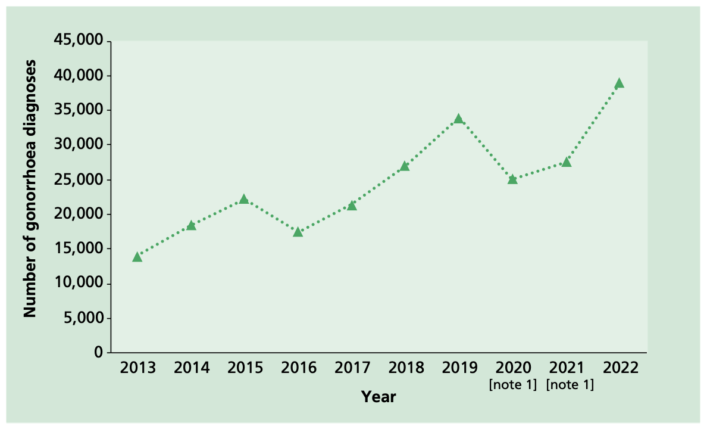

# Gonorrhoea

## The disease

Gonorrhoea is caused by the bacterium _Neisseria gonorrhoeae_, also known as the gonococcus. It is one of the most common bacterial sexually transmitted infections (STI) in England and worldwide (UKHSA, 2023a, WHO, 2023).

_Neisseria gonorrhoeae_ is a Gram-negative diplococcus that infects and colonises mucosal surfaces of the urethra, endocervix, rectum, pharynx and conjunctiva. Humans are the only known host and reservoir for _N. gonorrhoeae_ and the bacteria cannot survive outside the human body for long (Unemo _et al._, 2019).

Gonorrhoea can spread through condomless vaginal, oral or anal sex, or mucosal exposure to infected secretions. Infection may be asymptomatic, but transmission can still occur. _Neisseria gonorrhoeae_ is very effective in evading the human immune response, so natural infection does not induce protective immunity and recurrent infections are common (Unemo _et al._, 2019). The incubation period ranges from 1 to 10 days following exposure (Fifer _et al._, 2020, Unemo _et al._, 2019). Symptoms are more likely to occur with penile urethral infections, whereas endocervical, rectal or pharyngeal infections are more likely to be asymptomatic. Typical urogenital symptoms of infection include thick green or yellow discharge from the penis or vagina and pain on urination (Fifer _et al._, 2020). Left untreated, gonorrhoea can cause complications such as pelvic inflammatory disease (PID), ectopic pregnancy, infertility and systemic infections including disseminated gonococcal infection (Fifer _et al._, 2020, UKHSA, 2023b). Gonococcal infections can also increase the risk of acquiring other sexually transmitted infections, including HIV (Unemo _et al._, 2019).

## Epidemiology and public health importance

Gonorrhoea is a major global public health problem, with rising incidence globally and increasing resistance to antibiotics (WHO, 2022). In England, gonorrhoea diagnoses have been generally increasing over time, reaching nearly 83,000 in 2022, the largest annual number on record (Figure 1) (UKHSA, 2023c). Gay bisexual and other men who have sex with men (GBMSM) are at significantly higher risk of infection than heterosexuals, accounting for nearly half of all gonorrhoea diagnoses in England in 2022 (UKHSA, 2023d).

Figure 1. Number of gonorrhoea diagnoses among gay, bisexual and other men who have sex with men (GBMSM) accessing sexual health services, 2013 to 2022 (UKHSA, 2023c). Note 1: Data reported in 2020 and 2021 is notably lower than previous years due to the disruption to SHSs during the national response to the COVID-19 pandemic.

## Meningococcal vaccine and protection against gonorrhoea

There is currently no licensed vaccine against _Neisseria gonorrhoeae_. Efforts to develop one have proven difficult despite more than a century of research (Williams _et al._, 2024). Challenges have included an absence of a correlate of protection, lack of a suitable animal model, and high antigenic variability contributing to subversion and evasion of the immune response by the gonococcus.

In 2013, a four-component meningococcal B (4CMenB) protein vaccine (Bexsero®) was licensed in Europe for protection against group B meningococcal (MenB) disease. 4CMenB contains three main _Neisseria meningitidis_ proteins produced by recombinant DNA technology (Neisseria heparin binding antigen (NHBA), Neisserial adhesion A (NadA), Factor H binding protein (FHbp)) and a preparation of group B _N. meningitidis_ outer membrane vesicles (OMV). The vaccine does not contain live organisms and, therefore, cannot cause the disease against which it protects. 4CMenB was estimated to protect against 66-88% of MenB strains causing invasive meningococcal disease prior to vaccine implementation in England and Wales in September 2015 (Parikh _et al._, 2017).

4CMenB is currently licensed for active immunisation of individuals from 2 months of age and older against invasive MenB disease (EMC, 2025). In 2015, the UK became the first country to implement a publicly funded national immunisation programme offering 4CMenB to infants alongside their routine vaccinations. Within 3 years of the programme, there was a 75% reduction in invasive MenB disease in vaccine-eligible children (Ladhani _et al._, 2020).

Although the clinical manifestations are different, _N. gonorrhoeae_ (gonococcus) is very closely related to _N. meningitidis_ (meningococcus) with 80-90% sequence homology and similar virulence factors. This homology gives the potential for cross-protection against _Neisseria gonorrhoeae_ from 4CMenB antigens, including non-specific proteins that form part of the OMV component in the vaccine.

Laboratory studies have demonstrated targeting of 4CMenB-induced antibodies against specific gonococcal surface proteins as well as accelerated clearance of genital gonococcal infection in animal models (Ladhani _et al._, 2024). Several case-control and cohort studies have reported 30-40% protection against gonorrhoea in people at high risk of gonorrhoea infection who were offered the vaccine for protection against MenB disease (Ladhani _et al._, 2024). In South Australia, where 4CMenB is routinely offered to adolescents for protection against MenB disease, the two-dose vaccine effectiveness against gonorrhoea in adolescents was estimated to be 34.9% (95%CI, 15.0–50.1%) during the first 6–36 months after vaccination, with some evidence of waning protection after this period (Wang _et al._, 2023). A number of randomised controlled trials are currently in progress to prospectively evaluate the effectiveness of 4CMenB against gonorrhoea in populations with a higher risk of infection (Ladhani _et al._, 2024).

Although not currently licensed for protection against _N. gonorrhoeae_, 4CMenB could have a significant impact on gonorrhoea disease burden, transmission and antimicrobial use, especially if offered to those at higher risk of infection (Whittles _et al._, 2022). This protection against gonorrhoea would be in addition to the prevention of invasive MenB disease in vaccinated individuals (Wang _et al._, 2023).

## Storage

Vaccines should be stored in the original packaging at +2°C to +8°C and protected from light. All vaccines are sensitive to some extent to heat and cold. Heat speeds up the decline in potency of most vaccines, thus reducing their shelf life. Effectiveness of vaccines may be impaired if not stored at the correct temperature. Freezing may cause increased reactogenicity and loss of potency for some vaccines. It can also cause hairline cracks in the container, leading to contamination. For further information on storage see Chapter 3

## Presentation

4CMenB vaccine is supplied as a white opalescent liquid suspension (0.5ml) in a pre-filled syringe (single pack size) for injection. One dose (0.5ml) contains 50 micrograms each of NHBA, NadA and fHbp and 25 micrograms of OMV.

## Administration

The vaccine is given intramuscularly into the upper arm or anterolateral thigh. This is to reduce the risk of localised reactions, which are more common with subcutaneous injection (Mark _et al._, 1999; Zuckerman, 2000). However, for individuals with a bleeding disorder, vaccines should be given by deep subcutaneous injection to reduce the risk of bleeding.

## Disposal

For disposal of equipment used for vaccination, including used vials, ampoules, syringes or partially discharged vaccines please see Chapter 3.

## Recommendations for the use of the vaccine

In November 2023, JCVI endorsed a targeted, opportunistic vaccine programme using 4CMenB for protection against gonorrhoea primarily in GBMSM at higher risk of infection (JCVI, 2023). This committee acknowledged that, as protection against gonorrhoea is not currently a licensed indication for 4CMenB vaccine, this advice is based on off-label use of vaccine.

4CMenB is recommended for GBMSM at increased risk of gonorrhoea attending a sexual health clinic. During 2021/22, the incidence of diagnosed gonorrhoea cases was 24 times higher among GBMSM (diagnosis rate 6020·4 per 100,000 population) than heterosexual men (diagnosis rate 246·2 per 100,000 population), while incidence in heterosexual women (diagnosis rate 80·7 per 100,000 population) was a third of that in heterosexual men (Ladhani _et al._, 2024).

A UK health economic model indicated that offering 4CMenB to GBMSM at increased risk of gonorrhoea attending sexual health services would be cost-effective, even with a conservative vaccine effectiveness of 31% lasting 18 months after primary vaccination with two doses (Whittles _et al._, 2022). In the model, GBMSM at increased risk of gonorrhoea were defined as GBMSM diagnosed with gonorrhoea in sexual health clinics and GBMSM attending sexual health clinics who report high-risk sexual behaviour.

For operational purposes, GBMSM at increased risk of gonorrhoea includes those with a bacterial STI in the previous 12 months and GBMSM reporting at least 5 sexual partners in the previous 3 months (accounting for around 15% of GBMSM in the UK); however, each nation of the UK may need to identify an appropriate operational threshold to identify GBMSM at equivalent high-risk to support implementation.

Whilst gonorrhoea incidence remains the highest in the eligible GBMSM group as defined above, sexual health clinical professionals may perform individual risk assessment and consider the offer of 4CMenB to the small numbers of individuals with an incidence of gonorrhoea approaching that in the eligible GBMSM group defined above; this may include sex workers practicing condomless sex, and others assessed as having a similar incidence as the eligible GBMSM group.

## Dosage and schedule

Administer a course of two doses (0.5 ml intramuscular/subcutaneous injection) at least 4 weeks apart. There is no maximum time interval limit between the two vaccine doses. Pragmatically and opportunistically, the second dose can be scheduled for the next clinic attendance, which may be after 3, 6 or 12 months. There is no need to recommence the primary immunisation schedule even after a prolonged interval between the two doses.

There are no data on the immunogenicity or protection offered when 4CMenB is administered during active or recent gonorrhoea infection. Eligible individuals attending sexual health clinics for testing and/or management of bacterial STIs, including gonorrhoea, should be offered 4CMenB at the same clinic attendance. This is to avoid delay in offering potential protection to those at highest risk of gonorrhoea who may be reinfected before their next visit to the clinic. It is possible that acute gonorrhoea may affect immune responses to vaccination since natural infection does not confer protection against reinfection. Even if some attenuation in vaccine response did occur with the first dose, eligible individuals will receive a second dose of the same vaccine after the infection is treated. UKHSA will closely monitor the impact of vaccination during active or recent gonorrhoea infection to inform future vaccine recommendations.

It should be noted that there is no evidence of 4CMenB clearing acute gonorrhoeal infection in humans and, therefore, acute infections should still be managed according to the British Association for Sexual Health and HIV (BASHH) guidelines (https://www.bashh.org/guidelines).

## Co-administration with other vaccines and prophylaxis

There are very limited data for co-administration of 4CMenB with other vaccines commonly administered in sexual health clinics. First principles would suggest that any interference between co-administered vaccines with different antigenic content is likely to be limited and any potential interference is most likely to result in a slightly attenuated immune response to one of the vaccines (see Chapter 11). 4CMenB can therefore be administered before, at the same time as, or after other vaccines currently offered in sexual health clinics (including but not limited to hepatitis A, hepatitis B, human papillomavirus and mpox vaccines) without any restrictions on time intervals between different vaccines. The vaccines should be given at a separate site, preferably in a separate arm. The site at which each vaccine is given should be noted in the individual's clinical record. Vaccinating in a timely manner when an eligible individual is present in the clinic will avoid any delay in protection and reduce the risk of the individual not returning for a later appointment.

## Reinforcing immunisation

There are currently no recommendations for 4CMenB booster doses in eligible adults who have received two doses as part of their primary immunisation.

## Precautions

Minor illnesses without fever or systemic upset are not valid reasons to postpone immunisation. If an individual is acutely unwell, immunisation may be postponed until they have recovered fully. This is to avoid confusing the differential diagnosis of any acute illness by wrongly attributing any signs or symptoms to the adverse effects of the vaccine.

### Immunosuppression and HIV infection

Eligible individuals with immunosuppression and human immunodeficiency virus (HIV) infection (regardless of CD4 count) should be given meningococcal vaccines in accordance with the advice above. Some individuals with human immunodeficiency virus (HIV) infection may already have received two doses of 4CMenB because of their higher risk of meningococcal disease. No further doses are recommended for these individuals. Eligible individuals who have previously received only one 4CMenB dose can be offered a second dose irrespective of the time interval since the first dose.

Further guidance for the immunisation of HIV-infected individuals is provided by the Royal College of Paediatrics and Child Health (RCPCH; http://www.rcpch.ac.uk/), the British HIV Association (BHIVA; http://www.bhiva.org/vaccination-guidelines.aspx) and the Children's HIV Association (CHIVA; http://www.chiva.org.uk/guidelines/immunisation/).

## Contraindications

There are very few individuals who cannot receive meningococcal vaccines. When there is doubt, appropriate advice should be sought from a consultant in sexual health services, immunisation co-ordinator or consultant in health protection, rather than withhold immunisation. The vaccines should not be given to those who have had:

- a confirmed anaphylactic reaction to a previous dose of the vaccine, or
- a confirmed anaphylactic reaction to any constituent or excipient of the vaccine

## Adverse reactions

For 4CMenB (Bexsero®), the most common local and systemic adverse reactions observed in adolescents and adults were pain at the injection site, malaise, and headache. Reports of all adverse reactions can be found in the Summary of Product Characteristics for Bexsero® (EMC, 2025).

### Reporting adverse events

All suspected adverse reactions associated with vaccines labelled with a black triangle (&#x25BC;), should be reported to the MHRA using the Yellow Card scheme.

Anyone can report a suspected adverse reaction to the Medical and Healthcare products Regulatory Agency (MHRA) using the Yellow Card reporting scheme (https://www.yellowcard.gov.uk).

## Supplies

Centrally purchased vaccines for the NHS as part of the national immunisation programme can only be ordered via ImmForm.

## References

- European Medicines Compendium (EMC). Bexsero Meningococcal Group B vaccine for injection in pre-filled syringe (last updated 20 March 2025). https://www.medicines.org.uk/emc/product/5168/smpc.
- Fifer H, Saunders J, Soni S, Sadiq ST, FitzGerald M. 2018 UK national guideline for the management of infection with Neisseria gonorrhoeae. Int J STD AIDS 2020; 31(1): 4-15.
- Joint Committee on Vaccination and Immunisation (JCVI). Independent Report: JCVI advice on the use of meningococcal B vaccination for the prevention of gonorrhoea (published 10 November 2023). https://www.gov.uk/government/publications/meningococcal-b-vaccination-for-the-prevention-of-gonorrhoea-jcvi-advice-10-november/jcvi-advice-on-the-use-of-meningococcal-b-vaccination-for-the-prevention-of-gonorrhoea. Accessed: 10/04/2025.
- Ladhani SN, Andrews N, Parikh SR, _et al._ Vaccination of Infants with Meningococcal Group B Vaccine (4CMenB) in England. N Engl J Med 2020; 382(4): 309-17.
- Ladhani SN, White PJ, Campbell H, Mandal S, Borrow R, Andrews N, Bhopal S, Saunders J, Mohammed H, Drisdale-Gordon L, Callan E, Sinka K, Folkard K, Fifer H, Ramsay ME. Summary of evidence supporting the use of a meningococcal group B vaccine (4CMenB, Bexsero®) to protect populations at high-risk of gonorrhoea in the United Kingdom. _Lancet Infect Dis_ 2024 Sep;24(9):e576-e583.
- Mark A, Carlsson RM and Granstrom M (1999) Subcutaneous versus intramuscular injection for booster DT vaccination of adolescents. Vaccine 17(15-16): 2067-72.
- Parikh SR, Newbold L, Slater S, Stella M, Moschioni M, Lucidarme J, De Paola R, Giuliani M, Serino L, Gray SJ, Clark SA, Findlow J, Pizza M, Ramsay ME, Ladhani SN, Borrow R. Meningococcal serogroup B strain coverage of the multicomponent 4CMenB vaccine with corresponding regional distribution and clinical characteristics in England, Wales, and Northern Ireland, 2007-08 and 2014-15: a qualitative and quantitative assessment. Lancet Infect Dis. 2017 Jul;17(7):754-762.
- UK Health Security Agency (UKSA). 2023a. (published 2010, September 15). Gonorrhoea: guidance, data and analysis (updated 13 November 2023). https://www.gov.uk/government/collections/gonorrhoea-neisseria-gonorrhoeae-guidance-data-and-analysis
- UK Health Security Agency (UKSA). 2023b. (2023, November 9). Disseminated gonococcal infection in England, 2019 to 2023: data from voluntary reporting. https://www.gov.uk/government/publications/disseminated-gonococcal-infection-dgi-in-england/disseminated-gonococcal-infection-in-england-2019-to-2023-data-from-voluntary-reporting
- UK Health Security Agency (UKHSA). 2023c. Official Statistics: Sexually transmitted infections and screening for chlamydia in England: 2022 report (updated 25 October 2023). https://www.gov.uk/government/statistics/sexually-transmitted-infections-stis-annual-data-tables/sexually-transmitted-infections-and-screening-for-chlamydia-in-england-2022-report
- UK Health Security Agency (UKHSA). 2023d. Official Statistics: Sexually transmitted infections (STIs): annual data tables. https://www.gov.uk/government/statistics/sexually-transmitted-infections-stis-annual-data-tables
- Unemo M, Seifert HS, Hook EW 3rd, Hawkes S, Ndowa F, Dillon JR. Gonorrhoea. Nat Rev Dis Primers. 2019 Nov 21;5(1):79.
- Wang B, Giles L, Andraweera P, _et al._ 4CMenB sustained vaccine effectiveness against invasive meningococcal B disease and gonorrhoea at three years post program implementation. J Infect 2023; 87(2): 95-102.
- Whittles, L.K., Didelot, X. and White, P.J. (2022). Public health impact and cost-effectiveness of gonorrhoea vaccination: an integrated transmission-dynamic health-economic modelling analysis. The Lancet Infectious Diseases 2022 Jul;22(7):1030-1041.
- Williams E, Seib KL, Fairley CK, Pollock GL, Hocking JS, McCarthy JS, Williamson DA. Neisseria gonorrhoeae vaccines: a contemporary overview. Clin Microbiol Rev 2024 Mar 14;37(1):e0009423.
- WHO (2022). Multi-drug resistant gonorrhoea. https://www.who.int/news-room/fact-sheets/detail/antimicrobial-resistance
- WHO (2023). Gonorrhoea (Neisseria gonorrhoeae infection). https://www.who.int/news-room/fact-sheets/detail/gonorrhoea-(neisseria-gonorrhoeae-infection)
- Zuckerman JN (2000) The importance of injecting vaccines into muscle. Different patients need different needle sizes. BMJ 321(7271): 1237-8.
