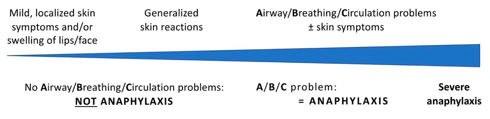
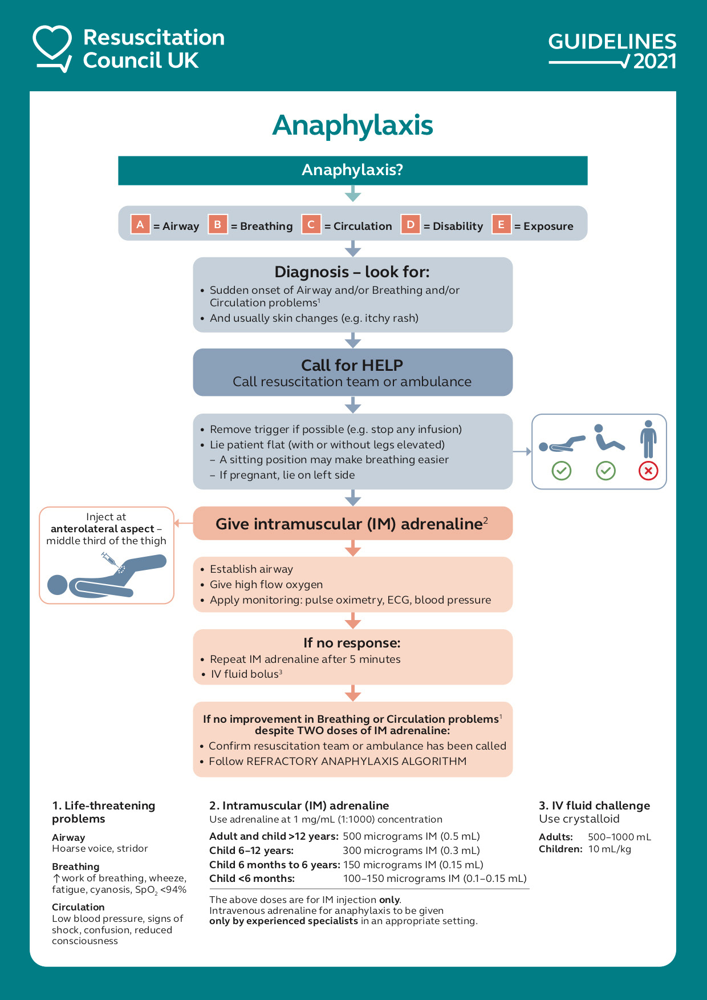

# Vaccine safety and the management of adverse events following immunisation

## Introduction

Vaccines induce protection by eliciting active immune responses to specific antigens. There may be predictable adverse reactions (side effects): most are mild and resolve quickly. However, it is not always possible to predict individuals who might have a mild or serious reaction to a vaccine. The advice in this chapter uses the World Health Organization (WHO) classification of adverse events following immunisation (AEFIs). It gives an overview of common side effects associated with vaccines and of the management of serious adverse reactions such as anaphylaxis. The process of vaccine safety monitoring in the UK and the reporting of suspected vaccine-induced adverse drug reactions (ADRs) via the Yellow Card scheme are described in Chapter 9.

## Adverse events following immunisation

The WHO (WHO 2019) defines an AEFI as any untoward medical occurrence which follows immunisation and which does not necessarily have a causal relationship with the use of the vaccine. The adverse event may be any unfavourable or unintended sign, an abnormal laboratory finding, a symptom or disease.

WHO classifies AEFIs according to five main categories:

- immunisation error related reaction
- vaccine product related reaction
- vaccine quality defect-related reaction
- coincidental
- immunisation anxiety related reaction

### Immunisation error-related AEFIs

These are adverse events that result from inappropriate practices in the provision of vaccination. These may include:

- wrong dose of vaccine administered
- vaccines used beyond expiry date
- vaccines used at inappropriate intervals
- inappropriate route, site or technique of administration
- vaccine reconstituted with incorrect diluent
- wrong amount of diluent used
- vaccine prepared incorrectly
- mixing into inappropriate combinations
- drugs substituted for vaccine or diluent
- vaccine or diluent contaminated
- vaccine or diluent stored incorrectly
- contraindications not elicited or ignored
- reconstituted vaccine kept beyond the recommended period

Advice on responding to vaccination errors can be found here: https://www.gov.uk/government/publications/vaccine-incident-guidance-responding-to-vaccine-errors

### Vaccine-product AEFIs

These are reactions in individuals specifically caused by a particular vaccine or its component parts. These may be induced, direct effects of the vaccine or one of its components, and/or due to an underlying medical condition or an idiosyncratic response in the recipient.

Direct effects of vaccines include both systemic (e.g. fever) and local reactions, for example: fever following administration of the 4CMenB vaccine (Bexsero); rash and fever seven to ten days after MMR; parotitis three weeks after MMR.

An example of an AEFI due to an underlying medical condition is vaccine-associated BCG-osis which can occur following administration of the live attenuated BCG vaccine in an infant with previously unrecognised severe combined immune deficiency.

Other, less predictable AEFIs include idiopathic thrombocytopaenic purpura (ITP) within 30 days of MMR, and anaphylaxis immediately after vaccination. This category also includes medical conditions that would have occurred at some point in an individual but are triggered earlier by the vaccination, e.g. Vaccine-proximate status epilecticus may be the first manifestation of genetic developmental epileptic encephalopathies, including Dravet syndrome (Deng _et al_ 2020). febrile seizures in a child with a family history of the same, or onset of infantile spasms (Bellman _et al_., 1983).

When there has been a confirmed allergic reaction (including anaphylaxis) to a previous dose of the same vaccine, then this contraindicates further vaccination with the same vaccine or a component of that vaccine, unless otherwise advised by an expert who has been able to investigate the reaction further.

### Coincidental AEFIs

These are not true adverse reactions to immunisations or vaccines but rather, only linked because of the timing of their occurrence. When an AEFI is coincidental, the event would have occurred even if the individual had not been immunised. An example would be people who develop a cold with coryzal symptoms following flu vaccination. Flu vaccine does not prevent the common cold and colds are common in the winter when people are receiving flu vaccine.

### Immunisation anxiety-related AEFIs

These are adverse events arising from anxiety about the immunisation. For example, syncope (vaso-vagal reaction), or fainting associated with the administration of a vaccine, which can occur most commonly amongst adults and adolescents.

### Vaccine quality defect-related AEFI

These are AEFIs caused or precipitated by a quality defect in the vaccine product, including the administration device provided by the manufacturer.

## Common vaccine product-induced AEFIs

Common vaccine-induced AEFIs include:

- pain, swelling or redness at the site of injection. These are common after immunisation and should be anticipated
- local adverse reactions that generally start within a few hours of administration and are usually mild and self-limiting. Although these are often referred to as 'hypersensitivity reactions', they are not allergic in origin, but may be either due to high titres of antibody or a direct effect of the vaccine product. The occurrence or severity of such local reactions **does not contraindicate** further doses of immunisation with the same vaccine or vaccines containing the same antigens
- systemic adverse reactions which include fever, malaise, myalgia, irritability, headache and loss of appetite. The timing of systemic reactions will vary according to the characteristics of the vaccine received, the age of the recipient and the biological response to that vaccine. For example, fever may start within a few hours of tetanus-containing vaccines, but occurs seven to ten days after measles-containing vaccine. The occurrence of such systemic reactions **does not contraindicate** further doses of the same vaccine or vaccines containing the same antigens.

The types of side effect that are commonly seen after the routine and other childhood immunisations are described in the relevant chapters, along with details of when they are most likely to occur.

### Managing common vaccine-induced AEFIs

Parents and those scheduled to receive vaccination should be given advice about AEFIs that they can expect and how such events should be managed. The leaflets on vaccinations provided by the NHS and other public health organisations give information about AEFIs and include advice on their management.

Fevers over 37.5°C are common in children and are usually mild. Advice on the use and appropriate dose of paracetamol or ibuprofen liquid to treat a fever should be given at the time of immunisation. Guidance on Fever in under 5s: Assessment and initial management from the National Institute for Health and Care Excellence can be found at - https://www.nice.org.uk/guidance/ng143. Local reactions are usually self-limiting and do not require treatment. If they appear to cause discomfort, then paracetamol or ibuprofen can be given.

Whilst paracetamol and ibuprofen can lower the duration of fever and reduce distress, there is no evidence that they prevent febrile convulsions. In general therefore, it is not recommended that these drugs are used routinely to prevent fever following vaccination as there is some evidence that prophylactic use of antipyretic drugs around the time of vaccination may lower antibody responses to some vaccines (Prymula _et al.,_ 2009), although this reduction is unlikely to be clinically significant (Das _et al_., 2014).

An important exception is administration of Bexsero®, a four-component protein-based meningococcal B (4CMenB) protein vaccine in infants under one year of age. This is because fever ≥38°C (occasionally ≥39°C) was more common when 4CMenB was administered at the same time as routine vaccines (see **Chapter 11**) than when 4CMenB was given alone. The immunogenicity of both Bexsero® and the other routine vaccines in infants is not affected by giving paracetamol when such vaccines are co-administered with 4CMenB. (Prymula _et al_., 2014), and paracetamol has been shown to reduce fever and other symptoms associated with vaccination (Prymula _et al_.,2014, Dubus _et al_ 2020). JCVI have therefore recommended that paracetamol should be given prophylactically when 4CMenB is given with the routine vaccines in infants under one year of age (see **Chapter 22**).

**Aspirin, or medicines that contain aspirin should never be given to children under 16 years old because of the risk of developing Reye's syndrome.**

### Thiomersal

Thiomersal is a organomercurial derivative of ethyl mercury and was previously used as a preservative in the manufacture of some vaccines. There have been theoretical concerns around paediatric exposure to thiomersal through vaccine administration. However, the very low levels of thiomersal in older vaccines have never been associated with these or similar conditions, including in children or pregnant women. Several regulatory authorities have reviewed the safety of thiomersal in vaccines, including the World Health Organization (WHO 2012) and the European Medicines Agency (EMA 2004). These reviews have consistently concluded that there is no evidence of an association between thiomersal-containing vaccines and neurodevelopmental disorders, including autism.

Thiomersal is no longer used in any of the vaccines routinely given to children in the UK. Only one vaccine (Anthrax) has thiomersal added to maintain sterility.

## Rare vaccine-induced AEFIs

Some other AEFIs occur rarely and include those that are neurological or immune-mediated. Examples include seizures, hypotonic-hyporesponsive episodes (HHE), idiopathic thrombocytopaenic purpura (ITP), acute arthropathy, allergic reactions and anaphylaxis.

### Hypotonic-hyporesponsive episodes (HHEs)

Hypotonic-hyporesponsive episodes (HHEs) are characterised by sudden onset of decreased muscle tone (hypotonia, presenting as floppiness), decreased responsiveness to vocal or physical stimuli (hyporesponsiveness) and a change in skin colour (pallor or cyanosis) that typically occurs within 12 hours of vaccination. Duration can vary from minutes to hours.

HHE was first described in 1961. Most reports relate to HHE as an AEFI following vaccination with whole cell pertussis. Rates are highest with the first dose of pertussis: 145 per 100,000 doses following diphtheria-tetanus-whole cell pertussis (DTwP), and lower (81 per 100,000 doses) after the primary series of diphtheria, tetanus and acellular pertussis (DTaP) vaccines. Subsequent pertussis-containing vaccines administered as booster vaccines in children over 1 year are associated with a lower rate: 29 and 10 per 100,000 doses after DTwP and DTaP, respectively (Zhang _et al_, 2014). Rates appear to be even lower in multivalent vaccines which include DTaP (Hansen _et al_, 2021). HHE has also been reported, less frequently, following _Haemophilus influenzae_ type b (Hib) and hepatitis B vaccines.

Acute management involves basic life support (airway, breathing, circulation) with referral to hospital to exclude other differential diagnoses and for clinical observation. HHE as generally benign, without any long terms sequelae, and does not usually recur with subsequent doses of DTwP or DTaP (DuVernoy _et al_, 2000). Parents/carers of affected children should be reassured that their child can receive the same vaccines subsequently. Where the same vaccine is to be given according to the schedule, it is reasonable to offer vaccination under medical supervision (e.g. on a day unit) to provide reassurance to the family.

## Anaphylaxis

**Anaphylaxis is a serious allergic reaction** that is usually rapid in onset and may cause death. Severe anaphylaxis is characterized by life-threatening compromise in airway, breathing and/or the circulation, but **may occur without typical skin features or circulatory shock being present.**

Anaphylaxis following vaccination is rare, occurring at less than 1 per million doses for vaccines in the UK. Rates of anaphylaxis to vaccines against COVID-19 were initially reported to be much higher than to other vaccines, but evidence now suggests that rates are similar or only slightly higher, at up to 5 events per million doses for first doses, and much lower for subsequent booster doses (Khalid & Frischmeyer-Guerrerio, 2022).

Onset of anaphylaxis is rapid, typically within minutes, and its clinical course is unpredictable with variable severity and clinical features. Due to the unpredictable nature of anaphylactic reactions it is not possible to define a particular time period over which all individuals should be observed following immunisation to ensure they do not develop anaphylaxis.

Most anaphylactic reactions occur in individuals who have no known risk factors. There is a range of signs and symptoms, none of which are entirely specific for anaphylaxis; however, certain combinations of signs make the diagnosis of an anaphylactic reaction more likely (Brown, 2004).

Anaphylaxis lies along a spectrum of severity in terms of allergic symptoms, as shown in Figure 8.1 (Cardona 2020). Confusion can arise because some patients develop systemic allergic reactions that are less severe, and do not meet the threshold for anaphylaxis.

For example, generalised urticaria, mucosal angioedema and rhinitis would not be considered to be anaphylaxis because potentially life-threatening features -- an **A**irway problem, respiratory difficulty (**B**reathing problem) and hypotension (**C**irculation problem) -- are not present. Other individuals may complain of a sensation of throat tightness, but unless this is severe (e.g. painful swallow, difficulty swallowing saliva) or associated with A/B/C problems, is not anaphylaxis. In these cases, affected individuals should be observed to ensure symptoms do not worsen. If available, it is appropriate to administer an oral, non-sedating antihistamine (such as cetirizine). However, **if in doubt, manage as for anaphylaxis: give IM adrenaline and seek expert help**.

**Anaphylaxis is likely when all of the following 3 criteria are met:**

- sudden onset and rapid progression of symptoms
- **A**irway and/or **B**reathing and/or **C**irculation problems
- skin and/or mucosal changes (itching, flushing, urticaria, angioedema)

Remember:

- skin or mucosal changes alone are not a sign of anaphylaxis
- **skin and mucosal changes can be subtle or absent in 10-20% of reactions** (e.g. some patients can present with only bronchospasm or hypotension)

### Recognition of Anaphylaxis

Patients can have either an **A** or **B** or **C** problem, or any combination. Use the ABCDE approach to recognise these and treat early (see Table 8.1). **Breathing problems** can vary from mild bronchospasm to life-threatening asthma with no other features to suggest anaphylaxis. **Circulation problems** (often referred to as anaphylactic shock) can be caused by direct myocardial depression, vasodilation and capillary leak, with loss of fluid from the circulation.

In the context of vaccine-associated anaphylaxis, abdominal pain and/or vomiting should be considered to be a sign of anaphylaxis, and should prompt a full ABCDE approach to assess the manage the patient as described by the UK Resuscitation Council: https://www.resus.org.uk/library/abcde-approach

| **Airway problems**                                                                                                                       | **Breathing problems:**                               | **Circulation problems:**                            |
| ----------------------------------------------------------------------------------------------------------------------------------------- | ----------------------------------------------------- | ---------------------------------------------------- |
| - airway swelling                                                                                                                         | - shortness of breath -- increased respiratory rate   | - signs of shock: pale, clammy                       |
| - e.g. obvious and objective tongue swelling causing difficulty in breathing and/or swallowing. Patients may feel their throat is closing | - wheeze (bronchospasm) and/or persistent cough       | - significant tachycardia                            |
| - hoarse voice                                                                                                                            | - patient becoming tired with the effort of breathing | - arrhythmia                                         |
| - stridor (a high-pitched inspiratory noise caused by upper airway obstruction)                                                           | - confusion due to hypoxia                            | - hypotension -- feeling faint (dizziness), collapse |
|                                                                                                                                           | - cyanosis (a late sign)                              | - decreased conscious level or loss of consciousness |
|                                                                                                                                           | - respiratory arrest                                  | - cardiac arrest                                     |

Table 8.1: Specific signs/symptoms of anaphylaxis

**Non life-threatening conditions which can mimic anaphylaxis** usually respond to simple measures):

- faint (vasovagal episode) -- these can also occur in the context of non-anaphylaxis allergic reactions too (see below)
- panic attack
- breath-holding episode in a child
- spontaneous (non-allergic) urticaria or angioedema

There can be confusion between anaphylaxis and a panic attack. Patients with prior anaphylaxis may be prone to panic attacks if they think they have been re-exposed to the allergen that caused a previous reaction. The sense of impending doom and breathlessness leading to hyperventilation are symptoms that can resemble anaphylaxis. Sometimes, there may be flushing, blotchy skin or sensation of throat tightness associated with anxiety adding to the diagnostic difficulty.

Diagnostic difficulty can also occur with vasovagal attacks after immunisation or other procedures, but the absence of rash, breathing difficulties, and swelling are useful distinguishing features, as is the slow pulse of a vasovagal attack (whereas anaphylaxis is usually associated with a tachycardia). Symptoms should resolve rapidly on lying flat.

**If rapid recovery does not happen, consider anaphylaxis as a cause.**

|                             | **Faint**                                                           | **Anaphylaxis**                                                |
| --------------------------- | ------------------------------------------------------------------- | -------------------------------------------------------------- |
| Onset                       | Over seconds                                                        | Over minutes to hours                                          |
| Resolution                  | Usually rapid on lying flat, without additional treatment           | Over minutes to hours                                          |
| **A**irway                  |                                                                     |                                                                |
| - Airway swelling           | Absent                                                              | May be present                                                 |
| - Hoarseness                |                                                                     |                                                                |
| - Stridor                   |                                                                     |                                                                |
| **B**reathing               |                                                                     |                                                                |
| - Respiration               | Shallow, not laboured                                               | Increased respiratory rate and/or work of breathing            |
| - Wheeze / persistent cough | Absent                                                              | May be present                                                 |
| **C**irculation             |                                                                     |                                                                |
| - Heart rate                | Initial slow/normal pulse                                           | Tachycardia common (but alone does not indicate anaphylaxis)   |
| - Pulse                     | Strong central pulse                                                | Weak central pulse                                             |
| - Blood pressure            | Normal (or transiently low)                                         | Persistent hypotension                                         |
| **D**isability              |                                                                     |                                                                |
| - Consciousness             | Dizziness, transient loss of consciousness - improved by lying flat | Dizziness, loss of consciousness persistent despite lying flat |
| **E**xposure (skin)         | Often pale/clammy                                                   | Flushed, itchy, urticaria/hives, angioedema                    |

Table 8.2: Typical features which may help distinguish between a vasovagal episode and anaphylaxis. Note that patients may not have all of these features.

### Initial treatment of anaphylaxis

The treatment of anaphylaxis is based on general life support principles:

- call for help immediately.
- use the **A**irway, **B**reathing, **C**irculation approach to recognise and treat problems

**Intramuscular adrenaline is the first-line treatment for anaphylaxis** (even if intravenous access is available). IV adrenaline bolus outside the context of cardiac arrest is dangerous.

- give intramuscular (IM) adrenaline to treat Airway/Breathing/Circulation problems
- do not delay initial treatment if the diagnosis is unclear: a single dose of IM adrenaline is well-tolerated and poses minimal risk
- **repeat IM adrenaline after 5 minutes if features of anaphylaxis do not resolve**

Follow the Resuscitation Council UK algorithm for the management of anaphylaxis (Figure 8.2).

### Preparation for the management of potential anaphylaxis

All clinical staff should be able to recognise the symptoms/signs of an allergic reaction and specifically anaphylaxis, to call for help and to start treatment. Staff who give immunisations should have annual updates in anaphylaxis management.

In every location where vaccines are being given, an anaphylaxis pack should be immediately available. Packs should be checked regularly to ensure the contents are within their expiry dates.

Ideally an anaphylaxis pack should contain:

- two ampoules of adrenaline (epinephrine) 1mg/mL (1:1000)
- four 23G needles and four graduated 1mL syringes
- equipment to deliver ventilation breaths, either through a disposable mask or by bag/valve/mask ventilation

The pack should be immediately accessible in each location and should not be stored in a locked cupboard or trolley.

Ideally, there should also be access to an oxygen supply, with face masks suitable for children and adults and tubing. For domiciliary vaccination and other community settings (such as schools), it should be possible to carry portable oxygen in most instances. Where this would be impractical, then it is acceptable to make a decision to not carry oxygen on the basis of a local risk assessment.

Factors that would affect the risk assessment would include:

- the number of people being vaccinated (higher numbers increases risk)
- population vulnerability (younger healthy people are at lower risk of serious outcomes)
- the type of vaccine being administered (e.g. oral vaccines present a lower risk, and newer vaccines may present a higher or less certain risk)
- understanding of local ambulance response and journey times (longer times would increase the risk)

Vaccinators should also ensure that it is possible to easily get the patient into the recovery position and/or a suitable position for performing resuscitation, and that the floorspace in the premises is suitable if a patient faints or collapses.

### Treatment of anaphylaxis following vaccination in the community setting:

1. For a patient with suspected anaphylaxis in the community - Dial 999 urgently for ambulance support and clearly state "ANAPHYLAXIS".

2. A single responder must always ensure that help is coming. If there are several rescuers, several actions can be undertaken simultaneously.

3. Give IM adrenaline. Giving adrenaline by ampoule/needle/syringe is preferred, since the dose can be titrated to patient weight (in adults, the recommended dose is 500 micrograms). Some settings may prefer to use an auto-injector (e.g. Epipen, Jext) for the first dose used to treat anaphylaxis, for speed and ease. If further doses of adrenaline are needed, give these by ampoule/needle/syringe.

4. Patient positioning.

- patients with Airway and Breathing problems may prefer to sit up
- lying flat with or without leg elevation is helpful for patients with a low blood pressure (Circulation problem)
- patients who are breathing normally and unconscious should be placed on their side (recovery position). Monitor breathing and intervene if needed
- pregnant patients should lie on their left side to prevent aortocaval compression

Death can occur within minutes if a patient stands, walks or sits up suddenly. Patients must NOT walk or stand during acute reactions. Use caution when transferring patients who have been stabilised.

5. Other supportive measures:

- give further repeat doses of IM adrenaline every 5 minutes if symptoms do not resolve
- give oxygen and apply pulse oximetry (if available), to achieve oxygen saturations of 94-98%, but do not delay giving oxygen while waiting for a pulse oximeter. If no oxygen available, provide ventilation using a mask or bag
- severe upper airways obstruction is uncommon - seek urgent expert help if there is airway obstruction - nebulised adrenaline (5mL of 1mg/mL adrenaline) can be used to treat upper airways obstruction if available, but must not be prioritised over further IM adrenaline every 5 minutes
- bronchospasm - consider further inhaled bronchodilator therapy with salbutamol and/or ipratropium (e.g. using a MDI-inhaler and spacer chamber), but this must not be prioritised over IM adrenaline
- a reduction in blood flow is common in anaphylaxis, even in the absence of obvious circulatory compromise. Lie the patient flat with their feet raised. If there are ongoing symptoms despite 1-2 doses of initial IM adrenaline, then give a fluid bolus if possible; this will support tissue perfusion and drug delivery.

### Possible cross-reactivity between vaccines and drugs

**Antihistamines and steroids are no longer recommended for management of anaphylaxis.** Some oral medicines used to treat more mild reactions contain the same substances found in some vaccines (and which can cause allergic reactions). Caution is recommended following allergic reactions to vaccines. In the UK, use an oral liquid antihistamine (e.g. liquid cetirizine). Chlorphenamine tablets can also be used, but these can cause drowsiness and therefore mimic symptoms of anaphylaxis.

### CARDIAC ARREST:

Recognise cardiac arrest has occurred if the person becomes unresponsive or unconscious, and breathing is absent or abnormal.

- start chest compressions as soon as cardiac arrest is suspected
- ensure expert help (resuscitation team or ambulance) has been called
- follow standard cardiac arrest guidelines (use IV/IO adrenaline in preference to IM route, as per protocol), available at https://www.resus.org.uk

### BLOODS

The specific test to help confirm a diagnosis of anaphylaxis is measurement of mast cell tryptase. Ideally, three timed samples (serum or plasma, e.g. yellow top bottle) are needed:

1. An initial sample as soon as feasible (e.g. in a GP practice, on arrival at hospital) -- but do not delay starting resuscitation.

2. A second sample at 1-2 hours (but no later than 4 hours) from the onset of symptoms.

**If possible, take 5-10mL extra for serum store to facilitate further investigations.**

A convalescent sample should be obtained at least 24 hours after complete resolution (e.g. at follow-up allergy clinic), to provide a baseline tryptase value.

### SURVEILLANCE

- report all suspected vaccine-induced adverse reactions via the MHRA's Yellow Card scheme: https://coronavirus-yellowcard.mhra.gov.uk
- all patients with suspected anaphylaxis should be referred to an allergy clinic -- see https://www.bsaci.org for details of clinics

## References

Bellman MH, Ross EM and Miller DL (1983) Infantile spasms and pertussis immunisation. _Lancet_ 7: 1031--4.

Brown SG (2004) Clinical features and severity grading of anaphylaxis. _J Allergy Clin Immunol_ **114**(2): 371-6.

Cardona V, Ansotegui I, Ebisawa M, _et al_, on behalf of the World Allergy Organisation Anaphylaxis Committee. Anaphylaxis Guidance 2020. World Allergy Organization Journal 2020; doi:10.1016/j.waojou.2020.100472

Das RR, Panigrahi I, Naik SS (2014) The effect of prophylactic antipyretic administration on post-vaccination adverse reactions and antibody response in children: a systematic review. _PLoS One_ 9(9):e106629

Deng L, Wood N, Danchin M (2020) Seizures following vaccination in children, risks, outcomes and management of subsequent revaccination, _AJGP_ Vol 49 Number 10, Oct 2020.

Dubus M, Ladhani S, Vasu V. Prophylactic Paracetamol After Meningococcal B Vaccination Reduces Postvaccination Fever and Septic Screens in Hospitalized Preterm Infants. _Pediatr Infect Dis J._ 2020 Jan;39(1):78-80.

DuVernoy TS, Braun MM. Hypotonic-hyporesponsive episodes reported to the vaccine adverse event reporting system (VAERS), 1996-1998. _Pediatrics._ 2000;106:E52.

European Medicines Agency (2004) Thiomersal in vaccines for human use - recent evidence supports safety of thiomersal-containing vaccines - Scientific guideline https://www.ema.europa.eu/en/thiomersal-vaccines-human-use-recent-evidence-supports-safety-thiomersal-containing-vaccines#current-version-section

Hansen J, Decker MD, Lewis E, Fireman B, Pool V, Greenberg DP, Johnson DR, Black S, Klein NP. Hypotonic-hyporesponsive Episodes After Diphtheria, Tetanus and Acellular Pertussis Vaccination. _Pediatr Infect Dis J._ 2021 Dec 1;40(12):1122-1126.

IOM (Institute of Medicine). Thimerosal-containing vaccines and neurodevelopmental disorders. Washington DC: National Academy Press; 2001.

Khalid MB, Frischmeyer-Guerrerio PA. The conundrum of COVID-19 mRNA vaccine-induced anaphylaxis. _J Allergy Clin Immunol Glob._ 2023 Feb;2(1):1-13.

Prymula R, Siegrist CA, Chlibek R, _et al._ (2009) Effect of prophylactic paracetamol administration at time of vaccination on febrile reactions and antibody responses in children: two open-label, randomised controlled trials. _Lancet_ **374**: 1339-50.

Prymula R, Esposito S, Zuccotti GV, (2014). A phase 2 randomized controlled trial of a multicomponent meningococcal serogroup B vaccine (I). _Hum Vaccin Immunother._ 2014;10(7):1993-2004.

World Health Organization (2014) Thiomersal vaccines, Extract from report of GACVS meting of 6-7 June 2012, published in the WHO Weekly Epidemiological Record on 27 July 2012, https://www.who.int/groups/global-advisory-committee-on-vaccine-safety/topics/thiomersal-and-vaccines/thiomersal-vaccines

World Health Organization (2019) Causality assessment of an adverse event following immunization (AEFI): User manual for the revised WHO classification, second edition, 2019 update https://www.who.int/publications/i/item/9789241516990

Zhang L, Prietsch SO, Axelsson I, _et al_. Acellular vaccines for preventing whooping cough in children. _Cochrane Database Syst Rev._ 2014;(9):CD001478.
