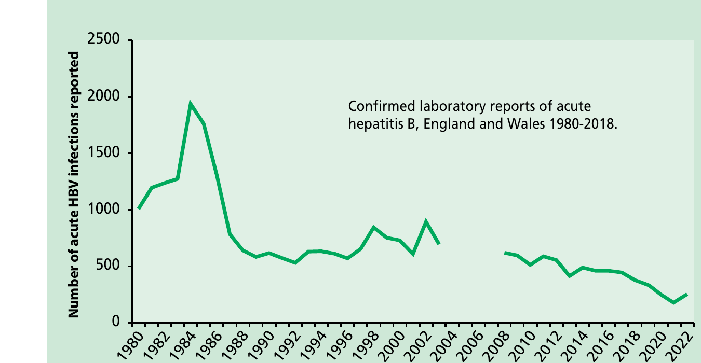

# Hepatitis B

NOTIFIABLE

## The disease

Hepatitis B is an infection of the liver caused by the hepatitis B virus (HBV), a member of the Hepadnaviridae family of viruses. HBV is a small partially double-stranded circular DNA virus which replicates through an RNA intermediate and can integrate into the host genome. The HBV replication cycle allows the virus to persist in infected cells. The genetic variability of HBV is very high with multiple genotypes (A to H) and sub genotypes, most of which have a distinct geographic distribution.

Many individuals newly infected with hepatitis B may be asymptomatic or have a symptomatic presentation with a flu-like illness. Jaundice only occurs during acute infection in about 10% of younger children and in 30% to 50% of adults. Acute infection may occasionally lead to fulminant hepatic necrosis, which is often fatal. The acute illness usually starts insidiously -- with anorexia and nausea and an ache in the right upper abdomen. Fever, when present, is usually mild. Malaise may be profound. As jaundice develops, there is progressive darkening of the urine and lightening of the faeces.

In people who do not develop symptoms suggestive of hepatitis, the acute illness may only be detected by abnormal liver function tests and/or the presence of serological markers of hepatitis B infection (for example hepatitis B surface antigen (HBsAg) and hepatitis B core IgM antibody (anti-HBc IgM)).

The virus is transmitted by parenteral or mucosal exposure to infected blood or body fluids. Transmission mostly occurs:

- through vaginal or anal intercourse
- as a result of blood-to-blood contact through percutaneous exposure (for example sharing of needles and other equipment by people who inject drugs (PWID) and 'needlestick' injuries)
- through perinatal transmission from mother to child

More rarely, transmission has also followed bites from people living with hepatitis B. Transfusion-associated infection also is now rare in the UK as blood donors and donations are screened and viral inactivation of blood products has eliminated these as a source of infection.

The incubation period ranges from 40 to 160 days, HBsAg is most commonly detected by 60 to 90 days. Current infection can be detected by the presence of HBsAg in the serum. Blood and body fluids from these individuals should be considered to be infectious. In most individuals, infection will resolve and HBsAg disappears from the serum, but the virus persists in some people who become chronically infected with hepatitis B.

Chronic hepatitis B infection is defined as persistence of HBsAg in the serum for six months or longer. Among those who are HBsAg positive, those in whom hepatitis B e-antigen (HBeAg) is also detected in the serum are the most infectious. Those who are HBsAg positive and HBeAg negative (usually anti-HBe positive) are infectious but generally of lower infectivity. A proportion of people with chronic infection who are HBeAg negative will have high HBV DNA levels and may be more infectious.

The risk of developing chronic hepatitis B infection depends on various factors including the age at which infection is acquired. Chronic infection occurs in 90% of those infected perinatally but is less frequent in those infected as children (for example 20 to 50% in children between one and five years of age). About 5% or less of previously healthy people, infected as adults, become chronically infected (Hyams, 1995). The risk is increased in those whose immunity is impaired.

Around 20% to 25% of individuals with chronic HBV infection worldwide have progressive liver disease, leading to cirrhosis in some people. The risk of progression is related to the level of active viral replication in the liver. Individuals with chronic hepatitis B infection -- particularly those with an active inflammation and/or cirrhosis, where there is rapid cell turnover -- are at increased risk of developing hepatocellular carcinoma.

## History and epidemiology of the disease

The World Health Organization (WHO) has estimated that in 2019 around 296 million people worldwide have chronic HBV (WHO 2022). The WHO has categorised countries based upon the prevalence of chronic hepatitis B infection (as indicated by HBsAg positivity) into high (more than 8%), intermediate (2 to 8%) and low (less than 2%) endemicity countries. High-prevalence regions include sub-Saharan Africa, most of Asia and the Pacific islands. Intermediate-prevalence regions include the Amazon, southern parts of Eastern and Central Europe, the Middle East and the Indian sub-continent. Low-prevalence regions include most of Western Europe and North America.

Since 1987, the WHO has recommended universal infant or adolescent hepatitis B immunisation. As of 2008, 177 countries had incorporated hepatitis B vaccine as an integral part of their national infant immunisation programmes (WHO 2009). In 2016 the World Health Assembly adopted WHO's first Global Health Sector Strategy on viral hepatitis with elimination as its overarching vision. Scaling up hepatitis B vaccination coverage in infant immunisation programmes is highlighted as a successful prevention intervention.

The most common modes of transmission are mainly dependent on the prevalence of infection in a given country. In areas of high endemicity (and prevalence), infection is acquired predominantly in childhood -- by perinatal transmission or by horizontal transmission among young children. In low-endemicity countries, most infections are acquired in adulthood, where sexual transmission or sharing of blood-contaminated needles and equipment by people who inject drugs (PWID) accounts for most new infections. In areas of intermediate endemicity, the pattern of perinatal, childhood and adult infection is mixed, and nosocomial infection may also be important.

As the UK is a very low prevalence and incidence country, a universal programme using monovalent hepatitis B vaccine, either in infancy or in adolescence, was previously found not to be cost-effective (Siddiqui _et al._, 2011). In addition, there had been concern that the available infant combination vaccines (those including a 2- or 3-component acellular-pertussis vaccine) that included hepatitis B produced inferior _haemophilus influenzae_ type b (Hib) responses. However, after using 3-component acellular pertussis combinations in the UK for some years, experience suggested that, provided a Hib booster was offered after the age of one year, adequate protection against Hib can be achieved and control of Hib sustained.

In 2014, therefore, the Joint Committee on Vaccination and Immunisation (JCVI) re-evaluated their earlier advice and recommended that a universal hepatitis B infant programme was highly likely to be cost- effective using an infant combination vaccine (JCVI, October 2014). A hepatitis B containing combination vaccine was introduced into the routine (universal) infant immunisation schedule in September 2017, alongside the long-standing selective immunisation of infants born to women living with hepatitis B infection identified through antenatal screening.

From 2008 cases reported on HPZone and matched to laboratory data for England only. No data between 2004-7 due to the inability to distinguish between acute and chronic cases.

The UK is a very low-prevalence country, but prevalence of HBsAg varies across the country and among populations. It is higher in those born in high-endemicity countries, many of whom will have acquired infection at birth or in early childhood and before migration to the UK (Boxall _et al._, 1994; Aweis _et al._, 2001). This is reflected in the prevalence rates found in antenatal women, which vary from 0.05 to 0.08% in some rural areas but rise to 1% or more in certain inner-city areas where populations with origins in endemic countries are higher. Overall, the prevalence in antenatal women in the UK is around 0.4%.

In the UK, the incidence of acute infection is low but is higher among those with certain behavioural or occupational risk factors. Vaccination has therefore been recommended for individuals at higher risk since the 1980s. Laboratory reports of acute hepatitis B fell from a peak of just below 2000 reports from England and Wales in 1984 to 531 reports in 1992, mainly due to a decline in cases in PWID (Figure 18.1). The decrease was also seen in other groups at higher risk, most probably linked to a modification of risk behaviours, such as condom use, in response to the HIV/AIDS epidemic. Higher vaccination coverage in those at risk may have contributed to the more recent low incidence with the numbers of reports fluctuating at around 350 cases per year since 2015. Whereas in the past most reports of acute infection in the UK were associated with injecting drug use, they now occur most commonly as a result of heterosexual exposure, followed by sex between men. Following introduction of harm reduction policies, including vaccination, and as progression to chronic infection is unusual in adults, the prevalence of HBsAg positivity in PWIDs is now very low (below 0.5%) (UKHSA, 2023).

## The hepatitis B vaccination

There are two classes of products available for immunisation against hepatitis B: a vaccine that confers active immunity and a specific immunoglobulin that provides passive and temporary immunity while awaiting response to vaccine.

### The hepatitis B vaccines

The Hepatitis B vaccine is given as a single or combined product:

- monovalent hepatitis B vaccine (HepB)
- bivalent combination vaccine: hepatitis A and B (HepA/HepB)
- hexavalent combination vaccine containing diphtheria/tetanus/acellular pertussis/inactivated polio vaccine/Haemophilus influenzae type b/hepatitis B (DTaP/IPV/Hib/HepB)

Specific monovalent hepatitis B containing preparations are also available for people with renal insufficiency and on haemodialysis.

Most hepatitis B vaccines contain HBsAg prepared using recombinant DNA technology from yeast cells. The only exception is PreHevbri®, which is a tri-antigenic monovalent vaccine comprising: S (83%), pre-S1 (6%) and pre-S2 (11%), prepared on Chinese Hamster ovary cells. However, PreHevbri® is currently no longer available in the UK.

Most hepatitis B vaccines are adsorbed onto aluminium hydroxide, aluminium phosphate or aluminium hydroxphosphate sulphate adjuvant. Two vaccines use novel adjuvants. Fendrix®, a product licensed for people with renal insufficiency, is adjuvanted by monophosophoryl lipid A, and adsorbed onto aluminium phosphate. HEPLISAV B® is combined with a novel cytosine phosphoguanine (CpG)- enriched oligodeoxynucleotide (ODN) phosphorothioate immunostimulatory adjuvant, known as CpG 1018 adjuvant.

Hepatitis B-containing vaccines are inactivated, do not contain live organisms and cannot cause the diseases against which they protect. Thiomersal is not used as a preservative in hepatitis B vaccines available in the UK.

The available vaccines are highly effective in preventing infection in children and most adults through the production of specific antibodies to HBsAg (anti-HBs). Hepatitis B vaccine is also highly effective at preventing infection if given shortly after exposure (see below). Ideally, immunisation should commence within 24 hours of exposure, although it should still be considered up to a week after exposure.

### Hepatitis B immunoglobulin

Specific hepatitis B immunoglobulin (HBIG) is obtained from the plasma of immunised and screened human donors. All donors are screened for HIV, hepatitis B and hepatitis C, and all plasma pools are tested for the presence of nucleic acid from these viruses.

A solvent- detergent inactivation step for envelope viruses is included in the production process.

HBIG used in the UK is currently produced using plasma sourced from outside the UK, but supplies may change due to product scarcity.

HBIG provides passive immunity and can give immediate but temporary protection after exposure, such as accidental inoculation or contamination with hepatitis B-infected blood. HBIG does not affect the development of active immunity when given with hepatitis B vaccine. If infection has already occurred at the time of immunisation, virus multiplication may not be inhibited completely, but severe illness and, most importantly, development of chronic persistent infection may be prevented.

HBIG is used after exposure to give rapid protection until hepatitis B vaccine, which should be given at the same time, becomes effective. As vaccine alone is highly effective, the use of HBIG in addition to vaccine is only recommended in high-risk situations or in a known non-responder to vaccine. Whenever immediate protection is required, immunisation with the vaccine should be given. When necessary, HBIG should also be given at the same time as vaccine, ideally within 24 hours of vaccine, although it may still be considered up to a week after exposure.

### Storage

Chapter 3 contains information on vaccine storage, distribution and disposal.

**Storage of immunoglobulins**

Immunoglobulins should be stored in the original packaging, retaining batch numbers and expiry dates. Immunoglobulins should be stored at +2°C to +8°C and protected from light. Although these products have a tolerance to ambient temperatures (up to 25°C) for up to one week, they should be refrigerated immediately on receipt.

They can be distributed in sturdy packaging outside the cold chain to an end-user (such as the GP or hospital caring for a patient). They should not be frozen.

See Chapter 17 (Hepatitis A), Chapter 18 (Hepatitis B), Chapter 21 (Measles), Chapter 27 (Rabies) and Chapter 34 (Varicella) for specific information about administering immunoglobulins.

### Presentation

Table 18.1 Presentation of hepatitis B vaccines

| Vaccine                                         | Product                                                                            | Pharmaceutical presentation                                                           | Instructions on handling vaccine                                                        |
| ----------------------------------------------- | ---------------------------------------------------------------------------------- | ------------------------------------------------------------------------------------- | --------------------------------------------------------------------------------------- |
| Monovalent hepatitis B (HepB)                   | Engerix-B® Fendrix® HBvaxPRO® 5 µg HBvaxPRO® 10 µg HBvaxPRO® 40µg PreHevbri® 10 µg | Suspension for injection                                                              | Shake the vaccine well to obtain a slightly opaque, white suspension                    |
|                                                 | HEPLISAV B® 20µg                                                                   | Solution for injection in pre-filled syringe                                          |                                                                                         |
| Combined hepatitis A and B vaccine (HepB/HepA)  | Twinrix® Adult Twinrix® Paediatric                                                 | Suspension for injection                                                              | Shake the vaccine well to obtain a slightly opaque suspension                           |
|                                                 | Ambirix®                                                                           | Suspension for injection                                                              | Shake the vaccine well to obtain a slightly opaque suspension                           |
| Hexavalent (including HepB) (DTaP/IPV/Hib/HepB) | Infanrix® hexa                                                                     | Powder (Hib) in vial and suspension DTaP/IPV/HepB for injection in pre-filled syringe | Reconstitute powder in liquid suspension in accordance with manufacturer's instructions |
|                                                 | Vaxelis®                                                                           | Suspension for Injection                                                              | Shake the vaccine gently to obtain an even, cloudy suspension                           |

Note: PreHevbri is no longer available in the UK

HBIG is a clear, pale yellow fluid or light brown solution dispensed in vials containing either 200 IU or 500 IU.

### Dosage

Currently, licensed vaccines contain different concentrations of antigen per millilitre. The appropriate manufacturer's dosage should be adhered to (unless otherwise specified in tables below, e.g. HBIG for neonates).

In general, different hepatitis B monovalent and combination vaccine products, including Vaxelis, are interchangeable, so can be used to complete a primary immunisation course or, where indicated, as a booster or reinforcing dose in individuals who have previously received another hepatitis B vaccine (Bush _et al._, 1991).

However there is no data on interchangeability with HEPLISAV B® and there is no published data on mixed vaccination schedules in adults with PreHevbri®, although there is limited unpublished data on PrevHevbri®, used with other monovalent /combination vaccines, in healthy infants. (personal communication with manufacturer). Therefore, while it is preferable that the same vaccine brand is used throughout the course, PreHevbri® or HEPLISAV B® may be given if the brand used for the first dose is not available, to avoid a delay in protection.

Table 18.2 Dosage of monovalent hepatitis B vaccines by age

| Vaccine product                  | Manufacturer          | Licensed Ages and Group                                              | Dose     | Volume  |
| -------------------------------- | --------------------- | -------------------------------------------------------------------- | -------- | ------- |
| Engerix-B®                       | GSK                   | 0--15 years\*                                                        | 10µg     | 0.5ml   |
| Engerix-B®                       | GSK                   | 16 years or over                                                     | 20µg     | 1.0ml   |
| Engerix-B®                       | GSK                   | Dialysis and pre-dialysis patients aged 16 years and over            | 2 X 20µg | 2 X 1ml |
| Fendrix®                         | GSK                   | Dialysis and pre-dialysis patients aged 15 years and over            | 20µg     | 0.5ml   |
| HBvaxPRO (Under 16 years of age) | MSD                   | 0--15 years                                                          | 5µg      | 0.5ml   |
| HBvaxPRO®                        | MSD                   | 16 years or over                                                     | 10µg     | 1.0ml   |
| PreHevbri®                       | Valneva/ VBI Vaccines | 18 years or over                                                     | 10µg     | 1.0ml   |
| HEPLISAV B®                      | Dynavax GmbH          | 18 years or over                                                     | 20µg     | 0.5ml   |
| HBvaxPRO40®                      | MSD                   | Adults with renal insufficiency (dialysis and pre-dialysis patients) | 40µg     | 1.0ml   |

\* 20µg of Engerix-B® may be given to children 11--15 of years age if using the two-dose schedule (see below) Note: PreHevbri® is no longer available in the UK.

Table 18.3 Dosage of combined hepatitis B containing vaccines by age

| Vaccine product     | Manufacturer | Licensed Ages                                                     | Dose of other antigens                                                                                                                                                                                                                                                                                                                                                     | Dose HBV | Volume |
| ------------------- | ------------ | ----------------------------------------------------------------- | -------------------------------------------------------------------------------------------------------------------------------------------------------------------------------------------------------------------------------------------------------------------------------------------------------------------------------------------------------------------------- | -------- | ------ |
| Twinrix Adult®      | GSK          | 16 years or over                                                  | 720 ELISA units HAV                                                                                                                                                                                                                                                                                                                                                        | 20µg     | 1.0ml  |
| Twinrix Paediatric® | GSK          | 1--15 years                                                       | 360 ELISA units HAV                                                                                                                                                                                                                                                                                                                                                        | 10µg     | 0.5ml  |
| Ambirix®            | GSK          | 1--15 years                                                       | 720 ELISA units HAV                                                                                                                                                                                                                                                                                                                                                        | 20µg     | 1.0ml  |
| Infanrix hexa®      | GSK          | 6 weeks -- 3 years (licensed); up to 10 years (UKHSA recommended) | 30 International Units (IU) diphtheria toxoid; 40 IU tetanus toxoid; 25 µg pertussis toxoid (PT); 25 µg filamentous haemagglutinin (FHA); 8 µg pertactin (PRN); 40 D-antigen units (DU) of type 1, 8 DU type 2, and 32 DU type 3 poliovirus; 10 µg of adsorbed purified capsular polysaccharide of Hib covalently bound to approximately 25 µg of tetanus toxoid           | 10µg     | 0.5ml  |
| Vaxelis®            |              | 6 weeks --15 months (licensed); up to10 years (UKHSA recommended) | (At least) 20 International Units (IU) diphtheria toxioid, 40 IU (minimum) tetanus toxoid. 20 µg pertussis toxoid (PT), 20 µg FHA, 3 µg PRN, 5µg fimbriae types 2 and 3 (FIM. 40D antigen units of Type 1, 8D antigen units of Type 2 and 32 D antigen units Type 3 poliovirus. 3 micrograms Hib type b polysaccharide, conjugated to 50 micrograms meningococcal protein. | 10µg     | 0.5ml  |

Table 18.4 Dosage of HBIG

| Age group                                 | Dose           |
| ----------------------------------------- | -------------- |
| Newborn and children aged 0--4 years      | 200 - 250 IU\* |
| Children aged 5--9 years                  | 300 IU         |
| Adults and children aged 10 years or over | 500 IU         |

\* A dose of 200-250 IU of HBIG is acceptable for newborns and children aged 0- 4 years. 200 IU vials stopped being supplied in 2018 and so a dose of 250IU was recommended for practical reasons for newborns and children aged 0-4 years during a period when only 500IU vials were available, to prevent underdosing. However 200IU vials may become available again in the future. For split dosing in very low birth weight (VLBW) neonates, seek advice from UKHSA. More information is available in the [UKHSA guidance on 'Hepatitis B immunoglobulin'](https://www.gov.uk/government/publications/immunoglobulin-when-to-use)

### Schedule

There are many different immunisation schedules for hepatitis B vaccine, depending on the vaccine product used, how quickly protection is needed and whether it is given as pre or post exposure (Table 18.5).

Table 18.5 Hepatitis B immunisation schedules

| Recommended Primary Schedule                 | Notes on use                                                                                           | Relevant Vaccines                                                                                    |
| -------------------------------------------- | ------------------------------------------------------------------------------------------------------ | ---------------------------------------------------------------------------------------------------- |
| 8, 12 and 16 weeks\* and 18 months old\*\*   | As part of routine infant programme                                                                    | Infanrix hexa® Vaxelis®                                                                              |
| 0,1 months                                   | HEPLISAV B® only                                                                                       | HEPLISAV B®                                                                                          |
| 0,1,2 and 12 months                          | Also known as accelerated schedule (used for both pre- and post-exposure); most commonly used schedule | Adult and paediatric Engerix-B®, HBVaxPRO 5 and 10®                                                  |
| 0,7,21 days (plus 12 months if ongoing risk) | Also known as super-accelerated or very rapid schedule (mainly used for travel)                        | Engerix-B® or Twinrix Adult®                                                                         |
| 0,1,6 months                                 | Also known as standard schedule                                                                        | Adult and paediatric Engerix-B®, adult and paediatric Twinrix®, HBVaxPRO® (all strengths) PreHevbri® |
| 0, 6 months                                  | Two doses for age 15 and under                                                                         | Ambirix® aged 1 -15y Engerix-B® (20 mcg) aged 11-15 y                                                |
| 0,1,2,6 months                               | Adults with renal insufficiency                                                                        | Fendrix®, Engerix-B double dose (2 x 20mcg)                                                          |
| 0,1,2,12 OR 0,1,6 months                     | Children with renal insufficiency up to and including 15 years of age                                  | Engerix-B (10 mcg)                                                                                   |
| 0,1,2,4 months                               | Adults with severe renal impairment (eGFR < 30ml/min) including patients undergoing haemodialysis)     | HEPLISAV B®                                                                                          |

\* Babies born to women with hepatitis B should be managed as per the selective neonatal post exposure immunisation programme section.
Note: PreHevbri® is no longer available in the UK.

\*\*Children born on or before 30 June 2024 should continue to be offered a dose of monovalent HepB vaccine and a test for HBsAg on or after their first birthday (alongside Hib/MenC and the other vaccines offered at this age). An 18-month DTaP/IPV/Hib/HepB vaccine is not required.

These schedules are discussed in detail under each indication.

### Administration

Chapter 4 covers guidance on administering vaccines.

Most injectable vaccines are routinely given intramuscularly into the deltoid muscle of the upper arm or, for infants 1 year and under, into the anterolateral aspect of the thigh.

Hepatitis B-containing vaccines can be given at the same time as any other vaccines required. The vaccines should be given at a separate site, preferably into a different limb. If given into the same limb, they should be given at least 2.5cm apart (American Academy of Pediatrics, 2021). The site at which each vaccine was given should be noted in the individual's records.

HBIG can be given at the same time as hepatitis B vaccine but must be given at a different site. HBIG can be administered as deep subcutaneous or intramuscular injections in the deltoid, muscle of the upper arm, in the anterolateral thigh, and, if necessary, in the upper outer quadrant of the buttock (Chapter 4). If more than 3ml is to be given to young children and infants, or more than 5ml to older children and adults, the immunoglobulin should be divided into smaller amounts and administered into different sites. For split dosing of HBIG in very low birth weight (VLBW) neonates, seek advice from UKHSA. Further information is available at https://www.gov.uk/government/publications/immunoglobulin-when-to-use

### Disposal

Chapter 3 outlines storage, distribution and disposal requirements for vaccines.

Equipment used for immunisation, including used vials, ampoules, or discharged vaccines in a syringe, should be disposed of safely in an UN-approved puncture-resistant 'sharps' box, according to local waste disposal arrangements and guidance in the technical memorandum 07-01: Safe and sustainable management of healthcare waste (NHS England).

## Recommendations for the use of the vaccine

The objective of the immunisation programme is to provide a complete course of hepatitis B vaccine for:

- infants, as part of the routine childhood immunisation programme, to protect against future exposure risks (pre-exposure immunisation)
- individuals at high risk of exposure to the virus or complications of the disease (pre-exposure immunisation)
- individuals who have already been exposed to the virus (post-exposure immunisation), including infants born to women living with hepatitis B infection

### Routine childhood immunisation programme

With the change to the routine childhood immunisation schedule introduced on the 1 July 2025, children born on or after 1 July 2024 will receive an additional dose of the hexavalent Hib-containing vaccine at 18 months of age. This DTaP/IPV/Hib/HepB hexavalent booster will be given to replace the dose of Hib/MenC vaccine previously given at 12 months of age, in order to provide a dose of Hib-containing vaccine in the second year of life and maintain Hib control.

In the routine immunisation programme, a total of four doses of vaccine at the appropriate intervals (8, 12, 16 weeks and 18 months of age) are considered to give satisfactory long-term protection. The appropriate intervals are determined by the need to protect individuals against diphtheria, tetanus, pertussis, polio and Hib.

**Selective neonatal immunisation programme**

Post-exposure immunisation is provided to infants born to women with hepatitis B infection, identified through antenatal screening, to prevent perinatal transmission at or around the time of birth. Immunisation of the infant should start as soon as possible after birth, no later than 24 hours, following the neonatal post exposure schedule.

**Selective immunisation programmes**

Immediate post-exposure vaccination should be given to prevent infection following exposure, for example needlestick injuries. Pre-exposure vaccination is also used to protect individuals at high risk of exposure to the virus or at risk of the complications of the disease if infected.

### Pre-exposure immunisation

**Primary Immunisation**

_Infants and children under ten years of age_ Since late 2017, the routine childhood programme has consisted of 3 doses of a hepatitis B-containing product with an interval of 4 weeks between each dose, before the age of one year. DTaP/IPV/Hib/HepB is recommended to be given at eight, twelve, sixteen weeks and 18 months of age but can be given at any stage from six weeks up to ten years of age if not completed in the first year of life. If the primary course is interrupted it should be resumed but not repeated, allowing an interval of four weeks between the remaining doses.

With the change to the routine childhood immunisation schedule introduced on the 1 July 2025, children born on or after 1 July 2024 will receive an additional dose of the hexavalent Hib-containing vaccine at 18 months of age.

Children born from 1 August 2017 and under ten years of age who received primary vaccines without HepB should be opportunistically offered three HepB-containing vaccines at least one month apart. If they are in a high-risk group or are exposed to hepatitis B, they should be proactively offered a hepatitis B vaccine course.

**Individuals at high risk of exposure or of the complications of the disease**

Pre-exposure immunisation is used for individuals who are at increased risk of hepatitis B or complications of the disease because of behavioural risk factors, occupation, co-existing medical conditions or other factors. Hepatitis B vaccine can be safely given to women who are at high risk of exposure during pregnancy.

It is important that immunisation against hepatitis B does not encourage relaxation of other measures designed to prevent exposure to the virus, for example condom use and needle and syringe exchange. Healthcare workers giving immunisation should use the opportunity to provide advice on other preventative measures or to arrange referral to appropriate specialist services.

Where testing for markers of current or past infection is clinically indicated, for example for household contacts of infected persons, this should be done at the same time as the administration of the first dose. Vaccination should not be delayed while waiting for results of the tests. Further doses may not be required in those with clear evidence of past exposure.

Pre-exposure immunisation is recommended for the following groups.

**People who inject drugs (PWID)**

PWID are at particular risk of acquiring hepatitis B infection. Vaccination is recommended for the following:

- all current PWID, as a high priority
- those who inject intermittently
- those who are likely to 'progress' to injecting, for example those who are currently smoking heroin and/or crack cocaine, and heavily dependent amphetamine users
- people who are not injecting drugs, but are in a close network with PWID
- sexual partners, children, other household and close family contacts of PWID

**Individuals who change sexual partners frequently**

People who change sexual partners frequently, gay, bisexual and other men who have sex with men (GBMSM), and sex workers are at particular risk of infection and should be offered vaccination.

**Close contacts of a person with hepatitis B infection**

Sexual and household contacts of a person with hepatitis B should be vaccinated. Blood should be taken at the time of the first dose of vaccine to determine if they have already been infected. Contacts shown to be HBsAg, anti-HBs or anti-HBc positive do not require further immunisation. Further doses are not required for healthy children or adults who have recently completed a full primary course of vaccine, such as the routine childhood schedule with three doses of hexavalent vaccine, unless there has been a significant exposure.

Contacts who have had recent unprotected sex with individuals who have acute hepatitis B require prompt assessment for post-exposure prophylaxis, including HBIG (see later section). The transmission risk from chronic hepatitis B is higher for sexual than household contacts, but may fluctuate, for example during disease flares. Long term sexual partners of individuals with chronic infection should also be vaccinated, but the urgency may be greater for partners of those experiencing flares and for new sexual partners. Safer sex practices, including use of condoms, should be recommended until the sexual contact has had their third dose of hepatitis B vaccine.

Newborn infants born to a woman without hepatitis B but known to be going home to a household where there is a person living with hepatitis B infection may be at risk of hepatitis B exposure. In these situations, a dose of monovalent hepatitis B vaccine should be offered to the newborn before discharge from hospital if there are concerns about immediate risk of exposure and/or risk of delay in receiving the hexavalent doses of the routine childhood schedule commencing at 8 weeks old.

**Families adopting children from countries with a high or intermediate prevalence of hepatitis B**

People living in households where a child is being adopted from a high or intermediate prevalence country may be at risk, as these children could be chronically infected with hepatitis B (Christenson, 1986; Rudin _et al._,1990).

Where the hepatitis B status of a child being adopted from such a country is not known, families should be advised of the risks and hepatitis B vaccination recommended for the whole household. Testing these adopted children is advisable, as all children living with hepatitis B infection should be referred for specialist care.

**Foster carers**

Some children requiring fostering may have been at increased risk of acquiring hepatitis B infection. As emergency placements may be made within a few hours, foster carers who accept children as emergency placements should be made aware of the risks of undiagnosed infection and how they can minimise the risks of transmission of all blood-borne virus infections. All short-term foster carers who receive emergency placements, and their families, should be offered immunisation against hepatitis B. Long term (permanent) foster carers (and their families) who accept a child known to be living with hepatitis B should also be offered immunisation.

**People receiving regular blood or blood products and their carers**

People receiving regular blood products, such as those with haemophilia, should be vaccinated against hepatitis B. In addition, people receiving regular blood transfusions, for example those with thalassaemia or other chronic anaemia, should be vaccinated. Carers responsible for the administration of such products should also be vaccinated.

**Recipients of solid organ transplants**

Immunosuppressed people with end-stage organ failure and solid-organ transplant recipients are at higher risk of the consequences of acquiring hepatitis B infection. Hepatitis B immunisation aims to provide protection against donor -- derived hepatitis B infection from donors with serological evidence of past resolved hepatitis B infection (i.e. HBsAg negative, HBcAb positive).

People who are prospective recipients of solid organ transplants (e.g. liver, kidney, heart and lung) and are HBV naive (non-immune), should be considered for immunisation against hepatitis B. Whenever possible, vaccination should be considered at earlier stages of the underlying disease process, as response to vaccines is known to be decreased in end stage organ disease and in the early post-transplant period. However, transplantation should not be delayed to complete a vaccine course. Testing for vaccine response in this group is advised in the British Transplantation Society guidance for hepatitis B and solid organ transplantation available at: https://bts.org.uk/wp-content/uploads/2018/03/BTS_HepB_Guidelines_FINAL_09.03.18.pdf. Additional doses or vaccination with more immunogenic vaccines may be required; if they fail to respond to the primary course a second course should be administered.

**People with chronic kidney failure**

People with chronic kidney failure may need haemodialysis, at which time they may be at increased risk of hepatitis B infection. Immunisation against hepatitis B is recommended for people already on haemodialysis or renal transplantation programmes and for other people with chronic kidney failure as soon as it is anticipated that they may require these interventions (usually those with stages 4 and 5 of chronic kidney disease (CKD)). Early vaccination before end organ failure develops is advised in order to induce a good immune response. The response to hepatitis B vaccine among people with renal insufficiency is lower than among healthy adults. Between 45 and 66% of people with chronic kidney failure develop anti-HBs responses and, compared with immunocompetent individuals, levels of anti-HBs decline more rapidly. Testing for vaccine response in this group is advised (see testing people with kidney failure).

The vaccines formulated for use in people with chronic renal insufficiency should be preferentially used (Table 18.2).

Evidence supports the use of Fendrix over Engerix-B in people with chronic kidney failure (Tong _et al._, 2005; Kong _et al._, 2008) but strong evidence is lacking to recommend other vaccines over Fendrix in this group, as other vaccines such as HEPLISAV B® and PreHevbri® have mainly been compared to Engerix-B only (Janssen _et al._, 2013; Elhanan _et al._, 2018).

Though safety data in adults with chronic kidney failure (including those receiving haemodialysis) are limited, a small phase 3 randomised open-label study in adults on haemodialysis who had not previously responded to a primary vaccine course, demonstrated comparable seroprotection (defined as anti-HBs ≥10mIU/mL) with a single booster dose of HEPLISAV B® compared to a single dose of Fendrix and comparable or improved seroprotection compared to a double booster dose of Engerix-B® (Girndt _et al._, 2022).

**People with chronic liver disease**

People with chronic liver disease may be at increased risk of the consequences of hepatitis B infection. Immunisation against hepatitis B (and hepatitis A - see Chapter 17) is therefore recommended for people with severe liver disease, such as cirrhosis, of whatever cause.

Vaccine should also be offered to individuals with milder liver disease, particularly those who are chronically infected with hepatitis C virus, who may share risk factors that mean that they are at increased risk of acquiring hepatitis B infection.

**People resident in prisons and places of detention**

Immunisation against hepatitis B is recommended for all people resident in prisons and places of detention and all people newly entering custodial institutions in the UK.

**People in supported living accommodation including residential care for those with learning disabilities**

Compared to the general population, a higher prevalence of chronic hepatitis B has been found among some people with learning disabilities, e.g. Down's syndrome, living in residential accommodation. Due to close daily living contact and behaviours associated with greater risk of transmission, such as biting and scratching, vaccination of residents and staff in these settings is recommended.

Similar considerations may apply to children and adults in day care, schools and centres for those with severe learning disability. Decisions on immunisation should be made on the basis of a local risk assessment. People with learning disability have a wide range of behaviours so assessment is key. In settings where the individual's behaviour is likely to lead to significant exposure (for example biting or being bitten), immunisation should be offered even in the absence of documented hepatitis B transmission.

People with learning disability are often under-vaccinated for routine immunisations so their immunisation history should be reviewed, and any outstanding vaccine doses should be offered.

Immunisation is not usually indicated for individuals living with their family or in their own home, unless they spend time in the communal settings listed above, when a risk assessment should be undertaken.

_People travelling to or going to reside in areas of high or intermediate prevalence_

Travellers to areas of high or intermediate prevalence who participate in activities which place them at risk when abroad should be offered immunisation. These activities may include: sexual activity, injecting drug use, undertaking relief healthcare work and/or participating in combat and other sports with potential for frequent blood exposure.

Travellers are also at risk of acquiring infection as a result of medical or dental procedures carried out in countries where unsafe injections, such as re-use of needles and syringes without sterilisation, occur. (Kane _et al._, 1999; Simonsen _et al._,1999). Individuals at high risk of requiring medical or dental procedures in such countries should therefore be immunised, including:

- those who plan to remain in areas of high or intermediate prevalence for lengthy periods
- children and others who may require medical care while travelling to visit families or relatives in high or moderate-endemicity countries
- people with chronic medical conditions who may require hospitalisation while overseas, for example haemodialysis
- those travelling overseas for medical care

**Individuals at occupational risk**

Hepatitis B vaccination is recommended for the following groups who are considered at increased risk:

- **healthcare workers in the UK and overseas (including students and trainees)**: all healthcare workers who may have direct contact with patients' blood, blood-stained body fluids or tissues. This includes any staff who are at risk of injury from blood- contaminated sharp instruments, or of being deliberately injured or bitten by patients. Advice should be obtained from the appropriate occupational health department. Adult social care staff who regularly have direct contact with patients' blood or blood-stained bodily fluids and whose job routinely involves using needles or lancet devices on patients should also be offered vaccination following risk assessment by the occupational health service.
- **laboratory staff**: any laboratory staff who handle material that may contain the virus
- **staff of residential and other accommodation for those with learning disabilities**: a higher prevalence of chronic hepatitis B has been found among some people with learning disabilities in residential accommodation than in the general population. Close contact and at risk behaviours, such as biting and scratching, may lead to increased risk of transmission to staff. Similar considerations may apply to staff in day-care settings and special schools for those with severe learning disability. Decisions on immunisation should be made on the basis of a local risk assessment. In settings where the client's behaviour is likely to lead to significant percutaneous exposures on a regular basis (for example biting), it would be prudent to offer immunisation to staff even in the absence of documented hepatitis B transmission
- **other occupational risk groups**: in some occupations, such as morticians, embalmers and tattoo artists, where the job routinely involves using needles to puncture or pierce the skin, there is a risk of hepatitis B exposure and so immunisation should be offered. Immunisation is also recommended for prison service staff who are in regular contact with prisoners, following a role-based risk assessment

Hepatitis B vaccination may also be considered for other occupational groups such as the police and fire and rescue services and those with frequent exposure to used or discarded needles. In these workers an assessment of the frequency of likely exposure should be carried out. For those with frequent exposure, pre-exposure immunisation is recommended. Some combat sports such as boxing, mixed martial arts, and wrestling have a higher risk of exposure due to likelihood of bleeding during close body contact. Vaccination is recommended for those with regular exposure by this route, such as professional athletes. For other groups, post-exposure immunisation at the time of an incident may be more appropriate. The appropriate approach should be decided locally by the occupational health services following a risk assessment.

### Pre-exposure immunisation schedule

**Infants and children**

DTaP/IPV/Hib/HepB is recommended to be given at 8, 12 and 16 weeks of age but can be given at any stage from 6 weeks to ten years of age.

With the change to the routine childhood immunisation schedule introduced in July 2025, children who turn 12 months old on or after 01 July 2025 (i.e. are born on or after 1 July 2024) will receive an additional dose of the hexavalent Hib-containing vaccine at 18 months of age. This DTaP/IPV/Hib/HepB hexavalent booster will be given to replace the dose of Hib/MenC vaccine previously given at 12 months of age, in order to provide a dose of Hib-containing vaccine in the second year of life and maintain Hib control.

**Vaccination of pre-term babies**

It is important that premature infants have their immunisations at the appropriate chronological age, according to the schedule. The occurrence of apnoea following vaccination is especially increased in infants who were born very prematurely.

Very premature infants (born ≤28 weeks of gestation) who are in hospital should have respiratory monitoring for 48-72 hrs when given their first immunisation, particularly those with a previous history of respiratory immaturity. If the child has apnoea, bradycardia or desaturations after the first immunisation, the second immunisation should also be given in hospital, with respiratory monitoring for 48-72 hrs (Pfister _et al._, 2004; Ohlsson _et al._, 2004; Schulzke _et al._, 2005; Pourcyrous _et al._, 2007; Klein _et al._, 2008).

Infants stable at discharge without a history of apnoea and/or respiratory compromise may be vaccinated in the community setting.

As the benefit of vaccination is high in this group of infants, vaccination should not be withheld or delayed.

**High risk individuals (excluding infants who have received primary immunisation via the routine childhood schedule).**

For pre-exposure prophylaxis in most adult and childhood risk groups, an accelerated schedule should be used (some exceptions discussed below), with vaccine given at 0, 1, 2 and 12 months. Higher completion rates are achieved with this schedule compared to doses at 0, 1 and 6 months, in groups where compliance may be challenging (e.g. in PWID and attendees of sexual health services) (Asboe _et al._, 1996). This improved compliance is likely to offset the slightly reduced immunogenicity with doses at 0, 1 and 2 months when compared with the 0, 1 and 6 months schedule. Similar final response rates can be achieved by giving the fourth dose at 12 months. The 0,1 and 6 month schedule should only be used where rapid protection is not required and there is a high likelihood of compliance. If the primary course is interrupted, it should be resumed but not repeated.

Engerix-B® can also be given as a very rapid schedule with three doses given at 0, 7 and 21 days (Bock _et al._, 1995). When this schedule is used, a fourth dose should be administered 12 months after the first dose to provide longer term protection. This schedule is licensed for use in circumstances where adults over 18 years of age are at immediate risk and where a more rapid induction of protection is required. This includes persons travelling to areas of high endemicity, PWIDs and people resident in prisons and places of detention. In teenagers under 18 years of age, response to vaccine is usually better than in older adults (Plotkin and Orenstein, 2004). Although not licensed for this age group, the very rapid schedule can be used in those aged 16 to 18 years where it is important to provide rapid protection and to maximise compliance (for example in PWIDs and those resident in prisons and place of detention).

Twinrix Adult® vaccine can also be given at 0, 7 and 21 days. This will provide more rapid protection against hepatitis B than other schedules but full protection against hepatitis A will be provided later than with vaccines containing a higher dose of hepatitis A (see Chapter 17). When this schedule is used, a fourth dose should be administered 12 months after the first dose to provide longer term protection.

Fendrix® is recommended to be given at 0, 1, 2 and 6 months.

PreHevbri® is recommended to be given following the standard schedule at 0,1, and 6 months in adults; there is no data for its use outside this schedule. This tri-antigen vaccine has been shown to be non-inferior to monovalent vaccine (Engerix-B®) in clinical trials and provide higher antibody concentrations and rates of seroconversion in adults, including those over 45 years, people with high BMI and those with diabetes. This vaccine appears to have higher levels of protection after 2 doses (Vesikari, Langley _et al._, 2021; Vesikari, Finn _et al._, 2021) and provide superior durable seroprotection 2-3 years after vaccination (Vesikari _et al._, 2023) than Engerix-B®. This vaccine may be preferred in those who are likely to have a poorer response to vaccine or have not responded to single-antigen vaccines. PreHevbri® is no longer available in the UK. If a vaccine course has been initiated with PreHevbri® it should be completed with another adult dose vaccine.

HEPLISAV B® is recommended to be given at 0 and 1 months in adults; the 2 dose schedule is only valid whenever HEPLISAV B® is used for both doses. The 2 dose schedule of this vaccine with a novel adjuvant was shown to be non-inferior to three doses of monovalent vaccine (Engerix-B®) in clinical trials and provided superior antibody responses including in adults 40-70 years old, people and those with diabetes (Halperin _et al._, 2012, Heyward _et al._, 2013, Jackson _et al._, 2018). This vaccine may be preferred in those who are likely to have a poorer response to vaccine, or have not responded to other monovalent vaccines, or where a rapid response is required if compliance may be an issue.

Whilst data is limited on safety and efficacy when HEPLISAV B® is interchanged with another hepatitis B vaccine, vaccination should not be deferred when the manufacturer of the previously administered dose(s) is unknown. Mixed schedules combining HEPLISAV B® with another hepatitis B vaccine requires administration of a 3rd dose at least 4 weeks after the second dose. However, schedules which comprise 2 doses of HEPLISAV B® administered at least 4 weeks apart are valid, even if the individual received a dose from another manufacturer prior to the first dose of HEPLISAV B®.

For children under 15 years of age, a 2-dose schedule of a vaccine containing adult strength hepatitis B, (Ambirix® for those aged one to 15 years or Engerix-B® for those aged 11 to 15 years) at 0 and 6 months provides similar protection to 3 doses of the paediatric hepatitis B vaccines.

### Reinforcing doses for those who have received pre-exposure immunisation

The full duration of protection afforded by hepatitis B vaccine has yet to be established (Whittle _et al._, 2002). Levels of vaccine-induced antibody to hepatitis B decline over time, but there is evidence that immune memory (which triggers an enhanced immune (anamnestic) response from prior inoculation), can persist in those successfully immunised (Liao _et al._,1999, Poovorawan _et al._, 2010, Bruce _et al._, 2016, Simons _et al._, 2016).

Although some evidence suggests that not all individuals make this immune memory (or anamnestic) response (Williams _et al._, 2003; Boxall _et al._, 2004), the clinical significance of this is unclear. The WHO has concluded that, although knowledge about the duration of protection against infection and disease is still incomplete, studies demonstrate that, among successfully vaccinated immunocompetent individuals, protection against chronic infection persists for 20-30 years or more. Therefore, WHO has concluded that there is no compelling evidence for recommending a booster dose of hepatitis B vaccine in routine immunisation programmes (WHO 2017).

Based on this conclusion, the current UK recommendation is that immunocompetent children and adults who have received a complete primary course of immunisation (either 8, 12 and 16 weeks old in babies or the standard 0,1,6 months or accelerated 0,1,2,12 months schedules for children and adults) (Table 18.5), do not require a reinforcing dose of hepatitis B-containing vaccine. This includes children vaccinated according to the routine childhood schedule and immunocompetent healthcare workers and laboratory workers (including students and trainees) who have responded to their course of vaccine (see Testing for evidence of immunity after vaccination). The need for a booster dose of vaccine following a 2-dose schedule with HEPLISAV B® or a 3-dose course of tri-antigen vaccine (PreHevbri®) has not been established.

Reinforcing doses should be considered for people in the following categories:

- people with kidney failure
- at the time of a significant exposure (Table 18.8)
- healthcare and laboratory workers who have not responded to the primary course (see Testing for evidence of immunity after vaccination)

### Post-exposure immunisation

Post-exposure prophylaxis should be initiated rapidly to protect the following groups.

**Babies born to pregnant women living with hepatitis B (selective neonatal immunisation programme)**

Hepatitis B virus can be transmitted from women with hepatitis B infection to their babies at or around the time of birth (perinatal transmission). Babies acquiring infection at this time have a high risk of becoming chronically infected with the virus. The development of the chronic infection after perinatal transmission can be prevented in over 90% of cases by appropriate vaccination, starting immediately at birth.

Since 1998, the Department of Health and now the UK National Screening Committee (UK NSC) have recommended population screening for hepatitis B in pregnancy (Department of Health, 1998). The main objective of the programme is to reduce the risk of mother-to-child transmission by providing prompt post-exposure vaccination of the baby. Early identification in pregnancy will also facilitate appropriate assessment and management of the pregnant woman and their baby. Women with hepatitis B in pregnancy should have care provided by a multidisciplinary team to ensure all aspects are reviewed and managed. An appropriate care plan and neonatal alert should be put in place for the birth of their baby.

Those pregnant women shown to have infection, should have confirmatory testing and testing for hepatitis B e-markers and viral load. Where an un-booked pregnant woman presents in labour, an urgent HBsAg test should be performed to ensure that vaccine can be appropriately given to babies born to women with hepatitis B infection within 24 hours of birth. If HBsAg status of the pregnant woman is unknown at time of delivery, a birth dose of vaccine can be given. Hepatitis B e-markers and/or viral load should also be undertaken rapidly to advise on whether HBIG is also required.

All babies born to these women should receive a complete course of vaccine on time; **the first dose of vaccine should be given as soon as possible, ideally within 24 hours of birth**. Arrangements should be in place to ensure that information is shared with appropriate local agencies to facilitate follow up.

Babies born to pregnant women who have a high infectivity risk should receive HBIG as well as active immunisation (Table 18.6). Management of the infant should be based on the results of e-markers and hepatitis B viral load testing of the pregnant woman. HBIG should ideally be ordered well in advance of the birth and given simultaneously with vaccine but at a different site. If this is not possible, HBIG should be ordered to be given ideally within 24 hours of the birth dose of vaccine and within 7 days following birth.

Assisted or instrumental delivery (using vacuum or forceps) and fetal scalp electrode monitoring are not indications on their own for HBIG.

Delta (hepatitis D virus) infection in the mother is not an indication for giving HBIG to the neonate. Delta infection can only exist in the presence of hepatitis B virus and is acquired via co-infection or super-infection. Perinatal transmission of HDV is very rare and this may be partly because hepatitis B viral load levels have been found to be lower in people with co-infection (Sellier _et al._, 2018).

HBV variants with pre-core / basal core promoter mutations, selected under host and antiviral pressure, produce immune escape and drug resistant variants. These variants interfere with HBeAg protein translation without affecting viral replication. However they are not associated with maternal to child transmission where timely and complete immunisation has occurred (Joshi _et al._, 2020). Antenatal antiviral therapy is also recommended for pregnant women whose HBV viral load is >200,000 IU/ml to further reduce the transmission risk and selection of variant viruses. Please see guideline for the management of hepatitis B in pregnancy and the exposed infant, available at https://www.basl.org.uk/uploads/BVHG%20Perinatal%20HBV%203.3.21.pdf

The same immunoprophylaxis strategies, used to prevent perinatal transmission of HBV are also effective in preventing transmission of Delta virus and HBV pre-core and basal core promoters mutants. Infants of women with Delta infection or pre-core/ basal core promoters mutants only require HBIG if they meet one of the criteria in Table 18.6.

Table 18.6 Vaccination of babies according to the hepatitis B status of the pregnant woman

| Hepatitis B status of the pregnant woman                                                                                                                             | Hepatitis B vaccine | HBIG |
| -------------------------------------------------------------------------------------------------------------------------------------------------------------------- | ------------------- | ---- |
| HBsAg positive, HBeAg positive and anti-HBe negative                                                                                                                 | Yes                 | Yes  |
| HBsAg positive, HBeAg negative and anti-HBe negative                                                                                                                 | Yes                 | Yes  |
| Acute hepatitis B during pregnancy                                                                                                                                   | Yes                 | Yes  |
| HBsAg positive, anti-HBe positive and HBeAg negative                                                                                                                 | Yes                 | No   |
| HBsAg positive and known to have an HBV DNA level equal or above 1x10⁶ IU/ml in any antenatal sample during this pregnancy (regardless of HBeAg and anti-HBe status) | Yes                 | Yes  |
| HBsAg positive and baby weighs 1500g or less at birth                                                                                                                | Yes                 | Yes  |

**Vaccination of pre-term babies**

There is evidence that the response to hepatitis B vaccine is lower and slower in pre-term, low-birth weight babies (Losonsky _et al._, 1999). It is, therefore, important that premature infants receive the full paediatric doses of hepatitis B vaccines on schedule. Babies born to women with hepatitis B infection, who have a very low birthweight (VLBW) of 1500g or less, should receive HBIG in addition to the vaccine, regardless of the e-antigen status or viral load of the mother. As the benefit of vaccination is high in this group of infants, vaccination should not be withheld or delayed. Split doses of HBIG can be given in neonates with VLBW.

**Post-exposure schedule and follow-up for the selective neonatal programme**

Babies born to women with hepatitis B infection should be vaccinated using an accelerated immunisation schedule with a dose of monovalent hepatitis-B containing vaccine at birth and 4 weeks of age. From July 2025, children born to women who have hepatitis B infection and who turn 12 months old on or after 01 July 2025 (born on or after 1 July 2024) will not be offered a 12-month HepB dose of monovalent HepB vaccine but will instead receive a routine hexavalent dose at a new 18-month appointment (starting from 01 January 2026) (Table 18.7). Eligible children who turn one year of age on or before 30 June 2025 (born on or before 30 June 2024) should continue to be offered a dose of monovalent HepB vaccine (alongside the other vaccines given at this age) on or after their first birthday.

With the change to the routine childhood immunisation schedule introduced in July 2025, children will receive an additional dose of the hexavalent Hib-containing vaccine at 18 months of age. This DTaP/IPV/Hib/HepB hexavalent booster will be given to replace the dose of Hib/MenC vaccine previously given at 12 months of age, in order to provide a dose of Hib-containing vaccine in the second year of life and maintain Hib control.

A dried blood spot test for HBsAg for eligible children should be taken at any time between 12 and 18 months, for example at an opportunistic healthcare attendance or at a routine appointment. This is important to identify babies who have become chronically infected with hepatitis B despite vaccination and will allow prompt referral for further management. UKHSA provides a free national dried blood spot (DBS) service with testing kit to facilitate testing these children at or after 12 months old in primary care; further information on the DBS service is available at: https://www.gov.uk/guidance/hepatitis-b-dried-blood-spot-dbs-testing-for-infants.

The 3 years and 4 months booster visit (for MMR and DTaP/IPV or dTaP/IPV vaccinations) provides an opportunity to check the child has been tested for hepatitis B infection.

Where immunisation has been delayed beyond the recommended intervals, the vaccine course should be resumed, but it is more likely that the child may become chronically infected. In this instance, testing for HBsAg above the age of one year is particularly important (and the free DBS testing service can be used). The lancet provided in the kit is suitable for use from 6 months to 2 years of age. For an older child an age-appropriate lancet or finger prick device would need to be sourced locally.

Table 18.7 Hepatitis B immunisation schedule for routine childhood and selective neonatal immunisation programmes following the introduction of hexavalent hepatitis B-containing vaccine at 18 months of age for children born on or after 1 July 2024\*\*

| Age           | Routine childhood programme | Babies born to women with hepatitis B infection             |
| ------------- | --------------------------- | ----------------------------------------------------------- |
| Birth         | x †                         | Monovalent HepB‡                                            |
| 4 weeks       | x                           | Monovalent HepB                                             |
| 8 weeks       | DTaP/IPV/Hib/HepB           | DTaP/IPV/Hib/HepB                                           |
| 12 weeks      | DTaP/IPV/Hib/HepB           | DTaP/IPV/Hib/HepB                                           |
| 16 weeks      | DTaP/IPV/Hib/HepB           | DTaP/IPV/Hib/HepB                                           |
| 18 months\*\* | DTaP/IPV/Hib/HepB           | DTaP/IPV/Hib/HepB Test for HBsAg (between 12 and 18 months) |

† Newborn infants born to a woman without hepatitis B infection but known to be going home to a household where there is a person living with hepatitis B infection may be at risk of hepatitis B exposure. In these situations, a dose of monovalent hepatitis B vaccine should be offered to the newborn before discharge from hospital if there are concerns about immediate risk of exposure and/or risk of delay in receiving the hexavalent doses of the routine childhood schedule commencing at 8 weeks old.

‡ Infants of highly infectious mothers should also receive HBIG (Table 18.6).

\*\*children born on or before 30 June 2024 should continue to be offered a dose of monovalent HepB vaccine and a test for HBsAg on or after their first birthday (alongside Hib/MenC and the other vaccines offered at this age). An 18-month DTaP/IPV/Hib/HepB vaccine is not required.

### Other groups potentially exposed to hepatitis B

Any individual potentially exposed to hepatitis B-infected blood or body fluids should be offered immediate protection against hepatitis B. The risk of HBV transmission associated with an exposure incident depends on the type of exposure (significant or otherwise), the HBV status of the source (infectious or not), and the vaccine status of the person exposed. Assessment of these will determine the need for, and choice of, post-exposure prophylaxis.

A significant exposure is one from which HBV transmission may result. It may be:

i) percutaneous exposure (needlestick or other contaminated sharp object injury, a bite which causes bleeding or other visible skin puncture).

ii) mucocutaneous exposure to blood (contamination of non-intact skin, conjunctiva or mucous membrane).

iii) sexual exposure (unprotected sexual intercourse).

Percutaneous exposure is of higher risk than mucocutaneous exposure, and exposure to blood is more serious than exposure to other body fluids. HBV does not cross intact skin. Exposure to vomit, faeces, and sterile or uncontaminated sharp objects poses no risk.

Seroconversion after a spitting or urine spraying incident has not been reported. A summary of existing guidance on post- exposure prophylaxis, depending on prior vaccination status and the status of the source is given in Table 18.8.

**Persons who are accidentally inoculated or contaminated**

This includes those who contaminate their eyes or mouth, or fresh cuts or abrasions of the skin (for example, community or occupational needlestick injuries and bites), with blood from a known HBsAg-positive person. Individuals who sustain such exposures should wash the affected area well with soap and warm water and seek medical advice. Advice about prophylaxis after such incidents should be obtained by telephone from the nearest Emergency Department, NHS 111, or from the local Health Protection Team. Advice following accidental exposure may also be obtained from occupational health services and the hospital infection control team.

**Post-exposure schedule and follow-up for other groups**

For post-exposure prophylaxis, an accelerated schedule of monovalent hepatitis B vaccine (or a combined vaccine of equivalent strength) should be used, with vaccine given at 0, 1 and 2 months. A further dose at 12 months should be given if ongoing or likely future risk of exposure. If HBIG is also indicated, it should be given as soon as possible, ideally at the same time or within 24 hours of the first dose of vaccine, but not after seven days have elapsed since exposure or vaccine.

Guidance on follow up testing for infection post exposure is summarised elsewhere (PHLS Hepatitis Sub-committee,1992) (https://www.gov.uk/guidance/hepatitis-b-clinical-and-public-health-management). After a significant exposure, contacts of a person with living with hepatitis B should have post exposure treatment/prophylaxis, testing for hepatitis B surface antigen immediately after exposure and again six months after to ensure they have not developed chronic infection. For the benefit of the individual contact, the test should be carried out at or after six months post exposure, even if tests nearer to the time of exposure were negative, to confirm they remain uninfected and to ensure that any individual who has developed chronic infection is identified and referred for specialist management.

Table 18.8 Hepatitis B prophylaxis for reported exposure incidents

| HBV status of person prior to exposure                                                              | Significant exposure                                         |                                                               |                                       | Non-significant exposure              |                                 |
| --------------------------------------------------------------------------------------------------- | ------------------------------------------------------------ | ------------------------------------------------------------- | ------------------------------------- | ------------------------------------- | ------------------------------- |
|                                                                                                     | HBsAg positive source                                        | Unknown source                                                | HBsAg negative source                 | Continued risk                        | No further risk                 |
| Unvaccinated                                                                                        | Accelerated course of HepB vaccine plus HBIG with first dose | Accelerated course of HepB vaccine                            | Consider course of HepB vaccine       | Initiate course of HepB vaccine       | No HBV prophylaxis Reassure     |
| Partially vaccinated                                                                                | One dose of HepB vaccine and finish course                   | One dose of HepB vaccine and finish course                    | Complete course of HepB vaccine       | Complete course of HepB vaccine       | Complete course of HepB vaccine |
| Fully vaccinated with primary course (including routine childhood schedule with hexavalent vaccine) | Booster dose of HepB vaccine if last dose ≥1year ago         | Consider booster dose of HepB vaccine if last dose ≥1year ago | No HBV prophylaxis. Reassure          | No HBV prophylaxis Reassure           | No HBV prophylaxis Reassure     |
| Known non-responder to HepB vaccine (anti-HBs < 10mIU/ml 1-2 months post-immunisation)              | HBIG                                                         | HBIG                                                          | No HBIG                               | No HBIG                               | No HBV prophylaxis              |
|                                                                                                     | Booster dose of HepB vaccine                                 | Consider booster dose of HepB vaccine                         | Consider booster dose of HepB vaccine | Consider booster dose of HepB vaccine | Reassure                        |
|                                                                                                     | A second dose of HBIG should be given at one month\*         | A second dose of HBIG should be given at one month\*          |                                       |                                       |                                 |

Adapted from: PHLS Hepatitis Subcommittee (1992).

\* Unless source found to be HBsAg negative and /or non-responder status of recipient refuted by anti-HBs testing 1 month after first HBIG dose and vaccine ([Human hepatitis B specific immunoglobulin for hepatitis B post-exposure prophylaxis](https://www.gov.uk/government/publications/immunoglobulin-when-to-use)). For HBsAg positive source and unknown source -- it is necessary to test the exposed person 6 months after exposure and refer if they are HBsAg positive. See also next section on sexual contacts

### Sexual contacts

Due to the higher risk of transmission with acute hepatitis B and repeat exposures through sex, the specific recommendations below should be followed in sexual health and other services where individuals attend following sexual exposures.

Any sexual partner of individuals with acute hepatitis B should be offered protection with vaccine. If seen within one week of last contact, they should also be offered HBIG.

Sexual contacts of an individual with newly diagnosed chronic hepatitis B should be offered vaccine; HBIG may be considered if unprotected sexual contact with the new partner first occurred in the past week. Individuals should be advised on the appropriate use of condoms, at least until after the third dose, and on the importance of completing the vaccine course to minimise the risk of infection.

An additional blood test 6 months after initiation of vaccination can be offered to confirm they have not acquired hepatitis B infection. Such testing is for individual benefit of the contacts, and anyone found to be infected (HBsAg positive) should be referred for specialist management.

Following rape or sexual assault, post exposure immunisation may be offered to an individual attending a sexual assault referral centre (SARC) following a risk assessment.

### Reinforcing immunisation

Those who have received post-exposure prophylaxis with a 0, 1 and 2 months accelerated schedule, do not require a further dose at 12 months unless they remain at continued high risk. Thereafter, these individuals do not require a reinforcing dose of hepatitis B-containing vaccine, except in the following categories:

- people with kidney failure
- at the time of a subsequent significant exposure (Table 18.8)

### Response to vaccination

Hepatitis B vaccines are highly effective; around 90% of adults respond to vaccines adequately. Poor responses are mostly associated with age over 40 years, obesity and smoking (Roome _et al._, 1993). Lower seroconversion rates have also been reported in people who have alcohol dependency, particularly those with advanced liver disease (Rosman _et al._, 1997). People who are immunosuppressed or on renal dialysis may respond less well than healthy individuals and may require larger or more frequent doses of vaccine.

Rapid and consistently higher rates of seroconversion in adults, including older adults, those with elevated BMI, and diabetes have been demonstrated with tri-antigen hepatitis B vaccine (PreHevbri®) (Vesikari, Langley _et al._, 2021; Vesikari, Finn _et al._, 2021), and the single antigen Hepatitis B vaccine with a novel adjuvant CpG1018 (HEPLISAV B®) compared to single-antigen aluminium-hydroxide adjuvanted hepatitis B vaccines (Engerix-B®) (Halperin _et al._, 2012, Heyward _et al._, 2013, Jackson _et al._, 2018). Tri-antigen and novel adjuvanted vaccines may be preferable in these hypo-responsive adults.

Response to vaccine is also poor in people with chronic renal insufficiency. Evidence supports the use of Fendrix over Engerix-B® in people with chronic kidney failure (Tong _et al._, 2005; Kong _et al._, 2008). Strong evidence is lacking to recommend other vaccines over Fendrix in this group, as other vaccines such as HEPLISAV B and PreHevbri® have mainly been compared to Engerix-B® only (Janssen _et al._, 2013; Elhanan _et al._, 2018).

A small phase 3 randomised open-label study in adults on haemodialysis who had not previously responded to a primary vaccine course, demonstrated comparable seroprotection (defined as anti-HBs ≥10mIU/mL) with a single booster dose of HEPLISAV B® compared to a single dose of Fendrix and comparable or improved seroprotection compared to a double booster dose of Engerix-B® (Girndt _et al._, 2022).

The vaccine is not effective in people with acute hepatitis B and is not necessary for individuals known to have markers of current (HBsAg) or past (anti-HBc) infection. However, immunisation should not be delayed while awaiting any test results for current or past infection.

### Testing for evidence of immunity after immunisation

Testing for evidence of immunity post immunisation (anti-HBs) is not routinely recommended, except in certain groups as described below.

**Those at risk of occupational exposure**

In healthcare and laboratory workers, anti-HBs titres should be checked one to 2 months after the completion of a primary course of vaccine (either the standard 0,1,6 months or accelerated 0,1,2, 12 months schedules can be used). When using the accelerated course, the fourth dose given at 12 months is the final dose of the primary course, not a booster. The advice to test anti-HBs titres 1-2 months after completion of the primary course therefore means after the 4th dose in a 0,1,2 12 months schedule. Following the doses at 0,1,2 months, protection is expected, with the 12 months dose offsetting any reduced immunogenicity compared to the 0,1,6 schedule (Van Herck _et al._, 2007).

Under the Control of Substances Hazardous to Health (COSHH) Regulations, individual workers have the right to know whether or not they have been protected. Such information allows appropriate decisions to be made concerning post-exposure prophylaxis following known or suspected exposure to the virus.

Antibody responses to hepatitis B vaccine vary widely between individuals. It is preferable to achieve anti-HBs levels above 100mIU/ml, although levels of 10mIU/ml or more are generally accepted as enough to protect against infection.

Following a full primary course, responders with anti-HBs levels greater than or equal to 100mIU/ml do not require any further primary doses. In immunocompetent individuals, once a response has been established further assessment of antibody levels is not indicated.

**Immunocompetent healthcare and laboratory workers who have received a primary course of hepatitis B vaccine and are known responders do not require a booster**

Responders with anti- HBs levels of 10 to 100mIU/ml should receive one additional dose of vaccine at that time (or whenever identified, even if years later). In immunocompetent individuals, further assessment of antibody levels or any booster are not required.

An antibody level below 10mIU/ml taken at the correct interval, one to two months after a primary course, is classified as a non-response to vaccine and testing for markers of current or past infection is good clinical practice. In non-responders, a repeat course of vaccine is recommended, followed by retesting one to two months after the second course. Those who still have anti-HBs levels below 10mIU/ml, and who have no markers of current or past infection, should be managed as non-responders and will require HBIG for protection if exposed to the virus.

Testing anti-HBs titres prior to completion of the course is not recommended as a) low antibody levels before course completion is not indicative of a non-response as they may respond to the final dose; and b) those with adequate antibody levels still need to complete the course. Partially vaccinated individuals should complete their course, regardless of the interval since the last dose, followed by testing as recommended above.

A low antibody level (<10mIU/ml) in someone tested at the wrong interval, may not indicate non-response, as they may still have immune memory. If a booster is given, testing at the correct interval should be undertaken to inform future management.

Healthcare workers who did not have a blood test to check antibody response in the recommended one to two month period following completion of the primary vaccine course should be tested now and managed based on the results (Table18.9).

Healthcare workers for whom hepatitis B vaccination is contra-indicated, who decline vaccination or who are non-responders to vaccine (such as those with anti-HBs levels of less than 10mIU/ml) should be managed according to UK national guidance on bloodborne viruses and healthcare workers available at: https://www.gov.uk/government/publications/bbvs-in-healthcare-workers-health-clearance-and-management.

Table 18.9: Actions following testing for anti-HBs response to vaccine in healthy immunocompetent adults at risk of occupational exposure following a complete course.

| Antibody (anti-HBs) test result following full primary course | Action                                                                                                                                                                                                                                                                                                                                                                                                                                                                                                                                                                                                      |
| ------------------------------------------------------------- | ----------------------------------------------------------------------------------------------------------------------------------------------------------------------------------------------------------------------------------------------------------------------------------------------------------------------------------------------------------------------------------------------------------------------------------------------------------------------------------------------------------------------------------------------------------------------------------------------------------- |
| >100mIU/ml                                                    | No further doses of vaccine or testing                                                                                                                                                                                                                                                                                                                                                                                                                                                                                                                                                                      |
| 10 to 100mIU/ml                                               | One immediate additional dose of vaccine, no further testing                                                                                                                                                                                                                                                                                                                                                                                                                                                                                                                                                |
| <10mIU/ml                                                     | **Vaccinated in childhood (full course)** Due to waning of vaccine-induced antibody levels, a challenge dose of HepB vaccine can be used to determine the presence of vaccine-induced immune memory. Test 1-2 months after challenge dose. If still <10mIU/ml see below. **Vaccinated as an adult** Test for markers of current infection (HBsAg and anti-HBc) If no evidence of infection: Repeat a full course of vaccine Re-test 1 to 2 months after completion of course If still <10mIU/ml classify as a non-responder to hepatitis B vaccine and will require HBIG for protection if exposed to virus |

Following a significant exposure, all HCW will require a risk assessment and may require a booster dose of hepatitis B vaccine (plus HBIG if confirmed non-responder) at that time (see Table 18.8).

_People with kidney failure_

The role of immunological memory in people with chronic kidney failure on renal dialysis is not clear, and protection may persist only as long as anti-HBs levels remain above 10mIU/ml.

Antibody levels should, therefore, be monitored annually and if they fall below 10mIU/ml, a booster dose of vaccine should be given to people who have previously responded to the vaccine.

Booster doses should also be offered to any people receiving haemodialysis who are intending to visit countries with a high endemicity of hepatitis B and who have previously responded to the vaccine, particularly if they are to receive haemodialysis and have not received a booster in the last 12 months.

Non-responders should be classified and managed similarly to those with occupational exposure risk, with testing for anti-HBs one to two months after completion of a repeat primary course.

## Contraindications

There are very few individuals who cannot receive hepatitis B-containing vaccines.

When there is doubt, appropriate advice should be sought from the relevant specialist consultant, the local screening and immunisation team or local Health Protection Team rather than withholding vaccine. The risk to the individual of not being immunised must be taken into account. The vaccines should not be given to those who have had:

- a confirmed anaphylactic reaction to a previous dose of a hepatitis B-containing vaccine, or
- a confirmed anaphylactic reaction to any component or residue from the manufacturing process

Specific advice on management of individuals who have had an allergic reaction can be found in Chapter 8 of the Green Book.

## Precautions

Chapter 6 contains information on contraindications and special considerations for vaccination.

Minor illnesses without fever or systemic upset are not valid reasons to postpone immunisation. If an individual is acutely unwell, immunisation may be postponed until they have fully recovered. This is to avoid confusing the differential diagnosis of any acute illness by wrongly attributing any signs or symptoms to the adverse effects of the vaccine.

Individuals who have had a systemic or local reaction following a previous immunisation with DTaP/IPV/Hib/HepB or DTaP/IPV/Hib can continue to receive subsequent doses of hepatitis B containing vaccine. This includes the following rare reactions:

- fever, irrespective of its severity
- hypotonic-hyporesponsive episodes (HHE)
- persistent crying or screaming for more than 3 hours, or
- severe local reaction, irrespective of extent
- convulsions, with or without fever, within 3 days of vaccination

Chapter 8 covers vaccine safety and the management of adverse events following immunisation.

### Pregnancy and breast-feeding

Hepatitis B infection in pregnant women may result in severe disease for the mother and chronic infection of the newborn. Immunisation should not be withheld from a pregnant woman if she is in a high-risk category. There is no evidence of risk from vaccinating pregnant women or those who are breast-feeding with inactivated viral or bacterial vaccines or toxoids (Kroger _et al._, 2013). Since hepatitis B is an inactivated vaccine, the risks to the foetus are likely to be negligible, and it should be given where there is a definite risk of infection.

### Premature infants

See Chapter 11: Immunisation Schedule and Chapter 7: Immunisation of Individuals with Underlying Medical Conditions for more information.

### People living with HIV and immunosuppressed individuals

Hepatitis B vaccine may be given to people living with HIV and should be offered to those at risk, since infection acquired by people with HIV who are immunosuppressed can result in higher rates of chronic infection (Bodsworth _et al._, 1991). Response rates are usually lower depending upon the degree of immunosuppression (Newell and Nelson, 1998; Loke _et al._, 1990). Increasing the number of doses, using a higher antigen content dose or a tri-antigen vaccine may improve the anti-HBs response in people living with HIV (Rey _et al._, 2000; Fonseca _et al._, 2005).

Further guidance is provided by the British HIV Association (BHIVA) immunisation guidelines for HIV-positive adults (https://www.bhiva.org/vaccination-guidelines) and the Children's HIV Association (CHIVA) immunisation guidelines (https://www.chiva.org.uk/infoprofessionals/guidelines/immunisation/)

### Neurological conditions

Chapter 6 covers vaccination contraindications and special considerations.

The presence of a neurological condition is not a contraindication to immunisation but if there is evidence of current neurological deterioration, deferral of the hexavalent DTaP/IPV/Hib/HepB combination vaccine may be considered, to avoid incorrect attribution of any change in the underlying condition. The risk of such deferral should be balanced against the risk of the preventable infection, and vaccination should be promptly given once the diagnosis and/or the expected course of the condition becomes clear.

### Precautions for HBIG

When HBIG is being used for prevention of hepatitis B, it must be remembered that it may interfere with the subsequent development of active immunity from live virus vaccines. This does not apply to yellow fever vaccine since HBIG does not contain significant amounts of antibody to this virus. Other live virus vaccination should be deferred or repeated after 3 months.

## Adverse reactions

Anyone can report a suspected adverse reaction to the Medical and Healthcare products Regulatory Agency (MHRA) using the Yellow Card reporting scheme.

### Monovalent and bivalent hepatitis B vaccine (including tri-antigen vaccines)

Hepatitis B vaccine is generally well tolerated, and the most common adverse reactions are headache, fatigue, soreness and redness at the injection site. Other common reactions that have been reported but may not be causally related include fever, rash, malaise, swelling at the injection site, diarrhoea, and an influenza-like syndrome, arthritis, arthralgia and myalgia and abnormal liver function tests. Headache is a very common reaction to both PreHevbri® and HEPLISAV B® vaccine.

Numerous epidemiological studies have investigated the alleged association between hepatitis B vaccination and multiple sclerosis and demyelinating diseases of the peripheral nervous system such as Guillain-Barré syndrome (Shaw _et al._, 1988; McMahon _et al._, 1992), and the weight of evidence does not support an association with the vaccine. The Global Advisory Committee on Vaccine Safety (GACVS) issued a statement in 2002 and concluded that there is no association between administration of the hepatitis B vaccine and multiple sclerosis (MS).

### Hexavalent DTaP/IPV/Hib/HepB vaccine

Chapter 8 covers vaccine safety and the management of adverse events following immunisation.

Pain, swelling or redness at the injection site are common and may occur more frequently following subsequent doses. A small painless nodule may form at the injection site; this usually disappears and is of no consequence.

Fever, convulsions, high-pitched screaming and episodes of pallor, cyanosis and limpness (hypertonic-hyporesponsive episodes' or HHE) can occur rarely (Tozzi and Olin, 1997) following vaccination with Hepatitis B-containing vaccines. Though not a contraindication to vaccination, individuals with a history of febrile convulsions should be closely monitored if they develop fever.

Confirmed anaphylaxis occurs extremely rarely, occurring at less than 1 per million doses for vaccines in the UK.

Other systemic adverse events such as anorexia, diarrhoea, fatigue, headache, nausea and rash may occur more commonly and are not contraindications to further immunisation. Co-administration of the infant hexavalent vaccine with pneumococcal conjugate vaccine or MMR(V) increases febrile reactions/convulsions.

### Hepatitis B Immunoglobulin (HBIG)

HBIG is well tolerated. Very rarely, anaphylactoid reactions occur in individuals with hypogammaglobulinaemia who have IgA antibodies, or those who have had an atypical reaction to blood transfusion.

No cases of blood-borne infection acquired through immunoglobulin preparations designed for intramuscular use have been documented in any country.

## Supplies

### Monovalent hepatitis B vaccine

- Engerix-B®
- Fendrix®

These vaccines are available from GSK GlaxoSmithKline customercontactuk@gsk.com

Tel: 0800 221 441

- HBvaxPRO® 10 micrograms
- HBvaxPRO® 5 micrograms
- HBvaxPRO® 40 micrograms

These vaccines are available from MSD via Alliance Healthcare Customer Services

Tel: 0330 100 0448 Email: customerservice@alliance-healthcare.co.uk

- PreHevbri® 10 micrograms

Previously available from Valneva UK Ltd Tel: 01252 762208)

**Please note that there should be no stock of PreHevbri® in the market following its withdrawal.**

- HEPLISAV B® 20 micrograms

Marketing authorisation obtained by Dynavax GmbH (https://www.dynavax.com), Tel: +49 211 758450 but timeline for commercial supply not available yet.

### Combined hepatitis A and hepatitis B vaccine

- Twinrix Paediatric®
- Twinrix Adult®
- Ambirix®

These vaccines are available from GSK customercontactuk@gsk.com

Tel: 0800 221 441

### Hexavalent DTaP/IPV/Hib/HepB vaccine

Infanrix hexa® and Vaxelis®, the hexavalent vaccines, are centrally purchased for the NHS as part of the national immunisation programme and can only be ordered via ImmForm. Vaccines for use as part of the national childhood immunisation programme are provided free of charge. Vaccines for private prescriptions, occupational health use or travel are NOT provided free of charge and should be ordered from the manufacturers. Further information about ImmForm is available at https://www.gov.uk/government/publications/how-to-register-immform-helpsheet-8/how-to-register-immform-helpsheet, from the ImmForm helpdesk at helpdesk@immform.org.uk or Tel: 0207 183 8580. The vaccine is distributed by UKHSA's Storage and Distribution company currently Movianto UK Ltd (Tel: 01234 224940).

In Wales, customers can order vaccines through ImmForm. Orders are delivered by UKHSA's Storage and Distribution company.

In Scotland, supplies should be ordered from the vaccine holding centres (VHC) in each NHS Board. Details of VHCs are available from NHS National Services Scotland (Email: nss.feedback@nhs.scot).

In Northern Ireland, supplies should be obtained from local childhood vaccine holding centres. Details of these are available from the Regional Pharmaceutical Procurement Service (Tel: 028 9442 4089).

Up to date information on vaccine products availability can be found in Vaccine Update Vaccine update - GOV.UK (https://www.gov.uk). In recent years, the hepatitis B vaccine global supply chain has been affected from time to time by manufacturing issues. During periods of national supply constraints, guidance is available to support prioritisation of vaccine products for patient cohorts, dose sparing options and stock management: 'Hepatitis B: vaccine recommendations during supply constraints',should only be used during such periods of supply constraints.

### Hepatitis B immunoglobulin

**England**

Stocks are held centrally by UKHSA's contracted storage and distribution company, currently Movianto UK Ltd. on behalf of UKHSA.

UKHSA Rabies and Immunoglobulin Service (RIgS) are available for clinical advice and procurement of replacement HBIG, including out-of-hours. Tel: 0330 128 1020

**Wales**

Department of Virology, Public Health Wales, Microbiology, Cardiff Tel: 029 21 842178

**Scotland**

In Scotland, HBIG should be obtained from local hospital pharmacy departments

**Northern Ireland**

HBIG is held by blood banks in each Hospital Trust in Northern Ireland, with HBIG for neonatal use also held in hospitals with maternity units. HBIG is supplied to hospitals by the Northern Ireland Blood Transfusion Service Tel: 028 90 321414

Note: Supplies of HBIG are limited and demands should be restricted to patients in whom there is a clear indication for its use.

HBIG for use in hepatitis B infected recipients of liver transplants should be obtained from:

Bioproducts Laboratory
Dagger Lane Elstree
Herts WD6 3BX
Tel: 020 8957 2200

## References

- American Academy of Pediatrics (2021) Active immunization. In: Kimberlin DW, Barnett ED, Lynfield R, Sawyer MH, eds. Red Book: 2021 Report of the Committee on Infectious Diseases. 32nd edition. Itasca, IL: American Academy of Pediatrics, p28.
- Asboe D, Rice P, de Ruiter A and Bingham JS (1996) Hepatitis B vaccination schedules in genitourinary medicine clinics. Genitourin Med, 72(3), 210--12.
- Aweis D, Brabin BJ, Beeching JN _et al._ (2001) Hepatitis B prevalence and risk factors for HBsAg carriage amongst Somali households in Liverpool. Commun Dis Public Health, 4, 247--52.
- BHIVA (2015) BHIVA guidelines on the use of vaccines in HIV-positive adults 2015. Available at: http://www.bhiva.org/documents/Guidelines/Vaccination/2015-Vaccination-Guidelines.pdf
- Bock HL, Löscher T, Scheiermann N _et al._ (1995) Accelerated schedule for hepatitis B immunisation. J Travel Med, 2, 213--17.
- Bodsworth NJ, Cooper DA and Donovan B (1991) The influence of human immunodeficiency virus type 1 infection on the development of the hepatitis B virus carrier state. J Infect Dis, 163, 1138--40.
- Boxall E, Skidmore S, Evans C _et al._ (1994) The prevalence of hepatitis B and C in an antenatal population of various ethnic origins. Epidemiol Infect, 113, 523--8.
- Boxall EH, Sira J, El-Shuhkri N _et al._ (2004) Long term persistence of immunity to hepatitis B after vaccination during infancy in a country where endemicity is low. J Infect Dis, 190, 1264--9.
- Bruce MG, _et al._ (2016) Antibody levels and protection after hepatitis B vaccine: results of a 30-year follow-up study and response to a booster dose. J Infect Dis, 214, 16--22.
- Bush LM, Moonsammy GI and Boscia JA (1991) Evaluation of initiating a hepatitis B vaccination schedule with one vaccine and completing it with another. Vaccine, 9, 807--9.
- Christenson B (1986) Epidemiological aspects of transmission of hepatitis B by HBsAg- positive adopted children. Scand J Infect Dis, 18, 105--9.
- Department of Health (1998) Screening of pregnant women for hepatitis B and immunisation of babies at risk. Health Service Circular HSC 1998/127. Available at: www.dh.gov.uk/assetRoot/04/01/18/40/04011840.pdf
- Elhanan E, Boaz M, Schwartz I _et al._ (2018) A randomized, controlled clinical trial to evaluate the immunogenicity of a PreS/S hepatitis B vaccine Sci-B-Vac TM, as compared to Engerix-B R, among vaccine naive and vaccine non-responder dialysis patients. Clinical and Experimental Nephrology, 22(1), 151--8.
- Fonseca MO, Pang LW, de Paula Cavalheiro N _et al._ (2005) Randomized trial of recombinant hepatitis B vaccine in HIV infected adult patients comparing a standard dose to a double dose. Vaccine, 23, 2902--8.
- Girndt M, Pluer M, Dellanna F _et al._ (2022) Immunogenicity and safety of a booster dose of the hepatitis B vaccine HepB-CpG (HEPLISAV-B R) compared with HepB-Eng (Engerix-B R) and HepB-AS04 (Fendrix R) in adults receiving hemodialysis who previously received hepatitis B vaccination and are not seroprotected: Results of a randomized, multicenter phase 3 study. Human Vaccines & Immunotherapeutics, 18(6), 2136912.
- Halperin SA, Ward B, Cooper C _et al._ (2012) Comparison of safety and immunogenicity of two doses of investigational hepatitis B virus surface antigen co-administered with an immunostimulatory phosphorothioate oligodeoxyribonucleotide and three doses of a licensed hepatitis B vaccine in healthy adults 18-55 years of age. Vaccine, 30(15), 2556--63.
- Heyward WL, Kyle M, Blumenau J _et al._ (2013) Immunogenicity and safety of an investigational hepatitis B vaccine with a Toll-like receptor 9 agonist adjuvant (HBsAg-1018) compared to a licensed hepatitis B vaccine in healthy adults 40-70 years of age. Vaccine, 31(46), 5300--5.
- Hyams KC (1995) Risks of chronicity following acute hepatitis B virus infection: a review. Clin Infect Dis, 20, 992--1000.
- Jackson S, Lentino J, Kopp J _et al._ (2018) Immunogenicity of a two-dose investigational hepatitis B vaccine, HBsAg-1018, using a toll-like receptor 9 agonist adjuvant compared with a licensed hepatitis B vaccine in adults. Vaccine, 36(5), 668--74.
- Janssen RS, Mangoo-Karim R, Pergola PE _et al._ (2013) Immunogenicity and safety of an investigational hepatitis B vaccine with a toll-like receptor 9 agonist adjuvant (HBsAg-1018) compared with a licensed hepatitis B vaccine in patients with chronic kidney disease. Vaccine, 31(46), 5306--13.
- Joshi SS, Gao S, Castillo E _et al._ (2020) Presence of Precore (C)/C Promoter Mutants in Peripheral Blood Mononuclear Cells of Chronic Hepatitis B (CHB) Carriers During Pregnancy Does Not Correlate with Increased Risk of Liver Disease in 4 Years of Follow-Up. Dig Dis Sci, 65(1), 204--214.
- Kane A, Lloyd J, Zaffran M _et al._ (1999) Transmission of hepatitis B, hepatitis C and human immunodeficiency viruses through unsafe injections in the developing world: model-based regional estimates. Bull World Health Org, 77, 801--7.
- Klein NP, Massolo ML, Greene J _et al._ (2008) Risk factors for developing apnea after immunization in the neonatal intensive care unit. Pediatrics, 121(3), 463--9.
- Kong NCT, Beran J, Kee SA _et al._ (2008) A new adjuvant improves the immune response to hepatitis B vaccine in hemodialysis patients. Kidney International, 73(7), 856--62.
- Kroger AT, Atkinson WL and Pickering LK (2013) General immunization practices. In: Plotkin SA, Orenstein WA and Offit PA (eds). Vaccines, 6th edition. Philadelphia: Saunders Elsevier, p88.
- Liao SS, Li RC, Li H _et al._ (1999) Long-term efficiency of plasma-derived hepatitis B vaccine: a 15-year follow-up study among Chinese children. Vaccine, 17, 2661--6.
- Loke RH, Murray-Lyon IM, Coleman JC _et al._ (1990) Diminished response to recombinant hepatitis B vaccine in homosexual men with HIV antibody: an indicator of poor prognosis. J Med Virol, 31, 109--11.
- Losonsky GA, Wasserman SS, Stephens I _et al._ (1999) Hepatitis B vaccination of premature infants. Pediatrics, 103(2), E14.
- McMahon BJ, Helminiak C, Wainwright RB _et al._ (1992) Frequency of adverse reactions to hepatitis B in 43,618 persons. Am J Med, 92, 254--6.
- Newell A and Nelson M (1998) Infectious hepatitis in HIV seropositive patients. Int J STD AIDS, 9, 63--9.
- NHS England (2023) Health Technical Memorandum 07-01: Safe and sustainable management of healthcare waste. Available at: https://www.england.nhs.uk/publication/management-and-disposal-of-healthcare-waste-htm-07-01/
- Ohlsson A and Lacy JB (2004) Intravenous immunoglobulin for preventing infection in preterm and/or low-birth-weight infants. Cochrane Database Syst Rev, (1), CD000361.
- Pfister RE, Aeschbach V, Niksic-Stuber V _et al._ (2004) Safety of DTaP-based combined immunization in very-low-birth-weight premature infants: frequent but mostly benign cardiorespiratory events. J Pediatr, 145(1), 58--66.
- PHLS Hepatitis Subcommittee (1992) Exposure to hepatitis B virus: guidance on post exposure prophylaxis. CDR Review, 2, R97--R101.
- Plotkin SA and Orenstein WA (eds) (2004) _Vaccines_, 4th edition. Philadelphia: WB Saunders Company.
- Poovorawan Y, Chongsrisawat V, Theamboonlers A _et al._ (2010) Persistence of antibodies and immune memory to hepatitis B vaccine 20 years after infant vaccination in Thailand. Vaccine, 28, 730--6.
- Pourcyrous M, Korones SB, Arheart KL _et al._ (2007) Primary immunization of premature infants of gestational age <35 weeks: cardiorespiratory complications and C-reactive protein responses associated with administration of single and multiple separate vaccines simultaneously. J Pediatr, 151(2), 167--72.
- Rey D, Krantz V, Partisani M _et al._ (2000) Increasing the number of hepatitis B injections augments anti-HBs response rate in HIV-infected patients. Effects of HIV-1 viral load. Vaccine, 18, 1161--5.
- Roome AJ, Walsh SJ, Carter ML _et al._ (1993) Hepatitis B vaccine responsiveness in Connecticut public safety personnel. JAMA, 270, 2931--4.
- Rosman AS, Basu P, Galvin K _et al._ (1997) Efficacy of high and accelerated dose of hepatitis B vaccine in alcoholic patients: a randomized clinical trial. Am J Med, 103, 217--22.
- Rudin H, Berger R, Tobler R _et al._ (1990) HIV-1, hepatitis (A, B and C) and measles in Romanian children. Lancet, 336, 1592--3.
- Schulzke S, Heininger U, Lucking-Famira M _et al._ (2005) Apnoea and bradycardia in preterm infants following immunisation with pentavalent or hexavalent vaccines. Eur J Pediatr, 164(7), 432--5.
- Sellier PO, Maylin S, Brichler S _et al._ (2018) Hepatitis B Virus-Hepatitis D Virus mother-to-child co-transmission: A retrospective study in a developed country. Liver Int, 38(4), 611--618.
- Shaw FE, Graham DJ, Guess HA _et al._ (1988) Postmarketing surveillance for neurologic adverse events reported after hepatitis B vaccination: experience of the first three years. Am J Epidemiol, 127, 337--52.
- Siddiqui MR, Gay N, Edmunds WJ _et al._ (2011) Economic evaluation of infant and adolescent hepatitis B vaccination in the UK. Vaccine, 29(3), 466--75.
- Simons BC, Spradling PR, Bruden DJ _et al._ (2016) A longitudinal hepatitis B vaccine cohort demonstrates long-lasting hepatitis B virus (HBV) cellular immunity despite loss of antibody against HBV surface antigen. J Infect Dis, 214, 273--80.
- Simonsen L, Kane A, Lloyd J _et al._ (1999) Unsafe injections in the developing world and transmission of blood-borne pathogens: a review. Bull World Health Org, 77, 789--800.
- Tong NKC, Beran J, Kee SA _et al._ (2005) Immunogenicity and safety of an adjuvanted hepatitis B vaccine in pre-hemodialysis and hemodialysis patients. Kidney International, 68(5), 2298--303.
- Tozzi AE and Olin P (1997) Common side effects in the Italian and Stockholm I trials. Dev Biol Stand, 89, 105--8.
- UKHSA (2023) Hepatitis B in England report 2023. Available at: https://www.gov.uk/government/publications/hepatitis-b-in-england
- Van Herck K, Leuridan E, Van Damme P (2007) Schedules for hepatitis B vaccination of risk groups: balancing immunogenicity and compliance. Sex Transm Infect, 83(6), 426--32.
- Vesikari T, Langley JM, Segall N _et al._ (2021) Immunogenicity and safety of a tri-antigenic versus a mono-antigenic hepatitis B vaccine in adults (PROTECT): a randomised, double-blind, phase 3 trial. Lancet Infect Dis, 21(9), 1271--1281.
- Vesikari T, Finn A, van Damme P _et al._ (2021) Immunogenicity and Safety of a 3-Antigen Hepatitis B Vaccine vs a Single-Antigen Hepatitis B Vaccine: A Phase 3 Randomized Clinical Trial. JAMA Netw Open, 4(10), e2128652.
- Vesikari T, _et al._ (2023) The persistence of seroprotective levels of antibodies after vaccination with PreHevbrio, a 3-antigen HBV vaccine. Vaccine, 41(24), 3584--3588.
- Whittle H, Jaffar S, Wansbrough M _et al._ (2002) Observational study of vaccine efficacy 14 years after trial of hepatitis B vaccination in Gambian children. BMJ, 325, 569--73.
- Williams IT, Goldstein ST, Tufa J _et al._ (2003) Long-term antibody response to hepatitis B vaccination beginning at birth and to subsequent booster vaccination. Paediatr Infect Dis J, 22, 157--63.
- World Health Organization (2022) Hepatitis B Key facts. Available at: https://www.who.int/news-room/fact-sheets/detail/hepatitis-b
- World Health Organization (2017) Global Hepatitis Report. Available at: http://apps.who.int/iris/bitstream/10665/255016/1/9789241565455-eng.pdf
- World Health Organization (n.d.) Global HIC, Hepatitis and STIs Programmes. Available at: https://www.who.int/teams/global-hiv-hepatitis-and-stis-programmes/strategies/global-health-sector-strategies
