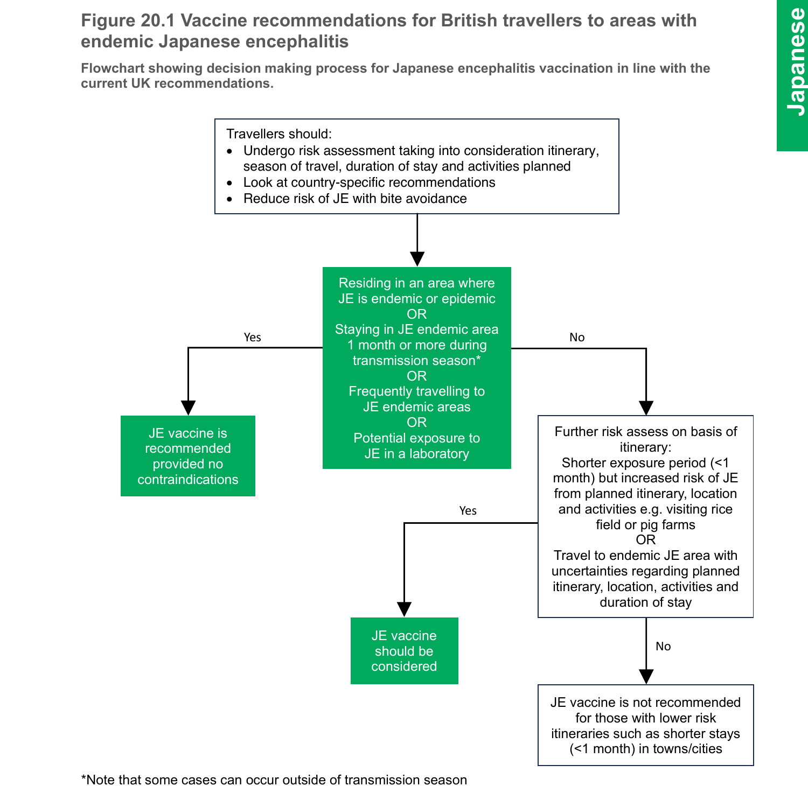

# Japanese encephalitis

## The disease

Japanese encephalitis (JE) is a mosquito-borne viral encephalitis caused by a flavivirus. It is the leading cause of childhood encephalitis in Asia. The global incidence of JE is unknown, however, an estimated 68,000 clinical cases occur annually in 24 countries with JE risk (World Health Organization, 2019).

It is endemic in rural areas, especially where rice growing and pig farming coexist, and epidemics occur in rural and occasionally in urban areas. Highest transmission rates occur during and just after wet seasons, when mosquitoes are most active. However, seasonal patterns vary both within individual countries and from year to year, and cases of JE are also reported outside of the normal seasonal period of high transmission. This disease is not transmitted from person to person.

The incubation period is from four to 14 days. Most JE infections are mild or asymptomatic. Approximately one in 250 infections are estimated to result in severe illness (rapid onset high fever, headache, neck stiffness, disorientation, coma, seizures). Case fatality rates for those with symptoms can be as high as 30 percent. Permanent sequelae (intellectual, behavioural and other neurological issues such as paralysis, Parkinsonian-like movement disorders, recurrent seizures or inability to speak) are reported in 20-30 percent of survivors (World Health Organization, 2019).

## History and epidemiology of the disease

Outbreaks were recorded in Japan as early as 1871; the first major epidemic in Japan was described in 1924 and involved 6,000 cases. JE spread throughout Asia but national immunisation campaigns and urban development in the 1960s led to the near-elimination of JE in Japan, South Korea, Singapore and Taiwan. However, JE remains endemic in much of the rest of Asia: China (excluding Taiwan) accounts for 50 percent of cases (Campbell G.L. _et al._, 2011). In 2022, the first reported JE outbreak in mainland Australia was declared (Australian Government, 2023).

The virus was isolated in the 1930s, and the first inactivated mouse-brain derived vaccines were produced in the same decade.

JE is rare in British travellers, but three cases were diagnosed in 2014/2015 resulting in severe neurological illnesses and long-term sequelae. None of these travellers had received the JE vaccine, despite having indications for it (Turtle L. _et al._, 2019).

## The Japanese encephalitis vaccination

There is currently one licensed vaccine recommended for use in the UK -- IXIARO®. IXIARO® is licensed in the UK for individuals aged two months and older.

IXIARO® is an inactivated vaccine produced in Vero cells and adsorbed onto an adjuvant of aluminum hydroxide to improve its immunogenicity. As the vaccine does not contain live organisms, it cannot cause the disease against which it protects.

## Storage

Vaccines should be stored in the original packaging at +2°C to +8°C and protected from light. All vaccines are sensitive to some extent to heat and cold. Heat speeds up the decline in potency of most vaccines, thus reducing their shelf life. Effectiveness cannot be guaranteed for vaccines unless they have been stored at the correct temperature. Freezing may cause increased reactogenicity and loss of potency for some vaccines. It can also cause hairline cracks in the container, leading to contamination of the contents.

## Presentation

IXIARO® is available as a 0.5ml suspension in a pre-filled syringe (Type 1 glass) with a plunger stopper (chlorobutyl elastomer).

## Dosage and schedule

|                                               | IXIARO®                                                                         |
| --------------------------------------------- | ------------------------------------------------------------------------------- |
| Children aged two months to under 36 months   | First dose of 0.25 ml at day 0. Second dose of 0.25 ml 28 days after first dose |
| Children aged three years and over and adults | First dose of 0.5ml at day 0. Second dose of 0.5ml 28 days after first dose     |

A rapid schedule administered at days 0 and 7 is also licensed for adults aged 18-64 years of age. Antibody responses are non-inferior to those of the standard vaccination schedule (Jelinek T _et al._, 2015, Cramer J. P. _et al._, 2016).

For children (from two months of age) and adults 65 years of age and older, although not licensed for these age groups due to lack of data, the rapid schedule can be used in circumstances where there is genuinely insufficient time to complete the standard schedule prior to travel. There are no data to suggest that the rapid schedule would be harmful for these travellers.

With both schedules, primary immunisation should ideally be completed at least one week prior to potential exposure to Japanese encephalitis virus.

In situations where the primary course plus initial booster has been interrupted, the schedule should be resumed, and not restarted.

The rapid schedule may be used in all age groups (from two months of age) where there is insufficient time to complete the standard schedule before travel. The rapid schedule is off license for children from 2 months to 17 years of age and adults 65 years of age and older.

## Administration

IXIARO® should be given by intramuscular injection. However, for individuals who have a bleeding disorder, IXIARO® should be given by deep subcutaneous injection to reduce the risk of bleeding.

IXIARO® can be given at the same time as other travel or routine vaccines. The vaccines should be given at a separate site, preferably in a different limb. If given in the same limb, they should be given at least 2.5cm apart (American Academy of Pediatrics, 2003).

## Disposal

Equipment used for vaccination, including used vials, ampoules, or partially discharged vaccines should be disposed of at the end of a session by sealing in a proper, puncture-resistant 'sharps' box according to local authority regulations and guidance in _Health Technical Memorandum 07-01: Safe management of healthcare waste_ (Department of Health, 2013).

## Recommendations for the use of the vaccine

The objective of JE vaccination is to protect individuals at high risk of exposure during travel or in the course of their occupation. Guidance on the employer's responsibility under Control of Substances Hazardous to Health (COSHH) Regulations is described in Chapter 12.

### Primary immunisation

**Infants under two months of age**

There are no safety or efficacy data on the use of IXIARO® in children under two months of age. IXIARO® is not usually recommended in children under two months of age in the UK.

IXIARO® is licensed and recommended for the following age groups.

**Children aged two months to under 36 months of age**

The licensed vaccine schedule is two doses of IXIARO®: 0.25 ml on days 0 and 28. Note this is half of the standard dose, see the manufacturer's patient information leaflet for instructions on discarding half of the vaccine (Valneva UK Ltd, 2023). Full immunity takes up to one week to develop after the second dose.

**Children aged three years to 17 years**

The licensed vaccine schedule is two doses of IXIARO®: 0.5ml on days 0 and 28. Full immunity takes up to one week to develop after the second dose.

**Adults 18 years and older**

The standard vaccine schedule is two doses of IXIARO® 0.5ml on days 0 and 28. Alternatively, a rapid schedule of two doses on days 0 and 7 can be used.

### Reinforcing immunisation

**First booster**

Children (from two months) and adults under 65 years:

a. For those at ongoing risk (such as laboratory staff and long-term travellers who expect to reside in JE endemic areas for appreciable periods of time), a booster dose should be given 12 months after primary immunisation.
b. For other travellers a booster dose should be given within the 12 - 24 months after primary immunisation, prior to potential re-exposure to JE virus.

Adults 65 years of age and older:
The duration of protection is uncertain for the primary course. A booster dose at 12 months should be considered for those at continued / further risk.

**Second booster**

Children:
No long-term seroprotection data beyond three years after the first booster immunisation has been generated. One study investigating antibody persistence in children living in a risk area estimated the duration of protection to be 9 years after the first booster dose (Kadlecek V. _et al._, 2018). No studies were identified estimating length of protection in those living outside risk areas.

Adults 18-64 years of age:
A second booster dose (4th dose) should be offered at 10 years to those who remain at risk.

Adults 65 years of age and older:
The length of protection following a booster dose (3rd dose) is not known. Response to the vaccine may be reduced in this age group and immunity may wane before 10 years.

IXIARO® may be used as a booster for those who received Green Cross vaccine or Biken vaccine previously.

### Travellers and those going to reside abroad

All travellers should undergo a careful risk assessment that takes into consideration their itinerary, season of travel, duration of stay and planned activities. The risk of JE should then be balanced against the risk of adverse events from vaccination (see Figure 20.1). JE vaccine is recommended for those who are going to reside in an area where JE is endemic or epidemic.

There is geographical variation in transmission periods, from all year round to seasonal. In temperate regions of Asia, most cases occur in the warm season, when large epidemics can occur (World Health Organization, 2019).

Cases of JE can also occur outside of the normal high transmission season (Buhl and Lindquist, 2009). In the tropics and subtropics, JE can occur year-round, but transmission often intensifies during the rainy season and pre-harvest period in rice-cultivating regions (World Health Organization, 2019).

Travellers to risk areas in Asia and the Western Pacific region should be immunised if staying for a month or longer in endemic areas during the transmission season, especially if travel will include rural areas. Other travellers with shorter exposure periods should be immunised if the risk is considered sufficient. For example, those spending a short period of time in rice fields (where the mosquito vector breeds) or close to pig farming (a reservoir host for the virus) should be considered for vaccination.

**Figure 20.1** Flowchart showing decision making process for Japanese encephalitis vaccination in line with the current UK recommendations.

**Decision tree description:**

1. Travellers should: undergo risk assessment taking into consideration itinerary, season of travel, duration of stay and activities planned; look at country-specific recommendations; reduce risk of JE with bite avoidance.

2. Is the traveller: residing in an area where JE is endemic or epidemic, OR staying in JE endemic area 1 month or more during transmission season\*, OR frequently travelling to JE endemic areas, OR potential exposure to JE in a laboratory?
   - **Yes** → JE vaccine is recommended provided no contraindications.
   - **No** → Further risk assess on basis of itinerary: shorter exposure period (<1 month) but increased risk of JE from planned itinerary, location and activities e.g. visiting rice field or pig farms, OR travel to endemic JE area with uncertainties regarding planned itinerary, location, activities and duration of stay?
     - **Yes** → JE vaccine should be considered.
     - **No** → JE vaccine is not recommended for those with lower risk itineraries such as shorter stays (<1 month) in towns/cities.

\*Note that some cases can occur outside of transmission season

Country-specific recommendations and information on the global epidemiology of JE can be found in the following websites https://travelhealthpro.org.uk and https://www.travax.nhs.uk.

### Laboratory workers

Immunisation is recommended for all research laboratory staff who have potential exposure to the virus. Worldwide there have been 22 cases of laboratory-acquired JE virus infection (Halstead _et al._, 2013).

## Contraindications

There are very few individuals who cannot receive IXIARO®. When there is doubt, appropriate advice should be sought from a travel health specialist.

IXIARO® should not be given to those who have had:

- a confirmed anaphylactic or serious systemic reaction to a previous dose of IXIARO® vaccine, or
- a confirmed anaphylactic reaction to any component of the vaccine.

## Precautions

### Individuals with pre-existing allergies

There is no known extra risk of hypersensitivity reactions to the IXIARO® vaccine.

### Pregnancy and breast-feeding

As a precautionary measure, administration of IXIARO® during pregnancy or lactation should be avoided. However, travellers and their medical advisers must make a risk assessment of the theoretical risks of JE vaccine in pregnancy against the potential risk of acquiring JE. Miscarriage has been associated with JE virus infection when acquired in the first two trimesters of pregnancy (Canadian Medical Association, 2002).

## Adverse reactions

The most common adverse reactions observed after administration of IXIARO® are pain and tenderness at the injection site, headache, fatigue and myalgia. Other reactions commonly reported are erythema, hardening, swelling and itching at the injection site, influenza-like illness, pyrexia and nausea.

## Management of cases

No specific therapy is available for JE. Supportive treatment can significantly reduce morbidity and mortality. Diagnostic testing is available through the Rare and Imported Pathogens Laboratory, UK Health Security Agency (UKHSA).

## Supplies

- IXIARO® is available from Valneva UK Ltd https://www.valneva.co.uk (Tel: 01506 446 608)

## References

- American Academy of Pediatrics (2003) Active immunization. In: Pickering LK (ed.) _Red Book: 2003 Report of the Committee on Infectious Diseases_ 26th edition. Elk Grove Village, IL: American Academy of Pediatrics, p33.
- Australian Government (2023) Statement on the end of Japanese encephalitis virus emergency response, 16 June 2023. https://www.health.gov.au/news/statement-on-the-end-of-japanese-encephalitis-virus-emergency-response
- Buhl MR, Lindquist L (2009), Japanese encephalitis is travelers: review of cases and seasonal risk. J. Trav Med 2009. **16**, 3: 217-219.
- Canadian Medical Association (2002) General considerations. In: _Canadian Immunization Guide_, 6th edition. Canadian Medical Association, p 14. https://publications.gc.ca/Collection/H49-8-2002E.pdf
- Campbell GL, Hills SL, Fischer M, Jacobson JA, Hoke CH, Hombach JM, Marfin AA, Solomon T, Tsai TF, Tsui VD & Ginsburg AS (2011) Estimated global incidence of Japanese encephalitis: a systematic review. Bull World Health Organ 2011;89:766--774E. https://apps.who.int/iris/handle/10665/271003
- Cramer JP, Jelinek T, Paulke-Korinek M _et al._, (2016) One-year immunogenicity kinetics and safety of a purified chick embryo cell rabies vaccine and an inactivated Vero cell-derived Japanese encephalitis vaccine administered concomitantly according to a new, 1-week, accelerated primary series. _J Trav Med_, 2016, **23**, 3: 1--8.
- Department of Health (2013) _Health Technical Memorandum 07-01: Safe and sustainable management of healthcare waste_. https://www.england.nhs.uk/publication/management-and-disposal-of-healthcare-waste-htm-07-01 Accessed: February 2024.
- Henderson A (1984) Immunization against Japanese encephalitis in Nepal: experience of 1152 subjects. _J R Army Med Corps_ **130:** 188--91.
- Jelinek T, Burchard GD, Dieckmann S, Bühler S, Paulke-Korinek M, Nothdurft HD, Reisinger E, Ahmed K, Bosse D, Meyer S, Costantini M, Pellegrini M (2015) Short-Term Immunogenicity and Safety of an Accelerated Pre-Exposure Prophylaxis Regimen With Japanese Encephalitis Vaccine in Combination With a Rabies Vaccine: A Phase III, Multicenter, Observer-Blind Study _J Trav Med._ **22 4:** 225--231.
- Kadlecek V, Borja-Tabora CF, Eder-Lingelbach S, _et al._, (2018) Antibody Persistence up to 3 Years After Primary Immunization With Inactivated Japanese Encephalitis Vaccine IXIARO in Philippine Children and Effect of a Booster Dose. Pediatr Infect Dis J 2018;37:e233--e240.
- Ohtaki E, Matsuishi T, Hirano Y, and Maekawa K (1995) Acute disseminated encephalomyelitis after treatment with Japanese B encephalitis vaccine (Nakayama-Yoken and Beijing strains). _J NeurolNeurosurg Psychiatry_ **59**: 316-7.
- Plesner AM, Soborg PA and Herning M (1996) Neurological complications and Japanese encephalitis vaccination. _Lancet_ **348:** 202--3.
- Poland JD, Cropp CB, Craven RB and Monath TP (1990) Evaluation of the potency and safety of inactivated Japanese encephalitis vaccine in US inhabitants. _J Infect Dis_ **161:** 878--82.
- Turtle L, Easton A, Defres S, Ellul M, Bovill B, Hoyle J, Jung A, Lewthwaite P, Solomon T (2019) 'More than devastating'---patient experiences and neurological sequelae of Japanese encephalitis. _J Trav Med_, _2019_ 1-7.
- Valneva UK Ltd (2023) Ixiaro patient information leaflet. March 2023, https://www.medicines.org.uk/emc/product/6534/pil Accessed: February 2024.
- World Health Organization (2019) Japanese encephalitis factsheet. https://www.who.int/news-room/fact-sheets/detail/japanese-encephalitis Accessed: February 2024.
