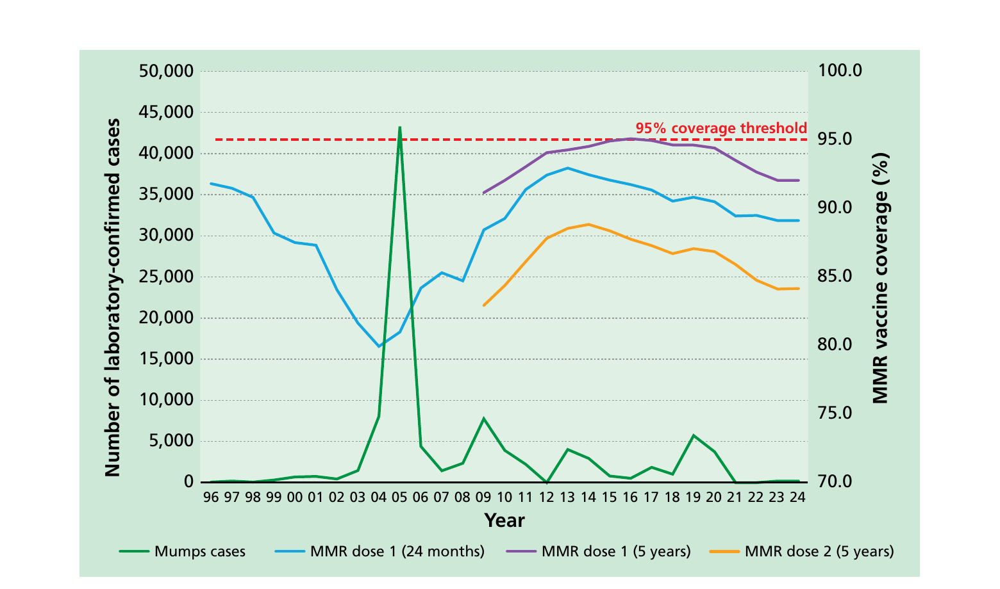

# Mumps

**NOTIFIABLE**

## The disease

Mumps is an acute viral illness caused by a paramyxovirus. It is usually characterised by parotid swelling (83-100% of mumps infections), either bilaterally or unilaterally. Parotitis may be preceded by several days of non-specific symptoms such as fever, headache, malaise, myalgias and anorexia. Asymptomatic mumps infection occurs in approximately 20 to 40% of infected persons, particularly in children (Plotkin _et al_, 2023).

Mumps virus is spread through respiratory droplets and close contact. The incubation period is typically 16 to 18 days after exposure. Individuals with mumps are most infectious in the several days before and after the onset of parotid swelling.

Mumps virus frequently affects the nervous system with clinical evidence of meningitis in approximately 5% of cases and mumps viruses often identified in the cerebrospinal fluid. Neurological complications, including meningitis and encephalitis, may precede or follow parotitis but can also occur in its absence.

Other common complications include pancreatitis (4%), oophoritis (5% of post-pubertal women) and orchitis (up to a third of post-pubertal men) (Falk _et al._, 1989; Plotkin _et al_, 2023; Philip _et al._, 1959). Sub-fertility following bilateral orchitis has rarely been reported (Bjorvatn _et al._, 1973; Dejucq and Jegou, 2001). Sensorineural deafness (bilateral or unilateral) is a well-recognised complication of mumps, with estimates of its frequency varying from one in 3400 cases to one in 20,000 (Garty _et al._, 1988). Nephritis, arthropathy, cardiac abnormalities and, rarely, death have been reported.

## History and epidemiology of the disease

Mumps only affects humans. Individuals who are symptomatic, asymptomatic or have infection with non-classical symptoms can transmit the virus.

Before the introduction of the measles, mumps and rubella (MMR) vaccine in 1988, mumps occurred commonly in school-age children, and more than 85% of adults had evidence of previous mumps infection (Morgan Capner _et al._, 1988). Mumps was the cause of about 1200 hospital admissions each year in England and Wales and was the commonest cause of viral meningitis in children (Galbraith _et al._, 1984; Public Health Laboratory Service, 1985).

Mumps was made a notifiable disease in the UK in October 1988 at the time of the introduction of the MMR vaccine. High coverage of MMR vaccine resulted in a substantial reduction in mumps transmission in the UK and the incidence declined in all age groups, including those too old to have been immunised. The number of notified cases in England and Wales fell from 20,713 in 1989, to 1587 in 1998 (Health Protection Agency, 2008). In October 1996, a two-dose MMR schedule was introduced to ensure both individual and population protection.

Figure 1. Laboratory confirmed cases of mumps by year, England and Wales, 1996 to 2024 and MMR vaccine coverage dose 1 at 24 months, dose 1 and 2 at 5 years of age

Mumps containing vaccines have been adopted globally, with 123 of the 194 (63%) WHO Member States having a mumps-containing vaccine in their routine childhood programmes, usually MMR or MMRV (WHO 2024). Similarly, the European Centre for Disease Prevention and Control (ECDC) reports the standardized use of mumps vaccines in EU/EEA childhood schedules with two doses generally recommended. Vaccination has significantly reduced the incidence and severity of mumps outbreaks worldwide.

In November 1994, to prevent a predicted epidemic of measles, children aged between five and 16 years were immunised with measles-rubella (MR) vaccine. At that time, insufficient stocks of MMR were available to vaccinate all of these children against mumps. Younger members of this age group, however, were unlikely to have been exposed to mumps infection and many remained susceptible into early adulthood.

An increase in confirmed mumps cases was seen from 1999 with most cases occurring in adolescents or young adults who were too old to have been offered MMR when it was introduced in 1988 or to have had a second dose when this was introduced in 1996. They had not previously been exposed to natural mumps infection as children and so remained susceptible. Significant further increases occurred between 2003 and 2005, primarily in children aged 10-17 years, with cases peaking in 2005 when the number of confirmed cases in England and Wales reaching 43,378.

Between 2006 and 2018, case numbers in England and Wales reduced, with smaller peaks in 2009 (7,662 confirmed cases), 2013 (4,035 confirmed cases) and 2017 (1,840 confirmed cases) suggesting a cyclical pattern.

Whilst earlier outbreaks were mainly in older university and college students with the majority of confirmed cases born prior to routine MMR vaccination, there was a suggestion that waning immunity was also a contributory factor as a proportion of cases had received at least one dose of MMR (HPA, 2009). Over this period other countries also reported mumps in highly immunised populations (Dayan _et al_, 2008; Marin _et al_, 2008; Centers for Disease Control and Prevention (CDC), 2010; Boxall _et al_, 2008).

A careful history of mumps containing vaccine is required, cross-checked against the routine/catch-up programmes and products known to be available at the time to understand the likely susceptibility of older birth cohorts to mumps infection. A table of eligibility and coverage of measles-containing vaccines, and therefore mumps susceptibility, is detailed in Appendices 1 and 2 of the UKHSA publication: [Risk assessment for measles resurgence in the UK](https://assets.publishing.service.gov.uk/media/64aff9448bc29f00132ccd07/risk-assessment-for-measles-resurgence-in-the-UK-2023.pdf) (2023).

The most recent significant increase in mumps cases occurred in 2019 (UK GOV 2020), with a peak of over 2,000 confirmed cases in the second quarter of the year and a second higher peak in the first quarter of 2020, with over 3,000 confirmed cases. Case numbers then fell sharply likely due to the considerable population control measures introduced to limit the spread of COVID-19. This mumps surge was linked to outbreaks in colleges and Universities, again driven by young people who had missed out on their MMR vaccine in the late 1990s / early 2000s. As has previously been documented in outbreaks in these settings there were also a significant proportion of cases in individuals who had at least one dose of the MMR vaccine. This is explained by waning immunity to infection in the context of very close mixing in university cohorts. Within mumps outbreaks amongst highly immunised populations there is evidence that those who have been immunised are less likely to suffer complications such as orchitis and meningitis (Yung C, _et al_, 2011).

From 1 January 2026, a universal varicella vaccination programme was introduced in the UK using the measles, mumps, rubella and varicella (MMRV) combination vaccine (see the [varicella chapter](https://www.gov.uk/government/publications/varicella-the-green-book-chapter-34) for more detail). As part of this new programme, the MMR vaccination schedule changed. The first dose of MMRV replaces the first dose of MMR at 12 months of age; the second dose of MMR has been brought forward and replaced with MMRV at 18 months of age, rather than at 3 years 4 months. This schedule change was advised by the JCVI as a potential opportunity to increase coverage and provide increased protection against potential measles outbreaks (JCVI, 2022). Studies in London (Lacy _et al_, 2022) where the second dose of MMR has been brought forward from 3 years 4 months to 18 months in response to measles outbreaks have shown that an earlier vaccination with the second dose of MMR is associated with significantly higher coverage at 5 years for this vaccine.

## The MMRV and MMR vaccines

Mumps vaccination is available as part of two combined vaccines -- measles, mumps, rubella and varicella (MMRV) and measles, mumps and rubella (MMR) vaccines. MMR or MMRV is suitable for individuals requiring protection against measles, mumps, rubella and/or varicella. MMRV is the preferred vaccine for younger children but MMR or varicella should be offered to older individuals, as appropriate, to preserve MMRV supply for those more likely to be susceptible to all four viruses.

MMR and MMRV vaccines are freeze-dried (lyophilised) preparations containing live, attenuated (weakened) strains of measles, mumps, rubella and varicella viruses. The four attenuated virus strains are cultured separately in appropriate media and mixed before being lyophilised. Two MMRV and two MMR vaccines are available in the UK as below.

MMRV:

- Priorix-Tetra®
- ProQuad®

MMR:

- MMRVAXPRO®
- Priorix®

MMR and MMRV vaccines do not contain thiomersal or any other preservatives. Aluminium is not used in MMR and MMRV vaccines.

MMR and MMRV vaccines may contain trace amounts of neomycin.

MMRVAXPRO® and ProQuad® contain gelatine of porcine origin as a stabiliser. Priorix® or Priorix-Tetra® can be offered to individuals who do not accept gelatine-containing medicines or vaccines. Further information is available in the UKHSA publication 'Vaccines and porcine gelatine': https://www.gov.uk/government/publications/vaccines-and-porcine-gelatine.

All MMR and MMRV vaccines (Priorix®, Priorix Tetra®, MMRVAXPRO® and ProQuad®) contain a source of phenylalanine. The National Society for Phenylketonuria (NSPKU) advise the amount of phenylalanine contained in vaccines is negligible and therefore strongly advise individuals with PKU to take up the offer of immunisation.

### Storage

[Chapter 3](https://www.gov.uk/government/publications/storage-distribution-and-disposal-of-vaccines-the-green-book-chapter-3) contains information on vaccine storage, distribution and disposal.

The summary of product characteristics (SPC) may give further details on vaccine storage.

### Presentation

Mumps vaccine is only available as part of a combined product as MMR or MMRV.

**Priorix Tetra®** is supplied as a whitish to slightly pink coloured cake and the solvent is a clear colourless liquid. The vaccine should be well shaken until the powder has completely dissolved in the solvent. Upon reconstitution, the vaccine appearance may vary from a clear peach to a fuchsia pink colour, due to minor pH variations. It may contain translucent product-related particulates, which do not impair the vaccine efficacy.

**ProQuad®** is supplied as a white to pale yellow compact crystalline cake and the solvent is a clear colourless liquid. The solvent and powder should be gently agitated to dissolve completely to form a clear pale yellow to light pink liquid.

**MMRVAXPRO®** is supplied as a light yellow compact crystalline cake for reconstitution, and the solvent is a clear colourless liquid. The reconstituted vaccine must be shaken gently to ensure thorough mixing. When completely reconstituted, the vaccine is a clear yellow liquid.

**Priorix®** is supplied as a whitish to slightly pink coloured cake, a portion of which may be yellowish to slightly orange, and the solvent is a clear colourless liquid. The reconstituted vaccine must be shaken well until the powder is completely dissolved in the diluent. The reconstituted vaccine may vary in colour from clear peach to fuchsia pink .

Once reconstituted, the vaccine should only be used if it matches the relevant description above. The relevant SPC may give further details on vaccine presentation.

### Dosage and schedule

Two doses of 0.5ml of an MMR-containing vaccine at the recommended interval (see below).

### Administration

**Administration site**

[Chapter 4](https://www.gov.uk/government/publications/immunisation-procedures-the-green-book-chapter-4) covers guidance on administering vaccines.

Most injectable vaccines are routinely given intramuscularly into the deltoid muscle of the upper arm or, for infants 1 year and under, into the anterolateral aspect of the thigh.

Vaccines are routinely given intramuscularly into the upper arm or anterolateral thigh. However, for individuals with a bleeding disorder, vaccines should be given by deep subcutaneous injection to reduce the risk of bleeding.

**Administration with other vaccines**

Mumps-containing vaccines can be given at the same time as other vaccines recommended at the same visit such as DTaP/ IPV/HepB, PCV, and Men B. If MMR/MMRV cannot be given at the same time as an inactivated vaccine, it can be given at any interval before or after. The vaccines should be given at a separate site, preferably into a different limb. If given into the same limb, they should be given at least 2.5cm apart (American Academy of Pediatrics, 2021). The site at which each vaccine was given should be noted in the individual's records.

Advice on intervals between live vaccines is based upon specific evidence of interference between vaccines. [Chapter 11](https://www.gov.uk/government/publications/immunisation-schedule-the-green-book-chapter-11) provides information on the recommended time intervals between MMR/MMRV and other live vaccines, as well as further information on tuberculin skin testing and MMR/MMRV vaccination.

**Administration with blood products**

When MMR and MMRV vaccines are given within three months of receiving blood products, such as immunoglobulin, the response may be reduced. This is because such blood products may contain significant levels of measles, mumps, rubella and/or varicella-specific antibody, which could then prevent vaccine virus replication (CDC 2024). It is unlikely, however, that response to all three viruses will be completely absent after receipt of any blood product. Therefore, to reduce the risk that a deferred vaccination would be missed, and particularly where immediate measles protection is required, MMR/MMRV should still be given regardless of recent blood product receipt. To confer longer term protection, however, another dose of MMR/MMRV should be considered after three months.

### Disposal

[Chapter 3](https://www.gov.uk/government/publications/storage-distribution-and-disposal-of-vaccines-the-green-book-chapter-3) outlines storage, distribution and disposal requirements for vaccines.

Equipment used for immunisation, including used vials, ampoules, or discharged vaccines in a syringe, should be disposed of safely in a UN-approved puncture-resistant 'sharps' box, according to local waste disposal arrangements and guidance in the [technical memorandum 07-01: Safe and sustainable management of healthcare waste (NHS England)](https://www.england.nhs.uk/publication/management-and-disposal-of-healthcare-wastehtm-07-01/).

## Recommendations for the use of the vaccine

The objective of the routine immunisation programme is to provide two doses of MMR-containing vaccine at appropriate intervals for all eligible individuals.

A single dose of measles-containing vaccine is at least 95% effective in preventing clinical measles (Demicheli V, _et al._, 2012). After a second dose of measles-containing vaccine protection increases to well above 95% (Wichmann _et al._, 2007). A single dose of a rubella-containing vaccine confers around 95 to 100% protection against disease (Orenstein _et al._, 2023, Chapter 54). Following vaccination or natural rubella infection, asymptomatic reinfection has been reported rarely; clinical disease has very rarely been reported (Davis _et al._, 1971; Fogel _et al._, 1978). The absence of rubella outbreaks in well-vaccinated countries indicates long-term persistence of immunity against rubella disease in vaccinated populations (Orenstein _et al._, 2023, Chapter 54; Latner _et al._, 2011). The effectiveness of a single dose of mumps Jeryl Lynn strain-containing vaccine as used in the UK, determined by field studies is approximately 72% and that of two doses is approximately 86% (Di Pietrantonj _et al._, 2021). Two doses are needed for both individual and population protection. Whilst mumps protection declines with age (Harling _et al._, 2005, Cohen _et al_ 2007), fully vaccinated cases have a much lower likelihood of suffering complications of disease (Yung _et al._, 2011).

The immune response to the MMRV vaccine after one dose demonstrates high seroconversion rates, with approximately 87.5% to 100% of children developing antibodies against measles, mumps, rubella and varicella. Following the second dose, seroconversion improves further, reaching almost 100% for measles, mumps and rubella and at least 95.8% for varicella (Cenoz _et al_, 2013). Effectiveness studies align with these findings, showing that one dose provides good protection, but two doses offer superior and durable immunity. Measles vaccine effectiveness reaches up to 95% after one dose and exceeds 96% after two doses, while varicella effectiveness improves from about 75--87% after one dose to 94--98% after two doses. These results are supported by clinical trials and immunogenicity studies worldwide (Lalwani _et al_, 2015, Di Pietrantonj _et al_. 2021).

MMR or MMRV is suitable for individuals requiring protection against measles, mumps, rubella and/or varicella. MMRV is the preferred vaccine for younger children but MMR or varicella should be offered to older individuals, as appropriate, to preserve MMRV supply for those more likely to be susceptible to all four viruses. MMR/ MMRV vaccine can be given irrespective of a history of measles, mumps, rubella or varicella infection. There are no ill effects from immunising such individuals because they have pre-existing immunity that inhibits replication of the vaccine viruses.

Since the cessation of antibody screening for rubella in pregnancy, it remains important to encourage MMR vaccination for women of child-bearing age -- for example at opportunities such as family planning consultations. In addition, MMR vaccination status should be checked at ante-natal clinic appointments and unvaccinated or partially vaccinated pregnant women should be offered missing doses post-partum, for example at the post-natal check or if they accompany their infant to their routine immunisations. If two doses of MMR are required, then the second dose should be given one month after the first.

The decision on when to vaccinate older adults needs to take into consideration past vaccination history, the likelihood of an individual remaining susceptible and the future risk of exposure and disease:

- individuals who were born in the UK between 1980 and 1990 may not be protected against mumps but are likely to be vaccinated against measles and rubella. They may never have received a mumps-containing vaccine or had only one dose of MMR and had limited opportunity for exposure to natural mumps. They should be caught up opportunistically with one or two doses of the MMR vaccine given at least one month apart
- individuals born between 1970 and 1979 may have been vaccinated against measles and many will have been exposed to mumps and rubella during childhood. However, this age group should be offered MMR wherever feasible, particularly if they are considered to be at high risk of exposure. Where such adults are being vaccinated because they have been demonstrated to be susceptible to at least one of the vaccine components, then either two doses should be given, or there should be evidence of seroconversion to the relevant antigen
- individuals born before 1970 are likely to have had all three natural infections and are less likely to be susceptible. MMR vaccine should be offered to such individuals on request or if they are considered to be at high risk of exposure. Where such adults are being vaccinated because they have been demonstrated to be susceptible to measles or rubella, then either two doses should be given or there should be evidence of seroconversion to the relevant antigen

### Individuals with unknown or incomplete vaccination histories

Where a child born in the UK presents with an uncertain immunisation history, every effort should be made to clarify what immunisations they may have had (see [Chapter 11](https://www.gov.uk/government/publications/immunisation-schedule-the-green-book-chapter-11)).

Children coming to the UK who have a history of completing immunisation in their country of origin may not have been offered protection against all the antigens in the MMR or MMRV vaccine. Immunisation schedules for specific countries can be found on the [WHO website](https://www.who.int/teams/immunization-vaccines-and-biologicals/policies/who-policy-recommendations-for-routine-immunization-in-table-format).

Individuals coming from areas of conflict or from population groups who may have been marginalised in their country of origin (e.g. refugees, Gypsy or other nomadic travellers) may not have had good access to immunisation services. In particular, older children and adults may also have been raised during periods before immunisation services were well developed or when vaccine quality was sub-optimal. Where there is no reliable history of previous immunisation, it should be assumed that any undocumented doses are missing and the UK catch-up recommendations for that age should be followed (see Chapter 11). The routine boosters should be given according to the UK schedule.

Further guidance on vaccination of individuals with uncertain or incomplete immunisation is published by UKHSA in [Chapter 11](https://www.gov.uk/government/publications/immunisation-schedule-the-green-book-chapter-11) and at the following link: https://www.gov.uk/government/publications/vaccination-of-individuals-with-uncertain-or-incomplete-immunisation-status/

### Young children

From the 1 January 2026, the national immunisation schedule changed to recommending that children receive two doses of MMRV vaccine at 12 and 18 months of age.

The first dose of MMR/ MMRV should be given between 12 and 13 months of age (i.e. within a month of the first birthday). Immunisation before one year of age may provide earlier protection and may be beneficial when measles is circulating and there is a higher risk of infection in the first year of life, however residual maternal antibodies may reduce the response to the vaccine. The optimal age chosen for scheduling children is therefore a compromise between risk of infection and optimal response to vaccine.

If a dose of MMR/ MMRV is given before the first birthday, either because of travel to an endemic country, or because of a local outbreak, then this dose should not be counted, and two further doses should be given at the recommended times between 12 and 13 months of age (i.e. within a month of the first birthday) and at 18 months of age (see [Chapter 11](https://www.gov.uk/government/publications/immunisation-schedule-the-green-book-chapter-11)).

The second dose of MMRV vaccine is given at 18 months of age, but if needed can be given any time from three months after the first dose. Allowing three months between doses is likely to maximise the response to measles, particularly in young children under the age of 18 months where maternal antibodies may reduce the response to vaccination (Orenstein _et al._, 1986; Redd _et al._, 2004; de Serres _et al._, 1995). Where protection against measles is urgently required, the second dose can be given one month after the first (ACIP, 1998). If the child is given the second dose less than three months after the first dose, then the routine 18-month dose (which would constitute a third dose in this case) should be given in order to ensure full protection.

It is vital that, by the age of 3 years 4 months, every child has received two doses of an MMR-containing vaccine (either MMR or MMRV). Children born on or before the 31 December 2019 will have followed the previous two dose MMR vaccination schedule at 12 months and 3 years 4 months of age, and will not be eligible to receive MMRV vaccination through the national vaccination programme or catch-up campaign. MMRV vaccination eligibility by date of birth are set out in the relevant advice from the NHS in each country.

### Older children and adults

All children should have received two doses of MMR-containing vaccine (either MMR or MMRV) by the age of 3 years and 4 months. MMR vaccine should be used for catching up children or adults who have not received two-doses of MMR and who are not eligible for varicella vaccination (see above and varicella chapter for details about varicella eligibility and catch-up campaigns). However if MMRV, rather than MMR, is the only vaccine available at the clinic, at the time of the offer of opportunistic catch-up then that vaccine can be used. The teenage booster appointment around 14 years of age is an opportunity to ensure that unimmunised or partially immunised children are given MMR. If two doses of MMR are required, then the second dose should be given one month after the first.

MMR vaccine can be given to individuals of any age and should be offered opportunistically and promoted to unvaccinated or partially vaccinated younger adults -- particularly those born before 1990. New GP registration, and entry into college, university, or other higher education institutions, prison or military service also provides an opportunity to check an individual's immunisation history. Those who have not received MMR should be offered appropriate MMR immunisation.

## Contraindications

[Chapter 6](https://www.gov.uk/government/publications/contraindications-and-special-considerations-the-green-book-chapter-6) contains information on contraindications and special considerations for vaccination.

There are very few individuals who cannot receive MMR or MMRV vaccines. When in doubt, appropriate advice should be sought from the relevant specialist consultant, immunisation co-ordinator or consultant in communicable disease control rather than withholding the vaccine.

The vaccine should not be given to:

- those who are immunosuppressed (see [Chapter 6](https://www.gov.uk/government/publications/contraindications-and-special-considerations-the-green-book-chapter-6) for more detail)
- those who have had a confirmed anaphylactic reaction to a previous dose of a measles-, mumps- rubella- or varicella containing vaccine
- those who have had a confirmed anaphylactic reaction to a component of the vaccine including neomycin or gelatine
- pregnant women

Specific advice on management of individuals who have had an allergic reaction can be found in [Chapter 8](https://www.gov.uk/government/publications/vaccine-safety-and-the-management-of-adverse-events-following-immunisation-the-green-book-chapter-8).

Anaphylaxis after MMR and MMRV is extremely rare (5.14 to 19.84 per million doses) (McNeil _et al_, 2016). Minor allergic conditions may occur and are not contraindications to further immunisation with MMR/MMRV or other vaccines. A careful history of that event will often distinguish between anaphylaxis and other events that are either not due to the vaccine or are not life-threatening. In the latter circumstances, it may be possible to continue the immunisation course. Specialist advice must be sought on the vaccines and circumstances in which they could be given. The lifelong risk of the individual of not being immunised must be taken into account.

## Precautions

[Chapter 6](https://www.gov.uk/government/publications/contraindications-and-special-considerations-the-green-book-chapter-6) contains information on contraindications and special considerations for vaccination.

Minor illnesses without fever or systemic upset are not valid reasons to postpone immunisation. If an individual is acutely unwell, immunisation may be postponed until they have fully recovered. This is to avoid confusing the differential diagnosis of any acute illness by wrongly attributing any signs or symptoms to the adverse effects of the vaccine.

Individuals who have had a systemic or local reaction following a previous immunisation with MMR/MMRV can continue to receive subsequent doses of MMR/MMRV vaccine.

[Chapter 8](https://www.gov.uk/government/publications/vaccine-safety-and-the-management-of-adverse-events-following-immunisation-the-green-book-chapter-8) covers vaccine safety and the management of adverse events following immunisation.

Children with chronic conditions such as cystic fibrosis, congenital heart or kidney disease, failure to thrive or Down's syndrome are at particular risk from measles infection. It is particularly important that children in these groups are vaccinated if they have no other contraindications for vaccination.

### Idiopathic thrombocytopaenic purpura

Idiopathic thrombocytopaenic purpura (ITP) occurs rarely following MMR/MMRV vaccination, usually within six weeks of the first dose. The risk of developing ITP after MMR/MMRV vaccine is much less than the risk of developing it after infection with wild measles or rubella virus.

If ITP has occurred within six weeks of the first dose of MMR/MMRV, then blood should be taken and tested for measles antibodies before a second dose is given. Serum should be sent to the UKHSA Virus Reference Laboratory, which offers free, specialised serological testing for such children. If the results suggest a lack of protection against measles, then a second dose of MMRV is recommended. Serological testing for the mumps, rubella, and varicella components is not recommended.

### Allergy to egg

All children with egg allergy should receive the MMR/MMRV vaccination as a routine procedure in primary care (Clark _et al._, 2010). Data suggest that anaphylactic reactions to MMR vaccine are not associated with hypersensitivity to egg antigens but to other components of the vaccine (such as gelatine) (Fox and Lack, 2003). In three large studies with a combined total of over 1000 patients with egg allergy, no severe cardiorespiratory reactions were reported after MMR vaccination (Fasano _et al._, 1992; Freigang _et al._, 1994; Aickin _et al._, 1994; Khakoo and Lack, 2000). Children who have had documented anaphylaxis to the vaccine itself should be assessed by an allergist (Clark _et al.,_ 2010).

### Pregnancy and breast-feeding

There is no evidence that MMR-containing vaccines are teratogenic.

However, as a precaution, MMR/MMRV vaccine should not be given in pregnancy. Pregnancy should be avoided for one month following the last dose of vaccine.

There are no safety concerns, either for the mother or the baby, when MMR-containing vaccine is given in pregnancy or shortly prior to pregnancy. Those who have been immunised with MMR or MMRV in pregnancy can be reassured (see "[MMR vaccine: advice for pregnant women](https://www.gov.uk/guidance/vaccination-in-pregnancy-vip#notify-ukhsa)"). Such an incident would not be a reason to recommend termination of pregnancy (Tookey _et al._, 1991).

If a pregnant individual develops a generalised vesicular (varicella-like) rash following MMRV vaccination, they should be clinically reviewed for consideration of antivirals. Local injection site reactions are common and do not require any specific follow up.

UKHSA monitors women who have inadvertently received varicella-containing vaccine such as MMRV up to 3 months before pregnancy or at any time during pregnancy, as well as women who have inadvertently received MMR vaccine up to 30 days before pregnancy or at any time during pregnancy. Women who have been immunised with MMR or MMRV in pregnancy should be reported to the UKHSA Vaccine in Pregnancy Surveillance: https://www.gov.uk/guidance/vaccination-in-pregnancy-vip#notify-ukhsa.

Breast-feeding is not a contraindication to MMR/MMRV immunisation, and MMR/MMRV vaccine can be given to breast-feeding mothers without any risk to their baby. Very occasionally, rubella vaccine virus has been found in breast milk, but this has not caused any symptoms in the baby (Buimovici-Klein _et al._, 1997; Landes _et al._, 1980; Losonsky _et al._, 1982). The vaccine does not work when taken orally. There is no evidence of mumps, measles or varicella vaccine viruses being found in breast milk in mothers vaccinated postpartum.

For advice regarding suitability of MMR/MMRV for a breastfed child whose mother is taking biological treatments, please see [Chapter 6.](https://www.gov.uk/government/publications/contraindications-and-special-considerations-the-green-book-chapter-6)

### Premature infants

It is important that premature infants have their immunisations at the appropriate chronological age, according to the schedule (see [Chapter 11](https://www.gov.uk/government/publications/immunisation-schedule-the-green-book-chapter-11)).

### Immunosuppression and HIV

MMR/ MMRV vaccines are not recommended for patients with severe immunosuppression (see [Chapter 6](https://www.gov.uk/government/publications/contraindications-and-special-considerations-the-green-book-chapter-6)) (Angel _et al._, 1996). MMR/ MMRV vaccines can be given to individuals living with HIV without or with moderate immunosuppression (as defined in Table 1).

Wherever possible, immunisation of immunosuppressed or individuals living with HIV should be either carried out before immunosuppression occurs or deferred until an improvement in immunity has been seen. [Chapter 7](https://www.gov.uk/government/publications/immunisation-of-individuals-with-underlying-medical-conditions-the-green-book-chapter-7) contains more information on immunisation of individuals with underlying medical conditions, including immunosuppression.

Further guidance is provided by the British HIV Association (BHIVA) immunisation guidelines for HIV-positive adults (https://www.bhiva.org/vaccination-guidelines) and the Children's HIV Association (CHIVA) immunisation guidelines (https://www.chiva.org.uk/infoprofessionals/guidelines/immunisation/) For guidance on MMRV vaccination, please follow guidance for MMR and varicella vaccination outlined in these documents.

BHIVA position statement on measles in individuals living with HIV [BHIVA-position-statement-on-measles-in-people-living-with-HIV.pdf.pdf](https://www.bhiva.org/file/5d4b8c0f2faf1/BHIVA-position-statement-on-measles-in-people-living-with-HIV.pdf.pdf)

**Table 1 CD4 count/μl (% of total lymphocytes)**

| Age                  | <12 months          | 1--5 years         | 6--12 years        | >12 years          |
| -------------------- | ------------------- | ------------------ | ------------------ | ------------------ |
| No suppression       | ≥1500 (≥25%)        | ≥1000 (≥25%)       | ≥500 (≥25%)        | ≥500 (≥25%)        |
| Moderate suppression | 750--1499 (15--24%) | 500--999 (15--24%) | 200--499 (15--24%) | 200--499 (15--24%) |
| Severe suppression   | <750 (<15%)         | <500 (<15%)        | <200 (<15%)        | <200 (<15%)        |

For vaccination of children with medical conditions please see [Chapter 7](https://www.gov.uk/government/publications/immunisation-of-individuals-with-underlying-medical-conditions-the-green-book-chapter-7)

### Neurological conditions

The presence, or a history of a neurological condition is not a contraindication to immunisation but in a child with evidence of current neurological deterioration, deferral of vaccination may be considered, to avoid incorrect attribution of any change in the underlying condition. The risk of such deferral should be balanced against the risk of the preventable infection, and vaccination should be promptly given once the diagnosis and/or the expected course of the condition becomes clear. There will be very few occasions when deferral of immunisation is required. Deferral leaves the child unprotected and so the period of deferral should be minimised, with immunisation commencing as soon as possible. If a specialist recommends deferral, this should be clearly communicated to the individual's primary care provider and he or she must be informed as soon as the child is fit for immunisation.

Children with a personal or close family history of seizures should be given MMR/MMRV vaccine. Further information about likely timing of any fever and management of a fever should be given. Vaccinators should seek specialist paediatric advice rather than unnecessarily withhold immunisation.

## Adverse reactions

Many studies conducted worldwide have found MMR and MMRV vaccines to be well tolerated and rarely associated with serious adverse events.

Adverse reactions following the MMR/MMRV vaccines (except allergic reactions) are due to effective replication of the vaccine viruses with subsequent mild illness. Such events are to be expected in some individuals. Events due to the measles component occur six to 11 days after vaccination. Events due to the mumps and rubella components usually occur two to three weeks after vaccination but may occur up to six weeks after vaccination. Events due to the varicella component usually occur within a month of vaccination with MMRV. These events only occur in individuals who are susceptible to that component and are therefore less common after second and subsequent doses.

Following MMR/MMRV, individuals may develop a measles-like rash. They can be reassured that they are not infectious for measles. However, they should be reviewed by a clinician and recent exposure should be considered. Some individuals may develop a varicella-like rash around the site of the injection. This should not prevent them from attending childcare or educational settings, but it should be kept covered as a precaution. Transmission of varicella vaccine virus from immunocompetent vaccinees to susceptible close contacts has occasionally been documented but the risk is very low. For more details on varicella vaccine associated rash, please see the [varicella chapter](https://www.gov.uk/government/publications/varicella-the-green-book-chapter-34).

### Common events

Common reactions following MMR and MMRV vaccination include fever, rash and injection site reactions including pain, swelling and erythema. These reactions appear most commonly about a week after immunisation, and last about two to three days.

Vomiting and diarrhoea can also be seen following MMRV vaccination. Upper respiratory tract infection can be seen following MMR vaccination.

Adverse reactions are considerably less common after a second dose of MMR vaccine than after the first dose. Overall rates of adverse reactions after a second MMRV dose are similar to or lower than seen after a first dose and are comparable to those who received separate varicella (Oka/Merck) and MMR vaccine.

### Rare and more serious events

Febrile seizures are the most commonly reported neurological event following MMR/MMRV vaccination, with febrile seizures occurring more commonly following the first dose of vaccine than the second. Simple febrile seizures are generalised, short-lived and generally considered benign with excellent neurological prognosis.

The rate of febrile seizures following MMR vaccination is lower than that following infection with measles disease. It is estimated that following MMRV vaccination, 96 cases of febrile convulsions occur in every 100,000 children. This is in contrast to 2,300 cases in every 100,000 children following measles infection, and 4,000 cases in 100,000 children in the overall paediatric population (Casabona _et al._, 2023). There is good evidence that febrile seizures following MMR immunisation do not increase the risk of subsequent epilepsy compared with febrile seizures due to other causes (Vestergaard _et al._, 2004).

Febrile seizures are reported more commonly following administration of the first dose of MMRV vaccine than MMR, or co-administered MMR and varicella, vaccine (Orenstein _et al._, 2023, Chapter 38). Several studies have reported an approximately two-fold increased relative risk of febrile seizures within 5 to 12 or 7 to 10 days after the administration of the first MMRV dose of the two-dose vaccination schedule in infants compared with the separate administration of MMR and varicella vaccine during the same medical visit. However, the absolute risk of febrile seizures remains very low. The elevated risk following the first dose of MMRV has not be observed when using the combination vaccine as a second dose.

Having taken into account the above information, the JCVI advised the use of the combination MMRV vaccine in the national programme rather than separate MMR and varicella vaccination. A study of parental acceptance of varicella vaccination in the UK (Sherman _et al_, 2023) showed that a combined vaccination was preferred over an additional injection at the same immunisation visit, reflecting previous experience that parents prefer fewer injections for their children.

Because MMR/ MMRV vaccine contains live, attenuated viruses, it is biologically plausible that it may cause encephalitis. A large record-linkage study in Finland looking at over half a million children aged between one and seven years did not identify any association between MMR and encephalitis (Makela _et al._, 2002).

Idiopathic thrombocytopaenic purpura (ITP) may occur following MMR/MMRV vaccination and is most likely due to the rubella component. This usually occurs within six weeks and resolves spontaneously. ITP occurs in about one in 22,300 children who are given a first dose of MMR in the second year of life (Miller _et al._, 2001). The risk of developing ITP after MMR/MMRV vaccination is much less than the risk of developing it after infection with wild measles or rubella virus. Please see above, under 'Contraindications', for guidance on further vaccination following ITP.

Arthropathy (arthralgia or arthritis) has also been reported to occur rarely after MMR/MMRV immunisation, probably due to the rubella component. If it is caused by the vaccine, it occurs between 14 and 21 days after immunisation. Where it occurs at other times, it is highly unlikely to have been caused by vaccination. Several controlled epidemiological studies have shown no excess risk of chronic arthritis in women (Slater, 1997).

Anyone can report a suspected adverse reaction to the Medical and Healthcare products Regulatory Agency (MHRA) using the Yellow Card reporting scheme (https://yellowcard.mhra.gov.uk/). All suspected adverse reactions to vaccines occurring in children, or in individuals of any age after vaccination with vaccines labelled with a black triangle (&#x25BC;), should be reported to the MHRA using the Yellow Card scheme. Serious suspected adverse reactions to vaccines in adults should also be reported through the Yellow Card scheme.

### Other conditions not causally linked to mumps-containing vaccines

There is no causal link between MMR or MMRV vaccination and Guillain-Barré syndrome (GBS). In a population that received 900,000 doses of MMR, there was no increased risk of GBS at any time after the vaccinations were administered (Patja _et al._, 2001). Other robust epidemiological studies have also not demonstrated a link between MMR vaccination and GBS (Haber _et al._, 2009).

In the past, a link between measles vaccine and bowel disease has been postulated and dismissed by the evidence. There was no increase in the incidence of inflammatory bowel disorders in those vaccinated with measles-containing vaccines when compared with controls (Gilat _et al._, 1987; Feeney _et al._, 1997). No increase in the incidence of inflammatory bowel disease was observed after the introduction of MMR vaccination in Finland (Pebody _et al._, 1998) or in the UK (Seagroatt, 2005).

There is overwhelming evidence that MMR does not cause autism (http://www.ncbi.nlm.nih.gov/books/NBK25344/). A large number of studies have been published looking at this issue. Such studies have shown:

- no increased risk of autism in children vaccinated with MMR compared with unvaccinated children (Farrington _et al._, 2001; Madsen and Vertergaard, 2004)
- no clustering of the onset of symptoms of autism in the period following MMR vaccination (Taylor _et al._, 1999; De Wilde _et al._, 2001; Makela _et al._, 2002)
- that the increase in the reported incidence of autism preceded the use of MMR in the UK (Taylor _et al._, 1999)
- that the incidence of autism continued to rise after 1993 in Japan despite withdrawal of MMR (Honda _et al._, 2005)
- that there is no correlation between the rate of autism and MMR vaccine coverage in either the UK or the USA (Kaye _et al._, 2001; Dales _et al._, 2001)
- no difference between the proportion of children developing autism after MMR who have a regressive form compared with those who develop autism without vaccination (Fombonne, 2001; Taylor _et al._, 2002; Gillberg and Heijbel, 1998)
- no difference between the proportion of children developing autism after MMR who have associated bowel symptoms compared with those who develop autism without vaccination (Fombonne, 1998; Fombonne, 2001; Taylor _et al._, 2002)
- that no vaccine virus can be detected in children with autism using the most sensitive methods available (Afzal _et al._, 2006; D'Souza _et al._, 2000)
- that no evidence of a link between vaccines and autism was detected in a meta- analysis of case-control and cohort studies (Taylor _et al.,_ 2014)

It was previously suggested that combined MMR vaccine could potentially overload the immune system. From the moment of birth, humans are exposed to countless numbers of foreign antigens and infectious agents in their everyday environment. Responding to the three or four viruses in MMR or MMRV respectively would use only a tiny proportion of the total capacity of an infant's immune system. The viruses in MMR/MMRV replicate at different rates from each other and would be expected to reach peak levels at different times.

A study examining the issue of immunological overload found a lower rate of admission for serious bacterial infection in the period shortly after MMR vaccination compared with other time periods. This suggests that MMR does not cause any general suppression of the immune system (Andrews _et al_, 2019).

## Management of mumps cases, contacts and outbreaks

### Diagnosis

Suspected mumps cases should be reported to the local UKHSA health protection team. Notification should be based on clinical suspicion and should not await laboratory confirmation. Since 1994, the minority of clinically diagnosed cases are subsequently confirmed to be true mumps. Confirmation rates do increase, however, during outbreaks and epidemics.. Confirmation rates do increase, however, during outbreaks and epidemics. The diagnosis of mumps can be confirmed through non-invasive means. Detection of specific IgM or viral RNA in oral fluid samples, ideally taken as soon as possible after the onset of parotid swelling, has been shown to be highly sensitive and specific for confirmation of infection (Brown _et al._, 1994; Ramsay _et al._, 1991; Ramsay _et al._, 1998). Oral fluid samples should be obtained from all notified cases. Advice on this procedure can be obtained from the local health protection team). Oral fluid samples should be obtained from all notified cases. Advice on this procedure can be obtained from the local health protection team.

### Protection of mumps contacts with MMR/MMRV

There is no role for MMR/MMRV vaccine as post-exposure prophylaxis for mumps, as antibody response to the mumps component of MMR/MMRV vaccine does not develop soon enough to provide effective prophylaxis after exposure. However, the vaccine can provide protection against future exposure to measles, mumps, and rubella infections and so contact with suspected measles, mumps or rubella provides a good opportunity to offer MMR or MMRV vaccine to previously unvaccinated individuals. If the individual is already incubating measles, mumps, rubella or varicella, MMR or MMRV vaccination will not exacerbate the symptoms. If there is doubt about an individual's vaccination status, MMR/ MMRV vaccine should still be given as there are no ill effects from vaccinating those who are already immune.

### Protection of mumps contacts with immunoglobulin

Human normal immunoglobulin is not routinely used for post-exposure protection from mumps since there is no evidence that it is effective.

## Supplies

Some or all of the following mumps containing vaccines will be available at any one time:

- PriorixTetra®, measles, mumps, rubella and varicella -- manufactured by GSK.
- ProQuad®, measles, mumps, rubella and varicella -- manufactured by MSD UK.
- MMRVAXPRO®, measles, mumps, and rubella -- manufactured by MSD UK.
- Priorix®, measles, mumps, and rubella -- manufactured by GSK.

In England and Wales, centrally purchased vaccines for the NHS as part of the national immunisation programme can only be ordered via ImmForm (https://portal.immform.ukhsa.gov.uk, telephone number: 0207 183 8580). Vaccines for use as part the national immunisation programme are provided free of charge.

In Scotland, supplies should be obtained from local vaccine holding centres. Details of these are available from Public Health Scotland by emailing phs.immunisation@phs.scot.

In Northern Ireland, supplies should be obtained from local childhood vaccine holding centres. Details of these are available from the regional pharmaceutical procurement service (Tel: 028 9442 4089).

## References

ACIP (1998), Measles, mumps, and rubella -- vaccine use and strategies for elimination of measles, rubella, and congenital rubella syndrome and control of mumps: recommendations of the Advisory Committee on Immunization Practices (ACIP), MMWR, vol. 47, RR-8, pp. 1-57, http://www.cdc.gov/mmwr/preview/mmwrhtml/00053391.htm.

Afzal, MA, Ozoemena, LC, O'Hare, A _et al_. (2006), 'Absence of detectable measles virus genome sequence in blood of autistic children who have had their MMR vaccination during the routine childhood immunisation schedule of the UK', Journal of Medical Virology, vol. 78, pp. 623-630.

Aickin, R, Hill, D & Kemp, A (1994), 'Measles immunisation in children with allergy to egg', BMJ, vol. 308, pp. 223-225.

American Academy of Pediatrics (2021) Active immunization. In: Kimberlin DW, Barnett ED, Lynfield R, Sawyer MH, eds. Red Book: 2021 Report of the Committee on Infectious Diseases. 32nd edition. Itasca, IL: American Academy of Pediatrics, p. 28.

Andrews N, Stowe J, Thomas SL, Walker JL, Miller E. The risk of non-specific hospitalised infections following MMR vaccination given with and without inactivated vaccines in the second year of life. Comparative self-controlled case-series study in England. Vaccine. 2019 Aug 23;37(36):5211-7.

Angel, JB, Udem, SA, Snydman, DR _et al_. (1996), 'Measles pneumonitis following measles-mumps-rubella vaccination of patients with HIV infection, 1993', MMWR, vol. 45, pp. 603-606.

BHIVA Immunisation guidelines for HIV-positive adults (https://www.bhiva.org/vaccination-guidelines)

BHIVA position statement on measles in individuals living with HIV [BHIVA-position-statement-on-measles-in-people-living-with-HIV.pdf.pdf](https://www.bhiva.org/file/5d4b8c0f2faf1/BHIVA-position-statement-on-measles-in-people-living-with-HIV.pdf.pdf)

Bjorvatn, B _et al_. (1973), 'Mumps virus recovered from testicles by fine-needle aspiration biopsy in cases of mumps orchitis', Scandinavian Journal of Infectious Diseases, vol. 5, pp. 3-5.

Boxall, N, Kubinyiova, M, Prikazsky, V, Benes, C & Castkova, J (2008), 'An increase in the number of mumps cases in the Czech Republic, 2005-2006', Euro Surveillance, vol. 13, no. 16, http://www.eurosurveillance.org/ViewArticle.aspx?ArticleId=18842.

Brown, DW, Ramsay, ME, Richards, AF & Miller, E (1994), 'Salivary diagnosis of measles: a study of notified cases in the United Kingdom, 1991--3', BMJ, vol. 308, no. 6935, pp. 1015-1017.

Buimovici-Klein, E, Hite, RL, Byrne, T & Cooper, LR (1997), 'Isolation of rubella virus in milk after postpartum immunization', Journal of Pediatrics, vol. 91, pp. 939-943.

Casabona G, Berton O, Singh T, Knuf M, Bonanni P (2023). Combined measles-mumps-rubella-varicella vaccine and febrile convulsions: the risk considered in the broad context. Expert Rev Vaccines. Jan-Dec;22(1):764-776. doi: 10.1080/14760584.2023.2252065.

Cenoz MG, Martínez-Artola V, Guevara M, Ezpeleta C, Barricarte A, Castilla J. Effectiveness of one and two doses of varicella vaccine in preventing laboratory-confirmed cases in children in Navarre, Spain. Human vaccines & immunotherapeutics. 2013 May 14;9(5):1172-6.

Centers for Disease Control and Prevention (CDC) (2010), 'Update: mumps outbreak - New York and New Jersey, June 2009-January 2010', MMWR Morb Mortal Wkly Rep., vol. 59, no. 5, pp. 125-129.

Centers for Disease Control and Prevention (CDC) (2024) Timing and spacing of immunobiologics. Available at: https://www.cdc.gov/vaccines/hcp/imz-best-practices/timing-spacing-immunobiologics.html

Children's HIV Association (CHIVA) immunisation guidelines (https://www.chiva.org.uk/infoprofessionals/guidelines/immunisation/)

Clark, AT _et al_. (2010), 'British Society for Allergy and Clinical Immunology guidelines for the management of egg allergy', Clinical and Experimental Allergy, vol. 40, no. 8, pp. 1116-1129.

Cohen, C _et al_. (2007), 'Vaccine effectiveness estimates, 2004-2005 mumps outbreak, England', Emerging Infectious Diseases, vol. 13, no. 1, pp. 12-17.

Dales, L, Hammer, SJ & Smith, NJ (2001), 'Time trends in autism and in MMR immunization coverage in California', JAMA, vol. 285, no. 22, pp. 2852-2853.

Davis WJ, Larson HE, Simsarian JP, _et al_. A study of rubella immunity and resistance to infection. JAMA. 1971;215:600--608.

Dayan, GH _et al_. (2008), 'Recent resurgence of mumps in the United States', New England Journal of Medicine, vol. 358, no. 15, pp. 1580-1589.

Demicheli, V _et al_. (2012), 'Vaccines for measles, mumps and rubella in children', Cochrane Database of Systematic Reviews, 2012(2), Art. No.: CD004407.

De Serres, G, Boulianne, N, Meyer, F & Ward, BJ (1995), 'Measles vaccine efficacy during an outbreak in a highly vaccinated population: incremental increase in protection with age at vaccination up to 18 months', Epidemiology and Infection, vol. 115, pp. 315-323.

De Wilde, S _et al_. (2001), 'Do children who become autistic consult more often after MMR vaccination?', British Journal of General Practice, vol. 51, pp. 226-227.

Dejucq, N & Jegou, B (2001), 'Viruses in the mammalian male genital tract and their effects on the reproductive system', Microbiology and Molecular Biology Reviews, vol. 65, pp. 208-231.

Di Pietrantonj C, Rivetti A, Marchione P, Debalini MG, Demicheli V. Vaccines for measles, mumps, rubella, and varicella in children. Cochrane Database of Systematic Reviews 2021, Issue 11. Art. No.: CD004407. DOI:10.1002/14651858.CD004407.pub5.

Di Pietrantonj C, Rivetti A, Marchione P, Debalini MG, Demicheli V. Vaccines for measles, mumps, rubella, and varicella in children. Cochrane Database Syst Rev. 2021 Nov 22;11(11):CD004407. doi: 10.1002/14651858.CD004407.pub5. PMID: 34806766; PMCID: PMC8607336.

Eilbert, W. and Chan, C. (2022) Febrile seizures: a review. Journal of the American College of Emergency Physicians Open 3(4), e12769.

Falk, W.A., Buchan, K., Dow, M. _et al_. (1989) 'The epidemiology of mumps in southern Alberta, 1980--1982', American Journal of Epidemiology, 130(4), pp. 736--749.

Farrington, C.P., Miller, E. and Taylor, B. (2001) 'MMR and autism: further evidence against a causal association'. Vaccine, 19, pp. 3632--3635.

Fasano, M.B., Wood, R.A., Cooke, S.K. and Sampson, H.A. (1992) 'Egg hypersensitivity and adverse reactions to measles, mumps and rubella vaccine', Journal of Pediatrics, 120, pp. 878--881.

Feeney, M _et al_. 1997, 'A case-control study of measles vaccination and inflammatory bowel disease', Lancet, vol. 350, pp. 764-766.

Fogel A, Gerichter CB, Barena B, _et al_. Response to experimental challenges in persons immunized with different rubella vaccines. J Pediatr. 1978; 92:26--29.

Fombonne, E. (1998) 'Inflammatory bowel disease and autism', Lancet, 351, p. 955.

Fombonne, E. (2001) 'Is there an epidemic of autism?', Pediatrics, 107, pp. 411--412.

Fox, A. and Lack, G. (2003) 'Egg allergy and MMR vaccination', British Journal of General Practice, 53, pp. 801--802.

Freigang, B., Jadavji, T.P. and Freigang, D.W. (1994) 'Lack of adverse reactions to measles, mumps and rubella vaccine in egg-allergic children', Annals of Allergy, 73, pp. 486--488.

Galbraith, N.S., Young, S.E.J., Pusey, J.J. _et al_. (1984) 'Mumps surveillance in England and Wales 1962--1981', Lancet, 14, pp. 91--94.

Garty, B.B.Z., Danon, Y.L. and Nitzan, M. (1988) 'Hearing loss due to mumps', Archives of Disease in Childhood, 63(1), pp. 105--106.

Gilat, T., Hacohen, D., Lilos, P. and Langman, M.J. (1987) 'Childhood factors in ulcerative colitis and Crohn's disease. An international co-operative study', Scandinavian Journal of Gastroenterology, 22, pp. 1009--1024.

Gillberg, C. and Heijbel, H. (1998) 'MMR and autism', Autism, 2, pp. 423--424.

Golwalkar, M., Pope, B., Stauffer, J. _et al_. (2018) 'Mumps outbreaks at four universities -- Indiana 2016', Morbidity and Mortality Weekly Report (MMWR), 67(29), pp. 793--797.

Haber P, Sejvar J, Mikaeloff Y, DeStefano F. Vaccines and guillain-barre syndrome. Drug safety. 2009 Apr;32(4):309-23.

Harling, R., White, J.M., Ramsay, M.E., Macsween, K.F. and van den Bosch, C. (2005) 'The effectiveness of the mumps component of the MMR vaccine: a case control study', Vaccine, 23(31), pp. 4070--4074.

Health Protection Agency (2008) Mumps notifications by sex 1989 -- 2007.

Health Protection Agency (2009). Continued increase in mumps in universities 2008/2009. Health Protection Report 3; 4 April 2009

Honda H, Shimizu J and Rutter M (2005) No effect of MMR withdrawal on the inci-dence of autism: a total population study. J Child Psychol Psychiatry 46(6): 572--9.

Jacobsen, S.J., Ackerson, B.K., Sy, L.S., _et al_. (2009) 'Observational safety study of febrile convulsion following first dose MMRV vaccination in a managed care setting', Vaccine, 27, pp. 4656--4661.

Joint Committee on Vaccination and Immunisation (JCVI), 2022. Interim statement on the immunisation schedule for children. Accessed on 2nd September 2025 at: https://www.gov.uk/government/publications/jcvi-interim-statement-on-changes-to-the-childhood-immunisation-schedule/joint-committee-on-vaccination-and-immunisation-jcvi-interim-statement-on-the-immunisation-schedule-for-children

Kaye, J.A., del Mar Melero-Montes, M. and Jick, H. (2001) 'Mumps, measles and rubella vaccine and the incidence of autism recorded by general practitioners: a time trend analysis', BMJ, 322(7284), pp. 460--463.

Khakoo, G.A. and Lack, G. (2000) 'Recommendations for using MMR vaccine in children allergic to eggs', BMJ, 320, pp. 929--932.

Lacy J, Tessier E, Andrews N, White J, Ramsay M, Edelstein M. (2022) Impact of an accelerated measles, mumps-rubella (MMR) vaccine schedule on vaccine coverage: An ecological study among London children, 2012-2018. Vaccine 40(3):444-449.

Lalwani S, Chatterjee S, Balasubramanian S, _et al_ (2015) Immunogenicity and safety of early vaccination with two doses of a combined measles-mumps-rubella-varicella vaccine in healthy Indian children from 9 months of age: a phase III, randomised, non-inferiority trial BMJ Open ;5:e007202. doi: 10.1136/bmjopen-2014-007202

Landes, R.D., Bass, J.W., Millunchick, E.W. and Oetgen, W.J. (1980) 'Neonatal rubella following postpartum maternal immunisation', Journal of Pediatrics, 97, pp. 465--467.

Latner DR, McGrew M, Williams N, _et al_. Enzyme-linked immunospot assay detection of mumps-specific antibody-screening B cells as an alternative method of laboratory diagnosis. Clin Vaccine Immunol. 2011;18:35--42.

Losonsky, G.A., Fishaut, J.M., Strussenberg, J. and Ogra, P.L. (1982) 'Effect of immunization against rubella on lactation products. Development and characterization of specific immunologic reactivity in breast milk', Journal of Infectious Diseases, 145, pp. 654--660.

Madsen, K.M. and Vestergaard, M. (2004) 'MMR vaccination and autism: what is the evidence for a causal association?', Drug Safety, 27, pp. 831--840.

Makela, A., Nuorti, J.P. and Peltola, H. (2002) 'Neurologic disorders after measles-mumps-rubella vaccination', Pediatrics, 110, pp. 957--963.

Marin, M., Quinlisk, P., Shimabukuro, T., Sawhney, C., Brown, C. and Lebaron, C.W. (2008) 'Mumps vaccination coverage and vaccine effectiveness in a large outbreak among college students-- Iowa, 2006', Vaccine, 26(29-30), pp. 3601-3607.

McNeil, M.M., Weintraub, E.S., Duffy, J. _et al_. (2016) 'Risk of anaphylaxis after vaccination in children and adults', Journal of Allergy and Clinical Immunology, 137(3), pp. 868--878.

Miller, E., Waight, P., Farrington, P. _et al_. (2001) 'Idiopathic thrombocytopenic purpura and MMR vaccine', Archives of Disease in Childhood, 84, pp. 227--229.

Morgan Capner, P., Wright, J., Miller, C.L. and Miller, E. (1988) 'Surveillance of antibody to measles, mumps and rubella by age', BMJ, 297, pp. 770--772.

Orenstein, W.A., Markowitz, L., Preblud, S.R. _et al_. (1986) 'Appropriate age for measles vaccination in the United States', Developmental Biology Standards, 65, pp. 13--21.

Orenstein W, Offit P, Edwards KM and Plotkin S (2023) Plotkin's Vaccines, 8th edition. Elsevier, Chapter 54.

Patja, A., Davidkin, I., Kurki, T. _et al_. (2000) 'Serious adverse events after measles-mumps-rubella vaccination during a fourteen-year prospective follow-up', Pediatric Infectious Disease Journal, 19, pp. 1127--1134.

Patja, A., Paunio, M., Kinnunen, E. _et al_. (2001) 'Risk of Guillain-Barré syndrome after measles-mumps-rubella vaccination', Journal of Pediatrics, 138, pp. 250--254.

Pebody, R.G., Paunio, M. and Ruutu, P. (1998) 'Measles, measles vaccination, and Crohn's disease has not increased in Finland', BMJ, 316(7146), pp. 1745--1746.

Peltola, H., Heinonen, O.P. and Valle, M. (1994) 'The elimination of indigenous measles, mumps and rubella from Finland by a 12-year two-dose vaccination program', New England Journal of Medicine, 331(21), pp. 1397--1402.

Philip, R.N., Reinhard, K.R. and Lackman, D.B. (1959) 'Observations on a mumps epidemic in a 'virgin' population', American Journal of Hygiene, 69, pp. 91--111.

Plotkin, S.A. and Orenstein, W.A. (eds) (2004) Vaccines, 4th edn, WB Saunders Company, Philadelphia.

Plotkin, S.A., Orenstein, W.A., Offit, P.A. and Edwards, K.M. (eds) (2023) Vaccines, 8th edn, Elsevier, Philadelphia, PA.

Public Health Laboratory Service, Communicable Disease Surveillance Centre (1985) 'Virus meningitis and encephalitis', BMJ, 290, pp. 921--922.

Ramsay, M.E., Brown, D.W., Eastcott, H.R. and Begg, N.T. (1991) 'Saliva antibody testing and vaccination in a mumps outbreak', Communicable Disease Report (London, England), 1(9), pp. R96--R98.

Ramsay, M.E., Brugha, R., Brown, D.W. _et al_. (1998) 'Salivary diagnosis of rubella: a study of notified cases in the United Kingdom, 1991--1994', Epidemiology and Infection, 120(3), pp. 315--319.

Redd, S.C., King, G.E., Heath, J.L. _et al_. (2004) 'Comparison of vaccination with measles-mumps-rubella at 9, 12 and 15 months of age', Journal of Infectious Diseases, 189, pp. S116--S122.

Seagroatt, V. (2005) 'MMR vaccine and Crohn's disease: ecological study of hospital admissions in England, 1991 to 2002', BMJ, 330, pp. 1120--1121.

Sherman SM, Lingley-Heath N, Lai J, Sim J, Bedford H. Parental acceptance of and preferences for administration of routine varicella vaccination in the UK: A study to in-form policy. Vaccine. 2023 Feb 17;41(8):1438-46.

Slater, P.E. (1997) 'Chronic arthropathy after rubella vaccination in women. False alarm?', JAMA, 278, pp. 594--595.

Taylor, B., Miller, E., Farrington, C.P. _et al_. (1999) 'Autism and measles, mumps and rubella: no epidemiological evidence for a causal association', Lancet, 353(9169), pp. 2026--2029.

Taylor, B., Miller, E., Langman, R. _et al_. (2002) 'Measles, mumps and rubella vaccination and bowel problems or developmental regression in children with autism: population study', BMJ, 324(7334), pp. 393--396.

Taylor LE, Swerdfeger AL, Eslick GD. Vaccines are not associated with autism: an evidence-based metaanalysis of case-control and cohort studies. Vaccine. 2014 Jun 17;32(29):3623-9.

Tookey, P.A., Jones, G., Miller, B.H. and Peckham, C.S. (1991) 'Rubella vaccination in pregnancy', Communicable Disease Report, 1(8), pp. R86--R88.

UK Government (2020) Mumps outbreaks across England [Online]. Available at: https://www.gov.uk/government/news/mumps-outbreaks-across-england

UK Health Security Agency (2023) Risk assessment for measles resurgence in the UK. Available at: https://assets.publishing.service.gov.uk/media/64aff9448bc29f00132ccd07/risk-assessment-for-measles-resurgence-in-the-UK-2023.pdf

Vestergaard, M., Hviid, A., Madsen, K.M. _et al_. (2004) 'MMR vaccination and febrile seizures. Evaluation of susceptible subgroups and long-term prognosis', JAMA, 292, pp. 351--357.

Wichmann, O., Hellenbrand, W., Sagebiel, D., Santibanez, S., Ahlemeyer, G., Vogt, G., Siedler, A. and van Treeck, U. (2007) 'Large measles outbreak at a German public school, 2006', Pediatric Infectious Disease Journal, 26(9), pp. 782--786.

WHO (2024) Weekly Epidemiological Record, No 11, 15 March 2024

Yung, C., Andrews, N., Bukasa, A. _et al_. (2011) 'Mumps complications and effects of mumps vaccination, England and Wales, 2002--2006', Emerging Infectious Diseases, 17, pp. 661--667.
