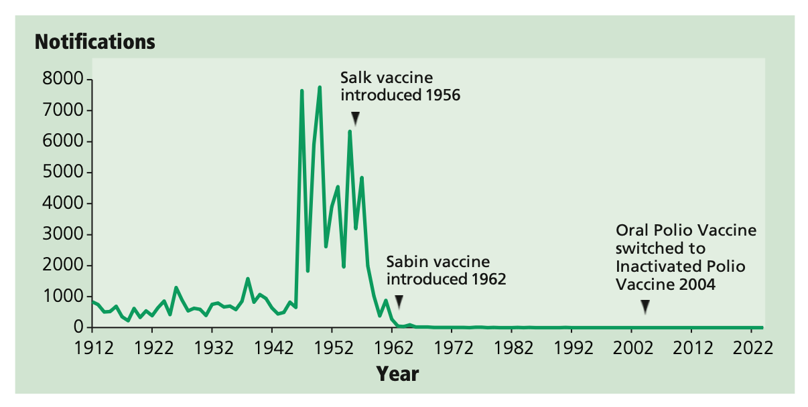
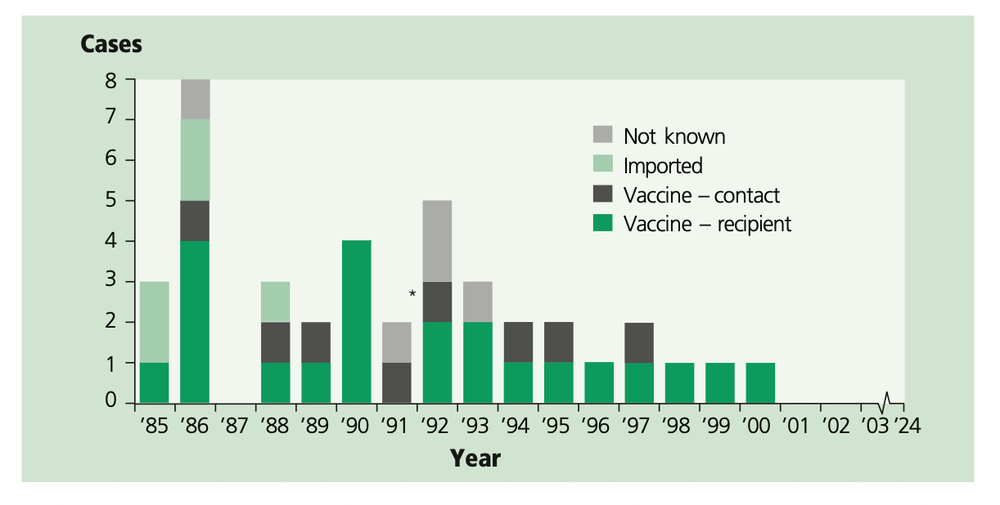

# Poliomyelitis

NOTIFIABLE

## The disease

Poliomyelitis is an acute illness that follows invasion through the gastro intestinal tract by one of the three serotypes of polio virus (serotypes 1, 2 and 3). The virus replicates in the gut and has a high affinity for nervous tissue. Spread occurs by way of the bloodstream to susceptible tissues or by way of retrograde axonal transport to the central nervous system. The infection is most frequently clinically inapparent, or symptoms may range in severity from a fever to aseptic meningitis or paralysis. Headache, gastrointestinal disturbance, malaise and stiffness of the neck and back, with or without paralysis, may occur. The ratio of inapparent to paralytic infections may be as high as 1000 to 1 in children and 75 to 1 in adults, depending on the polio virus type and the social conditions (Sutter _et al._, 2004).

Transmission is through contact with the faeces or pharyngeal secretions of an infected person. The incubation period ranges from three to 21 days. Polio virus replicates for longer periods and it can be excreted for three to six weeks in faeces and two weeks in saliva (Gelfand _et al._, 1957). Cases are most infectious immediately before, and one to two weeks after the onset of paralytic disease (Sutter _et al._, 2004).

When the infection is endemic, the paralytic disease is caused by naturally occurring polio virus -- 'wild poliovirus' (WPV). However now that we are nearing the polio end-game and wild polioviruses are close to being eradicated, paralytic polio cases are more likely to be linked to the use of the live attenuated (oral polio) vaccine (OPV). Sabin viruses retain the potential to revert to a virulent form during replication in humans and are the underlying cause of the rare cases of vaccine-associated paralytic polio (VAPP) in OPV recipients and their close contacts. Sabin strains can replicate in the gut of vaccine recipients and poliovirus maybe excreted for 4 to 6 weeks. Sabin viruses can spread in populations where the coverage of OPV is low and they can acquire the neurovirulence and transmissibility characteristics of WPV. This may result in polio cases and outbreaks as circulating vaccine-derived poliovirus (cVDPV) (WHO).

Prolonged replication of VDPVs has also been observed in a small number of people with rare immune deficiency disorders. Because they are not able to mount an immune response, these people are not able to clear the intestinal vaccine virus infection, which is usually cleared within six to eight weeks. They therefore excrete immunodeficiency-related VDPVs (iVDPVs) for prolonged periods.

## History and epidemiology of the disease

### UK

During the early 1950s, there were epidemics of poliomyelitis infections with as many as 8000 annual notifications of paralytic poliomyelitis in the UK.

Routine immunisation with inactivated poliomyelitis vaccine (IPV -- Salk) was introduced in 1956. This was replaced by live attenuated oral polio vaccine (OPV -- Sabin) in 1962. The introduction of polio immunisation was accompanied by mass campaigns targeted at all individuals aged less than 40 years.

Until 2004, OPV was used for routine immunisation in the UK because of the continuing risk of importation of wild virus. Both OPV and IPV provide excellent individual immunity. In addition, OPV provided community benefit as contacts of recently immunised children could be protected through acquisition of vaccine virus (Ramsay _et al._, 1994). OPV also promotes antibody formation in the gut, providing local resistance to subsequent infection with wild poliomyelitis virus. This reduces the frequency of symptomless excretion of wild viruses. The risks of wild polio virus being imported and the benefits of OPV need to be balanced against the risks of VAPP from OPV use and the efficacy of IPV. Since 2004, this balance has favoured the use of inactivated polio vaccine for routine immunisation in the UK.

In recent years the only poliovirus detections in the UK have been those picked up through routine environmental (sewage) surveillance which has been established across a number of high-risk sites that cover all regions and are tested every month. (UKHSA[a]). This works as an early warning system for importations of wild type polio virus or VDPV which may lead to chains of transmission which could go on undetected until a paralytic case emerges.

Figure 26.1 Polio notifications in England and Wales (1912--2024)

Source: UK Health Security Agency

Following the introduction of polio immunisation, cases fell rapidly to very low levels. The last outbreak of indigenous poliomyelitis was in the late 1970s. The last case of natural polio infection acquired in the UK was in 1984. Between 1985 and 2002, a total of 40 cases of paralytic polio were reported in the UK (Figure 26.2). Thirty cases were VAPP; six cases had wild virus infection acquired overseas; and in a further five cases, all occurring before 1993, the source of infection was unknown but wild virus was not detected. The UK was declared to be polio-free by the World Health Organization (WHO) in 2003.

Figure 26.2 Reported cases of paralytic poliomyelitis by aetiology (all sources England and Wales 1985--2024)

### Global

The number of reported cases of polio worldwide fell from 35,251 in 1988 to 6 reported cases in 2021 (WHO, 2022). Reported cases of paralytic poliomyelitis in England and Wales are shown in figure 26.2. International commissions have certified that polio virus transmission has been interrupted in four World Health Organization (WHO) regions: the Americas, the Western Pacific, South East Asia Region and Europe.

In May 2014, the WHO Director-General declared the international spread of wild poliovirus a Public Health Emergency of International Concern (PHEIC) under the International Health Regulations (IHR 2005), a designation that allows for accelerated response, emergency disbursement of funding and mitigation measures, such as vaccination of international travellers, to reduce the risk of spread of poliovirus.

Type 2 wild poliovirus was declared eradicated by WHO in September 2015, with the last virus detected in India in 1999. Type 3 wild poliovirus was declared eradicated in October 2019. It was last detected in November 2012. Type 1 wild poliovirus remains endemic in only two countries (Pakistan and Afghanistan) and, therefore, the risk of importation to the UK had fallen to very low levels.

While cVDPVs are rare, they have been increasing in recent years due to low immunisation rates within communities, particularly in low-income settings. cVDPV type 2 (cVDPV2) are the most prevalent, with 959 cases occurring globally in 2020. VDPVs have also been detected in several previously polio-free countries, including Canada, Israel, the United Kingdom and the United States of America. (Klapsa et al 2022, Böttcher et al 2025).

Following the persistent detection of cVDPV2 in London sewage over a number of months in 2022 a national enhanced incident was declared by UKHSA. The Joint Committee on Vaccination and Immunisation (JCVI) reviewed the evidence and advised that an urgent supplemental IPV booster campaign should be implemented for children aged 1 to 9 years old in London in order to: i) prevent cases of paralysis due to poliovirus and ii) interrupt transmission of VDPV2 in the community. (JCVI 2022, UKHSA[b]). This was implemented for a time limited period only (campaign completed in December 2022).

## The poliomyelitis vaccination

Inactivated polio vaccine (IPV) is made from polio virus strains Mahoney (Salk serotype 1), MEF-1 (Salk serotype 2) and Saukett (Salk serotype 3) grown in Vero cell culture. These components are treated with formaldehyde and then adsorbed onto adjuvants, either aluminium phosphate or aluminium hydroxide, to improve immunogenicity. The final vaccine mixture contains 40, 8 and 32 D-antigen units of serotypes 1, 2 and 3 respectively.

The polio vaccine is only given as part of combined products:

- diphtheria/tetanus/acellular pertussis/inactivated polio vaccine/_Haemophilus influenzae_ type b/hepatitis B (DTaP/IPV/Hib/HepB)
- diphtheria/tetanus/acellular pertussis/inactivated polio vaccine (DTaP/ IPV or dTaP/IPV)
- tetanus/diphtheria/inactivated polio vaccine (Td/IPV).

The above vaccines are thiomersal-free. They are inactivated, do not contain live organisms and cannot cause the diseases against which they protect.

OPV is no longer available for use in the UK. OPV contains live attenuated strains of poliomyelitis virus.

Since April 2016, trivalent OPV (tOPV covering types 1, 2 and 3) has been completely withdrawn from use with a globally co-ordinated switch to the bivalent OPV (bOPV, types 1 and 3) in routine immunisation programmes. tOPV is no longer produced or distributed. This was to maintain the eradication status of wild poliovirus type 2.

Novel oral poliomyelitis vaccine type 2 (nOPV2) was developed to address the evolving risk of circulating vaccine-derived poliovirus type 2 (cVDPV2) and has been authorised by WHO and deployed for use in outbreaks initially under WHO Emergency Use Listing (EUL) but from December 2023 has WHO prequalification. nOPV2 has been shown to have comparable protection against polio as monovalent OPV however it is more genetically stable and less likely to be associated with the emergence of cVDPV2 in areas with low vaccination coverage. nOPV2 is accessible through the Global OPV Stockpile -- a unique mechanism used in outbreak response, and only following release by WHO upon technical review and endorsement of a country application.

### Storage

Chapter 3 contains information on vaccine storage, distribution and disposal.

The summary of product characteristics (SPC) may give further detail on vaccine storage.

### Presentation

Polio vaccine is only available as part of combined products. REPEVAX®, Boostrix®-IPV, REVAXIS® and Vaxelis® are supplied as cloudy white or off-white suspensions in pre-filled syringes. The suspension may sediment during storage and should be shaken to distribute the suspension uniformly before administration.

Infanrix-Hexa® is supplied as a powder in a vial and a suspension in a pre-filled syringe. The vaccine must be reconstituted by adding the entire contents of the pre-filled syringe (containing DTaP-IPV/HepB suspension) to the vial containing the powder (Hib). The full reconstitution instructions are given in the Summary of Product Characteristics. After reconstitution, the vaccine should be injected immediately.

## Dosage and schedule

### Routine childhood immunisations

The routine childhood immunisation schedule contains six doses of polio-containing vaccine. The priming schedule is three doses, given at four-week intervals. An additional hexavalent dose will be given to children at 18 months of age (from January 2026 onwards). This dose has been introduced into the schedule to ensure protection against Hib (it replaces the now discontinued Hib/MenC dose which used to be offered at 12 months). Two polio booster doses are required from the age of 3 years 4 months, at appropriate intervals.

- First dose of 0.5ml of a polio-containing vaccine
- Second dose of 0.5ml, one month after the first dose
- Third dose of 0.5ml, one month after the second dose
- fourth dose of 0.5ml (Hib-containing hexavalent booster) given at the recommended interval (see below)
- Fifth and sixth doses of 0.5ml should be given at the recommended intervals (see below)

## Administration

Chapter 4 covers guidance on administering vaccines.

Most injectable vaccines are routinely given intramuscularly into the deltoid muscle of the upper arm or, for infants 1 year and under, into the anterolateral aspect of the thigh.

IPV-containing vaccines can be given at the same time as any other vaccines required. The vaccines should be given at a separate site, preferably in a different limb. If given in the same limb, they should be given at least 2.5cm apart (American Academy of Pediatrics, 2021). The site at which each vaccine was given should be noted in the individual's records.

## Disposal

Chapter 3 outlines storage, distribution and disposal requirements for vaccines.

Equipment used for immunisation, including used vials, ampoules, or discharged vaccines in a syringe, should be disposed of safely in a UN-approved puncture-resistant 'sharps' box, according to local waste disposal arrangements and guidance in the technical memorandum 07-01: Safe management of healthcare waste (NHS England).

## Recommendations for the use of the vaccine

The objective of the UK immunisation programme is to provide a minimum of five doses of a polio-containing vaccine at appropriate intervals for all individuals. These are given by injection and protect against three different serotypes (1, 2 and 3). In most circumstances, a total of five doses of vaccine at the appropriate intervals is considered to give satisfactory long-term protection.

To fulfil this objective, the appropriate vaccine for each age group is determined also by the need to protect individuals against tetanus, pertussis, Hib, hepatitis B and diphtheria.

### Primary immunisation

#### Infants and children under ten years of age

The primary course of polio vaccination consists of three doses of an IPV- containing product with an interval of four weeks between each dose. DTaP/ IPV/Hib/HepB is recommended to be given at eight, twelve and sixteen weeks of age but can be given at any stage from eight weeks up to ten years of age. If the primary course is interrupted it should be resumed but not repeated, allowing an interval of one month between the remaining doses.

#### Children aged ten years or over, and adults

The primary course of polio vaccination consists of three doses of an IPV- containing product with an interval of four weeks between each dose. Td/ IPV is recommended for all individuals aged ten years or over. If the primary course is interrupted it should be resumed but not repeated, allowing an interval of four weeks between the remaining doses.

Individuals born before 1962 may not have been immunised or may have received a low-potency polio inactivated vaccine; no opportunity should be missed to immunise them. Td/IPV is the appropriate vaccine for such use.

### Reinforcing immunisation

#### Routine childhood immunisation schedule

With the change to the routine childhood immunisation schedule introduced in July 2025, children will receive an additional dose of the hexavalent Hib-containing vaccine when they turn 18 months of age in January 2026 onwards. This DTaP/IPV/Hib/HepB hexavalent booster will be given to replace the dose of Hib/MenC vaccine previously given at 12 months of age, in order to provide a dose of Hib-containing vaccine in the second year of life and maintain Hib control.

This hexavalent DTaP/IPV/Hib/HepB booster should not be considered sufficient to support long-term protection against polio when given routinely under the age of three years four months. Two further doses of polio-containing vaccine are still required before adulthood; and these are routinely given pre-school (from three years four months of age) and before leaving school (usually around age 13 -- 14 years of age). These are termed the first and second polio boosters.

Children under ten years should receive the first polio booster combined with diphtheria, tetanus, and pertussis vaccines. The first booster of an IPV- containing vaccine should ideally be given three years after completion of the primary course, normally at three years and four months of age. When primary vaccination has been delayed, this first booster dose may be given at the scheduled visit provided it is one year since the third primary dose. This will re-establish the child on the routine schedule. dTaP/IPV should be used in this age group (provided at least one dose of hexavalent vaccine was given over one year of age, otherwise hexavalent vaccine should be used). Td/IPV should not be used routinely for this purpose in this age group because it does not provide protection against pertussis.

Individuals aged ten years or over who have only had three doses of polio vaccine, of which the last dose was at least five years ago, should receive the first IPV booster combined with diphtheria and tetanus vaccines (Td/IPV) ideally five years after their last primary dose.

The second booster dose of Td/IPV should be given to all individuals ideally ten years after the first booster dose. Where the previous doses have been delayed, the second booster should be given at the school session or scheduled appointment provided a minimum of five years have lapsed between the first and second boosters. This will be the last scheduled opportunity to ensure long-term protection.

If a person attends for a routine booster dose and has a history of receiving a vaccine following a tetanus-prone wound, attempts should be made to identify which vaccine was given. If the vaccine given at the time of the injury was the same as that due at the current visit and was given after an appropriate interval, then the routine booster dose is not required. Otherwise, the dose given at the time of injury should be discounted as it may not provide long-term protection against all antigens, and the scheduled immunisation should be given. Such additional doses are unlikely to produce an unacceptable rate of reactions (Ramsay _et al._, 1997).

### Vaccination of individuals with unknown or incomplete immunisation status

Where a child born in the UK presents with an inadequate immunisation history, every effort should be made to clarify what immunisations they may have had (see Chapter 11). A child who has not completed the primary course should have the outstanding doses at 4 week intervals. For children under the age of 10 years the primary course should be completed with the hexavalent vaccine. Children may receive the first booster dose as early as one year after the third primary dose to re-establish them on the routine schedule. Which vaccine is offered for this booster will depend on age and previous vaccine history (see 'delayed or missed immunisations' section above). The second booster should be given at the time of leaving school to ensure long-term protection by this time. Wherever possible a minimum of five years should be left between the first and second boosters.

People coming to the UK who have a history of completing immunisation in their country of origin will likely have received polio-containing vaccines, some may have received OPV, others may have received IPV or a combination of the two.

(https://immunizationdata.who.int/listing.html?topic=vaccine-schedule&location=).

Individuals coming from areas of conflict or from population groups who may have been marginalised in their country of origin (e.g. refugees, gypsy or other nomadic travellers) may not have had good access to immunisation services. In particular, older children and adults may also have been raised during periods before immunisation services were well developed or when vaccine quality was sub-optimal. Where there is no reliable history of previous immunisation, it should be assumed that any undocumented doses are missing and the UK catch-up recommendations for that age should be followed (see Chapter 11).

Further advice on vaccination of children with unknown or incomplete immunisation status is published by UKHSA: https://www.gov.uk/government/publications/vaccination-of-individuals-with-uncertain-or-incomplete-immunisation-status.

#### Bivalent OPV (bOPV)

After wild type poliovirus type 2 was declared eradicated by WHO, the trivalent OPV was withdrawn in April 2016 and replaced with the bivalent OPV, which contains only attenuated virus of types 1 and 3. Therefore children vaccinated with OPV from 2016 onwards may not have protection against all the antigens currently used in the UK.

Any dose(s) of OPV received in another country prior to April 2016 would have been tOPV and can be counted as valid.

Any dose of OPV that has been received in another country since April 2016 is likely to have been bOPV and should be discounted because the individual will not have sufficient protection against type 2 poliovirus including cVDPV2. OPV doses received as part of the routine childhood schedule should be replaced by a dose of IPV-containing vaccine appropriate for age.

Most countries have a mixed OPV and IPV schedule and so if sufficient IPV doses have been received for their age, then no additional IPV doses are needed.

The routine pre-school and subsequent boosters should be given according to the UK schedule.

#### London IPV booster campaign 2022

Children in date with their routine primary immunisations and given an additional IPV-containing vaccine as part of the time limited IPV booster campaign in London between August and December 2022 should be offered Td/IPV vaccine according to the routine immunisation schedule at 14 years of age (school Year 9), regardless of the interval from the additional dose of vaccine. (UKHSA[b]). For the majority of children this will be an interval of at least 5 years.

#### Fractional IPV (fIPV)

Fractional IPV is offered in some countries as part of the routine schedule. fIPV is one fifth of the IPV dose. Overall, a single dose of fIPV leads to lower levels of immune response than the equivalent full dose (although this difference does narrow after multiple doses). A child newly arrived in the UK who has received fIPV doses instead of full doses has not therefore had 'sufficient doses' of polio antigen. They should receive any outstanding vaccines using the full dose vaccine to catch-up with the UK schedule. If all of their polio doses were given as fIPV, an additional full dose of the combined IPV-containing vaccine (as appropriate for their age) should be given, at least four weeks after their previous dose.

There is no requirement to look back and catch-up individuals who are now established on the UK schedule but should an individual present then opportunistic catch up or boosting should be considered.

### Travellers and those going to reside abroad

All travellers to epidemic or endemic areas should ensure that they are fully immunised according to the UK schedule (see above). Additional doses of vaccines may be required according to the destination and the nature of travel intended (see National Travel Health Network and Centre (NaTHNaC), ). Where tetanus, diphtheria or polio protection is required and the final dose of the relevant antigen was received more than ten years ago, Td/IPV should be given.

### Polio vaccination in laboratory and healthcare workers

Individuals who may be exposed to polio in the course of their work, in microbiology laboratories and clinical infectious disease units, are at risk and must be protected (see Chapter 12).

In October 2022, following a review of the latest evidence, JCVI advised a preference for a non-IPV-containing pertussis vaccine for use in the maternal pertussis programme (UKHSA and NHS England, 2024). This followed studies measuring antibody levels in the infants of mothers who had received pertussis-containing vaccines (dTaP/IPV) in pregnancy. These studies showed lower antibody responses to polio (after completion of their primary infant schedule) compared to infants born to unvaccinated mothers, although all remained above the protective threshold.

To address this potential immunity gap caused by the blunting of the infant's polio response to primary vaccines, a non-IPV-containing (Tdap) vaccine has now been procured for use in the maternal pertussis programme.

### Premature infants

As the benefit of vaccination is high in this group of infants, vaccination should not be withheld or delayed. It is important that premature infants have their immunisations at the appropriate chronological age, according to the schedule. The occurrence of apnoea following vaccination is especially increased in infants who were born very prematurely.

Very premature infants (born <= 28 weeks of gestation) who are in hospital should have respiratory monitoring for 48-72 hrs when given their first immunisation, particularly those with a previous history of respiratory immaturity. If the child has apnoea, bradycardia or desaturations after the first immunisation, the second immunisation should also be given in hospital, with respiratory monitoring for 48-72 hrs (Pfister _et al._, 2004; Ohlsson _et al._, 2004; Schulzke _et al._, 2005; Pourcyrous _et al._, 2007; Klein _et al._, 2008).

Infants stable at discharge without a history of apnoea and/or respiratory compromise may be vaccinated in the community setting.

### Immunosuppression and HIV infection

Individuals with immunosuppression and HIV infection (regardless of CD4 count) should be given IPV-containing vaccines in accordance with the recommendations above. These individuals may not make a full antibody response. Re-immunisation should be considered after treatment is finished and recovery has occurred. Specialist advice may be required.

Further guidance is provided by the Royal College of Paediatrics and Child Health (https://www.rcpch.ac.uk), the British HIV Association (BHIVA) _Guidelines on the use of vaccines in HIV-positive adults_ (BHIVA, 2015) and the Children's HIV Association (CHIVA) immunisation guidelines.

### Neurological conditions

Chapter 6 covers vaccination contraindications and special considerations.

The presence of a neurological condition is not a contraindication to immunisation but if there is evidence of current neurological deterioration, deferral of vaccination may be considered, to avoid incorrect attribution of any change in the underlying condition. The risk of such deferral should be balanced against the risk of the preventable infection, and vaccination should be promptly given once the diagnosis and/or the expected course of the condition becomes clear.

### Deferral of immunisation

There will be very few occasions when deferral of immunisation is required (see above). Deferral leaves the child unprotected; the period of deferral should be minimised so that immunisation can commence as soon as possible. If a specialist recommends deferral this should be clearly communicated to the general practitioner, who must be informed as soon as the child is fit for immunisation.

## Adverse reactions

Chapter 8 covers vaccine safety and the management of adverse events following immunisation.

Pain, swelling or redness at the injection site are common and may occur more frequently following subsequent doses. A small, painless nodule may form at the injection site; this usually disappears and is of no consequence.

Fever, convulsions, high-pitched screaming and episodes of pallor, cyanosis and limpness (hypertonic-hyporesponsive episodes or HHE) can occur following vaccination with IPV-containing vaccines. Though not a contraindication to vaccination, individuals with a history of febrile convulsions should be closely monitored if they develop fever.

Confirmed anaphylaxis occurs extremely rarely occurring at less than 1 million doses for vaccines in the UK.

Other systemic adverse events such as anorexia, diarrhoea, fatigue, headache, nausea and rash may occur more commonly and are not contraindications to further immunisation. Co-administration of the infant hexavalent vaccine with pneumococcal conjugate vaccine or MMR increases febrile reactions/ convulsions.

Anyone can report a suspected adverse reaction to the Medical and Healthcare products Regulatory Agency (MHRA) using the Yellow Card reporting scheme (https://yellowcard.mhra.gov.uk/) or search for MHRA Yellow Card in the Google Play or Apple App Store. All suspected adverse reactions to vaccines occurring in children, or in individuals of any age to vaccines labelled with a black triangle (▼), should be reported to the MHRA through the Yellow Card scheme. Serious, suspected adverse reactions to vaccines in adults should be reported through the Yellow Card scheme.

## Contraindications

There are very few individuals who cannot receive IPV-containing vaccines. When there is doubt, appropriate advice should be sought from the relevant specialist consultant, the local screening and immunisation team local Health Protection Team rather than withholding the vaccine. The risk to the individual of not being immunised must be taken into account.

The vaccines should not be given to those who have had:

- a confirmed anaphylactic reaction to a previous dose of IPV-containing vaccine, or
- a confirmed anaphylactic reaction to any component or residue from the manufacturing process.

Specific advice on management of individuals who have had an allergic reaction can be found in Chapter 8 of the Green Book.

## Precautions

Chapter 6 contains information on contraindications and special considerations for vaccination.

Minor illnesses without fever or systemic upset are not valid reasons to postpone immunisation. If an individual is acutely unwell, immunisation should be postponed until they have fully recovered. This is to avoid confusing the differential diagnosis of any acute illness by wrongly attributing any sign or symptoms to the adverse effects of the vaccine.

### Systemic and local reactions following a previous immunisation

Individuals who have had a systemic or local reaction following a previous immunisation with IPV-containing vaccine can continue to receive subsequent doses. This includes the following rare reactions:

- fever, irrespective of its severity
- hypotonic-hyporesponsive episodes (HHE)
- persistent crying or screaming for more than three hours
- severe local reaction, irrespective of extent.
- convulsions, with or without fever, within 3 days of vaccination

Chapter 8 covers vaccine safety and the management of adverse events following immunisation.

### Pregnancy and breast-feeding

IPV-containing vaccines may be given to pregnant women when protection from polio is required without delay. There is no evidence of risk from vaccinating pregnant women or those who are breast-feeding with inactivated virus or bacterial vaccines or toxoids (Plotkin and Orenstein, 2004).

## Global Polio Eradication and maintaining polio free status

The GPEI Polio Eradication Strategy 2022 to 2026 sets out the pathway for a polio-free world. Despite the significant progress made, until polio is eradicated globally, the risk of the virus being reintroduced into Europe, including the UK, remains.

The World Health Organization (WHO) polio Post-Certification Strategy defines the global technical standards or core set of activities that are needed in order to sustain a polio-free world after global certification of wild poliovirus eradication. It covers areas such as poliovirus containment, for example, to ensure that potential laboratory sources of poliovirus are contained or removed appropriately. It also covers the requirement for countries to continue to have robust surveillance to promptly detect any poliovirus in a human or in the environment and rapidly respond to prevent transmission.

As part of the UK government's ongoing commitment to Global Polio Eradication, the National Authority for Containment (NAC) was formally appointed by the Department for Health and Social Care (DHSC) in July 2022. See UK NAC for more details.

In addition, the UKHSA, working in collaboration with the WHO Polio Global Specialised Laboratory at the MHRA and NHS Lothian, undertakes routine environmental surveillance for poliovirus in England. Further information is available on environmental surveillance.

Continued demonstration of the adequacy of clinical, laboratory and environmental surveillance in the UK is required by WHO to maintain the UK's polio-free status. Evidence is collated by all relevant public health agencies across the Devolved Administrations and reviewed by the National Certification Committee for Polio annually for submission to the WHO Regional Certification Committee.

## Management of suspected cases and other polio detections or exposures

The success of the vaccination programme means that polio is now very rare internationally and has been eliminated in the UK.

Under Schedule 1 of the Health Protection (Notification) Regulations 2010, suspected cases of acute poliomyelitis are notifiable. In addition, from 6 April 2025, acute flaccid paralysis or acute flaccid myelitis (AFP or AFM) not explained by a non-infectious cause is also notifiable. (UKHSA[c]). Appropriate testing of AFP or AFM cases not explained by a non-infectious cause, to exclude polio as a causative agent, is an integral component of polio surveillance.

The UK National Polio Guidance includes guidance on the public health management of suspected cases of polio and AFP/AFM, consideration of post-exposure prophylaxis and information on the appropriate samples required for confirmation / exclusion of infection. It also covers response to a range of scenarios including the detection of polio through environmental surveillance and accidental release of polio in a laboratory.

In response to detection of poliovirus in a person or the environment including a containment breach, IPV-containing vaccine should be administered to household contacts immediately regardless of their vaccination status.

A stock of IPV-containing vaccine is retained centrally for use as needed in response to a polio-related incident, for example to target a particular community at risk. Deployment would depend on a risk assessment by UKHSA in discussion with JCVI and the Chair of the National Polio Certification Committee and the National Authority for Polio Containment, as appropriate.

In the event of an incident where it may be necessary to consider the use of the novel Oral Polio Vaccine type 2 (nOPV2) advice would be sought from the WHO with regard to the risk assessment and securing supply.

## Supplies

Vaccines centrally purchased and supplied as part of the national immunisation programme for the NHS can be ordered via ImmForm (immform.ukhsa.org.uk) and are provided free of charge. Further information about ImmForm is available from the ImmForm helpdesk at helpdesk@immform.org.uk or calling 0207 183 8580.

Vaccines for private prescriptions, occupational health use or travel are NOT provided free of charge and should be ordered from the manufacturers. Please see chapter 3 for further information on the approved use of vaccines.

In Scotland, supplies should be obtained from local childhood vaccine holding centres. Details of these are available from Procurement, Commissioning & Facilities of NHS National Services Scotland (Tel: 0131 275 6725).

In Northern Ireland, supplies should be obtained under the normal childhood vaccines distribution arrangements, details of which are available by contacting the Regional Pharmaceutical Procurement Service on 028 9442 4089.

The vaccines from the list below are available through ImmForm for the national programme:

- Infanrix® Hexa, diphtheria, tetanus, 3-component acellular pertussis/inactivated polio virus/_Haemophilus influenzae_ type b and hepatitis B (DTaP/IPV/Hib/HepB); given as primary immunisation or a booster from 2 months to 3 years of age -- manufactured by GSK
- Vaxelis® diphtheria, tetanus, 5-component acellular pertussis/inactivated polio virus/_Haemophilus influenzae_ type b and hepatitis B (DTaP/IPV/Hib/HepB); given as primary immunisation or a booster from 2 months to 3 years of age -- manufactured by Sanofi
- REPEVAX® diphtheria/tetanus/5-component acellular pertussis/inactivated polio vaccine (dTaP/IPV) -- manufactured by Sanofi
- REVAXIS® diphtheria/tetanus/inactivated polio vaccine (Td/IPV) -- manufactured by Sanofi
- Boostrix®-IPV diphtheria/tetanus/3-component acellular pertussis/inactivated polio virus (dTaP/IPV)\_ - manufactured by GSK
- ADACEL® (diphtheria/tetanus/5-component acellular pertussis (Tdap) -- manufactured by Sanofi

## References

American Academy of Pediatrics (2021) Active immunization. In: Kimberlin DW, Barnett ED, Lynfield R, Sawyer MH, eds. Red Book: 2021 Report of the Committee on Infectious Diseases. 32nd edition. Itasca, IL: American Academy of Pediatrics: 2021, p28.

Böttcher S, Kreibich J, Wilton T et al. (2025) Detection of circulating vaccine-derived poliovirus type 2 (cVDPV2) in wastewater samples: a wake-up call, Finland, Germany, Poland, Spain, the United Kingdom, 2024. Eurosurveillance **30** (3) pii=2500037.

British HIV Association (2015) _guidelines on the use of vaccines in HIV-positive adults 2015_: https://www.bhiva.org/file/NriBJHDVKGwzZ/2015-Vaccination-Guidelines.pdf

Children's HIV Association (CHIVA) (2018) Vaccination of HIV infected children https://www.chiva.org.uk/infoprofessionals/guidelines/immunisation/

Gelfand HM, LeBlanc DR, Fox JP and Conwell DP (1957) Studies on the development of natural immunity to poliomyelitis in Louisiana II. Description and analysis of episodes of infection observed in study households. _Am J Hyg_ **65**: 367-- 85.

Joint Committee on Vaccination and Immunisation (2022) Vaccination strategy for ongoing polio incident: JCVI statement, first published 10/08/2022. Available at: https://www.gov.uk/government/publications/vaccination-strategy-for-ongoing-polio-incident-jcvi-statement Accessed 10/09/2024accessed: 30/04/2025.

Klapsa D, Wilton T, Zealand A et al. (2022) Sustained detection of type 2 poliovirus in London sewage between February and July, 2022, by enhanced surveillance. _The Lancet_, **400** (10362): 1531-1538.

Klein NP, Massolo ML, Greene J _et al._ (2008) Risk factors for developing apnea after immu- nization in the neonatal intensive care unit. _Pediatrics_ **121**(3): 463-9.

NaTHNaC -- TraveHealthPro Polio https://travelhealthpro.org.uk/disease/144/polio Accessed 21/03/2023

NHS England (first published 2013) Health Technical Memorandum (HTM 07-01) Management and disposal of healthcare waste. https://www.england.nhs.uk/publication/management-and-disposal-of-healthcare-waste-htm-07-01/ Accessed July 2024

Ohlsson A and Lacy JB (2004) Intravenous immunoglobulin for preventing infection in pre- term and/or low-birth-weight infants. _Cochrane Database Syst Rev_(1): CD000361.

Pfister RE, Aeschbach V, Niksic-Stuber V _et al._ (2004) Safety of DTaP-based combined immu- nization in very-low-birth-weight premature infants: frequent but mostly benign cardiorespira- tory events. _J Pediatr_ **145**(1): 58-66.

Plotkin SA and Orenstein WA (eds) (2004) _Vaccines_ 4th edition. Philadelphia: WB Saunders Company, Chapter 8.

Pourcyrous M, Korones SB, Arheart KL _et al._ (2007) Primary immunization of premature infants with gestational age <35 weeks: cardiorespiratory complications and C-reactive protein responses associated with administration of single and multiple separate vaccines simultane- ously. _J Pediatr_ **151**(2): 167-72.

Ramsay ME, Begg NT, Ghandi J and Brown D (1994) Antibody response and viral excretion after live polio vaccine or a combined schedule of live and inactivated polio vaccines. _Pediatr Infect Dis J_ **13**: 1117--21.

Ramsay M, Joce R and Whalley J (1997) Adverse events after school leavers received combined tetanus and low dose diphtheria vaccine. _CDR Review_ **5**: R65--7.

Schulzke S, Heininger U, Lucking-Famira M _et al._ (2005) Apnoea and bradycardia in preterm infants following immunisation with pentavalent or hexavalent vaccines. _Eur J Pediatr_ **164**(7): 432-5.

Sutter RW, Cochi S and Melnick JL (2004) Live attenuated polio virus vaccines. In: Plotkin SA and Orenstein WA (eds) _Vaccines_, 4th edition. Philadelphia: WB Saunders Company.

UKHSA [a]: Environmental surveillance for polio. Available at: https://www.gov.uk/government/publications/polio-global-eradication-nac-and-environmental-surveillance/environmental-surveillance-for-polio accessed on 30/04/2025.

UKHSA [b]: Polio immunisation response in London 2022 to 2023: information for healthcare practitioner. Available at https://www.gov.uk/government/publications/inactivated-polio-vaccine-ipv-booster-information-for-healthcare-practitioners/polio-immunisation-response-in-london-2022-to-2023-information-for-healthcare-practitioners Accessed on 30/04/2025.

UKHSA [c]: Acute flaccid paralysis syndrome. Available at: https://www.gov.uk/government/collections/acute-flaccid-paralysis-syndrome accessed on 30/04/2025

UKHSA and NHS England (2024): Prenatal pertussis vaccine change from July 2024 letter. Available at: https://www.gov.uk/government/publications/prenatal-pertussis-vaccine-change-from-july-2024-letter Accessed on 30/04/2025.

WHO (2022) Poliomyelitis Factsheet https://www.who.int/news-room/fact-sheets/detail/poliomyelitis accessed 21/03/2023https://www.who.int/news-room/fact-sheets/detail/poliomyelitis accessed 21/03/2023

WHO webpage Poliomyelitis https://www.who.int/teams/health-product-policy-and-standards/standards-and-specifications/norms-and-standards/vaccine-standardization/poliomyelitis accessed 30/04/2025
