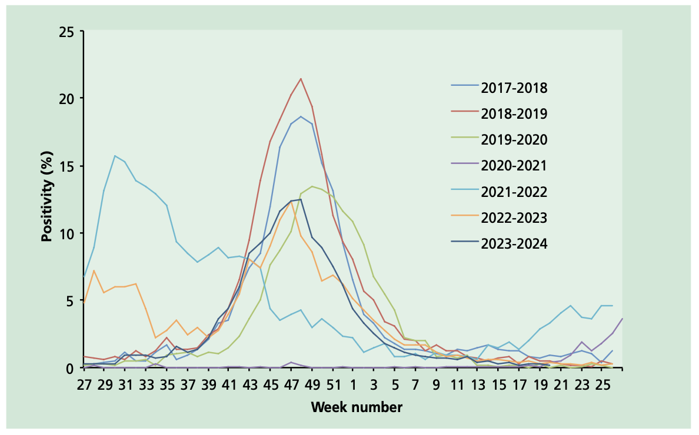
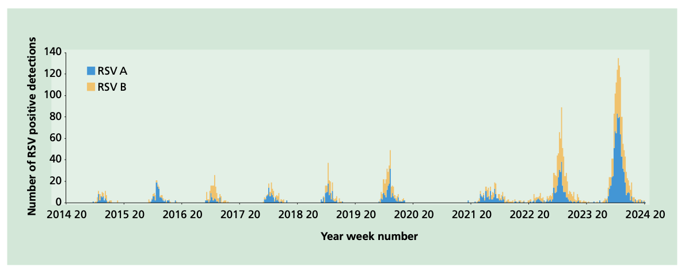
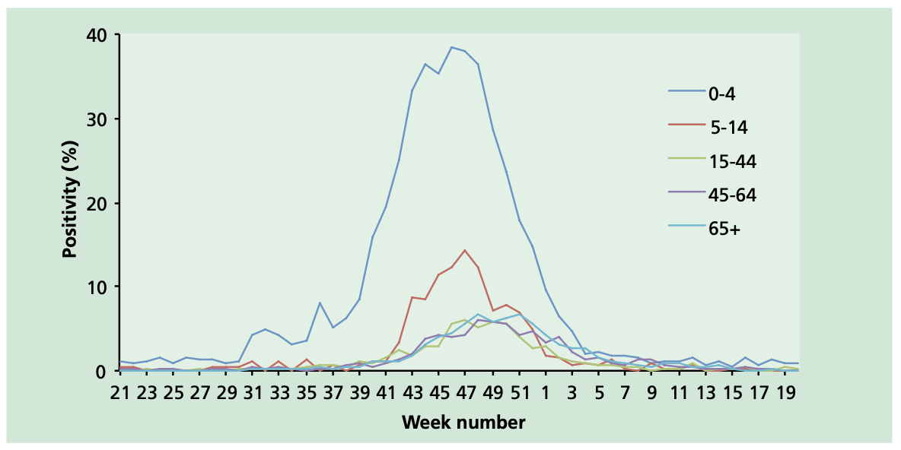
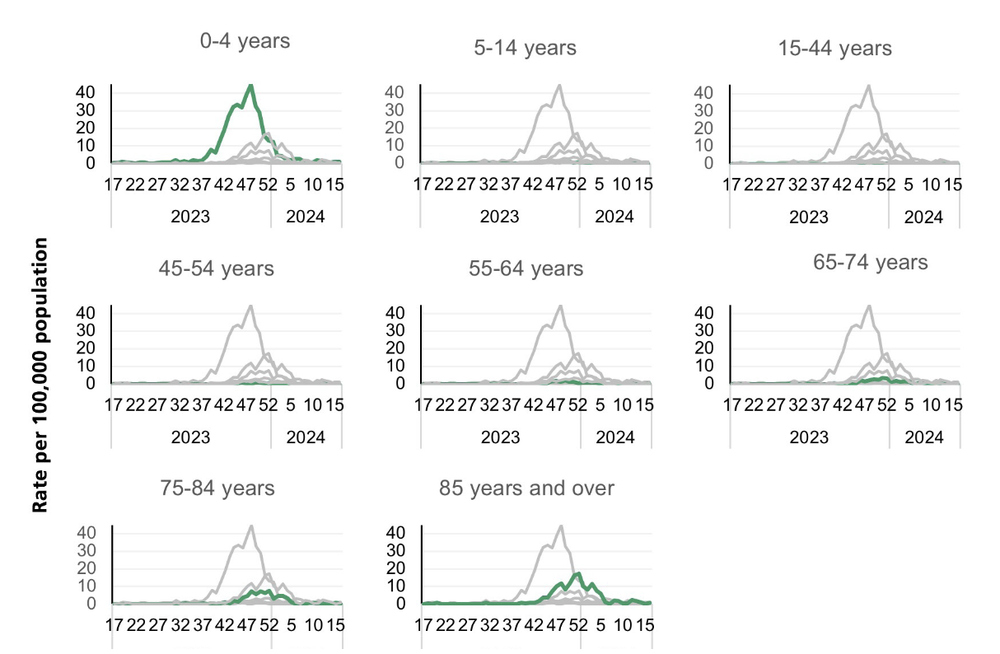
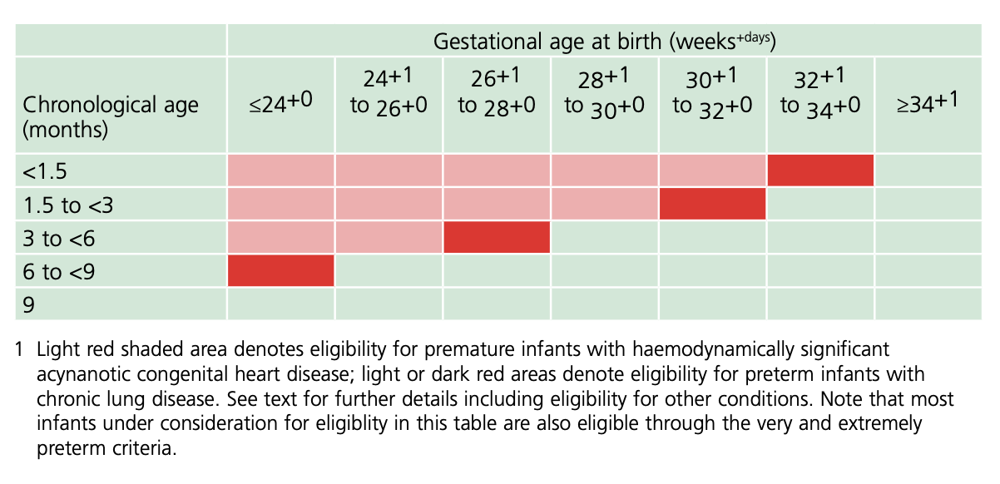

# Respiratory syncytial virus

## The disease

Respiratory syncytial virus (RSV) is an enveloped, negative-sense, single-stranded RNA virus that belongs to the _Orthopneumovirus_ genus of the Pneumoviridae family in the order _Mononegavirales_ (Rima _et al_ 2017). Two surface glycoproteins on the virus have important functions in cell infection. The attachment glycoprotein G binds the virus to a host cell and trimeric fusion (F) glycoprotein joins the viral envelope with the host cell's plasma membrane, so the virus can enter the host cell. The F protein also stimulates the fusion of the plasma membranes of infected cells creating multi-nucleated syncytia, which can be observed in tissue culture. Two major subtypes (A and B, sometimes referred to as subgroups) of RSV have been identified based on structural variations in the G protein. The predominance of each subtype changes over successive seasons; studies find an inconsistent relationship between subtype and disease severity (see Ciarlitto _et al.,_ 2019).

RSV is a common cause of respiratory tract infections. It usually causes a mild self-limiting respiratory infection in adults and children, but it can be severe in infants and older adults who are at increased risk of acute lower respiratory tract infection (LRTI; sometimes termed lower respiratory tract disease, LRTD), including bronchiolitis in infants. RSV bronchiolitis in the pre-immunisation era was an important cause of emergency department attendances (Williams _et al._, 2023) and amongst the leading causes of infant hospital admissions, with an average annual admission rate of 35.1 per 1000 infant under one year old (Reeves _et al.,_ 2017).

Humans are the only known reservoir of RSV. RSV is readily transmissible, with mean estimates of the basic reproduction number around 4.5 (Reis and Shaman, 2018). The incubation period is considered to range from two to eight days and infectious period from three to eight days. The virus is spread from respiratory secretions through close contact with infected persons via respiratory droplets or contact with contaminated surfaces or objects. At least half of children experience an RSV infection in the first year of life and almost all will by the age of two (Henderson _et al.,_ 1979, Berbers _et al._, 2021). Previous infection by RSV confers only partial immunity to RSV and so individuals may be infected repeatedly with the same or different strains of RSV (Oshansky _et al.,_ 2009, Berbers _et al._, 2021).

Those infected by RSV experience a range of acute respiratory infection (ARI) symptoms such as rhinitis, cough, shortness of breath, wheeze, lethargy and sometimes fever (Hall, 2001, Dietz _et al_., 2024). RSV LRTI can include pneumonia in all ages, and bronchiolitis in young children, in whom it may also cause decreased oral intake. RSV also causes croup and otitis media in children (Johnson, 2009; Phillips _et al._, 2020).

RSV associated infant mortality is highest in low- and middle-income countries, but RSV has a significant disease burden and related healthcare utilisation in high-income countries (Greenough _et al._, 2004; Li _et al._, 2022). In the UK prior to the introduction of universal RSV immunisation the virus was estimated to cause annually around 33,500 hospitalisations in children under 5 years (Reeves _et al_., 2017) and 20 to 30 child deaths (Cromer _et al._, 2017). It remains to be resolved whether there is a causal association between RSV bronchiolitis in early life and development of asthma later in childhood, versus predisposition towards both (see Fauroux et al., 2017, Driscoll et al., 2020, Rosas-Salazar et al., 2023).

Most RSV admissions happen to full-term children without underlying risk factors. Birth months August to November are a risk factor for admission (Reeves _et al.,_ 2019): these infants are younger, with correspondingly smaller airways, during peak RSV seasonal activity and have less well-developed immune systems than older infants. Prematurity is similarly an important risk factor for admission in infancy (Boyce _et al._, 2000).

Predisposing clinical risk factors for severe RSV disease amongst infants include congenital heart disease, chronic lung disease, chromosomal abnormalities, neuromuscular disorders, large airway abnormalities, and immunodeficiency, particularly multimorbidity (Thorburn, 2009). Clinically high-risk infants have been found to account for around 5% of RSV admissions, but 21% of estimated bed days (Reeves _et al._, 2019). In children considered high risk due to prematurity or chronic respiratory disease, hospitalisation with RSV has a risk of death of around three per cent (Müller-Pebody _et al._, 2002). Unpublished UKHSA analysis found that compared to full-term infants, those born very prematurely (<32 weeks) were three times more likely to be admitted and ten times more likely to need critical care due to RSV (JCVI Oct 2024). Social and demographic risk factors associated with severe RSV disease include being male, exposure to environmental tobacco smoke or indoor air pollution, having young siblings, and day care attendance (Simões, 2003; Sommer _et al._, 2011; DiFranza _et al._, 2012; Havdal _et al_., 2022, Vartiainen _et al._, 2023).

The exact burden of disease in elderly adults is comparatively poorly understood due to relative lack of testing, although it is considered to have a substantial morbidity and mortality. RSV has been estimated to account for 175,000 annual GP episodes in those age 65 years and older in the UK (Fleming _et al_ 2015). Enhanced surveillance in England in the winter prior to the vaccine programme launch found an RSV admission rate of 58 per 100,000 older adults, around half the rate of influenza, with a RSV 30-day mortality among admitted patients equivalent to the mortality risk for influenza. (Symes _et al_., 2025a).

RSV LRTI is recognised to have a significant burden in immunocompromised and elderly adults. It may manifest as exacerbations of underlying chronic obstructive pulmonary disease or cardiovascular disease. In immunocompromised patients, RSV can cause severe infections with mortality rates as high as 80% (Falsey and Walsh, 2000). Immunosenescence of T-cell responses may be a factor in vulnerability to severe RSV infection in older adults (Cherukuri _et al.,_ 2013).

## History and epidemiology of the disease

RSV infections occur year-round but primarily within the period October to February, and with most infections occurring in a relatively short epidemic of about six weeks (Figure 1). Whilst the occurrence of the mid-winter peak is predictable, its size varies from year-to-year. Seasons can be dominated by subtype A or B or a mixture of both (Figure 2). Activity was disrupted by respiratory transmission control measures during the COVID-19 pandemic (Bardsley _et al._, 2023).

Figure 1. Weekly RSV swab positivity (%) by date of specimen, Respiratory DataMart 2017/18 to 2023/2024.

Figure 2. Primary care RSV detections by subtypes A and B in acute respiratory infection patients. Royal College of GPs Research and Surveillance Centre, Oxford and the UKHSA Respiratory Virus Unit. Note that testing has increased over time.

The UK Health Security Agency (UKHSA) monitors levels of RSV activity in England and publishes information throughout the RSV season. The epidemiological data are included in UKHSA's weekly national influenza reports (https://gov.uk/government/statistics/weekly-national-flu-reports).

RSV laboratory results are collected into national surveillance systems including sentinel Respiratory Datamart (figure 3) and the NHS-wide Second-Generation Surveillance System (SGSS). Data on RSV in primary care are collected as part of the Royal College of General Practitioners UKHSA surveillance programme. Secondary care surveillance includes Emergency Department Syndromic Surveillance (of bronchiolitis), confirmed RSV admissions to wards and critical care (severe ARI) through the SARI Watch system (figure 4) and determining adult outcomes and incidence through the Hospital ARI Surveillance System (HARISS) (Symes _et al_. 2025a). Monitoring for RSV strains that can evade immunity is important for RSV programmes globally (Simões _et al.,_ 2021; WHO 2025), as undertaken at UKHSA's Respiratory Virus Unit.

Figure 3. Weekly swab positivity (%) by age group and date of specimen, Respiratory DataMart 2023/2024

Figure 4. Weekly confirmed RSV hospital admission rates per 100,000 population, by age group, reported through SARI Watch sentinel surveillance, England, week 16 2023 to week 15 2024

## RSV immunisation

RSV monoclonal antibody immunisation using palivizumab was first approved for use in infants in European countries in 1999, providing passive protection (EMEA 2010). Its high cost and moderate effectiveness meant that cost-effectiveness was only demonstrated for high-risk infants (JCVI 2010). The UK selective immunisation programme has been delivered in secondary care by paediatric services.

Paediatric RSV vaccine development was effectively halted after trials in the late 1960s where severe, enhanced disease was observed when some vaccinated infants were later exposed to natural infection (Chin _et al_., 1969; Fulginiti _et al_., 1969; Kapikian _et al_., 1969;Kim _et al_., 1969). This observation was limited to younger infants who had not been exposed to infection prior to vaccination and may have resulted from low avidity neutralising antibody responses, T-helper type 2 oriented immune responses, and immune complex deposition in airways. Subsequently, the mechanism was considered to be caused by the inactivation step of vaccine production which used formalin to kill the virus. This led to the experimental vaccine displaying post-fusion F glycoprotein instead of the pre-fusion form found in natural infection and thus associated with the abberant immune responses (Killikelly, Kanekiyo and Graham, 2016).

Discovery of the crystal structures of the prefusion and postfusion forms of the RSV F protein has enabled rational design of vaccines and monoclonal antibodies including F-protein vaccines stabilised in the pre-fusion formation (McLellan _et al_ 2013; Che _et al_., 2023).

From late 2022 a number of products have been licensed internationally for protection against RSV LRTI in infants and in adults. RSV immunisation programmes are projected to have substantial health benefits (Hodgson _et al._, 2024).

Adult protection against RSV LRTI is through vaccination for active immunity (see chapter 1). Evaluation of the first season of the US older adult vaccination programme showed effectiveness of 80% (95%CI: 71 to 85%) against RSV respiratory hospitalisation in the immunocompetent and 73% (95%CI: 48 to 85%) in those with immunocompromise, with insufficient evidence to determine a difference between pre-F and adjuvanted pre-F vaccines (Payne _et al._, 2024). Population-level reductions in RSV admissions have been seen since the introduction of the older adult vaccination programmes in Scotland and England (Hameed _et al_., 2025; Mensah _et al_., 2025). There is currently no clear evidence that RSV vaccines give any protection against cardiovascular or cerebrovascular admissions, or dementia (Lassen _et al_., 2025a; Taquet _et al_., 2025).

At time of writing there are no approved RSV vaccines for infants; such an approach is unlikely to provide protection during the most vulnerable first months of life due to the immaturity of the immune system. Vaccine development for older infants requires clinical trials to determine efficacy and safety, including assurances around the possible risk of vaccine-associated enhanced respiratory disease (Snape _et al_., 2024). Infant RSV protection is therefore through passive immunity, either by vaccination of the pregnant mother for transplacental passive immunisation of the baby _in-utero_ or by direct administration to the infant of a monoclonal antibody. There is some evidence that passive monoclonal antibody administration with nirsevimab provides better protection against disease than against infection (Wilkins _et al_., 2023). Immunised infants can therefore acquire natural infection and start to develop active immunity against RSV. This appears to confer protection into the second season, with no excess of deferred disease seen in immunised group in the MELODY trial of nirsevimab (Dagan _et al_., 2024). Similarly, indistinguishable rates were seen in each arm in the second season of clesrovimab's placebo-controlled pivotal trial (Zar _et al_., 2025a). The same mechanism is likely to apply to passive immunity derived from maternal vaccination.

For maternal vaccination, while the major mechanism of infant protection is transplacental antibody transfer, there may also be protective effects from antibody transfer in breast milk, and from indirect protection by reducing the risk of infection and/or degree of infectiousness in the mother and therefore chance of infecting the infant. Lactational antibody transfer and indirect protective effects ("cocooning") would also be expected to apply where vaccine is given too late in pregnancy for good transplacental transfer and with immediate postnatal maternal vaccination.

### JCVI advice

For a universal programme for infant protection, JCVI has advised (June 2023) maternal vaccination with Pfizer pre-F vaccine (Abrysvo) or infant immunisation with nirsevimab (Beyfortus) would be suitable for a national programme. JCVI subsequently advised that clesrovimab (Enflonsia) be considered equally suitable for universal infant immunisation (October 2025).

JCVI has advised that high risk infants and young children (see later) receive either nirsevimab (February 2023 advice) or clesrovimab (subject to licensure, October 2025 advice), or palivizumab if neither first line monoclonal antibody immunisation is available.

JCVI has advised (2024 and 2025) that in a universal programme of maternal vaccination, nirsevimab or clesrovimab immunisation should be considered for very and extremely preterm infants (born before 32 weeks), who are unlikely to benefit from maternal vaccination, to be offered in or immediately preceding their first RSV season.

For older adults, the committee initially advised (June 2023) that GSK's adjuvanted pre-F vaccine (Arexvy), Pfizer's Abrysvo or Moderna's mRNA-1345 mRESVIA vaccine (subject to licensure) would all be suitable for a national programme as a single dose for adults turning 75 years of age, with a one-off, single-dose, catch-up campaign for 75 to 79 year olds. The committee has since noted (October 2024) that more recent data give greater certainty on the durability and efficacy of Arexvy and Abrysvo than mRESVIA.

JCVI has previously noted there were few participants age 80 years+ in the pivotal clinical trials, and that further data were required on clinical protection in this group. Based on emerging evidence of clinical effectiveness and safety, and resultant favourable cost-effectiveness assessment, JCVI has since advised (July 2025) that the catch-up campaign be extended to include all adults age 80 years and over, and all residents of care homes for older adults.

See below for details of the product in use in the national programmes.

### RSV vaccines

There are three licensed RSV vaccines in the UK: Pfizer's Abrysvo, GSK's Arexvy and Moderna's mRESVIA. The GSK and Moderna products are only approved for use in older adults, or direct protection of adults with increased risk of RSV LRTI, while the Pfizer product is also approved for use in pregnant women to give passive immunity to their infants. The Pfizer vaccine has been procured for use in the national programmes for protection of older adults and for vaccination of pregnant women for infant protection.

#### Pfizer RSV pre-F vaccine (Abrysvo)

Abrysvo is a recombinant RSV vaccine. It is bivalent, containing recombinant RSV prefusion F protein (pre-F) antigens developed from each of subtypes A and B. Abrysvo is licensed for prevention of RSV LRTI in individuals from 60 years of age, or those aged 18 years and older with risk factors for RSV LRTI, and for protection of infants from RSV LRTI through vaccination of pregnant women. The maternal indication is licensed by the Medical and Healthcare products Regulatory Agency (MHRA) as between 28 and 36 weeks gestation (see Recommendations, below, for off-label use).

Maternal (antenatal) vaccination has been demonstrated to be efficacious against RSV LRTI in infants from birth through to 6 months of age (Kampmann _et al.,_ 2023). The pivotal phase 3, multi-country, randomised, double-blind, placebo-controlled trial assessed the prevention of RSV LRTI and severe RSV LRTI (co-primary efficacy endpoints) in infants born to pregnant individuals vaccinated between weeks 24 and 36 of gestation. Vaccine was administered to 3,695 pregnant women with uncomplicated, singleton pregnancies; 3,697 received placebo. In the final analysis, vaccine efficacy (VE) against severe RSV LRTI was 82.4% (95%CI: 57.5 to 93.9%) at 90 days and 70.0% (95%CI: 50.6 to 82.5%) at 180 days. VE against RSV LRTI was 57.6% (95%CI: 31.1 to 74.6%) at 90 days and 49.2% (95%CI: 31.4 to 62.8%) at 180 days (Munjal _et al.,_ 2024; Simões _et al_., 2025). VE estimates by RSV subtype have overlapping confidence intervals. A posthoc analysis of vaccination by gestational week suggests the possibility of higher VE when the vaccine is given from week 28, compatible with efficacy against severe RSV LRTI of around 80% over 180 days. Real world antibody data (Jasset _et al_., 2025) and emerging programme evaluation data suggest longer intervals from vaccination to birth may be advantageous. There are data showing antibody transfer to the infant even where the mother delivered within two weeks of immunisation (Kampmann, 2024; Simões _et al_., 2025). Evaluation of the first season of the maternal programme in Argentina (given at 32-36 weeks gestation) found infants under 6 months age had 71.3% (95%CI: 53.3 to 82.3%) protection against RSV hospitalisation and 76.9% (95%CI: 45.0 to 90.3%) against severe hospitalised RSV LRTI (Pérez Marc _et al_., 2025). Case control studies of the first season in the UK have shown maternal vaccine effectiveness against infant RSV LRTD admissions of 72% (95%CI 48 to 85%), 82.9% (95%CI 74.7 to 87.1%) and 83.7% (95% CI: 78.6 to 87.6%) (Williams _et al_., 2025; McLachlan _et al_., 2025; UKHSA unpublished - JCVI Oct 2025).

For older adults, the pivotal phase 3, multi-country, randomised, double-blind, placebo-controlled trial recruited from the age of 60 years to assess Abrysvo's efficacy against RSV LRTI with 2+ or 3+ symptoms (Walsh _et al_., 2023). Participants were randomised to receive vaccine (n=18,488) or placebo (n=18,479), stratified by ages 60-69 years (63%), 70-79 years (32%) and >=80 years (5%). Stable chronic underlying conditions were present in 52% of participants; immunocompromised individuals were excluded. At the end of the first RSV season VE against RSV LRTI with >=2 symptoms was 65.1% (95%CI: 35.9 to 82.0%) and with >=3 symptoms 88.9%, (95%CI: 53.6 to 98.7%) (Pfizer 2024). VE estimates by RSV subtype have overlapping confidence intervals (Walsh _et al._, 2023). In the second season, VE was 77.8% against LRTI with 3+ symptoms (95%CI: 51.4 to 91.1%) and 55.7% (95%CI: 34.7 to 70.4%) against 2+ symptoms (Walsh _et al_., 2024). Effectiveness of vaccination against RSV hospitalisation was 75% (95%CI: 69 to 80%) in electronic health record analysis of the UK older adult first season (Bucholc _et al_., in press) and 88.6% (95%CI: 75.6 to 95.6%) for LRTI admission in enhanced surveillance in English hospitals, which also estimated 73% (95%CI: 40 to 89%) effectiveness against RSV admission in people with immunosuppression (Symes _et al_., 2025b). A Danish single season trial similarly found 83% (95%CI: 42.9 to 96.9%) effectiveness against RSV ARI admissions and 91.7% (95%CI: 43.7 to 99.8%) against RSV LRTI admissions (Lassen _et al_., 2025b).

#### GSK adjuvanted RSV pre-F vaccine (Arexvy)

Arexvy is a recombinant adjuvanted RSV vaccine licensed in adults 60 years of age and older, and for adults age 50 to 59 years of age with risk factors for RSV disease. It contains a pre-fusion F protein with an adjuvant (AS01E, a proprietary combination of saponin and monophosphoryl lipid A) which was found to improve immunogenicity, including CD4+ T cell responses, over unadjuvanted formulations (Leroux-Roels _et al._, 2023). This adjuvant is a lower dose of the adjuvant used in the inactivated shingles vaccine Shingrix and has also been used widely in the GSK malaria vaccine Mosquirix.

Efficacy against RSV LRTI in adults 60 years and older was evaluated in a phase 3, multi-country, randomised, observer-blind, placebo-controlled trial. Participants were randomised to single dose Arexvy (n=12,466) or placebo (n=12,494). Fixty-six percent of participants were age 60-69 years. At baseline, 39.3% of participants had at least one comorbidity of interest; immunosuppression was an exclusion criterion.

In the primary analysis, after median 6.7 months follow-up, VE against RSV LRTI was 82.6% (96.95%CI: 57.9% to 94.1%). Against the secondary endpoint of severe RSV LRTI, VE was 94.1% (95% CI: 62.4 to 99.9%). Protection against LRTI caused by RSV subtypes A and B appears equivalent (Papi _et al.,_ 2023). RSV LRTI second season efficacy was 56.1% (95% CI 28.2 to 74.4%) and third season efficacy 48.0% (95% CI 8.7 to 72.0%); no overall efficacy benefits were seen from revaccination at 12 months (Ison _et al_., 2025).

#### Moderna mRNA-1345 RSV vaccine (mRESVIA)

mRNA-1345 or mRESVIA is an mRNA RSV vaccine which was licensed in the UK in February 2025 for prevention of RSV LRTI in people aged 60 years and older. Licensure was extended to adults age 18 to 59 years at increased risk of RSV LRTI following demonstration of safety and immunogenicity in a clinical trial (Mayer et al., 2025). Efficacy in older adults was demonstrated in a phase 3 trial with VE 83.7% (95.88%CI 66 to 92.2%) against LRTI with 2 or more signs and symptoms and 82.4% (96.36%CI 34.8 to 95.3%) for 3 or more over median 3.7 months (Wilson et al., 2023). Over median follow-up of 8.6 months, VE was 63.3% (48.7 to 73.7%) and 63.0% (37.3 to 78.2%), against these respective endpoints (Wilson et al., 2024). Up to 18.8 months follow-up these were respectively 50.3% (37.5 to 60.7%) and 49.9 (27.8 to 65.7%) (Das 2024).

### RSV monoclonal antibodies for passive immunisation

There are two RSV monoclonal antibody immunisations for young children licensed in the UK: nirsevimab and palivizumab, with a third, clesrovimab, expected to be approved in 2026. These should be used in line with JCVI advice on immunisation of very and extremely preterm infants and high-risk children (see Recommendations section below).

#### Nirsevimab (Beyfortus)

Nirsevimab, known as MEDI8897 during early development (Domachowske _et al_., 2018), is a recombinant monoclonal antibody produced in a mammalian cell line. It provides passive immunity and was approved by the MHRA on 9 November 2022 for prevention of RSV LRTI in infants. Nirsevimab is directed against the O (slashed zero) antigenic site of the F prefusion protein of RSV. This inhibits the membrane fusion required for viral entry to human airway cells. Nirsevimab has an extended half-life, and the duration of protection is at least five months based on clinical and pharmacokinetic data (Wilkins _et al._, 2023). Clinical trials have shown nirsevimab be safe and effective at reducing medically attended LRTI in pre-term and term infants (Griffin _et al_., 2020; Hammitt _et al._, 2022; Domachowske _et al._, 2022). In the pivotal phase 3 multi-country, randomised, double-blind, placebo-controlled, randomised trial, amongst infants receiving pre-seasonal nirsevimab, 1.2% developed RSV LRTI compared to 5% of the placebo group, which corresponds to an efficacy of 74.5% (95% confidence interval (CI): 49.6 to 87.1%) (Hammitt _et al._, 2022). A phase 3b trial demonstrated efficacy of 83.2% (95%CI: 67.8 to 92.0%; P<0.001) in preventing hospitalisation for RSV-associated LRTD (Drysdale _et al_., 2023). In preterm infants born at 29 to 34 weeks gestation, a phase IIb study found 70.1% (95%CI: 52.3 to 81.2%) lower incidence of medically attended RSV LRTI (2.6% vs. 9.5%) with nirsevimab than placebo (Griffin _et al.,_ 2020). Nirsevimab has been shown to be comparable with palivizumab in a safety study of higher-risk infants (Domachowske _et al._, 2022).

Post-licensure use of nirsevimab prophylaxis for infants with low- and high- risk of RSV LRTD has been evaluated in the USA and parts of Europe. Preliminary surveillance by the US Centers for Disease Control and Prevention (CDC) found effectiveness of 90% (95%CI: 75 to 96%) against RSV-associated hospitalisation (Moline _et al_., 2024). In Galicia, Spain, effectiveness was found to be 82.0% (95%CI: 65.6 to 90.2%) against RSV-associated LRTD hospitalisation (Ares-Gomez _et al.,_ 2024). Effectiveness against critical care admission in France has been estimated as 75.9% (95%CI: 48.5 to 88.7%) (Paireau _et al_., 2024).

#### Palivizumab (Synagis)

Palivizumab is a humanised monoclonal antibody (IgG11K) produced using recombinant DNA techniques in a mammalian cell line. It provides passive immunity against RSV disease. Palivizumab is directed against an epitope in the A antigenic site of the F protein responsible for fusing the virus and the host cell and therefore works by inhibiting the virus from entering the host cell (Johnson _et al.,_ 1997, Harkensee _et al.,_ 2006). Palivizumab has been shown to be safe and effective in reducing RSV hospitalisation rates and serious complications among high-risk children (Impact-RSV Study Group, 1998; Feltes _et al.,_ 2003) with an effectiveness around 55% (Garegnani _et al_., 2021). Palivizumab has a half-life in the range of 18 to 21 days. Monthly administration during the RSV season is required to maintain its concentration at a protective level (Johnson _et al_., 1997).

Synagis solution for injection is the only licensed form of palivizumab available in the UK. The licensed indication is the prevention of serious RSV LRTD requiring hospitalisation in children under two years of age that are at high risk for RSV disease, due to prematurity (including chronic lung disease of prematurity) or haemodynamically significant congenital heart disease, as detailed in the summary of product characteristics (SmPC).

#### Clesrovimab (Enflonsia)

Clesrovimab (known as MK-1654 during development) is a long-acting injectable monoclonal antibody immunisation for prevention of infant RSV disease. It was approved in the USA in June 2025 and has been recommended for marketing authorisation in the European Medicine's Agency's area. At time of writing it was not yet licensed in the UK. The manufacturer is MSD (known as Merck in north America). Safety and efficacy was demonstrated in the CLEVER trial (Zar _et al_., 2025a) with efficacy of 60.4% (95%CI: 44.1 to 71.9%) for clesrovimab for RSV LRTI and efficacy against RSV LRTI hospitalisation of 84.2% (95%CI: 66.6 to 92.6%). A post hoc analysis intended to match more closely the LRTI primary endpoint used in the MELODY nirsevimab trial found efficacy of 88.0% (95%CI: 76.1 to 94%). Safety and suitability for use as an alternative to palivizumab in high risk children was demonstrated in the SMART study (Zar _et al_., 2025b).

### Storage

Moderna's mRESVIA vaccine requires frozen storage between -40°C and -15°C. Other RSV immunisations should be stored in their original packaging in a refrigerator at 2°C to 8°C.

Heat speeds up the decline in potency of most vaccines and monoclonal antibodies, thus reducing their shelf life. However, excursion from the recommended conditions does not necessarily require that the product should be disposed of or require that the patient needs an additional dose if the product has been administered. See the chapter 3 section on fridge failure or disruption of the cold chain, SmPCs, and the UKHSA programme information for healthcare professionals. Information should be sought from manufacturers' medical information departments: contact details are in the SmPCs. For nirsevimab (Beyfortus), based on advice from Sanofi UK any excursions below -5°C or above 40°C means it is unsuitable for use, while a maximum of 4 hours is acceptable in the range >25°C to 40°C or 8 hours in the ranges -5°C to <0°C or >8°C to 25°C. This applies only to products which have not had previous temperature excursions, or where previous excursions have been in the same temperature range. For nirsevimab, excursions 0°C to <2°C do not have any impact on suitability can be considered equivalent to 2-8°C.

RSV immunisations should ordinarily be used immediately after being taken from the fridge (and reconstituted if applicable) to reduce the risk of administration errors, minimise waste, and from a microbiological perspective. There is some data on known room temperature stability in the pre-administration period. After reconstitution Abrysvo (Pfizer Pre-F vaccine) and Arexvy (GSK adjuvanted Pre-F vaccine) are stable for 4 hours at room temperature. Beyfortus (nirsevimab) is stable at room temperature for 8 hours. Synagis (palivizumab) has some data supporting stability at room temperature for at least 8 hours. mRESVIA requires thawing before administration. It can be stored at 2°C to 8°C for up to 30 days before use, with the new expiry marked on the carton. mRESVIA is stable for 24h at 8°C to 25°C prior to administration.

### Presentation

Abrysvo (Pfizer RSV pre-F vaccine) is presented as a single dose pack for reconstitution. Each pack comprises a vial of dry powder with a synthetic chlorobutyl rubber stopper and a flip-off cap, a glass prefilled syringe of water for injection with a plunger stopper of synthetic chlorobutyl rubber and a synthetic isoprene/bromobutyl blend rubber tip cap on top of luer adaptor, a sterile vial adaptor, and a 25g 1 inch needle for administration.

Arexvy (GSK adjuvanted pre-F vaccine) comes as a vial of powdered antigen with a vial of aduvant suspension for reconstitution. The powdered antigen vial (type I glass) has a butyl rubber stopper and a mustard green flip-off cap. The adjuvant suspension vial (type I glass) has a butyl rubber stopper and a brown flip-off cap.

mRESVIA (Moderna mRNA-1345) is a white to off-white dispersion supplied as a 0.5ml dose in a pre-filled syringe.

Beyfortus (nirsevimab) is a colourless to yellow solution, supplied as either a 50mg in 0.5ml or 100mg in 1ml pre-filled syringe.

Synagis (palivizumab) is a clear or slightly opalescent liquid, supplied in either 50mg in 0.5 ml or 100mg in 1ml vials, with chlorobutyl rubber stoppers and flip-off caps.

## Dosage and schedule

Dosages and schedules should be used in accordance with the Recommendations section later in this chapter.

### Vaccines dosage and schedules

For Abrysvo, Arexvy and mRESVIA, the full duration of protection in older adults is unknown but is at least two years. There are no current data to support revaccination of older adults after a first dose (Ison _et al_., 2025, Goswami _et al_., 2025).

#### Abrysvo Pfizer RSV pre-F vaccine

Abrysvo is approved by regulators for pregnant individuals, adults 18 to 59 years at higher risk of RSV LRTI, and older adults (60 years and above). A single dose of 0.5 mL should be administered using the full volume of the reconstituted, drawn up syringe.

For pregnant individuals, Abrysvo should be administered from week 28 gestation and can be given up until delivery. Vaccine should be offered in each pregnancy. Ideally it should be given in week 28 or soon after, so there is sufficient time for the mother to make high levels of antibody and for these to transfer across the placenta, including if the baby is born prematurely. Women may still be vaccinated later in pregnancy, including off-label after week 36 of pregnancy but this may not offer as high a level of passive protection to the baby. There is some evidence that good transplacental antibody transfer can take place within two weeks of vaccination (Kampmann 2024), so even doses later in pregnancy may offer some protection to the infant: women who first present for their RSV vaccine late in pregnancy should still be vaccinated. Babies born to women who have had Abrsyvo can be safely breastfed. Vaccines given to the mother close to delivery, including soon after delivery, may offer indirect protection by preventing maternal infection/infectiousness and through antibody transfer in breastmilk.

#### GSK adjuvanted RSV pre-F vaccine (Arexvy)

Arexvy is approved by the medicine regulators for use in older adults only (those age 50 to 59 years at increased risk of RSV disease and those age 60 years and above). The regimen is a single dose of 0.5ml, once reconstituted.

#### Moderna mRNA-1345 vaccine (mRESVIA)

mRESVIA is approved by regulators for use only in adults age 18 to 59 years who are at increased risk of RSV LRTI or adults age 60 years and above. The regimen is a single dose of 0.5ml after thawing.

### Monoclonal antibody dosage and schedules

For the selective immunisation of very preterm infants and high-risk children, monoclonal antibodies are given seasonally, usually in or from the second half of September or first half of October (before RSV becomes prevalent) to the end of February. See Recommendations section for eligibility and choice of monoclonal antibody product. NHS programme operational advice should be followed. In the rare event of disrupted RSV seasonality (as occurred during the COVID-19 pandemic) alternative schedules may be needed: advice from national authorities should be followed.

#### Nirsevimab (Beyfortus)

The nirsevimab dose for children weighing less than 5kg is 50mg, and for children weighing 5kg or more it is 100mg. The full volume of the appropriate strength prefilled syringe should be used. A single dose is expected to protect for at least 5 to 6 months, a full RSV season. Typically infants being discharged from hospital for the first time between mid-September and the end of February should be immunised with nirsevimab while an inpatient. Those leaving hospital of the first time from the start of March to first half of September should be invited for outpatient immunisation scheduled in the second half of September or first half of October. Health service operational guidance should be followed. If an infant or child is newly identified as high-risk (see box 1) during the season, a single dose of nirsevimab should be given, up to the end of February.

As the duration of protection is season-long, for those being discharged from hospital during the RSV season, the dose does not need to wait until near discharge, and there may be merit in giving it earlier to allow time for absorption and distribution before the infant goes home.

#### Clesrovimab (Enflonsia)

Clesrovimab is not yet licensed in the UK. The expected dose is 105mg in 0.7ml as a single dose prefilled syringe. It has a long duration of protection and seasonal timings/schedule stated for nirsevimab would also be expected to apply to clesrovimab if it is introduced into NHS use.

#### Palivizumab (Synagis)

The recommended dose of palivizumab is 15mg/kg of body weight, given once a month. Where possible, the first dose should be administered at the start of the RSV season (calendar week 40, at the start of October). Subsequent doses should be administered monthly throughout the RSV season up to a maximum of five doses.

If the course of treatment begins later in the RSV season (for example, infants are born or leaving hospital within the RSV season, or clinical risk is identified in season) up to five doses should be given one month apart until the end of calendar week 8 (late February). As the risk of acquiring RSV infection while in the neonatal unit is extremely low, and palivizumab requires monthly re-administration, infants in neonatal units who are in the appropriate risk groups should receive an RSV monoclonal antibody immunisation 24 to 48 hours before being discharged from hospital. Those infants that have begun a course of palivizumab treatment but are subsequently hospitalised should continue to receive palivizumab whilst they remain in hospital. Where a palivizumab course has been interrupted the doses should be restarted and administered monthly for the remainder of the RSV season but need not be given after the end of calendar week 8.

### Administration

The vaccines Abrysvo (Pfizer RSV pre-F), Arexvy (GSK adjuvanted RSV pre-F) and mRESVIA (Moderna mRNA-1345) are given by intramuscular injection, preferably in the deltoid muscle. The SmPCs/package inserts should be consulted for preparation steps. For Abrysvo, Pfizer UK also provides a video of reconstitution steps https://pfizerpro.co.uk/medicine/abrysvo/dosing/preparation.

The monoclonal antibody immunisations nirsevimab (Beyfortus), clesrovimab (Enflonsia, subject to licensure), and palivizumab (Synagis) are given by intramuscular injection, preferably in the anterolateral aspect of the thigh.

Individuals with bleeding disorders may be immunised intramuscularly if, in the opinion of a doctor familiar with the individual's bleeding risk, immunisations or similar small volume intramuscular injections can be administered with reasonable safety by this route. If the individual receives medication/treatment to reduce bleeding, for example treatment for haemophilia, intramuscular immunisation can be scheduled shortly after such medication/treatment is administered. Individuals on stable anticoagulation therapy, including individuals on warfarin who are up-to-date with their scheduled INR testing and whose latest INR is below the upper level of the therapeutic range, can receive intramuscular vaccination. A fine needle (23 or 25 gauge) should be used for the immunisation, followed by firm pressure applied to the site without rubbing for at least 2 minutes (Kroger _et al_., 2023). The individual/parent/carer should be informed about the risk of haematoma from the injection.

### Disposal

Equipment used for immunisation, including used vials, syringes, or partially discharged product should be disposed of at the end of a session by placing in a proper, puncture-resistant 'sharps' box according to local authority regulations and guidance in the technical memorandum 07-01 (NHS England 2022).

## Recommendations for the use of RSV immunisations

The objective of the RSV immunisation programme is to lower the incidence and severity of RSV LRTI in:

- older people as part of the routine immunisation programme
- infants through maternal vaccination as part of the routine immunisation programme
- very and extremely preterm infants (born before 32 weeks gestation) through selective immunisation
- infants and young children at high risk of severe RSV disease through selective immunisation

### Routine immunisation programme letters

England
https://www.gov.uk/government/collections/respiratory-syncytial-virus-rsv-vaccination-programme

Northern Ireland
https://bso.hscni.net/directorates/operations/family-practitioner-services/pharmacy/contractor-information/contractor-communications/communications-general-information-circulars/

Scotland
https://www.gov.scot/publications/rsv-vaccination-cmo-letter-to-health-boards/

Wales
https://www.gov.wales/introduction-rsv-vaccination-programme-2024-whc2024032-html

### Selective immunisation programme letters

England
Contact regional specialised commissioning teams for any additional information on the implementation of selective monoclonal antibody RSV immunisation.

Northern Ireland
https://bso.hscni.net/wp-content/uploads/2025/07/hss-md-27-2025-ntroduction-of-nirsevimab-passive-immunisation-against-respiratory-syncytial-virus-rsv-in-at-risk-infants-for-u.pdf

Scotland
https://www.publications.scot.nhs.uk/files/cmo-2025-11.pdf

Wales
https://www.gov.wales/introduction-new-rsv-passive-immunisation-autumn-2025-whc2025029-html

### National programme for adults aged 75 and older and residents of care homes for older adults

JCVI has advised that a one-off catch-up campaign should be introduced, and a routine programme for those turning 75 years old. This was implemented across the UK in September 2024, with a catch-up programme for 75 to 79 year olds. From spring 2026 the catch-up programme was expanded to all adults age 75 and over and all residents of care homes for older adults, in line with further JCVI advice.

A single dose of Abrysvo (Pfizer RSV pre-F vaccine) should be offered to all adults turning 75 years old and as a catch-up programme for all adults aged 75 or older. Any adult less than 75 years who is newly admitted (first ever admission) to a care home for older adults should be offered a single dose of Abrysvo (Pfizer RSV pre-F vaccine). Existing adult residents of care homes for older adults should be offered RSV vaccination as part of the catch-up programme. Revaccination is not currently recommended and people vaccinated against RSV by the NHS as a care home resident prior to the age of 75 years should not be offered an additional dose on reaching that age. Similarly, those being admitted to a care home for the first time above the age of 75 do not require any additional RSV dose, through the admission may be an opportunity to confirm vaccination status. Note that the timing of the offer will be important in ensuring protection ahead of and during any subsequent RSV season. Please see national programme letters for further details.

### National programme for infant protection through maternal vaccination

Abrysvo (Pfizer RSV Pre-F vaccine) should be offered to all pregnant women from week 28 gestation**,** in every pregnancy. Vaccination should ideally be offered in week 28 or soon after to maximise the likelihood that a baby will be optimally protected from birth. For further information see the earlier section on dosage and schedule.

### Selective immunisation of very and extremely preterm infants

To reduce the risk of severe disease, infants born very or extremely prematurely (less than 32 weeks) are recommended to receive a dose of nirsevimab (Beyfortus) or clesrovimab (Enflonsia) during or preceding their first RSV season. Choice of long-acting monoclonal antibody may depend on local and national NHS arrangements and at time of writing is subject to future licensing of clesrovimab. Typically infants being discharged from hospital for the first time between mid-September and the end of February should be immunised with nirsevimab or clesrovimab while an inpatient. Those leaving hospital of the first time from the start of March to first half of September should be invited for outpatient immunisation scheduled in the second half of September or first half of October. Health service operational guidance should be followed.

### Selective immunisations for high risk infants and young children

To reduce the risk of severe disease, eligible high-risk infants and young children are recommended to receive RSV monoclonal antibody immunisation seasonally. This should be offered regardless of whether the mother was vaccinated during the pregnancy.

- Nirsevimab (Beyfortus) or clesrovimab (Enflonsia) are the recommended first-line immunisations, if available.
- Palivizumab (Synagis) is recommended if neither of the first line products is available.

Typically infants being discharged from hospital for the first time between mid-September and the end of February should be immunised with nirsevimab or clesrovimab while an inpatient. Those leaving hospital of the first time from the start of March to first half of September should be invited for outpatient immunisation scheduled in the second half of September or first half of October. Health service operational guidance should be followed. For palivizumab regimens please see the monoclonal antibody dosage and schedules section above.

All children in the following high-risk groups (Box 1) are recommended to receive an RSV monoclonal antibody immunisation, based on an analysis of the cost-effective use of palivizumab prophylaxis (JCVI 2010, JCVI 2023). Infants are defined as children less than 12 months old; this is chronological age since birth and not prematurity-corrected/adjusted age. Note that most of the infants meeting the high risk eligibility will also be eligible under the very and extremely preterm selective immunisation programme: only a single dose of nirsevimab is required for protection in a season.

### Box 1

**High Risk due to chronic lung disease of prematurity (CLD), also known as bronchopulmonary dysplasia (BPD)**

Pre-term infants who have moderate or severe CLD. Moderate or severe CLD is defined as 'preterm infants with compatible x-ray changes who continue to receive supplemental oxygen or respiratory support at 36 weeks post-menstrual age'.^1^ Children who fall into the light and dark red shaded area of Table 1 should be offered prophylaxis

Infants (children less than 12 months of age) with respiratory diseases who are not necessarily pre-term but who remain in oxygen at the start of the RSV season are also considered to be at higher risk

These infants may include those with conditions including:

- pulmonary hypoplasia due to congenital diaphragmatic hernia
- other congenital lung abnormalities (sometimes also involving congenital heart disease or lung malformation)
- interstitial lung disease

**and** including those receiving long term ventilation (LTV) at the onset of the season.^2^

**High Risk due to Congenital Heart Disease (CHD)**

Preterm infants with haemodynamically significant, acyanotic CHD at the chronological ages at the start of the RSV season and gestational ages at birth covered within the light red shaded area in Table 1.

Infants (children less than 12 months of age) with cyanotic or acyanotic CHD plus significant co-morbidities particularly if multiple organ systems are involved.

**High Risk due to Severe Combined Immunodeficiency Syndrome (SCID)**

Children less than 24 months of age with SCID -- the most severe form of inherited deficiency of immunity, who are unable to mount either T-cell responses or produce antibody against infectious agents -- until immune reconstituted.

^1^ Post-menstrual age is calculated by adding the time elapsed between the first day of the last menstrual period to the day of delivery plus the time elapsed from birth.

^2^ The definition of LTV is 'any child who when medically stable, continues to require a mechanical aid for breathing, after an acknowledged failure to wean three months after the institution of ventilation' (Jardine and Wallis, 1998)

Table 1 -- Recommended use of monoclonal antibodies in risk patients by gestational age

^1^ Light red shaded area denotes eligibility for premature infants with haemodynamically significant acyanotic congenital heart disease; light or dark red areas denote eligibility for preterm infants with chronic lung disease. See text for further details including eligibility for other conditions. Note that most infants under consideration for eligiblity in this table are also eligible through the very and extremely preterm criteria.

Where clinical judgement of other individual patient circumstances strongly suggests that prophylaxis would prevent serious RSV infection in infants who are at particular risk of complications from RSV, use of nirsevimab (first-line, if available) or palivizumab could be considered during the RSV season.

## Co-administration with other immunisations and immunoglobulin products

If given at the same appointment as other immunisations, RSV immunisations should be given at separate sites, preferably in a different limb. If given in the same limb, they should be given at least 2.5cm apart (AAP 2024). The site at which each injection is given and the batch numbers of the immunisations should be recorded in the individual's records.

### Older adults (age 75 and over, and residents of care home for older adults)

RSV vaccines can be safely co-administered with Shingrix shingles vaccine, COVID-19 vaccines and pneumococcal vaccines (NCT05966090, Goswami _et al_., 2024, Neutel et al., 2025). Some data indicates that, in older adults, administering Abrysvo at the same time as seasonal influenza vaccine may reduce the immune response to the RSV vaccine (Athan _et al_., 2023). There is also data that suggests that the response to the influenza A(H3N2) component of seasonal influenza vaccine (the influenza virus subtype which most severely affects older adults) may be diminished when RSV and seasonal influenza vaccines are co-administered to older adults. The clinical significance of any reduced response is unknown, but influenza immune response is known to correlate with protection against infection, and there is emerging data that RSV immune response also correlates with clinical protection (Ma _et al_., 2024). It is therefore recommended that RSV vaccine is not routinely scheduled to be given to an older adult at the same appointment or on the same day as an influenza vaccine. No specific interval is required between administering the vaccines. If it is thought that the individual is unlikely to return for a second appointment or immediate protection is necessary, Abrysvo can be administered at the same time as influenza vaccination. Reactogenicity for co-administered vaccines is expected to be consistent with the profiles of the individual products.

### Maternal vaccination

Pregnant women can safely have Abrysvo co-administered with influenza vaccine, COVID-19 vaccine and/or anti-D immunoglobulin; there are no concerns around blunted responses or interactions. There is some data suggesting that coadministration of the RSV vaccine with pertussis-containing vaccines may reduce the response made to the pertussis components (Peterson _et al_., 2022). The clinical significance of this is unclear and any impact on protection is likely to be small; the key pertussis toxoid component is least affected. Giving the vaccines separately at the typical scheduled times (around 20 weeks for pertussis and from 28 weeks for RSV) will avoid any potential attenuation of antibody response to the pertussis containing vaccine. If a woman has not received a pertussis containing vaccine by the time she presents for Abrysvo RSV vaccine, both vaccines can and **should** be given at the same appointment to provide timely protection against both infections to the infant. Reactogenicity for co-administered vaccines is expected to be consistent with the profiles of the individual products.

### Infant monoclonal antibody immunisation

RSV monoclonal antibodies can be given at the same time or around the same as any vaccines scheduled to be administered as part of the routine childhood immunisation programme (nirsevimab SmPC; Esposito _et al._, 2021). Monoclonal antibody passive immunisations are not expected to interfere with the active immune response to concurrent vaccines. Coadministration of nirsevimab or palivizumab in clinical trials alongside routine scheduled vaccine had safety and reactogenicity similar to that of scheduled vaccines alone.

## Contraindications

There are very few individuals who cannot receive an indicated RSV vaccine or immunisation. Where there is doubt, appropriate advice should be sought from a specialist or the local immunisation team.

RSV vaccines should not be given to anyone who has had a confirmed anaphylactic reaction to a previous dose of an RSV vaccine, or any of the excipients in the RSV vaccine.

RSV monoclonal antibody immunisations should not be given to anyone who has had a confirmed anaphylactic reaction to any previous dose of nirsevimab, clesrovimab, palivizumab or another humanised monoclonal antibody, or any excipient of the monoclonal antibody immunisation.

RSV vaccines - distinct from monoclonal antibody immunisations - should not be given to infants or young children outside of approved trials: safety for use in this group has not been assessed in clinical studies, and there is a theoretical possibility of predisposing naive infants to the risk of vaccine-associated enhanced disease (VAED) (Scheffey, 2024; Snape _et al_., 2024).

The Abrysvo and Arexvy vaccines and nirsevimab (Beyfortus) monoclonal antibody immunisation contain small amounts of polysorbate 80. Rarely, people may be allergic to polysorbate 80. However, polysorbate 80 is widely used in medicines and foods, and is present in many medicines including other monoclonal antibody preparations. Some injected influenza vaccines (including the main vaccine used in the 65-year-old-plus programme) contain polysorbate 80. Individuals who have tolerated injections that contain polysorbate 80 (including the adjuvanted influenza vaccine, and the GlaxoSmithKline vaccine Fluarix) are likely to tolerate RSV vaccines (or monoclonal antibody immunisations) containing polysorbate 80.

## Precautions

Minor illnesses without fever or systemic upset are not valid reasons to postpone immunisation. If an individual is acutely unwell, immunisation may be postponed until they have fully recovered. This is to avoid confusing the diagnosis of any acute illness by wrongly attributing any sign or symptoms to the adverse effects of the vaccine.

See administration section for advice on immunisation of people with bleeding disorders, which includes thrombocytopenia.

A number of cases of Guillain-Barré syndrome (GBS) have been reported following vaccination with Pfizer Pre-F and GSK adjuvanted pre-F vaccines (see adverse events below). Individuals who have a history of GBS can be vaccinated as recommended for their age. There is evidence to suggest that having had a prior diagnosis of GBS does not predispose an individual to further episodes of GBS when immunised with other vaccines (Baxter _et al_, 2012). Although there is no current indication for revaccination, those who are diagnosed with GBS within six weeks of a dose of RSV vaccine, should be advised to seek medical advice before accepting a future offer of revaccination, on a precautionary basis.

## Adverse reactions

Reports of adverse reactions can be found in the SmPCs. Anyone can report a suspected adverse reaction to the MHRA using the Yellow Card scheme (https://yellowcard.mhra.gov.uk). All suspected reactions should be reported for black triangle (▼) products. This black triangle is a standard symbol added to the product information of a vaccine during the earlier stages of its introduction, to encourage reporting of all suspected adverse reactions. Abrsyvo (Pfizer pre-F vaccine), Arexvy (GSK adjuvanted pre-F vaccine) and Beyfortus (nirsevimab) are all black triangle products.

### Older adult vaccination

A clinical trial of older adults receiving Abrysvo (Pfizer Pre-F vaccine) found that the most common adverse event following immunisation was pain at the vaccination site (11% of recipients). Redness and swelling at the injection site were the next most commonly reported reactions.

Clinical trials of Arexvy (GSK adjuvanted Pre-F vaccine) found that the most common adverse events following immunisation were pain at the injection site (61% of vaccinees), fatigue (34%), myalgia (29%), headache (28%), and arthralgia (18%). Common adverse events (less than 10% of vaccinees) were redness and/or swelling at the injection site, fever or chills. For both vaccines, most reactions were mild and resolved within 1-2 days.

#### Guillain-Barré syndrome

A small number of cases of Guillain-Barré syndrome (GBS) were detected in phase 3 clinical trials and in post-marketing surveillance of older adults (Schwarz _et al_., 2023, Walsh _et al_., 2023, Lloyd _et al_., 2025). Surveillance studies over the first seasons of vaccination in the USA, England and Scotland suggested that RSV vaccines were associated with an increased risk of GBS in the six weeks following administration (Lloyd _et al_., 2025, Stowe _et al_., 2025, Cullen _et al_., 2025). The risk is estimated at around 10 to 25 cases of GBS for every million doses of the vaccine administered to older people. This compares to a background rate of GBS which is 20 per million per year in those aged 70-79 years (Sejvar _et al_., 2011). The MHRA have advised health professionals to be attentive to signs and symptoms of GBS in all recipients of Abrysvo and Arexvy to ensure early and correct diagnosis, and to initiate treatment and supportive care; noting that early medical care can reduce severity and improve outcomes (MHRA 2025). The Commission on Human Medicines advises that overall the benefit of vaccination in preventing hospitalisation and death from RSV remains highly favourable relative to the risk of older adults developing GBS.

### Maternal vaccination

The most commonly reported adverse reactions reported by pregnant women receiving Abrysvo (Pfizer pre-F vaccine) as part of a clinical trial were vaccination site pain (41%), headache (31%) and myalgia (27%). Most reactions were mild and resolved within a few days.

The trial had a slightly higher number of babies born prematurely in the vaccine arm than the placebo arm but this was not statistically significant and there was no temporal relationship between vaccination and premature birth (Kampmann _et al_., 2023). There was no signal for any imbalance in premature births in high income countries of Europe and North America -- the imbalance was observed in upper middle-income countries, predominantly South Africa, where the rate of preterm birth in the control arm was well below the national expected rate (Madhi _et al_., 2025). In the month following immunisation, the period when vaccine-related adverse events are considered to be most plausible, the rate of preterm birth in the vaccine group was 2.1% and in the control group 1.9%, which was statistically equivalent (Kampmann _et al_., 2023). In the two study arms the median gestational age at birth was equal at 39 weeks, and median birth weight equal at 3.3kg (Kampmann, Radley and Munjal, 2023). There was no mortality signal associated with prematurity, and the overall number of deaths by 24 months of age was 8 in the vaccination arm and 14 in the placebo arm (Madhi _et al_., 2025). Independent safety studies from the first season in the US found no raised risk of preterm birth in vaccine recipients (Moro, 2024; Son _et al_., 2024, Michnick _et al_., 2026). There are no safety concerns around congenital anomalies, which were less common in the vaccine arm (174, 5%) than the placebo group (203, 6%). JCVI has advised that it is reassured that the safety data for Abrysvo does not raise significant concerns about use in a programme, and the vaccine is approved by the MHRA on the basis of safety, quality and effectiveness (Wilkinson 2023).

### Monoclonal antibody immunisations

In clinical trials of nirsevimab (Beyfortus), the most frequent adverse reaction was rash (0.7%) occurring within 14 days of immunisation. The majority of cases were mild. Additionally, pyrexia and injection site reactions were reported in 0.5% and 0.3% of recipients within 7 days post dose, respectively. Most pyrexia cases were mild and all injection site reactions were non-serious. For clesrovimab, injection site pain was reported in 5% of recipients, around the same proportion as placebo recipients. Rates of swelling, redness, irritability, drowsiness, loss of appetite and fever were also highly comparable between clesrovimab and placebo recipients (Zar _et al_., 2025a).

Common (<10%) adverse reactions occurring with palivizumab (Synagis) are fever, rash, and injection site reaction. The most serious adverse reactions occurring with palivizumab are anaphylaxis and other acute hypersensitivity reactions.

## Management of cases, contacts and outbreaks

There is currently limited evidence to support the use of RSV vaccination or immunisations for post-exposure prophylaxis or to interrupt transmission during outbreaks.

Any case of RSV infection in an at-risk infant or child (or known exposure) should prompt a review of the patient's medical history to establish whether they are in a recognised risk group and whether they have been offered prophylaxis. Patients who have risk factors who have not previously been immunised should begin monoclonal antibody prophylaxis.

Hospital outbreaks of RSV should be reported to the Trust's infection prevention and control (IPC) team for advice on control.

Outbreaks of RSV in adult social care facilities should be notified to local health protection teams (HPTs) (or community IPC teams according to local arrangements) and managed in line with national guidance for HPTs.

## Supplies

### National routine immunisation programme

Immunisations for the national RSV programme are centrally purchased and provided free of charge. Products for private prescriptions, occupational health use or travel are NOT provided free of charge and should be ordered from the manufacturers.

Up to date information on vaccine products availability can be found in Vaccine Update (https://gov.uk/government/collections/vaccine-update).

In England vaccines can be ordered through ImmForm. Further information about ImmForm is available at https://www.gov.uk/government/publications/how-to-register-immform-helpsheet-8 or by emailing helpdesk@immform.org.uk or calling 020 7183 8580. The vaccine is distributed by Movianto UK Ltd (Tel: 01234 248631).

In Scotland, supplies should be obtained from local childhood vaccine holding centres.

In Wales vaccines can be ordered through ImmForm. Any queries about vaccine supply in Wales should be directed to vpw.enquiries@wales.nhs.uk

In Northern Ireland, supplies should be obtained from local childhood vaccine holding centres. Details of these are available from the Regional Pharmaceutical Procurement Service (Tel: 028 9442 2089).

### Immunisations for the high-risk infant programme

Monoclonal antibody immunisations for high-risk children should be ordered by hospital pharmacies in line with JCVI recommendations and NHS supply arrangements.

Beyfortus (nirsevimab) is marketed by Sanofi UK and Ireland (customer services: 0800 854 430) and can be ordered from Phoenix Healthcare Distribution Ltd.

Synagis (palivizumab) is made by AstraZeneca (https://www.supplychain-astrazeneca.co.uk) and distributed by Phoenix Healthcare Distribution Ltd.

### RSV vaccines for use outside of the routine programme

Abrysvo Pre-F vaccine is manufactured by Pfizer (01304 616161) and for use outside of the programme is available from Alliance Healthcare (Cencora).

Arexvy adjuvanted RSV Pre-F vaccine is manufactured by GSK (https://www.vaccines.co.uk) and is supplied by AAH Pharmaceuticals Ltd.

## Summaries of product characteristics

### Vaccines

**Pfizer Pre-F vaccine (Abrysvo)**

Abrysvo powder and solvent for solution for injection Respiratory syncytial virus vaccine (bivalent, recombinant). Pfizer Limited, 2023. Date of revision of text 12/2025 Ref: bAB 16_1. https://www.medicines.org.uk/emc/product/15309/smpc

**GSK adjuvanted Pre-F vaccine (Arexvy)**

Arexvy powder and suspension for suspension for injection Respiratory Syncytial Virus (RSV) vaccine (recombinant, adjuvanted) GlaxoSmithKline UK (GSK), 2023. Date of revision of the text 25 Nov 2025. https://www.medicines.org.uk/emc/product/14951

**Moderna mRNA-1345 vaccine (mRESVIA)**

mRESVIA 50 micrograms dispersion for injection in pre-filled syringe respiratory syncytial virus (RSV) mRNA Vaccine (nucleoside modified). Moderna Biotech Spain SL, 2025. Date of revision of the text: 31/12/2025 https://products.mhra.gov.uk/search/?search=mresvia&doc=Spc

### Monoclonal antibody immunisations

**Nirsevimab**: Beyfortus solution for injection in pre-filled syringe. Marketing Authorisation holder: Sanofi. Date of first marketing: Nov 2022. Date of revision of the text 05 June 2025. https://medicines.org.uk/emc/search?q=nirsevimab.

**Palivizumab**: Synagis solution for injection. AstraZeneca UK Limited, 2021. Date of revision of the text 23/03/2023. https://www.medicines.org.uk/emc/product/6963

## References

AAP (2024). Vaccine Administration. _American Academy of Pediatrics_. https://aap.org/en/patient-care/immunizations/implementing-immunization-administration-in-your-practice/vaccine-administration/ Updated 20 May 2024.

Ares-Gomez S, Mallah N, Santiago-Perez MI, _et al_., (2024). Effectiveness and impact of universal prophylaxis with nirsevimab in infants against hospitalisation for respiratory syncytial virus in Galicia, Spain: initial results of a population based longitudinal study. _Lancet Infect Dis_. S1473-3099(24)00215-9. doi10.1016/S1473-3099(24)00215-9.

Athan E, Baber J, Quan K. _et al_., (2024) Safety and Immunogenicity of Bivalent RSVpreF Vaccine Coadministered With Seasonal Inactivated Influenza Vaccine in Older Adults. _Clin Infect Dis._;78(5):1360-1368. doi: 10.1093/cid/ciad707.

Bardsley M, Morbey RA, Hughes HE, _et al_., Epidemiology of respiratory syncytial virus in children younger than 5 years in England during the COVID-19 pandemic, measured by laboratory, clinical, and syndromic surveillance: a retrospective observational study. _Lancet Infect Dis_. 2023;23(1):56-66. doi:10.1016/S1473-3099(22)00525-4

Baxter R, Lewis N, Bakshi N, _et al_. (2012) Recurrent Guillain-Barré Syndrome Following Vaccination. _Clinical Infectious Diseases_ **54**(6): 800-04. doi: 10.1093/cid/cir960.

Berbers, G, Mollema L, van der Klis F, _et al.,_ Antibody responses to respiratory syncytial virus: a cross-sectional serosurveillance study in the Dutch population focusing on infants younger than 2 years. _The Journal of Infectious Diseases_ 224.2 (2021): 269-278.

Black CP (2003) Systematic review of the biology and medical management of respiratory syncytial virus infection. _Respir Care_. **48** (3):209-31.

Boyce TG, Mellen BG, Mitchel EF Jr, _et al.,_ (2000) Rates of hospitalization for respiratory syncytial virus infection among children in medicaid. _J Pediatr_. 2000 Dec;137(6):865-70. doi: 10.1067/mpd.2000.110531.

Bucholc M, Hameed SS, Cottrell S, _et al_. (In press). Bivalent RSV prefusion vaccine effectiveness against hospitalisation in older adults: meta-analysis of case-control studies in England, Wales, Scotland, and Northern Ireland.

Che Y, Gribenko AV, Song X, _et al_. (2023) Rational design of a highly immunogenic prefusion-stabilized F glycoprotein antigen for a respiratory syncytial virus vaccine. _Science Translational Medicine_ **15**(693): eade6422. doi: doi:10.1126/scitranslmed.ade6422.

Cherukuri A, Patton K, Gasser RA Jr, _et al_., (2013). Adults 65 years old and older have reduced numbers of functional memory T cells to respiratory syncytial virus fusion protein. _Clin Vaccine Immunol_. **20**(2):239-47. doi:10.1128/CVI.00580-12

Chin J, Magoffin RL, Shearer LA, _et al_. (1969) Field evaluation of a respiratory syncytial virus vaccine and a trivalent parainfluenza virus vaccine in a pediatric population. _Am J Epidemiol_ **89**(4): 449-63. doi: 10.1093/oxfordjournals.aje.a120957.

Ciarlitto C, Vittucci AC, Antilici L _et al_., (2019). Respiratory Syncytial Virus A and B: three bronchiolitis seasons in a third level hospital in Italy. _Ital J Pediatr_ **45** (115). doi:10.1186/s13052-019-0704-0

Cromer D, van Hoek AJ, Newall AT _et al_., (2017). Burden of paediatric respiratory syncytial virus disease and potential effect of different immunisation strategies: a modelling and cost-effectiveness analysis for England. _Lancet Public Health_. **2**(8):e367-e374. doi: 10.1016/S2468-2667(17)30103-2.

Cullen _et al_., 2025.

Dagan R, Hammitt LL, Seoane Nuñez B, _et al_., (2024). Infants Receiving a Single Dose of Nirsevimab to Prevent RSV Do Not Have Evidence of Enhanced Disease in Their Second RSV Season. _J Pediatric Infect Dis Soc_.13(2):144-147. doi: 10.1093/jpids/piad113

Das R (2024) Update on Moderna's RSV vaccine mRESVIA (mRNA-1345), in Adults >=60 years of Age. Advisory Committee on Immunization Practices (ACIP)(June 26).

Dietz, E., Pritchard, E., Pouwels, K. _et al.,_ SARS-CoV-2, influenza A/B and respiratory syncytial virus positivity and association with influenza-like illness and self-reported symptoms, over the 2022/23 winter season in the UK: a longitudinal surveillance cohort. _BMC Medicine_ 22.1 (2024): 143. doi: 10.1186/s12916-024-03351-w

DiFranza JR, Masaquel A, barrrett AM _et al.,_ (2012). Systematic literature review assessing tobacco smoke exposure as a risk factor for serious respiratory syncytial virus disease among infants and young children. _BMC Pediatrics_. 2012 Dec;12:1-6. doi:10.1186/1471-2431-12-81

Domachowske JB, Khan AA, Esser MT _et al._, (2018). Safety, Tolerability and Pharmacokinetics of MEDI8897, an Extended Half-life Single-dose Respiratory Syncytial Virus Prefusion F-targeting Monoclonal Antibody Administered as a Single Dose to Healthy Preterm Infants. _Pediatr Infect Dis J_. 37(9):886-892. doi: 10.1097/INF.0000000000001916.

Domachowske J, Madhi SA, Simões EAF, MEDLEY Study Group _et al.,_ (2022) Safety of nirsevimab for RSV in infants with heart or lung disease or prematurity. _N Engl J Med_ **386**.9: 892-894.

Driscoll AJ, Arshad SH, Bont L, _et al_., (2020). Does respiratory syncytial virus lower respiratory illness in early life cause recurrent wheeze of early childhood and asthma? Critical review of the evidence and guidance for future studies from a World Health Organization-sponsored meeting. _Vaccine_. **38**(11):2435-2448. doi: 10.1016/j.vaccine.2020.01.020.

Drysdale SB, Cathie K, Flamein F, HARMONIE Study Group _et al_., (2023). Nirsevimab for prevention of hospitalization due to RSV in infants. _N Engl J Med_. 2023 Dec 28;389(26):2425-2435.

Electronic medicines compendium (2023). Synagis 100 mg/1ml solution for injection. 2023, Electronic medicines compendium. Available from: https://www.medicines.org.uk/emc/product/6963/smpc#gref. Updated 1 Apr 2023

European Medicines Agency (2010). European Public Assessment Report: Synagis. https://www.ema.europa.eu/en/medicines/human/EPAR/synagis . Updated 11 Oct 2023

Esposito S, Abu-Raya B, Bonanni P, _et al_., (2021). Coadministration of Anti-Viral Monoclonal Antibodies With Routine Pediatric Vaccines and Implications for Nirsevimab Use: A White Paper. _Front Immunol_. 2021 Aug 11;12:708939. Doi: 10.3389/fimmu.2021.708939.

Falsey AR, Walsh EE. Respiratory syncytial virus infection in adults. _Clin Microbiol Rev_. 2000 Jul;13(3):371-84. doi:10.1128/CMR.13.3.371.

Fauroux B, Simões EAF, Checchia PA, _et al._, (2017). The Burden and Long-term Respiratory Morbidity Associated with Respiratory Syncytial Virus Infection in Early Childhood. _Infect Dis Ther._ 2017 Jun;6(2):173-197.

Feltes TF, Cabalka AK, Meissner HC _et al_., (2003) Palivizumab reduces hospitalization due to respiratory syncytial virus in young children with hemodynamically significant congenital heart disease. _J Pediatr_ **143** (4): 532-40.

Fleming, D.M., Taylor, R.J., Lustig, R.L. _et al_., Modelling estimates of the burden of Respiratory Syncytial virus infection in adults and the elderly in the United Kingdom. _BMC Infect Dis_ 15, 443 (2015). doi:10.1186/s12879-015-1218-z

Fulginiti VA, Eller JJ, Sieber OF, _et al_. (1969) Respiratory virus immunization. I. A field trial of two inactivated respiratory virus vaccines; an aqueous trivalent parainfluenza virus vaccine and an alum-precipitated respiratory syncytial virus vaccine. _Am J Epidemiol_ 89(4): 435-48. doi: 10.1093/oxfordjournals.aje.a120956.

Garegnani L, Styrmisdóttir L, Roson Rodriguez P, _et al._, (2021). Palivizumab for preventing severe respiratory syncytial virus (RSV) infection in children. Cochrane Database of Systematic Reviews 2021, Issue 11. Art. No.: CD013757. DOI: 10.1002/14651858.CD013757.pub2

Godefroy R, Giraud-Gatineau A, Jimeno MT, _et al_., (2020) Respiratory Syncytial Virus Infection: Its Propensity for Bacterial Coinfection and Related Mortality in Elderly Adults. _Open Forum Infect Dis_. **7**(12):ofaa546. doi:10.1093/ofid/ofaa546

Goswami J, Cardona JF, Hsu DC, _et al_. (2024). Safety and immunogenicity of mRNA-1345 RSV vaccine coadministered with an influenza or COVID-19 vaccine in adults aged 50 years or older: an observer-blinded, placebo-controlled, randomised, phase 3 trial. _Lancet Infect Dis_. doi:10.1016/S1473-3099(24)00589-9.

Goswami J, Cardona JF, Caso J, _et al_. (2025) Safety, Tolerability, and Immunogenicity of Revaccination With mRNA-1345, an mRNA RSV Vaccine, Administered 12 Months Following a Primary Dose in Adults Aged >=50 Years. _Clinical Infectious Diseases_. doi: 10.1093/cid/ciaf515.

Greenough A, Alexander J, Burgess S _et al_., (2004) Health care utilisation of prematurely born, preschool children related to hospitalisation for RSV infection. _Arch Dis Child_ **89** (7):673-8

Griffin MP, Yuan Y, Takas T, _et al_., (2020) Single-dose nirsevimab for prevention of RSV in preterm infants. _N Engl J Med_ 383.5: 415-425. doi:10.1056/NEJMoa1913556

Hall, Caroline Breese, Christine E. Long, and Kenneth C. Schnabel. (2001) Respiratory syncytial virus infections in previously healthy working adults. _Clinical Infectious Diseases_ 33.6 (2001): 792-796.

Hameed _et al_., 2025.

Hammitt LL, Dagan R, Yuan Y, MELODY Study Group, _et al_., (2022) Nirsevimab for Prevention of RSV in Healthy Late-Preterm and Term Infants. _N Engl J Med_. 2022;386(9):837-846. doi:10.1056/NEJMoa2110275

Harkensee C, Brodlie M, Embleton ND and Mckean M (2006) Passive immunisation of preterm infants with palivizumab against RSV infection. _J Infect_ 52 (1): 2-8.

Hause AM, Moro PL, Baggs J, _et al_., (2024). Early Safety Findings Among Persons Aged >=60 Years Who Received a Respiratory Syncytial Virus Vaccine -- United States, May 3, 2023-April 14, 2024. _MMWR Morb Mortal Wkly Rep_ 73:489-494. doi:10.15585/mmwr.mm7321a3

Havdal, Lise Beier, _et al_., (2022) Risk factors associated with severe disease in respiratory syncytial virus infected children under 5 years of age. _Frontiers in Pediatrics_ **10** (2022): 1004739

Henderson FW, Collier AM, Clyde WA Jr and Denny FW (1979) Respiratory-syncytial-virus infections, reinfections and immunity. A prospective, longitudinal study in young children. _N Engl J Med_. **300** (10):530-4.

Hodgson D, Wilkins N, van Leeuwen E, _et al_., (2024) Protecting infants against RSV disease: an impact and cost-effectiveness comparison of long-acting monoclonal antibodies and maternal vaccination. _Lancet Reg Health Eur_. 2024 Jan 8;38:100829. doi: 10.1016/j.lanepe.2023.100829

Impact-RSV Study Group (1998) Palivizumab, a humanized respiratory syncytial virus monoclonal antibody, reduces hospitalization from respiratory syncytial virus infection in high-risk infants. _Pediatrics_ **102** (3 pt 1): 531-7.

Ison MG, Papi A, Athan E, _et al_. (2025) Efficacy, safety, and immunogenicity of the AS01E-adjuvanted respiratory syncytial virus prefusion F protein vaccine (RSVPreF3 OA) in older adults over three respiratory syncytial virus seasons (AReSVi-006): a multicentre, randomised, observer-blinded, placebo-controlled, phase 3 trial. _The Lancet Respiratory Medicine_ **13**(6): 517-29. doi: 10.1016/S2213-2600(25)00048-7.

Jardine E and Wallis C (1998) Core guidelines for the discharge home of the child on long-term assisted ventilation in the United Kingdom. UK Working Party on Paediatric Long Term Ventilation. _Thorax_ **53** (9):762-7.

Jasset OJ, Lopez Zapana PA, Bahadir Z, _et al_. (2025) Enhanced placental antibody transfer efficiency with longer interval between maternal respiratory syncytial virus vaccination and birth. _American Journal of Obstetrics & Gynecology_ **232**(6): 554.e1-54.e15. doi: 10.1016/j.ajog.2024.10.053.

Johnson DW (2009). Croup. _BMJ Clin Evid_. 0321

Johnson S, Oliver C, Prince GA _et al_., (1997) Development of a humanized monoclonal antibody (MEDI-493) with potent in vitro and in vivo activity against respiratory syncytial virus (RSV). _J Infect Dis_. **176**: 1215-24

Joint Committee on Vaccination and Immunisation (2010). Statement on immunisation for Respiratory Syncytial Virus, 11 Oct 2010. Available from: https://webarchive.nationalarchives.gov.uk/ukgwa/20120503085527/http://www.dh.gov.uk/ab/JCVI/DH_094744, archived on 3 May 2012

Joint Committee on Vaccination and Immunisation (2023). RSV immunisation programme: JCVI advice, 7 June 2023. Available from https://gov.uk/government/publications/rsv-immunisation-programme-jcvi-advice-7-june-2023, last updated 11 Sep 2023.

Joint Committee on Vaccination and Immunisation (2024). Minute of the meeting held on 02 October 2024. Available from https://gov.uk/government/groups/joint-committee-on-vaccination-and-immunisation

Joint Committee on Vaccination and Immunisation (2025). Respiratory syncytial virus (RSV) immunisation programme for adults aged 80 years and older: JCVI advice, 16 July 2025. Available from https://www.gov.uk/government/publications/rsv-immunisation-programme-jcvi-advice-16-july-2025

Joint Committee on Vaccination and Immunisation (2025). Minute of the meeting held on 01 October 2025. Available from https://gov.uk/government/groups/joint-committee-on-vaccination-and-immunisation

Kampmann B, Madhi SA, Munjal I, MATISSE Study Group, _et al_., (2023) Bivalent Prefusion F Vaccine in Pregnancy to Prevent RSV Illness in Infants. _N Engl J Med_. 2023;388(16):1451-1464. doi:10.1056/NEJMoa2216480

Kampmann B, Radley D and Munjal I (2023) Bivalent Prefusion F Vaccine in Pregnancy to Prevent RSV Illness in Infants. _N Engl J Med_. 389(11): 1052-1055. doi: 10.1056/NEJMc2307729

Kampmann B (2024). Safety and Immunogenicity of Bivalent Prefusion Vaccine Administered During Pregnancy. 6th _International Neonatal and Maternal Immunization Symposium_. 12 Mar 2024.

Kapikian AZ, Mitchell RH, Chanock RM, _et al_. (1969) An epidemiologic study of altered clinical reactivity to respiratory syncytial (RS) virus infection in children previously vaccinated with an inactivated RS virus vaccine. _Am J Epidemiol_ 89(4): 405-21. doi: 10.1093/oxfordjournals.aje.a120954.

Killikelly AM, Kanekiyo MGraham BS (2016) Pre-fusion F is absent on the surface of formalin-inactivated respiratory syncytial virus. _Sci Rep_ **6**: 34108. doi: 10.1038/srep34108.

Kim HW, Canchola JG, Brandt CD, _et al_. (1969) Respiratory syncytial virus disease in infants despite prior administration of antigenic inactivated vaccine. Am J Epidemiol 89(4): 422-34. doi: 10.1093/oxfordjournals.aje.a120955.

Kroger A, Bahta L, Long S, Sánchez P (2023).: General Best Practice Guidelines for Immunization: Special Situations. _Best Practices Guidance of the Advisory Committee on Immunization Practices (ACIP)_. https://www.cdc.gov/vaccines/hcp/acip-recs/general-recs/special-situations.html. Last Reviewed: June 20, 2023

Lassen MCH, Johansen ND, Christensen SH, _et al_. (2025a) Bivalent RSV Prefusion F Protein-Based Vaccine for Preventing Cardiovascular Hospitalizations in Older Adults: A Prespecified Analysis of the DAN-RSV Trial. _JAMA_. doi: 10.1001/jama.2025.15405.

Lassen MCH, Johansen ND, Christensen SH, _et al_. (2025b) RSV Prefusion F Vaccine for Prevention of Hospitalization in Older Adults. _New England Journal of Medicine_ doi: doi:10.1056/NEJMoa2509810.

Leroux-Roels I, Davis MG, Steenackers K, _et al_., (2023). Safety and Immunogenicity of a Respiratory Syncytial Virus Prefusion F (RSVPreF3) Candidate Vaccine in Older Adults: Phase 1/2 Randomized Clinical Trial. _J Infect Dis_. 227(6):761-772. doi: 10.1093/infdis/jiac327.

Li Y, Wang X, Blau DM, Caballero MT, _et al_., (2022). Global, regional, and national disease burden estimates of acute lower respiratory infections due to respiratory syncytial virus in children younger than 5 years in 2019: a systematic analysis. _Lancet_. **399**(10340):2047-2064.

Lloyd PC, Shah PB, Zhang HT, _et al_. (2025) Evaluation of Guillain-Barré syndrome following Respiratory Syncytial Virus Vaccination among Medicare Beneficiaries 65 Years and Older. _medRxiv_: 2024.12.27.24319702. doi: 10.1101/2024.12.27.24319702.

Ma C, Du J, Lan L _et al_., (2024) Evaluation of Correlate of Protection Against RSV. _In_: Goswai J and Zhen L. Efficacy and Safety of mRNA-1345, an RSV Vaccine, in Older Adults: Results through >=6 Months of Follow-up and Evaluation of Correlate of Protection Against RSV. _RSVVW'24_. 15 Feb 2024. https://resvinet.org/conferences/rsvvw24/ and https://s29.q4cdn.com/435878511/files/doc_presentations/2024/Feb/15/rsvvw-2024-p301-additional-analysis-and-cop-oral-presentation_fd-003-sks-1-_rd_final.pdf

Madhi SA, Kampmann B, Simões EAF, _et al_. (2025) Preterm Birth Frequency and Associated Outcomes From the MATISSE (Maternal Immunization Study for Safety and Efficacy) Maternal Trial of the Bivalent Respiratory Syncytial Virus Prefusion F Protein Vaccine. _Obstet Gynecol_. doi: 10.1097/aog.0000000000005817.

Mayer et al., 2025.

McLachlan I, Robertson C, Morrison KE, _et al_. (2025) Effectiveness of the maternal RSVpreF vaccine against severe disease in infants in Scotland, UK: a national, population-based case-control study and cohort analysis. _Lancet Infect Dis_. doi: 10.1016/s1473-3099(25)00624-3.

McLellan JS, Chen M, Leung S, _et al_., (2013). Structure of RSV fusion glycoprotein trimer bound to a prefusion-specific neutralizing antibody. _Science_. **340**(6136):1113-7. doi:10.1126/science.1234914.

Mensah AA, Whitaker H, Andrews NJ, _et al_. (2025) Early impact of RSV vaccination in older adults in England. _The Lancet_ **405**(10485): 1139-40. doi: 10.1016/S0140-6736(25)00346-0.

Michnick AI, MacDonald SC, Cosgrove A, _et al_. (2026) Interim Safety of RSVpreF Vaccination During Pregnancy. _JAMA_. doi: 10.1001/jama.2025.23452.

MHRA (2025). Abrysvo ▼ (Pfizer RSV vaccine) and Arexvy ▼ (GSK RSV vaccine): be alert to a small risk of Guillain-Barré syndrome following vaccination in older adults. Drug Safety Update (7 July 2025). https://gov.uk/drug-safety-update/abrysvov-pfizer-rsv-vaccine-and-arexvyv-gsk-rsv-vaccine-be-alert-to-a-small-risk-of-guillain-barre-syndrome-following-vaccination-in-older-adults

Moline HL, Tannis A, Toepfer A _et al._, (2024). Early estimate of nirsevimab effectiveness for prevention of respiratory syncytial virus-associated hospitalization among infants entering their first respiratory syncytial virus season- new vaccine surveillance network, October 2023- February 2024. _MMWR_ 73(9);209-214. doi: 10.15585/mmwr.mm7309a4

Moro PL (2024) Maternal RSV vaccine safety surveillance. Advisory Committee on Immunization Practices (ACIP), June 28, 2024. _CDC_. https://www.cdc.gov/acip/downloads/slides-2024-06-26-28/03-RSV-Mat-Peds-Moro-508.pdf.

Müller-Pebody B, Edmunds WJ, Zambon MC _et al_., (2002) Contribution of RSV to bronchiolitis and pneumonia-associated hospitalizations in English children, April 1995- March 1998. _Epidemiol Infect._ **129** (1):99-106.

Munjal I, Pahud BA, Madhi S, _et al_., (2024). Protection Against Infant Illness with a Bivalent RSVpreF Vaccine in Pregnancy: Final Analysis. _RSVVW '24_. 15 February 2024. Last modified 7 Mar 2024. https://drive.google.com/drive/folders/1I5jugJOyg2tqltokMNhDpHkGEHYSQnwx

Nair H, Nokes DJ, Gessner BD _et al_., (2010) Global burden of acute lower respiratory infections due to respiratory syncytial virus in young children: a systematic review and meta-analysis. _Lancet_ **375** (9725):1545-55.

Neutel JM, Erdem R, Jiang Q, _et al_. (2025). Safety and immunogenicity of concomitant administration and combined administration of bivalent BNT162b2 COVID-19 vaccine and bivalent RSVpreF respiratory syncytial virus vaccine with or without quadrivalent influenza vaccine in adults >= 65 years of age. _Vaccines (Basel)_, 13:158. doi: 10.3390/vaccines13020158

NHS England (2022). Health Technical Memorandum 07-01: Safe and sustainable management of healthcare waste. 2022 Edition. https://www.england.nhs.uk/publication/management-and-disposal-of-healthcare-waste-htm-07-01/. _NHS England_. Updated 7 March 2023.

Oshansky CM, Zhang W, Moore E and Tripp RA (2009) The host response and molecular pathogenesis associated with respiratory syncytial virus infection. _Future Microbiol_ **4**:279-97.

Paireau J, Durand C, Raimbault S, _et al_., (2024), Nirsevimab Effectiveness Against Cases of Respiratory Syncytial Virus Bronchiolitis Hospitalised in Paediatric Intensive Care Units in France, September 2023-January 2024. _Influenza Other Respi Viruses_, **18**: e13311. doi:10.1111/irv.13311

Papi A, Ison MG, Langley TM _et al_., (2023). Respiratory syncytial virus prefusion F protein vaccine in older adults. _N Engl J Med_. **16**;388(7):595-608

Payne AB, Watts JA, Mitchell PK, _et al_. (2024) Respiratory syncytial virus (RSV) vaccine effectiveness against RSV-associated hospitalisations and emergency department encounters among adults aged 60 and older in the USA, October, 2023, to March, 2024: a test-negative design analysis. _The Lancet_ **404**(10462): 1547-59. doi: 10.1016/S0140-6736(24)01738-0.

Pérez Marc G, Vizzotti C, Fell DB, _et al_. (2025) Real-world effectiveness of RSVpreF vaccination during pregnancy against RSV-associated lower respiratory tract disease leading to hospitalisation in infants during the 2024 RSV season in Argentina (BERNI study): a multicentre, retrospective, test-negative, case-control study. _The Lancet Infectious Diseases_. doi: 10.1016/S1473-3099(25)00156-2.

Peterson JT, Zareba AM, Fitz-Patrick D _et al_., (2022). Safety and Immunogenicity of a Respiratory Syncytial Virus Prefusion F Vaccine When Coadministered With a Tetanus, Diphtheria, and Acellular Pertussis Vaccine. _J Infect Dis_. 225(12):2077-2086. doi: 10.1093/infdis/jiab505.

Pfizer (2024). Pfizer Announces Positive Top Line Data for Full Season Two Efficacy of ABRYSVO for RSV in Older Adults. _Pfizer_. Available from: https://www.pfizer.com/news/press-release/press-release-detail/pfizer-announces-positive-top-line-data-full-season-two. Published 29 Feb 2024.

Phillips M, Finelli L, Saiman L, _et al_., (2020) Respiratory Syncytial Virus-Associated Acute Otitis Media in Infants and Children, _J Pediatric Infect Dis Soc_, **9**, (5) 544-550.

Reeves RM, Hardelid P, Gilbert R, _et al_., (2017) Estimating the burden of respiratory syncytial virus (RSV) on respiratory hospital admissions in children less than five years of age in England, 2007-2012. _Influenza Other Respir Viruses_. 11(2):122-129. doi:10.1111/irv.12443.

Reeves RM, Hardelid P, Panagiotopoulos N, _et al_ (2019). Burden of hospital admissions caused by respiratory syncytial virus (RSV) in infants in England: A data linkage modelling study. _J Infect_. **78**(6):468-475. doi: 10.1016/j.jinf.2019.02.01.

Reis J & Shaman J (2018). Simulation of four respiratory viruses and inference of epidemiological parameters. _Infect Dis Model_ **3**: 23-34.

Rima B, Collins P, Easton A, _et al_., (2017) ICTV Virus Taxonomy Profile: Pneumoviridae. _J Gen Virol_. 98(12):2912-2913. doi:10.1099/jgv.0.000959

Rosas-Salazar C, Chirkova T, Gebretsadik T _et al_., (2023). Respiratory syncytial virus infection during infancy and asthma during childhood in the USA (INSPIRE): a population-based, prospective birth cohort study. _Lancet_. 401(10389):1669-1680. doi: S0140-6736(23)00811-5.

Schwarz T, Hwang SJ, Ylisastigui P _et al_., (2023). Immunogenicity and safety following one dose of AS01E-adjuvanted respiratory syncytial virus prefusion F protein vaccine in older adults: a phase 3 trial. _J Infect Dis_. jiad546. doi: 10.1093/infdis/jiad546.

Scheffey A (2024) Administration of Pfizer and GSK Respiratory Syncytial Virus Vaccines to Young Children in Error. _National Immunization Conference 2024_. Atlanta, Georgia, USA, CDC. https://www.tfghmeetings.org/event/NIC-2024/full-agenda.

Sejvar JJ, Baughman AL, Wise M, _et al_. (2011) Population incidence of Guillain-Barré syndrome: a systematic review and meta-analysis. _Neuroepidemiology_ **36**(2): 123-33. doi: 10.1159/000324710.

Simões EA. (2003). Environmental and demographic risk factors for respiratory syncytial virus lower respiratory tract disease. _J Pediatr_, 143(5), 118-126.

Simões EAF, Forleo-Neto E, Geba GP, _et al_., (2021), Suptavumab for the Prevention of Medically Attended Respiratory Syncytial Virus Infection in Preterm Infants. _Clin Infect Dis_ **73**(11): p. e4400-e4408.

Simões EAF, Pahud BA, Madhi SA, _et al_. (2025) Efficacy, Safety, and Immunogenicity of the MATISSE (Maternal Immunization Study for Safety and Efficacy) Maternal Respiratory Syncytial Virus Prefusion F Protein Vaccine Trial. _Obstet Gynecol_. doi: 10.1097/aog.0000000000005816.

Snape MD, Moore J, Du J, et al. (2024). Safety and Immunogenicity of an mRNA-Based Rsv Vaccine and an Rsv/hMPV Combination Vaccine in Children 5 to 23 Months of Age. _Preprints_: 2024120878. doi: 10.20944/preprints202412.0878.v1.

Sommer C, Resch B and Simões EA (2011). Risk factors for severe respiratory syncytial virus lower respiratory tract infection. _Open Microbiol J_. 2011;5:144-54. doi: 10.2174/1874285801105010144.

Son M, Riley LE, Staniczenko AP, _et al_. (2024) Nonadjuvanted Bivalent Respiratory Syncytial Virus Vaccination and Perinatal Outcomes. _JAMA Network Open_ **7**(7): e2419268-e68. doi: 10.1001/jamanetworkopen.2024.19268.

Stowe _et al_., 2025.

Symes R, Keddie SH, Walker J, _et al_. (2025a) Estimating the disease burden of respiratory syncytial virus in older adults in England during the 2023/24 season: a new national hospital-based surveillance system. medRxiv: 2025.04.17.25325639. doi.org/10.1101/2025.04.17.25325639

Symes R, Whitaker HJ, Ahmad S, _et al_., (2025b). Vaccine effectiveness of a bivalent respiratory syncytial virus (RSV) pre-F vaccine against RSV-associated hospital admission among adults aged 75-79 years in England: a multicentre, test-negative, case-control study. _Lancet Inf Dis_. DOI: 10.1016/S1473-3099(25)00546-8

Taquet M, Todd JA, Harrison PJ (2025) Lower risk of dementia with AS01-adjuvanted vaccination against shingles and respiratory syncytial virus infections. _npj Vaccines_ **10**(1): 130. doi: 10.1038/s41541-025-01172-3.

Thorburn K (2009). Pre-existing disease is associated with a significantly higher risk of death in severe respiratory syncytial virus infection. _Arch Dis Child_. 94 (2):99-103.

Vartiainen P, Jukarainen S, Rhedin SA, _et al_., (2023) Risk factors for severe respiratory syncytial virus infection during the first year of life: development and validation of a clinical prediction model. 2023 Nov;5(11):e821-e830. _Lancet Digit Health_. doi: 10.1016/S2589-7500(23)00175-9.

Walsh EE, Pérez Marc G, Zareba AM; RENOIR Clinical Trial Group, _et al_., (2023). Efficacy and Safety of a Bivalent RSV Prefusion F Vaccine in Older Adults. _N Engl J Med_; 388(16):1465-1477. doi: 10.1056/NEJMoa2213836.

Walsh EE, Marc GP, Falsey AR, _et al_. (2024) RENOIR Trial -- RSVpreF Vaccine Efficacy over Two Seasons. _New England Journal of Medicine_ **391**(15): 1459-60. doi: doi:10.1056/NEJMc2311560.

Wang D, Cummins C, Bayliss S _et al_., (2008) Immunoprophylaxis against Respiratory Syncytial Virus (RSV) with palivizumab in children: a systematic review and economic evaluation. _Health Technol Assess_ 12 (36): i-x, 1- 86. www.hta.ac.uk/1596.

Wang D, Bayliss S and Meads C (2011). Palivizumab for immunoprophylaxis of respiratory syncytial virus (RSV) bronchiolitis in high-risk infants and young children: a systematic review and additional economic modelling of subgroup analyses. _Health Technol Assess_ 15(5) 1-124 doi:10.3310/hta15050

WHO 2025. Respiratory syncytial virus sequencing considerations for an expanded Global Influenza Surveillance and Response System. June 2025. Geneva: World Health Organization. ISBN 978-92-4-011154-7

Wilkins D, Yuan Y, Chang Y _et al_., (2023). Durability of neutralizing RSV antibodies following nirsevimab administration and elicitation of the natural immune response to RSV infection in infants. _Nat Med_; 29, 1172-1179. doi: 10.1038/s41591-023-02316-5

Wilkinson E (2023). UK approves first RSV vaccine for pregnant women and older adults. _Pulse_, 29 November 2023. https://www.pulsetoday.co.uk/news/clinical-areas/respiratory/uk-approves-first-rsv-vaccine-for-both-infants-and-older-adults. Amended 30 November 2023.

Williams TC, Marlow R, Hardelid P, _et al_., (2023). The clinical impact of serious respiratory disease in children under the age of two during the 2021-2022 bronchiolitis season in the United Kingdom and Ireland. _medRxiv_ 2023.02.22.23285616. doi: 10.1101/2023.02.22.23285616

Williams TC, Marlow R, Cunningham S, et al. (2025). Bivalent prefusion F vaccination in pregnancy and respiratory syncytial virus hospitalisation in infants in the UK: results of a multicentre, test-negative, case-control study. _Lancet Child Adolesc Health_ **9**(9): 655-662.

Wilson E, Goswami J, Baqui AH, _et al_. (2023) Efficacy and Safety of an mRNA-Based RSV PreF Vaccine in Older Adults. _New England Journal of Medicine_ **389**(24): 2233-44. doi: doi:10.1056/NEJMoa2307079.

Wilson E, Goswami J, Doreski PA, _et al_. (2024) Efficacy and safety of mRNA-1345, an RSV vaccine, in older adults: results through >=6 months of follow-up. RSSVW24. https://resvinet.org/wp-content/uploads/2024/05/Abstract-Booklet-May2024.pdf

Zar HJ, Simões EAF, Madhi SA, _et al_. (2025a) Clesrovimab for Prevention of RSV Disease in Healthy Infants. _New England Journal of Medicine_ **393**(13): 1292-303. doi: doi:10.1056/NEJMoa2502984.

Zar HJ, Bont LJ, Manzoni P, _et al_. (2025b) Clesrovimab in Infants and Children at Increased Risk for Severe RSV Disease. _New England Journal of Medicine_ **393**(13): 1343-45. doi: doi:10.1056/NEJMc2506107.
