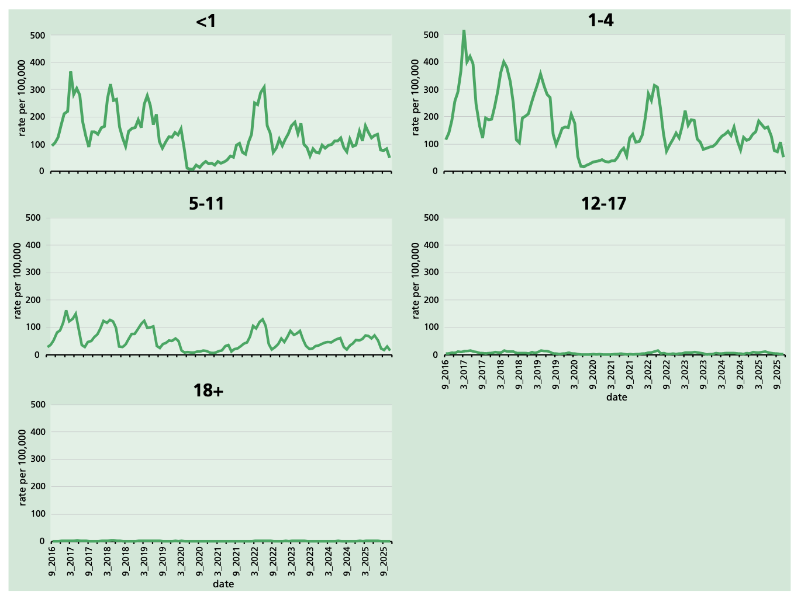

# Varicella

**NOTIFIABLE IN ENGLAND AND NORTHERN IRELAND**

## The disease

Varicella (chickenpox) is an acute, highly infectious disease caused by the varicella zoster virus (VZV). It occurs most commonly in young children.

Varicella is characterised by an itchy, vesicular rash. A mild prodrome of one to two days of fever and malaise may precede the rash. This is more common in adults; in young children rash is often the first symptom. The rash often starts on the face and scalp, spreads to the trunk, and is sparse on the limbs. After three to four days, the vesicles dry with a granular scab and are usually followed by further crops. Vesicles may be so few as to be missed or so numerous that they become confluent.

Varicella is primarily transmitted by inhalation of aerosols generated from vesicular fluid, and through direct contact with lesions. Transmission may also occur if infected respiratory tract secretions are aerosolised. The infectious period is from 24 hours before the rash appears until the vesicles are dry, though evidence for transmission prior to rash onset is limited (Marin _et al_., 2021). The infectious period may be prolonged in immunosuppressed patients. The secondary attack rate from household contact with a case of chickenpox is approximately 71% (Seward _et al_., 2004). The incubation period is 14 to 16 days (range: 10 to 21).

### Complications

Although varicella is usually self-limiting, it can have severe complications. Bacterial infections, especially with Group A Streptococcus (GAS), are the most common complications in children. 11% of varicella-associated hospital admissions are due to skin complications (Bernal _et al_., 2019). 14% of invasive GAS cases in children under 15 years had a preceding varicella infection (UKHSA surveillance data, unpublished). Neurological complications can include cerebellar ataxia and encephalitis (World Health Organization, 2016). Without vaccination, the case fatality ratio is estimated to be 2.6 per 100,000 cases (Nagel _et al._ 2023).

Neonates, pregnant women, and immunosuppressed individuals are at greatest risk of complications, including pneumonia, hepatitis, and encephalitis. The disease can be more severe in adults than children.

Risk to pregnant women increases with gestation. Seven of the nine deaths due to varicella in pregnancy in England and Wales between 1985 and 1998 occurred between 27- and 32-weeks' gestation (Enders and Miller, 2000). No deaths due to varicella in pregnancy were reported in the United Kingdom between 1999 and 2022 (National Perinatal Epidemiology Unit, 2025).

Risks to the foetus and neonate from maternal varicella are related to the time of infection in the mother (Enders _et al_., 1994; Miller _et al_., 1990):

- **First 20 weeks of pregnancy --** congenital (foetal) varicella syndrome (CVS), which includes limb hypoplasia, microcephaly, cataracts, growth retardation and skin scarring. Miscarriage and foetal death have also been reported. CVS is estimated to occur in 1-2% of antenatal varicella cases where the mother is not treated with antivirals (Charlier, _et al_., 2024).
- **From 20 weeks of pregnancy to a week prior to delivery --** CVS is very rare, although occasional cases of foetal damage, including chorioretinal damage, microcephaly and skin scarring following maternal varicella between 20 and 28 weeks' gestation have been reported (Tan and Koren, 2006). There is evidence that an otherwise healthy foetus may have a subsequent herpes zoster reactivation in utero.
- **A week before to a week after delivery --** severe varicella disease in the neonate. Untreated, this may be fatal in 20% of cases (Charlier _et al_., 2024).

### Breakthrough varicella

Breakthrough varicella is wild-type VZV infection in a fully vaccinated person, occurring at least 42 days after vaccination. Most breakthrough infections are attenuated, and individuals have fewer lesions and fewer systemic symptoms than unvaccinated individuals. The rash may be macular rather than vesicular (Chaves _et al_., 2008). Testing may be required to differentiate from other diagnoses.

Breakthrough varicella is less infectious than varicella in unvaccinated individuals. A household transmission study found that the secondary attack rate following exposure to breakthrough varicella (in this study following a single-dose vaccine) was 37%, compared to 71% following exposure to varicella in unvaccinated individuals. This varied with the number of lesions (Seward _et al_., 2004).

### Herpes zoster

Herpes zoster (shingles) is caused by the reactivation of a latent VZV infection. A national shingles immunisation programme was introduced in 2013. Further information is available in the [Shingles chapter](https://www.gov.uk/government/publications/shingles-herpes-zoster-the-green-book-chapter-28a).

## Epidemiology of the disease

Varicella became a notifiable disease in England in 2025. It is also notifiable in Northern Ireland, though not in Scotland or Wales. Historical data is therefore limited to sentinel surveillance through primary care, and hospital admissions data.

The incidence of varicella is seasonal and classically reaches a peak from March to May; it reduces sharply in the school summer holidays. The rate of consultations for varicella in primary care has reduced over the past few years, and was significantly disrupted by the COVID-19 pandemic (figure 1).

Figure 1. Rate of varicella primary care consultations by age group in England per 100,000 registered population, September 2016 to November 2025. Royal College of General Practitioners sentinel surveillance programme.

An analysis of hospital admissions data in England 2004-2017 found a mean of 4694 varicella-related hospital admissions per year, of which 38% had a documented complication. However, it is likely that routine data varicella complications is incomplete, so this is likely to under-estimate disease burden even in hospitalised cases. (Bernal _et al_., 2019).

Varicella is a very common childhood infection in temperate climates. An estimated 90% of people raised in the UK are immune by the age of 15 (Vyse _et al_., 2004).

## Introduction of universal vaccination

In October 2023 the Joint Committee on Vaccination and Immunisation (JCVI) recommended a universal two-dose varicella vaccination programme at 12 and 18 months of age, using the combined measles, mumps, rubella, and varicella (MMRV) vaccine.

JCVI had previously considered varicella vaccination, but this was not found to be cost-effective in the short- or medium-term. This was largely due to the theorised risk of increased herpes zoster cases in middle-aged adults due to reduced exogenous boosting, with the increase in zoster predicted to peak 20 years after programme introduction (van Hoek _et al_., 2011).

In 2022 and 2023 JCVI reviewed updated evidence on varicella disease burden, exogenous boosting, seroprevalence, and cost-effectiveness. A hospital surveillance study concluded that complications from severe varicella were common, costly, and placed a burden on health services. Real world experience from countries with longstanding varicella vaccination programmes found that these significantly reduced cases and hospitalisations, without a subsequent rebound in cases and without causing an increase in herpes zoster. Updated modelling found the programme to be cost-effective.

The universal programme was introduced in January 2026.

## The varicella vaccines

Varicella vaccines are lyophilised preparations containing live, attenuated virus derived from the Oka strain of VZV.

Two MMRV vaccines are currently available for use in the routine childhood schedule: Priorix-Tetra® (GSK) and ProQuad® (Merck Sharp & Dohme Ltd). Two monovalent varicella vaccines are available for use where indicated: Varilrix® (GSK) and Varivax® (Merck Sharp & Dohme Ltd).

### Vaccine effectiveness

The immune response to the MMRV vaccine after one dose demonstrates high seroconversion rates, with approximately 87% of children developing antibodies against varicella, and more than 90% developing antibodies against measles, mumps, and rubella. Following the second dose, seroconversion improves further, reaching approximately 99% for all four (World Health Organization, 2016; Tischer and Gerike, 2000; Nagel _et al_., 2023). This is supported by a meta-analysis which found over 90% of individuals will seroconvert to measles, mumps, rubella, and varicella antibodies after the first dose of MMRV vaccine (Leung _et al_., 2015).

The two-dose monovalent vaccine provides 98% protection in children (Shapiro _et al_., 2011) and 75% protection in adolescents and adults (Annunziato and Gershon, 2000).

Effectiveness studies align with these findings, showing that one dose provides good protection, but two doses offer superior and durable immunity. A case control study estimated varicella vaccine effectiveness to be 93% after one dose and 97% after two (Cenoz _et al_., 2013). A 14-year cohort study of children vaccinated in the US found no reduction in varicella vaccine effectiveness over time, and no breakthrough cases in children who received a two-dose vaccine; 25 years of surveillance in the US has shown no decrease in vaccine effectiveness over time when using a two-dose schedule (Baxter _et al_., 2013; Shapiro and Marin, 2022).

The vaccine virus strain can rarely establish latent infection and reactivate to cause herpes zoster in immunocompetent individuals, but the risk is substantially lower than with wild varicella infection. Cases of herpes zoster occurring in a varicella vaccinee should be investigated and samples should be sent to the UKHSA Virus Reference Department: https://www.gov.uk/government/publications/varicella-zoster-virus-referral-form.

### Dosage and schedule

For both MMRV and monovalent varicella vaccines, two doses of 0.5ml at the recommended interval, according to the recommendations for use (see below).

**Infants aged under 9 months**

Varicella containing vaccines should not be administered

**Children and adults aged 9 months and older**

Two doses a minimum of four weeks apart

### Administration

All varicella-containing vaccines can be administered by either intramuscular or subcutaneous injection. The preferred injection sites are the anterolateral area of the thigh in younger children and the deltoid area in older children, adolescents, and adults.

### Interchangeability

Both of the MMRV and both of the monovalent varicella vaccines are considered clinically equivalent and interchangeable. Either MMRV vaccine or either monovalent varicella vaccine can be used to complete a course started with the other.

### Co-administration with other vaccines

The vaccines can be given at the same time as most other live vaccines. However, MMRV should not be given at the same time as yellow fever vaccine; a minimum four-week gap should be observed. Monovalent varicella vaccines can be given on the same day as MMR or, if they are not given on the same day, a minimum four-week interval should be observed. However, following the introduction of the universal MMRV programme, this should rarely be required. For all other live vaccines no deferral is required.

The vaccines can be given at the same time as inactivated vaccines. If varicella-containing vaccine is not given at the same time as an inactivated vaccine, it can be given at any interval before or after.

Vaccines given on the same day should be given at separate sites, preferably in a different limb. If given in the same limb, they should be given at least 2.5cm apart (American Academy of Pediatrics, 2021). The site at which each vaccine was given should be noted in the individual's records.

[Chapter 11](https://www.gov.uk/government/publications/immunisation-schedule-the-green-book-chapter-11) contains information on the routine schedule and co-administration of vaccines.

### Excipients

ProQuad® and Varivax® contain hydrolysed gelatine. Priorix-Tetra® and Varilrix® should be offered to patients not wishing to have a vaccine with gelatine.

All four varicella-containing vaccines may contain traces of neomycin.

ProQuad®, Priorix-Tetra®, and Varilrix® vaccines contain a source of phenylalanine. The National Society for Phenylketonuria (NSPKU) advise the amount of phenylalanine contained in vaccines is negligible and therefore strongly advise individuals with PKU to take up the offer of immunisation.

The Summaries of Product Characteristics (SPCs) contain a full list of excipients for each vaccine.

### Presentation

Varicella vaccines are available as lyophilised preparations for reconstitution with a diluent.

- Priorix-Tetra®: before reconstitution, the powder is a whitish to slightly pink coloured cake, a portion of which may be yellowish. The solvent is a clear colourless liquid. When reconstituted, the vaccine may vary from clear peach to fuchsia pink and may contain translucent particulates. These do not affect the vaccine's efficacy.
- ProQuad®: before reconstitution, the powder is a white to pale yellow compact crystalline cake. The solvent is a clear colourless liquid. When reconstituted, the vaccine is a clear pale yellow to light pink liquid.
- Varilrix®: before reconstitution, the powder is a slightly cream to yellowish or pinkish coloured cake and the solvent is a clear colourless liquid. When reconstituted, the vaccine may vary from clear peach to pink and may contain translucent particulates. These do not affect the vaccine's efficacy.
- Varivax®: before reconstitution, the powder is white to off-white and the solvent is a clear colourless liquid. When reconstituted, the vaccine is a clear, colourless to pale yellow liquid.

After reconstitution, all vaccines should be used immediately.

### Storage

[Chapter 3](https://www.gov.uk/government/publications/storage-distribution-and-disposal-of-vaccines-the-green-book-chapter-3) contains information on vaccine storage.

The SPCs may give further detail on vaccine storage.

### Disposal

[Chapter 3](https://www.gov.uk/government/publications/storage-distribution-and-disposal-of-vaccines-the-green-book-chapter-3) outlines disposal requirements for vaccines.

Equipment used for immunisation, including used vials, ampoules, or discharged vaccines in a syringe, should be disposed of safely in a UN-approved puncture-resistant 'sharps' box, according to local waste disposal arrangements and guidance in the [technical memorandum 07-01: Safe and sustainable management of healthcare waste (NHS England)](https://www.england.nhs.uk/publication/environment-and-sustainability-health-technical-memorandum-07-01-safe-and-sustainable-management-of-healthcare-waste/).

## Varicella zoster immunoglobulin for intravenous administration

Varicella zoster immunoglobulin for intravenous (IV) administration (Varitect® CP) is produced by Biotest as a solution for IV infusion and is dispensed as 25 IU/ml.

**Recommendations for use**

It is recommended that Varitect® CP is administered as a single dose as post-exposure prophylaxis for eligible neonates. Guidance on post-exposure prophylaxis: https://www.gov.uk/government/publications/post-exposure-prophylaxis-for-chickenpox-and-shingles.

Varitect® CP is not licensed for use in the UK, though it is licensed in Germany. Clinicians may prescribe unlicensed medicines when it is in the best interest of the patient based on available evidence. The use of this product in neonates has been considered and recommended by the PHE/UKHSA convened expert working group.

Where Varitect® CP is unavailable or cannot be sourced in an appropriate timeframe, intravenous immunoglobulin (IVIG) should be administered instead.

**Dosage**

A single treatment dose of 25-50IU/kg of body weight (1-2ml/kgBW) up to a maximum of 1 vial (5 mls) as post-exposure prophylaxis for eligible neonates.

**Administration**

Varitect® CP should be given by slow intravenous infusion (0.1ml/kgBW/hr for the first 10 minutes and then slowly increased to a maximum of 1ml/kgBW/hr for the rest of the infusion). Treatment should be started as soon as possible after exposure, preferably within 96 hours, and no longer than 10 days after exposure.

**Safety**

Varitect® CP appears to be well tolerated. Very rarely anaphylactoid reactions occur in individuals with hypogammaglobulinaemia who have IgA antibodies, or in those who have had an atypical reaction to blood transfusion.

## Recommendations for the use of the vaccine

Varicella vaccines can be given irrespective of a history of varicella, measles, mumps, or rubella infection or vaccination. There are no ill effects from immunising such individuals because they have pre-existing immunity that inhibits replication of the vaccine viruses.

Varicella-containing vaccines should not be given to infants under 9 months of age.

### Pre-exposure vaccination

**Universal programme**

A universal two-dose varicella vaccination programme was introduced into the routine childhood schedule in the UK on 1 January 2026, with the aim of reducing the number of varicella cases and preventing severe cases and complications.

The objective of the immunisation programme is to provide two doses of MMRV vaccine at appropriate intervals for all eligible individuals. The first dose of MMRV should be given between 12 and 13 months of age (i.e. within a month of the first birthday). The second dose should be given at 18 months.

The first dose of MMRV should be given between 12 and 13 months of age (i.e. within a month of the first birthday). If a dose of MMRV is given before the first birthday, either because of travel to an endemic country, or because of a local outbreak, then this dose should not be counted, and a further dose should be given at the recommended times between 12 and 13 months of age.

The second dose of MMRV vaccine is given at 18 months of age, but if needed can be given at any time from three months after the first dose. If the child is given the second dose less than three months after the first dose and at less than 18 months of age, then the routine 18-month dose (which would constitute a third dose in this case) should be given to ensure full protection.

**Phased introduction**

All children born after 1 January 2025 are eligible for two doses of MMRV at 12 and 18 months of age. Children born between 1 July 2024 and 31 December 2024 are eligible for two doses of MMRV at 18 months and 3 years 4 months of age, having received one MMR at 12 months. Children born between 1 September 2022 and 30 June 2024 are eligible for one dose of MMRV at 3 years 4 months of age, having received one MMR at 12 months.

**Selective catch-up**

A single-dose selective catch-up campaign was recommended by JCVI for all children born between 1 January 2020 and 31 August 2022 without a history of varicella infection or two doses of varicella vaccine. These children are less likely to have been exposed to varicella due to their age and due to the impact the COVID-19 pandemic had on disease transmission. A single dose of MMRV is highly effective at preventing severe varicella disease.

**Susceptible groups recommended for vaccination**

Some individuals should be offered varicella vaccination due to their occupational risk or their risk of transmitting varicella to vulnerable individuals.

Any varicella-containing vaccine may be used for this at the discretion of their GP or occupational health department, though monovalent vaccine is generally expected. Clinicians should consider using MMRV if the individual does not have a complete MMR-containing vaccine history.

**Healthcare workers**

Varicella is a risk to susceptible healthcare staff who may pass it on to vulnerable patients. Therefore, any healthcare workers who have patient contact should be protected. This includes medical and nursing staff, and those working in healthcare settings such as cleaners, catering staff, ambulance staff, and receptionists, whether employed directly or through contract.

Those with a reliable history of varicella or herpes zoster, or two documented doses of varicella-containing vaccine, or a positive VZ IgG can be considered protected.

Healthcare workers with a negative or uncertain history of varicella or herpes zoster should be serologically tested and vaccine offered only to those without VZ antibody.

Healthcare workers should be told at the time of vaccination that they may experience a rash, either at the injection site or generalised, in the month after vaccination. In either case, they should report to their occupational health department for assessment before commencing work. If the rash is generalised and consistent with a vaccine-associated rash (papular or vesicular), the healthcare worker should avoid patient contact until all the lesions have crusted. Healthcare workers with localised vaccine rashes that can be covered with a bandage and/or clothing should be allowed to continue working unless in contact with immunocompromised or pregnant patients. In the latter situation, an individual risk assessment should be made.

Samples from rashes following vaccination should be sent for analysis to the UKHSA Virus Reference Department): https://www.gov.uk/government/publications/varicella-zoster-virus-referral-form.

Post-vaccination serological testing is not recommended.

**Laboratory staff**

Vaccination should be offered to individuals who may be exposed to varicella virus in the course of their work in virology laboratories and clinical infectious disease units.

**Contacts of immunocompromised patients**

Vaccination should be offered to healthy susceptible contacts of immunocompromised patients where continuing close contact is unavoidable (e.g. siblings of a leukaemic child, or a child whose parent or sibling is undergoing chemotherapy). See the [Shingles chapter](https://www.gov.uk/government/publications/shingles-herpes-zoster-the-green-book-chapter-28a) for advice on direct herpes zoster vaccination for severely immunosuppressed individuals.

**Susceptible individuals prior to commencing immunosuppressive treatment**

Based on clinical discretion, varicella vaccination may be considered for seronegative individuals who are planning to receive immunosuppressive treatment. If there is sufficient time to complete the two-dose course, this should be given. If treatment must begin sooner, they should be offered a single dose.

### Post-exposure prophylaxis

Post-exposure prophylaxis is recommended in certain circumstances following a significant exposure to varicella or herpes zoster.

A significant exposure is defined as close contact during the infectious period of an individual with varicella, disseminated herpes zoster, exposed herpes zoster lesions in an immunocompetent individual, or any herpes zoster lesions in an immunosuppressed individual. Further guidance can be found at: https://www.gov.uk/government/publications/post-exposure-prophylaxis-for-chickenpox-and-shingles.

**Effectiveness of post-exposure prophylaxis**

_Vaccine_

There is evidence that administering varicella vaccine within three days of exposure reduces both the risk of acquiring infection and the severity of infection (Ferson, 2001). A meta-analysis found that 23% of household contacts vaccinated within 5 days of exposure developed varicella, compared to 78% of unvaccinated contacts. Vaccination was most effective if given within 3 days of exposure. Vaccinated contacts who developed varicella had milder disease than unvaccinated contacts (Macartney _et al_., 2014).

_VZ immunoglobulin_

About half of neonates exposed to maternal varicella became infected despite VZIG prophylaxis (Miller _et al_., 1990). In up to two-thirds of these infants, infections were mild or asymptomatic but rare fatal cases have been reported despite immunoglobulin prophylaxis in those with onset of maternal chickenpox in the period four days before to two days after delivery. Prophylaxis using both VZIG and antivirals is therefore recommended.

_Antivirals_

Historically, VZIG was used as post-exposure treatment for pregnant and immunosuppressed individuals. However, efficacy of aciclovir for post-exposure prophylaxis has been evaluated and found to be no different to that of VZIG; in some cases antivirals have been found to be more effective, albeit without statistical significance (Cuerden _et al_., 2022; Sile _et al_., 2022).

Further information and guidance can be found at: https://www.gov.uk/government/publications/post-exposure-prophylaxis-for-chickenpox-and-shingles

**Post-exposure prophylaxis using vaccine**

_Healthcare workers_

Healthcare workers without a definite history of varicella, zoster, or two varicella vaccines are susceptible. Following a significant exposure to VZV (as above and including those dressing localised zoster lesions on non-exposed areas of the body) they should be offered vaccination (see above). They should be reviewed by their occupational health (OH) department and either be excluded from contact with high-risk patients from eight to 21 days post-exposure, or be advised to report to OH before having patient contact if they feel unwell or develop a fever or rash.

Healthcare workers with a definite history of varicella, zoster, or two varicella vaccines should be considered immune. Following a significant exposure to VZV they should be allowed to continue working. As there is a small risk that they develop varicella, they should be advised to report to OH for assessment before having patient contact if they feel unwell or develop a fever or rash.

**Management of Group A Streptococcus outbreaks with co-circulating varicella in nursery and pre-school settings**

Varicella infection is a significant risk factor for invasive Group A Streptococcus (iGAS) in children (Efstratiou and Lamagni, 2016). If varicella is co-circulating with GAS in a nursery or pre-school setting, the incident management team may recommend post-exposure varicella vaccination for susceptible children aged 9 months and older. This should ideally be given within 3 days of exposure. Further information is available: [Management of scarlet fever outbreaks in schools](https://www.gov.uk/government/publications/scarlet-fever-managing-outbreaks-in-schools-and-nurseries).

Either MMRV or monovalent varicella vaccine may be given, depending on factors such as age, vaccine history, and availability of vaccine for rapid deployment. If MMRV is given to infants aged under one year, this should be discounted and they should receive their routine doses at the scheduled age.

**Post-exposure prophylaxis using VZIG and/or antivirals**

The aim of post-exposure management is to protect susceptible individuals at high risk of suffering from severe varicella. This includes neonates, pregnant women, and immunosuppressed individuals.

Antiviral treatment is the recommended post-exposure prophylaxis for all at-risk individuals, with the addition of VZ immunoglobulin (Varitect® CP or IVIG) for neonates exposed to maternal infection between 1 week before and 1 week after delivery.

Full guidance can be found at: https://www.gov.uk/government/publications/post-exposure-prophylaxis-for-chickenpox-and-shingles.

## Treatment

Varicella vaccines have no place in the treatment of severe disease, and treatment is generally with IV and oral antivirals.

## Contraindications

The vaccine should not be given to:

- immunosuppressed patients. For patients who require protection against chickenpox, seek advice from a specialist
- women who are pregnant. Pregnancy should be avoided for one month following the last dose of varicella vaccine (see below)
- those who have had:
  - a confirmed anaphylactic reaction to a previous dose of the vaccine
  - a confirmed anaphylactic reaction to any component of the vaccine, including neomycin or gelatine

Varicella-containing vaccines are not recommended for infants aged under 9 months. Infants under 9 months old requiring urgent protection against measles may receive the MMR from 6 months of age; see the [measles chapter](https://www.gov.uk/government/publications/measles-the-green-book-chapter-21) for further information.

## Precautions

Unless protection is needed urgently, immunisation should be postponed in acutely unwell individuals until they have recovered fully. This is to avoid confusing the differential diagnosis of any acute illness by wrongly attributing any sign or symptoms to the adverse effects of the vaccine.

### Pregnancy and breast-feeding

Those who are pregnant should not receive varicella vaccines. Pregnancy should be avoided for one month following the last dose.

Breastfeeding is not a contraindication to varicella vaccines. Evidence shows that the vaccine virus is not present in breast milk (Bohlke _et al_., 2003). There is no evidence of measles or mumps vaccine viruses being present in breast milk. Very occasionally, rubella vaccine virus has been found in breast milk, but this has not caused any symptoms in the baby (Buimovici-Klein _et al_., 1997; Landes _et al_., 1980; Losonsky _et al_., 1982). See [chapter 6](https://www.gov.uk/government/publications/contraindications-and-special-considerations-the-green-book-chapter-6) for advice regarding varicella vaccines for breastfed infants whose mothers are taking biological therapies.

### Inadvertent vaccination in pregnancy

Pregnant individuals who are inadvertently vaccinated with varicella-containing vaccine can be reassured. Surveillance over 19 years in the US did not identify any specific risk to the foetus. 164 infants were born to women who were inadvertently vaccinated and were VZV seronegative at the time, none of whom developed congenital varicella syndrome (Marin _et al_., 2014; Willis ED _et al_., 2022). Although the numbers are smaller, no conditions consistent with congenital varicella syndrome have been reported in the UK following vaccination. If a pregnant individual develops a generalised vesicular (varicella-like) rash following vaccination, they should be clinically reviewed for consideration of antivirals. Local injection site reactions are common and do not require any specific follow up.

UKHSA monitors women who have inadvertently received varicella-containing vaccine up to 3 months before pregnancy or at any time during pregnancy. Women who have been immunised with any varicella or shingles vaccine (including Shingrix®) in pregnancy should be reported to [UKHSA Vaccine in Pregnancy Surveillance](https://www.gov.uk/government/publications/vaccine-in-pregnancy-surveillance-programme).

Pregnant individuals who are inadvertently vaccinated with MMRV can be reassured with regards to the MMR components. Although MMR-containing vaccines are contraindicated during pregnancy as a precaution, surveillance of inadvertent vaccination in pregnancy has been reassuring.

### Immunosuppression and HIV infection

Varicella vaccines are contraindicated in severely immunosuppressed patients. However, varicella vaccination is recommended for healthy susceptible contacts of immunosuppressed patients where continuing contact is unavoidable (see above). Shingles vaccination is recommended for severely immunosuppressed individuals aged over 18 (see [Shingles chapter](https://www.gov.uk/government/publications/shingles-herpes-zoster-the-green-book-chapter-28a)).

Varicella vaccines can be given to people living with HIV with no or moderate immunosuppression (age-specific CD4+ percentage of >15%). Further guidance is provided by the British HIV Association (BHIVA, https://bhiva.org) and the Children's HIV Association of UK and Ireland (CHIVA, https://www.chiva.org.uk).

For immunosuppressed patients who require protection against varicella, seek advice from a specialist.

### Use of salicylates

Increased risk of Reye's syndrome has been reported in children treated with aspirin during natural varicella infection. Aspirin and systemic salicylates are therefore not recommended in children aged under 16 except under medical supervision. However, experience in other countries has found no reports of Reye's syndrome following varicella vaccination. There is no need to avoid salicylates before or after receiving varicella vaccines, if their use is clinically indicated. The benefit is likely to outweigh the potential risk of Reye's syndrome (Marin _et al_., 2007).

### Administration with blood products

When vaccines are given within three months of receiving blood products such as immunoglobulin, the immune response may be reduced. This is because such blood products may contain significant levels of varicella-specific antibodies, as well as measles, mumps, and rubella antibodies, which could then prevent vaccine virus replication. It is unlikely, however, that response to all four viruses will be completely absent after receipt of any blood product -- for example rubella vaccine response has been shown to be adequate after anti-D administration (Edgar and Hambling 1977; Black _et al_, 1983). Therefore, to reduce the risk that a deferred vaccination would be missed, and particularly if immediate protection is required, vaccine (MMRV or monovalent varicella as appropriate) should still be given. To confer longer term protection, another dose of vaccine should be considered after three months.

### Allergy to egg

All children with egg allergy should receive the MMRV as a routine procedure in primary care.

Monovalent varicella vaccines and the varicella component of MMRV are not manufactured using eggs or egg-derived products. Although MMR-containing vaccines use egg-derived products in the manufacturing process, they are not used in the vaccine itself. Data suggest that anaphylactic reactions to MMR-containing vaccines are not associated with hypersensitivity to egg antigens but to other components of the vaccine, such as gelatine (Fox and Lack, 2003). Children who have had documented anaphylaxis to the vaccine itself should be assessed by an allergist.

## Adverse reactions

Studies conducted worldwide have found varicella-containing vaccines to be well tolerated and rarely associated with serious adverse events (Di Pietrantonj _et al_., 2020).

Adverse events following varicella-containing vaccines (except allergic reactions) are typically due to effective replication of the vaccine viruses, with subsequent mild illness. Such events are to be expected in some individuals. Events due to the varicella component occur up to a month after vaccination. Events due to the measles component occur six to 11 days after vaccination. Events due to the mumps and rubella components usually occur two to three weeks after vaccination but may occur up to six weeks after vaccination. Individuals with a varicella-like rash post-vaccination may be infectious to others (see below). Individuals with other vaccine-associated symptoms are not infectious to others.

Overall rates of adverse reactions after varicella-containing vaccines are similar or lower in second and subsequent doses compared to first doses.

All suspected reactions in children and severe suspected reactions in adults should be reported to the Medicines and Healthcare product Regulatory Agency using the Yellow Card scheme (https://yellowcard.mhra.gov.uk/).

### Common reactions

The most reported reactions for both MMRV and monovalent varicella vaccines are at the injection site and include pain, redness, and swelling. Generalised symptoms such as fever and rash can also occur, but less frequently.

### Varicella-like post-vaccination rash

Some individuals may develop a varicella vaccine-associated rash around the site of the injection. This should not prevent them from attending childcare or educational settings, but it should be kept covered as a precaution.

Very rarely, an individual may develop a varicella-like rash either disseminated or localised away from the site of injection, within one month of vaccination. Given the current epidemiology, this rash is more likely to be due to natural varicella infection than the vaccine virus. Individuals should be reviewed by a clinician and recent exposure considered. Susceptible contacts of those with likely natural varicella infection should be managed accordingly.

Transmission of varicella vaccine virus from immunocompetent vaccinees to susceptible close contacts has occasionally been documented but the risk is very low. If a localised vaccine-related rash develops away from the site of injection then the lesions should be covered to further reduce the risk of transmission; a child can attend childcare or educational settings. If the rash is disseminated, then the risk is higher, and immunosuppressed people with significant exposure to the vaccinee should be offered post-exposure prophylaxis in line with guidance. Immunocompetent pregnant contacts can be reassured that the risk of infection is very low. Transmission in the absence of a post-vaccination rash has not been documented (Marin _et al_., 2019).

Healthcare workers who experience a varicella-like post-vaccination rash should be assessed by their occupational health department (see above). Samples from rashes following vaccine in healthcare workers should be sent for analysis to the UKHSA Virus Reference Department at Colindale: https://www.gov.uk/government/publications/varicella-zoster-virus-referral-form.

Following MMRV, individuals may also develop a measles-like rash. They can be reassured that they are not infectious for measles. However, they should be reviewed by a clinician and recent exposure should be considered.

### Febrile convulsions

Febrile convulsions commonly occur in children under 5 in the course of a febrile illness. These are typically a self-limiting paediatric condition with no long-term consequences. An estimated 2-5% of children will experience febrile convulsions before the age of 5 (Eilbert and Chan, 2022).

There is a small elevated risk of febrile convulsions following vaccination with the first dose of MMRV; this is not observed following the second dose. These usually occur 5-10 days following vaccination. One study estimated the absolute risk to be 7 per 10,000 doses in the 7-10 days following vaccination (MacDonald _et al_., 2014). Another estimates a risk of 9.6 cases per 10,000 doses, equating to 1 additional child experiencing febrile convulsions for every 2500 doses given. The risk of febrile convulsions following measles infection is 2300 per 100,000 cases (Casabona _et al_., 2023).

There is no evidence of an increased risk of febrile convulsions following monovalent varicella vaccine.

### Encephalitis

Encephalitis is a known complication of wild-type varicella and measles infections, associated with approximately 2-3 in 100,000 cases and 100 in 100,000 cases respectively (World Health Organization, 2016; Moss and Strebel, 2023).

Post-marketing surveillance of varicella-containing vaccines has found a small number of cases of encephalitis which occurred after vaccination. However, there is very limited data to quantify an association between vaccination and encephalitis.

Surveillance of adverse events following varicella vaccination in the USA recorded 80 cases of encephalitis following monovalent varicella vaccine, and 22 cases following MMRV, representing a rate of 0.06 cases per 100,000 doses given for both vaccines. VZ virus was detected in 3 of these cases, of which 1 was confirmed as vaccine virus (Moro _et al_., 2022).

The risk of encephalitis associated with varicella and measles infections is far greater than the risk following vaccination.

### Idiopathic thrombocytopenic purpura

Idiopathic thrombocytopenic purpura (ITP) may occur following MMRV vaccination and is most likely due to the rubella component. This usually occurs within six weeks and resolves spontaneously. ITP occurs in about 1 in 22,300 children who are given a first dose of MMR in the second year of life (Miller _et al_., 2001), and this is likely to be similar following MMRV. The risk of developing ITP after MMRV vaccination is much less than the risk of developing it after infection with wild measles or rubella virus. Children with previously diagnosed ITP do not have an increased risk of ITP following MMR-containing vaccination. There is no evidence of an association between ITP and the second MMR dose; there is insufficient data on outcomes following the second dose for children who experienced ITP following the first dose (Stowe _et al_., 2008).

If ITP occurs within the six weeks following the first dose of MMRV then blood should be taken and tested for measles antibodies before a second dose is given. Serum should be sent to the UKHSA Virus Reference Laboratory, which offers free, specialised serological testing for such children. If the results suggest a lack of protection against measles, then a second dose of MMRV is recommended. Serological testing for the mumps, rubella, and varicella components is not recommended.

There is no association between monovalent varicella vaccine and ITP.

### Anaphylaxis

Anaphylaxis is extremely rare and needs to be thoroughly investigated. See [chapter 8](https://www.gov.uk/government/publications/vaccine-safety-and-the-management-of-adverse-events-the-green-book-chapter-8) and [chapter 6](https://www.gov.uk/government/publications/contraindications-and-special-considerations-the-green-book-chapter-6) for guidance on anaphylaxis following vaccination and on administering subsequent vaccines following a suspected anaphylactic reaction.

## Supplies

### Vaccines

Varivax® is manufactured by MSD. MSD vaccines are distributed by Alliance Healthcare (Tel: 0330 100 0448. Email: customerservice@alliance-healthcare.co.uk)

Varilrix® is manufactured by GSK (Tel: 01992 467 272)

Priorix-Tetra® (MMRV) is manufactured by GSK

ProQuad® (MMRV) is manufactured by MSD

MMRV vaccines are available in England and Wales from ImmForm via their website immform.ukhsa.org.uk or by telephone 0207 183 8580.

In Scotland, supplies should be obtained from local vaccine holding centres. Details of these are available from Public Health Scotland by emailing phs.immunisation@phs.scot

In Northern Ireland, supplies of MMRV vaccines should be obtained from local childhood vaccine holding centres. Details of these are available from the Regional Pharmaceutical Procurement Service (Tel: 028 9442 4089).

### Varitect® CP

England: Varitect® CP is issued through the UKHSA Rabies and Immunoglobulin Service (tel: 0300 128 1020), after an appropriate risk assessment.

Wales: available following consultation with local consultant microbiologist.

Northern Ireland: advice via Regional Virus Laboratory, BHSCT Royal Hospitals Site on 07889 086 946 or BHSCT Royal Pharmacy Department through switchboard at 0289 024 0503.

Scotland: contact Public Health Scotland by emailing phs.immunisation@phs.scot.

Varitect® CP is issued free of charge for neonates who meet the criteria given above. Clinicians who wish to issue Varitect® CP for patients not meeting these criteria should approach the manufacturer directly to purchase a dose.

No licensed VZIG preparations for intramuscular use are available in the UK.

## References

American Academy of Pediatrics (2021) Active immunization. In: Kimberlin DW, Barnett ED, Lynfield R, Sawyer MH, eds. Red Book: 2021 Report of the Committee on Infectious Diseases. 32nd edition. Itasca, IL: American Academy of Pediatrics: 2021, p28.

Annunziato PW and Gershon AA (2000) Primary vaccination against varicella. In: Arvin AM and Gershon AA (eds) _Varicella-zoster virus_. Cambridge: Cambridge University Press.

Baxter R, Ray P, Tran TN, Black S, Shinefield HR, Coplan P _et al_. (2013) Long-term effectiveness of varicella vaccine: A 14-year prospective cohort study. _Pediatrics_ 2013 131 (5):e1389-e1396

Bernal JL, Hobbelen P, Amirthalingam G. Burden of varicella complications in secondary care, England, 2004 to 2017. Euro Surveill. 2019 Oct;24(42):1900233. doi: 10.2807/1560-7917.ES.2019.24.42.1900233. PMID: 31640840; PMCID: PMC6807256.

Black NA, Parsons A, Kurtz JB _et al_. (1983) Post-partum rubella immunisation: a controlled trial of two vaccines. _Lancet_ 2(8357): 990--2.

Bohlke K, Davis RL, DeStefano F _et al_. (2003) Vaccine Safety Datalink Team. Postpartum varicella vaccination: is the vaccine virus excreted in breast milk? _Obstet Gynecol_ 102 (5 Pt 1): 970--7.

British HIV Association (2015) _British HIV Association guidelines on the use of vaccines in HIV-positive adults 2015_ https://www.bhiva.org/vaccination-guidelines

Buimovici-Klein E, Hite RL, Byrne T and Cooper LR (1997) Isolation of rubella virus in milk after postpartum immunization. J Pediatr 91: 939--43.

Casabona, G., Berton, O., Singh, T., Knuf, M., & Bonanni, P. (2023). Combined measles-mumps-rubella-varicella vaccine and febrile convulsions: the risk considered in the broad context. _Expert Review of Vaccines_, _22_(1), 764--776. https://doi.org/10.1080/14760584.2023.2252065

Cenoz MG, Martínez-Artola V, Guevara M, Ezpeleta C, Barricarte A, Castilla J. (2013) Effectiveness of one and two doses of varicella vaccine in preventing laboratory-confirmed cases in children in Navarre, Spain. _Hum Vaccin Immunother_. 2013 May;9(5):1172-6. doi: 10.4161/hv.23451. Epub 2013 Jan 16. PMID: 23324571; PMCID: PMC3899156.

Charlier C, Anselem O, Caseris M, Lachâtre M, Tazi A, Driessen M, _et al_. (2024). Prevention and management of VZV infection during pregnancy and the perinatal period. _Infectious Diseases Now_ 54(4). Doi: 10.1016/j.idnow.2024.104857

Chaves SS, Zhang J, Civen R, Watson BM, Carbajal T, Perella D, Seward JF (2008) Varicella disease among vaccinated persons: clinical and epidemiological characteristics, 1997-2005. _Journal of Infections Diseases._ 2008 197(2): s127-s131

Children's HIV Association [CHIVA] (2019) Vaccination of HIV infected children (UK schedule, 2018) https://www.chiva.org.uk/files/8315/4453/4519/Vaccination_of_HIV_infected_children_2018.pdf

Cuerden C, Gower C, Brown K, Heath PT, Andrews N, Amirthalingam G, Bate J. (2022) PEPtalk 3: oral aciclovir is equivalent to varicella zoster immunoglobulin as postexposure prophylaxis against chickenpox in children with cancer - results of a multicentre UK evaluation. Arch Dis Child. 2022 Jul 8:archdischild-2022-324396. doi: 10.1136/archdischild-2022-324396. Epub ahead of print. PMID: 35803693

Di Pietrantonj C, Rivetti A, Marchione P, Debalini MG, Demicheli V. Vaccines for measles, mumps, rubella, and varicella in children. Cochrane Database of Systematic Reviews 2020, Issue 4. Art. No.: CD004407. DOI: 10.1002/14651858.CD004407.pub4. Accessed 12 September 2025.

Edgar WM and Hambling MH (1977) Rubella vaccination and anti-D immunoglobulin administration in the puerperium. _Br J Obstet Gynaecol_ 84(10): 754--7.

Efstratiou A, Lamagni T. Epidemiology of Streptococcus pyogenes. 2016 Feb 10 [Updated 2017 Apr 3]. In: Ferretti JJ, Stevens DL, Fischetti VA, editors. Streptococcus pyogenes: Basic Biology to Clinical Manifestations [Internet]. Oklahoma City (OK): University of Oklahoma Health Sciences Center; 2016-. Available from: https://www.ncbi.nlm.nih.gov/books/NBK343616/

Eilbert, W. and Chan, C. (2022) Febrile seizures: a review. _Journal of the American College of Emergency Physicians Open_ 3(4), e12769

Enders G and Miller E (2000) Varicella and herpes zoster in pregnancy and the newborn. In: Arvin AM and Gershon AA (eds) _Varicella-zoster virus_. Cambridge: Cambridge University Press.

Enders G, Miller E, Cradock-Watson JE _et al_. (1994) The consequences of chickenpox and herpes zoster in pregnancy; a prospective study of 1739 cases. _Lancet_ 343: 1548--51.

Ferson MJ (2001) Varicella vaccine in post-exposure prophylaxis. _Commun Dis Intell_ 25: 13--15.

Landes RD, Bass JW, Millunchick EW and Oetgen WJ (1980) Neonatal rubella following postpartum maternal immunisation. J Pediatr 97: 465--7.

Leung, J. H., Hirai, H. W., & Tsoi, K. K. (2015). Immunogenicity and reactogenicity of tetravalent vaccine for measles, mumps, rubella and varicella (MMRV) in healthy children: a meta-analysis of randomized controlled trials. Expert Review of Vaccines, 14(8), 1149--1157. https://doi.org/10.1586/14760584.2015.1057572

Losonsky GA, Fishaut JM, Strussenberg J and Ogra PL (1982) Effect of immunization against rubella on lactation products. Development and characterization of specific immunologic reactivity in breast milk. J Infect Dis 145: 654--60.

Macartney K, Heywood A, McIntyre P. Vaccines for post-exposure prophylaxis against varicella (chickenpox) in children and adults. Cochrane Database Syst Rev. 2014 Jun 23;2014(6):CD001833. doi: 10.1002/14651858.CD001833.pub3. PMID: 24954057; PMCID: PMC7061782.

MacDonald SE, Dover DC, Simmonds KA, Svenson LW. Risk of febrile seizures after first dose of measles-mumps-rubella-varicella vaccine: a population-based cohort study. CMAJ. 2014 Aug 5;186(11):824-9. doi: 10.1503/cmaj.140078. Epub 2014 Jun 9. PMID: 24914115; PMCID: PMC4119141.

Marin M, Güris D, Chaves SS, Schmid S, Seward JF. (2007) Prevention of Varicella, Recommendations of the Advisory Committee on Immunization Practices (ACIP). _MMWR_, 56(RR04) 1-40.

Marin M, Willis ED, Marko A _et al_. (2014) Closure of varicella-zoster virus-containing vaccines pregnancy registry -- United States 2013. _MMWR_, 63 (33) 732-733.

Marin M, Leung J, Gershon AA. (2019) Transmission of vaccine-strain varicella-zoster virus: A systematic review. _Pediatr_ 144: 20019-1305

Marin M, Leung J, Lopez AS, Shepersky L, Schmid DS, Gershon AA. (2021) Communicability of varicella before rash onset: a literature review. Epidemiol Infect. 2021 May 7;149:e131. doi: 10.1017/S0950268821001102. PMID: 33958016; PMCID: PMC8193770.

Miller E, Cradock-Watson JE and Ridehalgh MK (1990) Outcome in newborn babies given anti-varicella zoster immunoglobulin after perinatal infection with varicella-zoster virus. _Lancet_ ii: 371--3.

Miller E, Waight P, Farrington P, Andrew N, Stower J, Taylor B (2001) Idiopathic thrombocytopenic purpura and MMR vaccine. _Arch Dis Child_ 2001; 84: 227-229

Moro PL, Leung J, Marquez P, Kim Y, Wei S, Su JR, Marin M. Safety Surveillance of Varicella Vaccines in the Vaccine Adverse Event Reporting System, United States, 2006-2020. J Infect Dis. 2022 Oct 21;226(Suppl 4):S431-S440. doi: 10.1093/infdis/jiac306. PMID: 36265846; PMCID: PMC11692937.

Moss WJ, Strebel PM. 2023 'Measles Vaccines', in Orenstein W, Offit P, Edwards KM, Plotkin S (ed) _Plotkin's Vaccines, eighth edition_. Elsevier, p629-663.

Nagel MA, Gershon AA, Mahalingam R, Niemeyer CS, Bubak AN. 2023 'Varicella Vaccines', in Orenstein W, Offit P, Edwards KM, Plotkin S (ed) _Plotkin's Vaccines, eighth edition_. Elsevier, p1215-1250.

National Perinatal Epidemiology Unit. Saving Lives, Improving Mothers' Care -- Lessons learned to inform maternity care from the UK And Ireland Confidential Enquiries into Maternal Deaths and Morbidity. Updated 10/09/2025, accessed 16/09/2025. Available: https://www.npeu.ox.ac.uk/mbrrace-uk/reports/maternal-reports

Seward JF, Zhang JX, Maupin TJ, Mascola L, Jumaan AO. Contagiousness of Varicella in Vaccinated Cases: A Household Contact Study. JAMA. 2004;292(6):704--708. doi:10.1001/jama.292.6.704

Shapiro ED, Marin M. (2022) The effectiveness of the varicella vaccine: 25 years of postlicensure experience in the United States. _J Infect Dis_ 2022 226(4): s425-s430

Shapiro ED, Vazquez M, Esposito D _et al._ (2011) Effectiveness of 2 doses of varicella vaccine in children. _J Infect Dis_ 203(3): 312-5.

Sile B, Brown KE, Gower C, Bosowski J, Dennis A, Falconer M, Stowe J, Amirthalingam G (2022) Effectiveness of oral aciclovir in preventing maternal chickenpox: a comparison with Varitect® CP. _J Infect_ 85:147-151

Stowe J, Kafatos G, Andrew N, Miller E. (2008) Idiopathic thrombocytopenic purpura and the second dose of MMR. _Arch Dis Child_ 2008; 93:182-183

Tan MP and Koren G (2006) Chickenpox in pregnancy: Revisited. _Reprod Toxicol_ 21(4): 410--20.

Tischer A, Gerike E (2000) Immune response after primary and re-vaccination with different combined vaccines against measles, mumps, rubella. _Vaccine_ 18(14): 1382--92.

van Hoek AJ, Melegaro A, Zagheni E, _et al_. (2011) Modelling the impact of a combined varicella and zoster vaccination programme on the epidemiology of varicella zoster virus in England. Vaccine 29: 2411-2420

Vyse AJ, Gay NJ, Hesketh LM, Morgan-Capner P, Miller E. Seroprevalence of antibody to varicella zoster virus in England and Wales in children and young adults. Epidemiol Infect. 2004 Dec;132(6):1129-34. doi: 10.1017/s0950268804003140. PMID: 15635971; PMCID: PMC2870205.

Willis ED, Marko AM, Rasmussen SA _et al_. (2022) Merck/Centers for Disease Control and Prevention varicella vaccine pregnancy registry: 19-year summary of data from inception through closure, 1995-2013. _J Infect Dis_ 226 (Suppl 4): S441-S449

World Health Organization. (2016) Varicella and herpes zoster vaccines: WHO position paper, June 2014--Recommendations. Vaccine. 2016 Jan 4;34(2):198-199. doi: 10.1016/j.vaccine.2014.07.068. PMID: 26723191.
