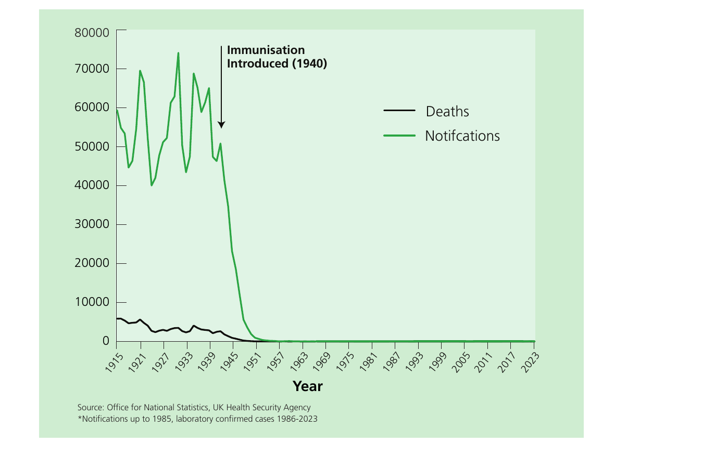

# Diphtheria

NOTIFIABLE

## The disease

Diphtheria is an acute infectious disease affecting the upper respiratory tract, and/or the skin, caused by the action of diphtheria toxin produced by toxigenic _Corynebacterium diphtheriae_, _Corynebacterium ulcerans_ and rarely _Corynebacterium pseudotuberculosis_. The most characteristic features of diphtheria affecting the upper respiratory tract are a membranous pharyngitis (often referred to as a pseudo-membrane) with fever, enlarged anterior cervical lymph nodes and oedema of soft tissue giving a 'bull neck' appearance. The pseudo-membrane may cause respiratory obstruction. Diphtheria toxin affects the myocardium, nervous and adrenal tissues, causing paralysis and cardiac failure. In the UK, the classical disease is now very rare, and clinicians may not recognise it. Milder infections (without toxin production) resemble streptococcal pharyngitis, and the pseudo-membrane may not develop, particularly in vaccinated individuals. Cutaneous diphtheria usually appears on exposed limbs, particularly the legs. The lesions start as vesicles and quickly form small, clearly demarcated and sometimes multiple ulcers that may be difficult to distinguish from impetigo (Maegrath, 1989). The lesions are usually covered with an eschar, a hard bluish-grey membrane, that is slightly raised. Carriers may be asymptomatic.

The incubation period is from two to ten days. Patients with untreated disease may be infectious for up to four weeks, but carriers may potentially transmit the infection for longer. Transmission of the infection is by droplet and through contact with articles (such as clothing or bed linen) soiled by infected persons. In countries where hygiene is poor, cutaneous diphtheria is the predominant clinical manifestation and source of infection.

There is little likelihood of developing natural immunity from sub-clinical infection acquired in the UK. Based on sero-surveillance of residual sera in 2021 approximately 89% of the England population had at least basic diphtheria protection and 50% full protection. The largest proportion susceptible were observed in those 70+ years (26% susceptible) (Vusirikala A _et al._, 2023). High immunisation uptake must be maintained in order to prevent the resurgence of disease which could follow the introduction of cases or carriers of toxigenic strains from overseas.

## History and epidemiology of the disease

Prior to the 1940s, diphtheria was a common disease in the UK. The introduction of immunisation against diphtheria on a national scale during the 1940s resulted in a dramatic fall in the number of notified cases and deaths from the disease. In 1940, more than 61,000 cases with 3,283 deaths were notified in the UK, compared with 38 cases and six deaths in 1957 (see Figure 15.1).

The UK has seen significant changes in diphtheria epidemiology since this time. From the start of laboratory surveillance in 1986 until the end of 2023 there have been 233 toxigenic cases of diphtheria in England & Wales with the annual number of cases varying from one to 87. There have been changes in disease presentation, such as the increase in mild respiratory disease in partially vaccinated individuals and a relative increase in reports of cutaneous cases (Wagner _et al._, 2010) (Gower _et al._, 2020).

An increase in notifications of diphtheria since 1992 was due to a rise in isolations of non-toxigenic strains of _C. diphtheriae_ which do not cause classical diphtheria disease (Reacher _et al._, 2000). These may be associated with a mild sore throat without signs of toxicity.

Until the early 1990s toxigenic infections were more commonly caused by _C. diphtheriae_ than _C. ulcerans_, whereas between the 1990s and 2008, _C. ulcerans_ became the predominant cause, responsible for more than two-thirds of cases. Between 2009 and 2017, whilst the overall incidence remained low, there was a large increase in the proportion of cutaneous cases, particularly caused by _C. diphtheriae_. Around 2014 there was a significant increase in the proportion of referred isolates from wounds and changes to local testing practices in NHS laboratories, both of which may have contributed to this rise (Gower _et al._, 2020).

Toxigenic _C. ulcerans_ infections have historically been linked to the consumption of raw dairy products but more recently have become associated with contact with companion animals. In a review of 62 cases of _C. ulcerans_ between 1986 and 2008, seven of 59 (12%) _C. ulcerans_ cases were recorded as having consumed raw milk or dairy products, one of these had also had contact with cattle (Wagner _et al._, 2010). Since 2003, 68/72 _C. ulcerans_ cases reported contact with companion animals; contact with non-household based companion animals or livestock was also noted for 10 cases and 5 reported a history of consuming unpasteurised dairy products. The evidence on companion animal transmission to humans is limited because of the small number of cases, high exposure prevalence to companion animals in the general population and lack (or timing) of swabbing of animal contacts; however, evidence is slowly accumulating.

Diphtheria cases continue to be reported in South-East Asia, South America, Africa, Oceania and India. A large number of UK citizens travel to and from these regions, maintaining the possibility of the reintroduction of toxigenic _C. diphtheriae_ into the UK. Between 2009 and 2017, 78% of cases were characterised as imported (Gower _et al._, 2020). The first documented transmission of toxigenic _C. diphtheriae_ in the UK for over 30 years occurred in the East of England in 2017, when a contact of a case with cutaneous _C. diphtheriae_ infection that had recently returned from Africa, but who had not travelled themselves, developed a mild respiratory diphtheria infection (Edwards _et al._, 2018).

A small cluster was identified in South Yorkshire in 2017, with all the cases belonging to the same sequence type by multi-locus sequence typing (MLST). Further cases were confirmed in late 2021 in the same geographical region suggesting there may be low level transmission in an under-vaccinated community, although there is no evidence this has been sustained (PHE, 2017) (UKHSA, 2021).

The epidemiology of _C. diphtheriae_ evolved further in 2022 with the detection of 73 toxigenic cases amongst young asylum seekers (AS) arriving in England, linked to a wider outbreak in this population travelling across Europe (O'Boyle _et al._, 2023). Thirteen further confirmed cases were reported in 2023. Where information was available, the majority originated from diphtheria endemic countries, but were likely to have acquired their infection on their extended journey to the UK. The majority presented with cutaneous lesions, although two presented with classical respiratory diphtheria and required anti-toxin treatment; and there was one fatality in an asylum seeking individual who tested positive for _C. diphtheriae_ (ECDC rapid risk assessment, 2022; WHO European Region, 2023).

## The diphtheria vaccination

The vaccine is made from a cell-free purified toxin extracted from a strain of _C. diphtheriae_. This is treated with formaldehyde or glutaraldehyde and then adsorbed onto adjuvants, either aluminium phosphate or aluminium hydroxide, to improve immunogenicity.

Diphtheria vaccines are produced in two strengths according to the diphtheria toxoid content:

- vaccines containing the higher dose of diphtheria toxoid (abbreviated to 'D') contain not less than 30IU
- vaccines containing the lower dose of diphtheria toxoid (abbreviated to 'd') contain approximately 2IU

Vaccines containing the higher dose of diphtheria toxoid (D) are used to achieve satisfactory primary immunisation of children under ten years of age. Vaccines containing the lower dose of diphtheria toxoid (d) should be used for primary immunisation in individuals aged ten years or over, where they provide a satisfactory immune response, and the risk of reactions is minimised. This precautionary advice is particularly pertinent when the early immunisation history and possibility of past exposure are uncertain. Low-dose preparations are also recommended for boosting (see 'Reinforcing immunisation' section, below).

The diphtheria vaccine is only given as part of combined products:

- diphtheria/tetanus/acellular pertussis/inactivated polio vaccine/ Haemophilus influenzae type b/hepatitis B (DTaP/IPV/Hib/HepB)
- diphtheria/tetanus/acellular pertussis/inactivated polio vaccine/ (dTaP/IPV)
- diphtheria/tetanus/inactivated polio vaccine (Td/IPV)
- diphtheria/tetanus/acellular pertussis (Tdap)

It is important that primary vaccination in children is undertaken using a product with higher doses of pertussis, diphtheria and tetanus antigens (Infanrix® Hexa or Vaxelis®) to ensure that adequate priming occurs.

For adults, including pregnant women, a vaccine containing low dose diphtheria and tetanus (ADACEL®, REPEVAX®, Boostrix®-IPV or REVAXIS®) should be used to avoid the higher rate of side effects observed with full dose preparations.

For boosting primed children at the pre-school age, products with lower doses of diphtheria, tetanus and pertussis antigens are used (REPEVAX® or Boostrix®-IPV).

The products used for boosting in older individuals have lower antigen content for diphtheria, tetanus and pertussis antigens than the vaccines given for primary vaccination.

The above vaccines are thiomersal-free. They are inactivated, do not contain live organisms and cannot cause the diseases against which they protect.

Td/IPV vaccine should be used where protection is required against tetanus, diphtheria or polio in order to provide comprehensive long-term protection against all three diseases.

Monovalent diphtheria vaccines are not available in the UK.

### Storage

Vaccines should be stored in the original packaging at +2°C to +8°C and protected from light. All vaccines are sensitive to some extent to heat and cold. Heat speeds up the decline in potency of most vaccines, thus reducing their shelf life. Effectiveness cannot be guaranteed for vaccines unless they have been stored at the correct temperature. Freezing may cause increased reactogenicity and loss of potency for some vaccines. For further information on storage, see Chapter 3.

### Presentation

All vaccines containing diphtheria antigens are available only as part of combined products.

REPEVAX®, Boostrix®-IPV, Vaxelis® or REVAXIS® and ADACEL® are supplied as cloudy white or off-white suspensions in pre-filled syringes. The suspensions may sediment during storage and should be shaken to distribute the suspensions uniformly before administration.

Infanrix-Hexa® supplied as a powder in a vial and a suspension in a pre-filled syringe. The vaccine must be reconstituted by adding the entire contents of the pre-filled syringe (Infanrix hexa® suspension containing DTaP-HBV-IPV) to the vial containing the powder (Hib). The full reconstitution instructions are given in the Summary of Product Characteristics. After reconstitution, the vaccine should be injected immediately.

### Dosage and schedule

The routine childhood immunisation schedule contains six doses of diphtheria-containing vaccine. The priming schedule is three doses, given at four-week intervals. An additional dose is given as part of the hexavalent booster at 18 months of age, which is given to ensure protection against Hib. Two diphtheria booster doses are required from the age of 3 years and 4 months, at appropriate intervals.

- First dose of 0.5ml of a diphtheria-containing vaccine
- Second dose of 0.5ml, four weeks after the first dose
- Third dose of 0.5ml, four weeks after the second dose
- Fourth dose of 0.5ml (Hib-containing hexavalent booster) given at the recommended interval (see below)
- Fifth and sixth doses of 0.5ml should be given at the recommended intervals (see below)

### Administration

Chapter 4 covers guidance on administering vaccines. Most injectable vaccines are routinely given intramuscularly into the deltoid muscle of the upper arm or, for infants 1 year and under, into the anterolateral aspect of the thigh.

Diphtheria containing vaccines can be given at the same time as other vaccines such as MMR, PCV, MenB, MenACWY and hepatitis B. The vaccines should be given at a separate site, preferably in a different limb. If given in the same limb, they should be given at least 2.5cm apart (American Academy of Pediatrics, 2021). The site at which each vaccine was given should be noted in the individual's records.

### Disposal

Chapter 3 outlines storage, distribution and disposal requirements for vaccines. Equipment used for immunisation, including used vials, ampoules, or discharged vaccines in a syringe, should be disposed of safely in an UN-approved puncture-resistant 'sharps' box, according to local authority regulations and guidance in the Health Technical Memorandum 07-01: Safe and sustainable management of healthcare waste.

## Recommendations for the use of the vaccine

The objective of the immunisation programme is to provide a minimum of five doses of a diphtheria-containing vaccine at appropriate intervals for all individuals. For most circumstances, a total of five doses of vaccine at the appropriate intervals are considered to give satisfactory long-term protection.

To fulfil this objective, the appropriate vaccine for each age group is also determined by the need to protect individuals against tetanus, pertussis, Hib and polio.

### Primary immunisation

#### Infants and children under ten years of age

The primary course of diphtheria vaccination consists of three doses of a D-containing product. DTaP/IPV/Hib/HepB is recommended to be given at 8, 12 and 16 weeks of age but can be given at any stage from two months to ten years of age. If the primary course is interrupted it should be resumed but not repeated, allowing an interval of 4 weeks between the remaining doses. An additional dose of Hib-containing multivalent vaccine (DTaP/IPV/Hib/HepB) should be given at 18 months.

#### Children aged ten years or over, and adults

The primary course of diphtheria vaccination consists of three doses of a d-containing product with an interval of 4 weeks between each dose. Td/IPV is recommended for all individuals aged ten years or over. If the primary course is interrupted it should be resumed but not repeated, allowing an interval of one month between the remaining doses.

### Reinforcing immunisation

With the change to the routine childhood immunisation schedule introduced on 1 July 2025, children will receive an additional dose of the hexavalent Hib-containing vaccine at 18 months of age. This DTaP/IPV/Hib/HepB hexavalent booster will be given to replace the dose of Hib/MenC vaccine previously given at 12 months of age, in order to provide a dose of Hib-containing vaccine in the second year of life and maintain Hib control.

This hexavalent DTaP/IPV/Hib/HepB booster should not be considered sufficient to support long-term protection against diphtheria when given routinely under the age of three years 4 months. Two further doses of diphtheria-containing vaccine are still required before adulthood; these are routinely given pre-school (from three years four months of age) and before leaving school (usually around age 13 – 14 years of age). These are termed the first and second diphtheria boosters.

Children should receive their first diphtheria booster combined with tetanus, pertussis and polio (dTaP/IPV) at three years four months of age or soon after.

The second diphtheria booster (dose of Td/IPV) should be given to all individuals ideally ten years after the first diphtheria booster.

#### Delayed or missed vaccinations

If a child who completed their primary immunisations before the age of 1 year presents for their pre-school booster (at three years four months of age or soon thereafter) but missed their hexavalent booster at 18 months of age, the hexavalent, Hib-containing vaccine (DTaP/IPV/Hib/HepB) should be offered as their first diphtheria booster. This is to ensure they receive a Hib booster over 1 year of age. The second diphtheria booster should then be given ideally ten years after the first diphtheria booster.

When primary vaccination has been delayed, this first diphtheria booster dose may be given at the scheduled three years four months visit provided it is one year since the third primary (hexavalent) dose. This will re-establish the child on the routine schedule. dTaP/IPV should be used in this age group (provided at least one dose of hexavalent vaccine was given over one year of age, otherwise hexavalent vaccine should be used). Td/IPV should not be used routinely for this purpose in this age group because it does not provide protection against pertussis.

Individuals aged ten years or over who have only had three doses of a diphtheria-containing vaccine should receive the first diphtheria booster combined with diphtheria and polio vaccines (Td/IPV) ideally five years after their last primary dose.

Where the previous doses have been delayed, the second booster should be given at the school session or scheduled appointment – provided a minimum of five years have elapsed between the first and second boosters. This will be the last scheduled opportunity to ensure long-term protection.

If a person attends for a routine booster dose and has a history of receiving a vaccine following a tetanus-prone wound, attempts should be made to identify which vaccine was given. If the vaccine given at the time of the injury was the same as that due at the current visit and given after an appropriate interval, then the routine booster dose is not required. Otherwise, the dose given at the time of injury should be discounted as it may not provide long-term protection against all antigens, and the scheduled immunisation should be given. Such additional doses are unlikely to produce an unacceptable rate of reactions (Ramsay _et al._, 1997).

### Vaccination of children with unknown or incomplete immunisation status

Where a child born in the UK presents with an uncertain immunisation history, every effort should be made to clarify what immunisations they may have had (see Chapter 11). A child who has not completed the primary course should have the outstanding doses at 4 week intervals. Children may receive the first booster dose as early as one year after the third primary dose to re-establish them on the routine schedule. The second booster should be given at the time of school leaving to ensure long-term protection at this time. Wherever possible, a minimum of five years should be left between the first and second boosters.

Children coming to the UK who have a history of completing immunisation in their country of origin may not have been offered protection against all the antigens currently used in the UK. As diphtheria, tetanus and polio (DTP) containing vaccines are used across the world, it is likely that they will have received diphtheria containing vaccines in their country of origin. Immunisation schedules for specific countries can be found on the WHO website.

Individuals coming from areas of conflict or from population groups who may have been marginalised in their country of origin (e.g. refugees, Gypsy or other nomadic travellers) may not have had good access to immunisation services. In particular, older children and adults may also have been raised during periods before immunisation services were well developed or when vaccine quality was sub-optimal. Where there is no reliable history of previous immunisation, it should be assumed that any undocumented doses are missing and the UK catch-up recommendations for that age should be followed (see Chapter 11). The routine pre-school and subsequent boosters should be given according to the UK schedule.

Further advice on vaccination of children with unknown or incomplete immunisation status is published by UKHSA.

### Travellers and those going to live abroad

All travellers to epidemic or endemic areas should ensure that they are fully immunised according to the UK schedule. Additional doses of vaccines may be required according to the destination and the nature of travel intended, for example for those who are going to live or work with local people in epidemic or endemic areas (see NaTHNaC). Where tetanus, diphtheria or polio protection is required and the final dose of the relevant antigen was received more than ten years ago, Td/IPV should be given.

### Diphtheria vaccination in laboratory and healthcare workers

Individuals who may be exposed to diphtheria in the course of their work, in microbiology laboratories and clinical infectious disease units, are at risk and must be protected (see Chapter 12).

## Contraindications

There are very few individuals who cannot receive diphtheria-containing vaccines. When there is doubt, appropriate advice should be sought from the relevant specialist consultant, the local screening and immunisation team or local Health Protection Team rather than withholding vaccine. The risk to the individual of not being immunised must be taken into account.

The vaccines should not be given to babies who have had either:

- a confirmed anaphylactic reaction to a previous dose of the vaccine
- a confirmed anaphylactic reaction to a component of the vaccine

Specific advice on management of individuals who have had an allergic reaction can be found in Chapter 8 of the Green Book.

## Precautions

Chapter 6 contains information on contraindications and special considerations for vaccination.

Minor illnesses without fever or systemic upset are not valid reasons to postpone immunisation. If an individual is acutely unwell, immunisation may be postponed until they have fully recovered. This is to avoid confusing the differential diagnosis of any acute illness by wrongly attributing any signs or symptoms to the adverse effects of the vaccine.

### Systemic and local reactions following a previous immunisation

Individuals who have had a systemic or local reaction following a previous immunisation with a diphtheria-containing vaccine can continue to receive subsequent doses of diphtheria containing vaccine. This includes the following rare reactions:

- fever, irrespective of its severity
- hypotonic-hyporesponsive episodes (HHE)
- persistent crying or screaming for more than three hours
- severe local reaction, irrespective of extent
- convulsions, with or without fever, within 3 days of vaccination

Chapter 8 covers vaccine safety and the management of adverse events following immunisation.

### Latex allergy

The tip caps of the pre-filled syringes of Tdap (ADACEL®) vaccine contain a natural rubber latex derivative which may cause allergic reactions in latex sensitive individuals.

See Green Book Chapter 6 for more information about individuals with a severe latex allergy.

Pregnant women with a known severe latex allergy should be offered one of the dTaP/IPV vaccines (Boostrix®-IPV or REPEVAX®) as these have a tip cap which does not contain any latex. If the dTaP/IPV vaccine is not available in the maternity services setting, a referral to primary care to receive this vaccine will be necessary.

### Pregnancy and breast-feeding

Diphtheria containing vaccines may be given to pregnant women when the need for protection is required without delay. There is no evidence of risk from vaccinating pregnant women or those who are breast-feeding with inactivated viral or bacterial vaccines or toxoids (Plotkin _et al._, 2018).

Since October 2012, diphtheria containing vaccines have been given as part of the maternal pertussis programme. The Medicines and Healthcare products Regulatory Agency (MHRA) has used the Yellow Card Scheme and the Clinical Practice Research Datalink to follow pregnancy outcomes following vaccination. The study based on a cohort of 18,000 vaccinated pregnant women found no evidence of an increased risk of stillbirth and no evidence of an increased risk of any of an extensive list of maternal, foetal and neonatal adverse outcomes in vaccinated mothers (Donegan _et al._, 2014). Safety studies from other countries (mostly in Europe and North America), together including more than 150,000 vaccinated pregnancies, found similar risks of safety outcomes (maternal, foetal and infant) in vaccinated and unvaccinated pregnancies (Campbell _et al._, 2018).

### Premature infants

It is important that premature infants have their immunisations at the appropriate chronological age, according to the schedule. The occurrence of apnoea following vaccination is especially increased in infants who were born very prematurely.

Very premature infants (born ≤ 28 weeks of gestation) who are in hospital should have respiratory monitoring for 48-72 hours when given their first immunisation, particularly those with a previous history of respiratory immaturity. If the premature infant has apnoea, bradycardia or desaturations after the first immunisation, the second immunisation should also be given in hospital with respiratory monitoring for 48-72 hours (Pfister _et al._, 2004; Ohlsson _et al._, 2004; Schulzke _et al._, 2005; Pourcyrous _et al._, 2007; Klein _et al._, 2008).

As the benefit of vaccination is high in this group of infants, vaccination should not be withheld or delayed.

### Immunosuppression and HIV infection

Individuals with immunosuppression or with HIV infection (regardless of CD4 counts) should be considered for diphtheria-containing vaccines in accordance with the routine recommended schedule. These individuals may not develop a full antibody response. Re-immunisation should be considered after treatment is finished and recovery has occurred. Specialist advice may be required.

Further guidance is provided in Chapter 7 of the Green Book and by the British HIV Association (BHIVA) Guidelines on the use of vaccines in HIV-positive adults (BHIVA, 2015) and the Children's HIV Association of UK and Ireland (CHIVA) Guidelines on Vaccination of Children Living with HIV (CHIVA, 2022).

### Neurological conditions

#### Pre-existing neurological conditions

Chapter 6 covers vaccination contraindications and special considerations.

The presence of a neurological condition is not a contraindication to immunisation but in a child with evidence of current neurological deterioration, deferral of vaccination may be considered, to avoid incorrect attribution of any change in the underlying condition. The risk of such deferral should be balanced against the risk of the preventable infection, and vaccination should be promptly given once the diagnosis and/or the expected course of the condition becomes clear.

#### Deferral of immunisation

There will be very few occasions when deferral of immunisation is required (see above). Deferral leaves the child unprotected and so the period of deferral should be minimized, with immunisation commencing as soon as possible. If a specialist recommends deferral, this should be clearly communicated to the individual's primary care provider and he or she must be informed as soon as the child is fit for immunisation.

## Adverse reactions

Chapter 8 covers vaccine safety and the management of adverse events following immunisation.

Pain, swelling or redness at the injection site are common and may occur more frequently following subsequent doses. A small, painless nodule may form at the injection site; this usually disappears and is of no consequence. The incidence of local reactions is lower where diphtheria components are combined with acellular rather than with whole-cell pertussis components and are similar to that after DT vaccination (Miller, 1999; Tozzi and Olin, 1997).

Fever, convulsions, high-pitched screaming and episodes of pallor, cyanosis and limpness (hypertonic-hyporesponsive episodes or HHE) can occur following vaccination with tetanus-containing vaccines. Though not a contraindication to vaccination, individuals with a history of febrile convulsions should be closely monitored as further adverse events may occur within 2 to 3 days post vaccination.

Confirmed anaphylaxis occurs extremely rarely, occurring at less than 1 per million doses for vaccines in the UK.

Other systemic adverse events such as anorexia, diarrhoea, fatigue, headache, nausea and rash may occur more commonly and are not contraindications to further immunisation. Co-administration of the infant hexavalent vaccine with pneumococcal conjugate vaccine or MMR increases febrile reactions/ convulsions (relative incidence ratio of ≤1) (Bauwens _et al._, 2022).

Anyone can report a suspected adverse reaction to the Medical and Healthcare products Regulatory Agency (MHRA) using the Yellow Card reporting scheme (https://yellowcard.mhra.gov.uk/). All suspected adverse reactions to vaccines occurring in children, or in individuals of any age after vaccines labelled with a black triangle (▼), should be reported to the MHRA using the Yellow Card scheme. Serious suspected adverse reactions to vaccines in adults should also be reported through the Yellow Card scheme.

## Management of cases, contacts, carriers and outbreaks

As diphtheria is a notifiable disease in the UK, all suspected cases should be notified to the local Health Protection Team (HPT) immediately. The HPT will support with the public health management of cases, their contacts, and suspected outbreaks.

### Management of cases

The management of cases of diphtheria is detailed in the national guidance: Diphtheria: public health control and management in England - GOV.UK (https://www.gov.uk).

Diphtheria antitoxin is only used in suspected cases of diphtheria in a hospital setting. Tests to exclude hypersensitivity to horse serum should be carried out, as described in the Summary of Product Characteristics. Where considered clinically indicated, diphtheria antitoxin should be given without waiting for bacteriological confirmation. It should be given according to the manufacturer's instructions, the dosage depending on the clinical condition of the patient.

Clinicians considering the use of antitoxin should contact the UKHSA Colindale duty doctor in and out of hours to discuss this on 0208 200 4400.

More information may be found at:

Diphtheria anti-toxin (DAT): information for healthcare professionals - GOV.UK

Diphtheria anti-toxin: clinical guidance (issued May 2022) - GOV.UK

Diphtheria antitoxin is based on horse serum and therefore severe, immediate anaphylaxis occurs more commonly than with human immunoglobulin products. However, the occurrence of this remains rare in England. If anaphylaxis occurs, adrenaline (0.5ml or 1ml aliquots) should be administered immediately by either intramuscular (0.5ml of 1:1000 solution) or intravenous (1ml of 1:10,000 solution) injection. This advice differs from that for treatment of anaphylaxis after immunisation because the antitoxin is being administered in the hospital setting.

In most cutaneous infections, large-scale toxin absorption is unlikely and therefore the risk of giving antitoxin is usually considered substantially greater than any benefit. Nevertheless, if the ulcer in cutaneous diphtheria infection were sufficiently large (i.e. more than 2cm²) and especially if it were membranous, then consideration of antitoxin would be justified.

Antibiotic treatment is needed to eliminate the organism and to prevent spread. The antibiotics of choice as described in: Diphtheria: public health control and management in England - GOV.UK (https://www.gov.uk). Susceptibility testing should guide treatment where antibiotic resistance is suspected. More information may be found at: Diphtheria asylum seeker supplementary guidance (publishing.service.gov.uk).

The immunisation history of cases of toxigenic diphtheria should be established. Partially or unimmunised individuals should complete immunisation according to the UK schedule. Completely immunised individuals should receive a single reinforcing dose of a diphtheria-containing vaccine according to their age.

### Management of contacts

The public health management of cases and contacts of diphtheria infection are detailed in national guidance, which was supplemented in 2022 with guidance to support management of cases in the AS population. Both sets of guidance may be found at: (Diphtheria: public health control and management in England - GOV.UK (https://www.gov.uk)).

The immunisation history of all individuals exposed to toxigenic diphtheria should be established. Partially immunised or unimmunised individuals should complete immunisation according to the UK schedule (see above). Completely immunised individuals should receive a single reinforcing dose of a diphtheria-containing vaccine according to their age, if a dose has not been given in the last 12 months.

## Supplies

### Vaccines

Some or all of the following vaccines containing diphtheria toxoid will be available at any one time:

- REPEVAX®, diphtheria/tetanus/5-component acellular pertussis/ inactivated polio vaccine (dTaP/IPV) – manufactured by Sanofi.
- Boostrix®-IPV, diphtheria/tetanus/3-component acellular pertussis/inactivated polio vaccine (dTaP/IPV) – manufactured by GSK.
- Infanrix®-IPV+Hib, diphtheria/tetanus/3-component acellular pertussis/ inactivated polio vaccine/Haemophilus influenzae type b (DTaP/IPV/Hib) – manufactured by GSK.
- Infanrix®-Hexa, diphtheria/tetanus/3-component acellular pertussis/inactivated polio vaccine/Haemophilus influenzae type b/ hepatitis B (DTaP/IPV/Hib/HepB) – manufactured by GSK.
- Vaxelis® diphtheria/tetanus/5-component acellular pertussis/inactivated polio vaccine/ Haemophilus influenzae type b/ hepatitis B (DTaP/IPV/Hib/HepB) – manufactured by Sanofi.
- ADACEL®, diphtheria/tetanus/5-component acellular pertussis (TdaP) – manufactured by Sanofi.
- REVAXIS® diphtheria /tetanus/inactivated polio vaccine (Td/IPV) manufactured by Sanofi.

Diphtheria containing vaccines are available in England, Wales and Scotland from ImmForm Tel: 020 7183 8580. Website: https://portal.immform.ukhsa.gov.uk.

In Northern Ireland, supplies should be obtained from local childhood vaccine holding centres. Details of these are available from the Regional Pharmaceutical Procurement Service (Tel: 028 9442 4089).

Diphtheria antitoxin is supplied by the Butantan Institute, in 10ml vials containing 10,000IU. It is distributed in the UK by the UKHSA, Immunisation Department (Tel: 020 8200 6868).

## References

- American Academy of Pediatrics (2021) Active immunization. In: Kimberlin DW, Barnett ED, Lynfield R, Sawyer MH, eds. _Red Book: 2021 Report of the Committee on Infectious Diseases_. 32nd edition. Itasca, IL: American Academy of Pediatrics, p. 28.
- Bauwens, J., de Lusignan, S., Weldesselassie, YG, _et al._ Safety of routine childhood vaccine coadministration versus separate vaccination. _BMJ Global Health_ 2022;7: e008215. doi:10.1136/bmjgh-2021-008215
- British HIV Association (2015) Immunisation guidelines for HIV-infected adults. Available from: https://www.bhiva.org/vaccination-guidelines.
- Campbell, H., Gupta, S., Dolan, G.P., Kapadia, S.J, Kumar Singh, A., Andrews, N., Amirthalingam, G (2018). Review of vaccination in pregnancy to prevent pertussis in early infancy. _J Med Microbiol_. 2018 Oct;67(10):1426-1456. doi: 10.1099/jmm.0.000829. PMID: 30222536.
- Children's HIV Association (CHIVA) Immunisation guidelines. Available from: https://www.chiva.org.uk/infoprofessionals/guidelines/immunisation/
- Donegan K, King B, Bryan P. (2014) Safety of pertussis vaccination in pregnant women in UK: observational study. _BMJ_ ;349: g4219. doi: 10.1136/bmj. g4219. PMID: 25015137; PMCID: PMC4094143.
- European Centre for Disease Prevention and Control. Increase of reported diphtheria cases due to _Corynebacterium diphtheriae_ among migrants in Europe – 6 October 2022. ECDC: Stockholm; 2022.
- Edwards, D., Kent, D., Lester, C., Brown, C. S., Murphy, M. E., Brown, N. M. _et al._ (2018) Transmission of toxigenic corynebacterium diphtheriae by a fully immunised resident returning from a visit to West Africa, United Kingdom, 2017. _Eurosurveillance_, 23(29). Available from: https://pubmed.ncbi.nlm.nih.gov/30280689/.
- Gower, C. M., Scobie, A., Fry, N. K., Litt, D. J., Cameron, J. C., Chand, M. A. _et al._ (2020) The changing epidemiology of diphtheria in the United Kingdom, 2009 to 2017. _Eurosurveillance_, 25(11), 1900462. Available from: https://www.eurosurveillance.org/content/10.2807/1560-7917.ES.2020.25.11.1900462.
- Klein, N. P., Massolo, M. L., Greene, J. _et al._ (2008) Risk factors for developing apnea after immunization in the neonatal intensive care unit. _Pediatrics_, 121(3), pp. 463–9.
- Maegrath, B. (1989) Skin Conditions. In: _Clinical Tropical Diseases_, 9th edition. Oxford: Blackwell Scientific Publications.
- Miller, E. (1999) Overview of recent clinical trials of acellular pertussis vaccines. _Biologicals_, 27, pp. 79–86.
- NHS England (2023) Health Technical Memorandum 07-01: Safe and sustainable management of healthcare waste https://www.england.nhs.uk/wp-content/uploads/2021/05/B2159iii-health-technical-memorandum-07-01.pdf
- O'Boyle S, Barton HE, D'Aeth JC, Cordery R, Fry NK, Litt D, _et al._ (2023) National public health response to an outbreak of toxigenic _Corynebacterium diphtheriae_ among asylum seekers in England, 2022: a descriptive epidemiological study. _Lancet Public Health_. 2023 Oct;8(10): e766-e775. doi: 10.1016/S2468-2667(23)00175-5. PMID: 37777286.
- Ohlsson, A. and Lacy, J. B. (2004) Intravenous immunoglobulin for preventing infection in preterm and/or low-birth-weight infants. _Cochrane Database Syst Rev_, (1), CD000361.
- Pfister, R. E., Aeschbach, V., Niksic-Stuber, V. _et al._ (2004) Safety of DTaP-based combined immunization in very-low-birth-weight premature infants: frequent but mostly benign cardiorespiratory events. _J Pediatr_, 145(1), pp. 58–66.
- PHE (2017) Diphtheria in England: 2017 https://webarchive.nationalarchives.gov.uk/ukgwa/20220517193929/https:/www.gov.uk/government/publications/diphtheria-in-england-and-wales-annual-reports
- Plotkin, S. A. and Orenstein, W. A. (eds) (2004) _Vaccines_, 4th edition. Philadelphia: WB Saunders Company, Chapter 8.
- Pourcyrous, M., Korones, S. B., Arheart, K. L. _et al._ (2007) Primary immunization of premature infants with gestational age <35 weeks: cardiorespiratory complications and C-reactive protein responses associated with administration of single and multiple separate vaccines simultaneously. _J Pediatr_, 151(2), pp. 167–72.
- Ramsay, M., Begg, N., Holland, B. and Dalphinis, J. (1994) Pertussis immunisation in children with a family or personal history of convulsions: a review of children referred for specialist advice. _Health Trends_, 26, pp. 23–4.
- Ramsay, M., Joce, R. and Whalley, J. (1997) Adverse events after school leavers received combined tetanus and low-dose diphtheria vaccine. _CDR Review_, 5, pp. R65–7.
- Reacher, M., Ramsay, M., White, J. _et al._ (2000) Nontoxigenic _Corynebacterium diphtheriae_: an emerging pathogen in England and Wales? _Emerg Infect Diseases_, 6, pp. 640–5.
- Schulzke, S., Heininger, U., Lucking-Famira, M. _et al._ (2005) Apnoea and bradycardia in pre-term infants following immunisation with pentavalent or hexavalent vaccines. _Eur J Pediatr_, 164(7), pp. 432–5.
- Tozzi, A. E. and Olin, P. (1997) Common side effects in the Italian and Stockholm 1 Trials. _Dev Biol Stand_, 89, pp. 105–8.
- UKHSA (2021) Diphtheria in England: 2021 https://www.gov.uk/government/publications/diphtheria-in-england-and-wales-annual-reports/diphtheria-in-england-2021
- Vusirikala, A., Tonge, S., Bell, A., Linley, E., Borrow, R., O'Boyle, S. _et al._ (2023) Reassurance of population immunity to diphtheria in England: Results from a 2021 national serosurvey. _Vaccine_, 41(46), pp. 6878–6883.
- Wagner, K. S., White, J. M., Crowcroft, N. S., De Martin, S., Mann, G. and Efstratiou, A. (2010) Diphtheria in the United Kingdom, 1986-2008: The increasing role of _Corynebacterium ulcerans_. _Epidemiol Infect_, 138, pp. 1519–30.
- WHO European Region (2023) Vaccine-preventable disease update: reported diphtheria cases in the WHO European Region, 2022 WHO-EURO-2023-6208-45973-68002-eng.pdf
