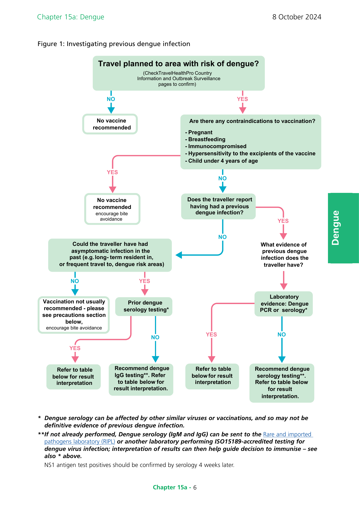

# Dengue

## The disease

Dengue is an acute febrile illness caused by the dengue virus, spread by the bite of an infected _Aedes_ mosquito. Most cases are mild or asymptomatic, but severe, life-threatening disease can occur. It is endemic in more than 100 countries in Africa, the Americas, Eastern Mediterranean, South-east Asia, and Western Pacific region, with sporadic cases occurring in some European countries. The number of dengue cases has been markedly increasing in the past few decades, and large outbreaks have been reported.

The dengue virus (DENV) is member of the Flaviviridae family and has four serotypes: DEN-1, 2, 3 and 4. It is found in tropical and sub-tropical climates, mostly in urban and semi-urban areas. It is spread predominantly by _Aedes aegypti_ and _Aedes albopictus_ mosquitoes, which are active during the day, and breed in human-made objects that contain water. There are rare cases of transmission from blood transfusion, organ transplantation and needle-stick injuries. Infection with one serotype provides long-term immunity against that specific serotype, but only short-term protection against the other serotypes.

The average incubation period is 4-7 days (range 3-14). Up to 80% of dengue infections are asymptomatic. Common symptoms include sudden onset high fever, headache and pain behind the eyes, myalgia, arthralgia, nausea/vomiting and rash. Most illness is mild, but less than 5% can be severe, with a small proportion of these fatal.

Severe dengue is due to an increase in vascular permeability that can lead to life-threatening hypovolaemic shock. It is more common in children, adolescents, and pregnant women. An increased risk has also been described in older individuals and those with comorbidities including asthma, diabetes, obesity, hypertension, renal disease, bleeding disorders, and in those taking anticoagulants. The risk for severe dengue is greater during a second dengue infection in those who are then infected with a dengue virus of a different serotype. It can however also occur during the first, third, or fourth infection. Severe dengue is rare in travellers (Wilder-Smith, 2013).

There is no specific treatment for dengue. Non-steroidal anti-inflammatories, such as aspirin and ibuprofen, should be avoided as they can increase the risk of bleeding. Severe dengue requires prompt recognition and often hospitalisation, where treatment is supportive with judicious fluid resuscitation.

Prevention includes protection from mosquito bites, immunisation, and vector-control programmes. There is no risk of transmission in the UK from imported cases as the mosquito vector does not occur in the UK.

## History and epidemiology of the disease

The dengue virus was first isolated by Hotta and Kimura in 1943 (Hotta, 1952) but its initial appearance in human populations is uncertain due to the nature of the disease - often asymptomatic, and similar in presentation to other viral febrile illnesses. There is a general consensus however that by the late 18th century a disease that could be consistent with dengue was causing episodic epidemics in Asia and the Americas, and that by the late 19th and early 20th centuries the virus was likely widespread in tropical and subtropical climates (Holmes and Twiddy, 2003).

Half of the world's population is now at risk of dengue, with an estimated 100-400 million infections occurring annually, and Asia representing approximately 70% of the global disease burden (WHO, 2023). Many temperate regions are increasingly at risk of dengue epidemics, as increasing global temperatures aid the wider geographic distribution of _Aedes_ mosquitoes. Dengue is spreading to new areas including Europe, where, although not endemic, since 2010 local transmission has been reported in Croatia, France, Italy, and Spain (ECDC, 2024). Cases are reported when viraemic travel-related cases return from endemic areas to areas with suitable environmental conditions and competent vectors. A major outbreak was reported in 2012 in Madeira, Portugal. In 2023, France reported 43 locally acquired cases and Italy reported 82 locally acquired cases.

## The dengue vaccination

Qdenga® is a tetravalent live attenuated vaccine. It is produced in Vero cells by recombinant DNA technology and contains serotype-specific surface protein genes of the four dengue serotypes, engineered into a dengue type 2 backbone.

_Note: Another dengue vaccine Dengvaxia is available in some countries. It is not available in the UK. No interchangeability data are available, and travellers should not complete their Qdenga® vaccine course with Dengvaxia, and vice versa._

### Storage

Vaccines should be stored in the original packaging at +2°C to +8°C and protected from light. All vaccines are sensitive to some extent to heat and cold. Heat speeds up the decline in potency of most vaccines, thus reducing their shelf life. Effectiveness cannot be guaranteed for vaccines unless they have been stored at the correct temperature. Freezing may cause increased reactogenicity and loss of potency for some vaccines. It can also cause hairline cracks in the container, leading to contamination of the contents.

### Presentation

Qdenga® is available as a powder for reconstitution with a solvent for solution for injection.

Prior to reconstitution, the vaccine is a white to off-white coloured freeze-dried powder (compact cake). The solvent is a clear, colourless solution.

### Dosage and schedule

Qdenga® should be administered as a 0.5 mL dose at a two-dose (0 and 3 months) schedule.

The need for a booster dose has not been established.

### Administration

After complete reconstitution of the lyophilised vaccine with the solvent, Qdenga® should be administered by subcutaneous injection preferably in the upper arm in the region of deltoid.

Qdenga® must not be injected intravascularly, intradermally or intramuscularly.

Available evidence supports co-administration of Qdenga® with yellow fever and hepatitis A vaccines (WHO SAGE, 2023; Tricou _et al_, 2023). Qdenga® can be co-administered with inactivated, sub-unit or mRNA vaccines. The vaccines should be given at separate sites, preferably in a different limb. If given in the same limb, they should be given at least 2.5cm apart (American Academy of Pediatrics, 2003). The site at which each vaccine was given should be noted in the patient's records. There are currently no data available on co-administration with other live vaccines such as MMR.

### Disposal

Equipment used for vaccination, including used vials, ampoules, or partially discharged vaccines should be disposed of at the end of a session by sealing in a proper, puncture resistant 'sharps' box according to local authority regulations and guidance in Health Technical Memorandum 07-01: Safe management of healthcare waste (NHS England, 2023).

## Recommendations for use of the vaccine

The objective of the immunisation programme in the UK is primarily to provide those who are at risk of dengue, and have already experienced dengue infection in the past, with protection from a secondary (and potentially more severe) infection. Individuals who are infected for the second time are at greater risk of severe dengue (WHO, 2023).

In the trial setting, two doses of the Qdenga® vaccine, administered three months apart to individuals with evidence of previous dengue infection (blood specimens obtained before vaccination detecting dengue-neutralizing antibodies), were demonstrated to have 86% vaccine efficacy against hospitalised dengue and 65% efficacy against virologically confirmed dengue (Rivera _et al._, 2021). The vaccine was not tested in children under 4 years of age and protection against disease was lower in four and five year olds than in older children and adults.

The Qdenga® vaccine is not recommended for seronegative individuals (i.e. those with no evidence of previous dengue infection, see section on Determining previous dengue infection). The trial data are currently insufficient to make a recommendation for these individuals. JCVI has taken a precautionary approach to its advice for UK travellers, because of a theoretical risk of severe dengue if a seronegative individual is vaccinated and subsequently exposed to dengue virus DENV3 or DENV4.

Following dengue infection, there is short lived cross protection against all serotypes, for this reason, consideration should be given to delaying administration of a Qdenga® vaccination for a period of one year after a laboratory confirmed infection (see precautions).

### Primary immunisation

**Vaccination can be considered for:**

Individuals aged 4 years of age and older with likely history of previous dengue infection (see following sections) in the past and are:

- planning to travel to areas where there is a risk of dengue infection or areas with an ongoing outbreak of dengue, or
- are exposed to dengue virus through their work, such as laboratory staff working with the virus

### Reinforcing immunisation

There are currently no data on the need for or timing of a reinforcing (i.e. third) dose. This guidance will be updated when further data are available.

### Risk assessment for travel

Dengue is a viral infection transmitted by mosquitoes which predominately feed during daylight hours. All travellers to risk areas should take steps to avoid mosquito bites. Previous infection with dengue increases the risk of the individual developing severe dengue.

The chance of contracting dengue during international travel is determined by several factors, including destination, length of exposure, intensity of transmission and season of travel (Wilder-Smith, 2012). Travellers who spend long periods in endemic areas (such as expatriates or aid workers) are at increased risk. However, even short-term visitors may be exposed (Massad _et al._, 2013).

In the UK, the Qdenga® vaccine is currently recommended only for those with previous dengue infection.

### Determining previous infection

Any decision to vaccinate should depend on obtaining a reliable history of Dengue infection. Clinicians will need to obtain as many details as possible, including previous travel, illness and vaccination history, and consider any laboratory testing information to make this assessment (figure 1 and table 1).

In the absence of a reliable history of confirmed dengue infection, epidemiological factors, such as being raised in an endemic area may also be considered to support a decision to test and/or offer vaccine (figure 1, table 1).

**Where there is any uncertainty about the previous history the potential risk of vaccination should be clearly explained.**

**Laboratory diagnosis of acute infection**

Previous dengue infection can only be reliably confirmed if the traveller was tested at the time of illness (usually by a PCR or antigen test). Travellers may have the results from PCR or antigen tests available or be able to provide a reliable history of confirmed infection.

During the early stages of illness dengue virus RNA may be detectable by PCR in the blood (usually for the first 7 days) or the urine (for up to 21 days) after symptom onset. Dengue virus PCR testing is highly specific and therefore a history of the detection of dengue virus RNA in any sample at any point is diagnostic of previous dengue virus infection.

In contrast, dengue virus serology is more complicated to interpret given the cross-reactivity of other flavivirus infections and vaccinations (Zika, tick-borne encephalitis, yellow fever etc). The typical pattern of immune response to primary dengue virus infection is the appearance of IgM from around 3-5 days of illness which persists for 2-3 months. IgG appears at around 2 weeks and persists for years. In secondary dengue there is usually an increase in dengue IgG irrespective of serogroup discordance from previous infection whereas the IgM response is often not detectable.

**Serological diagnosis of past infection**

Blood tests for past infection in those who were not tested at the time of illness are available and may show evidence of previous dengue infection, but the results may not be conclusive and can be affected by infection with other, similar viruses, or by vaccination against other diseases (such as yellow fever, Japanese encephalitis or tick-borne encephalitis).

In individuals that are only IgG positive, it is imperative that the decision to vaccinate includes an assessment of all potential causes of the positive IgG result. As above, these include:

- likelihood of prior exposure to dengue virus, including travel and clinical details
- vaccination against other flaviviruses (yellow fever, Japanese encephalitis and tick-borne encephalitis), which can cause false positive IgG results
- exposure to other flaviviruses, such as West Nile virus and Zika virus, which can cause false positive IgG results

Vaccination should only be recommended if the most likely explanation for dengue IgG is past infection with dengue. This may be influenced by likelihood of prior exposure to dengue virus, for example, in patients with a history of prolonged residence in a highly dengue endemic setting, who have a high likelihood of past asymptomatic infection.

\* _Dengue serology can be affected by other similar viruses or vaccinations, and so may not be definitive evidence of previous dengue infection._

\*\* _If not already performed, Dengue serology (IgM and IgG) can be sent to the [Rare and imported pathogens laboratory (RIPL)](https://www.gov.uk/guidance/rare-and-imported-pathogens-laboratory) or another laboratory performing ISO15189-accredited testing for dengue virus infection; interpretation of results can then help guide decision to immunise -- see also \* above._

NS1 antigen test positives should be confirmed by serology 4 weeks later.

**Testing for prior infection**

Table 1: Consideration of eligibility for vaccination

|                                                                                                 | No compatible travel, no compatible illness | Compatible illness, no compatible travel | Compatible travel, no compatible illness                  | Compatible travel, compatible illness                     |
| ----------------------------------------------------------------------------------------------- | ------------------------------------------- | ---------------------------------------- | --------------------------------------------------------- | --------------------------------------------------------- |
| **IgM negative, IgG negative on any blood sample taken ≥4 weeks after last compatible illness** | No recommendation for vaccination           | No recommendation for vaccination        | No recommendation for vaccination                         | No recommendation for vaccination                         |
| **IgM positive, IgG and PCR negative on any blood sample taken <4 weeks after travel**          | No recommendation for vaccination           | No recommendation for vaccination        | Test for IgG >4 weeks after leaving endemic area          | Test for IgG >4 weeks after compatible illness            |
| **IgM negative, IgG positive on any blood sample taken >4 weeks after travel or illness**       | No recommendation for vaccination           | No recommendation for vaccination        | Consider vaccination\* in light of other reasons for IgG† | Consider vaccination\* in light of other reasons for IgG† |
| **IgM and IgG positive on any blood sample taken >4 weeks and <6 months after travel**          | No recommendation for vaccination           | No recommendation for vaccination        | Consider vaccination                                      | Consider vaccination                                      |
| **PCR positive on any sample**                                                                  | This should be discussed with RIPL          | This should be discussed with RIPL       | Consider vaccination                                      | Consider vaccination                                      |

**Definition of compatible illness**: an acute illness consisting of fever of 2-7 days duration with 2 or more of the following: headache, retro-orbital pain, myalgia, arthralgia, rash, thrombocytopenia, leucopenia

**Definition of compatible travel**: travel to an area at any time of year where there are year-round endemic infections or travel during the dengue season to countries or regions where there is seasonal detection of dengue. Refer to https://travelhealthpro.org.uk/countries

† Other potential causes of positive dengue IgG include vaccination against other flaviviruses (yellow fever, Japanese encephalitis and tick-borne encephalitis), and exposure to other flaviviruses such as West Nile virus and Zika virus.

\* Strength of recommendation may be influenced by likelihood of prior exposure to dengue virus, and therefore risk of prior asymptomatic illness. For example, the probability that a positive dengue IgG represents prior dengue infection will be higher for patients with a history of prolonged residence in a highly dengue endemic setting than for those with shorter durations of exposure.

## Contraindications

Qdenga® vaccine should not be given to:

- children under four years of age
- pregnant women
- breastfeeding women
- those with primary or acquired immunodeficiency due to a congenital condition or disease process including symptomatic HIV infection, and asymptomatic HIV infection when accompanied by evidence of impaired immune function
- those who are immunosuppressed as a result of treatment, including high dose systemic steroids, immunosuppressive biological therapy, radiotherapy or cytotoxic drugs (see chapter 6)
- those who have had a confirmed anaphylaxis reaction to a previous dose of the vaccine
- those who have a confirmed anaphylaxis reaction to any of the components of the vaccine

## Precautions

Vaccination with Qdenga® should be postponed in subjects suffering from an acute severe febrile illness. Minor illnesses without fever or systemic upset are not valid reasons to postpone immunisation.

Women of childbearing potential should avoid pregnancy for at least one month following vaccination.

Following dengue infection, there is short lived cross protection against all serotypes, for this reason, consideration should be given to delaying administration of a Qdenga® vaccination for a period of one year after a laboratory confirmed infection.

Exceptionally, vaccination with Qdenga® can be considered in those who have not had dengue in the past. In these situations, specialist advice should be considered.

## Adverse Reactions

In clinical studies, the most frequently reported reactions were injection site pain, headache, myalgia, injection site erythema, malaise, asthenia and fever.

These adverse reactions usually occurred within 2 days after the injection, were mild to moderate in severity, had a short duration (1 to 3 days) and were less frequent after the second injection of Qdenga® than after the first injection.

Newly licensed vaccine products are subject to enhanced surveillance and are given 'black triangle' status (indicated by an inverted triangle on the product information). For such products, all serious and non-serious suspected adverse drug reactions (ADRs) should be reported, for both adults and children.

Qdenga® will be intensively monitored by the Medicines and Healthcare products Regulatory Agency (MHRA). ALL suspected adverse reactions to Qdenga® should be reported on the [yellow card scheme](https://yellowcard.mhra.gov.uk/) and to the manufacturers [Takeda UK Ltd](https://www.takeda.com/en-gb/), email AE.GBR-IRL@takeda.com.

## Management of cases

Acute samples from suspected cases of severe dengue should be sent to the Rare and Imported Pathogens Laboratory, UK Health Security Agency (UKHSA), for investigation.

Previous dengue vaccination history should be obtained for all cases of severe dengue. Healthcare professionals who become aware of a case of suspected severe dengue following vaccination should liaise with their regional Infectious Disease team for clinical advice as soon as possible and report the case in line with serious adverse incident guidance.

No specific therapy is available for dengue. Non-steroidal anti-inflammatories, such as aspirin and ibuprofen, should be avoided as they can increase the risk of bleeding. Severe dengue requires prompt recognition and often hospitalisation, where treatment is supportive with judicious fluid resuscitation. Diagnostic testing is available through the Rare and Imported Pathogens Laboratory, UK Health Security Agency (UKHSA).

## Supplies

Qdenga® is available from Takeda UK Ltd, https://www.takeda.com/en-gb/, 0333 3000 181.

## References

European Centre for Disease Prevention and Control (2024). Autochthonous vectorial transmission of dengue virus in mainland EU/EEA, 2010-present. Updated January 2024. Available at: https://www.ecdc.europa.eu/en/all-topics-z/dengue/surveillance-and-disease-data/autochthonous-transmission-dengue-virus-eueea (Accessed 20 February 2024).

Holmes EC. And. Twiddy SS. (2003) The origin, emergence and evolutionary genetics of dengue virus. _Infect Genet Evol_. May;3(1):19-28.

Hotta S. (1952) Experimental Studies on Dengue: I. Isolation, Identification and Modification of the Virus. _The Journal of Infectious Diseases_. January; 90(1): 1--9.

Massad E, Rocklov J. and Wilder-Smith A. (2013) Dengue infections in non-immune travellers to Thailand. _Epidemiology and Infection_. 141(2):412-417.

NHS England (2023) Health Technical Memorandum 07-01: Safe and sustainable management of healthcare waste. Available at: https://www.england.nhs.uk/publication/management-and-disposal-of-healthcare-waste-htm-07-01/ (Accessed: February 2024).

Rivera L. _et al_. (2022), Three-year Efficacy and Safety of Takeda's Dengue Vaccine Candidate (TAK-003). _Clin Infect Dis_. 24;75(1):107-117. Available at: https://pubmed.ncbi.nlm.nih.gov/34606595/.

Tricou V, Essink B, Ervin JE, Turner M, Escudero I, Rauscher M, _et al_. (2023) Immunogenicity and safety of concomitant and sequential administration of yellow fever YF-17D vaccine and tetravalent dengue vaccine candidate TAK-003: A phase 3 randomized, controlled trial. _PLoS Negl Trop Dis_ 17(3): e0011124. https://doi.org/10.1371/journal.pntd.0011124

Wilder-Smith A. (2012) Dengue infections in travellers. _Paediatr Int Child Health_. May; 32 Suppl 1(s1):28-32. Available at: https://www.tandfonline.com/doi/full/10.1179/2046904712Z.00000000050.

World Health Organization (2023) Dengue and Severe Dengue. Factsheet, Updated 17 March 2023, Available at: https://www.who.int/news-room/fact-sheets/detail/dengue-and-severe-dengue (Accessed February 2024).

World Health Organization (2023) Strategic Advisory Group of Experts on Immunization (SAGE) -- September 2023. Available at https://www.who.int/news-room/events/detail/2023/09/25/default-calendar/sage_meeting_september_2023 (Accessed March 2024).
