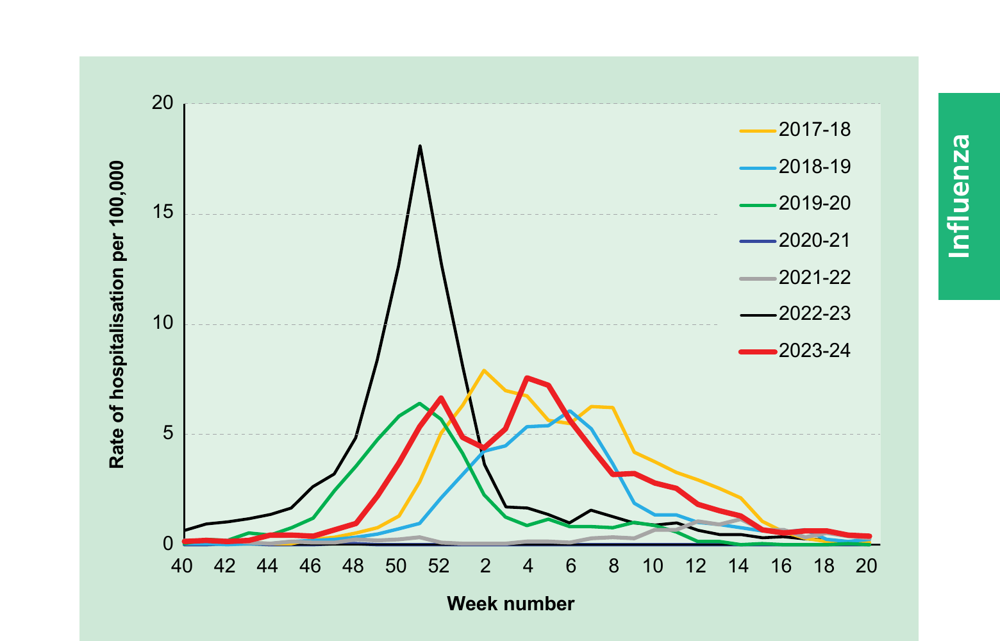

# Influenza

## The disease

Influenza is an acute viral infection of the respiratory tract. There are 3 types of influenza virus: A, B and C. Influenza A and influenza B are responsible for most clinical illness. Influenza is highly infectious with a usual incubation period of 1 to 3 days.

The disease is characterised by the sudden onset of fever, chills, headache, myalgia and extreme fatigue. Other common symptoms include a dry cough, sore throat and stuffy nose. For otherwise healthy individuals, influenza is an unpleasant but usually self-limiting disease with recovery usually within 2 to 7 days. The illness may be complicated by (and may present as) bronchitis, secondary bacterial pneumonia or, in children, otitis media. Influenza can be complicated more unusually by meningitis, encephalitis or meningoencephalitis. The risk of serious illness from influenza is higher amongst children under 6 months of age (Poehling _et al_., 2006; Ampofo _et al_., 2006; Coffin _et al_., 2007; Zhou _et al_, 2012), older people (Thompson _et al_., 2003 and 2004; Zhou _et al_, 2012), those with underlying health conditions such as respiratory or cardiac disease, chronic neurological conditions, or immunosuppression and also in pregnant women (Neuzil _et al_., 1998; O'Brien _et al_., 2004; Nicoll _et al_., 2008 and Pebody _et al_., 2010). Influenza during pregnancy may also be associated with perinatal mortality, prematurity, smaller neonatal size and lower birth weight (Pierce _et al_., 2011; Mendez-Figueroa _et al_., 2011) and admission to intensive care (Vousden _et al_., 2021). Although primary influenza pneumonia is a rare complication that may occur at any age and carries a high case fatality rate (Barker and Mullooly, 1982), it was seen more frequently during the 2009 Influenza pandemic and the following influenza season. Serological studies in healthcare professionals have shown that approximately 30 to 50% of influenza infections can be asymptomatic (Wilde _et al_., 1999) but the proportion of influenza infections that are asymptomatic may vary depending on the characteristics of the influenza strain.

Transmission is by droplets, aerosol, or through direct contact with respiratory secretions of someone with the infection (Killingley and Nguyen-Van-Tam 2013). Influenza spreads rapidly, especially in closed communities such as nursing and residential homes and schools. Most cases in the UK tend to occur during an 8- to 10-week period during the winter. The timing, extent and severity of this 'seasonal' influenza can all vary.

Influenza A viruses cause outbreaks most years and it is these viruses that are the usual cause of epidemics. Large epidemics occur intermittently. Influenza B tends to cause less severe disease and smaller outbreaks overall. The burden of influenza B disease is mostly in children when the severity of illness can be similar to that associated with influenza A.

Changes in the principal surface antigens of influenza A -- haemagglutinin and neuraminidase -- make these viruses antigenically labile. Minor changes, described as antigenic drift, occur progressively from season to season. Antigenic shift occurs periodically, resulting in major changes and the emergence of a new subtype with a different haemagglutinin protein. Because immunity from the previous virus may not protect completely against the new subtype, the population may have little or no immunity, and this may therefore lead to widespread epidemics or even a pandemic. Influenza B viruses are also subject to antigenic drift but with less frequent changes.

Three influenza pandemics occurred in the last century (in 1918, 1957 and 1968). The first influenza pandemic of this century was declared by the World Health Organization (WHO) in June 2009. This was caused by an influenza A(H1N1)v virus. The influenza A(H1N1)v pandemic caused higher rates of illness in children and young adults and lower rates of illness in adults aged 60 years and older when compared with 'seasonal' influenza (Writing Committee of the WHO Consultation on Clinical Aspects of Pandemic (H1N1) 2009 Influenza, 2010). For most individuals the disease was mild. Symptoms were similar to those of 'seasonal' influenza, although gastrointestinal symptoms (vomiting and diarrhoea) were more commonly reported than is usual for 'seasonal' influenza. During the pandemic, there were fewer than 500 laboratory confirmed deaths from influenza A(H1N1)v in the UK with an overall estimated case fatality ratio of 0.25 per 1,000 clinical cases (95% confidence limits 0.13 to 0.4 per 1,000 clinical cases) (Presanis, _et al_., 2011). The highest mortality rates were in those with chronic neurological disease, respiratory disease and immunosuppression (Pebody _et al_., 2010). Individuals with morbid obesity (BMI>40) were also found to be at higher risk of severe outcome (both hospitalisation and death) following pandemic influenza infection compared to individuals with obesity and to normal weight individuals (Morgan _et al_.,2010; Fezeu _et al_., 2011; Van Kerkhove.,2011). Pregnant women were also at increased risk of complications (Jamison _et al_., 2009). Most of the serious complications arising from influenza A(H1N1)v infection occurred in people with underlying health conditions, but a significant proportion arose in people who had been previously healthy (Writing Committee of the WHO Consultation on Clinical Aspects of Pandemic (H1N1) 2009 Influenza, 2010).

The influenza A(H1N1)v strain continued to cause widespread illness during the 2010 to 2011 influenza season. The virus is now known as A(H1N1)pdm09 and is designated a seasonal influenza virus. The emergence of future influenza strains with potential to lead to another pandemic remains a public health threat.

Figure 19.1 Rate of influenza hospitalisations reported through SARI-Watch (severe acute respiratory infection) sentinel surveillance system, England, showing the variation in the timing and shape of influenza activity occurring usually between weeks 37 and 15. Non-pharmaceutical interventions against COVID-19 were in place throughout 2020-21 and 2021-22 seasons. There may be differences in the epidemiology of influenza between the different countries in the UK. Data provided by UK Health Security Agency (UKHSA).

## History and epidemiology of the disease

Influenza activity is monitored in the UK through a variety of schemes based in primary and secondary care. One important indicator is based on reports of new consultations for influenza-like illness from sentinel GP practices, combined with virological surveillance.

Weekly reports are collated by the UK Health Security Agency (UKHSA) (formerly PHE). Additional information for England is provided by the Royal College of General Practitioners (RCGP), for Scotland by Public Health Scotland (formerly Health Protection Scotland), for Wales by Public Health Wales and for Northern Ireland by the Public Health Agency.

Official estimates of the number of deaths attributable to influenza are produced by UKHSA. These are inferred from the number of all-cause death registrations in the winter period that are above an expected seasonal level. However, as the cause of death is not examined directly, deaths above the expected level may include causes other than influenza such as cold weather-related conditions. Estimates of excess winter deaths potentially attributable to influenza in years in the last decade in England are published in the annual national flu reports and range from less than 1,000 (2013 to 2014) to greater than 20,000 (2014 to 2015 and 2017 to 2018).

UKHSA also collects data on admissions to intensive care units and on deaths with a laboratory-confirmed influenza infection. Whilst it is not possible to ascertain all fatal cases where influenza was involved, investigation of such cases allows assessment of the characteristics of people most severely affected by influenza, including age and the responsible influenza type. An analysis by PHE, (now UKHSA) of data from fatal cases collected in England during the 2010 to 2011 influenza season, when influenza A(H1N1)pdm09 was the predominant circulating strain, gives an indication of the increased risk of death from influenza complications for those in clinical risk groups (see Table 19.1).

**Table 19.1** Influenza-related population mortality rates and relative risk of death among those aged 6 months to under 65 years by clinical risk group in England, September 2010 to May 2011.

|                                                                            | Number of fatal flu cases (%) | Mortality rate per 100,000 population | Age-adjusted relative risk\* |
| -------------------------------------------------------------------------- | ----------------------------- | ------------------------------------- | ---------------------------- |
| **In a risk group**                                                        | 213 (59.8)                    | 4.0                                   | 11.3 (9.1-14.0)              |
| **Not in any risk group**                                                  | 143 (40.2)                    | 0.4                                   | Baseline                     |
| Chronic renal disease                                                      | 19 (5.3)                      | 4.8                                   | 18.5 (11.5--29.7)            |
| Chronic heart disease                                                      | 32 (9.0)                      | 3.7                                   | 10.7 (7.3-15.7)              |
| Chronic respiratory disease                                                | 59 (16.6)                     | 2.4                                   | 7.4 (5.5-10.0)               |
| Chronic liver disease                                                      | 32 (9.0)                      | 15.8                                  | 48.2 (32.8-70.6)             |
| Diabetes                                                                   | 26 (7.3)                      | 2.2                                   | 5.8 (3.8-8.9)                |
| Immunosuppression                                                          | 71 (19.9)                     | 20.0                                  | 47.3 (35.5-63.1)             |
| Chronic neurological disease (excluding stroke/transient ischaemic attack) | 42 (11.8)                     | 14.7                                  | 40.4 (28.7-56.8)             |
| Total (including 22 cases with no information on clinical risk factors)    | 378                           | 0.8                                   |                              |

\* Mantel-Haenszel age-adjusted rate ratio (RR), with corresponding exact 95% CI were calculated for each risk group using the 2 available age groups (from 6 months up to 15 years and from 16 to 64 years).

Table reproduced from the HPA _Surveillance of influenza and other respiratory viruses in the UK 2010 to 2011 report_.

## Influenza immunisation programme

Influenza immunisation has been recommended in the UK since the late 1960s, with the aim of directly protecting those in clinical risk groups who are at a higher risk of influenza associated morbidity and mortality. In 2000, the policy was extended to include all people aged 65 years or over (see later for age definition). The list of conditions that constitute a clinical risk group where influenza vaccine is indicated are reviewed regularly by the Joint Committee on Vaccination and Immunisation (JCVI). In 2010, pregnancy was added as a clinical risk category, and in October 2014 the JCVI advised that morbid obesity (defined as BMI 40+) should be considered a risk factor for seasonal influenza vaccination.

Uptake of influenza vaccination in those aged 65 years or over and in those aged under 65 years in a clinical risk group (excluding data on pregnant women) in the UK is shown in Table 19.2.

**Table 19.2** Influenza vaccine uptake in the UK for people aged 65 years or over and, in brackets, aged under 65 years in a clinical risk group (excluding pregnant women). End of influenza vaccination campaign estimates.

| Year    | England (%) | Scotland (%) | Wales (%)   | Northern Ireland (%) |
| ------- | ----------- | ------------ | ----------- | -------------------- |
| 2000/01 | 65.4        | 65           | 39          | 68                   |
| 2001/02 | 67.5        | 65           | 59          | 72                   |
| 2002/03 | 68.6        | 69           | 54          | 72.1 (55.8)          |
| 2003/04 | 71.0        | 72.5         | 63          | 73.4 (63.8)          |
| 2004/05 | 71.5 (39.9) | 71.7 (39.3)  | 63          | 72.7 (65.2)          |
| 2005/06 | 75.3 (48.0) | 77.8 (46.3)  | 68          | 76.8 (80.9)          |
| 2006/07 | 73.9 (42.1) | 75.2 (37.8)  | \*          | 75.1 (71.2)          |
| 2007/08 | 73.5 (45.3) | 74.3 (44.4)  | 64          | 75.7 (68.3)          |
| 2008/09 | 74.1 (47.1) | 76.3 (47.8)  | 60 (41)     | 76.8 (74.0)          |
| 2009/10 | 72.4 (51.6) | 75.0 (53.4)  | 64 (49)     | 77.0 (80.0)          |
| 2010/11 | 72.8 (50.4) | 75.3 (56.1)  | 65.8 (48.6) | 74.9 (78.7)          |
| 2011/12 | 74.0 (51.6) | 76.6 (59.7)  | 67.7 (50.0) | 77.0 (81.7)          |
| 2012/13 | 73.4 (51.3) | 77.4 (59.2)  | 67.7 (49.7) | 75.0 (80.2)          |
| 2013/14 | 73.2 (52.3) | 77% (60.5)   | 68.3 (51.1) | 75.4 (76.4)          |
| 2014/15 | 72.7 (50.3) | 76.3 (54.0)  | 68.1 (49.3) | 73.4 (71.8)          |
| 2015/16 | 71.0 (45.1) | 74.5 (48.0)  | 66.6 (46.8) | 74.4 (59.9)          |
| 2016/17 | 70.5 (48.6) | 72.8 (44.9)  | 66.7 (46.9) | 71.9 (57.1)          |
| 2017/18 | 72.9 (49.7) | 73.7 (44.8)  | 68.8 (47.1) | 71.8 (56.0)          |
| 2018/19 | 72.0 (48.0) | 73.7 (42.4)  | 68.3 (47.1) | 70.0 (52.4)          |
| 2019/20 | 72.4 (44.9) | 74.0 (42.3)  | 69.4 (44.1) | 74.8 (58.9)          |
| 2020/21 | 80.9 (53.0) | 79.6 (55.9)  | 76.5 (51.0) | 79.1 (67.8)          |
| 2021/22 | 82.3 (52.9) | 90.2 (62.4)  | 78.0 (48.2) | 54.5 (\*)            |
| 2022/23 | 79.9 (49.1) | 85.5 (56.9)  | 76.3 (44.2) | 83.0 (\*)            |
| 2023/24 | 77.8 (41.4) | 79.8 (42.2)  | 72.5 (39.1) | 78.0 (\*)            |

\* Data not available

The uptake of influenza vaccine by pregnant women is difficult to estimate as it is more challenging to determine a denominator accurately. The available data are shown in Table 19.3 but may underestimate uptake.

**Table 19.3** Influenza vaccine uptake in the UK since the start of the influenza immunisation programme for pregnant women. End of influenza vaccination campaign estimates.

| Year    | England (%) | Scotland (%) | Wales (%) | Northern Ireland (%) |
| ------- | ----------- | ------------ | --------- | -------------------- |
| 2010/11 | 38.0        | 65.6\*       | 39.6      | N/A                  |
| 2011/12 | 27.4        | 41.1         | 31.7      | 58.4                 |
| 2012/13 | 40.3        | 54.0         | 61.6      | 64.6                 |
| 2013/14 | 39.8        | 49.2         | 43.8      | 58.0                 |
| 2014/15 | 44.1        | 50.9         | 45.3      | 56.1                 |
| 2015/16 | 42.3        | 51.2         | 47.8      | 55.1                 |
| 2016/17 | 44.9        | 50.3         | 45.7      | 58.6                 |
| 2017/18 | 47.2        | 49.4         | 72.7\*\*  | 56.7                 |
| 2018/19 | 45.2        | 44.5         | 74.2\*\*  | 44.3                 |
| 2019/20 | 43.7        | 42.9         | 78.5\*\*  | 46.3                 |
| 2020/21 | 43.6        | 53.3         | 81.5\*\*  | 50.0                 |
| 2021/22 | 37.9        | 55.2         | 78.5\*\*  | 45.9                 |
| 2022/23 | 35.0        | \*\*\*       | 60.0\*\*  | \*\*\*               |
| 2023/24 | 32.1        | \*\*\*       | 60.9\*\*  | \*\*\*               |

\* Denominator incomplete

\*\* Vaccine coverage in pregnant women was measured using a survey of pregnant women giving birth during January.

\*\*\* Data not available

Information on vaccine uptake for the childhood programme and more detailed analyses of influenza vaccine uptake by individual clinical risk groups and by different age groups are made available by the UK public health bodies on their webpages.

### Extension of the influenza programme to children

In 2012, JCVI recommended that the programme should be extended to all children aged two to less than seventeen years old (JCVI, 2012). JCVI has advised that the vaccine of choice for the extension to the programme should be the live attenuated intranasal influenza vaccine (LAIV), given the evidence of high levels of effectiveness in young children, and the potential protection against drifted strains. The route of administration also makes LAIV an easier vaccine to administer and more acceptable to parents and children when compared to an injectable vaccine.

The phased introduction of the extension of the influenza programme to children began in 2013. Those cohorts eligible for the programme in each UK country each season are outlined in the annual flu programme letters for each of the four UK nations.

**Annual influenza vaccination programme letters**

England:
https://www.gov.uk/government/collections/annual-flu-programme

Northern Ireland:
https://www.publichealth.hscni.net/search/node?keys=influenza+programme

Scotland:
https://www.sehd.scot.nhs.uk/index.asp?name=&org=&keyword=seasonal+flu

Wales:
https://www.gov.wales/health-circulars

## Influenza vaccines

Because of the changing nature of influenza viruses, the World Health Organization (WHO) monitors the epidemiology of influenza viruses throughout the world. Each year it makes recommendations about the strains to be included in vaccines for the forthcoming winter for the northern and southern hemispheres (https://www.who.int/teams/global-influenza-programme/vaccines/who-recommendations).

Influenza vaccines are prepared in line with the WHO recommendations. Quadrivalent influenza vaccines containing a strain from each B lineage (Victoria and Yamagata) were developed in the 2010s to improve the match compared to trivalent vaccines by offering wider protection against circulating influenza B viruses. Since March 2020 however there have been no confirmed detections of wild type B/Yamagata lineage by the UK national influenza centre or internationally through any WHO influenza collaborating centres (as at February 2025). The public health risk from B/Yamagata is now considerably lower than at the time of the introduction of quadrivalent vaccines and B/Yamagata may be extinct. Therefore trivalent influenza vaccines, without a B/Yamagata strain, are currently considered clinically suitable. As manufacturers start to produce trivalent products, their use will be preferred over the equivalent quadrivalent formulation. A trivalent formulation of the live attenuated influenza vaccine (LAIV) was introduced in the UK programme in 2024. It is expected that all inactivated influenza vaccines (IIV) vaccines used in the UK programmes for the 2025 to 2026 season will be trivalent formulations.

In the past, most influenza vaccines were prepared from viruses cultured in embryonated hens' eggs. There are now approved influenza vaccines produced from virus cultured in mammalian cells (cell-cultured vaccines) and recombinant vaccines that use haemagglutinin antigen produced in insect cells from DNA sequences.

Manufacture of influenza vaccines is complex and conducted to a tight schedule, constrained by the period between the announcement of the WHO recommendations and the opportunity to vaccinate before the influenza season. Manufacturers may not be able to respond to unexpected demands for vaccine at short notice.

If a new influenza A subtype were to emerge with epidemic or pandemic potential (as occurred in 2009 with influenza A(H1N1)v), it is unlikely that the available influenza vaccines will be well matched to the emerging strain. In these circumstances, as occurred during the second wave of the 2009 pandemic, a monovalent vaccine against that strain may be developed and implemented.

All but one of the influenza vaccines available in the UK are inactivated and cannot cause clinical influenza in those that are vaccinated. LAIV contains live viruses that have been attenuated (weakened) and adapted to cold so that they can only replicate at the lower temperatures found in the nasal passage. These live viruses cannot replicate efficiently elsewhere in the body but may cause mild coryzal symptoms. The IIV are administered by intramuscular injection. LAIV is administered by nasal spray.

All authorised influenza vaccines need to meet safety, efficacy and quality standards set by the Commission on Human Medicines. From January 2021 to December 2024, EU pharmaceutical law applies to the UK only in Northern Ireland and the Medicines and Healthcare products Regulatory Agency (MHRA) is the regulatory authority in the rest of the UK; from January 2025 the MHRA will become the sole regulatory authority for medicines in the UK. The MHRA is responsible for granting Marketing Authorisations (MA) for new medicinal products in Great Britain. A list of the influenza vaccines available in the UK is published ahead of the influenza season on the annual flu programme pages (available at: https://www.gov.uk/government/collections/annual-flu-programme).

### Vaccine effectiveness

The effectiveness and cost-effectiveness of influenza vaccine depends upon the composition of the vaccine, the circulating strains, the type of vaccine and the age of the individual being vaccinated.

A meta-analysis, which included studies when the influenza virus strains in the trivalent egg-cultured inactivated vaccine were drifted or mismatched with those in circulation, suggested an overall effectiveness against confirmed disease of 59% (95% confidence interval 51-67) in adults aged 18 to 65 years (Osterholm _et al_., 2012).

The LAIV is thought to provide broader protection than IIVs (IIVe and IIVc), and therefore has potential to offer better protection against strains that have undergone antigenic drift compared to the original virus strains in the vaccine (Ambose _et al_., 2011; Hoft _et al_., 2011; Subbramanian _et al_., 2010). A meta-analysis suggested an efficacy of LAIV against confirmed disease of 83% (95% confidence interval 69-91) (Osterholm _et al_., 2012; Ashkenazi _et al_., 2006; Fleming _et al_., 2006).

The more recent UK results have confirmed consistently good effectiveness for LAIV (Pebody _et al_., 2016, Pebody _et al_., 2017; Pebody _et al_., 2020c). In addition, in areas that piloted the full primary school programme, indirect protection to both older and younger age groups has been demonstrated (Pebody _et al_., 2015, Pebody _et al_., 2018a, Sinnathamby _et al_., 2021., Sinnathamby _et al_., 2023). LAIV and other influenza vaccines may also reduce the risks of secondary bacterial infections such group A streptococcus (Lee _et al_., 2008, Sinnathamby _et al_., 2023).

There is considerable evidence that immune responses to vaccination decline substantially with age (Haralambieva _et al_., 2015). Antibody responses in the elderly are lower than in younger adults and this is likely to translate into a lower effectiveness for influenza vaccines when compared with younger adults (Goodwin _et al_., 2006; Lang _et al_., 2012). During the 2016 to 2017 UK influenza season, the effectiveness of standard inactivated vaccine cultured in eggs (IIVe) against medically attended, laboratory confirmed influenza in primary care in the elderly could not be demonstrated (Pebody _et al_., 2017). PHE conducted an age stratified analysis of pooled primary care data from 2010 to 2011 to 2016 to 2017 (Pebody _et al_., 2018b). In the 65 to 74 year olds age group, this analysis showed significant effectiveness of IIVe for all influenza, A(H1N1)pdm09, influenza B and some evidence of protection against A(H3N2). Above the age of 75 years old, however, pooled estimates were unable to demonstrate any significant effectiveness across all seasons and for all the influenza virus types.

In recognition of the low effectiveness of standard IIVe against A(H3N2), especially in the elderly, several approaches have been used to try and mitigate the effects of immunosenescence and/or egg adaptation (where the vaccine viruses acquire mutations to enable them to grow well in eggs). In August 2017 an adjuvanted trivalent inactivated vaccine (aIIV) gained marketing authorisation in the UK for use in those aged 65 years and older. The aTIV has been licensed in some countries in Europe since 1997 and in the USA since 2015. There is evidence that the adjuvanted vaccine has higher immunogenicity and higher effectiveness than non-adjuvanted vaccines in the elderly (Van Buynder _et al_., 2013, Dominich _et al_., 2017). Since December 2018, a trivalent high-dose inactivated influenza vaccine (IIV-HD), became licensed for this age group. IIV-HD, which contains 4 times the antigen content of standard IIV, has been licensed in the USA since 2009. IIV-HD produces a stronger immune response and is more effective in preventing flu in adults 65 years of age and older compared with standard-dose vaccine (IIVe) (DiazGranados _et al_., 2014); another study found that IIV-HD vaccine was also associated with a lower risk of hospital admissions in this age group (Gravenstein _et al_., 2017).

In October 2017 and June 2018, JCVI reviewed the evidence on aIIV and IIV-HD vaccines respectively and saw mathematical modelling by PHE that suggested that, even under quite conservative estimates of improved effectiveness, both vaccines would be more cost-effective than unadjuvanted egg-cultured vaccine in those aged 65 years and over (JCVI., October 2017; JCVI., June 2018). Data from surveillance of the UK 2018 to 2019 season suggests aTIV in older adults offers protection against primary care attended infection and against hospitalisation (Pebody _et al._ 2020a; Pebody _et al._ 2020b). Similar results have been seen for quadrivalent aIIV which was approved in May 2020. JCVI has recommended that the latest approved version of either formulation (quadrivalent or trivalent) of both aIIV or IIV-HD vaccines are suitable for use in older people (JCVI Statement 2025 to 2026).

Given the declining influenza vaccine effectiveness against A(H3N2) seen in all age groups in seasons approaching 2017 to 2018, culminating in non-significant effectiveness in all age groups during 2017 to 2018, in October 2018 the JCVI also reviewed information on the quadrivalent cell cultured inactivated vaccine (IIVc). IIVc, which is licensed for use in adults and children from 6 months of age, is an inactivated vaccine made from influenza virus which is cultured in mammalian cells and does not require isolation and manufacture using eggs. Cell cultured vaccines (IIVc) should overcome some of the issues associated with egg-adaptation seen in vaccines which use virus cultured in eggs (IIVe) and which alters the antigenic profile of the A(H3N2) egg cultured vaccine virus compared with the wild type reference strain. Data from the A(H3N2) dominated 2017 to 2018 USA flu season suggested a slight advantage in terms of effectiveness (Izurieta _et al_., 2019) for IIVc compared with IIVe in the elderly. However data from the USA 2018 to 2019 season (dominated by A(H1N1)pdm09 and A(H3N2)) (Izurieta _et al_., 2020a) and the USA 2019 to 2020 influenza B-Victoria and A(H1N1)pdm09-dominated season found no difference (Izurieta _et al_., 2020b).

Another vaccine which does not require eggs in its manufacture is the recombinant quadrivalent influenza vaccine (IIVr) which uses recombinant proteins of the haemagglutinin subunit expressed in insect cells. This vaccine has been used in the US since 2013 and in the UK since 2020. IIVr was shown to provide superior protection to egg-cultured vaccine in older adults in a US trial over the 2014 to 2015 season, though was not conclusive in those 65 years and older (Dunkle _et al_., 2017). IIVr was found to be moderately more effective in older adults than other vaccines in the US 2019 to 2020 season (Izurieta 2020b). In the UK IIVr has also been found to be at least as effective as other enhanced influenza vaccines in older adults during the 2022 to 2023 and 2023 to 2024 seasons (JCVI June 2024).

International evidence continues to accumulate on the effectiveness of the newer vaccines (ECDC 2024). JCVI keeps its advice on seasonal influenza vaccines under regular review and publishes this on an annual basis. The latest JCVI advice on seasonal influenza vaccines is available on the JCVI webpage at: https://www.gov.uk/government/groups/joint-committee-on-vaccination-and-immunisation#influenza-vaccines-jcvi-advice. Specific advice on those eligible for flu vaccination and which vaccines are suitable for use in eligible groups each season is published in the Annual influenza vaccination programme letters.

Mismatches between the components in the vaccine and circulating viruses do occur from time to time and explains much of the variation in estimates of vaccine effectiveness (Osterholm _et al_., 2012). When antigenic drift does occur, vaccination is still recommended as some degree of protection may be conferred against the drifted strain and the vaccine should still offer protection against the other strains in the vaccine. Historically, for the trivalent vaccines which contained an influenza B strain from a single lineage (when both B Victoria and B Yamagata were circulating), mismatches between the vaccines and the circulating B strain occurred frequently. With the exception of 2014 to 2015, in most recent years, the vaccines have closely matched the influenza A and B viruses circulating during the influenza season.

After immunisation, protective immune responses may be achieved within 14 days.

Influenza activity typically peaks in late December, January or February, and is not usually significant in the UK before the middle of November. While seasons can start early (UKHSA 2024), the potential impact of in-season waning of vaccine protection in adults (particularly older adults) also needs to be considered in the timing of immunisation, so that protection is maintained through the period of peak risk. There is some evidence of better protection in the 14 to 90 days after vaccination, than 91 or more days since vaccination (Young _et al_., 2018). This suggests that the optimal timing of immunisation may be later than previously recommended.

JCVI have advised moving the start of the programme for most adults to the beginning of October (with the exception of pregnant women who should be vaccinated once vaccines are available in September). This was on the understanding that there would be a timely completion of the majority of the vaccinations by the end of November, closer to the time that the flu activity commonly starts (JCVI 10 October 2023). Available data does not indicate equivalent waning in children, and as flu circulation in children normally precedes that in adults, this supports vaccination of children from the earliest availability of the vaccines in September. As any protection provided in subsequent seasons is likely to be low and there may be changes to the circulating strains from one season to the next, annual revaccination is recommended and important.

## Storage (see Chapter 3)

Influenza vaccines should be stored in their original packaging between +2°C to +8°C and protected from light. All vaccines are sensitive to some extent to heat and cold. Heat speeds up the decline in potency of most vaccines, thus reducing their shelf life. Efficacy, safety and quality may be adversely affected if vaccines are not stored in the temperatures specified in the license (see individual product's summary of product characteristics (SmPC)). Freezing may also cause increased reactogenicity and a loss of potency for some vaccines and may also cause hairline cracks in the container, leading to contamination of the contents.

LAIV may be left out of the refrigerator/removed from the cold chain for a maximum period of 12 hours at a temperature not above 25°C as indicated in the SmPC. If the vaccine has not been used after this 12-hour period, it should be disposed of.

## Presentation

IIVs for intramuscular administration are supplied as suspensions in pre-filled syringes. They should be shaken well before they are administered.

LAIV is supplied in a single dose nasal applicator.

## Dosage and schedule

The dosages and schedules for the influenza vaccines should be given according to the recommendations for the use of the vaccine (see later).

Children aged 6 months to under 9 years who are in clinical risk groups and have not received influenza vaccine previously, or who are household contacts of individuals with immunosuppression should be offered a second dose of vaccine. Children who have received 1 or more doses of any influenza vaccine before should be considered as previously vaccinated (see later section on children).

JCVI has advised that children aged 2 years to under 9 years of age who are not in a clinical risk group only require a single dose of LAIV irrespective of whether they have received influenza vaccine previously. This advice differs from that in the SmPC for LAIV. Healthy children under 9 years whose parents request they receive IIV instead of LAIV should be offered a single dose, even if they have not previously received influenza vaccine. The same applies to healthy children who cannot receive LAIV due to contraindications.

## Administration

The IIVs should normally be given into the deltoid muscle in the upper arm (or anterolateral thigh in infants) preferably by intramuscular injection.

There is a lack of evidence that the subcutaneous route of vaccination is any safer than the intramuscular route in people taking anticoagulants. The subcutaneous route can itself be associated with an increase in localised reactions.

Individuals on stable anticoagulation therapy, including individuals on warfarin who are up-to-date with their scheduled International Normalised Ratio (INR) testing and whose latest INR was below the upper threshold of their therapeutic range, can receive intramuscular vaccination. A fine needle (23 or 25 gauge) should be used for the vaccination, followed by firm pressure applied to the site (without rubbing) for at least 2 minutes. If in any doubt, consult with the clinician responsible for prescribing or monitoring the individual's anticoagulant therapy.

Individuals with bleeding disorders may be vaccinated intramuscularly if, in the opinion of a doctor familiar with the individual's bleeding risk, vaccines or similar small volume intramuscular injections can be administered with reasonable safety by this route. If the individual receives medication/treatment to reduce bleeding, for example treatment for haemophilia, intramuscular vaccination can be scheduled shortly after such medication/treatment is administered. A fine needle (23 or 25 gauge) should be used for the vaccination, followed by firm pressure applied to the site (without rubbing) for at least 2 minutes (ACIP 2022). The individual/parent/carer should be informed about the risk of haematoma from the injection.

The LAIV is administered by the intranasal route and is supplied in an applicator that allows a divided dose to be administered in each nostril (total dose of 0.2ml, 0.1ml in each nostril). The device allows intranasal administration to be performed without the need for additional specialist training. Administration does not need to be repeated if the patient sneezes or blows their nose following administration. For advice on administering LAIV to those with heavy nasal congestion see the precautions section of this chapter.

As a wide variety of influenza vaccines are on the UK market each year, it is especially important that the exact brand of vaccine, batch number and site at which each vaccine is given is accurately recorded in the patient records. Where the vaccine is given for occupational reasons, it is recommended that the employer keep a vaccination record. It is important that vaccinations given either at a general practice or elsewhere (for example, at community pharmacies, or antenatal clinics) are recorded on appropriate health records for the individual (using the appropriate clinical code) in a timely manner. If given outside of general practice, a record of vaccination should be returned to the patient's general practice to allow clinical follow up if needed and to avoid duplicate vaccination. Electronic point of care data capture systems may support this.

## Recommendations for the use of the vaccines

The objectives of the influenza immunisation programme are to protect those who are most at risk of serious illness or death should they develop influenza and to reduce transmission of the infection, thereby contributing to the protection of vulnerable individuals who may have a suboptimal response to their own immunisations.

To facilitate this, general practitioners are required to proactively identify all those for whom influenza immunisations are indicated and to compile a register of those patients for whom influenza immunisation is recommended. Sufficient vaccine can then be ordered in advance and patients can be invited to planned immunisation sessions or appointments. Given that some influenza vaccines are restricted for use in particular age groups, the SmPCs for individual products should always be referred to when ordering vaccines to ensure that they can be given appropriately to particular patient age groups.

Research has identified processes at GP surgeries that are associated with higher uptake of influenza vaccine (Dexter _et al_., 2012). This included, having a named individual at the surgery responsible for the influenza immunisation programme; update and maintenance of an accurate register of patients eligible for influenza immunisation and ensuring direct contact with eligible patients inviting them for immunisation. See also NICE guideline 'Flu vaccination: increasing uptake' (2018) NG103.

Influenza vaccine should be offered, ideally before influenza viruses start to circulate, to:

- all those aged 65 years or older (for definition please see the annual flu letter for the coming/current season)
- all those aged 6 months or older in the clinical risk groups shown in Table 19.4
- all children in cohorts eligible for vaccination as part of the children's flu programme (see below)
- those living in long-stay residential care homes or other long-stay care facilities where rapid spread is likely to follow introduction of infection and cause high morbidity and mortality (this does not include prisons, young offender institutions, university halls of residence etc.)

**Table 19.4** Clinical risk groups and other risk groups who should be offered influenza vaccination.

| Clinical risk category                                                                                 | Examples (this list is not exhaustive and decisions should be based on clinical judgement)                                                                                                                                                                                                                                                                                                                                                                                                                                                                                                                                                                                                                                                                                                                                                                                                                                                                                                                                                                                                                                                                                                                                                                                                                                                         |
| ------------------------------------------------------------------------------------------------------ | -------------------------------------------------------------------------------------------------------------------------------------------------------------------------------------------------------------------------------------------------------------------------------------------------------------------------------------------------------------------------------------------------------------------------------------------------------------------------------------------------------------------------------------------------------------------------------------------------------------------------------------------------------------------------------------------------------------------------------------------------------------------------------------------------------------------------------------------------------------------------------------------------------------------------------------------------------------------------------------------------------------------------------------------------------------------------------------------------------------------------------------------------------------------------------------------------------------------------------------------------------------------------------------------------------------------------------------------------- |
| Chronic respiratory disease                                                                            | Asthma that requires continuous or repeated use of inhaled or systemic steroids or with previous exacerbations requiring hospital admission. Chronic obstructive pulmonary disease (COPD) including chronic bronchitis and emphysema; bronchiectasis, cystic fibrosis, interstitial lung fibrosis, pneumoconiosis and bronchopulmonary dysplasia (BPD). In addition to those with chronic respiratory disease, children who have previously been admitted to hospital for lower respiratory tract disease. See precautions section on LAIV.                                                                                                                                                                                                                                                                                                                                                                                                                                                                                                                                                                                                                                                                                                                                                                                                        |
| Chronic heart disease and vascular disease                                                             | Congenital heart disease, hypertension with cardiac complications, chronic heart failure, individuals requiring regular medication and/or follow-up for ischaemic heart disease. This includes individuals with atrial fibrillation, peripheral vascular disease or a history of venous thromboembolism.                                                                                                                                                                                                                                                                                                                                                                                                                                                                                                                                                                                                                                                                                                                                                                                                                                                                                                                                                                                                                                           |
| Chronic kidney disease                                                                                 | Chronic kidney disease at stage 3, 4 or 5, chronic kidney failure, nephrotic syndrome, kidney transplantation.                                                                                                                                                                                                                                                                                                                                                                                                                                                                                                                                                                                                                                                                                                                                                                                                                                                                                                                                                                                                                                                                                                                                                                                                                                     |
| Chronic liver disease                                                                                  | Cirrhosis, biliary atresia, chronic hepatitis.                                                                                                                                                                                                                                                                                                                                                                                                                                                                                                                                                                                                                                                                                                                                                                                                                                                                                                                                                                                                                                                                                                                                                                                                                                                                                                     |
| Chronic neurological disease (included in the DES directions for immunisation in England and Wales)    | Stroke, transient ischaemic attack (TIA). Conditions in which respiratory function may be compromised due to neurological or neuromuscular disease (for example polio syndrome sufferers). Clinicians should offer immunisation, based on individual assessment, to clinically vulnerable individuals including those with cerebral palsy, severe or profound and multiple learning disabilities (PMLD), Down's syndrome, multiple sclerosis, dementia, Parkinson's disease, motor neurone disease and related or similar conditions; or hereditary and degenerative disease of the nervous system or muscles; or severe neurological disability.                                                                                                                                                                                                                                                                                                                                                                                                                                                                                                                                                                                                                                                                                                  |
| Diabetes and adrenal insufficiency                                                                     | Type 1 diabetes, type 2 diabetes requiring insulin or oral hypoglycaemic drugs, diet-controlled diabetes. Addison's disease, secondary or tertiary adrenal insufficiency requiring steroid replacement.                                                                                                                                                                                                                                                                                                                                                                                                                                                                                                                                                                                                                                                                                                                                                                                                                                                                                                                                                                                                                                                                                                                                            |
| Immunosuppression (see contraindications and precautions section on live attenuated influenza vaccine) | Immunosuppression due to disease or treatment, including patients undergoing chemotherapy leading to immunosuppression, patients undergoing radical radiotherapy, solid organ transplant recipients, bone marrow or stem cell transplant recipients, people living with HIV (at all stages), multiple myeloma or genetic disorders affecting the immune system (for example IRAK-4, NEMO, complement disorder, SCID). Individuals who are receiving immunosuppressive or immunomodulating biological therapy including, but not limited to, anti-TNF- alemtuzumab, ofatumumab, rituximab, patients receiving protein kinase inhibitors or PARP inhibitors, and individuals treated with steroid sparing agents such as cyclophosphamide and mycophenolate mofetil. Individuals treated with or likely to be treated with systemic steroids for more than a month at a dose equivalent to prednisolone at 20mg or more per day (any age), or for children under 20kg, a dose of 1mg or more per kg per day. Anyone with a history of haematological malignancy, including leukaemia, lymphoma, and myeloma and those with systemic lupus erythematosus and rheumatoid arthritis, and psoriasis who may require long term immunosuppressive treatments. Some immunocompromised patients may have a suboptimal immunological response to the vaccine. |
| Asplenia or dysfunction of the spleen                                                                  | This also includes conditions such as homozygous sickle cell disease, hereditary spherocytosis, thalassemia major and coeliac disease that may lead to splenic dysfunction.                                                                                                                                                                                                                                                                                                                                                                                                                                                                                                                                                                                                                                                                                                                                                                                                                                                                                                                                                                                                                                                                                                                                                                        |
| Morbid obesity (class III obesity)\*                                                                   | Adults with a Body Mass Index ≥40 kg/m².                                                                                                                                                                                                                                                                                                                                                                                                                                                                                                                                                                                                                                                                                                                                                                                                                                                                                                                                                                                                                                                                                                                                                                                                                                                                                                           |

**Other risk groups**

|                                                     |                                                                                                                                                                                                                           |
| --------------------------------------------------- | ------------------------------------------------------------------------------------------------------------------------------------------------------------------------------------------------------------------------- |
| Pregnant women                                      | Pregnant women at any stage of pregnancy (first, second or third trimesters). See precautions section on live attenuated influenza vaccine.                                                                               |
| Household contacts of people with immunosuppression | Individuals who expect to share living accommodation on most days (and therefore for whom continuing close contact is unavoidable) with individuals who are immunosuppressed (defined as immunosuppressed in table 19.4). |
| Carers                                              | Those who are eligible for a carer's allowance, or those who are the sole or primary carer of an elderly or disabled person whose welfare may be at risk if the carer falls ill.                                          |

\* Many of this patient group will already be eligible due to complications of obesity that place them in another risk category

The list above is not exhaustive, and the medical practitioner should apply clinical judgment to take into account the risk of influenza exacerbating any underlying disease that a patient may have, as well as the risk of serious illness from influenza itself. Influenza vaccine should be offered in such cases even if the individual is not in the clinical risk groups specified above.

### Age specific advice on vaccine type

**In adults aged 65 years and over**

JCVI have advised first line vaccines for this age group include aIIV, IIV-HD and IIVr. IIVc should only be offered in circumstances where the preferred first line influenza vaccines are not available. JCVI advises against the use of standard egg-cultured influenza vaccines in older adults.

**In eligible adults aged 18 years to less than 65 years**

For those adults eligible for influenza vaccination JCVI advises that the first line vaccines should be either IIVc or IIVr. The adjuvanted inactivated influenza vaccine (aIIV) and IIV-HD can also be considered first line alongside IIVr and IIVc for use in those aged 50 to 64 years and those aged 60 years, respectively, in line with their licenses. IIVe should only be offered in circumstances where the preferred first line influenza vaccines are not available.

**In eligible children aged 6 months to less than 18 years**

The JCVI have advised that children aged 2 to less than 18 years of age should be offered the live attenuated influenza vaccine (LAIV), unless it is medically contraindicated or otherwise unsuitable.

Some special educational needs (SEN) schools cater for individuals up to 25 years of age. Any young person over 17 years of age in a clinical risk group and in a SEN school can be vaccinated with their peers, using LAIV or IIVc as appropriate.

In those aged 2 to less than 18 years, for whom LAIV is not suitable, JCVI advises the use of IIVc as the preferred choice.

In children aged 6 months to 2 years eligible for influenza vaccination, IIVc is the preferred choice.

IIVe should only be offered in circumstances where the preferred first line influenza vaccines are not available.

Studies suggest that 2 doses of inactivated influenza vaccine may be required to achieve adequate antibody levels in younger children who have not received influenza vaccine before (Allison _et al_., 2006; Neuzil _et al_., 2006; Ritzwoller _et al_., 2005; Shuler _et al_., 2007; Wright _et al_., 1977). LAIV has been shown to provide greater protection for children than IIVe (Belshe _et al_., 2007; Ashkenazi _et al_., 2006; Fleming _et al_., 2006) and studies have also shown meaningful efficacy after a single dose of LAIV in previously unvaccinated children (Bracco Neto _et al_., 2009; Block _et al_., 2009). Given this, JCVI has advised, as set out in table 19.5, the use of different schedules of influenza vaccine for children depending on their age, the clinical indications, the type of vaccine offered and whether they have received influenza vaccine previously. This advice differs from some of the SmPCs. LAIV and the inactivated influenza vaccines (IIV) are interchangeable; a second dose, if required, should be given at least 4 weeks after the first dose in accordance with the manufacturer's SmPC for that vaccine.

**Children aged 2 to less than 17 years old NOT IN clinical risk groups**

Eligibility for vaccination may differ across the UK countries. Please see the respective annual influenza vaccination programme letters for England and the Devolved Administrations for the cohorts of children that are eligible for influenza vaccination for the coming/current season.

A single dose of LAIV should be offered per season, unless contraindicated, irrespective of whether influenza vaccine has been received previously.

**In eligible children aged 6 months to less than 18 years of age who are household contacts of immunocompromised individuals**

Children who are household contacts of immunocompromised individuals should be vaccinated in accordance with the advice on children in clinical risk groups. IIV may need to be given instead of LAIV. See the section on immunosuppression and people living with HIV.

**In eligible children aged 6 months to less than 2 years of age IN clinical risk groups**

These children should be offered the recommended IIV vaccine. Those who have not received influenza vaccine previously should be offered a second dose of vaccine, at least 4 weeks later. The IIVs are interchangeable; the second dose, if required, should be given at least 4 weeks after the first dose in accordance with the manufacturer's SmPC for that vaccine. LAIV is not licensed or recommended for children under 2 years of age. In children aged 6 months to 2 years, IIVc is the preferred choice followed by IIVe. Egg-allergic children under 2 years of age, should be offered IIVc.

It is important that preterm infants who have risk factors have their immunisations at the appropriate chronological age. Influenza vaccination should be offered after the child has reached 6 months of age if they are in a clinical risk group.

**In eligible children aged 2 years to less than 18 years of age IN clinical risk groups**

Children aged 2 years to less than 18 years in clinical risk groups should be offered LAIV unless it is medically contraindicated or otherwise unsuitable (see contraindications and precautions sections). Those children who have never received influenza vaccine before and are aged between 2 and less than 9 years should be offered a second dose of LAIV at least 4 weeks later. If LAIV is unavailable for this second dose (due to batch expiry) an IIV can be given.

**Table 19.5** Influenza vaccination for children under 18 years old

| Eligible group                                  | Children in clinical risk groups and children who are carers or household contacts of immunocompromised individuals                                             | Children not in risk groups^1 |
| ----------------------------------------------- | --------------------------------------------------------------------------------------------------------------------------------------------------------------- | ----------------------------- |
| 6 months to less than 2 years old               | Offer suitable IIV. Those who have not received influenza vaccine before should be offered 2 doses (given at least 4 weeks apart).                              | Not applicable.               |
| 2 years to less than 9 years old                | Offer LAIV (unless medically contraindicated^2). Those who have not received influenza vaccine before should be offered 2 doses (given at least 4 weeks apart). | Offer LAIV^1                  |
| Children aged 9 years to less than 18 years old | Offer LAIV (unless medically contraindicated^2).                                                                                                                | Offer LAIV^1                  |

1 Please see the respective annual flu vaccination programme letters for England and the Devolved Administrations for the cohorts of children not in clinical risk groups that are eligible for influenza vaccination for the coming/current season.

2 If LAIV is medically contraindicated or otherwise unsuitable, then offer IIV.

### Occupational vaccination

**Health and social care staff**

Immunisation should be provided to healthcare and social care workers in direct contact with patients/clients to protect them and to reduce the transmission of influenza within health and social care premises, to contribute to the protection of individuals who may have a suboptimal response to their own immunisations, and to avoid disruption to services that provide their care. This would include health and social care staff directly involved in the care of their patients or clients

**Individuals working with animals at risk of zoonotic influenza**

Seasonal influenza vaccines do not protect against zoonotic influenza. People working in the poultry / livestock industry and avian or livestock animal health should continue to use other measures to prevent or reduce exposure.

It is possible that co-infection of zoonotic influenza viruses with seasonal human influenza viruses will occur in people in close contact with infected animals (e.g. poultry, wild birds, cattle, pigs). Co-infecting viruses have the potential to undergo reassortment, with a theoretical risk of resulting in a human-transmissible virus. Vaccination may reduce the risk of infection with seasonal influenza viruses and therefore reduce the very small theoretical risk of reassortment events.

Seasonal influenza vaccination should be considered for those at higher risk of infection with zoonotic influenza related to their work or similar exposures (JCVI June 2023, JCVI June 2024). This also has the practical benefit of reducing the likelihood of coincidental symptoms developing during periods of active monitoring following possible exposures (though most symptoms are caused by other seasonal viruses).

People at highest risk are likely to be those undertaking culling or cleaning at confirmed zoonotic influenza outbreak premises, or handling live unwell animals. Workers employed at, or regularly visiting, statutorily-registered poultry / swine / cattle units and poultry / swine / cattle processing units, may also be at risk if they have direct exposure to bird / swine / cattle faeces / litter such as through initial egg sorting or cleaning of premises. People involved in collection of wild bird carcasses where avian influenza is suspected should also be considered for vaccination.

Where indicated, IIVs should be offered.

### Co-administration of influenza and other vaccines

IIVs can be safely given at the same time as other vaccines, although there may be some minor impact on response (see below for further information). Intramuscular vaccines should be given at separate sites, preferably in a different limb. If given in the same limb, they should be given at least 2.5cm apart (American Academy of Pediatrics, 2021).

It is generally better for vaccination to proceed to avoid any further delay in protection and to avoid the risk of the patient not returning for a later appointment. This includes but is not limited to vaccines commonly administered around the same time or in the same settings (including pneumococcal polysaccharide, COVID-19, and shingles vaccines in those aged over 65 years, pertussis-containing and respiratory syncytial virus (RSV) vaccines in pregnancy, and HPV, MenACWY and Td-IPV vaccines in school age children).

Where an aIIV is given with other vaccines, including other adjuvanted vaccines, the adverse effects of both vaccines may be additive and should be considered when informing the recipient. Individuals should also be informed about the likely timing of potential adverse events relating to each vaccine. If the vaccines are not given together, they can be administered at any interval.

LAIV can also be given at the same time as other live or inactivated vaccines. Although it was previously recommended that, where vaccines cannot be administered simultaneously; a 4-week interval should be observed between live viral vaccines, JCVI have advised that no specific intervals need to be observed between LAIV and other live vaccines (see Chapter 6).

**COVID-19 and Influenza vaccines**

A UK study of co-administration of AstraZeneca and Pfizer BioNTech COVID-19 vaccines with IIVs confirmed acceptable immunogenicity and reactogenicity (Lazarus _et al_., 2021). Although a study of co-administration of Novavax COVID-19 vaccine with inactivated influenza did show some attenuation of the antibody response to COVID-19 (Toback _et al.,_ 2022), co-administration was still associated with high efficacy against COVID-19 in the phase 3 study (Heath _et al_., 2022). Based on the above evidence, where eligible patients have recently received a COVID-19 vaccine, an influenza vaccine can still be given. The same applies for COVID-19 vaccines where an influenza vaccine has been given first, or where a patient presents requiring two or more vaccines.

**RSV and Influenza vaccines**

Some data indicates that, in **all eligible older adults**, administering Abrysvo® (RSV vaccine) at the same time as seasonal influenza vaccine may reduce the immune response to the RSV vaccine (Athan _et al_., 2023 ). There is also data that suggests that the response to the influenza A(H3N2) component of seasonal influenza vaccine may be diminished when RSV and seasonal influenza vaccines are co-administered to older adults. The clinical significance of any reduced response is unknown, but influenza immune response is known to correlate with protection against infection, and there is emerging data that RSV immune response also correlates with clinical protection (Ma _et al_., 2024). It is therefore recommended that RSV vaccine is not routinely scheduled to be given to an older adult at the same appointment or on the same day as an influenza vaccine. No specific interval is required between administering the vaccines. If it is thought that the individual is unlikely to return for a second appointment or where immediate protection is necessary, Abrysvo® can be administered at the same time as influenza and/or COVID-19 vaccination. Reactogenicity for co-administered vaccines is expected to be consistent with the profiles of the individual products.

In pregnant women, where both RSV and influenza protection is required before delivery, these vaccines can be given at the same time once the woman has reached 28 weeks gestation.

**Shingles and influenza vaccine**

Shingles and influenza vaccines can be given at the same time. Initially, a seven day interval was recommended between Shingrix® (shingles) vaccine and aIIV because the potential reactogenicity from two adjuvanted vaccines may reduce the tolerability in those being vaccinated. Interim data from a US study on co-administration of Shingrix® with aIIV is reassuring (Schmader 2023). Therefore, an appointment for administration of the seasonal influenza vaccine can be an opportunity to also provide shingles vaccine.

## Contraindications

The SmPCs for individual products should always be referred to before giving an influenza vaccine. There are very few individuals who cannot receive any influenza vaccine. When there is doubt, appropriate advice should be sought promptly from the local NHS England screening and immunisation team, a consultant in communicable disease control/health protection or a specialist consultant, so that the period the individual is left unvaccinated is minimised.

None of the influenza vaccines should be given to those who have had:

- a confirmed anaphylactic reaction to a previous dose of the vaccine, or
- a confirmed anaphylactic reaction to any component of the vaccine (other than ovalbumin -- see precautions)

Confirmed anaphylaxis is rare (see Chapter 8 for further information). Other allergic conditions such as rashes may occur more commonly and are not contraindications to further immunisation. A careful history of the event will often distinguish between true anaphylaxis and other events that are either not due to the vaccine or are not life threatening. In the latter circumstance, it may be possible to continue the immunisation course. Specialist advice must be sought on the vaccines and the circumstances in which they could be given (see Chapter 6 for further information). The risk to the individual of not being immunised must be taken into account.

LAIV should not be given to children or adolescents who are clinically severely immunocompromised due to conditions or immunosuppressive therapy such as: acute and chronic leukaemias; lymphoma; cellular immune deficiencies; and HIV infection not suppressed by antiretroviral therapy; and high dose corticosteroids. It is not contraindicated for use in children or adolescents living with HIV who are receiving antiretroviral therapy and attaining viral suppression; or those who are receiving topical corticosteroids, inhaled corticosteroids or low-dose systemic corticosteroids, or those receiving corticosteroids as replacement therapy, for example for adrenal insufficiency. It is contraindicated in children and adolescents receiving salicylate therapy (other than for topical treatment of localised conditions) because of the association of Reye's syndrome with salicylates and wild-type influenza infection as described in the SmPC for LAIV.

## Precautions

Minor illnesses without fever or systemic upset are not valid reasons to postpone immunisation. If an individual is acutely unwell, immunisation may be postponed until they have fully recovered. This is to avoid confusing the differential diagnosis of any acute illness by wrongly attributing any signs or symptoms to the adverse effects of the vaccine.

There are no data on the effectiveness of LAIV when given to children with a heavily blocked or runny nose (rhinitis) attributable to infection or allergy. As heavy nasal congestion might impede delivery of the vaccine to the nasopharyngeal mucosa, deferral of administration until resolution of the nasal congestion should be considered, or if appropriate, an intramuscularly administered influenza vaccine could be given instead.

Children with cochlear implants can be given LAIV safely although ideally not in the week prior to implant surgery or for 2 weeks afterwards, or if there is evidence of on-going cerebrospinal fluid leak. Children with unrepaired craniofacial malformations where there may be a potential portal of entry to the brain / central nervous system, or where there are particular concerns around absorption may require an IIV injection instead.

Patients should be advised that many other organisms cause respiratory infections similar to influenza during the influenza season, for example COVID-19 (SARS-CoV-2), common cold viruses and RSV. Influenza vaccine will not protect against these diseases.

## Pregnancy

Pregnant women should be offered IIV as the risk of serious illness from influenza is higher in pregnant women (Pebody _et al_., 2010). In addition, a number of studies show that influenza vaccination during pregnancy provides passive immunity against influenza to infants in the first few months of life following birth (Benowitz _et al_., 2010; Eick _et al_., 2010; Zaman _et al_., 2008; Poehling _et al_., 2011). A study showed that influenza vaccination reduced the likelihood of prematurity and smaller infant size at birth associated with influenza infection (Omer _et al_., 2011).

A review of studies on the safety of influenza vaccine in pregnancy concluded that IIV can be safely and effectively administered during any trimester of pregnancy (Tamma _et al_., 2009). Data are more limited for LAIV. There is no evidence of risk with LAIV (Toback _et al_., 2012). The live viruses in LAIV have been attenuated (weakened) and adapted to cold so that they can only replicate at the lower temperatures found in the nasal passage. These live viruses cannot replicate efficiently elsewhere in the body and therefore there is no theoretical basis for concern about infection of the unborn foetus or the mother's lungs. IIVs are, however, preferred for those who are pregnant. There is no need to specifically ask about or test for pregnancy when offering LAIV to eligible girls or to advise avoidance of pregnancy in those who have been recently vaccinated.

## Immunosuppression and people living with HIV

Individuals who have immunosuppression or are living with HIV (regardless of CD4 count) should be given influenza vaccine in accordance with the recommendations above and contraindications above. These individuals may not make a full antibody response.

Influenza vaccine should also be offered to household contacts of immunocompromised individuals, that is individuals who expect to share living accommodation on most days over the winter and therefore for whom continuing close contact is unavoidable.

There is a theoretical potential for transmission of live attenuated influenza virus in LAIV to immunocompromised contacts for 1 to 2 weeks following vaccination. In extensive use of the LAIV in the UK (over 30 million doses), there have been no reported instances of illness or infections from the vaccine virus among immunocompromised patients inadvertently exposed. However where close contact with very severely immunocompromised patients (for example bone marrow transplant patients requiring isolation) is likely or unavoidable (for example, household members), appropriate alternative IIVs should be considered.

Further guidance is provided by the Royal College of Paediatrics and Child Health (https://www.rcpch.ac.uk/), the British HIV Association (BHIVA) guidelines on the use of vaccines in HIV-positive adults (BHIVA, 2015) and the Children's HIV Association (CHIVA) immunisation guidelines http://www.chiva.org.uk/guidelines/immunisation/

## Severe asthma or active wheezing

JCVI have advised (2019) that, on the basis of study data, children with asthma on inhaled corticosteroids may safely be given LAIV, irrespective of the dose prescribed.

LAIV is not recommended for children and adolescents currently experiencing an acute exacerbation of symptoms including those who have had increased wheezing and/or needed additional bronchodilator treatment in the previous 72 hours. Such children should be offered a suitable IIV to avoid a delay in protection.

There are limited safety data in children who require regular oral steroids for maintenance of asthma control, or have previously required intensive care for asthma exacerbation -- such children should only be given LAIV on the advice of their specialist. As these children may be at higher risk from influenza infection, those who cannot receive LAIV should receive a suitable IIV.

Children with significant asthma and aged under 9 years who have not been previously vaccinated against influenza will require a second dose (of either LAIV or IIV as appropriate).

### Egg allergy

In all settings providing vaccination, facilities should be available and staff trained to recognise and treat anaphylaxis (see Chapter 8). IIVs that are egg-free or have a very low ovalbumin content (<0.12 micrograms/ml - equivalent to <0.06 micrograms for a 0.5 ml dose) are available and studies show they may be used safely in individuals with egg allergy (des Roches _et al_., 2012). LAIV which previously had an upper ovalbumin limit of 1.2 micrograms/ml, has also been shown (JCVI, 2015) to be safe for use in egg-allergic children. The ovalbumin content of LAIV has been further reduced since 2016 (≤0.024 micrograms per 0.2ml dose). The ovalbumin content of influenza vaccines is published prior to the influenza season. https://www.gov.uk/government/publications/influenza-vaccines-marketed-in-the-uk

JCVI has advised (JCVI, 2015) that children aged 2 years and above with an egg allergy -- including those with previous anaphylaxis to egg -- can be safely vaccinated with LAIV in any setting (including primary care and schools). The only exception is for children who have required admission to intensive care for a previous severe anaphylaxis to egg, for whom no data are available; such children are best given a vaccine in the hospital setting. In children in this group aged 2 years and over, LAIV remains the preferred vaccine as the intranasal route is less likely to cause systemic reactions. For all eligible children aged six months to 2 years, the egg-free IIVc vaccine is advised by JCVI as the vaccine of choice. For children of this age with an egg allergy who also who have a contraindication to IIVc, an IIV with a very low ovalbumin content (less than 0.12 micrograms/ml) is suitable; if the egg allergy has previously required intensive care for anaphylaxis, then this should be given in hospital.

Children with egg allergy (less severe than anaphylaxis requiring intensive care) but who also have another condition which contraindicated LAIV should receive an IIV with a very low ovalbumin content (less than 0.12 micrograms/ml in any setting). Children in a clinical risk group and aged under 9 years who have not been previously vaccinated against influenza will require a second dose (of either LAIV or IIV as appropriate).

Adults with egg allergy can be immunised in any setting using an IIV with an ovalbumin content less than 0.12 micrograms/ml (equivalent to 0.06 micrograms per 0.5 ml dose), excepting those with severe anaphylaxis to egg which has previously required intensive care. These adults should be offered an egg-free vaccine. If this is not possible, they should be referred to a specialist for assessment with regard to receiving immunisation in hospital. Egg-free vaccines licensed in adults are the cell-cultured IIV (IIVc), and the egg-free recombinant IIV (IIVr).

### Use with antiviral agents against influenza

There is a potential for influenza antiviral agents to lower the effectiveness of LAIV. Therefore, influenza antiviral agents and LAIV should not be administered concomitantly. LAIV should be delayed until 48 hours following the cessation of treatment with influenza antiviral agents, or a suitable IIV should be offered instead, if immediate protection is required.

Administration of influenza antiviral agents within 2 weeks of administration of LAIV may adversely affect the effectiveness of the vaccine.

### Exposure of healthcare professionals to LAIV viruses

In theory, healthcare workers may have low level exposure to LAIV viruses during administration of the vaccine and/or from recently vaccinated patients. The vaccine viruses are cold-adapted and attenuated and are unlikely to cause symptomatic influenza. In the US, where there has been extensive use of LAIV, no transmission of vaccine virus in healthcare settings has ever been reported and there have been no reported instances of illness or infections from the vaccine virus among healthcare professionals inadvertently exposed. Thus, the CDC has considered that the risk of acquiring vaccine viruses from the environment is unknown but is probably low (CDC, 2013). As a precaution, however, very severely immunosuppressed individuals should not administer LAIV. Other healthcare workers who have less severe immunosuppression or are pregnant, should follow normal clinical practice to avoid inhaling the vaccine and ensure that they themselves are appropriately vaccinated.

## Inadvertent administration of LAIV

If an immunocompromised individual receives LAIV then the degree of immunosuppression should be assessed. If the patient is severely immunocompromised, antiviral prophylaxis should be considered, otherwise they should be advised to seek medical advice if they develop flu-like symptoms in the 4 days (the usual incubation period) following administration of the vaccine. If antivirals are used for prophylaxis or treatment, then in order to maximise their protection in the forthcoming influenza season, the patient should also be offered IIV. This can be given straight away.

## Adverse reactions

Pain, swelling or redness at the injection site, low grade fever, malaise, shivering, fatigue, headache, myalgia and arthralgia are among the commonly reported symptoms after intramuscular or intradermal vaccination. A small painless nodule (induration) may also form at the injection site. These symptoms usually disappear within 1 to 2 days without treatment. Nasal congestion/rhinorrhoea, reduced appetite, weakness and headache are common adverse reactions following administration of LAIV.

Immediate reactions such as urticaria, angio-oedema, bronchospasm and anaphylaxis can occur.

The following adverse events have been reported very rarely after influenza vaccination over the past 30 years but no causal association has been established: neuralgia, paraesthesia, convulsions (see note below) and transient thrombocytopenia, vasculitis with transient renal involvement and neurological disorders such as encephalomyelitis.

Guillain-Barré syndrome (GBS) has been reported very rarely after immunisation with influenza vaccine; one case per million people vaccination in one US study (Laskey _et al_., 1998). This association was not found in other studies (Hurwitz _et al_., 1981; Kaplan _et al_., 1982; Roscelli _et al_., 1991) including a large study in the UK (Stowe _et al_., 2009). The latter study found a strong association between GBS and influenza-like illness. This increased risk of GBS after influenza-like illness, if specific to infection with influenza virus, together with the absence of a casual association with influenza vaccine suggests that influenza vaccine should protect against GBS (Stowe _et al_.,2009).

Side effects and adverse reactions associated with the influenza vaccines Viroflu® and Pandemrix® have been previously documented. Viroflu® (Janssen- Cilag Ltd, formerly Crucell) may be associated with a higher than expected rate of fever in children aged under 5 years. An increased risk of narcolepsy after vaccination with the ASO3 adjuvanted pandemic A/H1N1 2009 vaccine Pandemrix® was identified in England (Miller _et al_., 2013) consistent with findings first identified in Finland and Sweden (Nohynek _et al_., 2010; Partinen _et al_., 2010). Viroflu® and Pandemrix® are no longer used in the UK influenza immunisation programme. https://www.gov.uk/government/publications/pandemic-flu-vaccine-and-narcolepsy

All serious suspected reactions in adults and all suspected reactions in children following influenza vaccines should be reported to the Medicines and Healthcare products Regulatory Agency using the Yellow Card scheme at https://yellowcard.mhra.gov.uk/.

Regardless of age, all suspected reactions should also be reported for black triangle products. The black triangle is a standard symbol added to the product information of a vaccine during the earlier stages of its introduction, to encourage reporting of all suspected adverse reactions.

The following vaccines carry a black triangle symbol (▲):

- adjuvanted IIV (aIIV, made by CSL Seqirus)
- cell cultured IIV (IIVc made by CSL Seqirus),
- recombinant IIV (IIVr, Supemtek, made by Sanofi) and Influvac® sub-unit, an inactivated egg-based influenza vaccine (a IIVe made by Viatris, formerly Mylan)
- high-dose IIV (IIV-HD made by Sanofi)

### Febrile convulsions and fever

One IIV (Fluvax by bioCSL marketed in the UK by Pfizer as Enzira® or influenza vaccine (split virion, inactivated) has been associated with a high rate of febrile convulsions in children under 5 years of age in other countries. The SmPC for Enzira® also indicates that a high rate of fever was reported in the age group aged 5 to under 9 years. Due to the risk of febrile convulsions, the indication for Enzira® is restricted to use in adults and children aged 5 years and older. This vaccine will not be part of the central supply for use in children and is no longer available for purchase.

There remains no evidence that other influenza vaccines used in the UK are associated with a similar risk of febrile convulsions in children (Stowe _et al_., 2011; Bryan and Seabroke, 2011).

## Management of suspected cases, contacts and outbreaks

There are antiviral drugs available that can be used under certain circumstances to either prevent or treat influenza. NICE has issued guidance on the use of antiviral drugs for the prevention and treatment of influenza:

### Oseltamivir, amantadine (review) and zanamivir for the prophylaxis of influenza

https://www.nice.org.uk/guidance/ta158

### Amantadine, oseltamivir and zanamivir for the treatment of influenza:

http://guidance.nice.org.uk/TA168

It is always important to encourage and maintain good hand and respiratory hygiene which can help to reduce the spread of influenza.

## Supplies

Demand for influenza vaccine sometimes increases unpredictably in response to speculation about influenza illness in the community. Therefore, it is recommended that practices order sufficient vaccine for their needs, based on their 'at risk' registers, well in advance of the immunisation season.

Information on supplies and how to order vaccines will be given in guidance provided separately by each of the 4 UK countries -- see respective websites for details. LAIV and IIV are purchased centrally for eligible children aged 6 months to less than 18 years. These vaccines should be ordered as per the usual mechanisms for the routine childhood immunisation programme (also see Chapter 3).

Arrangements for supply may differ between England and the Devolved Administrations.

### Suppliers of influenza vaccines

AstraZeneca UK Ltd 0845 139 0000

Sanofi 0800 854 430

CSL Seqirus UK Ltd 08457 451500

Viatris 0800 358 7468

A list of the influenza vaccines available in the UK is published ahead of the influenza season in the national flu immunisation programme plan for England (available at: https://www.gov.uk/government/collections/annual-flu-programme).

## References

- Advisory Committee on Immunization Practices (ACIP) Special Situations, General Best Practice Guidelines for Immunization: Best Practices Guidance of the Advisory Committee on Immunization Practices (ACIP) July 12, 2022. https://www.cdc.gov/vaccines/hcp/acip-recs/general-recs/special-situations.html
- Allison MA Daley MF, Crane LA _et al_. (2006) Influenza vaccine effectiveness in healthy 6- to 21-month-old children during the 2003-2004 season. _J Pediatr_ **149**: 755-62.
- Ambrose CS, Levin MJ, Belshe RB. The relative efficacy of trivalent live attenuated and inactivated vaccines in children and adults. _Influenza And Other Respiratory Viruses_ 2011;5:67-75.
- American Academy of Pediatrics (2021) Active immunization. In: Kimberlin DW, Barnett ED, Lynfield R, Sawyer MH, eds. Red Book: 2021 Report of the Committee on Infectious Diseases. 32nd edition. Itasca, IL: American Academy of Pediatrics: 2021, p28.
- Ampofo K, Gesteland PH, Bender J _et al_. (2006) Epidemiology, complications, and cost of hospitalization in children with laboratory-confirmed influenza infection. _Pediatrics_ **118**(6):2409-17.
- Ashkenazi S, Vertruyen A, Aristegui J. _et al_. (2006) Superior relative efficacy of live attenuated influenza vaccine compared with IIV in young children with recurrent respiratory tract infections. _Pediatr Infect Dis J_ 25(10): 870-9. http://www.ncbi.nlm.nih.gov/sites/entrez/17006279
- Ashkenazi S, Vertruyen A., Aristegui, J. _et al_. [2006] Superior relative efficacy of live attenuated influenza vaccine compared with IIV in young children with recurrent respiratory tract infections. _Pediatr Infect Dis J_ 870-9.
- Athan E, Baber J, Quan K. _et al_., (2024) Safety and Immunogenicity of Bivalent RSVpreF Vaccine Coadministered With Seasonal IIV in Older Adults. Clin Infect Dis.;78(5):1360-1368. doi: 10.1093/cid/ciad707. Barker WH and Mullooly JP (1982) Pneumonia and influenza deaths during epidemics. _Arch Int Med_ **142**: 85--9.
- Belongia EA, Simpson MD, King JP, Sundaram ME, Kelley NS, Osterholm MT, _et al_. Variable influenza vaccine effectiveness by subtype: a systematic review and meta-analysis of test-negative design studies. _Lancet Infect Dis_. 2016;16(8):942-51. https://doi.org/10.1016/S1473-3099(16)00129-8 PMID: 27061888
- Belshe RB, Edwards KM, Vesikari T _et al_. (2007) Live attenuated versus IIV in infants and young children. _N Engl J Med_ 356(7): 685-96. http://www.ncbi.nlm.nih.gov/sites/entrez/17301299
- Benowitz I, Esposito DB, Gracey KD _et al_. (2010) Influenza vaccine given to pregnant women reduces hospitalization due to influenza in their infants. _Clin Infect Dis_. 51: 1355- 61.
- Block S L, Toback SL, Yi T _et al_. (2009) Efficacy of a single dose of live attenuated influenza vaccine in previously unvaccinated children: a post hoc analysis of three studies of children aged 2 to 6 years. _Clin Ther_. **31**: 2140-7.
- Bracco Neto H, Farhat CK, Tregnaghi MW, _et al_. (2009) Efficacy and safety of 1 and 2 doses of live attenuated influenza vaccine in vaccine-naive children. _Pediatr Infect Dis J._ **28**: 365-71
- British HIV Association (2015) guidelines on the use of vaccines in HIV-positive adults: https://www.bhiva.org/file/PYnNXxGAUfVeD/2015-Summary-of-recommendations.pdf
- Bryan P and Seabroke S (2011) No increased risk of febrile convulsions after seasonal influenza immunisation in UK. _Lancet_ **377**: 904.
- Centers for Disease Control and Prevention. Prevention and Control of Seasonal Influenza with Vaccines: Recommendations of the Advisory Committee on Immunization Practices --- United States, 2013--2014 September 20, 2013 / 62(RR07);1- 43 https://www.cdc.gov/mmwr/preview/mmwrhtml/rr6207a1.htm www.cdc.gov/mmwr/preview/mmwrhtml/rr6207a1.htm?s_cid=rr6207a1_w#LiveAttenuatedInfluenzaVaccines
- Centers for Disease Control and Prevention (2022). Who Should and Who Should NOT Get a Flu Vaccine. https://www.cdc.gov/flu/prevent/whoshouldvax.htm
- Coffin SE, Zaoutis TE, Rosenquist AB _et al_. (2007) Incidence, complications, and risk factors for prolonged stay in children hospitalized with community-acquired influenza. _Pediatrics_ **119**(4):740-8.
- Committee on Safety of Medicines (2003) Further data support safety of thiomersal in vaccines. Available from: www.mhra.gov.uk/Safetyinformation/Generalsafetyinformationandadvice/Product-specificinformationandadvice/accinesafetyThiomersal(ethylmercury)containingvaccines/index.htm Accessed: May 2010
- Department of Health (2013) Health Technical Memorandum 07-01: Safe management of healthcare waste. https://www.gov.uk/government/uploads/system/uploads/attachment_data/file/167976/HTM_07-01_Final.pdf Accessed March 2014.
- Des Roches A, Paradis L, Gagnon R, _et al_. (2012). Egg-allergic patients can be safely vaccinated against influenza. _J Allergy Clin Immunol._ **130**(5):1213-6.
- Dexter LJ, Teare MD, Dexter M _et al_. (2012) Strategies to increase influenza vaccination rates: outcomes of a nationwide cross-sectional survey of UK general practice. _BMJ Open_. **2**:e000851.
- Domnich A, Arata L, Amicizia D _et al_. Effectiveness of MF59-adjuvanted seasonal influenza vaccine in the elderly: A systematic review and meta-analysis. _Vaccine_ 35 (2017) 513--520
- DiazGranados CA, Dunning AJ, Kimmel M _et al_. Efficacy of High-Dose versus Standard-Dose Influenza Vaccine in Older Adults. N Engl J Med. 2014;**371**(7):635-645
- Dunkle LM, Izikson R, Patriarca P, Goldenthal KL, Muse D, Callahan J, _et al_. Efficacy of recombinant influenza vaccine in adults 50 years of age or older. New England Journal of Medicine. 2017;**376**(25):2427-36
- European Centre for Disease Prevention and Control. Systematic review update on the efficacy, effectiveness and safety of newer and enhanced seasonal influenza vaccines for the prevention of laboratory confirmed influenza in individuals aged 18 years and over. Stockholm: ECDC; 2024. https://www.ecdc.europa.eu/en/publications-data/systematic-review-update-efficacy-effectiveness-and-safety-newer-and-enhanced
- Eick AA, Uyeki TM, Klimov A _et al_. (2010) Maternal influenza vaccination and effect on influenza virus infection in young infants. _Arch Pediatr Adolesc Med_. **165**: 104-11.
- Fezeu L, Julia C, Henegar A, Bitu J _et al_. Obesity is associated with higher risk of intensive care unit admission and death in influenza A (H1N1) patients: a systematic review and meta- analysis Obes Rev. 2011 Aug;12(8):653-9.
- Fleming DM, Watson JM, Nicholas S _et al_. (1995) Study of the effectiveness of influenza vaccination in the elderly in the epidemic of 1989/90 using a general practice database. _Epidemiol Infect_ **115**: 581--9.
- Fleming DM, Crovari P, Wahn U _et al_. (2006) Comparison of the efficacy and safety of live attenuated cold-adapted influenza vaccine, trivalent, with trivalent inactivated influenza virus vaccine in children and adolescents with asthma. _Pediatr Infect Dis J_ **25**(10): 860-9. http://www.ncbi.nlm.nih.gov/sites/entrez/17006278
- Goddard NL, Kyncl J and Watson JM (2003) Appropriateness of thresholds currently used to describe influenza activity in England. _Common Dis Public Health_ **6**: 238--45.
- Goodwin K, Viboud C, Simonsen L. Antibody response to influenza vaccination in the elderly: a quantitative review. _Vaccine_. 2006 Feb 20;24(8):1159-69. Epub 2005 Sep 19.
- Gravenstein S, Davidson HE, Taljaard M _et al_. Comparative effectiveness of high-dose versus standard-dose influenza vaccination on numbers of US nursing home residents admitted to hospital: a cluster-randomised trial. Lancet Respir Med. 2017 Sep;**5**(9):738-746
- Haralambieva IH, Painter SD, Kennedy RB, Ovsyannikova IG, Lambert ND, Goergen KM, _et al_. (2015) The Impact of Immunosenescence on Humoral Immune Response Variation after Influenza A/H1N1 Vaccination in Older Subjects. _PLoS ONE_ 10(3): e0122282. doi:10.1371/journal.pone.0122282
- Hardelid P, Pebody R, Andrews N. Mortality caused by influenza and respiratory syncytial virus by age group in England and Wales 1999--2010. _Influenza and Other Respiratory Viruses_ 2013; 7(1), 35--45.
- Health Protection Agency 2011, Surveillance of influenza and other respiratory viruses in the UK: 2010-2011 report. https://webarchive.nationalarchives.gov.uk/ukgwa/20140714095607/http://www.hpa.org.uk/web/HPAweb&HPAwebStandard/HPAweb_C/1296687412376
- Heath PT, Galiza EP, Baxter DN, _et al_. Safety and Efficacy of the NVX-CoV2373 COVID-19 Vaccine at Completion of the Placebo-Controlled Phase of a Randomized Controlled Trial. Clin Infect Dis. 2022 Oct 10:ciac803. doi: 10.1093/cid/ciac803.
- Heinonen OP, Shapiro S, Monson RR _et al._ (1973) Immunization during pregnancy against poliomyelitis and influenza in relation to childhood malignancy. _Int J Epidemiol_ **2**: 229--35.
- Heinonen S, Silvennoinen H, Lehtinen P _et al_. (2011) Effectiveness of IIV in children aged 9 months to 3 years: an observational cohort study. _Lancet Infect Dis_ **11**(1): 23-9.
- Hoft DF, Babusis E, Worku S, _et al_. Live and IIVs induce similar humoral responses, but only live vaccines induce diverse T-cell responses in young children. J Infect Dis 2011;204:845--53.
- Hurwitz ES, Schonberger LG, Nelson DB _et al_. (1981) Guillain-Barré syndrome and the 1978-1979 influenza vaccine. _N Eng J Med_ **304**(26):1557-61.
- Izurieta HS, Chillarige Y,Kelman J _et al._ Relative Effectiveness of Cell-Cultured and Egg-Based Influenza Vaccines Among Elderly Persons in the United States, 2017-2018. JID 2019 doi: 10.1093/ infdis/jiy716.
- Izurieta HS, Chillarige Y, Kelman J, _et al_. (2020a) Relative Effectiveness of Influenza Vaccines Among the United States Elderly, 2018-2019. J Infect Dis. 2020 Jun 29;222(2):278-287. doi: 10.1093/infdis/jiaa080
- Izurieta HS, Lu M, Kelman J, _et al_. (2020b) Comparative effectiveness of influenza vaccines among U.S. Medicare beneficiaries ages 65 years and older during the 2019-20 season. _Clin Infect Dis_. 2020 Nov 19:ciaa1727
- Jamieson D, Honein MA, Rasmussen SA _et al_. (2009) H1N1 2009 influenza virus infection during pregnancy in the USA. _Lancet_ **374**: 451-8.
- The Joint Committee for Vaccination and Immunisation statement on the annual influenza vaccination programme -- extension of the programme to children 25 July 2012 Available at: https://www.gov.uk/government/uploads/system/uploads/attachment_data/file/ 224775/JCVI-statement-on-the-annual-influenza-vaccination-programme-25-July-2012. pdf
- Joint Committee on Vaccination and Immunisation Minutes of the February 2015 meeting. Available at: https://www.gov.uk/government/groups/joint-committee-on-vaccination-and- immunisation#minutes
- Joint Committee on Vaccination and Immunisation. Statement on the use of nasal spray flu vaccine for the childhood influenza immunisation programme. August 2016. Available at: https://www.gov.uk/government/uploads/system/uploads/attachment_data/file/548515/JCVI_statement.pdf
- Joint Committee on Vaccination and Immunisation Minutes of the June 2017 meeting. Available at : https://www.gov.uk/government/groups/joint-committee-on-vaccination-and-immunisation#minutes
- Joint Committee on Vaccination and Immunisation Minutes of the October 2017 meeting. Available at : https://www.gov.uk/government/groups/joint-committee-on-vaccination-and-immunisation#minutes
- Joint Committee on Vaccination and Immunisation Minutes of the October 2018 meeting. Available at: https://www.gov.uk/government/groups/joint-committee-on-vaccination-and-immunisation#minutes
- Joint Committee on Vaccination and Immunisation Minutes of the October 2020 meeting. Available at: https://www.gov.uk/government/groups/joint-committee-on-vaccination-and-immunisation#minutes
- Joint Committee on Vaccination and Immunisation Extraordinary Meeting on COVID-19 Immunisation prioritisation held 6 July 2020. Available at: https://www.gov.uk/government/groups/joint-committee-on-vaccination-and-immunisation#minutes
- Joint Committee on Vaccination and Immunisation minutes of the August 2020 influenza subcommittee. Available at: https://www.gov.uk/government/groups/joint-committee-on-vaccination-and-immunisation#minutes
- Joint Committee on Vaccination and Immunisation (2022) Advice on influenza vaccines for 2023/24. Available from https://www.gov.uk/government/groups/joint-committee-on-vaccination-and-immunisation#influenza-vaccines-jcvi-advice
- Joint Committee on Vaccination and Immunisation. Minutes of the September 2021 influenza subcommittee meeting. Available at: https://www.gov.uk/government/groups/joint-committee-on-vaccination-and-immunisation#minutes
- Joint Committee on Vaccination and Immunisation. Minutes of the December 2021 meeting. Available at: https://www.gov.uk/government/groups/joint-committee-on-vaccination-and-immunisation#minutes
- Joint Committee on Vaccination and Immunisation. Minutes of the June 2023 meeting. Available at: https://www.gov.uk/government/groups/joint-committee-on-vaccination-and-immunisation#minutes
- Joint Committee on Vaccination and Immunisation. Minutes of the 10 October 2023 meeting. Available at: https://www.gov.uk/government/groups/joint-committee-on-vaccination-and-immunisation#minutes
- Joint Committee on Vaccination and Immunisation. Minutes of the June 2024 meeting. Available at: https://www.gov.uk/government/groups/joint-committee-on-vaccination-and-immunisation#minutes
- Joint Committee on Vaccination and Immunisation. Statement for 2025/26 season (republished on 3 December 2024) https://www.gov.uk/government/publications/flu-vaccines-2025-to-2026-jcvi-advice/jcvi-statement-on-influenza-vaccines-for-2025-to-2026
- Kaplan JE, Katona P, Hurwitz ES _et al_. (1982) Guillain-Barré syndrome in the United States, 1979-80 and 1980-81. _JAMA_ **248**(6):698-700
- Killingley B, and Nguyen-Van-Tam J. (2013) Routes of influenza transmission. Influenza and Other Respiratory Viruses 7( Suppl. 2), 42-- 51.
- Lang P-O, Mendes A, Socquet J, Assir N, Govind S, Aspinall R. Effectiveness of influenza vaccine in aging and older adults: comprehensive analysis of the evidence. _Clinical Interventions in Aging_. 2012;7:55-64. doi:10.2147/CIA.S25215.
- Lasky T, Terracciano GJ, Magder L _et al_. (1998) The Guillain-Barré syndrome and the 1992--1993 and 1993--1994 influenza vaccines. _N Engl J Med_ **339**: 1797--1802.
- Lau LLH, Cowling BJ, Fang VJ _et al_. (2010) Viral shedding and clinical illness in naturally acquired influenza virus infections. _J Infect Dis_ **201**: 1509-16.
- Lazarus R, Baos S, Cappel-Porter H, _et al_. The Safety and Immunogenicity of Concomitant Administration of COVID-19 Vaccines (ChAdOx1 or BNT162b2) with Seasonal Influenza Vaccines in Adults: A Phase IV, Multicentre Randomised Controlled Trial with Blinding (ComFluCOV). https://papers.ssrn.com/sol3/papers.cfm?abstract_id=3931758
- Lee SE, Eick A, Bloom MS, Brundage JF. Influenza immunization and subsequent diagnoses of group A streptococcus-illnesses among U.S. Army trainees, 2002-2006. Vaccine. 2008 Jun 25;26(27-28):3383-6. doi: 10.1016/j.vaccine.2008.04.041
- Ma C, Du J, Lan L _et al_. (2024) Evaluation of Correlate of Protection Against RSV. In: Goswai J and Zhen L. Efficacy and Safety of mRNA-1345, an RSV Vaccine, in Older Adults: Results through ≥6 Months of Follow-up and Evaluation of Correlate of Protection Against RSV. RSVVW'24. 15 Feb 2024. https://resvinet.org/conferences/rsvvw24/ and https://s29.q4cdn.com/435878511/files/doc_presentations/2024/Feb/15/rsvvw-2024-p301-additional-analysis-and-cop-oral-presentation_fd-003-sks-1-_rd_final.pdf
- Mangtani P, Cumberland P, Hodgson CR _et al_. (2004) A cohort study of the effectiveness of influenza vaccine in older people, performed using the United Kingdom general practice research database. _J Infect Dis_ **190**(1): 1--10
- Meier G, Gregg M, Poulsen Nautrup B. Cost-effectiveness analysis of quadrivalent influenza vaccination in at-risk adults and the elderly: an updated analysis in the U.K. J Med Econ. 2015;**18**(9):746-61.
- McNeil SA, Dodds, LA, Fell, DB _et al_. Effect of respiratory hospitalization during pregnancy on infant outcomes. _Am J Obstet Gynecol_ 204: [6 Suppl 1.] S54-7, Epub 2011 Apr 24. 2011 Jun.
- Mendez-Figueroa H, Raker, C and Anderson, BL. Neonatal characteristics and outcomes of pregnancies complicated by influenza infection during the 2009 pandemic. _Am J Obstet Gynecol_ 204. 204: [6 Suppl 1.] S58-63, Epub 2011 Mar 31. 2011 Jun.
- Miller E, Andrews N, Stellitano L, _et al_. Risk of narcolepsy in children and young people receiving AS03 adjuvanted pandemic A/H1N1 2009 influenza vaccine: retrospective analysis. BMJ 2013;346: f794.
- Morgan OW, Bramley A, Fowlkes A, _et al_. Morbid obesity as a risk factor for hospitalization and death due to 2009 pandemic influenza A(H1N1) disease _PLoS One_. 2010 Mar 15;5(3):
- Neuzil KM, Reed, GW, Mitchel, EF _et al_. Impact of influenza on acute cardiopulmonary hospitalizations in pregnant women. _Am J Epidemiol_ 148: [11.] 1094-102. 1998 Dec 1.
- Neuzil KM, Jackson LA, Nelson J _et al_. (2006) Immunogenicity and reactogenicity of 1 versus 2 doses of trivalent IIV in vaccine-naive 5-8-year-old children. _J Infect Dis_ **194**(8): 1032-9. http://www.ncbi.nlm.nih.gov/sites/entrez/16991077
- NICE 2018. Flu vaccination: increasing uptake. Nice guideline 103. 22 August 2018, updated August 2022. National Institute for Health and Care Excellence and Public Health England. ISBN: 978-1-4731-2864-4 www.nice.org.uk/guidance/ng103
- Nicoll A, Ciancio B, Tsolova S _et al_. (2008) The scientific basis for offering seasonal influenza immunisation to risk groups in Europe. _Euro Surveill_ **13**(43). pii: 19018.
- Nohynek H, Jokinen J, Partinen M, _et al_. AS03 adjuvanted AH1N1 vaccine associated with an abrupt increase in the incidence of childhood narcolepsy in Finland. PLoS One 2012; 7: e33536.
- O'Brien MA, Uyeki TM, Shay DK _et al_. (2004) Incidence of outpatient visits and hospitalizations related to influenza in infants and young children. _Pediatrics_ **113**(3 Pt 1):585-93.
- Omer SB, Goodman, D, Steinhoff, MC _et al_. Maternal influenza immunization and reduced likelihood of prematurity and small for gestational age births: a retrospective cohort study. _PLoS Med_. 8: [5.] e1000441 Epub 2011 May 31. 2011 May.
- Osterholm, MT, Kelley, NS, Sommer, A and Belongia, EA (2012) Efficacy and effectiveness of influenza vaccines: a systematic review and meta-analysis. _Lancet Infect Dis_ 12. (1.), 36-44.
- Partinen M, Saarenpaa-Heikkila O, Ilveskoski I, _et al_. Increased incidence and clinical picture of childhood narcolepsy following the 2009 H1N1 pandemic vaccination campaign in Finland. PLoS One 2012; 7: e33723.
- Pebody R _et al_. Pandemic influenza A (H1N1) 2009 and mortality in the United Kingdom: risk factors for death, April 2009 to March 2010. _Eurosurveillance_ 2010 **15**(20): 19571.
- Pebody R, Warburton F, Ellis J _et al_. Effectiveness of seasonal influenza vaccine for adults and children in preventing laboratory-confirmed influenza in primary care in the United Kingdom: 2015/16 end-of-season results. _Eurosurveillance_. 2016;21(38):pii=30348. https://doi.org/10.2807/1560-7917.ES.2016.21.38.30348
- Pebody R, Green H, Andrews N _et al_. Uptake and impact of vaccinating school age children against influenza during a season with circulation of drifted influenza A and B strains, England, 2014/15. _Eurosurveillance_. 2015;20(39):pii=30029. https://doi.org/10.2807/1560-7917.ES.2015.20.39.30029
- Pebody R, Warburton F, Ellis J _et al_. End-of-season influenza vaccine effectiveness in adults and children, United Kingdom, 2016/17. _Eurosurveillance_ 2017, 22, 17-00306 (2017), https://doi.org/10.2807/1560-7917.ES.2017.22.44.17-00306
- Pebody RG, Sinnathamby MA, Warburton F _et al_ (2018a). Uptake and impact of vaccinating primary school-age children against influenza: experiences of a live attenuated influenza vaccine programme, England, 2015/16. Eurosurveillance, 23, 1700496
- Pebody RG, Warburton F, Andrews N, _et al_. (2018b). Uptake and effectiveness of influenza vaccine in those aged 65 years and older in the United Kingdom, influenza seasons 2010/11 to 2016/17. _Eurosurveillance_ 23(39): 1800092.
- Pebody RG, Whitaker H, Ellis J _et al_ (2020a) End of season influenza vaccine effectiveness in primary care in adults and children in the United Kingdom in 2018/19. _Vaccine_ 38(3): 489-497. 10.1016/j.vaccine.2019.10.071
- Pebody R, Whitaker H, Zhao H _et al_. (2020b). Protection provided by influenza vaccine against influenza-related hospitalisation in ≥65 year olds: Early experience of introduction of a newly licensed adjuvanted vaccine in England in 2018/19. _Vaccine, 38_(2), 173-179. doi:10.1016/j.vaccine.2019.10.032
- Pebody RG, Zhao H, Whitaker HJ _et al_. (2020c). Effectiveness of influenza vaccine in children in preventing influenza associated hospitalisation, 2018/19, England. Vaccine, 38(2), 158-164. doi.org/10.1016/j.vaccine.2019.10.035
- Pierce M, Kurinczuk, JJ, Spark, P _et al_. Perinatal outcomes after maternal 2009/H1N1 infection: national cohort study. _BMJ_. 342. 342:d3214. doi: 10.1136/bmj.d3214.: d3214. 2011 2011 Jun 14.
- Poehling KA, Edwards KM, Weinberg GA _et al_. (2006) The underrecognized burden of influenza in young children. _N Engl J Med_ **355**(1):31-40.
- Poehling KA, Szilagyi, PG, Staat, MA _et al_. (2011) Impact of maternal immunization on influenza hospitalizations in infants. _Am J Obstet Gynecol_ 204: [6 Suppl 1.] S141-8. Epub Feb 23. 2011 Jun.
- Presanis AM, Pebody RG, Paterson BJ _et al_. Changes in severity of 2009 pandemic A/ H1N1 in England: a Bayesian evidence synthesis. _BMJ_. **343**:d5408 doi:10.1136/bmj. d5408. 2011 Sept 8.
- Ritzwoller DP, Bridges CB, Shetterly S _et al_. (2005) Effectiveness of the 2003-2004 influenza vaccine among children 6 months to 8 years of age, with 1 vs 2 doses. _Pediatrics_ **116**: 153-9.
- Roscelli JD, Bass JW, Pang L (1991) Guillain-Barré syndrome and influenza vaccination in the US Army 1980-1988. _Am J Epidemiol_ **133**(9):952-5.
- Schmader, K, (2023) ACIP Meeting 25 October 2023, Safety of Simultaneous Vaccination with Zoster Vaccine Recombinant (RZV) and Quadrivalent Adjuvanted IIV (aIIV4) https://www.cdc.gov/vaccines/acip/meetings/downloads/slides-2023-10-25-26/05-Influenza-Schmader-508.pdf
- Shuler CM, Iwamoto M, Bridges CB, _et al_. (2007) Vaccine effectiveness against medically attended, laboratory-confirmed influenza among children aged 6 to 59 months, 2003- 2004. _Pediatrics_ **119**: e587-95.
- Sinnathamby MA, Warburton F, Andrews N, _et al_. (2021) Uptake and impact of vaccinating primary school children against influenza: Experiences in the fourth season of the live attenuated influenza vaccination programme, England, 2016/2017. _Influenza Other Respir Viruses_. 2021 Aug 17. DOI: 10.1111/irv.12898
- Sinnathamby MA, Warburton F, Guy R, Andrews N, Lamagni T, Watson C, Bernal JL. Epidemiological Impact of the Pediatric Live Attenuated Influenza Vaccine (LAIV) Program on Group A Streptococcus (GAS) Infection in England. Open Forum Infect Dis. 2023 May 18;10(6):ofad270. doi: 10.1093/ofid/ofad270.
- Sinnathamby M.A., F. Warburton, A.J. Reynolds, _et al_. An intercountry comparison of the impact of the paediatric live attenuated influenza vaccine (LAIV) programme across the UK and the Republic of Ireland (ROI), 2010 to 2017. Influenza Other Respi Viruses, 17 (2) (2023), p. e13099 https://onlinelibrary.wiley.com/doi/10.1111/irv.13099
- Stowe J, Andrews N, Wise L and Miller E (2009) Investigation of the temporal association of Guillain-Barré syndrome with influenza vaccine and influenza-like illness using the United Kingdom General Practice Research Database. _Am J Epidemiol_ **169**(3):382-8.
- Stowe J, Andrews N, Bryan P, _et al_. (2011) Risk of convulsions in children after monovalent H1N1 (2009) and trivalent influenza vaccines: a database study. _Vaccine_ 29, 9467-72.
- Subbramanian RA, Basha S, Shata MT, _et al_. Pandemic and seasonal H1N1 influenza hemagglutinin-specific T cell responses elicited by seasonal influenza vaccination. _Vaccine_ 2010;28:8258--67.
- Tamma PD, Ault KA, del Rio C, Steinhoff MC _et al_. (2009) Safety of influenza vaccination during pregnancy. _Am J Obstet Gynecol_ **201**(6): 547-52.
- Therapeutic Goods Administration Australian Government (2010) Investigation into febrile reactions in young children following 2010 seasonal trivalent influenza vaccination. http://www.tga.gov.au/safety/alerts-medicine-seasonal-flu-100702.htm
- Thommes EW, Ismaila A, Chit A, Meier G, Bauch CT. Cost-effectiveness evaluation of quadrivalent influenza vaccines for seasonal influenza prevention: a dynamic modeling study of Canada and the United Kingdom. BMC Infect Dis. 2015 Oct 27;**15**:465
- Thompson WW, Price C, Goodson B _et al_. (2007) Early thiomersal exposure and neuropsychological outcomes at 7 to 10 years. _N Eng J Med_ **357**:1281-92.
- Thompson WW, Shay DK, Weintraub E _et al_. (2003) Mortality associated with influenza and respiratory syncytial virus in the United States. _JAMA_ **289**(2):179-86.
- Thompson WW, Shay DK, Weintraub E _et al_. (2004) Influenza-associated hospitalizations in the United States. _JAMA_ **292**(11):1333-40.
- Thorrington D, van Leeuwin E, Ramsay M _et al_. BMC Medicine (2017) **15:**166. DOI 10.1186/s12916-017-0932-3
- Toback SL, Beigi R, Tennis P _et al_. (2012). Maternal outcomes among pregnant women receiving live attenuated influenza vaccine. _Influenza Other Respir Viruses_ **6**, 44-51.
- Toback S, Galiza E, Cosgrove C. Safety, immunogenicity, and efficacy of a COVID-19 vaccine (NVX-CoV2373) co-administered with seasonal influenza vaccines: an exploratory substudy of a randomised, observer-blinded, placebo-controlled, phase 3 trial. Lancet 2022; 10: P167-179. DOI: https://doi.org/10.1016/S2213-2600(21)00409-4
- UK Health Security Agency 2024: Guidance - Timing of influenza seasons (updated 16 May 2024) https://www.gov.uk/government/publications/respiratory-virus-circulation-england-and-wales/timing-of-influenza-seasons
- Van Buynder PG, Konrad S, Van Buynder JL _et al_.The comparative effectiveness of adjuvanted and unadjuvanted trivalent IIV (TIV) in the elderly. _Vaccine_. 2013 Dec 9;31(51):6122-8. doi: 10.1016/j.vaccine.2013.07.059. Epub 2013 Aug 6.
- Van Kerkhove MD, WHO Working Group for Risk Factors for Severe H1N1pdm Infection. Risk factors for severe outcomes following 2009 influenza A (H1N1) infection: a global pooled analysis. PLoS Med. 2011 Jul;8(7):e1001053.
- Wilde JA, McMillan JA, Serwint J _et al_. (1999) Effectiveness of influenza vaccine in health care professionals: a randomised trial. _JAMA_ **281**: 908--13.
- Wright PF, Thompson J, Vaughn WK _et al_. (1977) Trials of influenza A/New Jersey/76 virus vaccine in normal children: an overview of age-related antigenicity and reactogenicity. _J Infect Dis_ **136** (suppl): S731--41.
- Writing Committee of the WHO Consultation on Clinical Aspects of Pandemic (H1N1) 2009 Influenza. Clinical aspects of pandemic 2009 influenza A (H1N1) virus infection. _N Engl J Med_ **362**: 1708-19.
- Young B, Sadarangani S, Jiang L _et al_, (2018) Duration of Influenza Vaccine Effectiveness: A Systematic Review, Meta-analysis, and Meta-regression of Test-Negative Design Case-Control Studies. J Infect Dis **217**:731--41. DOI: 10.1093/infdis/jix632
- Zaman K, Roy E, Arifeen SE _et al_ (2008) Effectiveness of maternal influenza immunisation in mothers and infants. _N Engl J Med_ **359**: 1555-64.
- Zhou H, Thompson WW, Viboud CG _et al_. (2012) Hospitalizations associated with influenza and respiratory syncytial virus in the United States, 1993-2008. _Clin Infect Dis_ **54**: 1427-36.
