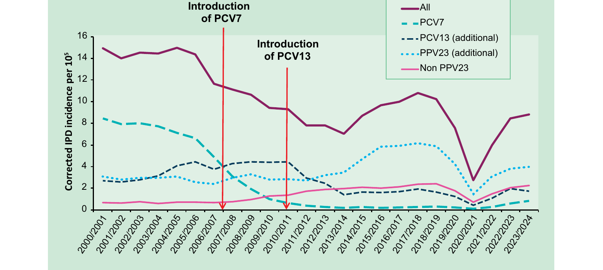

# Pneumococcal

PNEUMOCOCCAL MENINGITIS IS NOTIFIABLE

## The disease

Pneumococcal disease is the term used to describe infections caused by the bacterium _Streptococcus pneumoniae_ (also known as the pneumococcus).

_S. pneumoniae_ is an encapsulated Gram-positive coccus. The capsule is the most important virulence factor of _S. pneumoniae;_ pneumococci that lack the capsule are normally not virulent. Over 100 different capsular types have been characterized. Prior to the routine conjugate vaccination programme, around 69% of invasive pneumococcal infections were caused by the ten (14, 9V, 1, 8, 23F, 4, 3, 6B, 19F, 7F) most prevalent serotypes (Trotter _et al._, 2010).

Some pneumococcal serotypes may be carried in the nasopharynx without symptoms, with disease occurring in a small proportion of infected individuals. Other serotypes are rarely identified in the nasopharynx but are associated with invasive disease. The incubation period for pneumococcal disease is not clearly defined but it may be as short as one to three days. The organism may spread locally into the sinuses or middle ear cavity, causing sinusitis or otitis media. It may also affect the lungs to cause pneumonia or systemic (invasive) infections including bacteraemic pneumonia, septicaemia and meningitis.

Transmission is by aerosol, droplets or direct contact with respiratory secretions of someone carrying the organism. Transmission usually requires either frequent or prolonged close contact. There is a seasonal variation in pneumococcal disease, with peak levels in the winter months.

## History and epidemiology of the disease

Invasive pneumococcal disease (IPD) is a major cause of morbidity and mortality. In 2005/06, prior to routine pneumococcal conjugate vaccination, there were 6,346 IPD cases in England and Wales (Ladhani _et al_, 2018). IPD particularly affects the very young, the elderly, and those with impaired immunity and other underlying medical conditions. Recurrent infections may occur in association with skull defects, cerebrospinal fluid (CSF) leaks, cochlear implants or fractures of the skull.

There are several pneumococcal vaccines approved in the UK which provide protection against different serotypes (Table 25.1). The vaccines are inactivated, do not contain thiomersal and do not contain live organisms, so cannot cause the diseases against which they protect.

**Table 25.1. Pneumococcal vaccines available in the UK.**

| Vaccine type                                | Licensed vaccine                     | Serotypes covered                                                                               |
| ------------------------------------------- | ------------------------------------ | ----------------------------------------------------------------------------------------------- |
| Pneumococcal polysaccharide vaccine (PPV23) | Pneumococcal Polysaccharide Vaccine® | 1, 2, 3, 4, 5, 6B, 7F, 8, 9N, 9V, 10A, 11A, 12F, 14, 15B, 17F, 18C, 19F, 19A, 20, 22F, 23F, 33F |
| Pneumococcal conjugate vaccine (PCV20)      | Prevenar 20®                         | 1, 3, 4, 5, 6A, 6B, 7F, 8, 9V, 10A, 11A, 12F, 14, 15B, 18C, 19A, 19F, 22F, 23F, 33F             |
| Pneumococcal conjugate vaccine (PCV15)      | Vaxneuvance®                         | 1, 3, 4, 5, 6A, 6B, 7F, 9V, 14, 18C, 19A, 19F, 22F, 23F, 33F                                    |
| Pneumococcal conjugate vaccine (PCV13)      | Prevenar13®                          | 1, 3, 4, 5, 6A, 6B, 7F, 9V, 14, 18C, 19A, 19F, 23F                                              |

### Pneumococcal polysaccharide vaccine (PPV23)

PPV23 contains purified capsular polysaccharide from 23 common capsular types of pneumococcus. Most healthy adults develop a good antibody response to a single dose of PPV23 by the third week following immunisation. Children younger than two years of age show poor antibody responses to immunisation with PPV23 and there is no evidence of effectiveness of PPV23 in this age group (Grabenstein _et al._, 2017).

In the UK, PPV23 has been recommended for risk groups since 1992 and for all people aged 65 years and over since 2003. During the first two years after vaccination, PPV23 has a moderate short-term effectiveness of 41% against IPD caused by the vaccine serotypes in adults aged 65 years and over with vaccine effectiveness being higher among healthy individuals compared to those with underlying medical conditions (Djennad _et al_., 2019). There is some evidence for PPV23 offering protection against non-bacteraemic pneumococcal pneumonia (Diao _et al._, 2016).

### Pneumococcal conjugate vaccines (PCV)

PCVs have been developed using polysaccharides from the most common capsular types. Conjugating the polysaccharide to proteins, using similar manufacturing technology to that used successfully for _Haemophilus influenzae_ type b (Hib) and meningococcal conjugate vaccines, improves the antibody response, particularly in young children from two months of age.

In 2006, the UK introduced the 7-valent PCV (PCV7) into the infant immunisation programme at a 2+1 schedule (2 doses given at 8 and 16 weeks of age with a booster from 12 months of age), alongside a catch-up for all children up to 2 years of age. The programme achieved very high vaccine coverage (>90%) and resulted in a rapid and sustained reduction in IPD across all age groups due to the PCV7 serotypes. This was because the vaccine provided direct protection, as well as indirect (herd) protection achieved through the prevention of pneumococcal carriage in the vaccinated child's nasopharynx and onward transmission to others (Miller _et al._, 2011). This decline was partially offset by small increases in non-PCV7 type IPD across all age groups.

In April 2010, PCV13 replaced PCV7, which led to further reductions in IPD due to the additional 6 serotypes in PCV13 (Waight _et al._, 2015). Since 2013/14 an increase in overall incidence of IPD has been observed, largely due to increases in non-PCV13 serotypes (especially serotypes 8, 12F and 9N) and mainly in older age groups (Ladhani _et al._, 2018).

In January 2020, the UK moved to a 1+1 infant schedule, with vaccinations given at 12 weeks and 1 year of age (Goldblatt _et al._, 2018; Choi _et al._, 2019; Ladhani _et al._, 2020). In 2020/21, following the COVID-19 pandemic lockdown and restrictions, IPD incidence decreased by 65% across all age groups (Figure 25.1) (Amin-Chowdhury _et al._, 2022). As restrictions were eased, IPD incidence gradually increased, initially in young children then followed by older children and adults (Figure 25.1).

From 1st July 2025, the first PCV13 dose will be given at 16 weeks of age to allow for earlier administration of the second meningococcal B vaccine (4CMenB) dose at 12 weeks of age. Changing the PCV13 dose to 16 weeks, from 12 weeks, has the potential to provide infants with earlier protection against meningococcal disease (two doses at 8 and 12 weeks versus 8 and 16 weeks), without compromising pneumococcal protection because PCV13-type IPD is very rare in infants as a result of the excellent indirect (herd) protection offered by the current PCV programme. The second dose of PCV13 will continue to be given at 1 year of age.

PCV15 and PCV20 are licensed for use from 6 weeks of age. In February 2023, the JCVI considered the use of PCV15 in the childhood schedule and initially agreed that the available evidence indicated it could be used in a 1+1 schedule. PCV15 is currently not included in the UK national immunisation programme. In June 2023, the JCVI advised that either PPV23 or PCV20 could be used in the adult and at-risk programmes. PCV20 is expected to replace PPV23 in adults over 65 years and the at-risk programme in late 2025/early 2026.

PCV10 was previously licensed in the UK for use in infants and children from 6 weeks up to 5 years of age but was never included in the UK national immunisation programme.

Figure 25.1 Corrected IPD incidence in England between 2000/01 and 2023/24 by serotype group

## Presentation and Storage

Chapter 3 contains information on vaccine storage, distribution and disposal.

The summary of product characteristics (SPC) may give further detail on vaccine storage.

Information about the presentation of the vaccines currently authorised in the UK can be found in the SPCs, available at https://www.medicines.org.uk/emc.

### PCV13, PCV15, and PCV20

Storage can cause these vaccines to separate into a white deposit and clear supernatant. The vaccines should be shaken well to obtain a white homogeneous suspension and should not be used if there is any residual particulate matter after shaking.

### PPV23

The polysaccharide vaccine should be inspected before being given to check that it is clear and colourless.

## Dosage and schedule

### PCV13

For children and adults in risk groups, refer to Table 25.2 and the Risk Groups section below.

Routine immunisation for infants under one year of age:

- a single priming dose of 0.5ml of PCV13 at 16 weeks of age
- a booster dose of 0.5ml of PCV13 at one year of age (on or after their first birthday) given at the same time as the other vaccines recommended at that age (see Chapter 11)

Doses of any PCV given before 12 weeks of age should be discounted. The PCV dose at 16 weeks of age should then be given at the same time as the other vaccines recommended at that age.

Additional PCV13 doses are not recommended for routine immunisation but may be indicated for some risk groups (refer to Table 25.2 and Table 25.3 below).

### PPV23 and PCV20

Adults aged 65 years and over, and clinical risk groups aged 2 years or over:

- a single dose of 0.5ml of PPV23 or PCV20 (when available)

PCV20 is expected to replace PPV23 in adults over 65 years and the at-risk programme in late 2025/early 2026.

Children under 2 years of age with asplenia, splenic dysfunction, complement disorder or severe immunocompromise should also receive PCV20 (when available). See Table 25.3 for details.

Antibody levels are likely to decline rapidly in individuals with asplenia, splenic dysfunction (including sickle cell disease) or chronic renal disease (Giebink _et al._, 1981; Rytel _et al._, 1986) and, therefore, re-immunisation with PPV23 or PCV20 (when available) is recommended every five years in these groups. Testing of antibody levels prior to vaccination is not required for these or any other risk groups.

Revaccination with PPV23 or PCV20 is currently not recommended for any other clinical risk groups or age groups.

If an individual has already received PPV23 because they are in a clinical risk group, they do not require another dose at 65 years of age, irrespective of the interval since they received PPV23.

Whilst PPV23 is being supplied for the routine programme for adults aged 65 years and over, if an individual not in a risk group becomes eligible for PPV23 at age 65 years but has already received PCV20, PPV23 can still be offered at any interval after this but it is recommended that a minimum 4-week interval is observed.

Once PCV20 has replaced PPV23, if an individual has already received PCV20 because they are in a clinical risk group, they do not require another dose at 65 years of age, irrespective of the interval since they received PCV20.

## Administration

Chapter 4 covers guidance on administering vaccines.

Most injectable vaccines are routinely given intramuscularly into the deltoid muscle of the upper arm or, for infants 1 year and under, into the anterolateral aspect of the thigh.

Tetanus-containing vaccines can be given at the same time as any other vaccines required. The vaccines should be given at a separate site, preferably into a different limb. If given into the same limb, they should be given at least 2.5cm apart (American Academy of Pediatrics, 2021). The site at which each vaccine was given should be noted in the individual's records.

## Disposal

Chapter 3 outlines storage, distribution and disposal requirements for vaccines.

Equipment used for immunisation, including used vials, ampoules, or discharged vaccines in a syringe, should be disposed of safely in a UN-approved puncture-resistant 'sharps' box, according to local waste disposal arrangements and guidance in the technical memorandum 07-01: Safe and sustainable management of healthcare waste (NHS England).

## Individuals with unknown or incomplete vaccination histories

Unless there is a reliable history of previous immunisation, individuals should be assumed to be unimmunised. The full UK recommendations should be followed.

Unimmunised children who present late for vaccination before the age of one year should receive a single priming dose of PCV13, followed by a PCV13 booster at one year of age (on or after their first birthday) ideally allowing a minimum 4 week interval between the priming and booster dose to ensure appropriate boosting of the immune response. If the first PCV dose is given late (within 4 weeks of the first birthday) then a minimum interval of 4 weeks should be observed before the booster dose. However, if in the opinion of the healthcare professional, allowing an interval may lead to further delays in administration of the booster dose, then dose two can be administered after the child's first birthday, at any interval after the first dose to bring the child up to date with the UK schedule as soon as possible.

An unimmunised or partially immunised child aged between one and under two years of age should have a single dose of PCV13.

For a child in a clinical risk group, if their PCV dose in the routine programme is given very late (for example at 23 months), then a minimum interval of 4 weeks should be observed before giving a booster dose of PPV23 or PCV20 (when available).

Routine immunisation with PCV is not offered after the second birthday.

Any child less than one year of age and eligible for PCV vaccination who has received one or more doses of PCV10 in another country should be offered a dose of PCV13 after their last dose of PCV10 (allowing for a 4-week interval where possible) from 16 weeks of age and before their first birthday. This ensures that these infants are protected against the same pneumococcal serotypes as those vaccinated in the UK. These infants should then receive one PCV13 booster dose at one year of age (on or just after their first birthday), allowing a minimum 4 week interval between the two UK-administered PCV doses. Allowing a minimum 4 week interval will result in boosting of protection against the ten serotypes that are in both the PCV10 and PCV13 vaccines. However, if in the opinion of the healthcare professional, allowing an interval may lead to further delays in protection against the additional three strains, the vaccine may be administered at any interval to bring the child up to date with the UK schedule as soon as possible. If the child is over one year when they present for vaccination, they should be offered a single dose of PCV13.

## Risk groups

Children and adults in clinical risk groups (Table 25.2) will require additional pneumococcal vaccination depending on their age when first diagnosed with a clinical risk condition or presenting for vaccination, their vaccination status and underlying condition (see Table 25.3).

Primary care staff should identify patients for whom vaccine is recommended and use all opportunities to ensure that they are appropriately immunised, for example, when immunising against other diseases, at annual reviews or at other consultations, especially on discharge after hospital admission.

**Table 25.2 Clinical risk groups who should receive pneumococcal immunisation**

| Clinical risk group                                                                                         | Examples (decision based on clinical judgement)                                                                                                                                                                                                                                                                                                                                                                                                                                                                                                     |
| ----------------------------------------------------------------------------------------------------------- | --------------------------------------------------------------------------------------------------------------------------------------------------------------------------------------------------------------------------------------------------------------------------------------------------------------------------------------------------------------------------------------------------------------------------------------------------------------------------------------------------------------------------------------------------- |
| Asplenia or dysfunction of the spleen                                                                       | This also includes individuals with coeliac disease who are diagnosed with splenic dysfunction and all haemoglobinopathies including homozygous sickle cell disease                                                                                                                                                                                                                                                                                                                                                                                 |
| Chronic respiratory disease (chronic respiratory disease refers to chronic lower respiratory tract disease) | This includes chronic obstructive pulmonary disease (COPD), including chronic bronchitis and emphysema; and such conditions as bronchiectasis, cystic fibrosis, interstitial lung fibrosis, pneumoconiosis and bronchopulmonary dysplasia (BPD). Individuals in whom respiratory function may be compromised due to neurological or neuromuscular disease (such as cerebral palsy). Asthma is not an indication, unless so severe as to require continuous or frequently repeated use of systemic steroids (as defined in Immunosuppression below). |
| Chronic heart disease                                                                                       | This includes those requiring regular medication and/or follow-up for ischaemic heart disease, congenital heart disease, hypertension with cardiac complications, and chronic heart failure.                                                                                                                                                                                                                                                                                                                                                        |
| Chronic kidney disease                                                                                      | Nephrotic syndrome, chronic kidney disease at stages 4 and 5 and those on kidney dialysis or with kidney transplantation.                                                                                                                                                                                                                                                                                                                                                                                                                           |
| Chronic liver disease                                                                                       | This includes cirrhosis, biliary atresia and chronic hepatitis.                                                                                                                                                                                                                                                                                                                                                                                                                                                                                     |
| Diabetes                                                                                                    | Diabetes mellitus requiring insulin or anti-diabetic medication. This does not include diabetes that is only diet controlled.                                                                                                                                                                                                                                                                                                                                                                                                                       |
| Immunosuppression                                                                                           | Due to disease or treatment, including patients undergoing chemotherapy leading to immunosuppression, bone marrow transplant, asplenia or splenic dysfunction, complement disorder, HIV infection at all stages, multiple myeloma or genetic disorders affecting the immune system (such as IRAK-4, NEMO). Individuals on or likely to be on systemic steroids for more than a month at a dose equivalent to prednisolone at 20mg or more per day (any age), or for children under 20kg, a dose of 1mg or more per kg per day.                      |
| Individuals with cochlear implants                                                                          | It is important that immunisation does not delay the cochlear implantation.                                                                                                                                                                                                                                                                                                                                                                                                                                                                         |
| Individuals with cerebrospinal fluid leaks                                                                  | This includes leakage of cerebrospinal fluid such as following trauma or major skull surgery (does not include CSF shunts).                                                                                                                                                                                                                                                                                                                                                                                                                         |
| Occupational risk                                                                                           | Please see page 10.                                                                                                                                                                                                                                                                                                                                                                                                                                                                                                                                 |

**Table 25.3 -- Summary of vaccine doses for individuals in a clinical risk group**

| Patients age when presenting or first diagnosed with a clinical risk condition | At clinical risk (excluding those with asplenia, splenic dysfunction, complement disorder or severe immunocompromise^1^)                                                                                 |                                                                                   | Asplenia, splenic dysfunction, complement disorder or severe immunocompromise^1^                                                                                                                                                                                                                                                                                                                                                                       |                                                                                   |
| ------------------------------------------------------------------------------ | -------------------------------------------------------------------------------------------------------------------------------------------------------------------------------------------------------- | --------------------------------------------------------------------------------- | ------------------------------------------------------------------------------------------------------------------------------------------------------------------------------------------------------------------------------------------------------------------------------------------------------------------------------------------------------------------------------------------------------------------------------------------------------ | --------------------------------------------------------------------------------- |
|                                                                                | PCV13                                                                                                                                                                                                    | Booster from 2 years of age                                                       | PCV13                                                                                                                                                                                                                                                                                                                                                                                                                                                  | Booster from 2 years of age                                                       |
| Infants from birth to one year of age                                          | Routine PCV13 at 16 weeks and one year (on or after first birthday).                                                                                                                                     | PPV23 or PCV20 (when available) at 2 years, at least 4 weeks after last PCV dose. | Two PCV13 doses or two PCV20 doses (when available) at least 4 weeks apart (commencing with their first visit at 8 weeks of age, or as soon as possible thereafter). Infants diagnosed after 16 weeks who have already received PCV13 should receive two doses of PCV20 (when available) with an interval of at least 4 weeks between any doses. Routine PCV13 booster or PCV20 booster (when available) at one year (on or after the first birthday). | PPV23 or PCV20 (when available) at 2 years, at least 4 weeks after last PCV dose. |
| One year to two years of age                                                   | Routine PCV13 booster at one year (on or after first birthday, irrespective of whether PCV was received under one year of age).                                                                          | PPV23 or PCV20 (when available) at 2 years, at least 4 weeks after last PCV dose. | Routine PCV13 booster or PCV20 booster (when available) at one year (on or after the first birthday). If routine PCV13 booster at one year (on or after the first birthday) already given, then give PCV20 (when available) at least 4 weeks later.                                                                                                                                                                                                    | PPV23 or PCV20 (when available) at 2 years, at least 4 weeks after last PCV dose. |
| Two years onwards                                                              | No further PCV13 required irrespective of previous PCV vaccination history (if this was not received under 2 years of age, it does not need to be given prior to giving PPV23 or PCV20, when available). | One PPV23 or one PCV20 (when available).                                          | Asplenia, splenic dysfunction or complement disorder: No further PCV required. Severely immunocompromised: one PCV13 or PCV20 (when available).                                                                                                                                                                                                                                                                                                        | PPV23 or PCV20 (when available) at least 4 weeks after last PCV dose.             |

^1^ Examples of severe immunocompromise include bone marrow transplant patients, patients with acute and chronic leukaemia, multiple myeloma or genetic disorders affecting the immune system (such as IRAK-4, NEMO). Note that bone marrow transplant recipients will require two doses of PCV13 or PCV20 (when available) given at a minimum 4 week interval, followed by PPV23 or PCV20 (when available) at least 8 weeks later.

### Timing of vaccination for those requiring splenectomy or commencing immunosuppressive treatment

Because of the high risk of overwhelming infection, particularly for pneumococcal disease, vaccination is recommended for all individuals with asplenia or splenic dysfunction, including individuals with coeliac disease who are diagnosed with splenic dysfunction and all individuals with haemoglobinopathies such as homozygous sickle cell disease. See Chapter 7 for a complete schedule including other vaccines indicated for this group.

Those requiring splenectomy or commencing immunosuppressive treatment should be vaccinated according to the age-specific advice above. Ideally, the vaccines should be given 4-6 weeks before elective splenectomy or initiation of treatment such as chemotherapy or radiotherapy. Where this is not possible, it can be given up to two weeks before treatment. If it is not possible to vaccinate beforehand, splenectomy, chemotherapy or radiotherapy should never be delayed.

If it is not practicable to vaccinate two weeks before splenectomy, immunisation should be delayed until at least two weeks after the operation because functional antibody responses may be better from this time (Shatz _et al._, 1998). If it is not practicable to vaccinate two weeks before starting chemotherapy/radiotherapy, immunisation should be delayed until at least three months after completion of therapy to maximise vaccine response.

Immunisation of these patients should not be delayed if this is likely to result in a failure to vaccinate.

For leukaemia patients, pneumococcal vaccination should be given according to their age from six months after completion of chemotherapy (Table 25.3). Bone marrow transplant patients will require additional different vaccines including pneumococcal vaccination. They should be offered two doses of PCV13 or PCV20 (when available) at a minimum interval of 4 weeks followed by PCV20 (when available) or PPV23 at least 4 weeks later. Vaccination should begin 9 to 12 months following transplantation.

### Individuals at occupational risk

There is an association between exposure to metal fumes and pneumonia, particularly lobar pneumonia, and between welding and invasive pneumococcal disease (Wong _et al._, 2010). PPV23 or PCV20 (when available) (single dose for those who have not received PPV23 or PCV20 previously) should be considered for those at risk of frequent or continuous occupational exposure to metal fumes (such as welders) taking into account the exposure control measures in place.

Vaccination may reduce the risk of pneumococcal disease but should not replace the need for measures to prevent or reduce exposure.

## Contraindications

There are very few individuals who cannot receive pneumococcal vaccines. When there is doubt, appropriate advice should be sought from the relevant specialist consultant, the local Screening and Immunisation Team, or local Health Protection Team rather than withholding vaccine. The risk to the individual of not being immunised must be taken into account.

The vaccines should not be given to those who have had:

- a confirmed anaphylactic reaction to a previous dose of a pneumococcal vaccine
- a confirmed anaphylactic reaction to any component or residue from the manufacturing process

Specific advice on management of individuals who have had an allergic reaction can be found in Chapter 8.

## Precautions

Chapter 6 contains information on contraindications and special considerations for vaccination.

Minor illnesses, without fever or systemic upset, are not valid reasons to postpone immunisation. If an individual is acutely unwell, immunisation may be postponed until they have fully recovered. This is to avoid confusing the differential diagnosis of any acute illness by wrongly attributing any signs or symptoms to the adverse effects of the vaccine.

Chapter 8 covers vaccine safety and the management of adverse events following immunisation.

### Pregnancy and breast-feeding

Pneumococcal vaccines may be given to pregnant women when the need for protection is required without delay. There is no evidence of risk from vaccinating pregnant women or those who are breast-feeding with inactivated viral or bacterial vaccines or toxoids (Plotkin _et al_, 2018).

### Premature infants

Premature infants should be offered pneumococcal vaccination at the appropriate chronological age. They do not require additional doses unless they have a condition which places them in a clinical risk group (see Table 25.2). See Chapter 11 and Chapter 7 for more information.

### Immunosuppression and HIV infection

Individuals with immunosuppression and HIV infection (regardless of CD4 count) should be given pneumococcal vaccines according to the recommendations above. The potential benefit of PPV23 (and PCV20 when available) in preventing pneumococcal disease outweighs any potential risks in HIV- infected adults.

## Adverse reactions

Chapter 8 covers vaccine safety and the management of adverse events following immunisation.

Anyone can report a suspected adverse reaction to the Medical and Healthcare products Regulatory Agency (MHRA) using the Yellow Card reporting scheme (https://yellowcard.mhra.gov.uk/).

Reports of all adverse reactions reported following pneumococcal vaccination can be found in the summary of product characteristics available at https://www.medicines.org.uk.

### PCV13

The most commonly reported adverse reactions in clinical trials in children 6 weeks to 5 years of age were vaccination-site reactions, fever, irritability, decreased appetite, and increased and/or decreased sleep.

### PCV15

In infants and children aged 6 weeks to less than 2 years the most commonly reported adverse reactions in clinical trials were fever, irritability, somnolence, vaccination site reactions, and decreased appetite.

### PCV20

Irritability, drowsiness/increased sleep, decreased appetite, fever and vaccination site reactions were the most commonly reported reactions in children in clinical trials. In adults, the most commonly reported reactions were pain at the injection site, muscle pain, fatigue, headache and joint pain.

### PPV23

Mild soreness and induration at the site of injection lasting one to three days and, less commonly, a low-grade fever may occur. More severe systemic reactions are infrequent. In general, local and systemic reactions are more common in people with higher concentrations of antibodies to pneumococcal polysaccharides.

## Management of cases, contacts and outbreaks

### Cases of invasive pneumococcal disease (IPD)

Any case of IPD or lobar pneumonia believed to be due to _S. pneumoniae_ should prompt a review of the patient's medical history to establish whether they are in a recognised risk group and whether they have been appropriately immunised. Unimmunised or partially-immunised individuals should be vaccinated upon discharge from hospital whenever possible.

### Cases in children under five years of age

Clinicians should ensure that children diagnosed with IPD have completed the recommended national immunisation schedule. Infants who are younger than 12 months of age at the time of IPD and who are unvaccinated or partially vaccinated should complete the recommended immunisation schedule.

Isolates from all cases of IPD should be referred to the national reference laboratory for serotyping. All new cases of IPD in children aged less than 5 years, regardless of serotype, will be followed up by the UK Health Security Agency, Public Health Wales, Public Health Scotland or the Public Health Agency for Northern Ireland.

### Contacts

Close contacts of IPD are not normally at an increased risk of pneumococcal infection and therefore antibiotic prophylaxis is not indicated. Clusters of IPD should be discussed with local health protection teams.

### Outbreaks

Outbreaks of pneumococcal respiratory disease in hospitals and residential care homes need prompt investigation. Control measures including vaccination may be appropriate; these should be agreed in discussion with local health protection or infection control teams. For further information see the UK guidelines for the public health management of clusters of serious pneumococcal disease in closed settings (Public Health England, 2020) available at: https://www.gov.uk/government/collections/pneumococcal-disease-guidance-data-and-analysis.

## Supplies

- 13-valent PCV (Prevenar 13®) is manufactured by Pfizer Limited (Medical Information website: https://www.pfizermedicalinformation.co.uk, tel: 01304 616161)
- 15-valent PCV (Vaxneuvance®) is manufactured by MSD. MSD vaccines are distributed by Alliance Healthcare 0330 100 0448
  - Alliance Healthcare Customer Services
  - Telephone: 0330 100 0448
  - Email: customerservice@alliance-healthcare.co.uk
- 23-valent Pneumococcal Polysaccharide Vaccine is manufactured by MSD. Order Pneumovax23 via ImmForm for GP practices. For locally commissioned pharmacies who are supporting the national PPV23 immunisation programme and for private providers MSD vaccines are distributed by Alliance Healthcare 0330 100 0448
- 20-valent PCV (Prevenar20®) is manufactured by Pfizer Limited (Medical Information website: https://www.pfizermedicalinformation.co.uk, tel: 01304 616161)

PCV13 and PPV23 (and PCV20 when available) to support the routine immunisation programmes are currently centrally supplied, for more information please see Chapter 3.

## Information materials

A patient card and information sheet for asplenic and hyposplenic patients are available from: https://www.gov.uk/government/publications/splenectomy-leaflet-and-card

Or in Scotland, the leaflet '_A guide for people without a working spleen_,' and patient card are available from:

https://publichealthscotland.scot/publications/a-guide-for-people-without-a-working-spleen/

Or in Wales a leaflet '_A guide for people without a working spleen'_ and a patient card are available from:

https://111.wales.nhs.uk/pdfs/WGSpleenE.pdf

In Northern Ireland, '_Splenectomy factsheet for health professionals_', '_Splenectomy patient leaflet_' and a Splenectomy wallet card for patients are available from The Public Health Agency:

https://www.publichealth.hscni.net/publications/splenectomy-factsheet-health-professionals-0

https://www.publichealth.hscni.net/publications/splenectomy-patient-leaflet
http://www.publichealth.hscni.net/publications/splenectomy-wallet-card

## References

American Academy of Pediatrics (2021) Active immunization. In: Kimberlin DW, Barnett ED, Lynfield R, Sawyer MH, eds. Red Book: 2021 Report of the Committee on Infectious Diseases. 32nd edition. Itasca, IL: American Academy of Pediatrics: 2021, p28.

Amin-Chowdhury Z, Bertran M, Sheppard CL, _et al_. (2022) Does the rise in seasonal respiratory viruses foreshadow the return of invasive pneumococcal disease this winter. _Lancet Resp Med_ 10 (1); e1-e2

Choi YH, Andrews N, Miller E. Estimated impact of revising the 13-valent pneumococcal conjugate vaccine schedule from 2+1 to 1+1 in England and Wales: A modelling study. PLoS Med. 2019 Jul 3;16(7):e1002845.

Diao WQ, Shen N, Yu PX _et al_. (2016) Efficacy of 23-valent pneumococcal polysaccharide vaccine in preventing community-acquired pneumonia among immunocompetent adults: A systematic review and meta-analysis of randomized trials. Vaccine. 2016 Mar 18;34(13):1496-1503.

Djennad A, Ramsay ME, Pebody R _et al_. (2019) Effectiveness of 23-Valent Polysaccharide Pneumococcal Vaccine and Changes in Invasive Pneumococcal Disease Incidence from 2000 to 2017 in Those Aged 65 and Over in England and Wales. EClinicalMedicine. 2019 Jan 2;6:42-50.

Giebink GS, Le CT, Cosio FG _et al_. (1981) Serum antibody responses of high-risk children and adults to vaccination with capsular polysaccharides of _Streptococcus pneumoniae_. _Rev Infect Dis_ **3**:168--78.

Goldblatt D, Southern J, Andrews N _et al_. Pneumococcal conjugate vaccine 13 delivered as one primary and one booster dose (1 + 1) compared with two primary doses and a booster (2 + 1) in UK infants: a multicentre, parallel group randomised controlled trial. Lancet Infect Dis. 2018 Feb;18(2):171-179.

Grabenstein JD and Musher DM (2018) Pneumococcal Polysaccharide Vaccines. In: Plotkin SA, Orenstein WA, Offit PA and Edwards KM (eds) _Vaccine_, 7th edition. Philadelphia, PA : Elsevier, [2018]

Industrial Injuries Advisory Council (2010) Lobar pneumonia in welders. _Information Note_. Nov 2010 https://www.gov.uk/government/publications/lobar-pneumonia-in-welders-iiac-information-note

Ladhani SN, Collins S, Djennad A _et al_. Rapid increase in non-vaccine serotypes causing invasive pneumococcal disease in England and Wales, 2000-17: a prospective national observational cohort study. Lancet Infect Dis. 2018 Apr;18(4):441-451.

Ladhani SN, Andrews N, Ramsay ME. Summary of evidence to reduce the two-dose infant priming schedule to a single dose of the 13-valent pneumococcal conjugate vaccine in the national immunisation programme in the UK. _Lancet Infect Dis_ 2020;21(4):E93-E102.

Miller E, Andrews NJ, Waight PA _et al_. Herd immunity and serotype replacement 4 years after seven-valent pneumococcal conjugate vaccination in England and Wales: an observational cohort study. _Lancet Infect Dis_ 2011;**11**(10):760-8.

Plotkin SA, Orenstein WA Offit PA and Edwards KM, (eds) (2018) _Vaccines_, 7th edition. Philadelphia, PA : Elsevier, [2018], Chapter 9.

Public Health England (2020) https://www.gov.uk/government/publications/managing-clusters-of-pneumococcal-disease-in-closed-settings

Rytel MW, Dailey MP, Schiffman G _et al_. (1986) Pneumococcal vaccine in immunization of patients with renal impairment. _Proc Soc Exp Biol Med_ **182**: 468--73.

Shatz DV, Schinsky MF, Pais LB _et al_. (1998) Immune responses of splenectomized trauma patients to the 23-valent pneumococcal polysaccharide vaccine at 1 versus 7 versus 14 days after splenectomy. _J Trauma_ **44**: 760--5.

Trotter CL, Waight P, Andrews NJ, Slack M, Efstratiou A, George R, Miller E. Epidemiology of invasive pneumococcal disease in the pre-conjugate vaccine era: England and Wales, 1996-2006. J Infect. 2010 Mar;60(3):200-8.

Waight PA, Andrews NJ, Ladhani SN _et al_. Effect of the 13-valent pneumococcal conjugate vaccine on invasive pneumococcal disease in England and Wales 4 years after its introduction: an observational cohort study. Lancet Infect Dis 2015 15(5):535-43

Wong _et al_. (2010) Welders are at increased risk for invasive pneumococcal disease. _Int. J. Infect. Dis_ e796-9.
